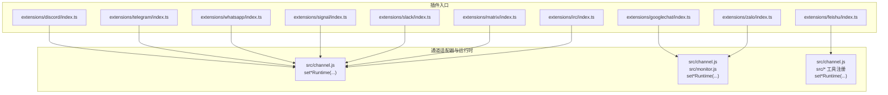
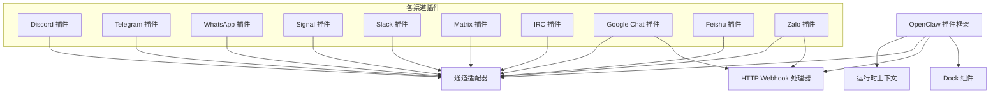
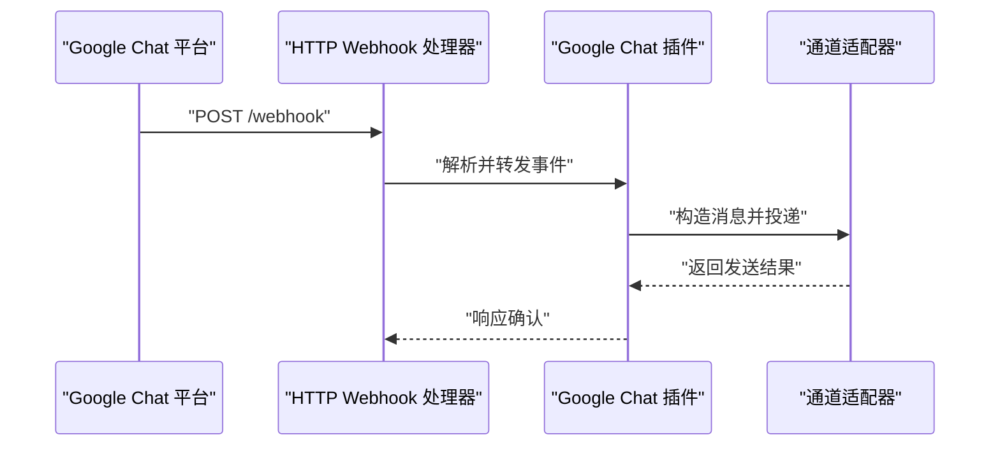
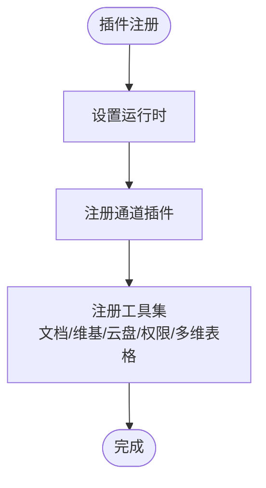
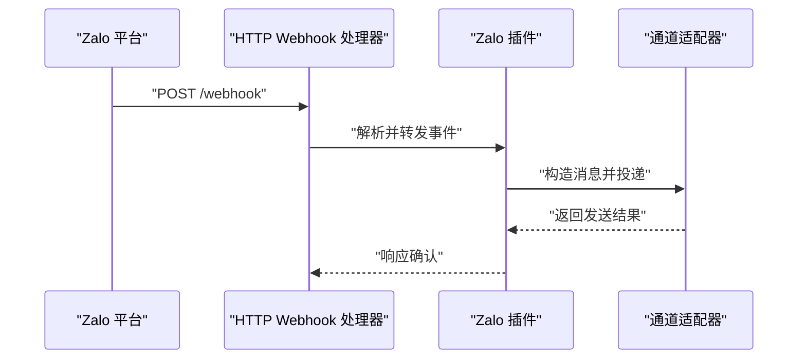
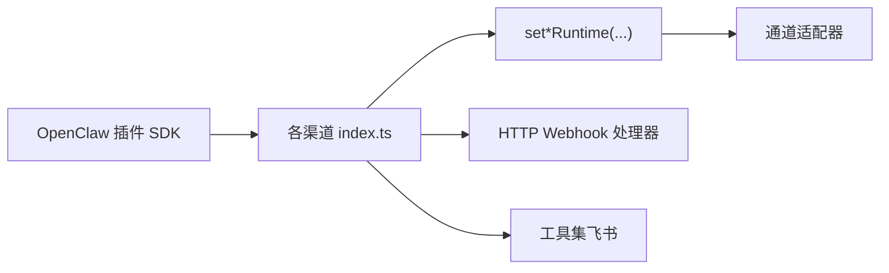

# 消息渠道插件

<cite>
**本文引用的文件**
- [extensions/discord/index.ts](file://extensions/discord/index.ts)
- [extensions/telegram/index.ts](file://extensions/telegram/index.ts)
- [extensions/whatsapp/index.ts](file://extensions/whatsapp/index.ts)
- [extensions/signal/index.ts](file://extensions/signal/index.ts)
- [extensions/slack/index.ts](file://extensions/slack/index.ts)
- [extensions/matrix/index.ts](file://extensions/matrix/index.ts)
- [extensions/irc/index.ts](file://extensions/irc/index.ts)
- [extensions/googlechat/index.ts](file://extensions/googlechat/index.ts)
- [extensions/feishu/index.ts](file://extensions/feishu/index.ts)
- [extensions/zalo/index.ts](file://extensions/zalo/index.ts)
</cite>

## 目录

1. [简介](#简介)
2. [项目结构](#项目结构)
3. [核心组件](#核心组件)
4. [架构总览](#架构总览)
5. [详细组件分析](#详细组件分析)
6. [依赖关系分析](#依赖关系分析)
7. [性能考虑](#性能考虑)
8. [故障排除指南](#故障排除指南)
9. [结论](#结论)
10. [附录](#附录)

## 简介

本文件系统性梳理 OpenClaw 的消息渠道插件体系，覆盖 Telegram、Discord、WhatsApp、Signal、Slack、Matrix、IRC、Google Chat、飞书（Feishu/Lark）与 Zalo 等主流即时通讯平台。文档从插件注册流程、运行时注入、通道适配器、HTTP 钩子与工具集等维度，解释各渠道插件的实现架构与功能特性；并结合仓库内现有文档与插件入口，给出配置、错误处理与扩展开发建议。

## 项目结构

各渠道插件均采用统一的插件入口模式：在各自插件目录下的 index.ts 中完成：

- 导入通道适配器与运行时设置函数
- 定义插件元数据（id、name、description）
- 注册空配置模式（emptyPluginConfigSchema）
- 在 register 回调中设置运行时并注册通道插件
- 部分插件同时注册 HTTP Webhook 处理器或额外工具集

图表来源

- [extensions/discord/index.ts](file://extensions/discord/index.ts#L1-L18)
- [extensions/telegram/index.ts](file://extensions/telegram/index.ts#L1-L18)
- [extensions/whatsapp/index.ts](file://extensions/whatsapp/index.ts#L1-L18)
- [extensions/signal/index.ts](file://extensions/signal/index.ts#L1-L18)
- [extensions/slack/index.ts](file://extensions/slack/index.ts#L1-L18)
- [extensions/matrix/index.ts](file://extensions/matrix/index.ts#L1-L18)
- [extensions/irc/index.ts](file://extensions/irc/index.ts#L1-L18)
- [extensions/googlechat/index.ts](file://extensions/googlechat/index.ts#L1-L20)
- [extensions/feishu/index.ts](file://extensions/feishu/index.ts#L1-L64)
- [extensions/zalo/index.ts](file://extensions/zalo/index.ts#L1-L20)

章节来源

- [extensions/discord/index.ts](file://extensions/discord/index.ts#L1-L18)
- [extensions/telegram/index.ts](file://extensions/telegram/index.ts#L1-L18)
- [extensions/whatsapp/index.ts](file://extensions/whatsapp/index.ts#L1-L18)
- [extensions/signal/index.ts](file://extensions/signal/index.ts#L1-L18)
- [extensions/slack/index.ts](file://extensions/slack/index.ts#L1-L18)
- [extensions/matrix/index.ts](file://extensions/matrix/index.ts#L1-L18)
- [extensions/irc/index.ts](file://extensions/irc/index.ts#L1-L18)
- [extensions/googlechat/index.ts](file://extensions/googlechat/index.ts#L1-L20)
- [extensions/feishu/index.ts](file://extensions/feishu/index.ts#L1-L64)
- [extensions/zalo/index.ts](file://extensions/zalo/index.ts#L1-L20)

## 核心组件

- 插件注册器：所有渠道插件通过 index.ts 导出默认插件对象，包含 id、name、description、configSchema 与 register 回调。
- 运行时注入：register 内部调用 set\*Runtime(api.runtime)，将运行时上下文注入到对应通道模块。
- 通道适配器：通过 api.registerChannel({ plugin }) 注册具体通道实现；部分插件还注册 dock 与 HTTP 处理器。
- 工具集与扩展：飞书插件额外导出并注册多种工具（文档、维基、云盘、权限、多维表格），体现其生态能力。

章节来源

- [extensions/discord/index.ts](file://extensions/discord/index.ts#L6-L15)
- [extensions/telegram/index.ts](file://extensions/telegram/index.ts#L6-L15)
- [extensions/whatsapp/index.ts](file://extensions/whatsapp/index.ts#L6-L15)
- [extensions/signal/index.ts](file://extensions/signal/index.ts#L6-L15)
- [extensions/slack/index.ts](file://extensions/slack/index.ts#L6-L15)
- [extensions/matrix/index.ts](file://extensions/matrix/index.ts#L6-L15)
- [extensions/irc/index.ts](file://extensions/irc/index.ts#L6-L15)
- [extensions/googlechat/index.ts](file://extensions/googlechat/index.ts#L7-L16)
- [extensions/feishu/index.ts](file://extensions/feishu/index.ts#L47-L61)
- [extensions/zalo/index.ts](file://extensions/zalo/index.ts#L7-L16)

## 架构总览

下图展示 OpenClaw 插件框架与各渠道插件的交互关系：插件入口负责注册与运行时注入，通道适配器承载消息收发逻辑，部分插件通过 HTTP 钩子接收外部事件。

图表来源

- [extensions/discord/index.ts](file://extensions/discord/index.ts#L11-L14)
- [extensions/telegram/index.ts](file://extensions/telegram/index.ts#L11-L14)
- [extensions/whatsapp/index.ts](file://extensions/whatsapp/index.ts#L11-L14)
- [extensions/signal/index.ts](file://extensions/signal/index.ts#L11-L14)
- [extensions/slack/index.ts](file://extensions/slack/index.ts#L11-L14)
- [extensions/matrix/index.ts](file://extensions/matrix/index.ts#L11-L14)
- [extensions/irc/index.ts](file://extensions/irc/index.ts#L11-L14)
- [extensions/googlechat/index.ts](file://extensions/googlechat/index.ts#L12-L16)
- [extensions/feishu/index.ts](file://extensions/feishu/index.ts#L52-L61)
- [extensions/zalo/index.ts](file://extensions/zalo/index.ts#L12-L16)

## 详细组件分析

### Discord 插件

- 注册流程：设置运行时后注册通道插件。
- 认证机制：插件入口未显式声明认证参数，通常由通道适配器内部管理令牌或会话。
- 消息路由：通过通道适配器实现频道/私聊消息的收发。
- 媒体处理：媒体发送能力取决于通道实现。
- 特殊功能：无额外工具集或 HTTP 钩子。
- 配置项：使用空配置模式，无需用户配置。
- 错误处理：通道适配器内部处理网络与协议异常。
- 扩展建议：可按需增加速率限制与重试策略。

章节来源

- [extensions/discord/index.ts](file://extensions/discord/index.ts#L1-L18)

### Telegram 插件

- 注册流程：设置运行时后注册通道插件。
- 认证机制：通过 Bot Token 或会话令牌进行鉴权。
- 消息路由：支持群组与私聊消息路由。
- 媒体处理：支持图片、视频、文件等多媒体发送。
- 特殊功能：无额外工具集或 HTTP 钩子。
- 配置项：使用空配置模式。
- 错误处理：通道适配器内部处理 API 错误与网络异常。
- 扩展建议：增加并发控制与消息去重。

章节来源

- [extensions/telegram/index.ts](file://extensions/telegram/index.ts#L1-L18)

### WhatsApp 插件

- 注册流程：设置运行时后注册通道插件。
- 认证机制：基于业务侧凭证（如 Meta 开放平台凭据）。
- 消息路由：支持文本、图片、语音、视频等消息类型。
- 媒体处理：具备上传与发送媒体的能力。
- 特殊功能：无额外工具集或 HTTP 钩子。
- 配置项：使用空配置模式。
- 错误处理：通道适配器内部处理速率限制与状态码。
- 扩展建议：增加队列与幂等写入。

章节来源

- [extensions/whatsapp/index.ts](file://extensions/whatsapp/index.ts#L1-L18)

### Signal 插件

- 注册流程：设置运行时后注册通道插件。
- 认证机制：基于 Signal 协议的设备或账户凭证。
- 消息路由：支持一对一与群组消息。
- 媒体处理：支持图片、视频、文件等媒体发送。
- 特殊功能：无额外工具集或 HTTP 钩子。
- 配置项：使用空配置模式。
- 错误处理：通道适配器内部处理网络与协议异常。
- 扩展建议：增加重连与断线恢复。

章节来源

- [extensions/signal/index.ts](file://extensions/signal/index.ts#L1-L18)

### Slack 插件

- 注册流程：设置运行时后注册通道插件。
- 认证机制：基于 Workspace App 或 Bot Token。
- 消息路由：支持频道、私聊与群组消息。
- 媒体处理：支持图片、文件上传与富文本消息。
- 特殊功能：无额外工具集或 HTTP 钩子。
- 配置项：使用空配置模式。
- 错误处理：通道适配器内部处理权限与速率限制。
- 扩展建议：增加批量发送与消息更新。

章节来源

- [extensions/slack/index.ts](file://extensions/slack/index.ts#L1-L18)

### Matrix 插件

- 注册流程：设置运行时后注册通道插件。
- 认证机制：基于 homeserver 的访问令牌或应用服务。
- 消息路由：支持房间消息与私信。
- 媒体处理：支持图片、视频、文件上传。
- 特殊功能：无额外工具集或 HTTP 钩子。
- 配置项：使用空配置模式。
- 错误处理：通道适配器内部处理同步与状态码。
- 扩展建议：增加增量同步与离线消息处理。

章节来源

- [extensions/matrix/index.ts](file://extensions/matrix/index.ts#L1-L18)

### IRC 插件

- 注册流程：设置运行时后注册通道插件。
- 认证机制：支持 SASL、TLS 与服务器密码。
- 消息路由：支持频道与私聊消息。
- 媒体处理：以文本为主，媒体能力有限。
- 特殊功能：无额外工具集或 HTTP 钩子。
- 配置项：使用空配置模式。
- 错误处理：通道适配器内部处理连接与编码问题。
- 扩展建议：增加自动重连与编码转换。

章节来源

- [extensions/irc/index.ts](file://extensions/irc/index.ts#L1-L18)

### Google Chat 插件

- 注册流程：设置运行时后注册通道插件，并注册 Dock 与 HTTP Webhook 处理器。
- 认证机制：基于 Google Workspace 凭证与 OAuth。
- 消息路由：支持空间聊天与直接聊天。
- 媒体处理：支持图片与富文本卡片。
- 特殊功能：通过 HTTP 钩子接收事件并驱动消息流转。
- 配置项：使用空配置模式。
- 错误处理：HTTP 处理器与通道适配器共同处理事件与 API 异常。
- 扩展建议：增加事件幂等与失败重试。

图表来源

- [extensions/googlechat/index.ts](file://extensions/googlechat/index.ts#L12-L16)

章节来源

- [extensions/googlechat/index.ts](file://extensions/googlechat/index.ts#L1-L20)

### 飞书（Feishu/Lark）插件

- 注册流程：设置运行时后注册通道插件，并注册多项工具集（文档、维基、云盘、权限、多维表格）。
- 认证机制：基于应用凭证与用户授权。
- 消息路由：支持文本、卡片、富文本消息。
- 媒体处理：支持图片、文件上传与媒体发送。
- 特殊功能：导出并注册多种企业级工具，涵盖文档协作与权限管理。
- 配置项：使用空配置模式。
- 错误处理：工具集与通道适配器分别处理业务与网络异常。
- 扩展建议：增加工具调用缓存与权限预检查。

图表来源

- [extensions/feishu/index.ts](file://extensions/feishu/index.ts#L52-L61)

章节来源

- [extensions/feishu/index.ts](file://extensions/feishu/index.ts#L1-L64)

### Zalo 插件

- 注册流程：设置运行时后注册通道插件，并注册 Dock 与 HTTP Webhook 处理器。
- 认证机制：基于 Bot API 凭证。
- 消息路由：支持群组与私聊消息。
- 媒体处理：支持图片、视频、文件等媒体发送。
- 特殊功能：通过 HTTP 钩子接收事件并驱动消息流转。
- 配置项：使用空配置模式。
- 错误处理：HTTP 处理器与通道适配器共同处理事件与 API 异常。
- 扩展建议：增加事件去重与失败重试。

图表来源

- [extensions/zalo/index.ts](file://extensions/zalo/index.ts#L12-L16)

章节来源

- [extensions/zalo/index.ts](file://extensions/zalo/index.ts#L1-L20)

## 依赖关系分析

- 共同依赖：各插件均依赖插件 SDK 的 emptyPluginConfigSchema 与 registerChannel 能力。
- 运行时耦合：通过 set\*Runtime 将运行时注入通道模块，确保日志、网络与调度能力可用。
- 额外集成：Google Chat 与 Zalo 插件额外注册 HTTP Webhook 处理器；飞书插件注册多个工具集。
- 低耦合设计：通道适配器对上层屏蔽底层协议差异，便于扩展新渠道。

图表来源

- [extensions/discord/index.ts](file://extensions/discord/index.ts#L1-L18)
- [extensions/telegram/index.ts](file://extensions/telegram/index.ts#L1-L18)
- [extensions/whatsapp/index.ts](file://extensions/whatsapp/index.ts#L1-L18)
- [extensions/signal/index.ts](file://extensions/signal/index.ts#L1-L18)
- [extensions/slack/index.ts](file://extensions/slack/index.ts#L1-L18)
- [extensions/matrix/index.ts](file://extensions/matrix/index.ts#L1-L18)
- [extensions/irc/index.ts](file://extensions/irc/index.ts#L1-L18)
- [extensions/googlechat/index.ts](file://extensions/googlechat/index.ts#L1-L20)
- [extensions/feishu/index.ts](file://extensions/feishu/index.ts#L1-L64)
- [extensions/zalo/index.ts](file://extensions/zalo/index.ts#L1-L20)

## 性能考虑

- 并发与限流：对各渠道 API 的速率限制进行统一收敛，避免触发平台限流。
- 缓存与去重：对重复事件与消息进行去重，减少无效调用。
- 批量发送：对 Slack、Google Chat 等支持批量的渠道启用批量发送。
- 断线重连：对 Signal、Matrix 等长连接通道实现指数退避重连。
- 资源池化：对网络与数据库连接进行池化管理，降低抖动。

## 故障排除指南

- 认证失败
  - 检查 Bot Token/凭证是否正确且未过期。
  - 确认权限范围与安装状态（尤其 Google Chat、飞书）。
- 消息未送达
  - 查看通道适配器日志中的 API 返回码与错误信息。
  - 对于 Google Chat/Zalo，确认 HTTP Webhook 地址可达且签名验证通过。
- 媒体发送异常
  - 核对文件大小与格式限制，必要时压缩或转码。
  - 分片上传或分批发送大文件。
- 速率限制
  - 实施令牌桶或漏桶算法进行限速。
  - 对高频操作进行合并与延迟重试。
- 事件丢失
  - 对关键事件做本地持久化与幂等处理。
  - 使用确认回调与重试队列保证交付。

## 结论

OpenClaw 的消息渠道插件采用统一的插件入口与运行时注入模式，通道适配器屏蔽了不同平台的协议差异，实现了高内聚、低耦合的扩展架构。Google Chat 与 Zalo 插件通过 HTTP 钩子实现事件驱动的消息流转；飞书插件则通过丰富的工具集拓展企业协作能力。建议在生产环境中完善限流、重试与幂等策略，并针对各渠道的 API 限制与合规要求制定专项治理方案。

## 附录

- 配置参考
  - 各插件均使用空配置模式，无需用户配置项。
- 文档索引
  - 渠道相关文档位于 docs/channels 下，可作为补充阅读材料。
- 扩展开发建议
  - 新增渠道时遵循现有入口模式，优先实现通道适配器与运行时注入。
  - 对需要事件驱动的渠道，提供 HTTP Webhook 处理器与 Dock 组件。
  - 对企业级渠道，评估并注册必要的工具集，提升生态集成度。
