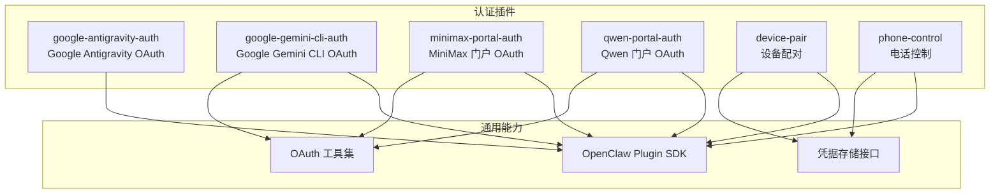
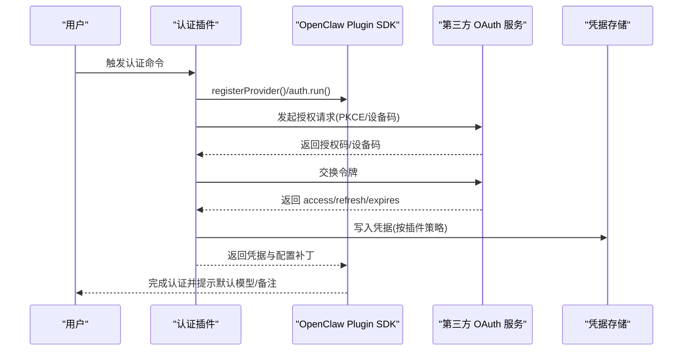
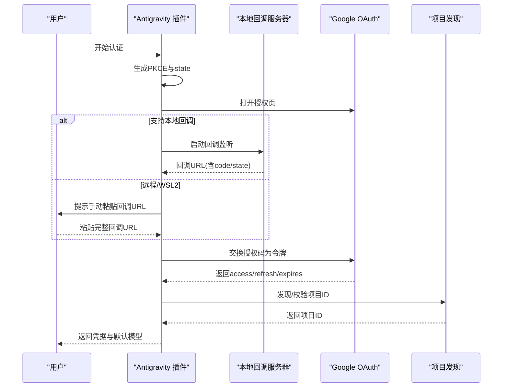
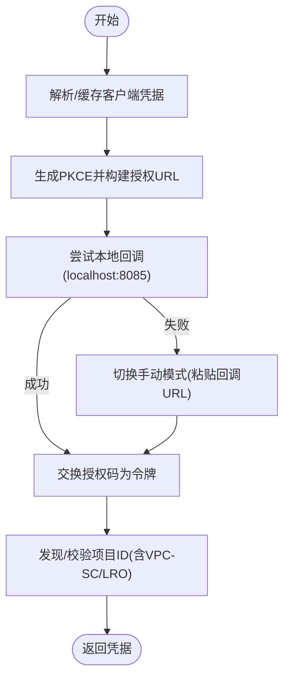
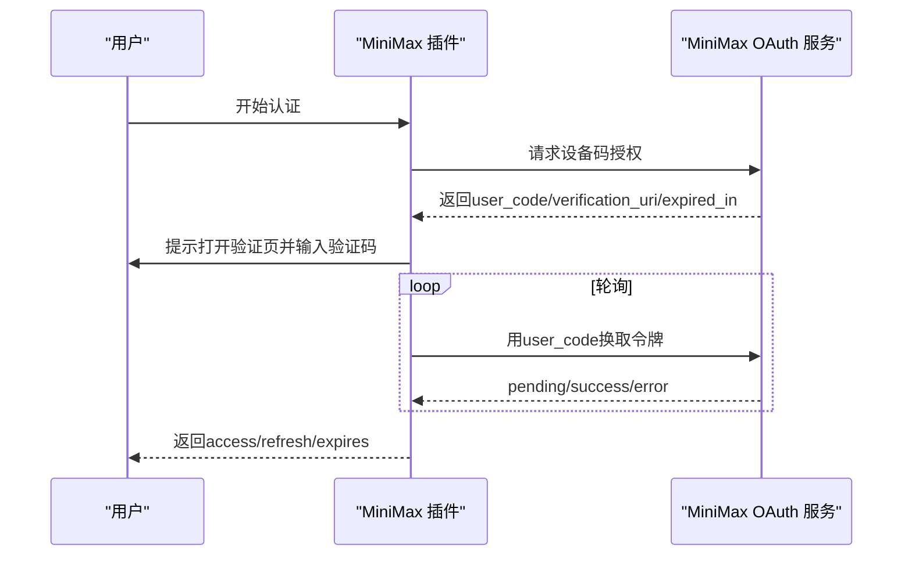
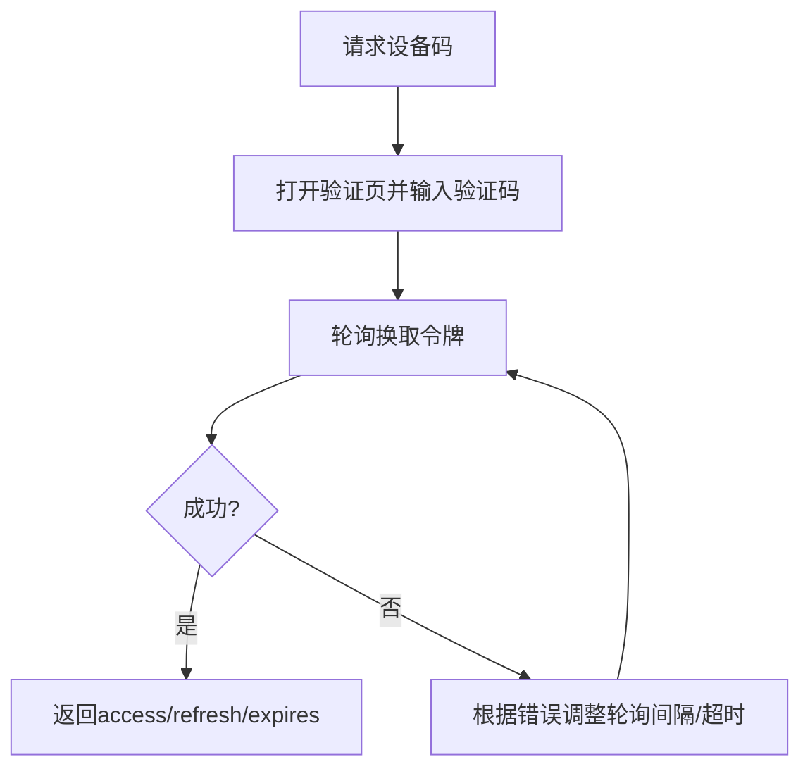
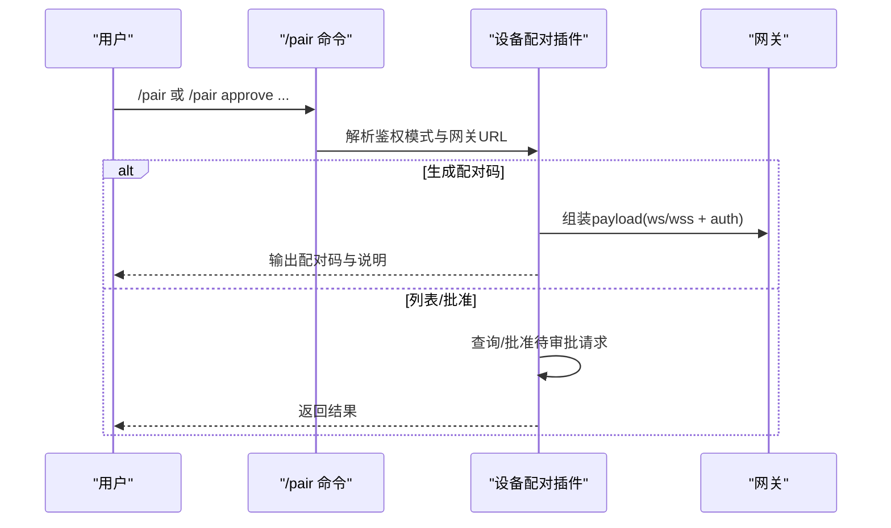
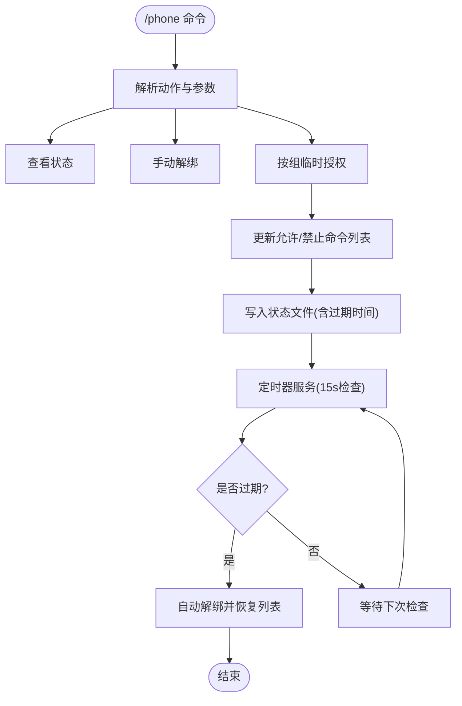
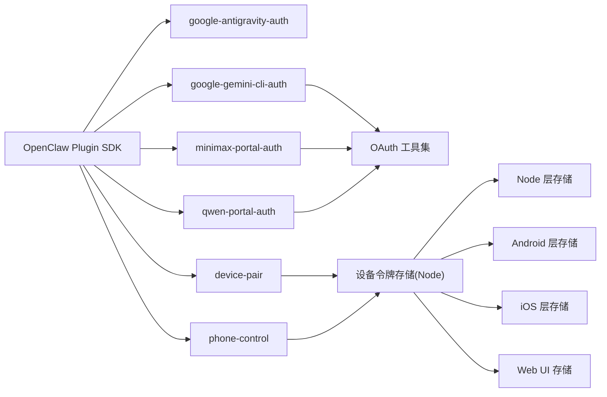

# 认证插件

<cite>
**本文引用的文件**
- [extensions/google-antigravity-auth/index.ts](file://extensions/google-antigravity-auth/index.ts)
- [extensions/google-gemini-cli-auth/index.ts](file://extensions/google-gemini-cli-auth/index.ts)
- [extensions/google-gemini-cli-auth/oauth.ts](file://extensions/google-gemini-cli-auth/oauth.ts)
- [extensions/google-gemini-cli-auth/oauth.test.ts](file://extensions/google-gemini-cli-auth/oauth.test.ts)
- [extensions/minimax-portal-auth/index.ts](file://extensions/minimax-portal-auth/index.ts)
- [extensions/minimax-portal-auth/oauth.ts](file://extensions/minimax-portal-auth/oauth.ts)
- [extensions/qwen-portal-auth/index.ts](file://extensions/qwen-portal-auth/index.ts)
- [extensions/qwen-portal-auth/oauth.ts](file://extensions/qwen-portal-auth/oauth.ts)
- [extensions/device-pair/index.ts](file://extensions/device-pair/index.ts)
- [extensions/phone-control/index.ts](file://extensions/phone-control/index.ts)
- [extensions/device-pair/openclaw.plugin.json](file://extensions/device-pair/openclaw.plugin.json)
- [extensions/phone-control/openclaw.plugin.json](file://extensions/phone-control/openclaw.plugin.json)
- [docs/concepts/oauth.md](file://docs/concepts/oauth.md)
- [docs/gateway/authentication.md](file://docs/gateway/authentication.md)
- [src/infra/device-auth-store.ts](file://src/infra/device-auth-store.ts)
- [src/gateway/device-auth.ts](file://src/gateway/device-auth.ts)
- [apps/android/app/src/main/java/ai/openclaw/android/gateway/DeviceAuthStore.kt](file://apps/android/app/src/main/java/ai/openclaw/android/gateway/DeviceAuthStore.kt)
- [apps/shared/OpenClawKit/Sources/OpenClawKit/DeviceAuthStore.swift](file://apps/shared/OpenClawKit/Sources/OpenClawKit/DeviceAuthStore.swift)
- [ui/src/ui/device-auth.ts](file://ui/src/ui/device-auth.ts)
- [ui/src/ui/controllers/devices.ts](file://ui/src/ui/controllers/devices.ts)
</cite>

## 目录

1. [简介](#简介)
2. [项目结构](#项目结构)
3. [核心组件](#核心组件)
4. [架构总览](#架构总览)
5. [详细组件分析](#详细组件分析)
6. [依赖关系分析](#依赖关系分析)
7. [性能考虑](#性能考虑)
8. [故障排查指南](#故障排查指南)
9. [结论](#结论)
10. [附录](#附录)

## 简介

本文件系统性梳理 OpenClaw 的认证插件体系，覆盖第三方服务认证（Google Antigravity、Google Gemini CLI、MiniMax 门户、Qwen 门户）与设备配对、电话控制两类安全插件。文档重点阐述：

- OAuth 2.0、设备码授权、API 密钥等多类认证方式的实现细节与差异
- 插件注册、凭据交换、存储与刷新机制
- 配置管理、密钥与令牌的安全存储策略
- 失败处理、重新认证与安全审计建议

## 项目结构

OpenClaw 将认证能力以“插件”形式组织在 extensions 目录中，每个插件独立实现特定提供商或设备场景的认证流程，并通过统一的插件 SDK 注册到运行时。

图示来源

- [extensions/google-antigravity-auth/index.ts](file://extensions/google-antigravity-auth/index.ts#L370-L442)
- [extensions/google-gemini-cli-auth/index.ts](file://extensions/google-gemini-cli-auth/index.ts#L18-L93)
- [extensions/minimax-portal-auth/index.ts](file://extensions/minimax-portal-auth/index.ts#L130-L162)
- [extensions/qwen-portal-auth/index.ts](file://extensions/qwen-portal-auth/index.ts#L38-L135)
- [extensions/device-pair/index.ts](file://extensions/device-pair/index.ts#L379-L500)
- [extensions/phone-control/index.ts](file://extensions/phone-control/index.ts#L286-L422)

章节来源

- [extensions/google-antigravity-auth/index.ts](file://extensions/google-antigravity-auth/index.ts#L1-L442)
- [extensions/google-gemini-cli-auth/index.ts](file://extensions/google-gemini-cli-auth/index.ts#L1-L93)
- [extensions/minimax-portal-auth/index.ts](file://extensions/minimax-portal-auth/index.ts#L1-L162)
- [extensions/qwen-portal-auth/index.ts](file://extensions/qwen-portal-auth/index.ts#L1-L135)
- [extensions/device-pair/index.ts](file://extensions/device-pair/index.ts#L1-L500)
- [extensions/phone-control/index.ts](file://extensions/phone-control/index.ts#L1-L422)

## 核心组件

- 第三方 OAuth 插件
  - Google Antigravity：使用 PKCE + 本地回调，自动发现项目 ID 并支持远程/WSL2 同步环境的手动模式。
  - Google Gemini CLI：优先从环境变量读取客户端凭据，若未设置则尝试从已安装的 Gemini CLI 中提取；支持本地回调与手动粘贴两种模式。
  - MiniMax 门户：设备码授权（user_code），支持全球与国内区域端点，轮询换取访问令牌。
  - Qwen 门户：设备码授权（device_code），支持轮询与超时控制。
- 设备配对插件：生成一次性配对码，解析网关 URL（本地/远程/Tailscale），支持密码或令牌两种网关鉴权模式。
- 电话控制插件：基于命令白名单/黑名单的临时授权机制，支持定时自动解绑与状态持久化。

章节来源

- [extensions/google-antigravity-auth/index.ts](file://extensions/google-antigravity-auth/index.ts#L279-L368)
- [extensions/google-gemini-cli-auth/index.ts](file://extensions/google-gemini-cli-auth/index.ts#L18-L93)
- [extensions/minimax-portal-auth/index.ts](file://extensions/minimax-portal-auth/index.ts#L130-L162)
- [extensions/qwen-portal-auth/index.ts](file://extensions/qwen-portal-auth/index.ts#L38-L135)
- [extensions/device-pair/index.ts](file://extensions/device-pair/index.ts#L379-L500)
- [extensions/phone-control/index.ts](file://extensions/phone-control/index.ts#L286-L422)

## 架构总览

下图展示认证插件与运行时的整体交互：插件通过 SDK 注册提供者与认证流程，完成令牌交换后返回凭据与配置补丁，运行时负责凭据存储与刷新。

图示来源

- [extensions/google-antigravity-auth/index.ts](file://extensions/google-antigravity-auth/index.ts#L375-L438)
- [extensions/google-gemini-cli-auth/index.ts](file://extensions/google-gemini-cli-auth/index.ts#L23-L89)
- [extensions/minimax-portal-auth/index.ts](file://extensions/minimax-portal-auth/index.ts#L135-L158)
- [extensions/qwen-portal-auth/index.ts](file://extensions/qwen-portal-auth/index.ts#L44-L131)

## 详细组件分析

### Google Antigravity 认证插件

- 实现要点
  - 使用 PKCE（S256）与本地回调端口，支持远程/WSL2 同步环境的手动模式。
  - 自动发现 Google Cloud 项目 ID，若失败则回退默认值。
  - 返回包含 access、refresh、expires、email、projectId 的凭据，同时注入默认模型与相关备注。
- 关键流程
  - 生成 PKCE 参数与 state，构建授权 URL。
  - 启动本地回调服务器或提示用户手动粘贴回调 URL。
  - 交换授权码为令牌，校验 state，拉取用户邮箱与项目 ID。
  - 返回凭据并应用配置补丁。

图示来源

- [extensions/google-antigravity-auth/index.ts](file://extensions/google-antigravity-auth/index.ts#L49-L368)

章节来源

- [extensions/google-antigravity-auth/index.ts](file://extensions/google-antigravity-auth/index.ts#L1-L442)

### Google Gemini CLI 认证插件

- 实现要点
  - 凭据来源优先级：环境变量 > 已安装 Gemini CLI 提取 > 抛错引导安装。
  - 本地回调失败时自动降级为手动粘贴模式。
  - 项目 ID 探测支持 VPC-SC 影响场景与 LRO 轮询。
- 关键流程
  - 解析/缓存客户端凭据，生成 PKCE，构建授权 URL。
  - 尝试打开浏览器并等待本地回调；失败则提示手动粘贴。
  - 交换令牌并获取邮箱与项目 ID，返回凭据。

图示来源

- [extensions/google-gemini-cli-auth/oauth.ts](file://extensions/google-gemini-cli-auth/oauth.ts#L161-L639)

章节来源

- [extensions/google-gemini-cli-auth/index.ts](file://extensions/google-gemini-cli-auth/index.ts#L1-L93)
- [extensions/google-gemini-cli-auth/oauth.ts](file://extensions/google-gemini-cli-auth/oauth.ts#L1-L640)
- [extensions/google-gemini-cli-auth/oauth.test.ts](file://extensions/google-gemini-cli-auth/oauth.test.ts#L1-L241)

### MiniMax 门户认证插件

- 实现要点
  - 设备码授权（user_code），支持全球与国内端点。
  - 轮询换取令牌，动态调整轮询间隔，超时处理。
  - 返回 access、refresh、expires，并可携带资源 URL 与通知消息。
- 关键流程
  - 生成 PKCE，请求设备码授权，打开验证页。
  - 轮询换取令牌，成功后返回凭据与配置补丁。

图示来源

- [extensions/minimax-portal-auth/oauth.ts](file://extensions/minimax-portal-auth/oauth.ts#L65-L247)
- [extensions/minimax-portal-auth/index.ts](file://extensions/minimax-portal-auth/index.ts#L47-L127)

章节来源

- [extensions/minimax-portal-auth/index.ts](file://extensions/minimax-portal-auth/index.ts#L1-L162)
- [extensions/minimax-portal-auth/oauth.ts](file://extensions/minimax-portal-auth/oauth.ts#L1-L248)

### Qwen 门户认证插件

- 实现要点
  - 设备码授权（device_code），支持轮询与慢速降级策略。
  - 自动拼接验证 URL，支持完整/基础两种形态。
- 关键流程
  - 请求设备码，打开验证页，轮询换取令牌，返回凭据。

图示来源

- [extensions/qwen-portal-auth/oauth.ts](file://extensions/qwen-portal-auth/oauth.ts#L45-L190)
- [extensions/qwen-portal-auth/index.ts](file://extensions/qwen-portal-auth/index.ts#L55-L127)

章节来源

- [extensions/qwen-portal-auth/index.ts](file://extensions/qwen-portal-auth/index.ts#L1-L135)
- [extensions/qwen-portal-auth/oauth.ts](file://extensions/qwen-portal-auth/oauth.ts#L1-L191)

### 设备配对插件

- 功能概述
  - 生成一次性配对码，解析网关 URL（本地/远程/Tailscale/custom），支持密码或令牌鉴权。
  - 提供 /pair 子命令：生成配对码、列出待审批请求、批准请求。
- 安全机制
  - 仅在 Telegram 渠道支持拆分发送提示，其余渠道合并输出。
  - 通过配置与环境变量决定鉴权模式，避免无凭据连接。

图示来源

- [extensions/device-pair/index.ts](file://extensions/device-pair/index.ts#L384-L498)
- [extensions/device-pair/openclaw.plugin.json](file://extensions/device-pair/openclaw.plugin.json#L1-L21)

章节来源

- [extensions/device-pair/index.ts](file://extensions/device-pair/index.ts#L1-L500)
- [extensions/device-pair/openclaw.plugin.json](file://extensions/device-pair/openclaw.plugin.json#L1-L21)

### 电话控制插件

- 功能概述
  - 按组（相机、屏幕录制、写入类）临时提升命令权限，支持定时自动解绑。
  - 通过状态文件持久化当前授权状态，定时器服务周期检查过期并自动解绑。
- 安全机制
  - 仅修改网关侧命令白名单/黑名单，不绕过系统原生权限弹窗。
  - 支持查询状态、手动解绑与帮助信息。

图示来源

- [extensions/phone-control/index.ts](file://extensions/phone-control/index.ts#L286-L422)

章节来源

- [extensions/phone-control/index.ts](file://extensions/phone-control/index.ts#L1-L422)
- [extensions/phone-control/openclaw.plugin.json](file://extensions/phone-control/openclaw.plugin.json#L1-L11)

## 依赖关系分析

- 插件与 SDK
  - 所有认证插件均通过 OpenClaw Plugin SDK 注册提供者与认证流程，遵循统一的 ProviderAuthContext 与返回格式。
- OAuth 工具链
  - Google Gemini CLI 与 MiniMax/Qwen 插件共享 PKCE 生成、回调解析、轮询令牌等通用逻辑。
- 存储层
  - 运行时提供跨平台的设备令牌存储抽象（Node/Android/iOS/UI），确保凭据安全持久化与清理。

图示来源

- [extensions/google-gemini-cli-auth/oauth.ts](file://extensions/google-gemini-cli-auth/oauth.ts#L1-L640)
- [extensions/minimax-portal-auth/oauth.ts](file://extensions/minimax-portal-auth/oauth.ts#L1-L248)
- [extensions/qwen-portal-auth/oauth.ts](file://extensions/qwen-portal-auth/oauth.ts#L1-L191)
- [src/infra/device-auth-store.ts](file://src/infra/device-auth-store.ts#L92-L142)
- [apps/android/app/src/main/java/ai/openclaw/android/gateway/DeviceAuthStore.kt](file://apps/android/app/src/main/java/ai/openclaw/android/gateway/DeviceAuthStore.kt#L1-L26)
- [apps/shared/OpenClawKit/Sources/OpenClawKit/DeviceAuthStore.swift](file://apps/shared/OpenClawKit/Sources/OpenClawKit/DeviceAuthStore.swift#L1-L30)
- [ui/src/ui/device-auth.ts](file://ui/src/ui/device-auth.ts#L64-L119)

章节来源

- [src/infra/device-auth-store.ts](file://src/infra/device-auth-store.ts#L92-L142)
- [src/gateway/device-auth.ts](file://src/gateway/device-auth.ts#L1-L31)
- [apps/android/app/src/main/java/ai/openclaw/android/gateway/DeviceAuthStore.kt](file://apps/android/app/src/main/java/ai/openclaw/android/gateway/DeviceAuthStore.kt#L1-L26)
- [apps/shared/OpenClawKit/Sources/OpenClawKit/DeviceAuthStore.swift](file://apps/shared/OpenClawKit/Sources/OpenClawKit/DeviceAuthStore.swift#L1-L30)
- [ui/src/ui/device-auth.ts](file://ui/src/ui/device-auth.ts#L64-L119)
- [ui/src/ui/controllers/devices.ts](file://ui/src/ui/controllers/devices.ts#L105-L159)

## 性能考虑

- 轮询策略
  - MiniMax 与 Qwen 的轮询采用指数退避与上限限制，避免频繁请求导致服务压力。
- 本地回调
  - Gemini CLI 与 Antigravity 优先使用本地回调，失败时才降级为手动粘贴，减少用户等待。
- 状态持久化
  - 电话控制定时器每 15 秒检查一次，平衡及时性与系统负载。

## 故障排查指南

- OAuth 常见问题
  - 状态不匹配：确认回调中的 state 与发起时一致，避免 CSRF 攻击。
  - 无刷新令牌：部分客户端不会返回 refresh_token，需重新授权或更换客户端。
  - 项目 ID 缺失：按提示设置 GOOGLE_CLOUD_PROJECT 或 GOOGLE_CLOUD_PROJECT_ID。
- 设备配对
  - 网关 URL 解析失败：检查 gateway.bind、remote.url、publicUrl 与 Tailscale 配置。
  - 鉴权缺失：确保配置了 token 或 password，或通过环境变量传入。
- 电话控制
  - 过期未自动解绑：检查定时器服务是否正常启动，状态文件是否被破坏。
  - 权限未生效：确认网关侧命令白名单/黑名单已更新。

章节来源

- [extensions/google-gemini-cli-auth/oauth.ts](file://extensions/google-gemini-cli-auth/oauth.ts#L276-L282)
- [extensions/minimax-portal-auth/oauth.ts](file://extensions/minimax-portal-auth/oauth.ts#L100-L102)
- [extensions/qwen-portal-auth/oauth.ts](file://extensions/qwen-portal-auth/oauth.ts#L103-L114)
- [extensions/device-pair/index.ts](file://extensions/device-pair/index.ts#L223-L253)
- [extensions/phone-control/index.ts](file://extensions/phone-control/index.ts#L289-L326)

## 结论

OpenClaw 的认证插件体系通过标准化的插件 SDK 与通用 OAuth 工具集，实现了对多家第三方服务与设备场景的一致支持。配合运行时的凭据存储与刷新机制，既保证了用户体验，也强化了安全性。建议在生产环境中：

- 优先使用具备刷新能力的 OAuth 流程，并定期监控令牌状态
- 对高风险操作（如相机/录音/写入）采用临时授权与自动解绑
- 明确区分设备配对与系统原生权限的关系，避免误导用户

## 附录

- 参考文档
  - OAuth 概念与存储布局：[OAuth 概念](file://docs/concepts/oauth.md#L1-L146)
  - 网关认证与凭证管理：[网关认证](file://docs/gateway/authentication.md#L1-L146)
