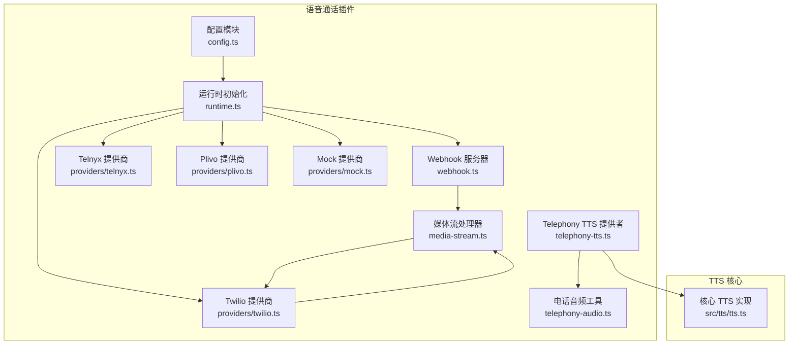
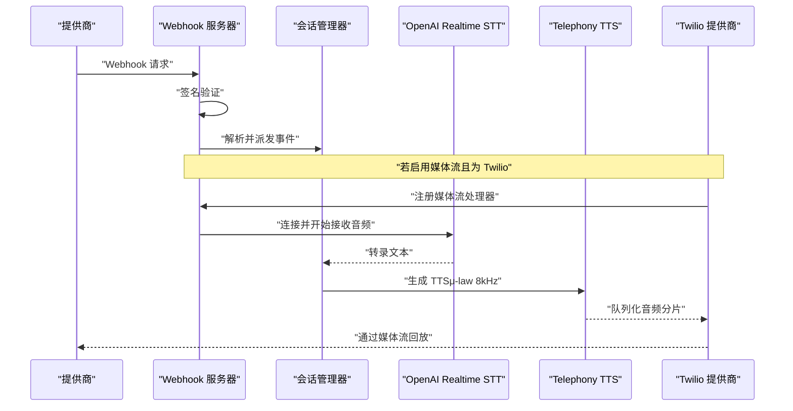
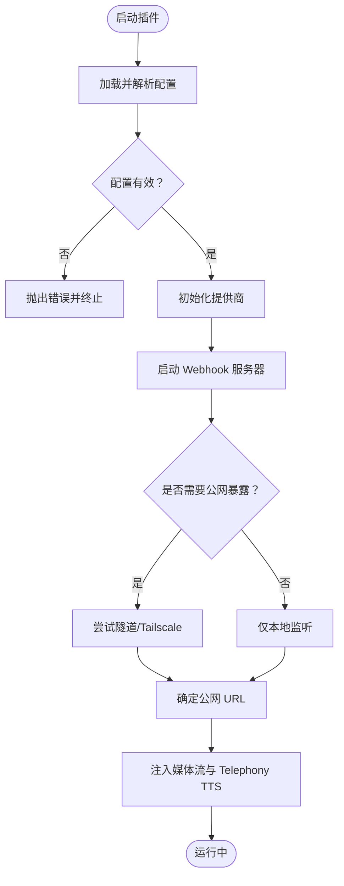
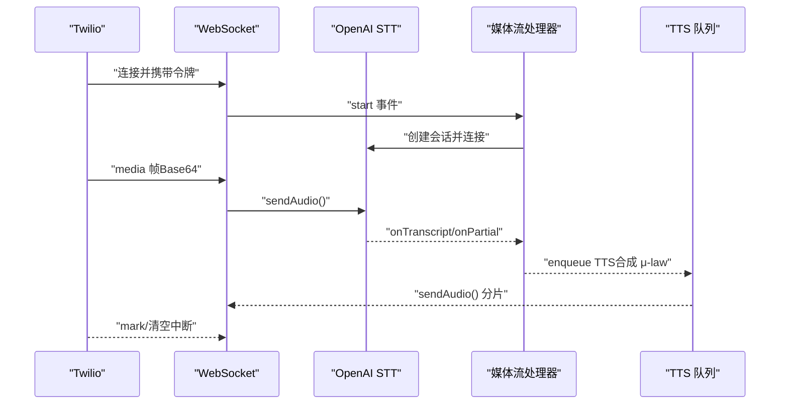
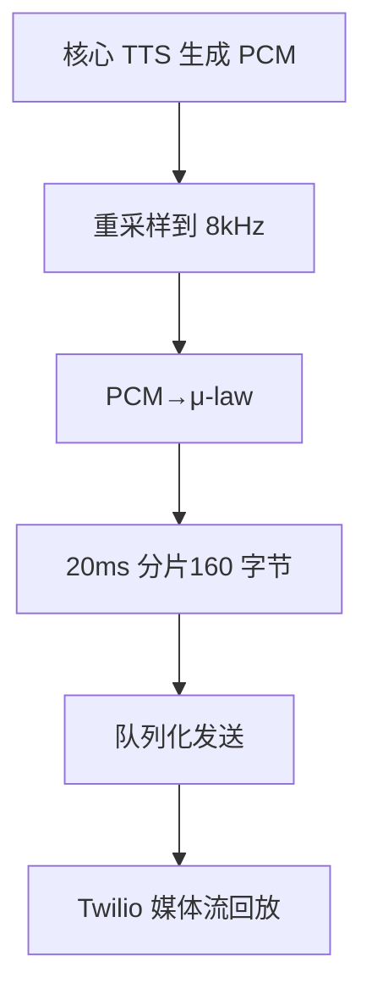
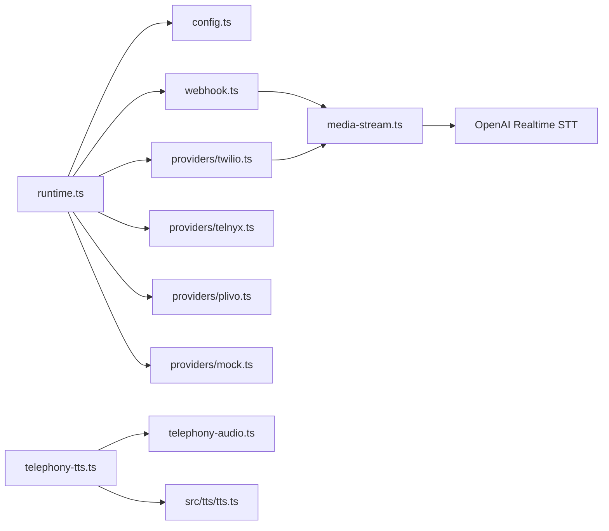

# 语音插件

<cite>
**本文引用的文件**
- [extensions/voice-call/README.md](file://extensions/voice-call/README.md)
- [extensions/voice-call/src/config.ts](file://extensions/voice-call/src/config.ts)
- [extensions/voice-call/src/runtime.ts](file://extensions/voice-call/src/runtime.ts)
- [extensions/voice-call/src/providers/twilio.ts](file://extensions/voice-call/src/providers/twilio.ts)
- [extensions/voice-call/src/providers/telnyx.ts](file://extensions/voice-call/src/providers/telnyx.ts)
- [extensions/voice-call/src/providers/plivo.ts](file://extensions/voice-call/src/providers/plivo.ts)
- [extensions/voice-call/src/providers/mock.ts](file://extensions/voice-call/src/providers/mock.ts)
- [extensions/voice-call/src/telephony-audio.ts](file://extensions/voice-call/src/telephony-audio.ts)
- [extensions/voice-call/src/media-stream.ts](file://extensions/voice-call/src/media-stream.ts)
- [extensions/voice-call/src/webhook.ts](file://extensions/voice-call/src/webhook.ts)
- [extensions/voice-call/src/telephony-tts.ts](file://extensions/voice-call/src/telephony-tts.ts)
- [src/tts/tts.ts](file://src/tts/tts.ts)
- [skills/voice-call/SKILL.md](file://skills/voice-call/SKILL.md)
</cite>

## 目录

1. [简介](#简介)
2. [项目结构](#项目结构)
3. [核心组件](#核心组件)
4. [架构总览](#架构总览)
5. [详细组件分析](#详细组件分析)
6. [依赖关系分析](#依赖关系分析)
7. [性能考虑](#性能考虑)
8. [故障排查指南](#故障排查指南)
9. [结论](#结论)
10. [附录](#附录)

## 简介

本文件系统性梳理 OpenClaw 语音插件（voice-call）与 TTS 语音合成插件的实现架构与功能特性，覆盖以下主题：

- 语音通话插件：多提供商适配（Twilio、Telnyx、Plivo、Mock）、Webhook 接收与签名验证、媒体流双向音频传输、实时 STT/TTS、自动应答与会话管理。
- TTS 插件：Telephony 输出格式（mu-law 8kHz）转换、与语音通话插件的集成、质量控制与延迟统计。
- 音频处理流程：采样率重采样、PCM 到 μ-law 转换、分片传输、实时流控与中断（barge-in）。
- 实时传输、回声消除与噪声抑制：基于媒体流与 STT 的端点检测（VAD）策略说明。
- 配置参数、硬件兼容性与性能优化建议。
- 故障诊断、音频设备管理与用户体验优化策略。

## 项目结构

语音插件位于扩展目录 extensions/voice-call，核心由运行时、配置、提供商适配层、媒体流处理与 Webhook 服务器组成；TTS 语音合成能力复用核心 TTS 模块并针对电话域进行输出格式转换。

图示来源

- [extensions/voice-call/src/config.ts](file://extensions/voice-call/src/config.ts#L304-L396)
- [extensions/voice-call/src/runtime.ts](file://extensions/voice-call/src/runtime.ts#L96-L213)
- [extensions/voice-call/src/webhook.ts](file://extensions/voice-call/src/webhook.ts#L20-L45)
- [extensions/voice-call/src/media-stream.ts](file://extensions/voice-call/src/media-stream.ts#L58-L71)
- [extensions/voice-call/src/telephony-tts.ts](file://extensions/voice-call/src/telephony-tts.ts#L23-L45)
- [extensions/voice-call/src/providers/twilio.ts](file://extensions/voice-call/src/providers/twilio.ts#L45-L120)
- [extensions/voice-call/src/providers/telnyx.ts](file://extensions/voice-call/src/providers/telnyx.ts#L29-L50)
- [extensions/voice-call/src/providers/plivo.ts](file://extensions/voice-call/src/providers/plivo.ts#L33-L63)
- [extensions/voice-call/src/providers/mock.ts](file://extensions/voice-call/src/providers/mock.ts#L24-L25)
- [extensions/voice-call/src/telephony-audio.ts](file://extensions/voice-call/src/telephony-audio.ts#L1-L91)
- [src/tts/tts.ts](file://src/tts/tts.ts#L1351-L1391)

章节来源

- [extensions/voice-call/README.md](file://extensions/voice-call/README.md#L1-L140)
- [extensions/voice-call/src/config.ts](file://extensions/voice-call/src/config.ts#L304-L396)

## 核心组件

- 配置模块：定义并校验插件配置，包括提供商密钥、Webhook 服务、隧道暴露、流式 STT、TTS 覆盖等。
- 运行时：解析配置、选择提供商、启动 Webhook 服务器、建立公网可达地址（隧道/Tailscale），注入媒体流处理器与 Telephony TTS。
- 提供商适配：Twilio（媒体流 + 原生 TTS 回退）、Telnyx（Call Control v2）、Plivo（XML 转移 + GetInput）、Mock（本地测试）。
- 媒体流：WebSocket 升级、接收 Twilio 音频帧、转发至 OpenAI Realtime STT、序列化 TTS 音频发送回 Twilio。
- Telephony TTS：调用核心 TTS，将音频转换为 8kHz μ-law，按 20ms 分片实时播放，支持中断与队列。
- 电话音频工具：重采样、PCM→μ-law、分片。

章节来源

- [extensions/voice-call/src/config.ts](file://extensions/voice-call/src/config.ts#L405-L452)
- [extensions/voice-call/src/runtime.ts](file://extensions/voice-call/src/runtime.ts#L96-L213)
- [extensions/voice-call/src/providers/twilio.ts](file://extensions/voice-call/src/providers/twilio.ts#L45-L120)
- [extensions/voice-call/src/providers/telnyx.ts](file://extensions/voice-call/src/providers/telnyx.ts#L29-L50)
- [extensions/voice-call/src/providers/plivo.ts](file://extensions/voice-call/src/providers/plivo.ts#L33-L63)
- [extensions/voice-call/src/providers/mock.ts](file://extensions/voice-call/src/providers/mock.ts#L24-L25)
- [extensions/voice-call/src/media-stream.ts](file://extensions/voice-call/src/media-stream.ts#L58-L71)
- [extensions/voice-call/src/telephony-tts.ts](file://extensions/voice-call/src/telephony-tts.ts#L23-L45)
- [extensions/voice-call/src/telephony-audio.ts](file://extensions/voice-call/src/telephony-audio.ts#L1-L91)

## 架构总览

语音通话插件通过 Webhook 接收提供商事件，解析后交由会话管理器处理；在启用媒体流时，建立 WebSocket 连接，将双向音频接入 STT 并回放 TTS。Twilio 提供商可直接使用其原生 TTS 或通过媒体流播放核心 TTS 生成的 μ-law 音频。

图示来源

- [extensions/voice-call/src/webhook.ts](file://extensions/voice-call/src/webhook.ts#L221-L296)
- [extensions/voice-call/src/providers/twilio.ts](file://extensions/voice-call/src/providers/twilio.ts#L518-L595)
- [extensions/voice-call/src/media-stream.ts](file://extensions/voice-call/src/media-stream.ts#L141-L203)
- [extensions/voice-call/src/telephony-tts.ts](file://extensions/voice-call/src/telephony-tts.ts#L32-L43)

## 详细组件分析

### 配置与运行时

- 配置项涵盖提供商密钥、Webhook 服务、隧道暴露（ngrok/Tailscale）、流式 STT（OpenAI Realtime）、TTS 覆盖（ElevenLabs/OpenAI/Edge）、入站策略、并发限制、超时参数等。
- 运行时负责解析环境变量、校验配置、实例化提供商、启动 Webhook 服务器、设置公网 URL（优先隧道，其次 Tailscale），并注入媒体流与 Telephony TTS。

图示来源

- [extensions/voice-call/src/config.ts](file://extensions/voice-call/src/config.ts#L405-L452)
- [extensions/voice-call/src/runtime.ts](file://extensions/voice-call/src/runtime.ts#L96-L213)

章节来源

- [extensions/voice-call/src/config.ts](file://extensions/voice-call/src/config.ts#L304-L396)
- [extensions/voice-call/src/runtime.ts](file://extensions/voice-call/src/runtime.ts#L96-L213)

### 提供商适配层

- Twilio：支持媒体流双向音频，优先使用 Telephony TTS（核心 TTS → μ-law → 分片），否则回退到 TwiML <Say>；支持签名验证、状态回调、流令牌校验。
- Telnyx：Call Control v2，事件标准化、Ed25519 签名验证、Speak/Transcription 控制。
- Plivo：XML 转移与 GetInput 动作，URL 重建与代理信任策略，支持挂断与状态映射。
- Mock：本地测试事件驱动，便于离线调试。

章节来源

- [extensions/voice-call/src/providers/twilio.ts](file://extensions/voice-call/src/providers/twilio.ts#L45-L120)
- [extensions/voice-call/src/providers/telnyx.ts](file://extensions/voice-call/src/providers/telnyx.ts#L29-L50)
- [extensions/voice-call/src/providers/plivo.ts](file://extensions/voice-call/src/providers/plivo.ts#L33-L63)
- [extensions/voice-call/src/providers/mock.ts](file://extensions/voice-call/src/providers/mock.ts#L24-L25)

### 媒体流与实时传输

- WebSocket 升级：仅对配置的流路径开放，校验令牌（Twilio）或调用方身份。
- 音频接收：Base64 音频帧解码，送入 OpenAI Realtime STT。
- TTS 回放：队列化串行播放，20ms 分片，μ-law 8kHz，支持中断（barge-in）。
- 事件回调：连接/断开、部分转录、最终转录、语音开始。

图示来源

- [extensions/voice-call/src/webhook.ts](file://extensions/voice-call/src/webhook.ts#L176-L187)
- [extensions/voice-call/src/media-stream.ts](file://extensions/voice-call/src/media-stream.ts#L90-L136)
- [extensions/voice-call/src/providers/twilio.ts](file://extensions/voice-call/src/providers/twilio.ts#L563-L595)

章节来源

- [extensions/voice-call/src/webhook.ts](file://extensions/voice-call/src/webhook.ts#L54-L157)
- [extensions/voice-call/src/media-stream.ts](file://extensions/voice-call/src/media-stream.ts#L58-L71)

### Telephony TTS 与音频处理

- Telephony TTS：调用核心 TTS，返回 PCM→μ-law（8kHz）音频，再按 160 字节（20ms）分片，用于实时播放。
- 音频工具：重采样（线性插值）、PCM→μ-law、分片迭代器。
- Twilio 回放：队列化发送，按时间步长推进，结束发送 mark 事件以标记完成。

图示来源

- [extensions/voice-call/src/telephony-tts.ts](file://extensions/voice-call/src/telephony-tts.ts#L32-L43)
- [extensions/voice-call/src/telephony-audio.ts](file://extensions/voice-call/src/telephony-audio.ts#L10-L68)
- [extensions/voice-call/src/providers/twilio.ts](file://extensions/voice-call/src/providers/twilio.ts#L563-L595)

章节来源

- [extensions/voice-call/src/telephony-tts.ts](file://extensions/voice-call/src/telephony-tts.ts#L23-L45)
- [extensions/voice-call/src/telephony-audio.ts](file://extensions/voice-call/src/telephony-audio.ts#L1-L91)
- [extensions/voice-call/src/providers/twilio.ts](file://extensions/voice-call/src/providers/twilio.ts#L518-L595)

### Webhook 安全与签名验证

- Twilio：HMAC-SHA1 签名验证，支持反向代理场景 URL 重建与 ngrok 兼容模式。
- Telnyx：Ed25519 签名验证，带时间戳检查。
- Plivo：HMAC 验证，支持允许主机白名单、信任转发头、受信代理 IP。
- Mock：本地开发用，不强制验证。

章节来源

- [extensions/voice-call/src/providers/twilio.ts](file://extensions/voice-call/src/providers/twilio.ts#L196-L203)
- [extensions/voice-call/src/providers/telnyx.ts](file://extensions/voice-call/src/providers/telnyx.ts#L84-L144)
- [extensions/voice-call/src/providers/plivo.ts](file://extensions/voice-call/src/providers/plivo.ts#L93-L108)
- [extensions/voice-call/src/providers/mock.ts](file://extensions/voice-call/src/providers/mock.ts#L27-L29)

## 依赖关系分析

- 运行时依赖配置模块、提供商接口、Webhook 服务器、媒体流处理器与 Telephony TTS。
- Webhook 服务器依赖提供商签名验证与事件解析，按需启动媒体流 WebSocket。
- Twilio 提供商依赖媒体流处理器与 Telephony TTS 提供者，实现队列化播放与中断。
- Telephony TTS 依赖核心 TTS 与音频工具库，统一输出格式。

图示来源

- [extensions/voice-call/src/runtime.ts](file://extensions/voice-call/src/runtime.ts#L96-L213)
- [extensions/voice-call/src/webhook.ts](file://extensions/voice-call/src/webhook.ts#L20-L45)
- [extensions/voice-call/src/providers/twilio.ts](file://extensions/voice-call/src/providers/twilio.ts#L45-L120)
- [extensions/voice-call/src/media-stream.ts](file://extensions/voice-call/src/media-stream.ts#L58-L71)
- [extensions/voice-call/src/telephony-tts.ts](file://extensions/voice-call/src/telephony-tts.ts#L23-L45)
- [extensions/voice-call/src/telephony-audio.ts](file://extensions/voice-call/src/telephony-audio.ts#L1-L91)
- [src/tts/tts.ts](file://src/tts/tts.ts#L1351-L1391)

章节来源

- [extensions/voice-call/src/runtime.ts](file://extensions/voice-call/src/runtime.ts#L96-L213)
- [extensions/voice-call/src/webhook.ts](file://extensions/voice-call/src/webhook.ts#L20-L45)

## 性能考虑

- 音频分片与时序：20ms 分片（160 字节，8kHz μ-law）确保接近实时播放，避免过小分片导致握手开销过大。
- 队列化播放：单流串行播放，防止音频重叠与撕裂。
- 中断（Barge-in）：用户说话即清除 TTS 队列并清空缓冲，降低延迟。
- STT 连接：媒体流连接非阻塞，即使 STT 失败也不影响 TTS 回放。
- 超时与并发：合理设置 ring 超时、静音超时、最大并发数，避免资源耗尽。
- 网络暴露：优先使用隧道或 Tailscale，确保 Webhook 可达性；签名验证失败快速拒绝，减少无效请求。

## 故障排查指南

- Webhook 未生效
  - 检查公网 URL 是否正确（隧道/Tailscale），确认签名验证通过。
  - 查看 Webhook 服务器日志，确认路径匹配与方法为 POST。
- 媒体流无法连接
  - 确认 WebSocket 升级路径与令牌（Twilio）正确。
  - 检查 OpenAI Realtime API 密钥与模型配置。
- TTS 不播放或卡顿
  - 检查 Telephony TTS 是否成功生成 μ-law 音频。
  - 确认队列未被异常中断，分片大小与速率设置合理。
- 提供商集成问题
  - Twilio：确认账户密钥、连接 ID、签名验证配置。
  - Telnyx：确认公钥与时间戳校验。
  - Plivo：确认认证信息与代理信任配置。
- 自动应答无响应
  - 检查核心配置与响应生成器可用性，确认会话方向与模式。

章节来源

- [extensions/voice-call/src/webhook.ts](file://extensions/voice-call/src/webhook.ts#L221-L296)
- [extensions/voice-call/src/providers/twilio.ts](file://extensions/voice-call/src/providers/twilio.ts#L518-L595)
- [extensions/voice-call/src/providers/telnyx.ts](file://extensions/voice-call/src/providers/telnyx.ts#L84-L144)
- [extensions/voice-call/src/providers/plivo.ts](file://extensions/voice-call/src/providers/plivo.ts#L93-L108)

## 结论

OpenClaw 语音插件通过模块化的提供商适配、安全的 Webhook 处理、可选的媒体流双向传输以及统一的 Telephony TTS 输出，实现了跨提供商的稳定语音通话能力。结合合理的配置与性能参数，可在不同网络环境下获得可靠的实时语音体验。

## 附录

### 配置参数速览（关键项）

- 插件启用与提供商：enabled、provider（telnyx/twilio/plivo/mock）
- 提供商密钥：telnyx.apiKey/connectionId/publicKey、twilio.accountSid/authToken、plivo.authId/authToken
- Webhook 与暴露：serve.port/bind/path、publicUrl、tunnel.provider/ngrokAuthToken/ngrokDomain、tailscale.mode/path
- 入站策略：inboundPolicy、allowFrom、inboundGreeting
- 出站行为：outbound.defaultMode、notifyHangupDelaySec
- 流式 STT：streaming.enabled/sttProvider/sttModel/silenceDurationMs/vadThreshold/streamPath
- TTS 覆盖：tts.provider/openai/elevenlabs/edge、prefsPath、timeoutMs、maxTextLength
- 超时与并发：maxDurationSeconds、silenceTimeoutMs、transcriptTimeoutMs、ringTimeoutMs、maxConcurrentCalls
- 响应模型：responseModel、responseSystemPrompt、responseTimeoutMs

章节来源

- [extensions/voice-call/src/config.ts](file://extensions/voice-call/src/config.ts#L304-L396)

### 音频处理与质量控制

- 编码格式：μ-law（G.711），采样率 8kHz，单声道。
- 分片策略：20ms（160 字节），保证实时性与稳定性。
- 质量控制：重采样线性插值，PCM→μ-law 转换，分片迭代发送，支持中断与队列。
- 回声消除与噪声抑制：通过 STT 的端点检测（VAD）与静音阈值控制，配合 barge-in 实现自然交互。

章节来源

- [extensions/voice-call/src/telephony-audio.ts](file://extensions/voice-call/src/telephony-audio.ts#L10-L68)
- [extensions/voice-call/src/media-stream.ts](file://extensions/voice-call/src/media-stream.ts#L173-L183)

### 硬件兼容性与平台提示

- WebRTC/浏览器侧：媒体流依赖 WebSocket，确保防火墙放行 ws/wss。
- 本地开发：可使用 mock 提供商模拟事件，或 ngrok/Tailscale 快速暴露。
- 云环境：Twilio/Telnyx/Plivo 均要求公网可达的 Webhook URL，建议使用官方隧道或 Tailscale。

章节来源

- [extensions/voice-call/README.md](file://extensions/voice-call/README.md#L75-L80)
- [extensions/voice-call/src/webhook.ts](file://extensions/voice-call/src/webhook.ts#L176-L187)

### 用户体验优化策略

- 自动应答：入站或对话模式下根据转录自动生成回复，缩短等待时间。
- 中断体验：用户说话即中断 TTS，提升交互自然度。
- 音质与延迟：保持 8kHz μ-law 分片，避免过大的静默间隔。
- 错误提示：在 Webhook/媒体流异常时提供明确日志与回退路径。

章节来源

- [extensions/voice-call/src/webhook.ts](file://extensions/voice-call/src/webhook.ts#L115-L123)
- [extensions/voice-call/src/providers/twilio.ts](file://extensions/voice-call/src/providers/twilio.ts#L163-L168)
