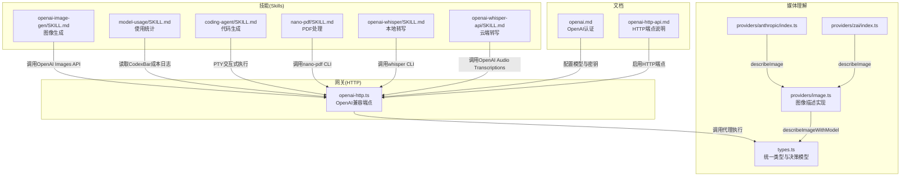
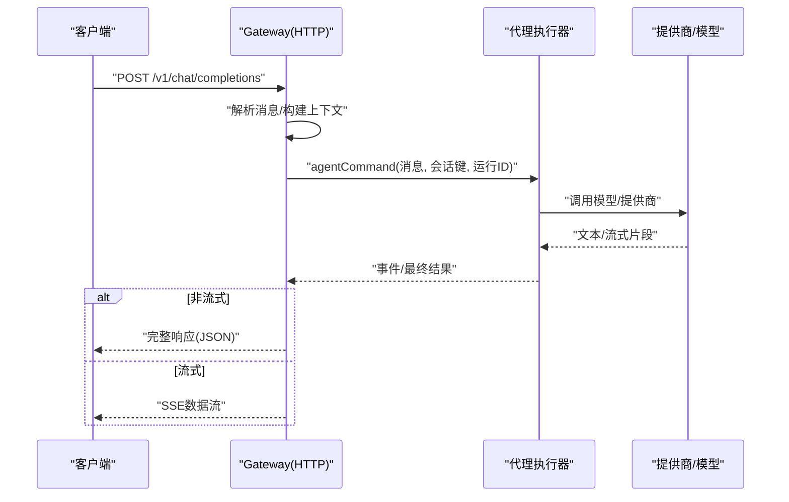
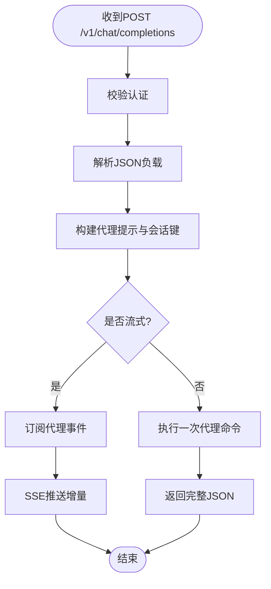
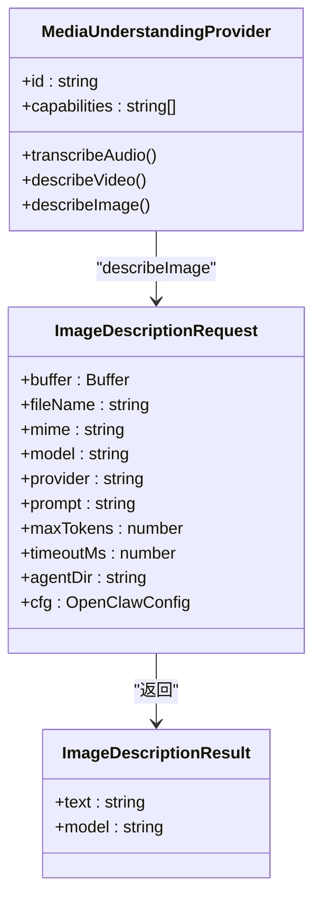
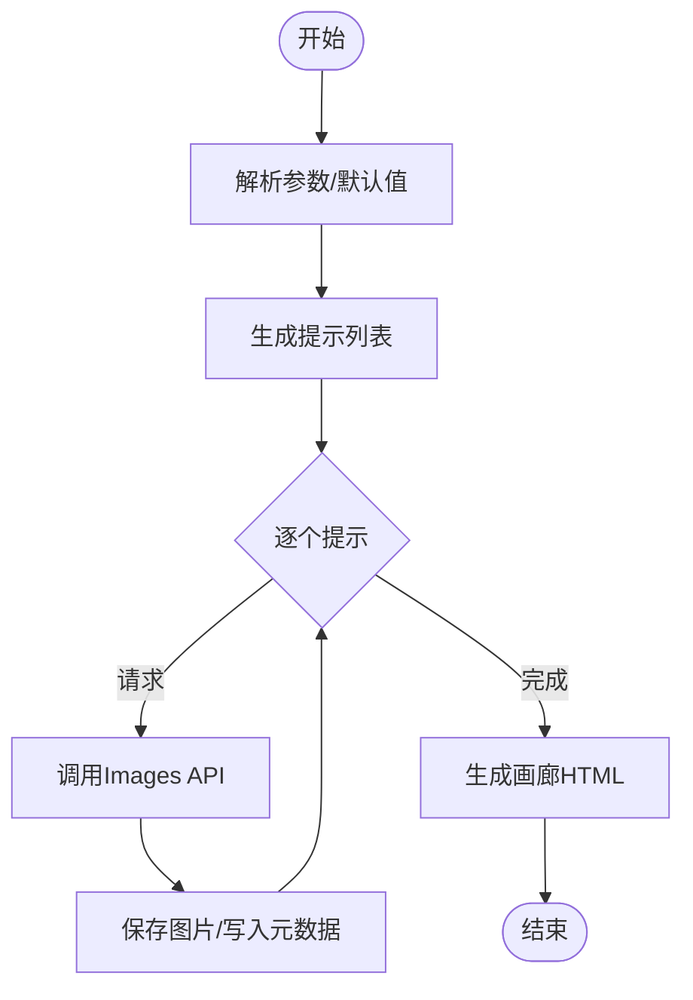
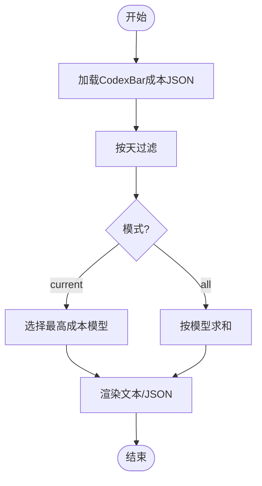
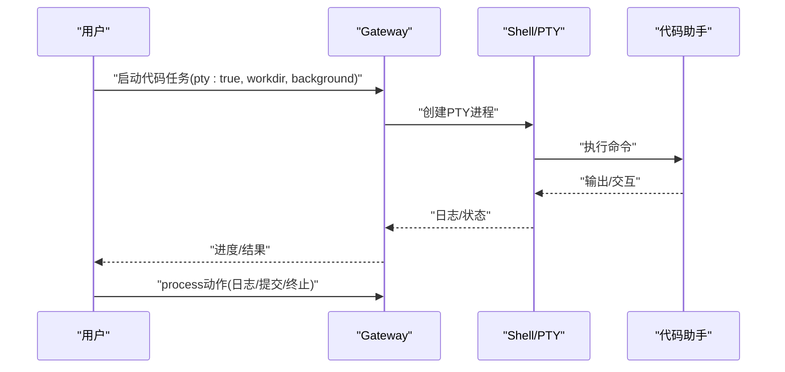
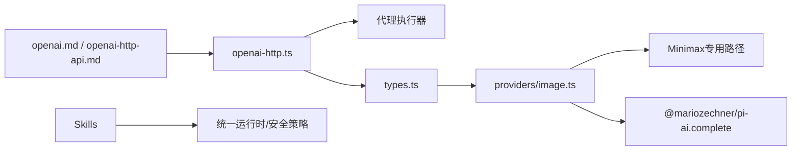

# AI相关技能

<cite>
**本文引用的文件**
- [README.md](file://README.md)
- [openai-http.ts](file://src/gateway/openai-http.ts)
- [openai.md](file://docs/providers/openai.md)
- [openai-http-api.md](file://docs/gateway/openai-http-api.md)
- [types.ts](file://src/media-understanding/types.ts)
- [image.ts](file://src/media-understanding/providers/image.ts)
- [anthropic/index.ts](file://src/media-understanding/providers/anthropic/index.ts)
- [zai/index.ts](file://src/media-understanding/providers/zai/index.ts)
- [openai-image-gen/SKILL.md](file://skills/openai-image-gen/SKILL.md)
- [openai-image-gen/scripts/gen.py](file://skills/openai-image-gen/scripts/gen.py)
- [model-usage/SKILL.md](file://skills/model-usage/SKILL.md)
- [model-usage/scripts/model_usage.py](file://skills/model-usage/scripts/model_usage.py)
- [coding-agent/SKILL.md](file://skills/coding-agent/SKILL.md)
- [nano-pdf/SKILL.md](file://skills/nano-pdf/SKILL.md)
- [openai-whisper/SKILL.md](file://skills/openai-whisper/SKILL.md)
- [openai-whisper-api/SKILL.md](file://skills/openai-whisper-api/SKILL.md)
- [openai.ts](file://src/agents/pi-embedded-helpers/openai.ts)
</cite>

## 目录

1. [简介](#简介)
2. [项目结构](#项目结构)
3. [核心组件](#核心组件)
4. [架构总览](#架构总览)
5. [详细组件分析](#详细组件分析)
6. [依赖关系分析](#依赖关系分析)
7. [性能考虑](#性能考虑)
8. [故障排查指南](#故障排查指南)
9. [结论](#结论)
10. [附录](#附录)

## 简介

本文件面向OpenClaw的AI相关技能模块，系统性阐述其架构设计、实现原理与使用方式，覆盖以下能力：

- 图像生成：通过OpenAI Images API批量生成图片并产出画廊
- 模型使用统计：基于本地CodexBar成本日志进行按模型汇总与当前模型追踪
- 代码生成：以交互式终端（PTY）模式运行多种代码助手（Codex、Claude Code、Pi）
- PDF处理：通过自然语言指令编辑PDF页面
- 媒体理解：音频转写、视频描述、图像描述的统一抽象与多提供商适配
- OpenAI兼容接口：Gateway提供OpenAI Chat Completions风格的HTTP端点，支持流式SSE
- 认证与模型发现：统一的模型注册表、密钥管理与会话路由

## 项目结构

围绕AI技能的关键目录与文件：

- 网关HTTP适配层：提供OpenAI兼容的聊天接口
- 媒体理解子系统：统一的媒体理解类型定义与图像描述实现
- 技能目录：各AI功能的用户手册与脚本
- 文档：提供认证与HTTP端点启用说明

图示来源

- [openai-http.ts](file://src/gateway/openai-http.ts#L171-L426)
- [types.ts](file://src/media-understanding/types.ts#L1-L116)
- [image.ts](file://src/media-understanding/providers/image.ts#L10-L66)
- [anthropic/index.ts](file://src/media-understanding/providers/anthropic/index.ts#L1-L8)
- [zai/index.ts](file://src/media-understanding/providers/zai/index.ts#L1-L8)
- [openai-image-gen/SKILL.md](file://skills/openai-image-gen/SKILL.md#L1-L90)
- [model-usage/SKILL.md](file://skills/model-usage/SKILL.md#L1-L70)
- [coding-agent/SKILL.md](file://skills/coding-agent/SKILL.md#L1-L285)
- [nano-pdf/SKILL.md](file://skills/nano-pdf/SKILL.md#L1-L39)
- [openai-whisper/SKILL.md](file://skills/openai-whisper/SKILL.md#L1-L39)
- [openai-whisper-api/SKILL.md](file://skills/openai-whisper-api/SKILL.md#L1-L53)
- [openai.md](file://docs/providers/openai.md#L1-L63)
- [openai-http-api.md](file://docs/gateway/openai-http-api.md#L1-L119)

章节来源

- [README.md](file://README.md#L1-L550)

## 核心组件

- OpenAI兼容HTTP端点：将OpenAI风格请求转换为OpenClaw代理执行，支持非流式与SSE流式两种返回形式
- 媒体理解抽象：统一的媒体类型、能力、提供商接口与决策模型，屏蔽底层差异
- 图像描述实现：基于模型注册表与密钥存储，选择合适提供商与模型完成图像描述
- 技能生态：图像生成、使用统计、代码生成、PDF处理、语音转写等技能，均通过统一的运行时与安全策略执行
- 认证与模型发现：通过模型注册表与密钥管理，支持多提供商与多模型切换

章节来源

- [openai-http.ts](file://src/gateway/openai-http.ts#L171-L426)
- [types.ts](file://src/media-understanding/types.ts#L1-L116)
- [image.ts](file://src/media-understanding/providers/image.ts#L10-L66)
- [openai.md](file://docs/providers/openai.md#L1-L63)
- [openai-http-api.md](file://docs/gateway/openai-http-api.md#L1-L119)

## 架构总览

OpenClaw的AI技能通过“网关HTTP适配层 + 媒体理解抽象 + 技能实现”的分层设计，既保证了对外接口的兼容性，又实现了对多提供商与多模型的统一调度。

图示来源

- [openai-http.ts](file://src/gateway/openai-http.ts#L171-L426)

## 详细组件分析

### 组件A：OpenAI兼容HTTP端点

- 功能要点
  - 路径与方法：仅接受POST到/v1/chat/completions
  - 认证：支持Bearer Token或密码认证，遵循Gateway配置
  - 请求解析：提取messages、model、stream、user等字段，构建代理提示
  - 会话键：根据user派生稳定会话键；否则每次请求生成新会话
  - 执行路径：非流式直接返回完整响应；流式通过SSE推送增量
  - 错误处理：缺失消息、执行异常、连接中断均有明确响应
- 性能与可靠性
  - SSE流式可降低首字节延迟，提升用户体验
  - 会话键复用避免重复上下文加载，提高长对话效率
- 配置与启用
  - 在配置中开启gateway.http.endpoints.chatCompletions
  - 支持通过Header指定agentId与sessionKey

图示来源

- [openai-http.ts](file://src/gateway/openai-http.ts#L171-L426)
- [openai-http-api.md](file://docs/gateway/openai-http-api.md#L1-L119)

章节来源

- [openai-http.ts](file://src/gateway/openai-http.ts#L171-L426)
- [openai-http-api.md](file://docs/gateway/openai-http-api.md#L1-L119)

### 组件B：媒体理解抽象与图像描述

- 统一类型与能力
  - 定义媒体理解种类（音频转写、视频描述、图像描述）、附件、输出、提供商接口
  - 提供媒体理解决策模型（能力、结果、尝试链路）
- 图像描述实现
  - 通过模型注册表与密钥存储选择模型
  - 对Minimax等特殊提供商走专用路径，其余走通用complete流程
  - 将图像编码为base64并通过上下文发送，最终规范化输出文本
- 多提供商适配
  - Anthropic/Zai等提供商通过统一接口接入，共享describeImage能力

图示来源

- [types.ts](file://src/media-understanding/types.ts#L1-L116)
- [image.ts](file://src/media-understanding/providers/image.ts#L10-L66)
- [anthropic/index.ts](file://src/media-understanding/providers/anthropic/index.ts#L1-L8)
- [zai/index.ts](file://src/media-understanding/providers/zai/index.ts#L1-L8)

章节来源

- [types.ts](file://src/media-understanding/types.ts#L1-L116)
- [image.ts](file://src/media-understanding/providers/image.ts#L10-L66)
- [anthropic/index.ts](file://src/media-understanding/providers/anthropic/index.ts#L1-L8)
- [zai/index.ts](file://src/media-understanding/providers/zai/index.ts#L1-L8)

### 组件C：图像生成技能（OpenAI Images API）

- 功能概述
  - 批量生成图片，支持随机提示采样与自定义提示
  - 自动产出画廊HTML与提示映射文件
  - 支持不同模型的尺寸、质量、背景透明度、输出格式、风格等差异化参数
- 关键流程
  - 解析参数与默认值，限制dall-e-3的单图特性
  - 调用OpenAI Images API，下载或解码图片
  - 写入文件、生成画廊与索引

图示来源

- [openai-image-gen/SKILL.md](file://skills/openai-image-gen/SKILL.md#L1-L90)
- [openai-image-gen/scripts/gen.py](file://skills/openai-image-gen/scripts/gen.py#L163-L241)

章节来源

- [openai-image-gen/SKILL.md](file://skills/openai-image-gen/SKILL.md#L1-L90)
- [openai-image-gen/scripts/gen.py](file://skills/openai-image-gen/scripts/gen.py#L163-L241)

### 组件D：模型使用统计（CodexBar）

- 功能概述
  - 从CodexBar成本日志中按天聚合模型消费金额
  - 支持“当前模型”（按最高消费日模型）与“全部模型”两种摘要模式
  - 支持输入文件或stdin，支持限制天数范围
- 关键流程
  - 加载JSON（CLI输出或文件），解析每日条目
  - 聚合模型成本，选择当前模型，渲染文本或JSON

图示来源

- [model-usage/SKILL.md](file://skills/model-usage/SKILL.md#L1-L70)
- [model-usage/scripts/model_usage.py](file://skills/model-usage/scripts/model_usage.py#L236-L311)

章节来源

- [model-usage/SKILL.md](file://skills/model-usage/SKILL.md#L1-L70)
- [model-usage/scripts/model_usage.py](file://skills/model-usage/scripts/model_usage.py#L236-L311)

### 组件E：代码生成（交互式终端）

- 功能概述
  - 通过bash工具以PTY模式运行代码助手（Codex、Claude Code、Pi）
  - 支持工作目录隔离、后台运行、超时、权限提升等参数
  - 提供进程动作（列出、轮询、日志、写入、提交、粘贴、终止）
- 关键规则
  - 必须使用pty:true，否则交互式CLI输出异常
  - 长任务建议后台运行并定期轮询进度
  - 不要在OpenClaw项目目录内直接review PR，需克隆或使用git worktree

图示来源

- [coding-agent/SKILL.md](file://skills/coding-agent/SKILL.md#L1-L285)

章节来源

- [coding-agent/SKILL.md](file://skills/coding-agent/SKILL.md#L1-L285)

### 组件F：PDF处理（自然语言编辑）

- 功能概述
  - 使用nano-pdf CLI对PDF特定页进行自然语言编辑
  - 注意页码可能因版本而0基或1基，建议先试后用
- 实施要点
  - 编辑前务必人工校验输出PDF

章节来源

- [nano-pdf/SKILL.md](file://skills/nano-pdf/SKILL.md#L1-L39)

### 组件G：语音转写（本地与云端）

- 本地转写（Whisper CLI）
  - 无需API密钥，适合隐私场景
  - 支持模型选择、任务（转写/翻译）、输出格式与目录
- 云端转写（OpenAI Audio Transcriptions API）
  - 通过脚本调用API，支持语言、提示、输出格式等参数
  - 需要OPENAI_API_KEY或在技能配置中设置

章节来源

- [openai-whisper/SKILL.md](file://skills/openai-whisper/SKILL.md#L1-L39)
- [openai-whisper-api/SKILL.md](file://skills/openai-whisper-api/SKILL.md#L1-L53)

### 组件H：推理块降级（OpenAI响应兼容）

- 功能概述
  - 为避免OpenAI Responses API拒绝不完整的推理签名项，对历史消息中的推理块进行降级处理
  - 仅在签名不完整且无后续非思考块时移除该块，确保历史可用性

章节来源

- [openai.ts](file://src/agents/pi-embedded-helpers/openai.ts#L69-L130)

## 依赖关系分析

- 网关HTTP适配层依赖代理执行器与事件系统，实现与OpenAI接口的兼容
- 媒体理解子系统通过模型注册表与密钥存储解耦具体提供商
- 技能通过统一的运行时与安全策略执行，减少重复实现
- 文档与配置指引确保认证与端点启用的一致性

图示来源

- [openai-http.ts](file://src/gateway/openai-http.ts#L171-L426)
- [types.ts](file://src/media-understanding/types.ts#L1-L116)
- [image.ts](file://src/media-understanding/providers/image.ts#L10-L66)
- [openai.md](file://docs/providers/openai.md#L1-L63)
- [openai-http-api.md](file://docs/gateway/openai-http-api.md#L1-L119)

章节来源

- [openai-http.ts](file://src/gateway/openai-http.ts#L171-L426)
- [types.ts](file://src/media-understanding/types.ts#L1-L116)
- [image.ts](file://src/media-understanding/providers/image.ts#L10-L66)
- [openai.md](file://docs/providers/openai.md#L1-L63)
- [openai-http-api.md](file://docs/gateway/openai-http-api.md#L1-L119)

## 性能考虑

- 流式响应：优先使用SSE流式返回，缩短首字节时间，改善交互体验
- 会话复用：利用user派生稳定的会话键，减少重复上下文加载
- 模型选择：根据任务复杂度选择合适模型，避免过度计算
- 本地化处理：音频转写优先使用本地Whisper CLI，降低网络与成本开销
- 并发与批处理：图像生成与使用统计等批处理任务应合理限流，避免资源争用

## 故障排查指南

- HTTP端点未生效
  - 确认已启用gateway.http.endpoints.chatCompletions
  - 检查认证方式与令牌/密码配置
- 代理响应为空
  - 检查messages中是否存在有效用户消息
  - 查看代理事件流是否正常触发
- 图像生成失败
  - 确认OPENAI_API_KEY环境变量或技能配置
  - 检查模型参数（如dall-e-3仅支持单图）
- 使用统计无数据
  - 确认CodexBar CLI安装与可执行路径
  - 检查输入JSON格式与provider匹配
- 代码生成无输出或卡死
  - 必须使用pty:true，确保交互式终端正确分配
  - 合理设置超时与工作目录，避免阻塞
- 推理块报错
  - 检查历史消息中推理签名是否完整，必要时允许降级处理

章节来源

- [openai-http-api.md](file://docs/gateway/openai-http-api.md#L1-L119)
- [openai-http.ts](file://src/gateway/openai-http.ts#L171-L426)
- [openai-image-gen/SKILL.md](file://skills/openai-image-gen/SKILL.md#L1-L90)
- [model-usage/SKILL.md](file://skills/model-usage/SKILL.md#L1-L70)
- [coding-agent/SKILL.md](file://skills/coding-agent/SKILL.md#L1-L285)
- [openai.ts](file://src/agents/pi-embedded-helpers/openai.ts#L69-L130)

## 结论

OpenClaw的AI技能模块通过清晰的分层设计与统一抽象，实现了对多提供商、多模型与多样化任务的高效支持。借助Gateway的OpenAI兼容HTTP端点、媒体理解抽象与丰富的技能生态，用户可以在本地与云端之间灵活选择，并通过标准化的认证与配置实现安全、可控与可观测的AI应用。

## 附录

- 配置参考
  - OpenAI认证与模型选择：见文档
  - 启用OpenAI兼容HTTP端点：见文档
- 常用参数速查
  - 图像生成：模型、尺寸、质量、背景、输出格式、风格
  - 使用统计：provider、mode、model、days、format、pretty
  - 代码生成：pty、workdir、background、timeout、elevated
  - 语音转写：本地CLI与云端API的模型、语言、提示、输出格式

章节来源

- [openai.md](file://docs/providers/openai.md#L1-L63)
- [openai-http-api.md](file://docs/gateway/openai-http-api.md#L1-L119)
- [openai-image-gen/SKILL.md](file://skills/openai-image-gen/SKILL.md#L1-L90)
- [model-usage/SKILL.md](file://skills/model-usage/SKILL.md#L1-L70)
- [coding-agent/SKILL.md](file://skills/coding-agent/SKILL.md#L1-L285)
- [openai-whisper/SKILL.md](file://skills/openai-whisper/SKILL.md#L1-L39)
- [openai-whisper-api/SKILL.md](file://skills/openai-whisper-api/SKILL.md#L1-L53)
