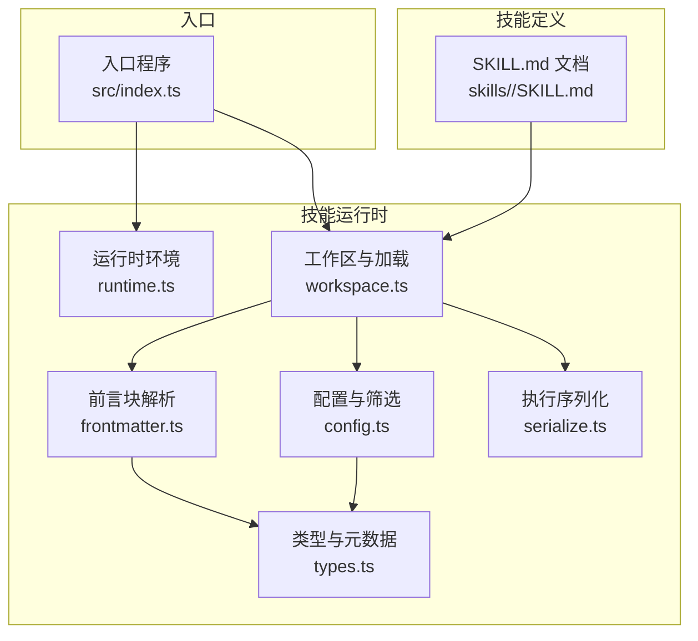
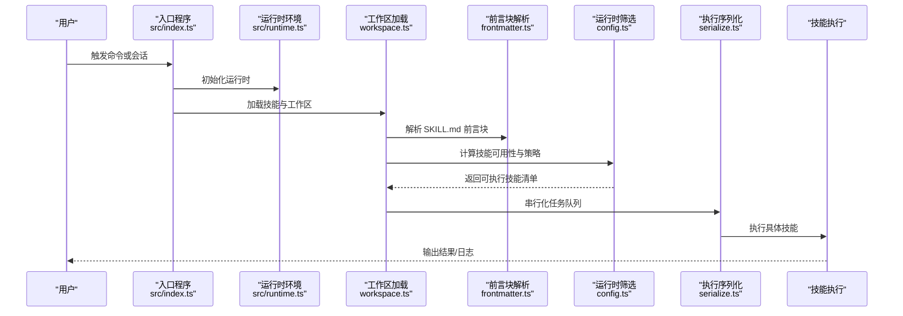
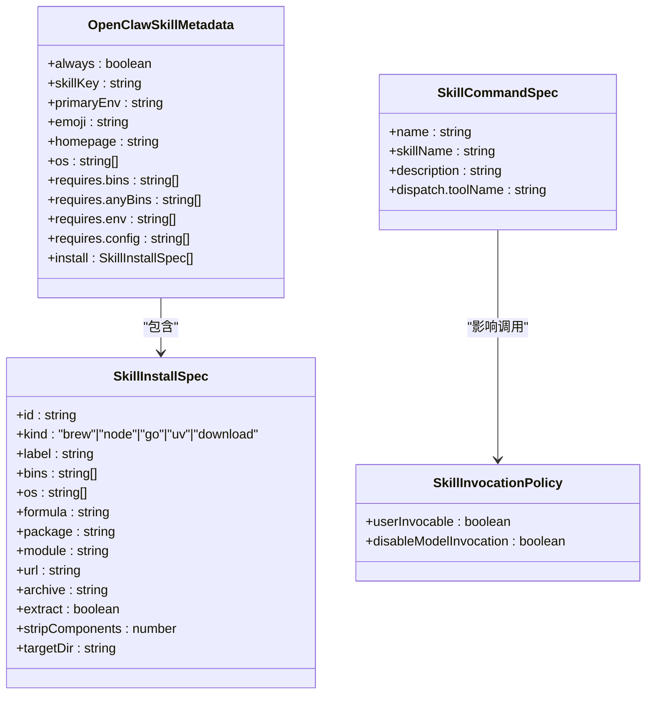
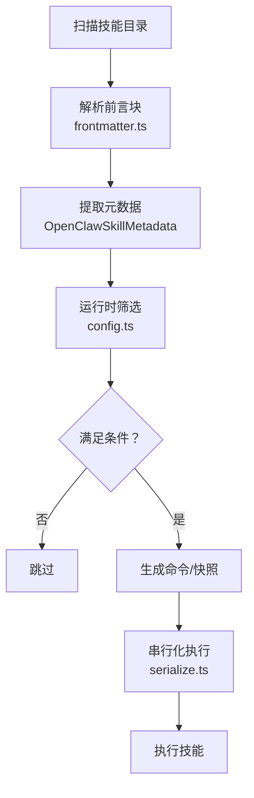

# 内置技能

<cite>
**本文引用的文件**
- [src/index.ts](file://src/index.ts)
- [src/runtime.ts](file://src/runtime.ts)
- [src/agents/skills/types.ts](file://src/agents/skills/types.ts)
- [src/agents/skills/frontmatter.ts](file://src/agents/skills/frontmatter.ts)
- [src/agents/skills/config.ts](file://src/agents/skills/config.ts)
- [src/agents/skills/workspace.ts](file://src/agents/skills/workspace.ts)
- [src/agents/skills/serialize.ts](file://src/agents/skills/serialize.ts)
- [skills/github/SKILL.md](file://skills/github/SKILL.md)
- [skills/session-logs/SKILL.md](file://skills/session-logs/SKILL.md)
- [skills/healthcheck/SKILL.md](file://skills/healthcheck/SKILL.md)
- [skills/apple-notes/SKILL.md](file://skills/apple-notes/SKILL.md)
- [skills/obsidian/SKILL.md](file://skills/obsidian/SKILL.md)
- [skills/notion/SKILL.md](file://skills/notion/SKILL.md)
- [skills/bear-notes/SKILL.md](file://skills/bear-notes/SKILL.md)
- [skills/model-usage/SKILL.md](file://skills/model-usage/SKILL.md)
- [skills/coding-agent/SKILL.md](file://skills/coding-agent/SKILL.md)
- [skills/summarize/SKILL.md](file://skills/summarize/SKILL.md)
</cite>

## 目录

1. [简介](#简介)
2. [项目结构](#项目结构)
3. [核心组件](#核心组件)
4. [架构总览](#架构总览)
5. [详细组件分析](#详细组件分析)
6. [依赖分析](#依赖分析)
7. [性能考虑](#性能考虑)
8. [故障排查指南](#故障排查指南)
9. [结论](#结论)
10. [附录](#附录)

## 简介

本文件系统性梳理 OpenClaw 的“内置技能”体系，围绕设计理念、功能特性与使用场景展开，重点覆盖以下主题：

- 技能元数据与安装规范（基于 Frontmatter）
- 技能加载、过滤与执行策略
- 核心内置技能：GitHub 集成、笔记管理（Apple Notes/Obsidian/Notion/Bear）、会话日志检索、健康检查、模型用量统计、编码代理、摘要工具
- 技能之间的协作关系与数据流转
- 实战配置模板与使用建议

## 项目结构

OpenClaw 将“技能”抽象为可发现、可配置、可安装的单元，并通过统一的前端言解析与运行时策略进行管理。关键位置如下：

- 技能定义与文档：skills/<skill>/SKILL.md（各技能的使用说明、触发条件、命令示例）
- 技能类型与元数据：src/agents/skills/types.ts
- 前言块解析与元数据提取：src/agents/skills/frontmatter.ts
- 技能筛选与运行时环境判定：src/agents/skills/config.ts
- 技能工作区与加载流程：src/agents/skills/workspace.ts
- 执行序列化与并发控制：src/agents/skills/serialize.ts
- 入口与运行时环境：src/index.ts、src/runtime.ts

图表来源

- [src/index.ts](file://src/index.ts#L1-L94)
- [src/runtime.ts](file://src/runtime.ts#L1-L25)
- [src/agents/skills/workspace.ts](file://src/agents/skills/workspace.ts#L1-L123)
- [src/agents/skills/frontmatter.ts](file://src/agents/skills/frontmatter.ts#L1-L173)
- [src/agents/skills/config.ts](file://src/agents/skills/config.ts#L1-L192)
- [src/agents/skills/types.ts](file://src/agents/skills/types.ts#L1-L88)
- [src/agents/skills/serialize.ts](file://src/agents/skills/serialize.ts#L1-L14)

章节来源

- [src/index.ts](file://src/index.ts#L1-L94)
- [src/runtime.ts](file://src/runtime.ts#L1-L25)
- [src/agents/skills/workspace.ts](file://src/agents/skills/workspace.ts#L1-L123)
- [src/agents/skills/frontmatter.ts](file://src/agents/skills/frontmatter.ts#L1-L173)
- [src/agents/skills/config.ts](file://src/agents/skills/config.ts#L1-L192)
- [src/agents/skills/types.ts](file://src/agents/skills/types.ts#L1-L88)
- [src/agents/skills/serialize.ts](file://src/agents/skills/serialize.ts#L1-L14)

## 核心组件

- 类型与元数据
  - 定义了技能安装规范、调用策略、命令分发、能力要求与快照结构等，支撑统一的技能描述与运行约束。
- 前言块解析
  - 解析 SKILL.md 中的 YAML/JSON5 前言块，抽取 OpenClaw 特定元数据（如依赖二进制、环境变量、安装指引等），并推导调用策略。
- 运行时筛选
  - 结合配置、平台、二进制可用性、环境变量与配置路径值，决定技能是否可被加载与执行。
- 工作区与加载
  - 负责扫描技能目录、合并插件技能、生成命令名、去重与长度限制、构建提示词与快照。
- 并发控制
  - 对同一键的任务进行串行化，避免资源竞争与状态冲突。

章节来源

- [src/agents/skills/types.ts](file://src/agents/skills/types.ts#L1-L88)
- [src/agents/skills/frontmatter.ts](file://src/agents/skills/frontmatter.ts#L1-L173)
- [src/agents/skills/config.ts](file://src/agents/skills/config.ts#L1-L192)
- [src/agents/skills/workspace.ts](file://src/agents/skills/workspace.ts#L1-L123)
- [src/agents/skills/serialize.ts](file://src/agents/skills/serialize.ts#L1-L14)

## 架构总览

OpenClaw 的技能系统遵循“声明式定义 + 运行时解析 + 条件加载 + 可扩展安装”的设计。下图展示了从用户触发到技能执行的关键交互：

图表来源

- [src/index.ts](file://src/index.ts#L1-L94)
- [src/runtime.ts](file://src/runtime.ts#L1-L25)
- [src/agents/skills/workspace.ts](file://src/agents/skills/workspace.ts#L1-L123)
- [src/agents/skills/frontmatter.ts](file://src/agents/skills/frontmatter.ts#L1-L173)
- [src/agents/skills/config.ts](file://src/agents/skills/config.ts#L1-L192)
- [src/agents/skills/serialize.ts](file://src/agents/skills/serialize.ts#L1-L14)

## 详细组件分析

### 设计理念与数据模型

- 声明式技能：通过 SKILL.md 的前言块声明依赖、安装方式、调用策略与元信息；运行时据此动态装配。
- 可移植性：通过 requires.bins/anyBins、requires.env、os 列表与安装指引，确保在不同平台与环境中可复现地启用技能。
- 可扩展：支持插件技能目录与捆绑技能的组合加载，允许按需启用/禁用。
- 并发安全：对相同键的任务进行串行化，避免竞态。

图表来源

- [src/agents/skills/types.ts](file://src/agents/skills/types.ts#L1-L88)

章节来源

- [src/agents/skills/types.ts](file://src/agents/skills/types.ts#L1-L88)

### GitHub 集成（gh CLI）

- 功能要点
  - 使用 GitHub CLI 操作 Issues、Pull Requests、Actions Runs，以及通过 REST API 进行高级查询。
  - 支持 JSON 输出与 jq 过滤，便于脚本化处理。
- 元数据与安装
  - 依赖 gh 二进制；提供多平台安装指引（如 brew/apt）。
- 使用场景
  - CI 状态检查、拉取 PR 详情、批量列出最近运行、失败步骤日志提取。
- 示例参考
  - PR 检查、运行列表、运行详情与失败日志、REST 查询与 JSON/jq 组合。

章节来源

- [skills/github/SKILL.md](file://skills/github/SKILL.md#L1-L78)

### 会话日志（session-logs）

- 功能要点
  - 在会话 JSONL 文件中搜索与分析历史对话，支持按日期、关键词、成本、消息数、工具使用等维度统计。
- 数据结构
  - 每个 .jsonl 包含按时间排序的消息对象，角色可为 user/assistant/toolResult；支持 usage.cost.total 等指标。
- 使用场景
  - 用户询问父会话/历史上下文时，快速定位相关会话并提取文本或统计成本。
- 示例参考
  - 列举会话、按天筛选、提取用户消息、关键词检索、成本汇总、消息统计、工具使用分解、跨会话搜索。

章节来源

- [skills/session-logs/SKILL.md](file://skills/session-logs/SKILL.md#L1-L116)

### 健康检查（host hardening）

- 功能要点
  - 主机安全加固与风险容忍度评估；提供只读审计、版本状态检查、周期性巡检与修复建议。
- 流程与规则
  - 模型自检、上下文收集（OS/权限/访问路径/暴露面/备份/加密/自动更新）、运行 OpenClaw 安全审计、版本检查、确定风险姿态、生成修复计划、执行与验证、记录与记忆写入。
- 关键 CLI
  - openclaw security audit、openclaw update status、openclaw cron add/list/runs 等。
- 示例参考
  - 审计命令、修复选项、周期性巡检调度、日志与审计追踪、内存写入策略。

章节来源

- [skills/healthcheck/SKILL.md](file://skills/healthcheck/SKILL.md#L1-L246)

### 笔记管理

- Apple Notes（memo CLI）
  - macOS 专用，支持创建/查看/编辑/删除/搜索/移动/导出。
  - 依赖 memo 二进制，提供 Homebrew 安装指引。
- Obsidian（obsidian-cli）
  - 通过配置文件解析活动库，支持搜索、创建、移动/重命名、删除。
  - 强调不要硬编码路径，优先读取配置或使用默认库。
- Notion（API）
  - 通过 Integration Key 与 Notion API v2025-09-03，支持页面/数据库/块的增删改查与查询。
  - 注意数据源（data_source）与数据库的区分、速率限制与视图过滤限制。
- Bear Notes（grizzly CLI）
  - macOS 专用，支持创建、打开、追加文本、标签、搜索等；部分操作需要 Bear Token。
  - 提供配置文件优先级与回调参数说明。

章节来源

- [skills/apple-notes/SKILL.md](file://skills/apple-notes/SKILL.md#L1-L78)
- [skills/obsidian/SKILL.md](file://skills/obsidian/SKILL.md#L1-L82)
- [skills/notion/SKILL.md](file://skills/notion/SKILL.md#L1-L173)
- [skills/bear-notes/SKILL.md](file://skills/bear-notes/SKILL.md#L1-L108)

### 编码代理（bash + PTY + 后台进程）

- 设计要点
  - 编码代理是交互式终端应用，必须使用 PTY；支持一次性执行与后台长任务模式。
  - 推荐模式：workdir + background + pty，配合 process 工具进行会话监控与输入注入。
- 命令与参数
  - bash 工具参数：command、pty、workdir、background、timeout、elevated。
  - process 工具动作：list、poll、log、write、submit、send-keys、paste、kill。
- 使用场景
  - 快速问答、批量 PR 审查、并行修复、临时仓库隔离、完成通知触发。
- 示例参考
  - 一次性执行、后台任务、PR 审查、并行 army、git worktree 并行修复、进度更新与自动通知。

章节来源

- [skills/coding-agent/SKILL.md](file://skills/coding-agent/SKILL.md#L1-L285)

### 摘要工具（summarize）

- 功能要点
  - 快速摘要 URL、本地文件与 YouTube 链接；支持多种模型与 API Key 设置。
- 使用场景
  - “转录这个 YouTube/视频”、“总结这个链接/文章”等。
- 示例参考
  - 基本用法、YouTube 摘要与仅提取字幕、模型与密钥设置、常用标志与配置文件。

章节来源

- [skills/summarize/SKILL.md](file://skills/summarize/SKILL.md#L1-L88)

### 模型用量（model-usage）

- 功能要点
  - 从 CodexBar 本地成本日志中按模型汇总当前或全部模型的费用；支持 JSON 输入与输出格式。
- 使用场景
  - 获取当前模型最高花费模型、全量模型拆分、脚本化报表。
- 示例参考
  - 当前模型逻辑、输入输出方式、脚本调用。

章节来源

- [skills/model-usage/SKILL.md](file://skills/model-usage/SKILL.md#L1-L70)

## 依赖分析

- 技能加载链路
  - workspace.ts 作为中枢，串联 frontmatter.ts 与 config.ts 的解析与筛选，最终生成可执行技能清单。
- 元数据与安装
  - frontmatter.ts 将 YAML/JSON5 前言块转换为 OpenClawSkillMetadata，types.ts 定义其字段；config.ts 基于该元数据与运行时环境判断是否启用。
- 并发与一致性
  - serialize.ts 通过键值串行化，避免重复任务与竞态。

图表来源

- [src/agents/skills/workspace.ts](file://src/agents/skills/workspace.ts#L1-L123)
- [src/agents/skills/frontmatter.ts](file://src/agents/skills/frontmatter.ts#L1-L173)
- [src/agents/skills/config.ts](file://src/agents/skills/config.ts#L1-L192)
- [src/agents/skills/serialize.ts](file://src/agents/skills/serialize.ts#L1-L14)

章节来源

- [src/agents/skills/workspace.ts](file://src/agents/skills/workspace.ts#L1-L123)
- [src/agents/skills/frontmatter.ts](file://src/agents/skills/frontmatter.ts#L1-L173)
- [src/agents/skills/config.ts](file://src/agents/skills/config.ts#L1-L192)
- [src/agents/skills/serialize.ts](file://src/agents/skills/serialize.ts#L1-L14)

## 性能考虑

- I/O 密集与并发控制
  - 大型会话 JSONL 文件可能达到数 MB，建议使用 head/tail 采样与正则/JSON 过滤减少解析开销；通过 serialize.ts 控制并发，避免磁盘争用。
- 网络请求与速率限制
  - Notion API 存在平均约 3 r/s 的速率限制，批量操作应分批与退避。
- 交互式代理的 PTY 成本
  - 编码代理需要 PTY，后台模式下建议合理设置超时与日志轮询频率，避免无谓占用。
- 二进制与环境检测
  - 通过 hasBinary 与环境变量预检，减少无效尝试与失败重试。

## 故障排查指南

- 技能未启用
  - 检查 requires.bins/anyBins 是否满足；确认 os 列表与运行平台匹配；核对配置中的 skills.entries 与 allowBundled。
- 编码代理输出异常
  - 确认使用 pty:true；确保在受信的 git 目录中运行；必要时使用 --full-auto 或临时仓库隔离。
- 会话日志查询慢
  - 使用 jq/rg 的过滤表达式缩小范围；对大文件先 head/tail 采样；避免跨所有会话的全量扫描。
- Notion API 失败
  - 校验 Integration Key 与 Notion-Version 头；注意数据源（data_source）与数据库的区别；遵守速率限制。
- 健康检查误判
  - 明确主机防火墙/SSH/系统更新不由 OpenClaw 修改；严格遵循“只读检查 + 明确批准 + 可逆变更”的原则。

章节来源

- [src/agents/skills/config.ts](file://src/agents/skills/config.ts#L114-L191)
- [skills/coding-agent/SKILL.md](file://skills/coding-agent/SKILL.md#L14-L285)
- [skills/session-logs/SKILL.md](file://skills/session-logs/SKILL.md#L32-L116)
- [skills/notion/SKILL.md](file://skills/notion/SKILL.md#L29-L173)
- [skills/healthcheck/SKILL.md](file://skills/healthcheck/SKILL.md#L153-L246)

## 结论

OpenClaw 的内置技能体系以“声明 + 运行时解析 + 条件加载 + 可扩展安装”为核心，既保证了跨平台与环境的可移植性，又提供了强大的脚本化与自动化能力。通过统一的元数据模型与安装规范，用户可以快速启用 GitHub、笔记、会话日志、健康检查、模型用量、编码代理与摘要工具等技能，并在复杂场景中实现高效协作与数据流转。

## 附录

- 配置模板与最佳实践
  - 前言块元数据模板（摘自类型定义）：用于在 SKILL.md 中声明依赖、安装方式与调用策略。
  - 运行时筛选要点：结合配置、平台、二进制、环境变量与配置路径值综合判定。
  - 并发控制：对相同键的任务进行串行化，避免竞态。
- 实战建议
  - 优先使用 PTY 模式运行交互式代理；对大文件采用流式过滤；对网络 API 分批与退避；在执行高风险变更前明确批准与回滚方案。

章节来源

- [src/agents/skills/types.ts](file://src/agents/skills/types.ts#L1-L88)
- [src/agents/skills/config.ts](file://src/agents/skills/config.ts#L114-L191)
- [src/agents/skills/serialize.ts](file://src/agents/skills/serialize.ts#L1-L14)
