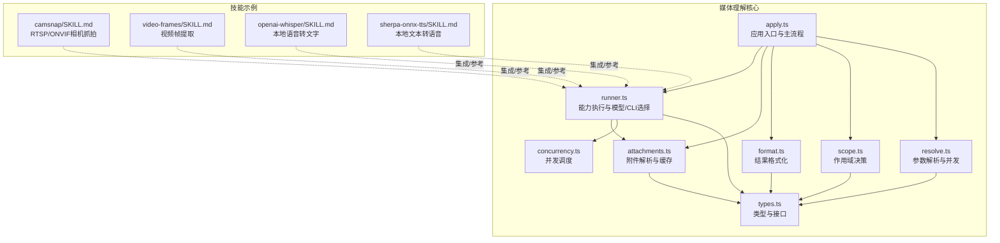
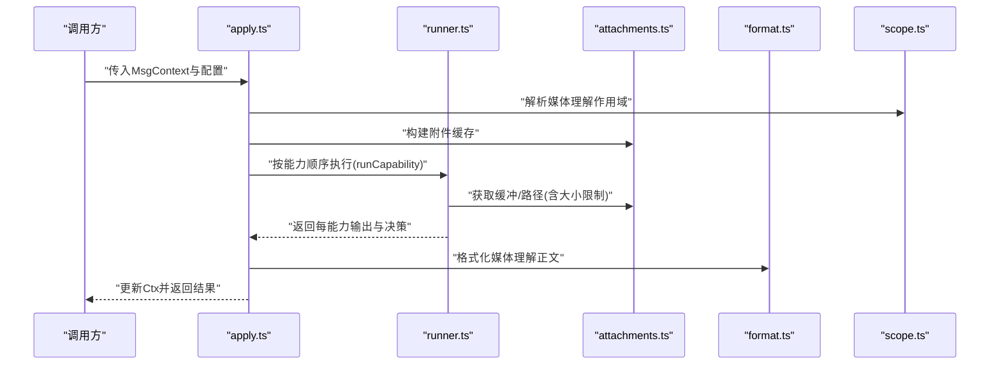
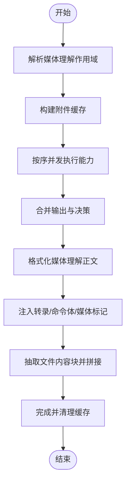
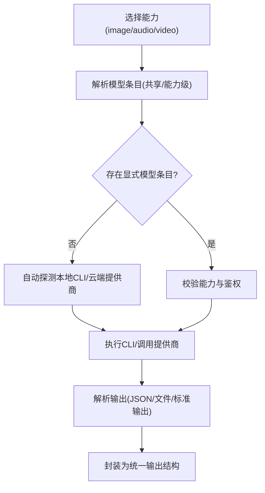
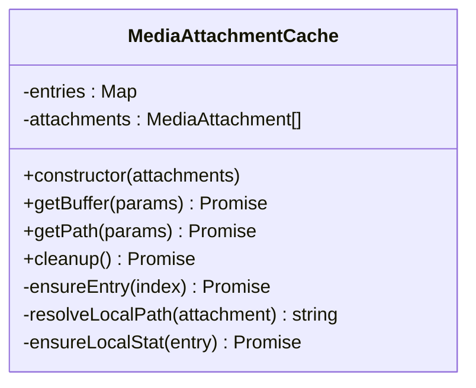
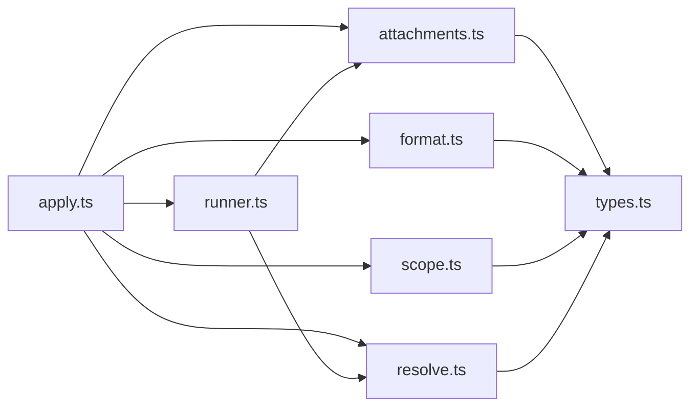

# 媒体技能

<cite>
**本文引用的文件**
- [src/media-understanding/index.ts](file://src/media-understanding/index.ts)
- [src/media-understanding/types.ts](file://src/media-understanding/types.ts)
- [src/media-understanding/apply.ts](file://src/media-understanding/apply.ts)
- [src/media-understanding/format.ts](file://src/media-understanding/format.ts)
- [src/media-understanding/scope.ts](file://src/media-understanding/scope.ts)
- [src/media-understanding/runner.ts](file://src/media-understanding/runner.ts)
- [src/media-understanding/attachments.ts](file://src/media-understanding/attachments.ts)
- [src/media-understanding/concurrency.ts](file://src/media-understanding/concurrency.ts)
- [src/media-understanding/resolve.ts](file://src/media-understanding/resolve.ts)
- [skills/camsnap/SKILL.md](file://skills/camsnap/SKILL.md)
- [skills/video-frames/SKILL.md](file://skills/video-frames/SKILL.md)
- [skills/openai-whisper/SKILL.md](file://skills/openai-whisper/SKILL.md)
- [skills/sherpa-onnx-tts/SKILL.md](file://skills/sherpa-onnx-tts/SKILL.md)
</cite>

## 目录

1. [简介](#简介)
2. [项目结构](#项目结构)
3. [核心组件](#核心组件)
4. [架构总览](#架构总览)
5. [详细组件分析](#详细组件分析)
6. [依赖关系分析](#依赖关系分析)
7. [性能考量](#性能考量)
8. [故障排除指南](#故障排除指南)
9. [结论](#结论)
10. [附录：使用示例与最佳实践](#附录使用示例与最佳实践)

## 简介

本文件面向OpenClaw媒体技能模块，系统化阐述媒体处理能力的架构设计与实现机制，覆盖图像捕获、视频帧提取、语音转文字、文本转语音等关键场景；解释媒体文件的处理流程、格式识别与转换、以及存储与缓存策略；并提供配置参数说明、性能优化建议与故障排除方法，辅以具体使用示例与最佳实践，帮助开发者快速理解与扩展媒体处理能力。

## 项目结构

媒体技能相关代码主要集中在src/media-understanding目录下，围绕“媒体理解”能力构建，包含类型定义、应用入口、格式化输出、作用域控制、执行器与并发调度、附件解析与缓存、以及模型/CLI选择与参数解析等模块。同时，仓库中提供多个技能示例（camsnap、video-frames、openai-whisper、sherpa-onnx-tts），用于演示外部工具集成与本地处理流程。

图表来源

- [src/media-understanding/apply.ts](file://src/media-understanding/apply.ts#L454-L557)
- [src/media-understanding/runner.ts](file://src/media-understanding/runner.ts#L1-L120)
- [src/media-understanding/attachments.ts](file://src/media-understanding/attachments.ts#L210-L426)
- [src/media-understanding/format.ts](file://src/media-understanding/format.ts#L32-L98)
- [src/media-understanding/scope.ts](file://src/media-understanding/scope.ts#L26-L65)
- [src/media-understanding/resolve.ts](file://src/media-understanding/resolve.ts#L141-L147)
- [src/media-understanding/concurrency.ts](file://src/media-understanding/concurrency.ts#L3-L34)
- [src/media-understanding/types.ts](file://src/media-understanding/types.ts#L1-L116)
- [skills/camsnap/SKILL.md](file://skills/camsnap/SKILL.md#L1-L46)
- [skills/video-frames/SKILL.md](file://skills/video-frames/SKILL.md#L1-L47)
- [skills/openai-whisper/SKILL.md](file://skills/openai-whisper/SKILL.md#L1-L39)
- [skills/sherpa-onnx-tts/SKILL.md](file://skills/sherpa-onnx-tts/SKILL.md#L1-L104)

章节来源

- [src/media-understanding/index.ts](file://src/media-understanding/index.ts#L1-L10)

## 核心组件

- 类型与接口（types.ts）：定义媒体理解的种类、能力、附件、输出、提供商接口及请求/响应结构，统一数据契约。
- 应用入口（apply.ts）：聚合所有能力，协调附件缓存、并发执行、结果格式化与上下文写回。
- 能力执行与模型/CLI选择（runner.ts）：自动探测本地CLI或云端提供商，解析参数、超时、提示词与最大字符数，执行并解析输出。
- 附件解析与缓存（attachments.ts）：支持本地路径、URL、MIME推断、大小限制、临时文件落地与清理。
- 结果格式化（format.ts）：将多路媒体理解输出整合为可读文本，保留用户原始文本与分段信息。
- 作用域控制（scope.ts）：基于会话键、渠道与聊天类型进行允许/拒绝决策。
- 参数解析与并发（resolve.ts、concurrency.ts）：解析超时、提示词、并发度、最大字节数与字符数，并行调度任务。

章节来源

- [src/media-understanding/types.ts](file://src/media-understanding/types.ts#L1-L116)
- [src/media-understanding/apply.ts](file://src/media-understanding/apply.ts#L454-L557)
- [src/media-understanding/runner.ts](file://src/media-understanding/runner.ts#L67-L800)
- [src/media-understanding/attachments.ts](file://src/media-understanding/attachments.ts#L210-L426)
- [src/media-understanding/format.ts](file://src/media-understanding/format.ts#L32-L98)
- [src/media-understanding/scope.ts](file://src/media-understanding/scope.ts#L26-L65)
- [src/media-understanding/resolve.ts](file://src/media-understanding/resolve.ts#L19-L188)
- [src/media-understanding/concurrency.ts](file://src/media-understanding/concurrency.ts#L3-L34)

## 架构总览

媒体技能的整体流程从消息上下文出发，按能力顺序（图像、音频、视频）依次评估与执行，结合作用域控制、并发调度与附件缓存，最终将理解结果与文件内容块注入到消息体中，供后续命令与代理逻辑使用。

图表来源

- [src/media-understanding/apply.ts](file://src/media-understanding/apply.ts#L454-L557)
- [src/media-understanding/runner.ts](file://src/media-understanding/runner.ts#L473-L488)
- [src/media-understanding/attachments.ts](file://src/media-understanding/attachments.ts#L221-L362)
- [src/media-understanding/format.ts](file://src/media-understanding/format.ts#L32-L98)
- [src/media-understanding/scope.ts](file://src/media-understanding/scope.ts#L26-L65)

## 详细组件分析

### 组件A：媒体理解应用入口（apply.ts）

- 职责
  - 解析用户原始文本与媒体附件，构建附件缓存。
  - 按能力顺序（图像、音频、视频）并发执行，收集输出与决策。
  - 将媒体理解结果格式化写回消息体，并设置转录文本与命令体。
  - 提取非媒体文件内容为“文件块”，注入消息体。
  - 清理附件缓存资源。
- 关键流程
  - 作用域解析与决策记录。
  - 并发执行各能力任务。
  - 输出格式化与上下文写回。
  - 文件内容块抽取与拼接。
- 性能与健壮性
  - 使用并发调度减少总耗时。
  - 对超大文件与超时进行跳过与错误分类，避免阻塞。

图表来源

- [src/media-understanding/apply.ts](file://src/media-understanding/apply.ts#L454-L557)

章节来源

- [src/media-understanding/apply.ts](file://src/media-understanding/apply.ts#L454-L557)

### 组件B：能力执行与模型/CLI选择（runner.ts）

- 职责
  - 自动探测本地CLI（如whisper、sherpa-onnx-offline、gemini）与云端提供商（通过注册表）。
  - 解析超时、提示词、最大字符数、查询参数与输出解析策略。
  - 执行CLI或调用提供商接口，解析标准输出或文件输出，生成统一输出结构。
- 关键机制
  - 二进制探测与缓存，避免重复搜索。
  - CLI输出解析（JSON/文本片段提取）。
  - 提供商鉴权与模型能力匹配。
- 复杂度与优化
  - O(N)遍历候选模型条目，结合能力过滤与缓存提升效率。
  - 通过并发与超时控制保障稳定性。

图表来源

- [src/media-understanding/runner.ts](file://src/media-understanding/runner.ts#L476-L502)
- [src/media-understanding/runner.ts](file://src/media-understanding/runner.ts#L642-L679)

章节来源

- [src/media-understanding/runner.ts](file://src/media-understanding/runner.ts#L67-L800)

### 组件C：附件解析与缓存（attachments.ts）

- 职责
  - 规范化媒体附件（路径/URL/MIME/索引）。
  - 支持按能力筛选与优先级排序（first/last/path/url）。
  - 缓存策略：优先内存缓冲，必要时落盘临时文件，统一返回Buffer/路径。
  - 大小限制与超时控制，异常分类（超大/超时/不可读）。
- 数据结构
  - 附件缓存类维护每个索引的缓存条目，支持清理。
- 复杂度
  - 获取缓冲/路径为O(1)命中，首次访问涉及I/O或网络请求。

图表来源

- [src/media-understanding/attachments.ts](file://src/media-understanding/attachments.ts#L210-L426)

章节来源

- [src/media-understanding/attachments.ts](file://src/media-understanding/attachments.ts#L210-L426)

### 组件D：结果格式化（format.ts）

- 职责
  - 将多路媒体理解输出（音频转录、图像描述、视频描述）组织为统一文本。
  - 保留用户原始文本与分段标题，支持多路同类型输出编号。
  - 提供音频转录的聚合格式化函数。
- 复杂度
  - 线性遍历输出列表，字符串拼接，时间复杂度O(N)。

章节来源

- [src/media-understanding/format.ts](file://src/media-understanding/format.ts#L32-L98)

### 组件E：作用域控制（scope.ts）

- 职责
  - 基于会话键前缀、渠道与聊天类型匹配规则，决定是否允许媒体理解。
  - 默认允许，规则未命中则采用默认值。
- 复杂度
  - 线性扫描规则，时间复杂度O(R)。

章节来源

- [src/media-understanding/scope.ts](file://src/media-understanding/scope.ts#L26-L65)

### 组件F：参数解析与并发（resolve.ts、concurrency.ts）

- 职责
  - 解析超时、提示词、最大字节数/字符数、并发度与模型条目。
  - 并发执行任务，失败任务不影响整体结果，日志记录失败原因。
- 复杂度
  - 并发调度为固定槽位的流水线，时间复杂度近似O(T/W)（T为总任务耗时，W为并发数）。

章节来源

- [src/media-understanding/resolve.ts](file://src/media-understanding/resolve.ts#L19-L188)
- [src/media-understanding/concurrency.ts](file://src/media-understanding/concurrency.ts#L3-L34)

## 依赖关系分析

- 模块耦合
  - apply.ts作为编排者，依赖runner.ts、attachments.ts、format.ts、scope.ts、resolve.ts与concurrency.ts。
  - runner.ts依赖attachments.ts、resolve.ts、providers注册表与外部CLI/提供商。
  - attachments.ts依赖媒体MIME检测与远程下载工具。
- 外部依赖
  - 本地CLI：whisper、sherpa-onnx-offline、gemini等。
  - 技能示例：camsnap、video-frames、openai-whisper、sherpa-onnx-tts。
- 循环依赖
  - 未发现循环依赖；runner.ts对providers注册表仅读取，不反向依赖。

图表来源

- [src/media-understanding/apply.ts](file://src/media-understanding/apply.ts#L1-L50)
- [src/media-understanding/runner.ts](file://src/media-understanding/runner.ts#L1-L54)
- [src/media-understanding/attachments.ts](file://src/media-understanding/attachments.ts#L1-L15)
- [src/media-understanding/format.ts](file://src/media-understanding/format.ts#L1-L16)
- [src/media-understanding/scope.ts](file://src/media-understanding/scope.ts#L1-L24)
- [src/media-understanding/resolve.ts](file://src/media-understanding/resolve.ts#L1-L18)
- [src/media-understanding/types.ts](file://src/media-understanding/types.ts#L1-L116)

## 性能考量

- 并发策略
  - 使用并发执行不同能力与不同附件，显著降低端到端延迟。
  - 可通过配置调整并发度，平衡吞吐与资源占用。
- 附件缓存
  - 内存优先策略减少磁盘IO；超大文件直接落盘并及时清理。
  - 二进制探测结果缓存，避免重复PATH扫描。
- I/O与网络
  - 远程附件下载带超时与最大字节限制，防止慢连接与大文件拖垮系统。
- CLI与提供商
  - 优先本地CLI可显著降低网络开销；云端提供商需合理设置超时与重试。
- 文本处理
  - 对未知MIME进行启发式判定与字符集解码，避免无效处理。

[本节为通用性能建议，无需特定文件来源]

## 故障排除指南

- 常见错误与定位
  - 超大文件：检查maxBytes限制与附件大小，必要时拆分或降采样。
  - 超时：检查网络状况与CLI/提供商响应，适当增大超时或启用本地CLI。
  - 无法识别MIME：确认文件扩展名与内容头，必要时强制指定MIME。
  - 作用域拒绝：核对scope规则中的channel、chatType与sessionKey前缀。
  - 附件不可读：确认路径存在、权限正确、URL可达。
- 日志与调试
  - 开启详细日志可观察任务失败原因与MIME覆盖审计信息。
- 外部工具问题
  - 确认所需二进制在PATH中且具备执行权限；必要时指定绝对路径。
  - 检查环境变量（如TTS模型目录）与CLI参数是否正确。

章节来源

- [src/media-understanding/attachments.ts](file://src/media-understanding/attachments.ts#L221-L362)
- [src/media-understanding/runner.ts](file://src/media-understanding/runner.ts#L135-L177)
- [src/media-understanding/scope.ts](file://src/media-understanding/scope.ts#L26-L65)
- [src/media-understanding/resolve.ts](file://src/media-understanding/resolve.ts#L19-L22)

## 结论

媒体技能模块通过清晰的职责划分与稳健的执行策略，实现了从附件解析、能力执行、并发调度到结果格式化的完整链路。其可扩展的设计允许无缝接入新的提供商与CLI工具，同时通过作用域控制与严格的I/O限制保障了系统的可靠性与安全性。配合技能示例，开发者可以快速落地图像捕获、视频帧提取、语音转文字与文本转语音等常见媒体处理场景。

[本节为总结性内容，无需特定文件来源]

## 附录：使用示例与最佳实践

### 图像捕获（camsnap）

- 场景：从RTSP/ONVIF摄像头抓拍快照或录制短片。
- 最佳实践
  - 先进行短时测试，确认分辨率与曝光后再录制长片段。
  - 使用本地FFmpeg管道进行预览与质量验证。
- 参考
  - [camsnap/SKILL.md](file://skills/camsnap/SKILL.md#L29-L46)

章节来源

- [skills/camsnap/SKILL.md](file://skills/camsnap/SKILL.md#L29-L46)

### 视频帧提取（video-frames）

- 场景：从视频中提取单帧或缩略图，便于快速审阅。
- 最佳实践
  - 使用时间戳定位关键帧，优先JPG分享、PNG用于UI截图。
  - 配置合适的输出质量与尺寸，平衡清晰度与体积。
- 参考
  - [video-frames/SKILL.md](file://skills/video-frames/SKILL.md#L29-L47)

章节来源

- [skills/video-frames/SKILL.md](file://skills/video-frames/SKILL.md#L29-L47)

### 语音转文字（openai-whisper）

- 场景：本地离线语音转文字，无需API密钥。
- 最佳实践
  - 根据准确度与速度需求选择模型大小；首次运行会下载模型缓存。
  - 使用任务切换（转写/翻译）与输出格式控制。
- 参考
  - [openai-whisper/SKILL.md](file://skills/openai-whisper/SKILL.md#L29-L39)

章节来源

- [skills/openai-whisper/SKILL.md](file://skills/openai-whisper/SKILL.md#L29-L39)

### 文本转语音（sherpa-onnx-tts）

- 场景：本地离线文本转语音，支持多平台与多模型。
- 最佳实践
  - 下载对应平台runtime与语音模型，配置环境变量指向模型目录。
  - 如模型目录包含多个ONNX文件，明确指定模型文件或令牌文件。
- 参考
  - [sherpa-onnx-tts/SKILL.md](file://skills/sherpa-onnx-tts/SKILL.md#L64-L104)

章节来源

- [skills/sherpa-onnx-tts/SKILL.md](file://skills/sherpa-onnx-tts/SKILL.md#L64-L104)

### 配置参数速览（媒体理解）

- 作用域（scope）
  - rules：按channel、chatType、sessionKey前缀匹配的允许/拒绝规则。
  - default：未命中规则时的默认行为。
- 能力级配置（tools.media.<capability>）
  - enabled：是否启用该能力。
  - models：显式提供的模型条目（含能力过滤）。
  - maxBytes/maxChars：输入大小与输出长度限制。
  - concurrency：并发度。
  - providerOptions/deepgram：提供商查询参数兼容映射。
- 共享模型（tools.media.models）
  - 作为全局模型池，按能力过滤后参与选择。
- 附件策略（tools.media.attachments）
  - prefer：优先顺序（first/last/path/url）。
  - mode：选择模式（first/all）。
  - maxAttachments：每能力最大附件数。

章节来源

- [src/media-understanding/resolve.ts](file://src/media-understanding/resolve.ts#L67-L188)
- [src/media-understanding/scope.ts](file://src/media-understanding/scope.ts#L26-L65)
