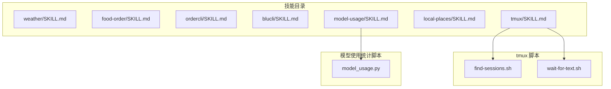
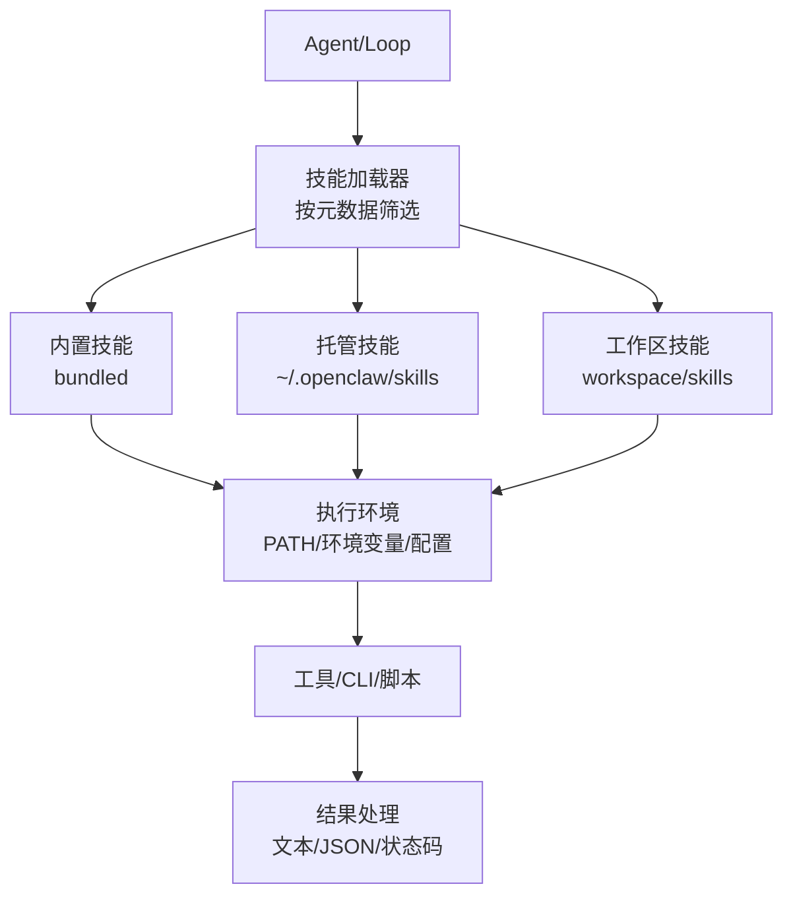
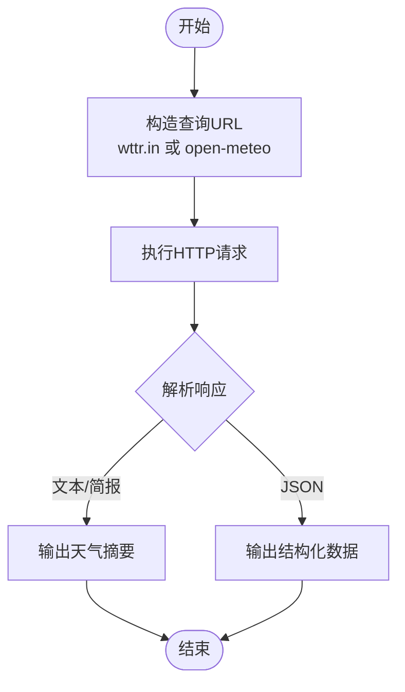
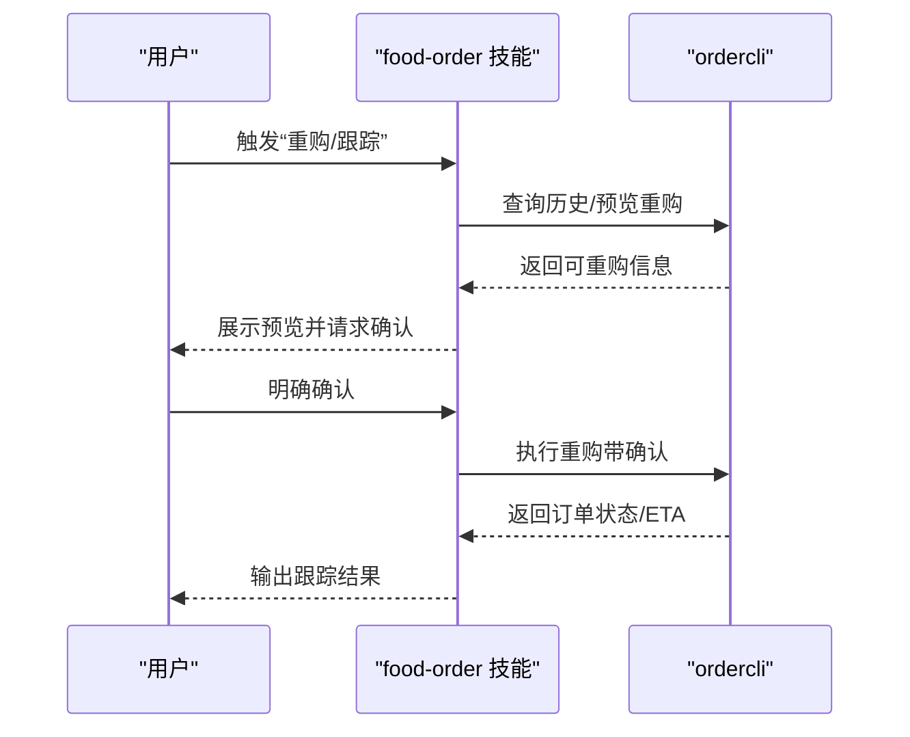
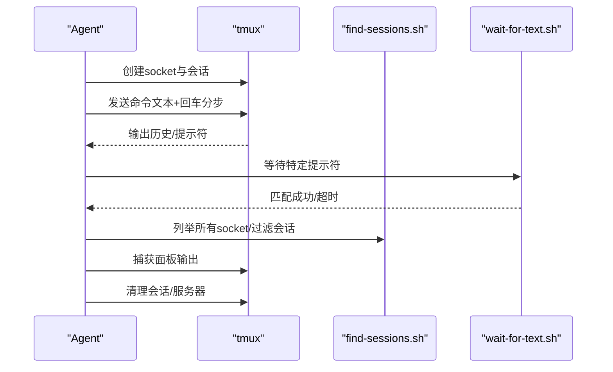
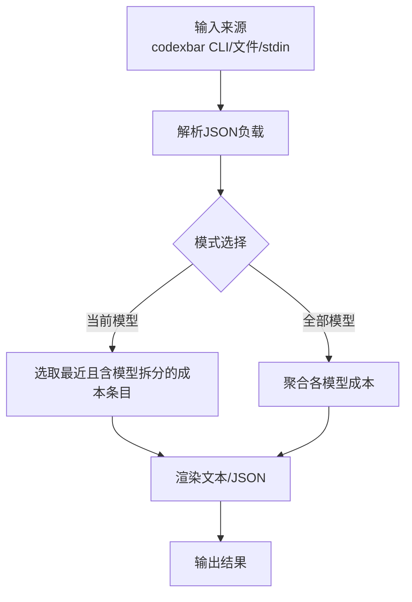

# 实用工具技能

<cite>
**本文引用的文件**
- [skills/weather/SKILL.md](file://skills/weather/SKILL.md)
- [skills/food-order/SKILL.md](file://skills/food-order/SKILL.md)
- [skills/ordercli/SKILL.md](file://skills/ordercli/SKILL.md)
- [skills/blucli/SKILL.md](file://skills/blucli/SKILL.md)
- [skills/tmux/SKILL.md](file://skills/tmux/SKILL.md)
- [skills/tmux/scripts/find-sessions.sh](file://skills/tmux/scripts/find-sessions.sh)
- [skills/tmux/scripts/wait-for-text.sh](file://skills/tmux/scripts/wait-for-text.sh)
- [skills/local-places/SKILL.md](file://skills/local-places/SKILL.md)
- [skills/model-usage/SKILL.md](file://skills/model-usage/SKILL.md)
- [skills/model-usage/scripts/model_usage.py](file://skills/model-usage/scripts/model_usage.py)
- [docs/tools/skills.md](file://docs/tools/skills.md)
</cite>

## 目录

1. [简介](#简介)
2. [项目结构](#项目结构)
3. [核心组件](#核心组件)
4. [架构总览](#架构总览)
5. [详细组件分析](#详细组件分析)
6. [依赖关系分析](#依赖关系分析)
7. [性能考量](#性能考量)
8. [故障排查指南](#故障排查指南)
9. [结论](#结论)
10. [附录](#附录)

## 简介

本文件面向OpenClaw实用工具技能模块，系统化梳理命令行工具、任务管理、天气查询、食物订购等场景下的设计目标、执行环境、依赖管理与结果处理机制，并提供配置项、参数说明与使用示例。同时覆盖工具链集成、批量处理与自动化工作流的实现方法，以及如何开发新工具技能与优化现有工具性能。

## 项目结构

OpenClaw通过“技能（Skill）”组织各类工具能力，每个技能以独立目录存放，核心是位于根部的说明文档与可选的辅助脚本。实用工具技能主要分布在skills目录下，例如：

- 天气查询：skills/weather
- 食物订购：skills/food-order 与 skills/ordercli
- 命令行工具：skills/blucli
- 任务管理（tmux）：skills/tmux 及其脚本
- 本地地点服务：skills/local-places
- 模型使用统计：skills/model-usage 及其Python脚本

**图示来源**

- [skills/weather/SKILL.md](file://skills/weather/SKILL.md#L1-L55)
- [skills/food-order/SKILL.md](file://skills/food-order/SKILL.md#L1-L49)
- [skills/ordercli/SKILL.md](file://skills/ordercli/SKILL.md#L1-L79)
- [skills/blucli/SKILL.md](file://skills/blucli/SKILL.md#L1-L48)
- [skills/tmux/SKILL.md](file://skills/tmux/SKILL.md#L1-L136)
- [skills/tmux/scripts/find-sessions.sh](file://skills/tmux/scripts/find-sessions.sh#L1-L113)
- [skills/tmux/scripts/wait-for-text.sh](file://skills/tmux/scripts/wait-for-text.sh#L1-L84)
- [skills/local-places/SKILL.md](file://skills/local-places/SKILL.md#L1-L103)
- [skills/model-usage/SKILL.md](file://skills/model-usage/SKILL.md#L1-L70)
- [skills/model-usage/scripts/model_usage.py](file://skills/model-usage/scripts/model_usage.py#L1-L311)

**章节来源**

- [skills/weather/SKILL.md](file://skills/weather/SKILL.md#L1-L55)
- [skills/food-order/SKILL.md](file://skills/food-order/SKILL.md#L1-L49)
- [skills/ordercli/SKILL.md](file://skills/ordercli/SKILL.md#L1-L79)
- [skills/blucli/SKILL.md](file://skills/blucli/SKILL.md#L1-L48)
- [skills/tmux/SKILL.md](file://skills/tmux/SKILL.md#L1-L136)
- [skills/local-places/SKILL.md](file://skills/local-places/SKILL.md#L1-L103)
- [skills/model-usage/SKILL.md](file://skills/model-usage/SKILL.md#L1-L70)

## 核心组件

- 技能加载与筛选：OpenClaw在启动会扫描三类技能来源并按优先级合并，同时基于元数据进行运行时筛选（如操作系统、二进制依赖、环境变量、配置项等）。
- 工具调用与结果处理：技能内定义命令行或脚本调用方式，输出格式（文本/JSON），并提供安全规则（如食物订购需显式确认）。
- 辅助脚本：tmux技能配套了会话发现与等待文本的Shell脚本；模型使用统计提供了Python脚本解析与汇总逻辑。

**章节来源**

- [docs/tools/skills.md](file://docs/tools/skills.md#L1-L301)
- [skills/model-usage/scripts/model_usage.py](file://skills/model-usage/scripts/model_usage.py#L1-L311)

## 架构总览

OpenClaw的工具技能采用“声明式+可执行”的模式：技能以Markdown描述工具使用方式与约束，运行时由OpenClaw根据元数据决定是否可用，并在受控环境中执行。

**图示来源**

- [docs/tools/skills.md](file://docs/tools/skills.md#L13-L48)

**章节来源**

- [docs/tools/skills.md](file://docs/tools/skills.md#L1-L301)

## 详细组件分析

### 天气查询（weather）

- 设计目标：提供无需API密钥的当前天气与预报查询，支持多种格式与单位切换。
- 执行环境：依赖curl，无额外环境变量要求。
- 结果处理：支持简洁格式与完整预报，返回人类可读文本或JSON（备用服务）。
- 使用要点：URL编码空格、机场代码、单位选择、PNG图片导出等。

**图示来源**

- [skills/weather/SKILL.md](file://skills/weather/SKILL.md#L12-L54)

**章节来源**

- [skills/weather/SKILL.md](file://skills/weather/SKILL.md#L1-L55)

### 食物订购（food-order 与 ordercli）

- 设计目标：安全地重购Foodora订单，先预览再确认下单，避免误操作。
- 执行环境：依赖ordercli二进制；首次使用需设置国家、登录或导入会话。
- 安全规则：未显式确认不执行带购物车变更的操作。
- 结果处理：历史列表、订单详情、ETA跟踪；支持JSON机器可读输出与调试配置隔离。

**图示来源**

- [skills/food-order/SKILL.md](file://skills/food-order/SKILL.md#L10-L48)
- [skills/ordercli/SKILL.md](file://skills/ordercli/SKILL.md#L36-L78)

**章节来源**

- [skills/food-order/SKILL.md](file://skills/food-order/SKILL.md#L1-L49)
- [skills/ordercli/SKILL.md](file://skills/ordercli/SKILL.md#L1-L79)

### 命令行工具（blucli）

- 设计目标：控制Bluesound/NAD播放器，支持设备发现、播放控制、音量与分组。
- 执行环境：依赖blu二进制；可通过设备ID/名称/别名或环境变量指定目标。
- 结果处理：建议使用--json便于脚本解析；变更播放前应确认目标设备。

**章节来源**

- [skills/blucli/SKILL.md](file://skills/blucli/SKILL.md#L1-L48)

### 任务管理（tmux）

- 设计目标：通过tmux远程控制交互式CLI，发送按键与抓取面板输出，适合并行编码代理。
- 执行环境：依赖tmux；仅在darwin/linux可用；支持自定义socket目录。
- 关键流程：创建私有socket与会话、发送输入（注意分离文本与回车）、捕获输出、轮询完成、清理会话。
- 辅助脚本：find-sessions.sh用于枚举会话；wait-for-text.sh用于按正则等待提示符。

**图示来源**

- [skills/tmux/SKILL.md](file://skills/tmux/SKILL.md#L12-L136)
- [skills/tmux/scripts/find-sessions.sh](file://skills/tmux/scripts/find-sessions.sh#L1-L113)
- [skills/tmux/scripts/wait-for-text.sh](file://skills/tmux/scripts/wait-for-text.sh#L1-L84)

**章节来源**

- [skills/tmux/SKILL.md](file://skills/tmux/SKILL.md#L1-L136)
- [skills/tmux/scripts/find-sessions.sh](file://skills/tmux/scripts/find-sessions.sh#L1-L113)
- [skills/tmux/scripts/wait-for-text.sh](file://skills/tmux/scripts/wait-for-text.sh#L1-L84)

### 本地地点服务（local-places）

- 设计目标：通过本地Google Places代理搜索地点，两步流程：先解析位置，再按偏置搜索。
- 执行环境：依赖uv与uvicorn；需要GOOGLE_PLACES_API_KEY环境变量。
- 结果处理：返回地点列表与详情，支持分页令牌继续翻页。

**章节来源**

- [skills/local-places/SKILL.md](file://skills/local-places/SKILL.md#L1-L103)

### 模型使用统计（model-usage）

- 设计目标：从CodexBar本地成本日志中按模型汇总使用成本，支持“当前模型”与“全部模型”两种视图。
- 执行环境：依赖codexbar二进制；可从CLI或文件/stdin读取JSON。
- 结果处理：文本或JSON输出；支持限制天数、指定模型、美化JSON。

**图示来源**

- [skills/model-usage/SKILL.md](file://skills/model-usage/SKILL.md#L33-L70)
- [skills/model-usage/scripts/model_usage.py](file://skills/model-usage/scripts/model_usage.py#L236-L311)

**章节来源**

- [skills/model-usage/SKILL.md](file://skills/model-usage/SKILL.md#L1-L70)
- [skills/model-usage/scripts/model_usage.py](file://skills/model-usage/scripts/model_usage.py#L1-L311)

## 依赖关系分析

- 元数据门控：技能通过metadata.openclaw声明依赖（二进制、环境变量、配置、平台），OpenClaw在加载时进行筛选。
- 安装器：技能可声明安装器（brew/go/node/download），用于在UI中引导安装。
- 运行时注入：OpenClaw在每次会话开始时快照可用技能，并在运行时注入所需环境变量与配置。
- 远程节点：当Gateway在Linux但连接了允许system.run的macOS节点时，可在该节点上探测到二进制后将对应技能视为可用。

**图示来源**

- [docs/tools/skills.md](file://docs/tools/skills.md#L105-L186)

**章节来源**

- [docs/tools/skills.md](file://docs/tools/skills.md#L1-L301)

## 性能考量

- 技能列表注入开销：OpenClaw会在系统提示词中注入可用技能清单，字符长度影响token消耗，应合理控制技能数量与描述长度。
- tmux交互延迟：发送输入与等待提示符存在轮询与网络/进程开销，建议合理设置轮询间隔与超时。
- 天气查询与地点服务：HTTP请求次数与数据大小影响性能，优先使用紧凑格式与必要字段。
- 模型使用统计：大时间窗口的JSON解析与聚合可能较耗时，可限制天数或使用缓存。

**章节来源**

- [docs/tools/skills.md](file://docs/tools/skills.md#L267-L284)
- [skills/tmux/SKILL.md](file://skills/tmux/SKILL.md#L110-L136)
- [skills/weather/SKILL.md](file://skills/weather/SKILL.md#L12-L54)
- [skills/local-places/SKILL.md](file://skills/local-places/SKILL.md#L33-L103)
- [skills/model-usage/SKILL.md](file://skills/model-usage/SKILL.md#L33-L70)

## 故障排查指南

- 二进制缺失：检查metadata.openclaw.requires.bins是否满足；若在沙箱中运行，确保容器内也已安装。
- 环境变量/配置：确认metadata.openclaw.requires.env或config项已在运行时注入。
- tmux问题：验证socket路径、权限与tmux版本；使用find-sessions.sh列出会话；使用wait-for-text.sh定位阻塞点。
- 食物订购：未确认不执行带购物车变更的动作；使用--config隔离测试配置。
- 天气/地点服务：检查网络连通性与API密钥；对URL中的空格进行编码。
- 模型使用统计：确认codexbar已安装且可执行；检查JSON格式与provider匹配。

**章节来源**

- [docs/tools/skills.md](file://docs/tools/skills.md#L137-L186)
- [skills/tmux/SKILL.md](file://skills/tmux/SKILL.md#L117-L136)
- [skills/food-order/SKILL.md](file://skills/food-order/SKILL.md#L12-L48)
- [skills/weather/SKILL.md](file://skills/weather/SKILL.md#L12-L54)
- [skills/local-places/SKILL.md](file://skills/local-places/SKILL.md#L31-L32)
- [skills/model-usage/scripts/model_usage.py](file://skills/model-usage/scripts/model_usage.py#L24-L38)

## 结论

OpenClaw的实用工具技能以“声明+可执行”为核心，通过元数据门控与运行时注入保障安全性与可用性。命令行工具、任务管理、天气查询与食物订购等场景均具备清晰的执行流程与安全约束。结合tmux脚本与Python脚本，可实现复杂的批量与自动化工作流。建议在实际部署中关注依赖安装、环境注入与性能开销，并遵循各技能的安全规则。

## 附录

### 配置与参数速查

- 技能加载与优先级：工作区 > 托管 > 内置；可通过openclaw.json覆盖启用、环境变量与配置。
- tmux：支持自定义socket目录（OPENCLAW_TMUX_SOCKET_DIR/CLAWDBOT_TMUX_SOCKET_DIR），会话命名与目标格式为session:window.pane。
- weather：支持格式参数、单位参数、机场代码与PNG导出。
- ordercli/food-order：国家设置、登录/会话导入、历史查询、预览与确认下单、订单跟踪。
- blucli：设备选择优先级（--device > 环境变量 > 默认配置）。
- local-places：GOOGLE_PLACES_API_KEY；本地uvicorn服务端口与路由。
- model-usage：provider（codex/claude）、mode（current/all）、input（文件或stdin）、days限制、输出格式（text/json）。

**章节来源**

- [docs/tools/skills.md](file://docs/tools/skills.md#L188-L227)
- [skills/tmux/SKILL.md](file://skills/tmux/SKILL.md#L33-L48)
- [skills/weather/SKILL.md](file://skills/weather/SKILL.md#L12-L54)
- [skills/ordercli/SKILL.md](file://skills/ordercli/SKILL.md#L36-L78)
- [skills/blucli/SKILL.md](file://skills/blucli/SKILL.md#L36-L47)
- [skills/local-places/SKILL.md](file://skills/local-places/SKILL.md#L22-L32)
- [skills/model-usage/SKILL.md](file://skills/model-usage/SKILL.md#L33-L70)
