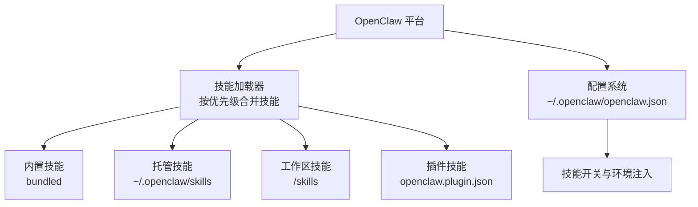
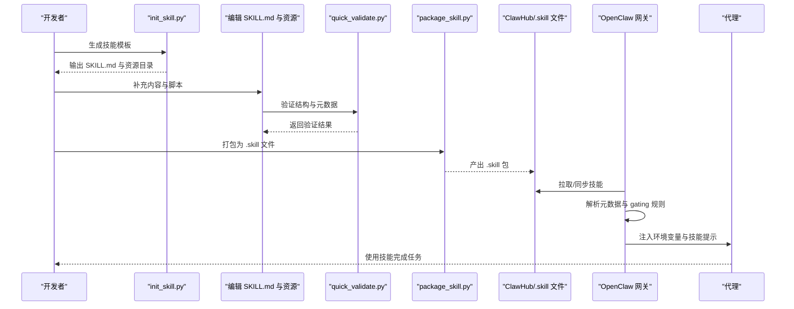
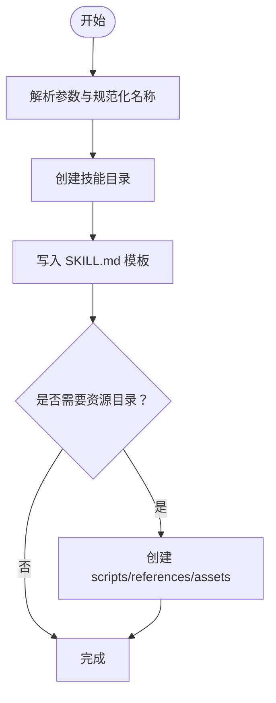
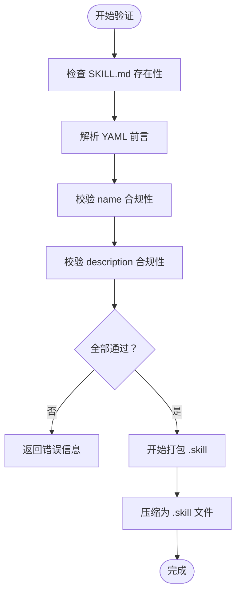
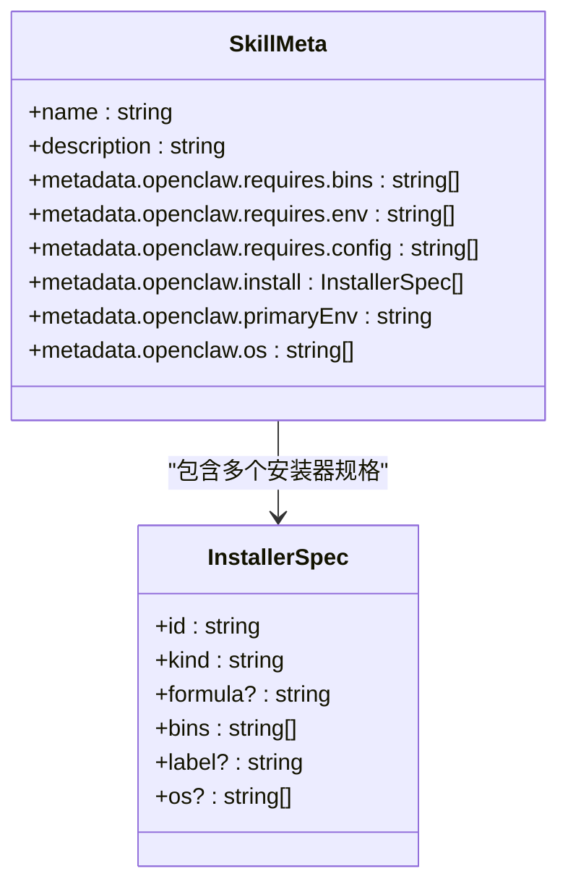

# 技能开发框架

<cite>
**本文档引用的文件**
- [README.md](file://README.md)
- [CONTRIBUTING.md](file://CONTRIBUTING.md)
- [skills.md](file://docs/tools/skills.md)
- [SKILL.md](file://skills/skill-creator/SKILL.md)
- [init_skill.py](file://skills/skill-creator/scripts/init_skill.py)
- [package_skill.py](file://skills/skill-creator/scripts/package_skill.py)
- [quick_validate.py](file://skills/skill-creator/scripts/quick_validate.py)
- [SKILL.md](file://skills/canvas/SKILL.md)
- [SKILL.md](file://skills/summarize/SKILL.md)
- [SKILL.md](file://skills/voice-call/SKILL.md)
- [openclaw.plugin.json](file://extensions/lobster/openclaw.plugin.json)
</cite>

## 目录

1. [简介](#简介)
2. [项目结构](#项目结构)
3. [核心组件](#核心组件)
4. [架构总览](#架构总览)
5. [详细组件分析](#详细组件分析)
6. [依赖关系分析](#依赖关系分析)
7. [性能考虑](#性能考虑)
8. [故障排除指南](#故障排除指南)
9. [结论](#结论)
10. [附录](#附录)

## 简介

本指南面向希望在 OpenClaw 平台上开发、测试与分发「技能」（Skills）的开发者。技能是模块化、可组合的知识与工作流单元，通过标准化的元数据与内容结构，向代理提供特定领域的专业知识与自动化能力。本指南覆盖从零开始创建技能、模板与配置规范、工具链与验证流程、测试与打包发布、调试与版本管理、最佳实践与性能优化，以及社区贡献与维护更新的完整流程。

## 项目结构

OpenClaw 的技能体系由以下部分组成：

- 核心平台与技能规范：位于 docs/tools/skills.md，定义了技能目录结构、加载优先级、环境注入、安装器、令牌开销等。
- 技能模板与工具：skills/skill-creator 提供初始化脚本、打包脚本与快速校验脚本，帮助开发者高效生成与验证技能。
- 示例技能：skills/canvas、skills/summarize、skills/voice-call 展示了不同类型的技能实现方式与元数据用法。
- 插件技能：extensions/\*/openclaw.plugin.json 中的 skills 字段可声明随插件一起提供的技能资源。

图表来源

- [skills.md](file://docs/tools/skills.md#L13-L48)
- [openclaw.plugin.json](file://extensions/lobster/openclaw.plugin.json#L1-L11)

章节来源

- [skills.md](file://docs/tools/skills.md#L1-L120)

## 核心组件

- 技能目录结构与元数据
  - 必需文件：每个技能目录必须包含 SKILL.md，并以 YAML 前言（frontmatter）声明 name 与 description。
  - 可选资源：scripts/（可执行脚本）、references/（参考文档）、assets/（输出资产）。
- 加载与优先级
  - 加载顺序：工作区技能 > 托管技能 > 内置技能；插件技能参与同一优先级规则。
- 元数据与触发
  - metadata.openclaw 可设置平台相关字段（如 os、requires、install、primaryEnv 等），用于运行时筛选与安装。
- 环境注入与安全
  - 运行时按需注入 env 与 apiKey，作用域限定于单次会话；第三方技能视为不受信输入，应配合沙箱与最小权限原则使用。

章节来源

- [skills.md](file://docs/tools/skills.md#L77-L186)
- [SKILL.md](file://skills/skill-creator/SKILL.md#L46-L126)

## 架构总览

技能在 OpenClaw 中的生命周期如下：

图表来源

- [init_skill.py](file://skills/skill-creator/scripts/init_skill.py#L255-L317)
- [quick_validate.py](file://skills/skill-creator/scripts/quick_validate.py#L15-L91)
- [package_skill.py](file://skills/skill-creator/scripts/package_skill.py#L20-L84)
- [skills.md](file://docs/tools/skills.md#L188-L244)

## 详细组件分析

### 组件一：技能模板与初始化工具

- 初始化脚本功能
  - 将 hyphen-case 的技能名规范化，创建 SKILL.md 模板与可选的 scripts/references/assets 目录。
  - 支持生成示例文件，便于快速上手。
- 使用场景
  - 新建技能：先 init，再编辑 SKILL.md 与资源。
  - 复用已有技能：跳过 init，直接进入编辑与打包阶段。

图表来源

- [init_skill.py](file://skills/skill-creator/scripts/init_skill.py#L255-L317)

章节来源

- [init_skill.py](file://skills/skill-creator/scripts/init_skill.py#L1-L379)
- [SKILL.md](file://skills/skill-creator/SKILL.md#L201-L221)

### 组件二：技能验证与打包

- 快速校验
  - 校验 SKILL.md 是否存在、前言格式是否正确、必需字段是否存在、命名是否符合规范、描述长度限制等。
- 打包流程
  - 在验证通过后，将技能目录压缩为 .skill 文件（zip），保留相对路径结构，便于后续分发与安装。

图表来源

- [quick_validate.py](file://skills/skill-creator/scripts/quick_validate.py#L15-L91)
- [package_skill.py](file://skills/skill-creator/scripts/package_skill.py#L20-L84)

章节来源

- [quick_validate.py](file://skills/skill-creator/scripts/quick_validate.py#L1-L102)
- [package_skill.py](file://skills/skill-creator/scripts/package_skill.py#L1-L112)

### 组件三：技能元数据与加载规则

- 元数据字段
  - name、description 为必填；metadata.openclaw 下可配置 gating（如 os、requires、install、primaryEnv）、UI 展示（emoji、homepage）等。
- 加载与过滤
  - 网关在启动或会话开始时读取技能，依据 gating 条件（PATH、环境变量、配置项）决定是否纳入候选集。
- 环境注入
  - 对于启用的技能，注入 env 与 apiKey，构建系统提示词，结束后恢复原环境。

图表来源

- [skills.md](file://docs/tools/skills.md#L105-L183)
- [SKILL.md](file://skills/summarize/SKILL.md#L1-L23)

章节来源

- [skills.md](file://docs/tools/skills.md#L105-L186)
- [SKILL.md](file://skills/summarize/SKILL.md#L1-L23)

### 组件四：示例技能解析

- Canvas 技能
  - 展示了 Canvas 主机、节点桥接与节点应用的三层架构，以及 URL 构造与调试要点。
- Summarize 技能
  - 展示了元数据中的安装器与模型密钥注入，以及命令行与配置文件的使用方式。
- Voice-call 技能
  - 展示了基于插件的技能 gating（requires.config），并通过 CLI 与工具接口暴露能力。

章节来源

- [SKILL.md](file://skills/canvas/SKILL.md#L1-L199)
- [SKILL.md](file://skills/summarize/SKILL.md#L1-L88)
- [SKILL.md](file://skills/voice-call/SKILL.md#L1-L46)

### 组件五：插件技能集成

- 插件可通过 openclaw.plugin.json 的 skills 字段声明技能目录，网关启用插件时自动参与技能加载与优先级计算。
- 插件技能同样支持 metadata.openclaw 的 gating 与安装器配置。

章节来源

- [openclaw.plugin.json](file://extensions/lobster/openclaw.plugin.json#L1-L11)
- [skills.md](file://docs/tools/skills.md#L41-L48)

## 依赖关系分析

- 技能与平台
  - 技能依赖网关的技能加载器与配置系统；gating 依赖 PATH、环境变量与 openclaw.json 配置。
- 技能与插件
  - 插件可内嵌技能，二者共享相同的元数据与加载机制。
- 资源与脚本
  - scripts/ 可直接执行，避免将大体量代码加载到上下文窗口；references/ 与 assets/ 作为补充材料按需加载。

图表来源

- [openclaw.plugin.json](file://extensions/lobster/openclaw.plugin.json#L1-L11)
- [skills.md](file://docs/tools/skills.md#L105-L186)

章节来源

- [skills.md](file://docs/tools/skills.md#L188-L244)

## 性能考虑

- 上下文窗口与令牌成本
  - 网关会在系统提示中注入可用技能列表，存在确定性的字符/令牌开销；应控制技能数量与描述长度。
- 加载与热重载
  - 技能列表在会话开始时快照，变更在新会话生效；可通过监视器在启用时进行热重载。
- 资源组织
  - 将长篇参考文档放入 references/，将资产放入 assets/，减少 SKILL.md 体积，降低上下文占用。

章节来源

- [skills.md](file://docs/tools/skills.md#L267-L284)
- [skills.md](file://docs/tools/skills.md#L252-L266)

## 故障排除指南

- 常见问题
  - 元数据缺失或格式错误：确保 SKILL.md 前言存在且为单行 YAML 对象。
  - 名称不合规：仅允许小写字母、数字与连字符，且不能以连字符开头或结尾，不允许连续连字符。
  - 描述过长或包含非法字符：描述长度不超过 1024 字符，不得包含尖括号。
  - 安装器与依赖：若声明 requires.bins 或 requires.env，需确保运行环境中已满足条件。
- 调试步骤
  - 使用 quick_validate.py 进行本地验证。
  - 检查网关日志与节点状态，确认 URL 与绑定模式匹配。
  - 对于远程节点，确认节点报告的命令支持与可达性。

章节来源

- [quick_validate.py](file://skills/skill-creator/scripts/quick_validate.py#L15-L91)
- [skills.md](file://docs/tools/skills.md#L69-L76)
- [SKILL.md](file://skills/canvas/SKILL.md#L151-L180)

## 结论

OpenClaw 的技能体系以标准化的目录结构与元数据为核心，结合网关的加载、过滤与环境注入机制，实现了可扩展、可移植、可维护的技能生态。通过 init、validate、package 的工具链，开发者可以高效地创建高质量技能，并借助 ClawHub 实现分发与同步。遵循本文档的最佳实践与性能建议，可在保证安全性的同时最大化技能的实用价值。

## 附录

### 附录A：从零开始创建一个技能的步骤清单

- 准备工作
  - 确认开发环境与 Node 版本要求。
- 创建技能
  - 使用 init_skill.py 生成模板与资源目录。
  - 编辑 SKILL.md 与 scripts/references/assets。
- 验证与打包
  - 使用 quick_validate.py 进行本地验证。
  - 使用 package_skill.py 生成 .skill 文件。
- 分发与安装
  - 推荐通过 ClawHub 发布与同步。
- 维护与更新
  - 根据用户反馈迭代 SKILL.md 与资源，必要时重新打包发布。

章节来源

- [init_skill.py](file://skills/skill-creator/scripts/init_skill.py#L255-L317)
- [quick_validate.py](file://skills/skill-creator/scripts/quick_validate.py#L15-L91)
- [package_skill.py](file://skills/skill-creator/scripts/package_skill.py#L20-L84)
- [skills.md](file://docs/tools/skills.md#L50-L68)

### 附录B：技能模板与元数据字段说明

- 必填字段
  - name：技能名称（hyphen-case，长度限制）
  - description：技能描述（长度限制，不含尖括号）
- 可选字段
  - metadata：单行 JSON 对象，支持 openclaw 命名空间下的 gating、安装器、UI 展示等。
- 资源组织
  - scripts/：可执行脚本，适合重复性与可靠性要求高的任务。
  - references/：参考文档，按需加载。
  - assets/：输出资产，不加载到上下文。

章节来源

- [SKILL.md](file://skills/skill-creator/SKILL.md#L46-L126)
- [skills.md](file://docs/tools/skills.md#L77-L104)

### 附录C：社区贡献与版本管理

- 贡献流程
  - 在 GitHub 讨论或 Discord 中沟通重大变更；提交 PR 前确保本地测试与 CI 通过。
- 版本与渠道
  - 支持 stable/beta/dev 三种发布通道；升级时运行 doctor 检查。
- 安全与漏洞报告
  - 通过指定仓库或邮件提交，提供重现步骤与修复建议。

章节来源

- [CONTRIBUTING.md](file://CONTRIBUTING.md#L34-L85)
- [README.md](file://README.md#L78-L85)
