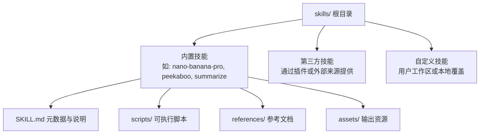
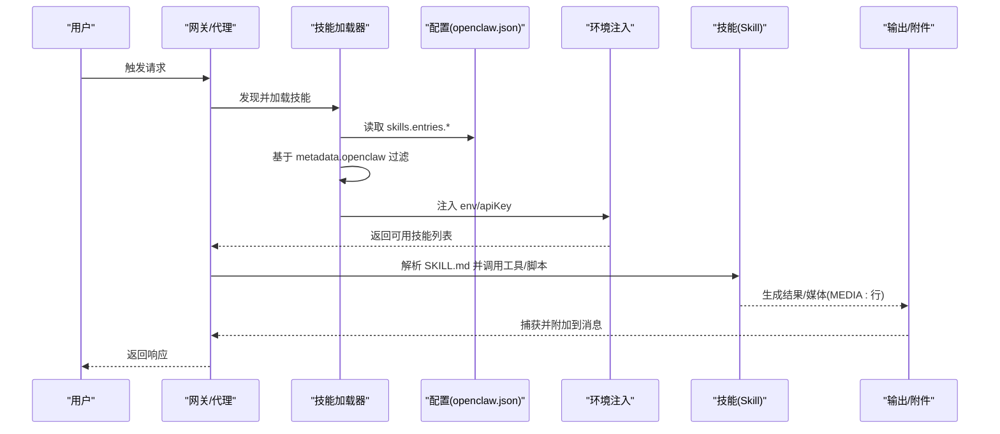
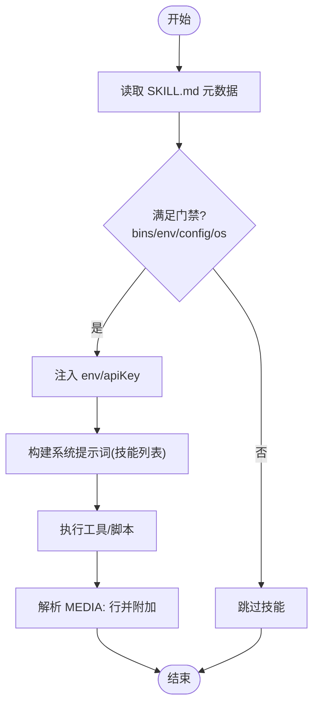
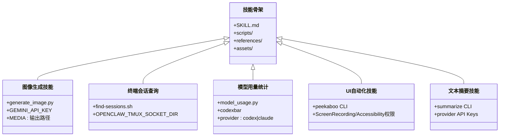
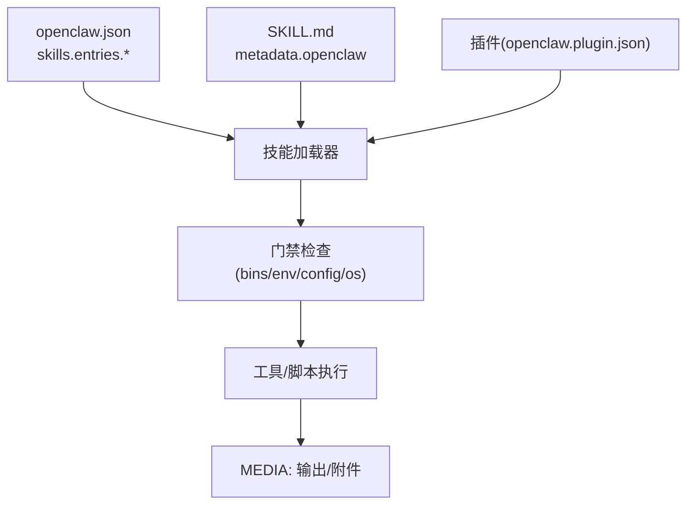

# 技能模块结构

<cite>
**本文档引用的文件**
- [docs/tools/skills.md](file://docs/tools/skills.md)
- [docs/tools/creating-skills.md](file://docs/tools/creating-skills.md)
- [skills/skill-creator/SKILL.md](file://skills/skill-creator/SKILL.md)
- [skills/skill-creator/scripts/init_skill.py](file://skills/skill-creator/scripts/init_skill.py)
- [skills/skill-creator/scripts/package_skill.py](file://skills/skill-creator/scripts/package_skill.py)
- [skills/nano-banana-pro/SKILL.md](file://skills/nano-banana-pro/SKILL.md)
- [skills/nano-banana-pro/scripts/generate_image.py](file://skills/nano-banana-pro/scripts/generate_image.py)
- [skills/peekaboo/SKILL.md](file://skills/peekaboo/SKILL.md)
- [skills/summarize/SKILL.md](file://skills/summarize/SKILL.md)
- [skills/model-usage/scripts/model_usage.py](file://skills/model-usage/scripts/model_usage.py)
- [skills/tmux/scripts/find-sessions.sh](file://skills/tmux/scripts/find-sessions.sh)
- [extensions/lobster/SKILL.md](file://extensions/lobster/SKILL.md)
</cite>

## 目录

1. [简介](#简介)
2. [项目结构](#项目结构)
3. [核心组件](#核心组件)
4. [架构总览](#架构总览)
5. [详细组件分析](#详细组件分析)
6. [依赖关系分析](#依赖关系分析)
7. [性能考量](#性能考量)
8. [故障排查指南](#故障排查指南)
9. [结论](#结论)
10. [附录](#附录)

## 简介

本文件系统性梳理 OpenClaw 技能模块（skills/）的代码结构与运行机制，覆盖内置技能、第三方技能与自定义技能的分类管理；技能元数据结构（SKILL.md）、配置文件格式与执行环境；技能开发框架、工具接口与数据交换协议；技能创建向导、调试方法与性能监控策略；以及技能商店集成、版本控制与社区贡献流程。

## 项目结构

skills/ 目录采用“按功能域划分”的扁平化组织方式：每个子目录代表一个独立技能，统一以 SKILL.md 作为技能元数据与使用说明入口，并可选包含 scripts/、references/、assets/ 等资源目录。该结构遵循 AgentSkills 规范，确保技能在不同运行环境中的可发现性与可执行性。

图示来源

- [skills/nano-banana-pro/SKILL.md](file://skills/nano-banana-pro/SKILL.md#L1-L59)
- [skills/peekaboo/SKILL.md](file://skills/peekaboo/SKILL.md#L1-L191)
- [skills/skill-creator/SKILL.md](file://skills/skill-creator/SKILL.md#L46-L100)

章节来源

- [docs/tools/skills.md](file://docs/tools/skills.md#L11-L49)

## 核心组件

- 技能元数据与加载规则
  - 加载顺序：工作区技能（最高优先级）→ 本地管理技能 → 内置技能（最低优先级），并支持额外加载目录配置。
  - 过滤规则：通过 SKILL.md 中 metadata.openclaw 字段在加载时进行平台、二进制、环境变量与配置项的门禁校验。
- 执行环境与注入
  - 在单次代理会话运行中，按需注入技能所需的环境变量与密钥，作用域限定于该运行周期。
- 配置与覆盖
  - 通过 ~/.openclaw/openclaw.json 的 skills.entries.<技能名> 节点启用/禁用、注入密钥与自定义配置。
- 插件与技能
  - 插件可在 openclaw.plugin.json 中声明 skills 目录，参与统一的加载与优先级规则。
- 技能商店与同步
  - 通过 ClawHub 实现技能的安装、更新与备份，安装默认落至当前工作区 skills/ 目录。

章节来源

- [docs/tools/skills.md](file://docs/tools/skills.md#L13-L68)
- [docs/tools/skills.md](file://docs/tools/skills.md#L105-L187)
- [docs/tools/skills.md](file://docs/tools/skills.md#L188-L227)
- [docs/tools/skills.md](file://docs/tools/skills.md#L41-L48)
- [docs/tools/skills.md](file://docs/tools/skills.md#L50-L67)

## 架构总览

技能系统围绕“发现—过滤—注入—执行—回传”闭环构建，结合“工作区/本地/内置”三层优先级与“插件技能”扩展点，形成灵活可控的能力装配体系。

图示来源

- [docs/tools/skills.md](file://docs/tools/skills.md#L228-L244)
- [docs/tools/skills.md](file://docs/tools/skills.md#L252-L266)
- [skills/nano-banana-pro/SKILL.md](file://skills/nano-banana-pro/SKILL.md#L48-L59)

## 详细组件分析

### 组件A：技能元数据与配置（SKILL.md）

- 必备字段
  - name、description：用于触发与展示的核心元信息。
  - metadata.openclaw：单行 JSON，承载门禁与安装器等高级元数据。
- 关键元数据项
  - openclaw.requires：bins（PATH 必备）、anyBins（任一存在）、env（环境变量或配置项）、config（openclaw.json 路径布尔值）。
  - openclaw.os：平台白名单（darwin/linux/win32）。
  - openclaw.primaryEnv：与 skills.entries.<name>.apiKey 对应的主密钥环境变量名。
  - openclaw.install：安装器清单（brew/node/go/uv/download 等），用于 UI/CLI 安装。
- 使用建议
  - 将“何时使用”写入 description，避免在正文重复；正文仅在触发后加载。
  - 使用 {baseDir} 引用技能根路径，便于跨平台复用脚本。

章节来源

- [docs/tools/skills.md](file://docs/tools/skills.md#L77-L104)
- [docs/tools/skills.md](file://docs/tools/skills.md#L105-L187)
- [skills/nano-banana-pro/SKILL.md](file://skills/nano-banana-pro/SKILL.md#L1-L24)
- [skills/peekaboo/SKILL.md](file://skills/peekaboo/SKILL.md#L1-L24)
- [skills/summarize/SKILL.md](file://skills/summarize/SKILL.md#L1-L23)

### 组件B：技能加载与过滤流程

图示来源

- [docs/tools/skills.md](file://docs/tools/skills.md#L105-L187)
- [docs/tools/skills.md](file://docs/tools/skills.md#L228-L244)

章节来源

- [docs/tools/skills.md](file://docs/tools/skills.md#L105-L187)
- [docs/tools/skills.md](file://docs/tools/skills.md#L228-L244)

### 组件C：技能开发框架与工具接口

- 初始化模板
  - 使用 init_skill.py 生成标准化技能骨架，支持选择创建 scripts/、references/、assets/ 目录及示例文件。
- 打包分发
  - 使用 package_skill.py 自动验证并打包为 .skill 文件（zip），便于共享与发布。
- 开发最佳实践
  - 严格区分“元数据（始终在上下文）”“正文（触发后加载）”“资源（按需加载）”，控制上下文占用。
  - 优先使用脚本执行确定性任务，减少模型解释误差。

章节来源

- [skills/skill-creator/SKILL.md](file://skills/skill-creator/SKILL.md#L201-L211)
- [skills/skill-creator/scripts/init_skill.py](file://skills/skill-creator/scripts/init_skill.py#L1-L379)
- [skills/skill-creator/scripts/package_skill.py](file://skills/skill-creator/scripts/package_skill.py#L1-L112)

### 组件D：内置技能示例与数据交换协议

- 图像生成技能（nano-banana-pro）
  - 通过 uv run 调用 generate_image.py，支持多图合成与分辨率自动推断。
  - 输出文件通过 MEDIA: 行被网关识别并自动附加到消息。
- 终端会话查询（tmux）
  - find-sessions.sh 支持多 socket 扫描与名称过滤，输出结构化列表供后续处理。
- 模型用量统计（model-usage）
  - 通过 codexbar 提供的成本数据聚合，支持当前模型与全量模型两种模式，输出文本或 JSON。
- UI 自动化（peekaboo）
  - 提供丰富的 CLI 子命令与参数组合，强调“先 see 再 click/type”的安全流程。
- 文本摘要（summarize）
  - 支持 URL、本地文件与 YouTube 链接，提供多种长度与输出格式选项。

图示来源

- [skills/nano-banana-pro/SKILL.md](file://skills/nano-banana-pro/SKILL.md#L1-L59)
- [skills/nano-banana-pro/scripts/generate_image.py](file://skills/nano-banana-pro/scripts/generate_image.py#L1-L185)
- [skills/tmux/scripts/find-sessions.sh](file://skills/tmux/scripts/find-sessions.sh#L1-L113)
- [skills/model-usage/scripts/model_usage.py](file://skills/model-usage/scripts/model_usage.py#L1-L311)
- [skills/peekaboo/SKILL.md](file://skills/peekaboo/SKILL.md#L1-L191)
- [skills/summarize/SKILL.md](file://skills/summarize/SKILL.md#L1-L88)

章节来源

- [skills/nano-banana-pro/SKILL.md](file://skills/nano-banana-pro/SKILL.md#L28-L59)
- [skills/nano-banana-pro/scripts/generate_image.py](file://skills/nano-banana-pro/scripts/generate_image.py#L129-L177)
- [skills/tmux/scripts/find-sessions.sh](file://skills/tmux/scripts/find-sessions.sh#L51-L74)
- [skills/model-usage/scripts/model_usage.py](file://skills/model-usage/scripts/model_usage.py#L236-L311)
- [skills/peekaboo/SKILL.md](file://skills/peekaboo/SKILL.md#L26-L191)
- [skills/summarize/SKILL.md](file://skills/summarize/SKILL.md#L25-L88)

### 组件E：第三方技能与工作流编排（Lobster）

- Lobster 提供多步骤工作流的审批检查点，适合需要人类确认的发送、发布、删除等操作。
- 协议要点
  - 结构化返回包含 protocolVersion、status、output、requiresApproval/resumeToken。
  - 支持 resume 动作继续已暂停的工作流。
- 使用场景
  - 邮件筛选与批量处理、状态持续监控与通知等。

章节来源

- [extensions/lobster/SKILL.md](file://extensions/lobster/SKILL.md#L1-L98)

## 依赖关系分析

- 技能加载器依赖
  - 配置解析：skills.entries.\*、skills.load.extraDirs、skills.allowBundled。
  - 门禁检查：PATH 二进制、环境变量、配置布尔值、平台限制。
  - 安装器：brew/node/go/uv/download，受平台与包管理器策略影响。
- 执行链路依赖
  - 工具链：如 uv、peekaboo、summarize、codexbar 等。
  - 环境：GEMINI_API_KEY、OPENCLAW_TMUX_SOCKET_DIR 等。
- 插件技能依赖
  - openclaw.plugin.json 中的 skills 目录声明与启用状态。

图示来源

- [docs/tools/skills.md](file://docs/tools/skills.md#L188-L227)
- [docs/tools/skills.md](file://docs/tools/skills.md#L105-L187)
- [docs/tools/skills.md](file://docs/tools/skills.md#L41-L48)

章节来源

- [docs/tools/skills.md](file://docs/tools/skills.md#L188-L227)
- [docs/tools/skills.md](file://docs/tools/skills.md#L105-L187)
- [docs/tools/skills.md](file://docs/tools/skills.md#L41-L48)

## 性能考量

- 上下文开销估算
  - 当有技能时，系统会注入紧凑的 XML 技能列表到系统提示词，基础开销约 195 字符，每技能约 97+字段长度（经 XML 转义后可能增加）。
  - 建议控制 SKILL.md 正文字数与 references/ 资源按需加载，避免不必要的上下文膨胀。
- 技能快照与热重载
  - 会话开始时快照可用技能，同一会话内复用；可通过监视器在 SKILL.md 变更时热更新。
- 沙箱与二进制
  - 若代理处于沙箱运行，需确保容器内具备所需二进制与网络能力，必要时通过 agents.defaults.sandbox.docker.setupCommand 安装。

章节来源

- [docs/tools/skills.md](file://docs/tools/skills.md#L240-L284)
- [docs/tools/skills.md](file://docs/tools/skills.md#L252-L266)
- [docs/tools/skills.md](file://docs/tools/skills.md#L137-L146)

## 故障排查指南

- 无法找到二进制
  - 检查 PATH 是否包含所需二进制；若在沙箱中，确认容器内已安装且可执行。
- 环境变量缺失
  - 通过 skills.entries.<name>.env 或 apiKey 注入；注意仅在进程未设置时生效。
- 权限问题
  - macOS UI 自动化类技能需 Screen Recording 与 Accessibility 权限。
- 输出未附加
  - 确认脚本输出包含 MEDIA: 行并指向有效文件路径。
- 插件技能不可见
  - 检查 openclaw.plugin.json 中 skills 目录是否正确声明，插件是否已启用。

章节来源

- [docs/tools/skills.md](file://docs/tools/skills.md#L69-L76)
- [docs/tools/skills.md](file://docs/tools/skills.md#L228-L239)
- [skills/peekaboo/SKILL.md](file://skills/peekaboo/SKILL.md#L187-L191)
- [skills/nano-banana-pro/SKILL.md](file://skills/nano-banana-pro/SKILL.md#L57-L59)
- [docs/tools/skills.md](file://docs/tools/skills.md#L41-L48)

## 结论

OpenClaw 技能模块以 SKILL.md 为核心元数据载体，结合三层加载优先级与严格的门禁过滤，实现了对内置、第三方与自定义技能的统一管理。通过 init_skill.py 与 package_skill.py 的开发工具链，开发者可以快速创建、验证与分发高质量技能；配合 ClawHub 的商店生态与配置覆盖机制，形成从设计、测试到发布的完整闭环。

## 附录

### 技能创建向导（步骤）

- 创建目录：在工作区 skills/ 下新建技能目录。
- 编写 SKILL.md：填写 name、description 与 metadata.openclaw，正文描述使用方法。
- 添加工具：在 scripts/ 中编写可执行脚本，或直接指导模型使用系统工具。
- 刷新/重启：请求代理刷新技能或重启网关以生效。
- 最佳实践：简洁明确、安全优先、本地测试。

章节来源

- [docs/tools/creating-skills.md](file://docs/tools/creating-skills.md#L13-L55)

### 调试方法

- 本地测试：使用 openclaw agent --message "use my new skill" 进行交互式验证。
- 日志与输出：关注 MEDIA: 行与工具返回码，定位执行失败原因。
- 权限与二进制：逐一核对 PATH、环境变量与 macOS 权限。

章节来源

- [docs/tools/creating-skills.md](file://docs/tools/creating-skills.md#L48-L51)
- [skills/nano-banana-pro/SKILL.md](file://skills/nano-banana-pro/SKILL.md#L57-L59)

### 性能监控策略

- 上下文成本：关注技能列表注入字符数与 XML 转义带来的增长。
- 资源按需加载：将长文档放入 references/，减少 SKILL.md 正文长度。
- 会话快照：理解技能快照在会话内的复用机制，合理安排变更时机。

章节来源

- [docs/tools/skills.md](file://docs/tools/skills.md#L267-L284)
- [skills/skill-creator/SKILL.md](file://skills/skill-creator/SKILL.md#L113-L126)

### 技能商店集成与版本控制

- 安装与更新：通过 clawhub install/update/sync 管理技能生命周期。
- 版本与备份：默认安装至工作区 skills/，可随工作区迁移与备份。
- 社区贡献：在 ClawHub 浏览与分享技能，遵循仓库规范与质量要求。

章节来源

- [docs/tools/skills.md](file://docs/tools/skills.md#L50-L67)
- [docs/tools/skills.md](file://docs/tools/skills.md#L296-L301)
