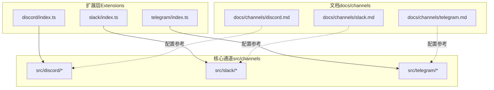
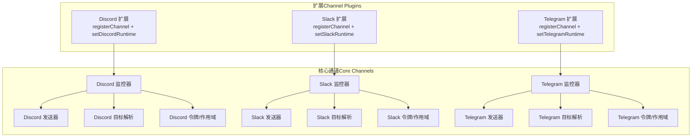
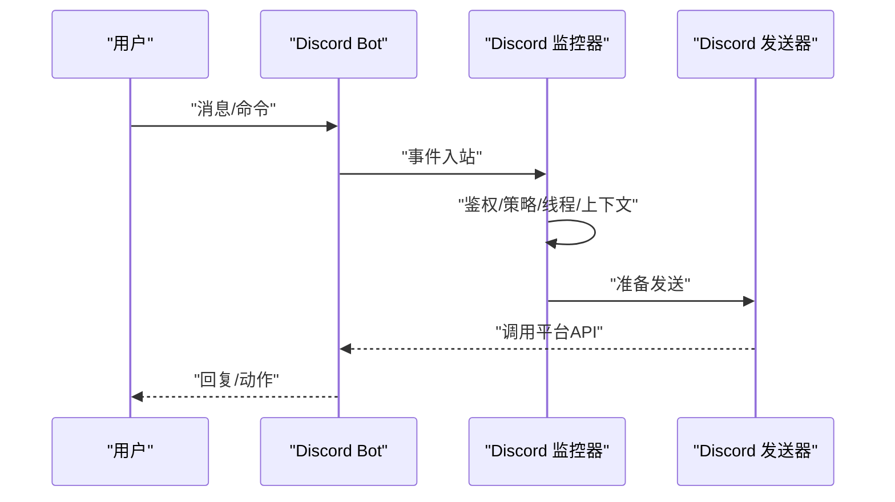
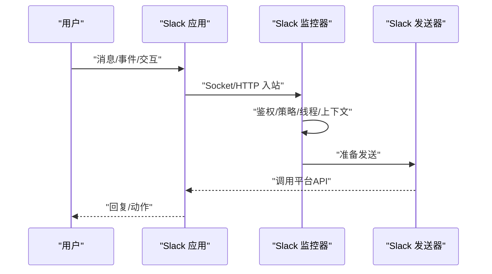
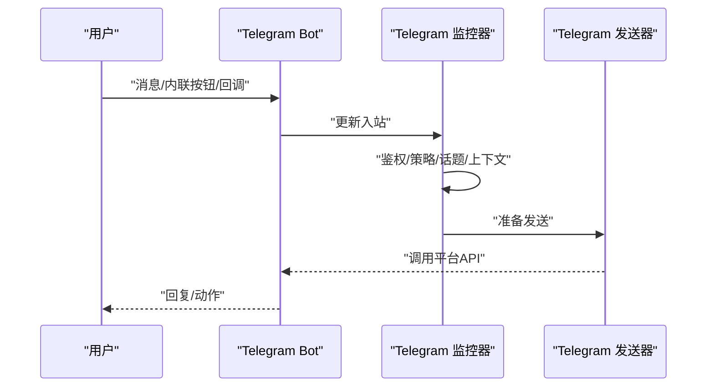
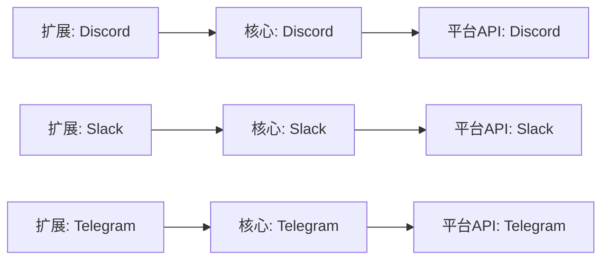

# 通信技能

<cite>
**本文引用的文件**
- [docs/channels/discord.md](file://docs/channels/discord.md)
- [docs/channels/slack.md](file://docs/channels/slack.md)
- [docs/channels/telegram.md](file://docs/channels/telegram.md)
- [extensions/discord/index.ts](file://extensions/discord/index.ts)
- [extensions/slack/index.ts](file://extensions/slack/index.ts)
- [extensions/telegram/index.ts](file://extensions/telegram/index.ts)
- [src/discord/index.ts](file://src/discord/index.ts)
- [src/slack/index.ts](file://src/slack/index.ts)
- [src/telegram/index.ts](file://src/telegram/index.ts)
- [src/discord/monitor.ts](file://src/discord/monitor.ts)
- [src/discord/send.ts](file://src/discord/send.ts)
- [src/discord/targets.ts](file://src/discord/targets.ts)
- [src/discord/token.ts](file://src/discord/token.ts)
- [src/discord/resolve-channels.ts](file://src/discord/resolve-channels.ts)
- [src/discord/resolve-users.ts](file://src/discord/resolve-users.ts)
- [src/discord/pluralkit.ts](file://src/discord/pluralkit.ts)
- [src/slack/monitor.ts](file://src/slack/monitor.ts)
- [src/slack/send.ts](file://src/slack/send.ts)
- [src/slack/targets.ts](file://src/slack/targets.ts)
- [src/slack/client.ts](file://src/slack/client.ts)
- [src/slack/token.ts](file://src/slack/token.ts)
- [src/slack/resolve-channels.ts](file://src/slack/resolve-channels.ts)
- [src/slack/resolve-users.ts](file://src/slack/resolve-users.ts)
- [src/slack/scopes.ts](file://src/slack/scopes.ts)
- [src/telegram/monitor.ts](file://src/telegram/monitor.ts)
- [src/telegram/send.ts](file://src/telegram/send.ts)
- [src/telegram/targets.ts](file://src/telegram/targets.ts)
- [src/telegram/bot.ts](file://src/telegram/bot.ts)
- [src/telegram/webhook.ts](file://src/telegram/webhook.ts)
- [src/telegram/token.ts](file://src/telegram/token.ts)
- [src/telegram/download.ts](file://src/telegram/download.ts)
- [src/telegram/format.ts](file://src/telegram/format.ts)
- [src/telegram/fetch.ts](file://src/telegram/fetch.ts)
- [src/telegram/sticker-cache.ts](file://src/telegram/sticker-cache.ts)
- [src/telegram/sent-message-cache.ts](file://src/telegram/sent-message-cache.ts)
- [src/telegram/probe.ts](file://src/telegram/probe.ts)
- [src/telegram/network-errors.ts](file://src/telegram/network-errors.ts)
- [src/telegram/network-config.ts](file://src/telegram/network-config.ts)
- [src/telegram/group-migration.ts](file://src/telegram/group-migration.ts)
- [src/telegram/draft-stream.ts](file://src/telegram/draft-stream.ts)
- [src/telegram/draft-chunking.ts](file://src/telegram/draft-chunking.ts)
- [src/telegram/inline-buttons.ts](file://src/telegram/inline-buttons.ts)
- [src/telegram/bot-native-commands.ts](file://src/telegram/bot-native-commands.ts)
- [src/telegram/bot-message-dispatch.ts](file://src/telegram/bot-message-dispatch.ts)
- [src/telegram/bot-message-context.ts](file://src/telegram/bot-message-context.ts)
- [src/telegram/bot-updates.ts](file://src/telegram/bot-updates.ts)
- [src/telegram/update-offset-store.ts](file://src/telegram/update-offset-store.ts)
- [src/telegram/voice.ts](file://src/telegram/voice.ts)
- [src/telegram/caption.ts](file://src/telegram/caption.ts)
- [src/telegram/model-buttons.ts](file://src/telegram/model-buttons.ts)
- [src/telegram/proxy.ts](file://src/telegram/proxy.ts)
- [src/telegram/reaction-level.ts](file://src/telegram/reaction-level.ts)
- [src/telegram/webhook-set.ts](file://src/telegram/webhook-set.ts)
- [src/telegram/api-logging.ts](file://src/telegram/api-logging.ts)
- [src/telegram/bot-access.ts](file://src/telegram/bot-access.ts)
- [src/telegram/allowed-updates.ts](file://src/telegram/allowed-updates.ts)
- [src/telegram/accounts.ts](file://src/telegram/accounts.ts)
- [src/telegram/bot-handlers.ts](file://src/telegram/bot-handlers.ts)
- [src/telegram/bot-message.ts](file://src/telegram/bot-message.ts)
- [src/telegram/bot/create-telegram-bot.accepts-group-messages-mentionpatterns-match-without-botusername.test.ts](file://src/telegram/bot/create-telegram-bot.accepts-group-messages-mentionpatterns-match-without-botusername.test.ts)
- [src/telegram/bot/create-telegram-bot.applies-topic-skill-filters-system-prompts.test.ts](file://src/telegram/bot/create-telegram-bot.applies-topic-skill-filters-system-prompts.test.ts)
- [src/telegram/bot/create-telegram-bot.blocks-all-group-messages-grouppolicy-is.test.ts](file://src/telegram/bot/create-telegram-bot.blocks-all-group-messages-grouppolicy-is.test.ts)
- [src/telegram/bot/create-telegram-bot.dedupes-duplicate-callback-query-updates-by-update.test.ts](file://src/telegram/bot/create-telegram-bot.dedupes-duplicate-callback-query-updates-by-update.test.ts)
- [src/telegram/bot/create-telegram-bot.installs-grammy-throttler.test.ts](file://src/telegram/bot/create-telegram-bot.installs-grammy-throttler.test.ts)
- [src/telegram/bot/create-telegram-bot.matches-tg-prefixed-allowfrom-entries-case-insensitively.test.ts](file://src/telegram/bot/create-telegram-bot.matches-tg-prefixed-allowfrom-entries-case-insensitively.test.ts)
- [src/telegram/bot/create-telegram-bot.matches-usernames-case-insensitively-grouppolicy-is.test.ts](file://src/telegram/bot/create-telegram-bot.matches-usernames-case-insensitively-grouppolicy-is.test.ts)
- [src/telegram/bot/create-telegram-bot.routes-dms-by-telegram-accountid-binding.test.ts](file://src/telegram/bot/create-telegram-bot.routes-dms-by-telegram-accountid-binding.test.ts)
- [src/telegram/bot/create-telegram-bot.sends-replies-without-native-reply-threading.test.ts](file://src/telegram/bot/create-telegram-bot.sends-replies-without-native-reply-threading.test.ts)
- [src/telegram/bot/media.downloads-media-file-path-no-file-download.test.ts](file://src/telegram/bot/media.downloads-media-file-path-no-file-download.test.ts)
- [src/telegram/bot/media.includes-location-text-ctx-fields-pins.test.ts](file://src/telegram/bot/media.includes-location-text-ctx-fields-pins.test.ts)
- [src/telegram/bot/media.test.ts](file://src/telegram/bot/media.test.ts)
- [src/telegram/bot.native-commands.test.ts](file://src/telegram/bot.native-commands.test.ts)
- [src/telegram/bot.native-commands.plugin-auth.test.ts](file://src/telegram/bot.native-commands.plugin-auth.test.ts)
- [src/telegram/bot.native-commands.ts](file://src/telegram/bot.native-commands.ts)
- [src/telegram/bot.native-commands.plugin-auth.test.ts](file://src/telegram/bot.native-commands.plugin-auth.test.ts)
- [src/telegram/bot.native-commands.test.ts](file://src/telegram/bot.native-commands.test.ts)
- [src/telegram/bot.native-commands.plugin-auth.test.ts](file://src/telegram/bot.native-commands.plugin-auth.test.ts)
- [src/telegram/bot.native-commands.ts](file://src/telegram/bot.native-commands.ts)
- [src/telegram/bot.native-commands.plugin-auth.test.ts](file://src/telegram/bot.native-commands.plugin-auth.test.ts)
- [src/telegram/bot.native-commands.test.ts](file://src/telegram/bot.native-commands.test.ts)
- [src/telegram/bot.native-commands.plugin-auth.test.ts](file://src/telegram/bot.native-commands.plugin-auth.test.ts)
- [src/telegram/bot.native-commands.ts](file://src/telegram/bot.native-commands.ts)
- [src/telegram/bot.native-commands.plugin-auth.test.ts](file://src/telegram/bot.native-commands.plugin-auth.test.ts)
- [src/telegram/bot.native-commands.test.ts](file://src/telegram/bot.native-commands.test.ts)
- [src/telegram/bot.native-commands.plugin-auth.test.ts](file://src/telegram/bot.native-commands.plugin-auth.test.ts)
- [src/telegram/bot.native-commands.ts](file://src/telegram/bot.native-commands.ts)
- [src/telegram/bot.native-commands.plugin-auth.test.ts](file://src/telegram/bot.native-commands.plugin-auth.test.ts)
- [src/telegram/bot.native-commands.test.ts](file://src/telegram/bot.native-commands.test.ts)
- [src/telegram/bot.native-commands.plugin-auth.test.ts](file://src/telegram/bot.native-commands.plugin-auth.test.ts)
- [src/telegram/bot.native-commands.ts](file://src/telegram/bot.native-commands.ts)
- [src/telegram/bot.native-commands.plugin-auth.test.ts](file://src/telegram/bot.native-commands.plugin-auth.test.ts)
- [src/telegram/bot.native-commands.test.ts](file://src/telegram/bot.native-commands.test.ts)
- [src/telegram/bot.native-commands.plugin-auth.test.ts](file://src/telegram/bot.native-commands.plugin-auth.test.ts)
- [src/telegram/bot.native-commands.ts](file://src/telegram/bot.native-commands.ts)
- [src/telegram/bot.native-commands.plugin-auth.test.ts](file://src/telegram/bot.native-commands.plugin-auth.test.ts)
- [src/telegram/bot.native-commands.test.ts](file://src/telegram/bot.native-commands.test.ts)
- [src/telegram/bot.native-commands.plugin-auth.test.ts](file://src/telegram/bot.native-commands.plugin-auth.test.ts)
- [src/telegram/bot.native-commands.ts](file......)
</cite>

## 目录

1. [简介](#简介)
2. [项目结构](#项目结构)
3. [核心组件](#核心组件)
4. [架构总览](#架构总览)
5. [详细组件分析](#详细组件分析)
6. [依赖关系分析](#依赖关系分析)
7. [性能考量](#性能考量)
8. [故障排查指南](#故障排查指南)
9. [结论](#结论)
10. [附录](#附录)

## 简介

本文件面向OpenClaw通信技能模块，系统化梳理与实现文档。内容覆盖Discord、Slack、Telegram三大消息平台的接入方式、认证模型、消息路由策略、配置方法、错误处理与重连机制，并给出扩展新平台与自定义消息格式的最佳实践。读者可据此快速完成平台对接、安全加固与运维优化。

## 项目结构

OpenClaw采用“插件式通道”架构：每个消息平台以独立扩展存在，通过统一的插件SDK注册为通道；后端核心在src目录下提供通用的监控、发送、目标解析、令牌管理等能力，平台差异由各扩展封装。

图表来源

- [extensions/discord/index.ts](file://extensions/discord/index.ts#L1-L18)
- [extensions/slack/index.ts](file://extensions/slack/index.ts#L1-L18)
- [extensions/telegram/index.ts](file://extensions/telegram/index.ts#L1-L18)
- [src/discord/index.ts](file://src/discord/index.ts#L1-L3)
- [src/slack/index.ts](file://src/slack/index.ts#L1-L26)
- [src/telegram/index.ts](file://src/telegram/index.ts#L1-L5)

章节来源

- [extensions/discord/index.ts](file://extensions/discord/index.ts#L1-L18)
- [extensions/slack/index.ts](file://extensions/slack/index.ts#L1-L18)
- [extensions/telegram/index.ts](file://extensions/telegram/index.ts#L1-L18)
- [src/discord/index.ts](file://src/discord/index.ts#L1-L3)
- [src/slack/index.ts](file://src/slack/index.ts#L1-L26)
- [src/telegram/index.ts](file://src/telegram/index.ts#L1-L5)

## 核心组件

- 插件入口：各平台扩展在index.ts中注册通道并设置运行时，统一暴露registerChannel接口。
- 监控器：负责事件监听、消息预处理、鉴权与策略执行、线程与话题上下文构建、系统事件注入。
- 发送器：封装平台API调用，负责分片、媒体下载/上传、回复标签、线程/话题转发。
- 目标解析：将用户输入的目标字符串解析为平台标准ID或会话键，支持DM/群组/频道/话题等。
- 令牌与作用域：集中解析与缓存bot/app/user token，按平台要求选择合适的访问范围。
- 平台特化：如Discord的PluralKit解析、Slack的Socket Mode/HTTP模式、Telegram的长轮询/Webhook与草稿流。

章节来源

- [src/discord/monitor.ts](file://src/discord/monitor.ts)
- [src/discord/send.ts](file://src/discord/send.ts)
- [src/discord/targets.ts](file://src/discord/targets.ts)
- [src/discord/token.ts](file://src/discord/token.ts)
- [src/slack/monitor.ts](file://src/slack/monitor.ts)
- [src/slack/send.ts](file://src/slack/send.ts)
- [src/slack/targets.ts](file://src/slack/targets.ts)
- [src/slack/client.ts](file://src/slack/client.ts)
- [src/slack/token.ts](file://src/slack/token.ts)
- [src/telegram/monitor.ts](file://src/telegram/monitor.ts)
- [src/telegram/send.ts](file://src/telegram/send.ts)
- [src/telegram/targets.ts](file://src/telegram/targets.ts)
- [src/telegram/bot.ts](file://src/telegram/bot.ts)
- [src/telegram/webhook.ts](file://src/telegram/webhook.ts)
- [src/telegram/token.ts](file://src/telegram/token.ts)

## 架构总览

OpenClaw的通信技能遵循“通道即插件”的设计：扩展负责桥接具体平台API，核心通道提供统一的监控、发送、目标解析与令牌管理。平台差异通过各自扩展实现，确保可维护性与可扩展性。

图表来源

- [extensions/discord/index.ts](file://extensions/discord/index.ts#L1-L18)
- [extensions/slack/index.ts](file://extensions/slack/index.ts#L1-L18)
- [extensions/telegram/index.ts](file://extensions/telegram/index.ts#L1-L18)
- [src/discord/monitor.ts](file://src/discord/monitor.ts)
- [src/slack/monitor.ts](file://src/slack/monitor.ts)
- [src/telegram/monitor.ts](file://src/telegram/monitor.ts)
- [src/discord/send.ts](file://src/discord/send.ts)
- [src/slack/send.ts](file://src/slack/send.ts)
- [src/telegram/send.ts](file://src/telegram/send.ts)
- [src/discord/targets.ts](file://src/discord/targets.ts)
- [src/slack/targets.ts](file://src/slack/targets.ts)
- [src/telegram/targets.ts](file://src/telegram/targets.ts)
- [src/discord/token.ts](file://src/discord/token.ts)
- [src/slack/token.ts](file://src/slack/token.ts)
- [src/telegram/token.ts](file://src/telegram/token.ts)

## 详细组件分析

### Discord 通道

- 认证与令牌
  - 支持botToken与appToken组合（Socket Mode），或仅botToken（HTTP模式）。
  - 令牌解析优先使用配置，其次环境变量（默认账户）。
- 运行模型
  - 网关持有连接；DM默认配对模式；公会频道隔离会话；提及控制与线程行为可配置。
- 消息路由
  - DM路由到主会话或按账户绑定路由；公会频道按channelId隔离；线程继承父频道配置。
- 命令与权限
  - 原生斜杠命令默认启用；命令授权与普通消息一致；支持PluralKit映射代理身份。
- 发送与分片
  - 支持回复标签、历史限制、媒体大小限制、分片与换行优先切分。
- 安全与审计
  - 支持允许列表、角色路由、提及要求、机器人消息忽略、反应通知等。

图表来源

- [src/discord/monitor.ts](file://src/discord/monitor.ts)
- [src/discord/send.ts](file://src/discord/send.ts)
- [src/discord/targets.ts](file://src/discord/targets.ts)
- [src/discord/token.ts](file://src/discord/token.ts)
- [src/discord/pluralkit.ts](file://src/discord/pluralkit.ts)

章节来源

- [docs/channels/discord.md](file://docs/channels/discord.md#L1-L485)
- [src/discord/index.ts](file://src/discord/index.ts#L1-L3)
- [src/discord/monitor.ts](file://src/discord/monitor.ts)
- [src/discord/send.ts](file://src/discord/send.ts)
- [src/discord/targets.ts](file://src/discord/targets.ts)
- [src/discord/token.ts](file://src/discord/token.ts)
- [src/discord/resolve-channels.ts](file://src/discord/resolve-channels.ts)
- [src/discord/resolve-users.ts](file://src/discord/resolve-users.ts)
- [src/discord/pluralkit.ts](file://src/discord/pluralkit.ts)

### Slack 通道

- 模式与令牌
  - 默认Socket Mode：需要botToken与appToken；HTTP模式：需要botToken与signingSecret。
  - 支持多账户，每账户可独立webhook路径。
- 访问控制与路由
  - DM策略：配对/允许名单/开放/禁用；群组策略：开放/允许名单/禁用；提及控制与用户白名单。
  - 会话键：DM为direct，群组为group，频道为channel，线程可追加threadTs后缀。
- 命令与斜杠
  - 原生命令默认关闭，需显式开启；或使用单个斜杠命令配置。
- 发送与媒体
  - 文本分片、换行优先；文件上传支持线程回复；入站附件下载与大小限制。
- 事件与动作
  - 编辑/删除/广播映射为系统事件；反应增删映射为系统事件；成员加入/离开、频道重命名、Pin增删映射为系统事件。

图表来源

- [src/slack/monitor.ts](file://src/slack/monitor.ts)
- [src/slack/send.ts](file://src/slack/send.ts)
- [src/slack/targets.ts](file://src/slack/targets.ts)
- [src/slack/client.ts](file://src/slack/client.ts)
- [src/slack/token.ts](file://src/slack/token.ts)
- [src/slack/scopes.ts](file://src/slack/scopes.ts)

章节来源

- [docs/channels/slack.md](file://docs/channels/slack.md#L1-L455)
- [src/slack/index.ts](file://src/slack/index.ts#L1-L26)
- [src/slack/monitor.ts](file://src/slack/monitor.ts)
- [src/slack/send.ts](file://src/slack/send.ts)
- [src/slack/targets.ts](file://src/slack/targets.ts)
- [src/slack/client.ts](file://src/slack/client.ts)
- [src/slack/token.ts](file://src/slack/token.ts)
- [src/slack/resolve-channels.ts](file://src/slack/resolve-channels.ts)
- [src/slack/resolve-users.ts](file://src/slack/resolve-users.ts)
- [src/slack/scopes.ts](file://src/slack/scopes.ts)

### Telegram 通道

- 模式与令牌
  - 默认长轮询（grammy Runner）；可选Webhook；支持多账户与webhook密钥。
  - 令牌解析优先配置，其次环境变量（默认账户）。
- 访问控制与路由
  - DM策略：配对/允许名单/开放/禁用；群组策略：开放/允许名单/禁用；提及控制与用户白名单。
  - 会话键：按群组ID隔离；论坛话题附加topic后缀；DM线程保留thread_id。
- 命令与菜单
  - 原生命令默认自动启用；支持自定义命令菜单条目（不自动实现行为）。
- 草稿流与格式化
  - 支持草稿气泡流式输出（partial/block）；HTML解析失败自动回退纯文本；链接预览可关闭。
- 发送与媒体
  - 支持回复标签、语音/视频消息、贴纸搜索与发送、反应通知级别与范围。
- 错误与网络
  - 提供网络错误分类、DNS/IPv6问题诊断、代理与超时配置、重试策略。

图表来源

- [src/telegram/monitor.ts](file://src/telegram/monitor.ts)
- [src/telegram/send.ts](file://src/telegram/send.ts)
- [src/telegram/targets.ts](file://src/telegram/targets.ts)
- [src/telegram/bot.ts](file://src/telegram/bot.ts)
- [src/telegram/webhook.ts](file://src/telegram/webhook.ts)
- [src/telegram/token.ts](file://src/telegram/token.ts)
- [src/telegram/draft-stream.ts](file://src/telegram/draft-stream.ts)
- [src/telegram/draft-chunking.ts](file://src/telegram/draft-chunking.ts)
- [src/telegram/format.ts](file://src/telegram/format.ts)
- [src/telegram/fetch.ts](file://src/telegram/fetch.ts)
- [src/telegram/download.ts](file://src/telegram/download.ts)
- [src/telegram/sticker-cache.ts](file://src/telegram/sticker-cache.ts)
- [src/telegram/sent-message-cache.ts](file://src/telegram/sent-message-cache.ts)
- [src/telegram/network-errors.ts](file://src/telegram/network-errors.ts)
- [src/telegram/network-config.ts](file://src/telegram/network-config.ts)
- [src/telegram/proxy.ts](file://src/telegram/proxy.ts)

章节来源

- [docs/channels/telegram.md](file://docs/channels/telegram.md#L1-L697)
- [src/telegram/index.ts](file://src/telegram/index.ts#L1-L5)
- [src/telegram/monitor.ts](file://src/telegram/monitor.ts)
- [src/telegram/send.ts](file://src/telegram/send.ts)
- [src/telegram/targets.ts](file://src/telegram/targets.ts)
- [src/telegram/bot.ts](file://src/telegram/bot.ts)
- [src/telegram/webhook.ts](file://src/telegram/webhook.ts)
- [src/telegram/token.ts](file://src/telegram/token.ts)
- [src/telegram/bot-native-commands.ts](file://src/telegram/bot-native-commands.ts)
- [src/telegram/bot-message-dispatch.ts](file://src/telegram/bot-message-dispatch.ts)
- [src/telegram/bot-message-context.ts](file://src/telegram/bot-message-context.ts)
- [src/telegram/bot-updates.ts](file://src/telegram/bot-updates.ts)
- [src/telegram/update-offset-store.ts](file://src/telegram/update-offset-store.ts)
- [src/telegram/voice.ts](file://src/telegram/voice.ts)
- [src/telegram/caption.ts](file://src/telegram/caption.ts)
- [src/telegram/model-buttons.ts](file://src/telegram/model-buttons.ts)
- [src/telegram/inline-buttons.ts](file://src/telegram/inline-buttons.ts)
- [src/telegram/reaction-level.ts](file://src/telegram/reaction-level.ts)
- [src/telegram/webhook-set.ts](file://src/telegram/webhook-set.ts)
- [src/telegram/api-logging.ts](file://src/telegram/api-logging.ts)
- [src/telegram/bot-access.ts](file://src/telegram/bot-access.ts)
- [src/telegram/allowed-updates.ts](file://src/telegram/allowed-updates.ts)
- [src/telegram/accounts.ts](file://src/telegram/accounts.ts)
- [src/telegram/bot-handlers.ts](file://src/telegram/bot-handlers.ts)
- [src/telegram/bot-message.ts](file://src/telegram/bot-message.ts)
- [src/telegram/group-migration.ts](file://src/telegram/group-migration.ts)
- [src/telegram/probe.ts](file://src/telegram/probe.ts)

## 依赖关系分析

- 插件注册依赖：扩展通过插件SDK注册通道并注入运行时，核心通道依赖各自的监控器与发送器。
- 平台差异：各平台的令牌解析、事件订阅、消息格式、线程/话题处理存在显著差异，通过扩展封装。
- 统一接口：发送器与目标解析器提供统一抽象，便于跨平台复用与测试。

图表来源

- [extensions/discord/index.ts](file://extensions/discord/index.ts#L1-L18)
- [extensions/slack/index.ts](file://extensions/slack/index.ts#L1-L18)
- [extensions/telegram/index.ts](file://extensions/telegram/index.ts#L1-L18)
- [src/discord/index.ts](file://src/discord/index.ts#L1-L3)
- [src/slack/index.ts](file://src/slack/index.ts#L1-L26)
- [src/telegram/index.ts](file://src/telegram/index.ts#L1-L5)

章节来源

- [extensions/discord/index.ts](file://extensions/discord/index.ts#L1-L18)
- [extensions/slack/index.ts](file://extensions/slack/index.ts#L1-L18)
- [extensions/telegram/index.ts](file://extensions/telegram/index.ts#L1-L18)
- [src/discord/index.ts](file://src/discord/index.ts#L1-L3)
- [src/slack/index.ts](file://src/slack/index.ts#L1-L26)
- [src/telegram/index.ts](file://src/telegram/index.ts#L1-L5)

## 性能考量

- 分片与限速
  - 文本分片与换行优先策略减少平台长度限制触发频率；草稿流在Telegram DM中提升感知延迟。
- 并发与队列
  - Telegram长轮询基于grammy Runner，支持按聊天/线程序列化与并发上限控制。
- 媒体处理
  - 下载/上传与大小限制避免内存峰值；贴纸缓存减少重复视觉识别开销。
- 网络稳定性
  - 代理与超时配置、IPv6/DNS问题诊断、重试策略降低平台不可达影响。

章节来源

- [src/telegram/draft-stream.ts](file://src/telegram/draft-stream.ts)
- [src/telegram/draft-chunking.ts](file://src/telegram/draft-chunking.ts)
- [src/telegram/network-errors.ts](file://src/telegram/network-errors.ts)
- [src/telegram/network-config.ts](file://src/telegram/network-config.ts)
- [src/telegram/proxy.ts](file://src/telegram/proxy.ts)
- [src/telegram/download.ts](file://src/telegram/download.ts)
- [src/telegram/sticker-cache.ts](file://src/telegram/sticker-cache.ts)

## 故障排查指南

- Discord
  - 未启用意图导致看不到消息；检查Message Content Intent与Server Members Intent；确认配对/允许名单；查看日志与doctor命令。
- Slack
  - Socket模式无法连接：校验bot/app token与Socket Mode开关；HTTP模式：校验signingSecret、webhook路径与请求URL；命令未触发：核对原生命令开关与用户/频道白名单。
- Telegram
  - 隐私模式导致群组消息不可见：BotFather关闭隐私模式并重新添加；命令注册失败：检查到api.telegram.org的出站可达性；轮询不稳定：检查DNS/A/AAAA解析与网络环境。

章节来源

- [docs/channels/discord.md](file://docs/channels/discord.md#L396-L454)
- [docs/channels/slack.md](file://docs/channels/slack.md#L374-L431)
- [docs/channels/telegram.md](file://docs/channels/telegram.md#L626-L670)

## 结论

OpenClaw通信技能通过“插件式通道+核心通道”的架构，实现了对Discord、Slack、Telegram的统一接入与差异化处理。借助完善的令牌管理、鉴权策略、消息路由与发送器抽象，系统在安全性、可扩展性与可运维性方面具备良好平衡。建议在生产环境中结合平台文档与本指南进行最小权限授权、严格的白名单与提及控制，并利用草稿流、分片与重试等能力优化用户体验与稳定性。

## 附录

### 配置要点与最佳实践

- Discord
  - 启用Message Content Intent与Server Members Intent；DM默认配对模式；群组默认允许名单；提及控制与PluralKit映射可选。
- Slack
  - Socket Mode默认；HTTP模式需配置signingSecret与webhook路径；原生命令默认关闭；线程会话键包含threadTs后缀。
- Telegram
  - 长轮询默认；Webhook需密钥；DM策略默认配对；群组策略默认允许名单；草稿流与HTML格式化可选。

章节来源

- [docs/channels/discord.md](file://docs/channels/discord.md#L24-L172)
- [docs/channels/slack.md](file://docs/channels/slack.md#L24-L194)
- [docs/channels/telegram.md](file://docs/channels/telegram.md#L24-L206)

### 扩展新平台支持与自定义消息格式

- 扩展步骤
  - 在extensions/new-platform目录创建插件入口，注册通道并设置运行时。
  - 在src/new-platform目录实现监控器、发送器、目标解析、令牌管理与平台特化逻辑。
  - 参考现有平台的测试用例组织风格，补充单元测试与集成测试。
- 自定义消息格式
  - 利用平台API的parse_mode/HTML/Markdown能力；在发送前进行格式转换与回退策略（如HTML失败回退纯文本）。
  - 对媒体与贴纸等特殊类型，建立缓存与去重策略，减少重复调用。

章节来源

- [extensions/discord/index.ts](file://extensions/discord/index.ts#L1-L18)
- [extensions/slack/index.ts](file://extensions/slack/index.ts#L1-L18)
- [extensions/telegram/index.ts](file://extensions/telegram/index.ts#L1-L18)
- [src/telegram/format.ts](file://src/telegram/format.ts)
- [src/telegram/download.ts](file://src/telegram/download.ts)
- [src/telegram/sticker-cache.ts](file://src/telegram/sticker-cache.ts)
