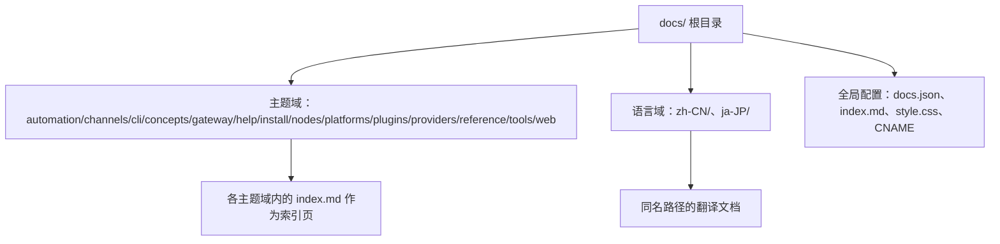
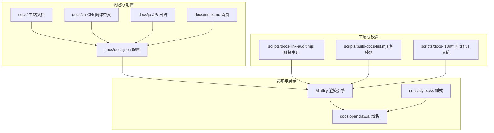
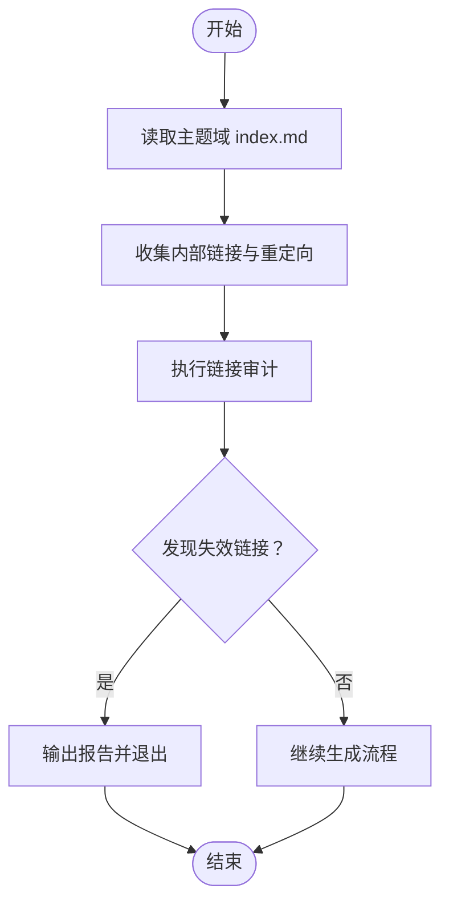
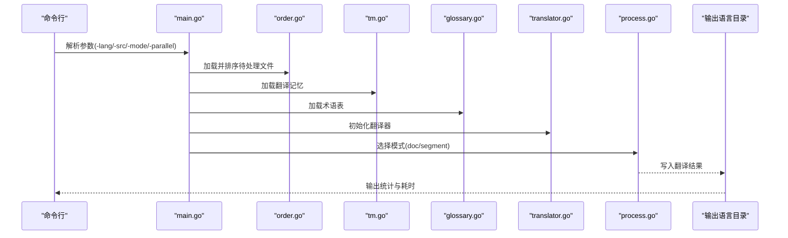
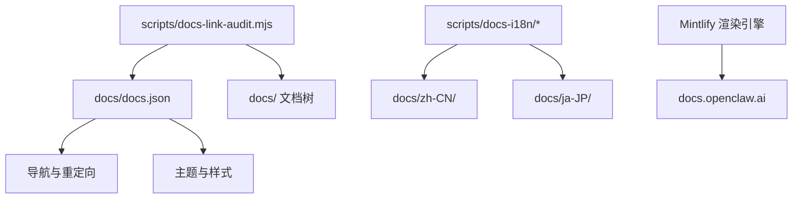

# 文档模块结构

<cite>
**本文档中引用的文件**
- [docs/index.md](file://docs/index.md)
- [docs/docs.json](file://docs/docs.json)
- [docs/style.css](file://docs/style.css)
- [docs/CNAME](file://docs/CNAME)
- [docs/zh-CN/index.md](file://docs/zh-CN/index.md)
- [docs/ja-JP/index.md](file://docs/ja-JP/index.md)
- [scripts/docs-link-audit.mjs](file://scripts/docs-link-audit.mjs)
- [scripts/build-docs-list.mjs](file://scripts/build-docs-list.mjs)
- [scripts/docs-i18n/main.go](file://scripts/docs-i18n/main.go)
- [scripts/docs-i18n/doc_mode.go](file://scripts/docs-i18n/doc_mode.go)
- [scripts/docs-i18n/glossary.go](file://scripts/docs-i18n/glossary.go)
- [scripts/docs-i18n/html_translate.go](file://scripts/docs-i18n/html_translate.go)
- [scripts/docs-i18n/markdown_segments.go](file://scripts/docs-i18n/markdown_segments.go)
- [scripts/docs-i18n/masking.go](file://scripts/docs-i18n/masking.go)
- [scripts/docs-i18n/order.go](file://scripts/docs-i18n/order.go)
- [scripts/docs-i18n/placeholders.go](file://scripts/docs-i18n/placeholders.go)
- [scripts/docs-i18n/process.go](file://scripts/docs-i18n/process.go)
- [scripts/docs-i18n/prompt.go](file://scripts/docs-i18n/prompt.go)
- [scripts/docs-i18n/segment.go](file://scripts/docs-i18n/segment.go)
- [scripts/docs-i18n/tm.go](file://scripts/docs-i18n/tm.go)
- [scripts/docs-i18n/translator.go](file://scripts/docs-i18n/translator.go)
- [scripts/docs-i18n/util.go](file://scripts/docs-i18n/util.go)
- [docs/automation/auth-monitoring.md](file://docs/automation/auth-monitoring.md)
- [docs/automation/cron-jobs.md](file://docs/automation/cron-jobs.md)
- [docs/automation/cron-vs-heartbeat.md](file://docs/automation/cron-vs-heartbeat.md)
- [docs/automation/gmail-pubsub.md](file://docs/automation/gmail-pubsub.md)
- [docs/automation/hooks.md](file://docs/automation/hooks.md)
- [docs/automation/poll.md](file://docs/automation/poll.md)
- [docs/automation/troubleshooting.md](file://docs/automation/troubleshooting.md)
- [docs/automation/webhook.md](file://docs/automation/webhook.md)
- [docs/channels/index.md](file://docs/channels/index.md)
- [docs/cli/index.md](file://docs/cli/index.md)
- [docs/concepts/index.md](file://docs/concepts/index.md)
- [docs/gateway/index.md](file://docs/gateway/index.md)
- [docs/help/index.md](file://docs/help/index.md)
- [docs/install/index.md](file://docs/install/index.md)
- [docs/nodes/index.md](file://docs/nodes/index.md)
- [docs/platforms/index.md](file://docs/platforms/index.md)
- [docs/plugins/index.md](file://docs/plugins/index.md)
- [docs/providers/index.md](file://docs/providers/index.md)
- [docs/reference/index.md](file://docs/reference/index.md)
- [docs/tools/index.md](file://docs/tools/index.md)
- [docs/web/index.md](file://docs/web/index.md)
</cite>

## 目录

1. [引言](#引言)
2. [项目结构](#项目结构)
3. [核心组件](#核心组件)
4. [架构总览](#架构总览)
5. [详细组件分析](#详细组件分析)
6. [依赖关系分析](#依赖关系分析)
7. [性能考虑](#性能考虑)
8. [故障排除指南](#故障排除指南)
9. [结论](#结论)
10. [附录](#附录)

## 引言

本文件系统性梳理 OpenClaw 文档模块的组织架构与实现细节，覆盖概念文档、API 参考、安装指南与故障排除手册四大类；解释文档分类体系、交叉引用机制与国际化支持；记录文档生成流程、版本管理与发布策略；提供贡献指南、写作风格规范与审核流程；并涵盖文档搜索优化、离线访问与多格式导出能力。

## 项目结构

OpenClaw 的文档主要位于仓库根目录下的 docs/ 目录，采用“主题域 + 语言”的双层组织方式：

- 主题域：automation、channels、cli、concepts、gateway、help、install、nodes、platforms、plugins、providers、reference、tools、web 等，每个域下包含若干主题文档与索引页。
- 语言域：英文主站 docs/ 以及 zh-CN/、ja-JP/ 等语言子目录，对应不同语言的翻译版本。
- 全局配置：docs/docs.json 提供站点元数据、导航、重定向与样式配置；docs/index.md 作为站点首页；docs/style.css 与 docs/CNAME 提供样式与域名配置。

**图表来源**

- [docs/index.md](file://docs/index.md#L1-L193)
- [docs/docs.json](file://docs/docs.json#L1-L800)
- [docs/style.css](file://docs/style.css#L1-L4)
- [docs/CNAME](file://docs/CNAME#L1-L2)

**章节来源**

- [docs/index.md](file://docs/index.md#L1-L193)
- [docs/docs.json](file://docs/docs.json#L1-L800)

## 核心组件

- 文档站点引擎与配置
  - Mintlify 配置：docs/docs.json 定义站点名称、描述、主题、图标、字体、颜色、导航、重定向等。
  - 站点首页：docs/index.md 提供入口卡片与快速开始步骤。
  - 样式与域名：docs/style.css 隐藏首页标题；docs/CNAME 指定自定义域名 docs.openclaw.ai。
- 主题域文档
  - 每个主题域均提供 index.md 作为该域的索引与导航入口，便于用户按功能域浏览。
  - 典型域包括：automation（自动化任务）、channels（多渠道接入）、cli（命令行接口）、concepts（核心概念）、gateway（网关）、help（帮助与故障排除）、install（安装指南）、nodes（移动端节点）、platforms（平台部署）、plugins（插件）、providers（模型供应商）、reference（参考与模板）、tools（工具）、web（Web 控制界面）。
- 国际化支持
  - 英文主站 docs/ 与 zh-CN/、ja-JP/ 等语言目录并行存在，首页 zh-CN/index.md 与 ja-JP/index.md 展示本地化内容。
  - 文档头部包含 x-i18n 字段，记录生成时间、模型、提供商、源路径与工作流编号，用于追踪与更新。
- 文档生成与校验工具
  - 链接审计：scripts/docs-link-audit.mjs 对内部链接进行扫描与校验，识别缺失目标与循环重定向。
  - 构建包装：scripts/build-docs-list.mjs 生成可执行包装器以调用 docs-list.js。
  - 国际化流水线：scripts/docs-i18n/ 下的 Go 工具链实现术语表、翻译记忆、分段与文档级翻译、并行处理与覆盖策略。

**章节来源**

- [docs/docs.json](file://docs/docs.json#L1-L800)
- [docs/index.md](file://docs/index.md#L1-L193)
- [docs/style.css](file://docs/style.css#L1-L4)
- [docs/CNAME](file://docs/CNAME#L1-L2)
- [docs/zh-CN/index.md](file://docs/zh-CN/index.md#L1-L187)
- [docs/ja-JP/index.md](file://docs/ja-JP/index.md#L1-L187)
- [scripts/docs-link-audit.mjs](file://scripts/docs-link-audit.mjs#L1-L234)
- [scripts/build-docs-list.mjs](file://scripts/build-docs-list.mjs#L1-L15)
- [scripts/docs-i18n/main.go](file://scripts/docs-i18n/main.go#L1-L274)

## 架构总览

文档系统由“内容组织 + 配置 + 生成与校验 + 国际化”四部分构成，整体流程如下：

**图表来源**

- [docs/docs.json](file://docs/docs.json#L1-L800)
- [docs/index.md](file://docs/index.md#L1-L193)
- [docs/style.css](file://docs/style.css#L1-L4)
- [docs/CNAME](file://docs/CNAME#L1-L2)
- [scripts/docs-link-audit.mjs](file://scripts/docs-link-audit.mjs#L1-L234)
- [scripts/build-docs-list.mjs](file://scripts/build-docs-list.mjs#L1-L15)
- [scripts/docs-i18n/main.go](file://scripts/docs-i18n/main.go#L1-L274)

## 详细组件分析

### 文档分类体系与索引

- 主题域索引页
  - 各主题域均提供 index.md 作为入口，例如：
    - channels/index.md：多渠道接入的导航与概览。
    - cli/index.md：命令行接口的分类索引。
    - concepts/index.md：核心概念的导航。
    - gateway/index.md：网关相关主题的索引。
    - help/index.md：帮助与故障排除入口。
    - install/index.md：安装指南入口。
    - nodes/index.md：移动端节点入口。
    - platforms/index.md：平台部署入口。
    - plugins/index.md：插件入口。
    - providers/index.md：模型供应商入口。
    - reference/index.md：参考与模板入口。
    - tools/index.md：工具入口。
    - web/index.md：Web 控制界面入口。
- 交叉引用机制
  - 文档内部通过相对路径与绝对路径进行交叉引用，docs/docs.json 中的 redirects 数组提供 URL 重定向映射，确保迁移与重构后的链接可用。
  - 链接审计工具 scripts/docs-link-audit.mjs 会对内部链接进行扫描，识别缺失目标、循环重定向与相对路径不匹配等问题。

**图表来源**

- [scripts/docs-link-audit.mjs](file://scripts/docs-link-audit.mjs#L1-L234)
- [docs/docs.json](file://docs/docs.json#L49-L790)

**章节来源**

- [docs/channels/index.md](file://docs/channels/index.md)
- [docs/cli/index.md](file://docs/cli/index.md)
- [docs/concepts/index.md](file://docs/concepts/index.md)
- [docs/gateway/index.md](file://docs/gateway/index.md)
- [docs/help/index.md](file://docs/help/index.md)
- [docs/install/index.md](file://docs/install/index.md)
- [docs/nodes/index.md](file://docs/nodes/index.md)
- [docs/platforms/index.md](file://docs/platforms/index.md)
- [docs/plugins/index.md](file://docs/plugins/index.md)
- [docs/providers/index.md](file://docs/providers/index.md)
- [docs/reference/index.md](file://docs/reference/index.md)
- [docs/tools/index.md](file://docs/tools/index.md)
- [docs/web/index.md](file://docs/web/index.md)
- [scripts/docs-link-audit.mjs](file://scripts/docs-link-audit.mjs#L1-L234)
- [docs/docs.json](file://docs/docs.json#L49-L790)

### 国际化支持与翻译流水线

- 语言目录结构
  - 英文主站 docs/ 与 zh-CN/、ja-JP/ 等语言目录并行存在，首页 zh-CN/index.md 与 ja-JP/index.md 展示本地化内容。
  - 文档头部包含 x-i18n 字段，记录生成时间、模型、提供商、源路径与工作流编号，用于追踪与更新。
- 翻译工具链
  - scripts/docs-i18n/main.go 作为入口，支持两种模式：
    - 文档级翻译（doc）：逐文档处理，支持并行与覆盖策略。
    - 分段翻译（segment）：按段落处理，适合术语与翻译记忆训练。
  - 关键组件：
    - glossary.go：术语表加载与管理。
    - tm.go：翻译记忆加载与保存。
    - translator.go：翻译器封装（基于 Pi 接口）。
    - order.go：文件排序与队列过滤。
    - process.go/markdown_segments.go/html_translate.go/placeholders.go/masking.go/prompt.go/segment.go/util.go：翻译过程中的分段、占位符、掩码、提示词与工具函数。
- 并行与覆盖策略
  - 支持多工作线程并行处理文档级翻译，减少翻译时长。
  - 支持覆盖现有翻译与跳过已翻译文件的策略，结合源文件哈希判断是否需要重新翻译。

**图表来源**

- [scripts/docs-i18n/main.go](file://scripts/docs-i18n/main.go#L1-L274)
- [scripts/docs-i18n/order.go](file://scripts/docs-i18n/order.go)
- [scripts/docs-i18n/tm.go](file://scripts/docs-i18n/tm.go)
- [scripts/docs-i18n/glossary.go](file://scripts/docs-i18n/glossary.go)
- [scripts/docs-i18n/translator.go](file://scripts/docs-i18n/translator.go)
- [scripts/docs-i18n/process.go](file://scripts/docs-i18n/process.go)
- [scripts/docs-i18n/markdown_segments.go](file://scripts/docs-i18n/markdown_segments.go)
- [scripts/docs-i18n/html_translate.go](file://scripts/docs-i18n/html_translate.go)
- [scripts/docs-i18n/placeholders.go](file://scripts/docs-i18n/placeholders.go)
- [scripts/docs-i18n/masking.go](file://scripts/docs-i18n/masking.go)
- [scripts/docs-i18n/prompt.go](file://scripts/docs-i18n/prompt.go)
- [scripts/docs-i18n/segment.go](file://scripts/docs-i18n/segment.go)
- [scripts/docs-i18n/util.go](file://scripts/docs-i18n/util.go)

**章节来源**

- [docs/zh-CN/index.md](file://docs/zh-CN/index.md#L1-L187)
- [docs/ja-JP/index.md](file://docs/ja-JP/index.md#L1-L187)
- [scripts/docs-i18n/main.go](file://scripts/docs-i18n/main.go#L1-L274)

### 文档生成流程、版本管理与发布策略

- 生成流程
  - 配置驱动：docs/docs.json 定义站点元信息、导航与重定向。
  - 内容组织：各主题域与语言目录按约定存放 Markdown/MDX 文件。
  - 校验前置：scripts/docs-link-audit.mjs 在构建前检查内部链接有效性。
  - 渲染发布：Mintlify 渲染引擎根据配置渲染站点并发布至 docs.openclaw.ai。
- 版本管理与发布
  - 文档版本与变更：通过 Git 仓库维护，配合 CHANGELOG.md 记录与文档相关的改动与链接。
  - 自动化包装：scripts/build-docs-list.mjs 生成可执行包装器，便于在 CI 或本地统一调用。
- 多格式导出与离线访问
  - 站点渲染为静态 HTML，支持离线访问。
  - 导航与搜索：Mintlify 提供内置搜索与导航，满足多格式阅读需求。

**章节来源**

- [docs/docs.json](file://docs/docs.json#L1-L800)
- [scripts/docs-link-audit.mjs](file://scripts/docs-link-audit.mjs#L1-L234)
- [scripts/build-docs-list.mjs](file://scripts/build-docs-list.mjs#L1-L15)
- [CHANGELOG.md](file://CHANGELOG.md#L1-L730)

### 文档贡献指南、写作风格规范与审核流程

- 贡献入口
  - 提交 PR：参考 docs/help/submitting-a-pr.md。
  - 提交 Issue：参考 docs/help/submitting-an-issue.md。
  - 调试与测试：参考 docs/help/debugging.md 与 docs/help/testing.md。
- 写作风格规范
  - 统一使用 Markdown/MDX 格式；保持简洁、准确、可操作。
  - 使用主题域索引页作为导航入口，避免分散链接。
  - 重要链接应提供完整绝对 URL，确保在 GitHub 上可点击。
- 审核流程
  - 链接审计：运行 scripts/docs-link-audit.mjs，修复失效链接与循环重定向。
  - 交叉引用：确保文档间引用路径正确，必要时在 docs/docs.json 中补充重定向。
  - 国际化：新增或修改英文内容后，同步生成 zh-CN/ 与 ja-JP/ 翻译，遵循 x-i18n 字段规范。

**章节来源**

- [docs/help/index.md](file://docs/help/index.md)
- [docs/help/submitting-a-pr.md](file://docs/help/submitting-a-pr.md)
- [docs/help/submitting-an-issue.md](file://docs/help/submitting-an-issue.md)
- [docs/help/debugging.md](file://docs/help/debugging.md)
- [docs/help/testing.md](file://docs/help/testing.md)
- [scripts/docs-link-audit.mjs](file://scripts/docs-link-audit.mjs#L1-L234)
- [docs/docs.json](file://docs/docs.json#L49-L790)

### 文档搜索优化、离线访问与多格式导出

- 搜索优化
  - Mintlify 提供内置搜索与导航，支持关键词检索与分类浏览。
  - 通过 docs/docs.json 的导航与重定向配置，提升搜索命中率与用户体验。
- 离线访问
  - 站点渲染为静态 HTML，支持本地缓存与离线查看。
  - docs/style.css 隐藏首页标题，减少冗余信息，提升移动端阅读体验。
- 多格式导出
  - 站点以 HTML 为主，适配浏览器与移动端；如需 PDF/EPUB 等格式，可在 Mintlify 配置中启用相应导出选项（具体取决于平台支持）。

**章节来源**

- [docs/docs.json](file://docs/docs.json#L1-L800)
- [docs/style.css](file://docs/style.css#L1-L4)

## 依赖关系分析

- 组件耦合
  - docs/docs.json 与各主题域文档强耦合，负责全局样式、导航与重定向。
  - scripts/docs-link-audit.mjs 依赖 docs/docs.json 的 redirects 与文档树结构，确保链接一致性。
  - scripts/docs-i18n/\* 工具链与 docs/zh-CN/、docs/ja-JP/ 语言目录解耦，通过文件路径与哈希判断决定是否翻译。
- 外部依赖
  - Mintlify 渲染引擎负责最终页面生成与发布。
  - 自定义域名 docs/CNAME 指向 docs.openclaw.ai。

**图表来源**

- [docs/docs.json](file://docs/docs.json#L1-L800)
- [scripts/docs-link-audit.mjs](file://scripts/docs-link-audit.mjs#L1-L234)
- [scripts/docs-i18n/main.go](file://scripts/docs-i18n/main.go#L1-L274)
- [docs/CNAME](file://docs/CNAME#L1-L2)

**章节来源**

- [docs/docs.json](file://docs/docs.json#L1-L800)
- [scripts/docs-link-audit.mjs](file://scripts/docs-link-audit.mjs#L1-L234)
- [scripts/docs-i18n/main.go](file://scripts/docs-i18n/main.go#L1-L274)

## 性能考虑

- 链接审计前置：在构建阶段尽早发现并修复失效链接，减少渲染期错误与回溯成本。
- 并行翻译：文档级翻译支持多工作线程并行，显著缩短翻译周期。
- 缓存与增量：翻译记忆与术语表缓存减少重复计算；基于源文件哈希的跳过策略避免重复翻译。
- 渲染优化：Mintlify 的静态渲染与 CDN 加速，提升加载速度与稳定性。

## 故障排除指南

- 常见问题定位
  - 内部链接失效：使用 scripts/docs-link-audit.mjs 输出的报告定位文件与行号，检查路径拼写与目标是否存在。
  - 循环重定向：检查 docs/docs.json 中的 redirects，移除循环链路。
  - 语言翻译缺失：确认 zh-CN/、ja-JP/ 目录中对应路径的翻译文件是否存在，必要时触发翻译流水线。
- 相关文档入口
  - help/troubleshooting.md：通用故障排除入口。
  - gateway/troubleshooting.md：网关相关诊断与常见错误。
  - automation/troubleshooting.md：自动化任务相关问题排查。

**章节来源**

- [scripts/docs-link-audit.mjs](file://scripts/docs-link-audit.mjs#L1-L234)
- [docs/docs.json](file://docs/docs.json#L49-L790)
- [docs/help/troubleshooting.md](file://docs/help/troubleshooting.md)
- [docs/gateway/troubleshooting.md](file://docs/gateway/troubleshooting.md)
- [docs/automation/troubleshooting.md](file://docs/automation/troubleshooting.md)

## 结论

OpenClaw 文档模块采用“主题域 + 语言”的清晰组织方式，配合 Mintlify 配置与自动化工具链，实现了高效的内容管理、严格的链接校验、完善的国际化支持与稳定的发布流程。通过本文档，贡献者可以快速理解文档结构、掌握写作风格与审核流程，并利用工具链提升翻译与维护效率。

## 附录

- 快速参考
  - 站点首页：docs/index.md
  - 全局配置：docs/docs.json
  - 样式与域名：docs/style.css、docs/CNAME
  - 链接审计：scripts/docs-link-audit.mjs
  - 翻译流水线：scripts/docs-i18n/\*
  - 贡献指南：docs/help/submitting-a-pr.md、docs/help/submitting-an-issue.md
