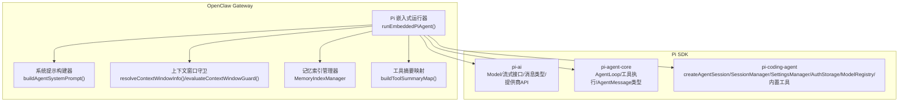
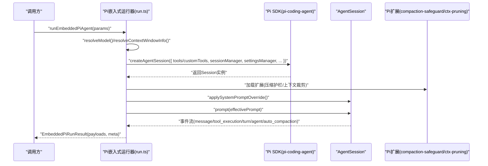
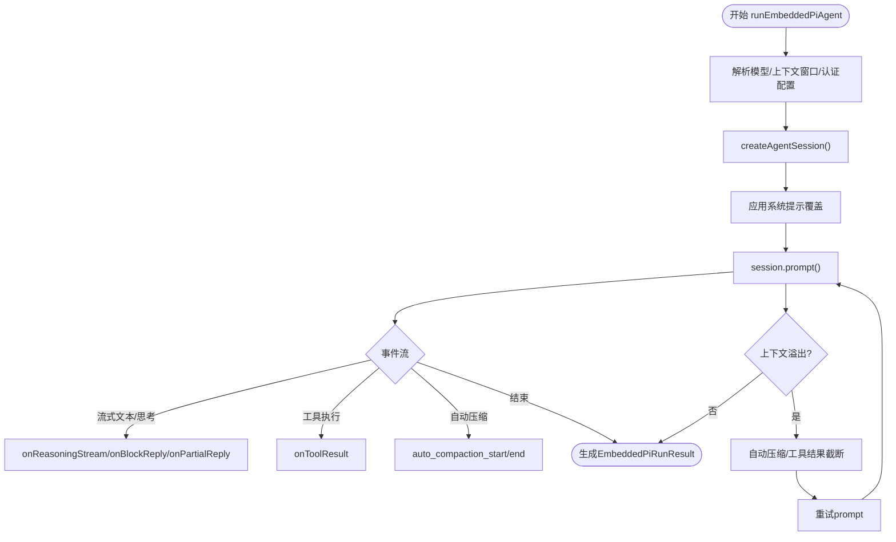
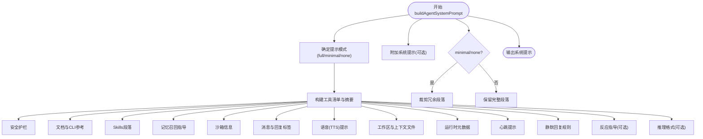
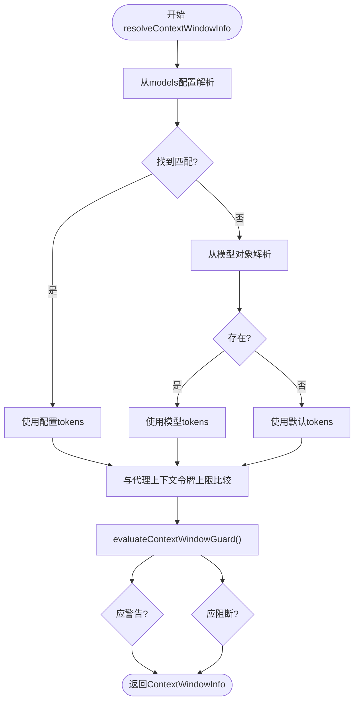
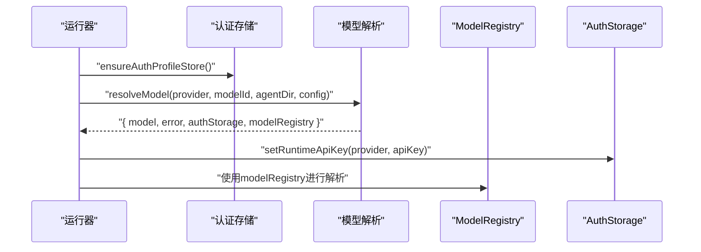
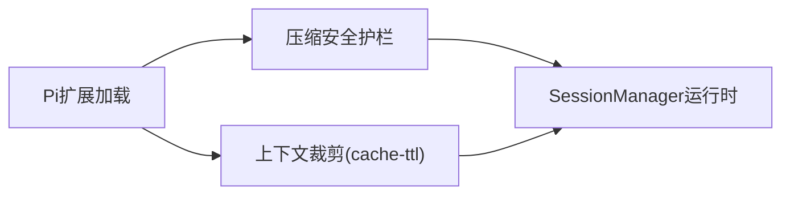
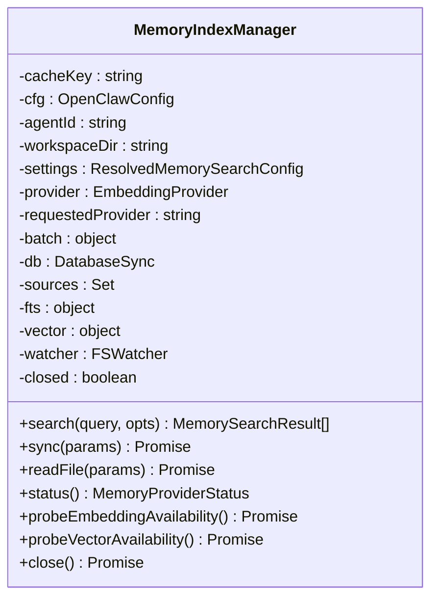
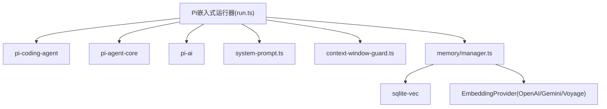

# AI代理系统模块

<cite>
**本文引用的文件**
- [pi.md](file://docs/zh-CN/pi.md)
- [run.ts](file://src/agents/pi-embedded-runner/run.ts)
- [types.ts](file://src/agents/pi-embedded-runner/types.ts)
- [system-prompt.ts](file://src/agents/system-prompt.ts)
- [context-window-guard.ts](file://src/agents/context-window-guard.ts)
- [manager.ts](file://src/memory/manager.ts)
- [tool-summaries.ts](file://src/agents/tool-summaries.ts)
- [index.ts](file://src/memory/index.ts)
</cite>

## 目录

1. [引言](#引言)
2. [项目结构](#项目结构)
3. [核心组件](#核心组件)
4. [架构总览](#架构总览)
5. [详细组件分析](#详细组件分析)
6. [依赖关系分析](#依赖关系分析)
7. [性能考量](#性能考量)
8. [故障排查指南](#故障排查指南)
9. [结论](#结论)
10. [附录](#附录)

## 引言

本文件面向OpenClaw AI代理系统模块，聚焦Pi Agent Core集成架构、代理工具系统、技能平台与记忆管理机制，系统阐述代理配置管理、工具执行流程、上下文窗口管理与模型选择策略，记录代理生命周期、并发控制与资源管理，并提供代理开发指南、自定义工具创建与技能扩展模式。

## 项目结构

OpenClaw通过嵌入式方式集成Pi SDK（pi-ai、pi-agent-core、pi-coding-agent），在Gateway网关架构内运行智能体会话，具备以下关键目录与职责：

- agents/pi-embedded-runner：嵌入式Pi智能体运行器，负责会话创建、事件订阅、工具注入、系统提示应用、上下文窗口与模型解析、故障转移与压缩恢复等
- agents/system-prompt.ts：系统提示构建器，按渠道/上下文动态拼装工具、技能、工作区、沙箱、消息、语音、静默回复、心跳、运行时元数据等
- agents/context-window-guard.ts：上下文窗口信息解析与守卫，结合models配置与默认值，评估是否警告或阻断
- memory：内置记忆索引与检索引擎，支持向量+关键词混合检索、批量化嵌入、缓存、增量同步与会话联动
- agents/tool-summaries.ts：工具摘要映射，用于系统提示中的工具描述汇总
- docs/zh-CN/pi.md：Pi集成架构文档，概述包依赖、文件结构、核心流程、工具架构、系统提示、会话管理、认证与模型解析、Pi扩展、流式传输与块回复、错误处理、沙箱集成、提供商特定处理、TUI集成及与Pi CLI差异

**图表来源**

- [pi.md](file://docs/zh-CN/pi.md#L14-L36)
- [run.ts](file://src/agents/pi-embedded-runner/run.ts#L158-L200)
- [system-prompt.ts](file://src/agents/system-prompt.ts#L164-L218)
- [context-window-guard.ts](file://src/agents/context-window-guard.ts#L21-L50)
- [manager.ts](file://src/memory/manager.ts#L111-L203)
- [tool-summaries.ts](file://src/agents/tool-summaries.ts#L3-L13)

**章节来源**

- [pi.md](file://docs/zh-CN/pi.md#L14-L36)
- [pi.md](file://docs/zh-CN/pi.md#L45-L136)

## 核心组件

- 嵌入式Pi智能体运行器：封装会话创建、事件订阅、工具注入、系统提示应用、上下文窗口与模型解析、故障转移与压缩恢复
- 系统提示构建器：按渠道/上下文动态生成完整提示，包含工具、技能、工作区、沙箱、消息、语音、静默回复、心跳、运行时元数据等
- 上下文窗口守卫：从models配置、模型自身与默认值解析上下文窗口，评估是否警告或阻断
- 认证与模型解析：多配置文件认证存储、冷却与轮换、运行时API Key注入、模型注册表解析
- Pi扩展：压缩安全护栏与基于缓存TTL的上下文裁剪
- 记忆索引管理器：向量+关键词混合检索、批量化嵌入、缓存、增量同步、会话监听与间隔同步
- 工具摘要映射：为系统提示生成工具描述摘要

**章节来源**

- [run.ts](file://src/agents/pi-embedded-runner/run.ts#L158-L200)
- [system-prompt.ts](file://src/agents/system-prompt.ts#L164-L218)
- [context-window-guard.ts](file://src/agents/context-window-guard.ts#L21-L50)
- [pi.md](file://docs/zh-CN/pi.md#L331-L380)
- [manager.ts](file://src/memory/manager.ts#L111-L203)
- [tool-summaries.ts](file://src/agents/tool-summaries.ts#L3-L13)

## 架构总览

OpenClaw通过createAgentSession直接实例化Pi智能体会话，而非子进程或RPC模式，从而获得对会话生命周期与事件处理的完全控制，并支持：

- 自定义工具注入（消息、沙箱、渠道特定操作）
- 每渠道/上下文的系统提示自定义
- 分支/压缩的会话持久化
- 多账户认证配置文件轮换与故障转移
- 与提供商无关的模型切换

**图表来源**

- [pi.md](file://docs/zh-CN/pi.md#L138-L236)
- [run.ts](file://src/agents/pi-embedded-runner/run.ts#L158-L200)
- [types.ts](file://src/agents/pi-embedded-runner/types.ts#L52-L68)

**章节来源**

- [pi.md](file://docs/zh-CN/pi.md#L16-L26)
- [pi.md](file://docs/zh-CN/pi.md#L138-L236)

## 详细组件分析

### 嵌入式Pi智能体运行器

- 会话创建与参数解析：解析工作区、模型、上下文窗口、认证配置文件、思考/推理层级、工具结果格式、通道提示等
- 事件订阅：订阅message/tool_execution/turn/agent/auto_compaction等事件，驱动流式文本/思考、工具执行、块回复与部分回复
- 上下文溢出与压缩恢复：检测上下文溢出，尝试自动压缩与工具结果截断，必要时抛出错误或触发故障转移
- 故障转移：根据错误类型与配置，轮换认证配置文件、降级思考层级、格式化错误消息
- 运行元数据：收集使用量、令牌数、停止原因、待处理工具调用等

**图表来源**

- [run.ts](file://src/agents/pi-embedded-runner/run.ts#L158-L200)
- [run.ts](file://src/agents/pi-embedded-runner/run.ts#L414-L624)

**章节来源**

- [run.ts](file://src/agents/pi-embedded-runner/run.ts#L158-L200)
- [run.ts](file://src/agents/pi-embedded-runner/run.ts#L414-L624)
- [types.ts](file://src/agents/pi-embedded-runner/types.ts#L52-L68)

### 系统提示构建器

- 功能：按渠道/上下文动态生成完整提示，包含工具清单、工具调用风格、安全护栏、OpenClaw CLI参考、Skills、文档、工作区、沙箱、消息、回复标签、语音、静默回复、心跳、运行时元数据、反应指导、推理格式、项目上下文文件、静默回复规则、心跳提示等
- 模式：支持full/minimal/none三种模式，subagent使用minimal裁剪冗余部分
- 工具摘要：合并核心工具与外部工具摘要，按可用工具排序输出

**图表来源**

- [system-prompt.ts](file://src/agents/system-prompt.ts#L164-L218)
- [system-prompt.ts](file://src/agents/system-prompt.ts#L351-L611)

**章节来源**

- [system-prompt.ts](file://src/agents/system-prompt.ts#L164-L218)
- [system-prompt.ts](file://src/agents/system-prompt.ts#L351-L611)

### 上下文窗口管理

- 解析：优先从models配置解析，其次从模型对象，最后使用默认值
- 守卫：结合代理上下文令牌上限，决定是否警告或阻断
- 作用：防止因上下文过大导致的溢出与性能问题

**图表来源**

- [context-window-guard.ts](file://src/agents/context-window-guard.ts#L21-L50)

**章节来源**

- [context-window-guard.ts](file://src/agents/context-window-guard.ts#L21-L50)

### 认证与模型解析

- 认证配置文件：多配置文件存储，失败时轮换，冷却跟踪
- 运行时API Key注入：针对不同提供商（含GitHub Copilot）注入运行时密钥
- 模型解析：使用ModelRegistry与AuthStorage解析模型，支持故障转移

**图表来源**

- [pi.md](file://docs/zh-CN/pi.md#L331-L380)
- [run.ts](file://src/agents/pi-embedded-runner/run.ts#L204-L212)
- [run.ts](file://src/agents/pi-embedded-runner/run.ts#L315-L348)

**章节来源**

- [pi.md](file://docs/zh-CN/pi.md#L331-L380)
- [run.ts](file://src/agents/pi-embedded-runner/run.ts#L204-L212)
- [run.ts](file://src/agents/pi-embedded-runner/run.ts#L315-L348)

### Pi扩展

- 压缩安全护栏：限制压缩预算、工具失败与文件操作摘要，避免过度压缩
- 上下文裁剪：基于缓存TTL的上下文裁剪，减少无效历史

**图表来源**

- [pi.md](file://docs/zh-CN/pi.md#L381-L411)

**章节来源**

- [pi.md](file://docs/zh-CN/pi.md#L381-L411)

### 记忆索引管理器

- 职责：向量+关键词混合检索、批量化嵌入、缓存、增量同步、会话监听与间隔同步
- 能力：SQLite-vec向量表、FTS全文检索、嵌入缓存、批处理失败计数与锁定、超时与重试、会话增量读取与去抖
- 生命周期：懒加载、watcher、interval定时同步、关闭释放

**图表来源**

- [manager.ts](file://src/memory/manager.ts#L111-L203)
- [manager.ts](file://src/memory/manager.ts#L266-L314)
- [manager.ts](file://src/memory/manager.ts#L391-L403)
- [manager.ts](file://src/memory/manager.ts#L470-L565)

**章节来源**

- [manager.ts](file://src/memory/manager.ts#L111-L203)
- [manager.ts](file://src/memory/manager.ts#L266-L314)
- [manager.ts](file://src/memory/manager.ts#L391-L403)
- [manager.ts](file://src/memory/manager.ts#L470-L565)
- [index.ts](file://src/memory/index.ts#L1-L8)

### 工具系统与摘要

- 工具摘要映射：从AgentTool集合构建工具名称到描述的映射，用于系统提示中的工具描述汇总
- 系统提示中的工具清单：按核心工具顺序与可用工具集合输出，支持外部工具补充

**章节来源**

- [tool-summaries.ts](file://src/agents/tool-summaries.ts#L3-L13)
- [system-prompt.ts](file://src/agents/system-prompt.ts#L219-L310)

## 依赖关系分析

- 运行器依赖Pi SDK（pi-coding-agent）创建会话、依赖Pi Agent Core（pi-agent-core）进行工具执行与消息类型、依赖Pi AI（pi-ai）进行模型抽象与流式接口
- 运行器依赖系统提示构建器生成提示，依赖上下文窗口守卫进行令牌限制，依赖记忆索引管理器提供检索能力
- 记忆索引管理器依赖SQLite-vec扩展、嵌入提供者（OpenAI/Gemini/Voyage）、批处理客户端与缓存

**图表来源**

- [pi.md](file://docs/zh-CN/pi.md#L27-L44)
- [run.ts](file://src/agents/pi-embedded-runner/run.ts#L1-L60)
- [manager.ts](file://src/memory/manager.ts#L23-L42)

**章节来源**

- [pi.md](file://docs/zh-CN/pi.md#L27-L44)
- [run.ts](file://src/agents/pi-embedded-runner/run.ts#L1-L60)
- [manager.ts](file://src/memory/manager.ts#L23-L42)

## 性能考量

- 上下文窗口：通过守卫与自动压缩降低溢出风险，避免重复解析会话文件
- 批处理与缓存：记忆索引支持批量化嵌入与缓存，减少重复计算与网络开销
- 增量同步：会话监听与间隔同步，降低全量扫描成本
- 超时与重试：嵌入查询与批处理设置合理超时与重试策略，提升稳定性

[本节为通用指导，无需具体文件分析]

## 故障排查指南

- 上下文溢出：检查models配置与默认上下文窗口，确认自动压缩与工具结果截断是否生效
- 认证失败：查看认证配置文件轮换与冷却状态，确认API Key注入是否正确
- 速率限制/配额：根据错误分类触发故障转移，检查配置中的回退策略
- 图像尺寸/维度：根据解析的图像错误信息调整输入
- 思考层级不支持：自动降级至受支持层级

**章节来源**

- [run.ts](file://src/agents/pi-embedded-runner/run.ts#L499-L719)
- [run.ts](file://src/agents/pi-embedded-runner/run.ts#L760-L807)

## 结论

OpenClaw通过嵌入式Pi集成实现了高度可控的智能体运行环境，结合系统提示构建、上下文窗口守卫、认证与模型解析、Pi扩展与记忆索引管理，形成完整的代理生命周期与资源管理体系。该架构在保证安全性与可控性的同时，提供了强大的工具扩展与技能平台能力，适合在多渠道、多提供商环境下稳定运行。

## 附录

### 代理开发指南

- 使用嵌入式运行器入口：通过runEmbeddedPiAgent传入会话参数、工作区、系统提示、工具与策略
- 自定义系统提示：利用buildAgentSystemPrompt按渠道/上下文定制工具、技能、消息、语音、静默回复、心跳与运行时元数据
- 工具扩展：通过工具定义适配器将AgentTool转换为ToolDefinition，注入自定义工具集
- 记忆检索：使用MemoryIndexManager进行混合检索与增量同步，结合缓存与批处理优化性能

**章节来源**

- [pi.md](file://docs/zh-CN/pi.md#L138-L236)
- [system-prompt.ts](file://src/agents/system-prompt.ts#L164-L218)
- [manager.ts](file://src/memory/manager.ts#L266-L314)

### 自定义工具创建

- 工具签名适配：遵循pi-agent-core与pi-coding-agent的execute签名差异，使用适配器桥接
- 策略过滤：通过工具策略与沙箱集成，确保工具在不同提供商与上下文中的一致行为
- AbortSignal包装：为工具添加中止信号支持，提升并发与中断控制能力

**章节来源**

- [pi.md](file://docs/zh-CN/pi.md#L250-L282)
- [pi.md](file://docs/zh-CN/pi.md#L471-L487)

### 技能扩展模式

- Skills提示：通过buildAgentSystemPrompt的skills段落引导智能体按需读取与遵循SKILL.md
- 技能快照：构建技能快照与提示，支持最小化提示模式下的子智能体场景

**章节来源**

- [system-prompt.ts](file://src/agents/system-prompt.ts#L16-L38)
- [system-prompt.ts](file://src/agents/system-prompt.ts#L358-L367)
