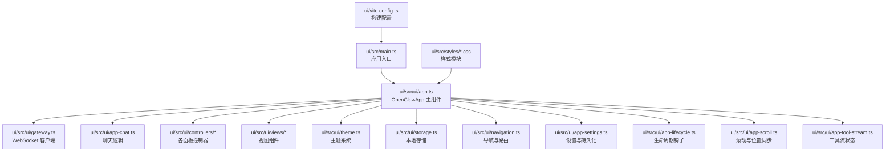
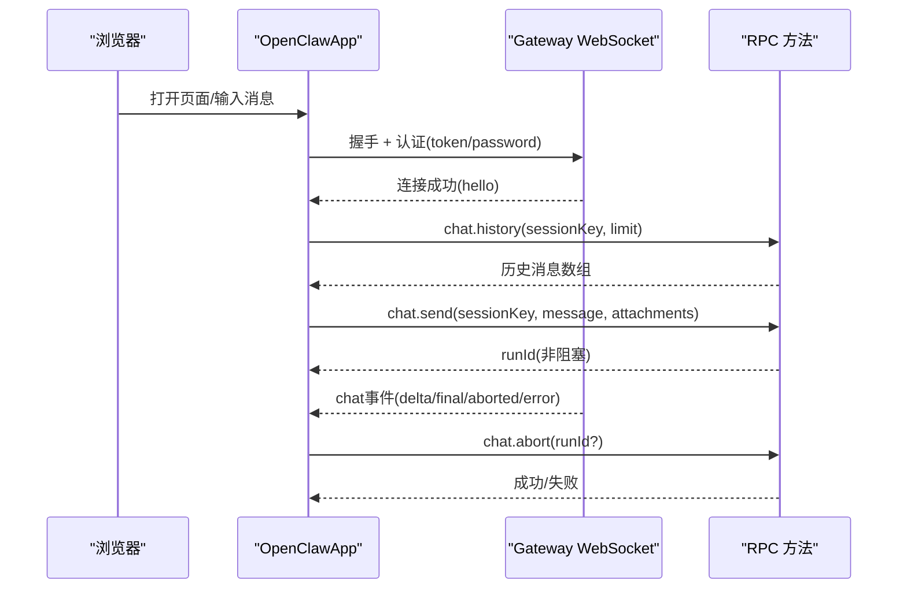
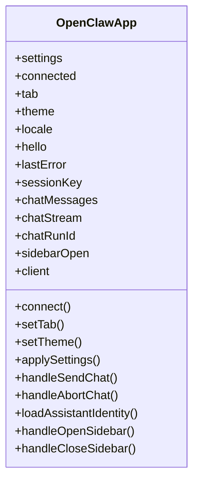
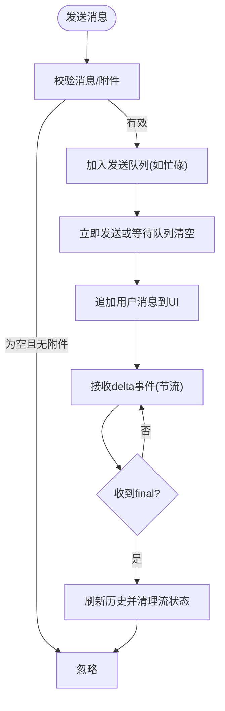
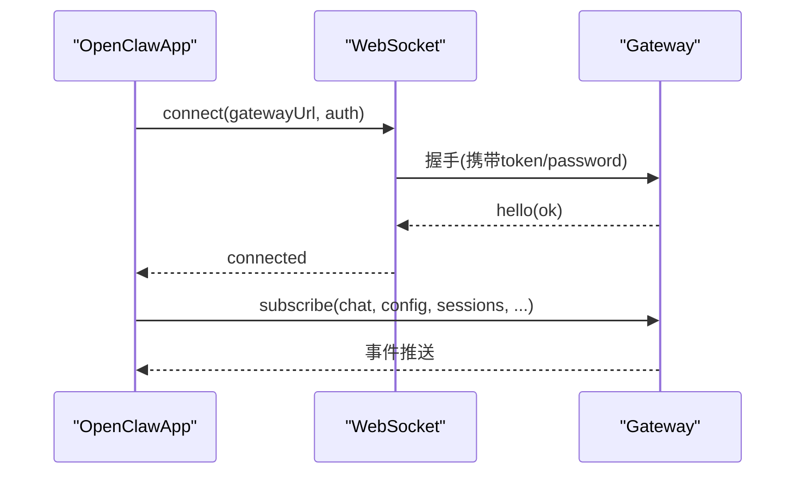
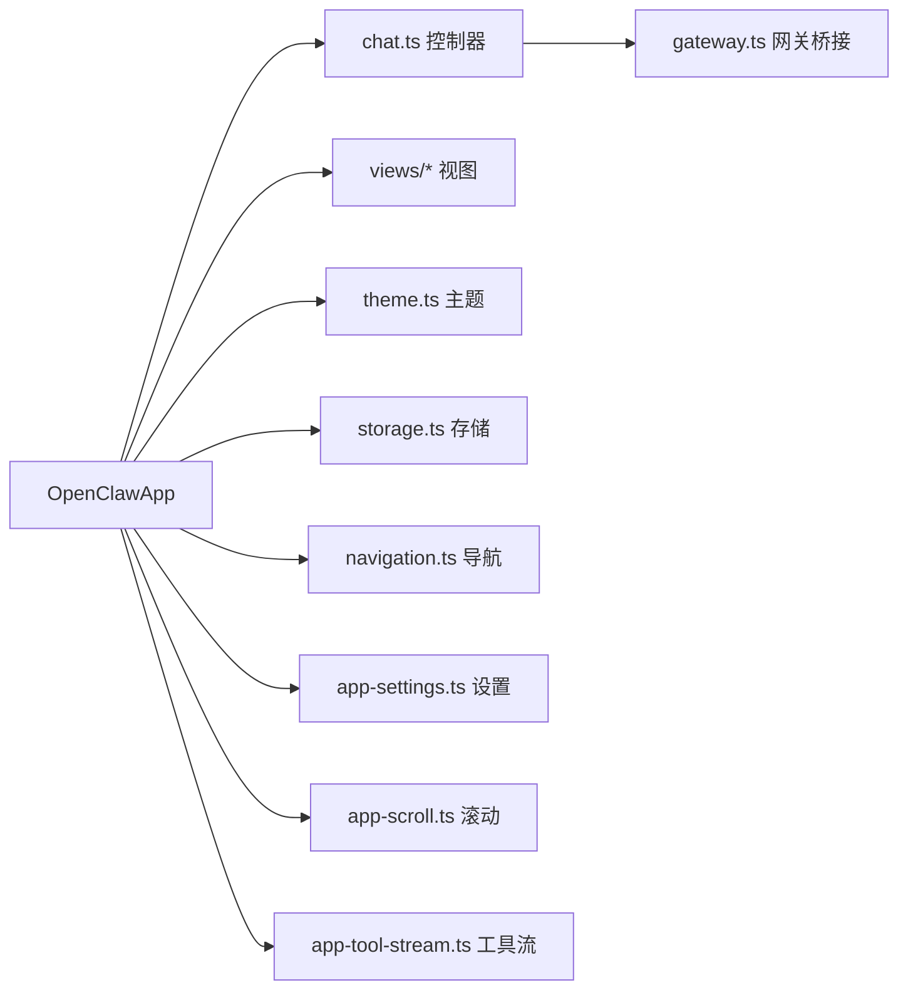

# Web界面模块

<cite>
**本文档引用的文件**
- [ui/src/ui/app.ts](file://ui/src/ui/app.ts)
- [ui/src/ui/app-chat.ts](file://ui/src/ui/app-chat.ts)
- [ui/src/ui/controllers/chat.ts](file://ui/src/ui/controllers/chat.ts)
- [ui/src/ui/gateway.ts](file://ui/src/ui/gateway.ts)
- [ui/src/ui/navigation.ts](file://ui/src/ui/navigation.ts)
- [ui/src/ui/theme.ts](file://ui/src/ui/theme.ts)
- [ui/src/ui/storage.ts](file://ui/src/ui/storage.ts)
- [ui/src/ui/app-settings.ts](file://ui/src/ui/app-settings.ts)
- [ui/src/ui/app-lifecycle.ts](file://ui/src/ui/app-lifecycle.ts)
- [ui/src/ui/app-scroll.ts](file://ui/src/ui/app-scroll.ts)
- [ui/src/ui/app-tool-stream.ts](file://ui/src/ui/app-tool-stream.ts)
- [ui/src/ui/controllers/sessions.ts](file://ui/src/ui/controllers/sessions.ts)
- [ui/src/ui/controllers/devices.ts](file://ui/src/ui/controllers/devices.ts)
- [ui/src/ui/controllers/exec-approvals.ts](file://ui/src/ui/controllers/exec-approvals.ts)
- [ui/src/ui/controllers/config.ts](file://ui/src/ui/controllers/config.ts)
- [ui/src/ui/controllers/channels.ts](file://ui/src/ui/controllers/channels.ts)
- [ui/src/ui/views/chat-view.ts](file://ui/src/ui/views/chat-view.ts)
- [ui/src/ui/views/config-view.ts](file://ui/src/ui/views/config-view.ts)
- [ui/src/ui/views/nodes-view.ts](file://ui/src/ui/views/nodes-view.ts)
- [ui/src/ui/views/sessions-view.ts](file://ui/src/ui/views/sessions-view.ts)
- [ui/src/ui/views/cron-view.ts](file://ui/src/ui/views/cron-view.ts)
- [ui/src/ui/views/skills-view.ts](file://ui/src/ui/views/skills-view.ts)
- [ui/src/ui/views/debug-view.ts](file://ui/src/ui/views/debug-view.ts)
- [ui/src/ui/views/logs-view.ts](file://ui/src/ui/views/logs-view.ts)
- [ui/src/ui/views/update-view.ts](file://ui/src/ui/views/update-view.ts)
- [ui/src/styles/chat.css](file://ui/src/styles/chat.css)
- [ui/src/styles/base.css](file://ui/src/styles/base.css)
- [ui/src/styles/layout.css](file://ui/src/styles/layout.css)
- [ui/src/styles/layout.mobile.css](file://ui/src/styles/layout.mobile.css)
- [ui/src/styles/components.css](file://ui/src/styles/components.css)
- [ui/src/styles/config.css](file://ui/src/styles/config.css)
- [ui/src/styles/chat/layout.css](file://ui/src/styles/chat/layout.css)
- [ui/src/styles/chat/text.css](file://ui/src/styles/chat/text.css)
- [ui/src/styles/chat/grouped.css](file://ui/src/styles/chat/grouped.css)
- [ui/src/styles/chat/tool-cards.css](file://ui/src/styles/chat/tool-cards.css)
- [ui/src/styles/chat/sessions-sidebar.css](file://ui/src/styles/chat/sessions-sidebar.css)
- [ui/src/styles/chat/sidebar.css](file://ui/src/styles/chat/sidebar.css)
- [ui/src/styles/chat/text.css](file://ui/src/styles/chat/text.css)
- [ui/src/main.ts](file://ui/src/main.ts)
- [ui/vite.config.ts](file://ui/vite.config.ts)
- [ui/package.json](file://ui/package.json)
- [docs/web/index.md](file://docs/web/index.md)
- [docs/web/control-ui.md](file://docs/web/control-ui.md)
- [docs/web/webchat.md](file://docs/web/webchat.md)
- [docs/web/tui.md](file://docs/web/tui.md)
</cite>

## 目录

1. [简介](#简介)
2. [项目结构](#项目结构)
3. [核心组件](#核心组件)
4. [架构总览](#架构总览)
5. [详细组件分析](#详细组件分析)
6. [依赖关系分析](#依赖关系分析)
7. [性能考虑](#性能考虑)
8. [故障排除指南](#故障排除指南)
9. [结论](#结论)
10. [附录](#附录)

## 简介

本文件面向OpenClaw Web界面模块，系统性梳理其代码结构、架构设计与交互机制，重点覆盖：

- 浏览器控制UI（Control UI）与网关WebSocket直连的桥接机制
- Web聊天界面、TUI终端界面与浏览器控制功能的统一状态管理
- 实时通信与事件流、工具输出卡片渲染、会话切换与历史加载
- 响应式布局、主题系统与国际化支持
- 界面定制指南、主题开发与用户体验优化建议

## 项目结构

Web界面模块位于ui目录，采用Vite + Lit构建，核心入口为ui/src/main.ts，主应用组件为ui/src/ui/app.ts。样式按功能拆分至ui/src/styles目录，视图组件集中在ui/src/ui/views目录。

图表来源

- [ui/src/main.ts](file://ui/src/main.ts#L1-L3)
- [ui/src/ui/app.ts](file://ui/src/ui/app.ts#L1-L707)
- [ui/src/ui/gateway.ts](file://ui/src/ui/gateway.ts)
- [ui/src/ui/app-chat.ts](file://ui/src/ui/app-chat.ts#L1-L390)
- [ui/src/ui/controllers/chat.ts](file://ui/src/ui/controllers/chat.ts#L1-L376)
- [ui/src/ui/theme.ts](file://ui/src/ui/theme.ts)
- [ui/src/ui/storage.ts](file://ui/src/ui/storage.ts)
- [ui/src/ui/navigation.ts](file://ui/src/ui/navigation.ts)
- [ui/src/ui/app-settings.ts](file://ui/src/ui/app-settings.ts)
- [ui/src/ui/app-lifecycle.ts](file://ui/src/ui/app-lifecycle.ts)
- [ui/src/ui/app-scroll.ts](file://ui/src/ui/app-scroll.ts)
- [ui/src/ui/app-tool-stream.ts](file://ui/src/ui/app-tool-stream.ts)
- [ui/src/styles/chat.css](file://ui/src/styles/chat.css#L1-L6)
- [ui/vite.config.ts](file://ui/vite.config.ts)

章节来源

- [ui/src/main.ts](file://ui/src/main.ts#L1-L3)
- [ui/src/ui/app.ts](file://ui/src/ui/app.ts#L1-L707)
- [ui/src/styles/chat.css](file://ui/src/styles/chat.css#L1-L6)
- [ui/vite.config.ts](file://ui/vite.config.ts)

## 核心组件

- 应用根组件 OpenClawApp：集中管理UI状态、主题、语言、连接生命周期、聊天队列、日志滚动、工具流等。
- 聊天控制器 chat.ts：封装聊天历史加载、消息发送、流式更新节流、运行状态管理。
- 聊天逻辑 app-chat.ts：处理输入校验、停止命令、会话切换、附件上传、队列调度。
- 网关桥接 gateway.ts：封装WebSocket握手、认证参数注入、RPC调用与事件订阅。
- 导航与设置 navigation.ts / app-settings.ts：标签页切换、URL同步、主题与语言持久化。
- 视图层 views/\*：聊天、配置、节点、会话、定时任务、技能、调试、日志、更新等面板。
- 样式系统 styles/\*：基础布局、聊天专用样式、移动端适配、组件样式、主题变量。

章节来源

- [ui/src/ui/app.ts](file://ui/src/ui/app.ts#L112-L707)
- [ui/src/ui/app-chat.ts](file://ui/src/ui/app-chat.ts#L1-L390)
- [ui/src/ui/controllers/chat.ts](file://ui/src/ui/controllers/chat.ts#L1-L376)
- [ui/src/ui/gateway.ts](file://ui/src/ui/gateway.ts)
- [ui/src/ui/navigation.ts](file://ui/src/ui/navigation.ts)
- [ui/src/ui/app-settings.ts](file://ui/src/ui/app-settings.ts)

## 架构总览

Web界面通过同一HTTP端口提供静态资源与WebSocket服务，Control UI直接连接Gateway WebSocket，使用RPC方法进行聊天、通道登录、配置编辑、节点与会话管理等。

图表来源

- [docs/web/control-ui.md](file://docs/web/control-ui.md#L26-L96)
- [ui/src/ui/app.ts](file://ui/src/ui/app.ts#L385-L387)
- [ui/src/ui/controllers/chat.ts](file://ui/src/ui/controllers/chat.ts#L164-L197)
- [ui/src/ui/controllers/chat.ts](file://ui/src/ui/controllers/chat.ts#L207-L300)
- [ui/src/ui/controllers/chat.ts](file://ui/src/ui/controllers/chat.ts#L302-L317)

## 详细组件分析

### 应用根组件 OpenClawApp

- 负责全局状态管理：连接状态、主题、语言、当前标签页、聊天消息与流、会话列表、设备与执行审批、配置、通道、节点、日志、调试、定时任务、技能、用量统计等。
- 生命周期钩子：连接/断开、首次更新、状态变更时的副作用处理。
- 工具栏侧边栏：支持PTTY输出保留实例状态，避免重复创建。
- 会话切换：即时更新UI，后台异步加载历史，带竞态保护与错误回退。

图表来源

- [ui/src/ui/app.ts](file://ui/src/ui/app.ts#L112-L707)

章节来源

- [ui/src/ui/app.ts](file://ui/src/ui/app.ts#L112-L707)

### 聊天界面与实时通信

- 发送消息：非阻塞请求，立即在UI添加用户消息；流式增量通过节流缓冲更新；最终态触发历史刷新。
- 停止命令：支持多种终止指令，调用chat.abort。
- 附件上传：将DataURL转换为base64并随消息发送。
- 会话切换：清空当前会话状态，URL同步，后台加载目标会话历史，带竞态保护。
- 流式节流：基于requestAnimationFrame与setTimeout的节流缓冲，平衡流畅度与性能。

图表来源

- [ui/src/ui/app-chat.ts](file://ui/src/ui/app-chat.ts#L166-L210)
- [ui/src/ui/controllers/chat.ts](file://ui/src/ui/controllers/chat.ts#L121-L129)
- [ui/src/ui/controllers/chat.ts](file://ui/src/ui/controllers/chat.ts#L319-L375)

章节来源

- [ui/src/ui/app-chat.ts](file://ui/src/ui/app-chat.ts#L1-L390)
- [ui/src/ui/controllers/chat.ts](file://ui/src/ui/controllers/chat.ts#L1-L376)

### 网关桥接与认证

- WebSocket直连：支持ws/wss，可配置远程网关URL。
- 认证参数：通过connect.params.auth.token或password注入。
- 设备配对：首次连接需批准，本地127.0.0.1自动批准。
- 安全策略：反点击劫持头、同源限制、可配置allowedOrigins；Serve模式下可使用Tailscale身份认证。

图表来源

- [docs/web/control-ui.md](file://docs/web/control-ui.md#L26-L31)
- [docs/web/control-ui.md](file://docs/web/control-ui.md#L33-L61)
- [docs/web/control-ui.md](file://docs/web/control-ui.md#L97-L128)
- [docs/web/control-ui.md](file://docs/web/control-ui.md#L131-L157)

章节来源

- [docs/web/control-ui.md](file://docs/web/control-ui.md#L26-L96)
- [docs/web/control-ui.md](file://docs/web/control-ui.md#L97-L157)

### 视图与状态管理

- 聊天视图：消息列表、输入区、工具卡片、思考级别、附件预览。
- 配置视图：表单/原始JSON双模式，schema驱动渲染，应用与重启。
- 节点/会话/定时任务/技能/调试/日志/更新：各面板独立控制器，统一通过RPC方法拉取与更新。
- 侧边栏：工具输出展示，支持PTTY实例复用。

章节来源

- [ui/src/ui/views/chat-view.ts](file://ui/src/ui/views/chat-view.ts)
- [ui/src/ui/views/config-view.ts](file://ui/src/ui/views/config-view.ts)
- [ui/src/ui/views/nodes-view.ts](file://ui/src/ui/views/nodes-view.ts)
- [ui/src/ui/views/sessions-view.ts](file://ui/src/ui/views/sessions-view.ts)
- [ui/src/ui/views/cron-view.ts](file://ui/src/ui/views/cron-view.ts)
- [ui/src/ui/views/skills-view.ts](file://ui/src/ui/views/skills-view.ts)
- [ui/src/ui/views/debug-view.ts](file://ui/src/ui/views/debug-view.ts)
- [ui/src/ui/views/logs-view.ts](file://ui/src/ui/views/logs-view.ts)
- [ui/src/ui/views/update-view.ts](file://ui/src/ui/views/update-view.ts)

### 样式与主题系统

- 结构化样式：chat.css聚合布局、文本、分组、工具卡片、侧边栏等。
- 基础与组件：base.css、layout.css、layout.mobile.css、components.css、config.css。
- 主题：支持system/dark/light，媒体查询联动，主题过渡动画。
- 国际化：i18n初始化与语言切换。

章节来源

- [ui/src/styles/chat.css](file://ui/src/styles/chat.css#L1-L6)
- [ui/src/styles/base.css](file://ui/src/styles/base.css)
- [ui/src/styles/layout.css](file://ui/src/styles/layout.css)
- [ui/src/styles/layout.mobile.css](file://ui/src/styles/layout.mobile.css)
- [ui/src/styles/components.css](file://ui/src/styles/components.css)
- [ui/src/styles/config.css](file://ui/src/styles/config.css)
- [ui/src/ui/theme.ts](file://ui/src/ui/theme.ts)
- [ui/src/ui/app.ts](file://ui/src/ui/app.ts#L95-L96)

### TUI 终端界面

- 通过openclaw tui连接Gateway，支持远程与本地两种方式。
- 功能覆盖：代理选择、会话管理、模型选择、思考/详细程度控制、交付开关、工具输出展开、历史加载与流式更新。
- 快捷键与斜杠命令：发送、中断、切换模型/代理/会话、设置项切换等。

章节来源

- [docs/web/tui.md](file://docs/web/tui.md#L1-L163)

### WebChat（原生聊天UI）

- 直连Gateway WebSocket，行为与Control UI一致，历史始终从网关获取。
- 支持SSH/Tailscale隧道远程使用，无需额外WebChat服务器。

章节来源

- [docs/web/webchat.md](file://docs/web/webchat.md#L1-L50)

## 依赖关系分析

- 组件内聚：OpenClawApp作为状态中心，控制器与视图围绕其状态解耦。
- 外部依赖：Lit用于声明式UI；Vite用于开发与构建；WebSocket用于实时通信。
- 数据流向：UI状态 -> 控制器 -> Gateway RPC -> 事件/结果 -> UI更新。

图表来源

- [ui/src/ui/app.ts](file://ui/src/ui/app.ts#L1-L707)
- [ui/src/ui/controllers/chat.ts](file://ui/src/ui/controllers/chat.ts#L1-L376)
- [ui/src/ui/gateway.ts](file://ui/src/ui/gateway.ts)
- [ui/src/ui/theme.ts](file://ui/src/ui/theme.ts)
- [ui/src/ui/storage.ts](file://ui/src/ui/storage.ts)
- [ui/src/ui/navigation.ts](file://ui/src/ui/navigation.ts)
- [ui/src/ui/app-settings.ts](file://ui/src/ui/app-settings.ts)
- [ui/src/ui/app-scroll.ts](file://ui/src/ui/app-scroll.ts)
- [ui/src/ui/app-tool-stream.ts](file://ui/src/ui/app-tool-stream.ts)

## 性能考虑

- 流式更新节流：基于时间片与requestAnimationFrame的缓冲同步，避免频繁重绘。
- 历史加载限制：默认加载最近N条消息，减少初始渲染压力。
- 会话切换优化：UI即时切换，后台异步加载，带竞态保护与错误降级。
- 侧边栏PTTY复用：保持终端实例状态，避免重复创建带来的抖动与资源浪费。
- 滚动同步：仅在底部附近时自动滚动，避免干扰用户阅读。

## 故障排除指南

- 连接失败：检查网关是否启动、认证参数是否正确、是否处于安全上下文（HTTPS或本地127.0.0.1）。
- 设备配对：首次连接需在CLI批准，本地连接自动批准。
- 远程访问：推荐使用Tailscale Serve或绑定到Tailnet + Token。
- 日志定位：使用logs面板实时跟踪，支持过滤与导出。
- 配置冲突：应用配置时包含base-hash保护，避免并发覆盖。

章节来源

- [docs/web/control-ui.md](file://docs/web/control-ui.md#L33-L61)
- [docs/web/control-ui.md](file://docs/web/control-ui.md#L97-L157)
- [docs/web/control-ui.md](file://docs/web/control-ui.md#L181-L224)

## 结论

OpenClaw Web界面模块以Lit为核心，通过统一的OpenClawApp状态机与控制器分层，实现了浏览器控制UI、Web聊天界面与TUI终端界面的一致体验。其WebSocket桥接、实时事件流、工具输出卡片渲染与响应式主题系统共同构成了稳定、可扩展的前端架构。建议在后续迭代中进一步完善无障碍支持、离线缓存与更细粒度的性能监控。

## 附录

### 界面定制指南

- 自定义主题：在theme系统基础上新增CSS变量，或扩展主题模式。
- 样式组织：遵循styles目录结构，按功能拆分CSS文件，避免全局污染。
- 国际化：通过i18n模块扩展语言包，确保文案与布局适配。
- 构建与部署：使用vite.config.ts配置基路径与产物输出，确保与Gateway静态资源路径一致。

章节来源

- [ui/src/ui/theme.ts](file://ui/src/ui/theme.ts)
- [ui/src/ui/app.ts](file://ui/src/ui/app.ts#L95-L96)
- [ui/vite.config.ts](file://ui/vite.config.ts)
- [docs/web/index.md](file://docs/web/index.md#L110-L117)
