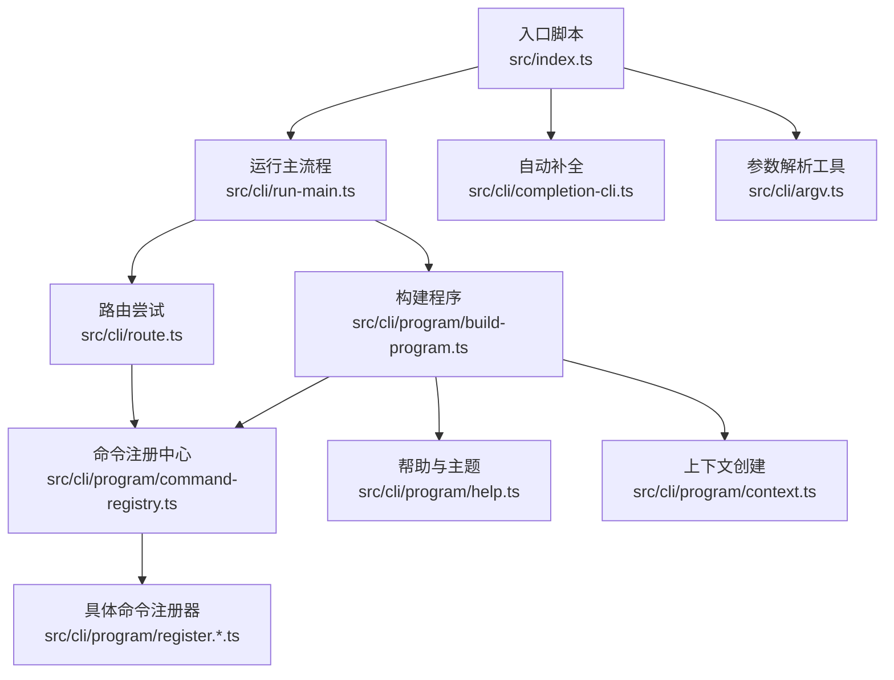
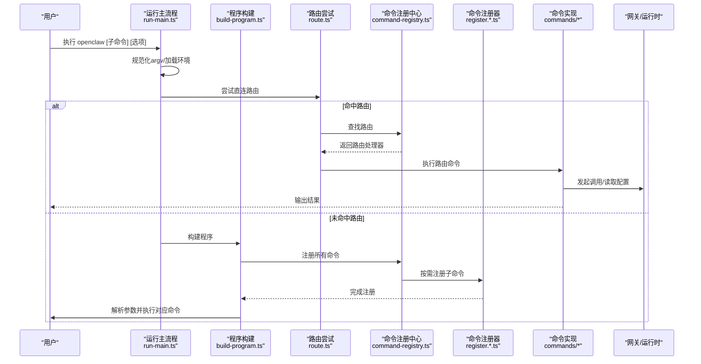
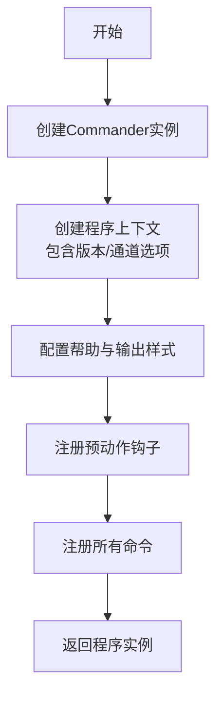
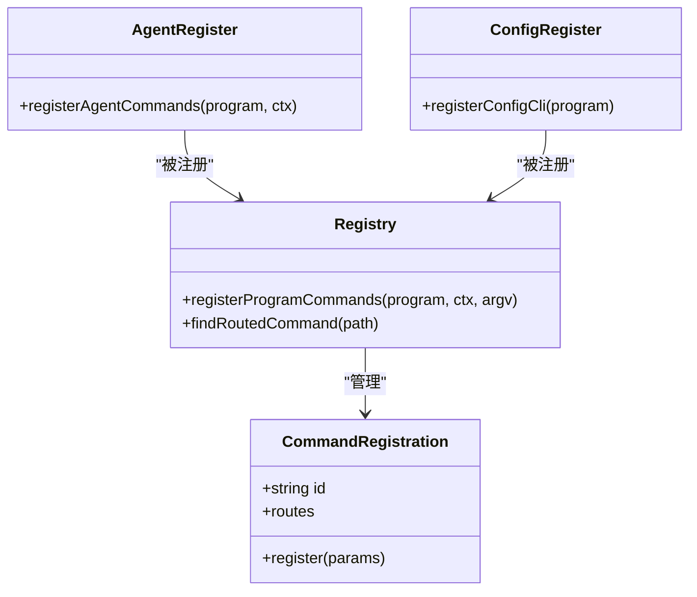
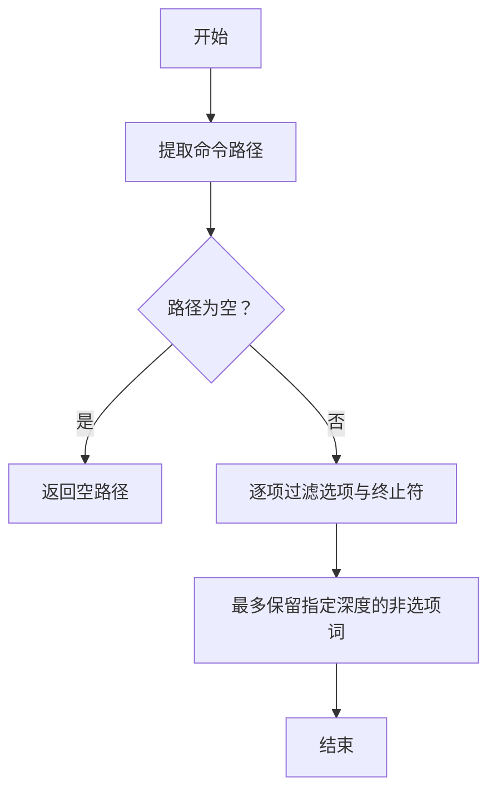
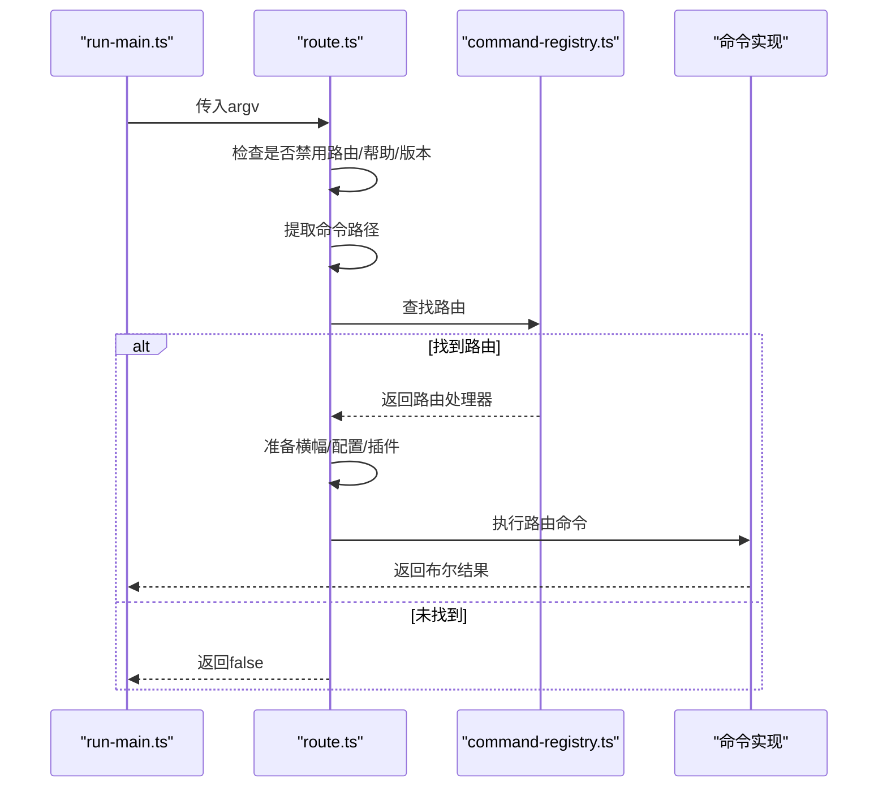
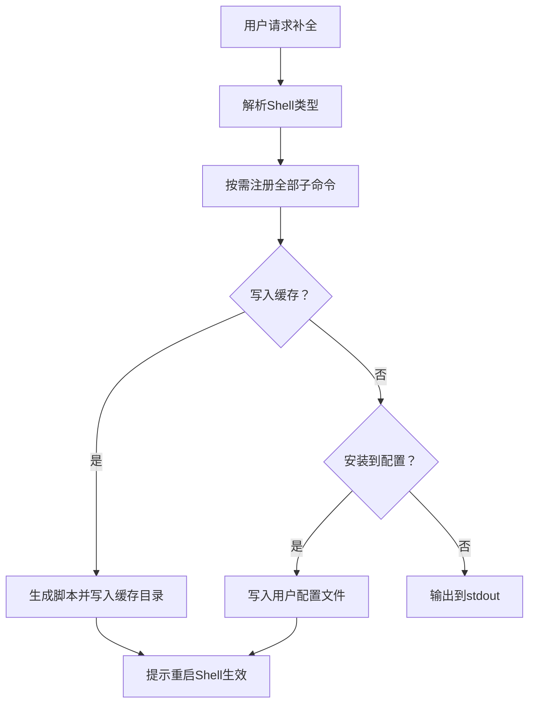
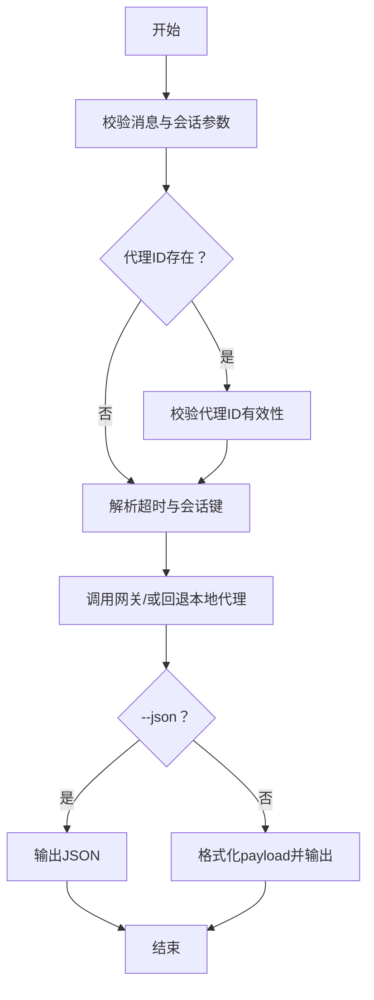
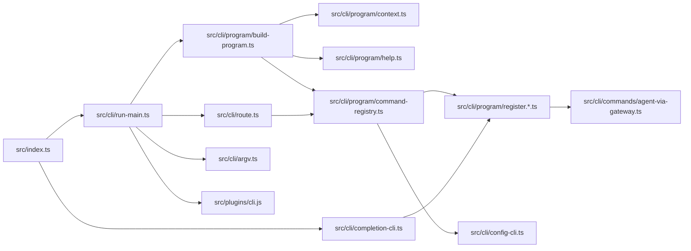

# 命令行工具模块

<cite>
**本文引用的文件**
- [src/index.ts](file://src/index.ts)
- [src/cli/run-main.ts](file://src/cli/run-main.ts)
- [src/cli/program.ts](file://src/cli/program.ts)
- [src/cli/program/build-program.ts](file://src/cli/program/build-program.ts)
- [src/cli/program/context.ts](file://src/cli/program/context.ts)
- [src/cli/program/help.ts](file://src/cli/program/help.ts)
- [src/cli/program/command-registry.ts](file://src/cli/program/command-registry.ts)
- [src/cli/program/register.agent.ts](file://src/cli/program/register.agent.ts)
- [src/cli/program/register.configure.ts](file://src/cli/program/register.configure.ts)
- [src/cli/program/register.maintenance.ts](file://src/cli/program/register.maintenance.ts)
- [src/cli/program/register.message.ts](file://src/cli/program/register.message.ts)
- [src/cli/program/register.onboard.ts](file://src/cli/program/register.onboard.ts)
- [src/cli/program/register.setup.ts](file://src/cli/program/register.setup.ts)
- [src/cli/program/register.status-health-sessions.ts](file://src/cli/program/register.status-health-sessions.ts)
- [src/cli/program/register.subclis.ts](file://src/cli/program/register.subclis.ts)
- [src/cli/program/helpers.ts](file://src/cli/program/helpers.ts)
- [src/cli/argv.ts](file://src/cli/argv.ts)
- [src/cli/route.ts](file://src/cli/route.ts)
- [src/cli/completion-cli.ts](file://src/cli/completion-cli.ts)
- [src/cli/config-cli.ts](file://src/cli/config-cli.ts)
- [src/cli/commands/agent-via-gateway.ts](file://src/cli/commands/agent-via-gateway.ts)
</cite>

## 目录

1. [简介](#简介)
2. [项目结构](#项目结构)
3. [核心组件](#核心组件)
4. [架构总览](#架构总览)
5. [详细组件分析](#详细组件分析)
6. [依赖关系分析](#依赖关系分析)
7. [性能考量](#性能考量)
8. [故障排查指南](#故障排查指南)
9. [结论](#结论)
10. [附录：扩展开发指南](#附录扩展开发指南)

## 简介

本文件面向OpenClaw命令行工具模块，系统性梳理其架构设计、命令注册机制与参数解析体系，详解各类命令的实现逻辑、配置管理与交互流程，并记录命令行选项、帮助系统与自动补全能力。同时提供扩展开发指南，帮助开发者快速添加新命令并优化用户体验。

## 项目结构

OpenClaw CLI采用“程序构建 + 命令注册 + 路由分发”的分层组织方式：

- 入口与运行时：通过入口脚本加载环境、捕获日志、构建程序并解析参数。
- 程序构建：集中初始化Commander实例、上下文、帮助信息与预动作钩子。
- 命令注册：将各功能域命令（如agent、config、message等）注册到程序树。
- 路由机制：对特定路径命令进行“直连路由”，避免完整命令树加载，提升启动性能。
- 自动补全：按Shell生成动态或缓存式补全脚本，支持安装与更新。

图表来源

- [src/index.ts](file://src/index.ts#L1-L94)
- [src/cli/run-main.ts](file://src/cli/run-main.ts#L27-L72)
- [src/cli/program/build-program.ts](file://src/cli/program/build-program.ts#L7-L18)
- [src/cli/program/command-registry.ts](file://src/cli/program/command-registry.ts#L115-L174)
- [src/cli/program/help.ts](file://src/cli/program/help.ts#L33-L98)
- [src/cli/program/context.ts](file://src/cli/program/context.ts#L11-L19)
- [src/cli/route.ts](file://src/cli/route.ts#L22-L40)
- [src/cli/completion-cli.ts](file://src/cli/completion-cli.ts#L222-L274)
- [src/cli/argv.ts](file://src/cli/argv.ts#L1-L170)

章节来源

- [src/index.ts](file://src/index.ts#L1-L94)
- [src/cli/run-main.ts](file://src/cli/run-main.ts#L27-L72)
- [src/cli/program/build-program.ts](file://src/cli/program/build-program.ts#L7-L18)
- [src/cli/program/command-registry.ts](file://src/cli/program/command-registry.ts#L115-L174)
- [src/cli/program/help.ts](file://src/cli/program/help.ts#L33-L98)
- [src/cli/program/context.ts](file://src/cli/program/context.ts#L11-L19)
- [src/cli/route.ts](file://src/cli/route.ts#L22-L40)
- [src/cli/completion-cli.ts](file://src/cli/completion-cli.ts#L222-L274)
- [src/cli/argv.ts](file://src/cli/argv.ts#L1-L170)

## 核心组件

- 程序构建器：负责创建Commander实例、注入上下文、配置帮助与输出、注册预动作与命令。
- 命令注册中心：统一管理所有命令注册器，支持“路由命令”与普通命令。
- 参数解析工具：提供通用flag检测、值提取、正整数解析、命令路径提取与状态迁移策略。
- 路由机制：在未显式请求帮助/版本时，尝试对已知路径命令进行直连执行，减少加载成本。
- 自动补全：按Shell生成补全脚本，支持写入缓存、安装到用户配置文件与检测慢速动态模式。
- 配置CLI：提供config get/set/unset与配置向导，支持点/括号路径与JSON5解析。
- 命令实现示例：以agent via gateway为例，展示从CLI到网关调用再到结果格式化的完整链路。

章节来源

- [src/cli/program/build-program.ts](file://src/cli/program/build-program.ts#L7-L18)
- [src/cli/program/command-registry.ts](file://src/cli/program/command-registry.ts#L115-L189)
- [src/cli/argv.ts](file://src/cli/argv.ts#L30-L100)
- [src/cli/route.ts](file://src/cli/route.ts#L22-L40)
- [src/cli/completion-cli.ts](file://src/cli/completion-cli.ts#L222-L350)
- [src/cli/config-cli.ts](file://src/cli/config-cli.ts#L218-L350)
- [src/cli/commands/agent-via-gateway.ts](file://src/cli/commands/agent-via-gateway.ts#L86-L192)

## 架构总览

下图展示了CLI从入口到命令执行的关键交互：

图表来源

- [src/cli/run-main.ts](file://src/cli/run-main.ts#L27-L72)
- [src/cli/route.ts](file://src/cli/route.ts#L22-L40)
- [src/cli/program/build-program.ts](file://src/cli/program/build-program.ts#L7-L18)
- [src/cli/program/command-registry.ts](file://src/cli/program/command-registry.ts#L166-L189)
- [src/cli/program/register.agent.ts](file://src/cli/program/register.agent.ts#L20-L82)
- [src/cli/commands/agent-via-gateway.ts](file://src/cli/commands/agent-via-gateway.ts#L86-L192)

## 详细组件分析

### 程序构建与上下文

- 构建流程：创建Commander实例，建立程序上下文（包含版本、通道选项），配置帮助文本与输出样式，注册预动作钩子与全部命令。
- 上下文作用：为消息/代理相关命令提供通道选项拼接，确保命令描述与默认值一致。

图表来源

- [src/cli/program/build-program.ts](file://src/cli/program/build-program.ts#L7-L18)
- [src/cli/program/context.ts](file://src/cli/program/context.ts#L11-L19)
- [src/cli/program/help.ts](file://src/cli/program/help.ts#L33-L98)

章节来源

- [src/cli/program/build-program.ts](file://src/cli/program/build-program.ts#L7-L18)
- [src/cli/program/context.ts](file://src/cli/program/context.ts#L11-L19)
- [src/cli/program/help.ts](file://src/cli/program/help.ts#L33-L98)

### 命令注册机制

- 注册中心：维护命令注册条目列表，每个条目包含唯一ID、注册函数与可选的“路由规范”。路由命令在未显式请求帮助/版本时优先直连执行。
- 子命令注册：通过“按需注册”机制，仅在用户输入主命令时才加载该子命令树，降低启动开销。
- 示例：agent命令注册器提供agent与agents子命令族；config命令注册器提供config get/set/unset与配置向导。

图表来源

- [src/cli/program/command-registry.ts](file://src/cli/program/command-registry.ts#L21-L37)
- [src/cli/program/command-registry.ts](file://src/cli/program/command-registry.ts#L115-L174)
- [src/cli/program/register.agent.ts](file://src/cli/program/register.agent.ts#L20-L82)
- [src/cli/config-cli.ts](file://src/cli/config-cli.ts#L218-L256)

章节来源

- [src/cli/program/command-registry.ts](file://src/cli/program/command-registry.ts#L115-L189)
- [src/cli/program/register.agent.ts](file://src/cli/program/register.agent.ts#L20-L82)
- [src/cli/config-cli.ts](file://src/cli/config-cli.ts#L218-L350)

### 参数解析系统

- 通用工具：提供hasFlag/getFlagValue/getPositiveIntFlagValue/getCommandPath等方法，支持“--”终止符、键值对形式与数值校验。
- 状态迁移策略：根据命令路径判断是否需要迁移状态，避免对health/status/sessions/memory status/agent等轻量命令触发状态迁移。

图表来源

- [src/cli/argv.ts](file://src/cli/argv.ts#L80-L100)
- [src/cli/argv.ts](file://src/cli/argv.ts#L150-L170)

章节来源

- [src/cli/argv.ts](file://src/cli/argv.ts#L30-L100)
- [src/cli/argv.ts](file://src/cli/argv.ts#L150-L170)

### 路由机制

- 直连路由：在未请求帮助/版本时，尝试根据前两层命令路径匹配内置路由，直接执行对应命令，跳过完整命令树加载。
- 准备阶段：打印横幅、准备配置、按需加载插件注册表。

图表来源

- [src/cli/run-main.ts](file://src/cli/run-main.ts#L36-L38)
- [src/cli/route.ts](file://src/cli/route.ts#L22-L40)
- [src/cli/program/command-registry.ts](file://src/cli/program/command-registry.ts#L176-L188)

章节来源

- [src/cli/route.ts](file://src/cli/route.ts#L22-L40)
- [src/cli/program/command-registry.ts](file://src/cli/program/command-registry.ts#L176-L188)

### 帮助系统与主题

- 帮助定制：排序子命令与选项、自定义标题样式、注入横幅与示例，以及文档链接。
- 主题与颜色：根据终端能力启用彩色输出，统一命令/选项/错误等视觉风格。

章节来源

- [src/cli/program/help.ts](file://src/cli/program/help.ts#L33-L98)

### 自动补全功能

- 多Shell支持：zsh、bash、fish、PowerShell。
- 动态生成：按当前命令树生成补全脚本；支持写入缓存目录与安装到用户配置文件。
- 慢速模式检测：识别“动态source <(...)”模式并提示改用缓存文件以提升启动速度。

图表来源

- [src/cli/completion-cli.ts](file://src/cli/completion-cli.ts#L222-L274)
- [src/cli/completion-cli.ts](file://src/cli/completion-cli.ts#L276-L350)

章节来源

- [src/cli/completion-cli.ts](file://src/cli/completion-cli.ts#L222-L350)

### 配置管理与交互

- 路径解析：支持点语法与方括号数组索引，转义与校验。
- 值解析：支持JSON5与原始字符串，自动类型推断。
- 写入策略：基于“解析后但未合并默认值”的配置快照进行修改，避免默认值污染用户配置。
- 交互式向导：支持按节运行配置向导，增强易用性。

章节来源

- [src/cli/config-cli.ts](file://src/cli/config-cli.ts#L17-L84)
- [src/cli/config-cli.ts](file://src/cli/config-cli.ts#L204-L216)
- [src/cli/config-cli.ts](file://src/cli/config-cli.ts#L258-L350)

### 命令实现示例：Agent via Gateway

- 输入校验：要求消息体与会话标识之一（收件人、会话ID或代理ID）。
- 代理校验：若指定代理ID，需存在于已配置代理列表。
- 超时处理：根据配置或参数计算超时，保证网关调用有足够时间。
- 回退策略：网关失败时回退到本地嵌入式代理执行。
- 结果格式化：支持JSON输出与多payload日志化输出。

图表来源

- [src/cli/commands/agent-via-gateway.ts](file://src/cli/commands/agent-via-gateway.ts#L86-L192)

章节来源

- [src/cli/commands/agent-via-gateway.ts](file://src/cli/commands/agent-via-gateway.ts#L86-L192)

## 依赖关系分析

- 入口脚本依赖运行主流程与程序构建器；运行主流程依赖路由、参数解析与插件注册。
- 程序构建器依赖上下文、帮助与命令注册中心；命令注册中心依赖各领域注册器与路由规范。
- 路由机制依赖命令注册中心与配置守卫；自动补全依赖子命令注册与状态目录。
- 配置CLI依赖配置读写与JSON5解析；命令实现依赖运行时、网关调用与会话解析。

图表来源

- [src/index.ts](file://src/index.ts#L46-L48)
- [src/cli/run-main.ts](file://src/cli/run-main.ts#L43-L69)
- [src/cli/program/build-program.ts](file://src/cli/program/build-program.ts#L1-L18)
- [src/cli/program/command-registry.ts](file://src/cli/program/command-registry.ts#L1-L37)
- [src/cli/completion-cli.ts](file://src/cli/completion-cli.ts#L239-L247)
- [src/cli/config-cli.ts](file://src/cli/config-cli.ts#L218-L256)
- [src/cli/commands/agent-via-gateway.ts](file://src/cli/commands/agent-via-gateway.ts#L86-L192)

章节来源

- [src/index.ts](file://src/index.ts#L46-L48)
- [src/cli/run-main.ts](file://src/cli/run-main.ts#L43-L69)
- [src/cli/program/build-program.ts](file://src/cli/program/build-program.ts#L1-L18)
- [src/cli/program/command-registry.ts](file://src/cli/program/command-registry.ts#L1-L37)
- [src/cli/completion-cli.ts](file://src/cli/completion-cli.ts#L239-L247)
- [src/cli/config-cli.ts](file://src/cli/config-cli.ts#L218-L256)
- [src/cli/commands/agent-via-gateway.ts](file://src/cli/commands/agent-via-gateway.ts#L86-L192)

## 性能考量

- 按需注册：仅在用户输入主命令时加载对应子命令树，显著降低启动与内存占用。
- 直连路由：对常见命令路径进行直连执行，避免完整命令树构建。
- 缓存补全：优先使用缓存补全脚本，避免每次启动动态生成带来的开销。
- 超时与回退：合理设置网关调用超时并在失败时回退本地执行，平衡可用性与性能。

## 故障排查指南

- 版本/帮助优先：当请求版本或帮助时，程序会立即退出，不加载其他命令树。
- 状态迁移：对健康/状态/会话/内存状态等命令不进行状态迁移，避免不必要的IO。
- 插件注册：在未显式请求帮助/版本且存在主命令时才加载插件CLI命令。
- 补全安装：若提示缓存缺失，请先执行写入缓存命令，再进行安装；检测到慢速动态模式时建议改用缓存文件。

章节来源

- [src/cli/argv.ts](file://src/cli/argv.ts#L5-L7)
- [src/cli/argv.ts](file://src/cli/argv.ts#L167-L170)
- [src/cli/run-main.ts](file://src/cli/run-main.ts#L63-L69)
- [src/cli/completion-cli.ts](file://src/cli/completion-cli.ts#L276-L295)

## 结论

OpenClaw命令行工具模块通过清晰的分层设计与按需加载机制，在保证功能完整性的同时兼顾了启动性能与用户体验。命令注册中心与路由机制使得新增命令与扩展功能变得简单；自动补全与帮助系统提升了交互效率。配置CLI提供了强大的路径解析与安全写入策略，保障用户配置的正确性与可维护性。

## 附录：扩展开发指南

- 新增命令步骤
  1. 在相应领域目录创建命令注册器（参考现有register.\*.ts）。
  2. 在命令注册中心添加注册条目，必要时提供路由规范。
  3. 若为轻量命令，考虑加入路由以支持直连执行。
  4. 在入口脚本或运行主流程中按需注册插件CLI命令。
- 参数与选项
  - 使用hasFlag/getFlagValue等工具进行参数校验与解析。
  - 对数值参数使用getPositiveIntFlagValue并提供默认值与错误提示。
  - 使用collectOption等辅助函数处理可重复选项。
- 帮助与主题
  - 在命令注册器中添加示例与文档链接，保持一致性。
  - 利用主题系统统一命令/选项/错误的显示风格。
- 自动补全
  - 生成补全脚本前先注册全部子命令，确保补全树完整。
  - 推荐使用缓存脚本并提供安装到用户配置文件的能力。
- 用户体验优化
  - 对长耗时操作使用进度提示（参考agent命令）。
  - 提供--json输出以便自动化集成。
  - 对关键错误给出明确修复建议（如doctor命令指引）。

章节来源

- [src/cli/program/command-registry.ts](file://src/cli/program/command-registry.ts#L115-L174)
- [src/cli/program/register.agent.ts](file://src/cli/program/register.agent.ts#L20-L82)
- [src/cli/argv.ts](file://src/cli/argv.ts#L30-L78)
- [src/cli/completion-cli.ts](file://src/cli/completion-cli.ts#L239-L274)
- [src/cli/commands/agent-via-gateway.ts](file://src/cli/commands/agent-via-gateway.ts#L119-L150)
