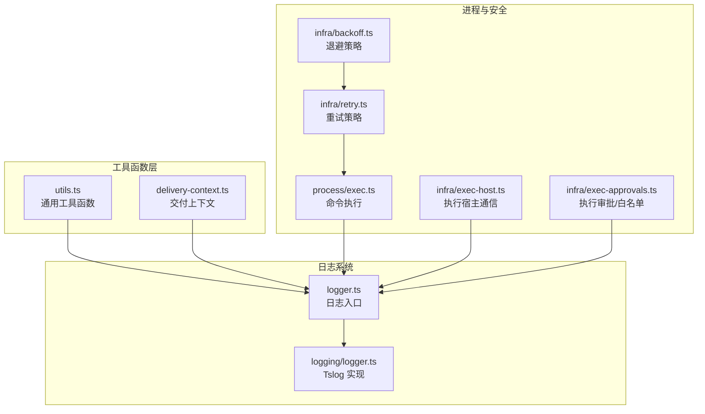
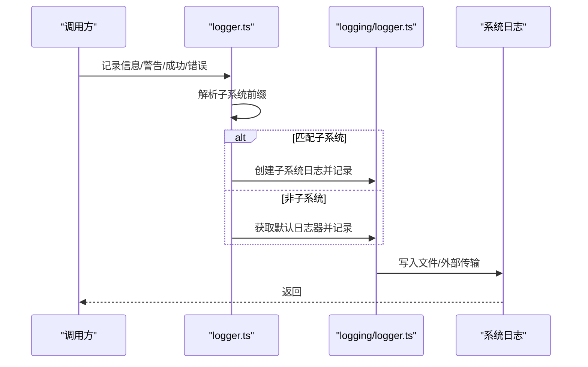
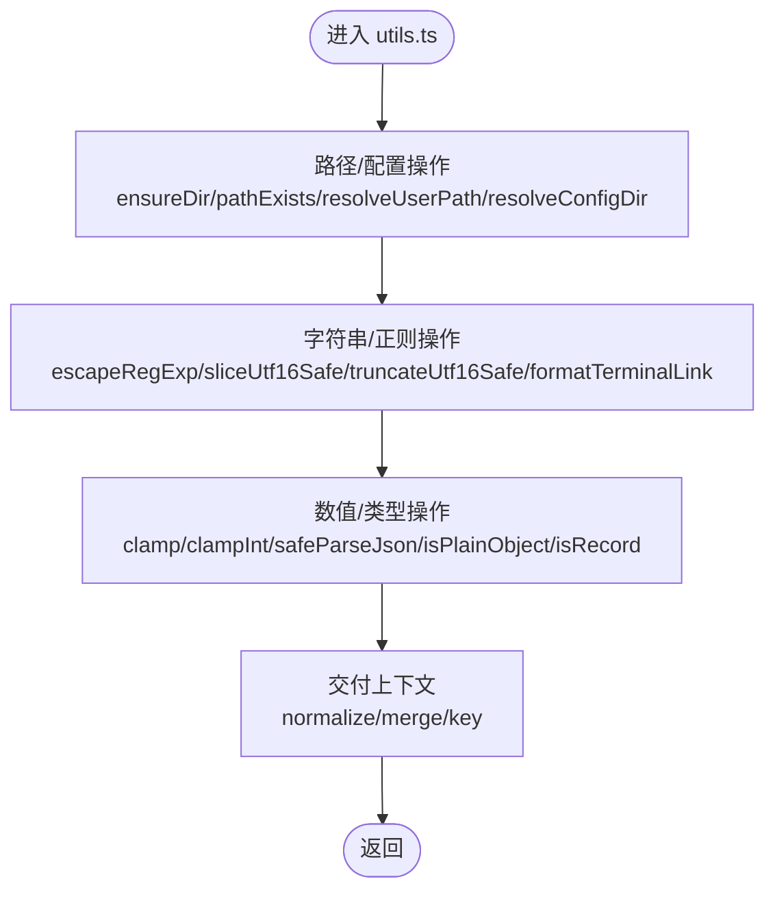
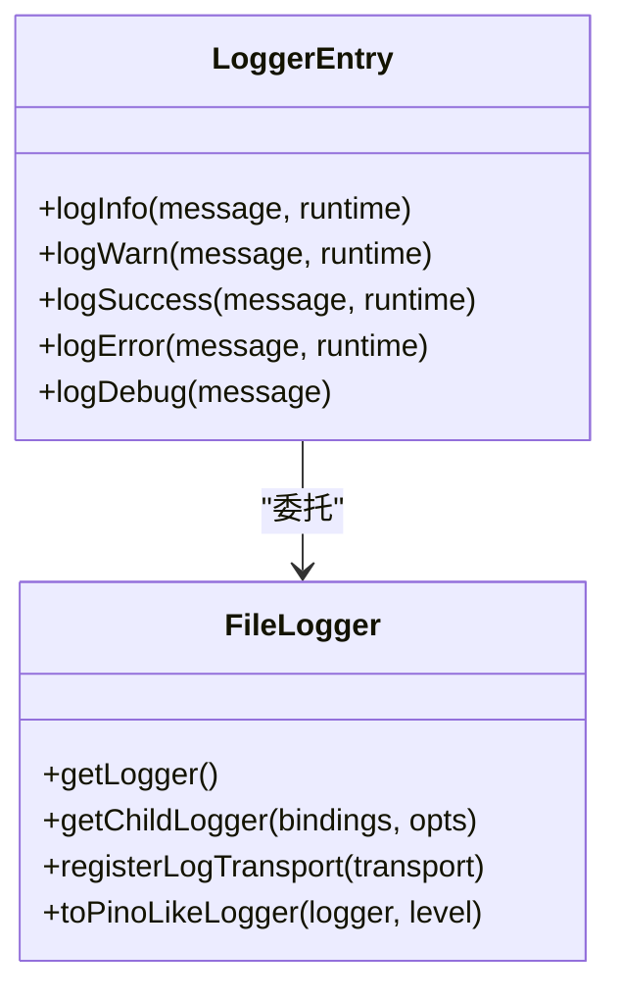
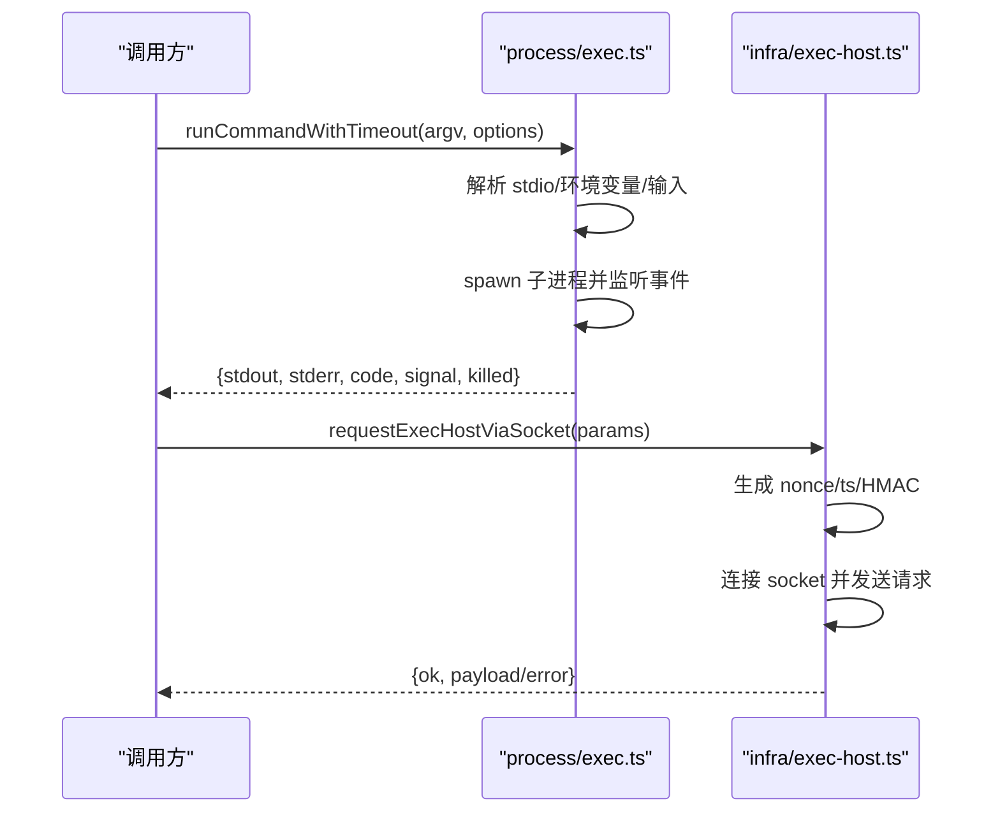
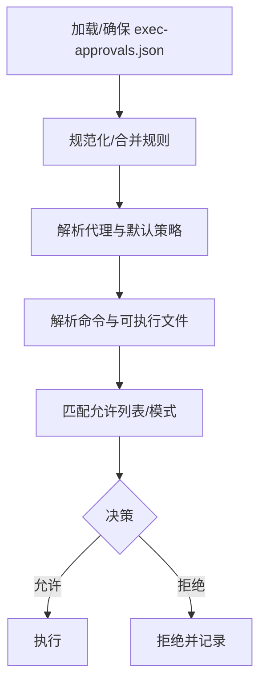
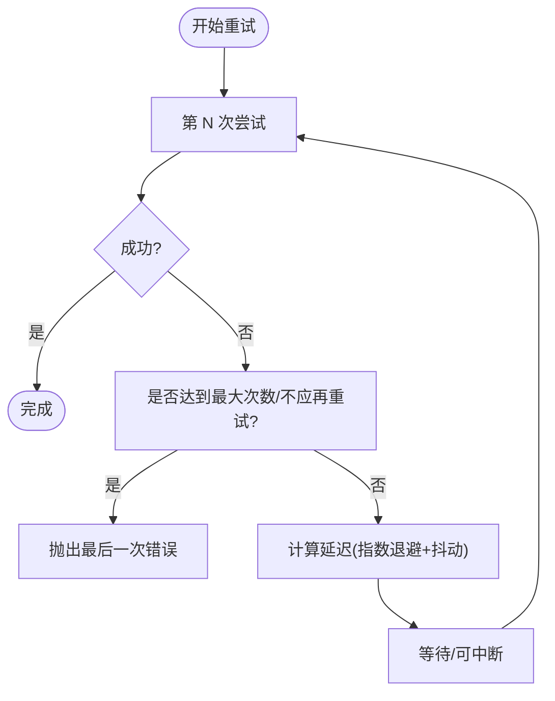
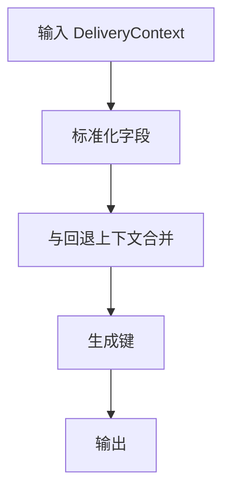
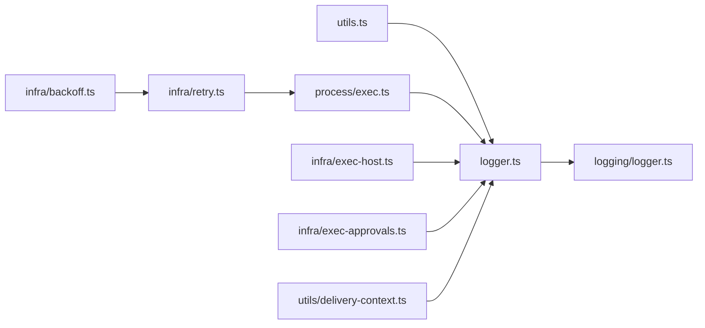

# 工具函数模块

<cite>
**本文引用的文件**
- [src/utils.ts](file://src/utils.ts)
- [src/logger.ts](file://src/logger.ts)
- [src/logging/logger.ts](file://src/logging/logger.ts)
- [src/process/exec.ts](file://src/process/exec.ts)
- [src/infra/exec-host.ts](file://src/infra/exec-host.ts)
- [src/infra/exec-approvals.ts](file://src/infra/exec-approvals.ts)
- [src/infra/retry.ts](file://src/infra/retry.ts)
- [src/infra/backoff.ts](file://src/infra/backoff.ts)
- [src/utils/delivery-context.ts](file://src/utils/delivery-context.ts)
</cite>

## 目录

1. [简介](#简介)
2. [项目结构](#项目结构)
3. [核心组件](#核心组件)
4. [架构总览](#架构总览)
5. [详细组件分析](#详细组件分析)
6. [依赖关系分析](#依赖关系分析)
7. [性能考量](#性能考量)
8. [故障排查指南](#故障排查指南)
9. [结论](#结论)
10. [附录](#附录)

## 简介

本文件面向 OpenClaw 的“工具函数模块”，系统化梳理通用工具函数、日志系统与进程管理机制，覆盖基础设施组件、路由解析与系统工具集，并记录错误处理、性能监控与调试辅助功能。同时提供使用指南、扩展开发建议与最佳实践，帮助开发者在不深入源码细节的前提下高效使用与维护该模块。

## 项目结构

工具函数模块主要分布在以下子目录与文件中：

- 通用工具函数：src/utils.ts
- 日志系统：src/logger.ts（对外入口）与 src/logging/logger.ts（底层实现）
- 进程管理：src/process/exec.ts（命令执行）、src/infra/exec-host.ts（执行宿主通信）、src/infra/exec-approvals.ts（执行审批与白名单）
- 可靠性与重试：src/infra/retry.ts（可配置重试）、src/infra/backoff.ts（退避策略）
- 交付上下文：src/utils/delivery-context.ts（消息/会话交付上下文标准化）

**图表来源**

- [src/utils.ts](file://src/utils.ts#L1-L402)
- [src/utils/delivery-context.ts](file://src/utils/delivery-context.ts#L1-L141)
- [src/logger.ts](file://src/logger.ts#L1-L62)
- [src/logging/logger.ts](file://src/logging/logger.ts#L1-L251)
- [src/process/exec.ts](file://src/process/exec.ts#L1-L160)
- [src/infra/exec-host.ts](file://src/infra/exec-host.ts#L1-L122)
- [src/infra/exec-approvals.ts](file://src/infra/exec-approvals.ts#L1-L800)
- [src/infra/retry.ts](file://src/infra/retry.ts#L1-L137)
- [src/infra/backoff.ts](file://src/infra/backoff.ts#L1-L29)

**章节来源**

- [src/utils.ts](file://src/utils.ts#L1-L402)
- [src/utils/delivery-context.ts](file://src/utils/delivery-context.ts#L1-L141)
- [src/logger.ts](file://src/logger.ts#L1-L62)
- [src/logging/logger.ts](file://src/logging/logger.ts#L1-L251)
- [src/process/exec.ts](file://src/process/exec.ts#L1-L160)
- [src/infra/exec-host.ts](file://src/infra/exec-host.ts#L1-L122)
- [src/infra/exec-approvals.ts](file://src/infra/exec-approvals.ts#L1-L800)
- [src/infra/retry.ts](file://src/infra/retry.ts#L1-L137)
- [src/infra/backoff.ts](file://src/infra/backoff.ts#L1-L29)

## 核心组件

- 通用工具函数：路径解析、字符串与正则处理、数值裁剪、JSON 安全解析、对象类型守卫、字符串截断与 UTF-16 安全切片、终端链接格式化、配置根目录解析等。
- 日志系统：统一入口封装、子系统前缀解析、文件与控制台输出、滚动日志清理、外部传输注册、Tslog 适配器。
- 进程管理：跨平台命令执行、带超时的 spawn、Windows 兼容性处理、标准输入/输出收集、错误日志与调试输出。
- 执行宿主与审批：通过 Unix Socket 请求执行宿主、请求签名与 HMAC 校验、执行结果与错误响应、执行白名单与模式匹配。
- 可靠性与重试：指数退避、抖动、可插拔重试条件、回调钩子、可中断睡眠。
- 交付上下文：消息通道与账号标准化、会话字段合并与键生成。

**章节来源**

- [src/utils.ts](file://src/utils.ts#L1-L402)
- [src/logger.ts](file://src/logger.ts#L1-L62)
- [src/logging/logger.ts](file://src/logging/logger.ts#L1-L251)
- [src/process/exec.ts](file://src/process/exec.ts#L1-L160)
- [src/infra/exec-host.ts](file://src/infra/exec-host.ts#L1-L122)
- [src/infra/exec-approvals.ts](file://src/infra/exec-approvals.ts#L1-L800)
- [src/infra/retry.ts](file://src/infra/retry.ts#L1-L137)
- [src/infra/backoff.ts](file://src/infra/backoff.ts#L1-L29)
- [src/utils/delivery-context.ts](file://src/utils/delivery-context.ts#L1-L141)

## 架构总览

工具函数模块采用分层设计：

- 表层：对外 API（如日志入口、执行入口），负责参数校验与调用分发。
- 中层：具体实现（日志 Tslog、进程执行、执行审批、重试策略）。
- 基础设施：文件系统、网络（Unix Socket）、环境变量与 PATH 解析、平台差异处理。

**图表来源**

- [src/logger.ts](file://src/logger.ts#L17-L61)
- [src/logging/logger.ts](file://src/logging/logger.ts#L117-L140)

## 详细组件分析

### 通用工具函数（utils.ts）

- 路径与配置
  - 确保目录存在、判断路径是否存在、解析用户路径与配置根目录、缩短家目录显示。
  - 终端链接格式化，支持 TTY 检测与回退。
- 字符串与正则
  - 转义正则特殊字符、UTF-16 安全截断与切片、规范化路径前缀。
- 数值与类型
  - 数字/整数裁剪、安全 JSON 解析、对象类型守卫（严格与宽松）。
- 交付上下文工具
  - 通道与账号标准化、会话字段合并、键生成，便于消息路由与去重。

**图表来源**

- [src/utils.ts](file://src/utils.ts#L12-L402)
- [src/utils/delivery-context.ts](file://src/utils/delivery-context.ts#L20-L141)

**章节来源**

- [src/utils.ts](file://src/utils.ts#L12-L402)
- [src/utils/delivery-context.ts](file://src/utils/delivery-context.ts#L1-L141)

### 日志系统（logger.ts 与 logging/logger.ts）

- 入口封装
  - 支持子系统前缀解析（如 subsystem: message），自动分流到子系统日志器或默认日志器。
  - 控制台与文件双通道输出，调试日志仅在详细模式下输出到控制台。
- 底层实现
  - 使用 Tslog 构建日志器，按配置写入文件；支持外部传输注册与适配（兼容第三方库）。
  - 滚动日志清理（保留 24 小时内），设置缓存避免重复构建。
  - 提供子日志器与级别过滤能力，便于模块化与性能优化。

**图表来源**

- [src/logger.ts](file://src/logger.ts#L17-L61)
- [src/logging/logger.ts](file://src/logging/logger.ts#L117-L177)

**章节来源**

- [src/logger.ts](file://src/logger.ts#L1-L62)
- [src/logging/logger.ts](file://src/logging/logger.ts#L1-L251)

### 进程管理（process/exec.ts 与 infra/exec-host.ts）

- 命令执行
  - Promise 包装 execFile，支持超时与缓冲区大小限制；Windows 平台对 npm/pnpm/yarn/npx 自动补全 .cmd 后缀。
  - 交互式 spawn，支持输入注入、继承 TTY、超时强制终止、错误与关闭事件聚合。
- 执行宿主通信
  - 通过 Unix Socket 发送执行请求，请求体包含随机 nonce、时间戳与 HMAC 校验，防止重放与篡改。
  - 响应类型区分成功与失败，携带退出码、标准输出/错误与超时标记。

**图表来源**

- [src/process/exec.ts](file://src/process/exec.ts#L81-L160)
- [src/infra/exec-host.ts](file://src/infra/exec-host.ts#L35-L122)

**章节来源**

- [src/process/exec.ts](file://src/process/exec.ts#L1-L160)
- [src/infra/exec-host.ts](file://src/infra/exec-host.ts#L1-L122)

### 执行审批与白名单（infra/exec-approvals.ts）

- 文件与路径
  - 默认配置文件与 socket 路径位于家目录，支持 ~ 展开；文件权限严格（600）。
- 规则解析
  - 默认策略与代理策略合并，通配符代理优先级低于具体代理；允许列表条目规范化与去重。
- 命令解析与匹配
  - 解析首个 token、查找可执行文件、支持 PATHEXT 扩展名；通配符模式转换为正则进行匹配。
- 安全策略
  - 支持 deny/allowlist/full 三种安全等级；ask 三态（off/on-miss/always）与回退策略；自动允许技能开关。

**图表来源**

- [src/infra/exec-approvals.ts](file://src/infra/exec-approvals.ts#L221-L388)

**章节来源**

- [src/infra/exec-approvals.ts](file://src/infra/exec-approvals.ts#L1-L800)

### 可靠性与重试（infra/retry.ts 与 infra/backoff.ts）

- 重试策略
  - 指数退避、抖动、最大尝试次数、最小/最大延迟；支持自定义重试条件与回调。
- 退避策略
  - 提供可中断睡眠，支持 AbortSignal，便于上层取消与资源回收。

**图表来源**

- [src/infra/retry.ts](file://src/infra/retry.ts#L70-L137)
- [src/infra/backoff.ts](file://src/infra/backoff.ts#L16-L29)

**章节来源**

- [src/infra/retry.ts](file://src/infra/retry.ts#L1-L137)
- [src/infra/backoff.ts](file://src/infra/backoff.ts#L1-L29)

### 交付上下文（utils/delivery-context.ts）

- 规范化与合并
  - 渠道与账号标准化、线程 ID 规范、空字段剔除。
- 键生成
  - 基于渠道、目标、账号与线程 ID 生成稳定键，用于会话/消息去重与路由。

**图表来源**

- [src/utils/delivery-context.ts](file://src/utils/delivery-context.ts#L20-L141)

**章节来源**

- [src/utils/delivery-context.ts](file://src/utils/delivery-context.ts#L1-L141)

## 依赖关系分析

- 模块内聚与耦合
  - 日志入口与实现分离，降低耦合；进程执行与审批相互独立但可组合。
  - 交付上下文与日志、进程无直接耦合，作为数据模型被上层业务复用。
- 外部依赖
  - 日志基于 Tslog；进程基于 Node.js child_process；Socket 基于 net；文件系统基于 fs/path/os。
- 循环依赖
  - 当前文件未见循环导入；各模块职责清晰，通过接口与类型进行解耦。

**图表来源**

- [src/utils.ts](file://src/utils.ts#L1-L402)
- [src/logger.ts](file://src/logger.ts#L1-L62)
- [src/logging/logger.ts](file://src/logging/logger.ts#L1-L251)
- [src/process/exec.ts](file://src/process/exec.ts#L1-L160)
- [src/infra/exec-host.ts](file://src/infra/exec-host.ts#L1-L122)
- [src/infra/exec-approvals.ts](file://src/infra/exec-approvals.ts#L1-L800)
- [src/infra/retry.ts](file://src/infra/retry.ts#L1-L137)
- [src/infra/backoff.ts](file://src/infra/backoff.ts#L1-L29)
- [src/utils/delivery-context.ts](file://src/utils/delivery-context.ts#L1-L141)

**章节来源**

- [src/utils.ts](file://src/utils.ts#L1-L402)
- [src/logger.ts](file://src/logger.ts#L1-L62)
- [src/logging/logger.ts](file://src/logging/logger.ts#L1-L251)
- [src/process/exec.ts](file://src/process/exec.ts#L1-L160)
- [src/infra/exec-host.ts](file://src/infra/exec-host.ts#L1-L122)
- [src/infra/exec-approvals.ts](file://src/infra/exec-approvals.ts#L1-L800)
- [src/infra/retry.ts](file://src/infra/retry.ts#L1-L137)
- [src/infra/backoff.ts](file://src/infra/backoff.ts#L1-L29)
- [src/utils/delivery-context.ts](file://src/utils/delivery-context.ts#L1-L141)

## 性能考量

- 日志
  - 使用缓存的日志器与设置，避免重复构建；滚动日志定期清理，减少磁盘占用。
  - 文件写入为同步追加，异常被吞以便不阻塞主流程；建议在高并发场景下评估异步写入或批量落盘。
- 进程
  - Windows 平台自动补全 .cmd 后缀，避免多次尝试；spawn 时继承 TTY 以提升交互体验。
  - 超时强制终止与输入流一次性写入，防止僵尸进程与资源泄漏。
- 重试
  - 指数退避与抖动降低雪崩风险；合理设置最大延迟与抖动比例，避免过长等待。
- 路径与字符串
  - 正则转义与 UTF-16 安全切片避免错误匹配与崩溃；短路径显示减少日志体积。

[本节为通用指导，无需列出章节来源]

## 故障排查指南

- 日志问题
  - 若子系统前缀未生效，检查消息是否符合 subsystem: message 格式；确认默认运行时与子系统日志器创建逻辑。
  - 文件写入失败不影响主流程，若出现日志缺失，检查文件权限与磁盘空间。
- 进程执行失败
  - Windows 下 npm/pnpm/yarn/npx 缺失 .cmd 导致失败，确认 resolveCommand 逻辑与 PATH。
  - 超时导致 SIGKILL，检查命令耗时与 maxBuffer 设置；查看 stderr 与 killed 标记。
- 执行宿主通信
  - Socket 连接失败或无响应，检查 socket 路径与 token；确认 HMAC 校验与请求体格式。
- 执行审批
  - 命令未命中允许列表，检查模式匹配与 PATHEXT；确认代理与通配符策略合并顺序。
- 重试与退避
  - 重试过多仍失败，检查 shouldRetry 条件与 retryAfterMs；必要时增加抖动或调整最大延迟。
- 交付上下文
  - 键冲突或路由异常，检查渠道与账号标准化逻辑与线程 ID 规范化。

**章节来源**

- [src/logger.ts](file://src/logger.ts#L17-L61)
- [src/logging/logger.ts](file://src/logging/logger.ts#L117-L140)
- [src/process/exec.ts](file://src/process/exec.ts#L33-L160)
- [src/infra/exec-host.ts](file://src/infra/exec-host.ts#L35-L122)
- [src/infra/exec-approvals.ts](file://src/infra/exec-approvals.ts#L221-L388)
- [src/infra/retry.ts](file://src/infra/retry.ts#L70-L137)
- [src/infra/backoff.ts](file://src/infra/backoff.ts#L16-L29)
- [src/utils/delivery-context.ts](file://src/utils/delivery-context.ts#L20-L141)

## 结论

工具函数模块通过清晰的分层与职责划分，提供了稳定、可扩展的基础能力：

- 通用工具函数覆盖路径、字符串、数值与交付上下文，满足多场景需求。
- 日志系统具备子系统隔离、滚动清理与外部传输能力，兼顾可观测性与性能。
- 进程管理与执行审批在安全性与可用性之间取得平衡，支持跨平台与交互式执行。
- 可靠性组件提供灵活的重试与退避策略，增强系统韧性。

[本节为总结，无需列出章节来源]

## 附录

### 使用指南

- 日志
  - 在需要记录的模块中调用日志入口函数；若消息以 subsystem: 开头，将自动进入子系统日志器。
  - 需要结构化字段时，使用子日志器或外部传输注册。
- 进程
  - 简单命令使用 Promise 包装的执行函数；复杂交互使用带超时的 spawn。
  - Windows 平台无需手动添加 .cmd 后缀。
- 执行审批
  - 在执行前解析命令并匹配允许列表；根据代理策略决定是否弹窗或拒绝。
- 重试
  - 对幂等操作使用指数退避与抖动；对非幂等操作谨慎使用重试。
- 交付上下文
  - 在消息路由前先标准化并合并上下文，再生成键进行去重与路由。

**章节来源**

- [src/logger.ts](file://src/logger.ts#L17-L61)
- [src/process/exec.ts](file://src/process/exec.ts#L33-L160)
- [src/infra/exec-approvals.ts](file://src/infra/exec-approvals.ts#L466-L604)
- [src/infra/retry.ts](file://src/infra/retry.ts#L70-L137)
- [src/utils/delivery-context.ts](file://src/utils/delivery-context.ts#L20-L141)

### 扩展开发与最佳实践

- 扩展日志
  - 新增外部传输时，使用注册函数并在日志器构建后自动附加；注意异常捕获以免阻塞。
- 扩展进程
  - 新增平台特定兼容逻辑时，遵循现有 resolveCommand 与 stdio 解析模式。
- 扩展执行审批
  - 新增模式或策略时，保持与现有合并与规范化流程一致；确保文件权限与路径展开正确。
- 可靠性
  - 为关键操作配置合理的重试与退避参数；对不可恢复错误及时终止并上报。
- 交付上下文
  - 新增渠道或账号类型时，完善标准化与合并逻辑，保证键的稳定性。

**章节来源**

- [src/logging/logger.ts](file://src/logging/logger.ts#L194-L203)
- [src/process/exec.ts](file://src/process/exec.ts#L14-L30)
- [src/infra/exec-approvals.ts](file://src/infra/exec-approvals.ts#L183-L215)
- [src/infra/retry.ts](file://src/infra/retry.ts#L45-L60)
- [src/utils/delivery-context.ts](file://src/utils/delivery-context.ts#L20-L50)
