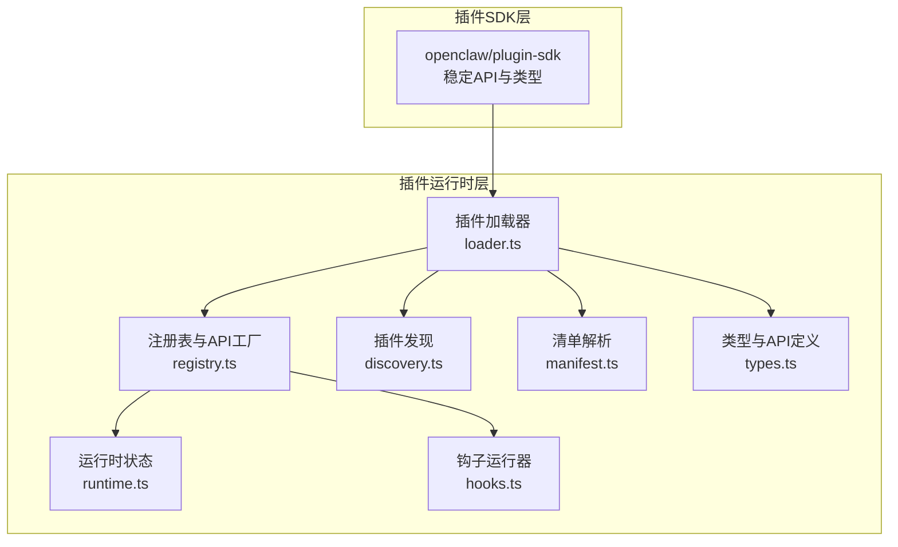
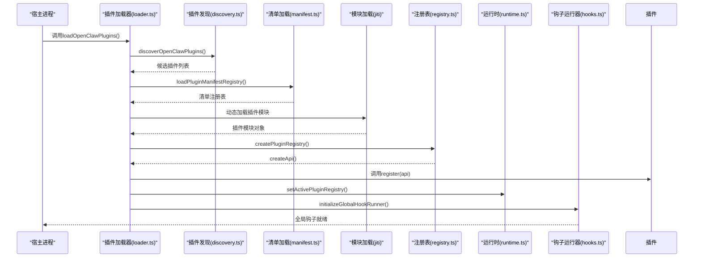
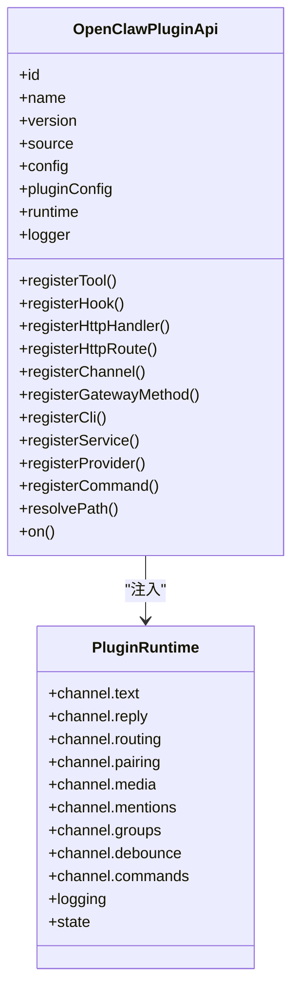
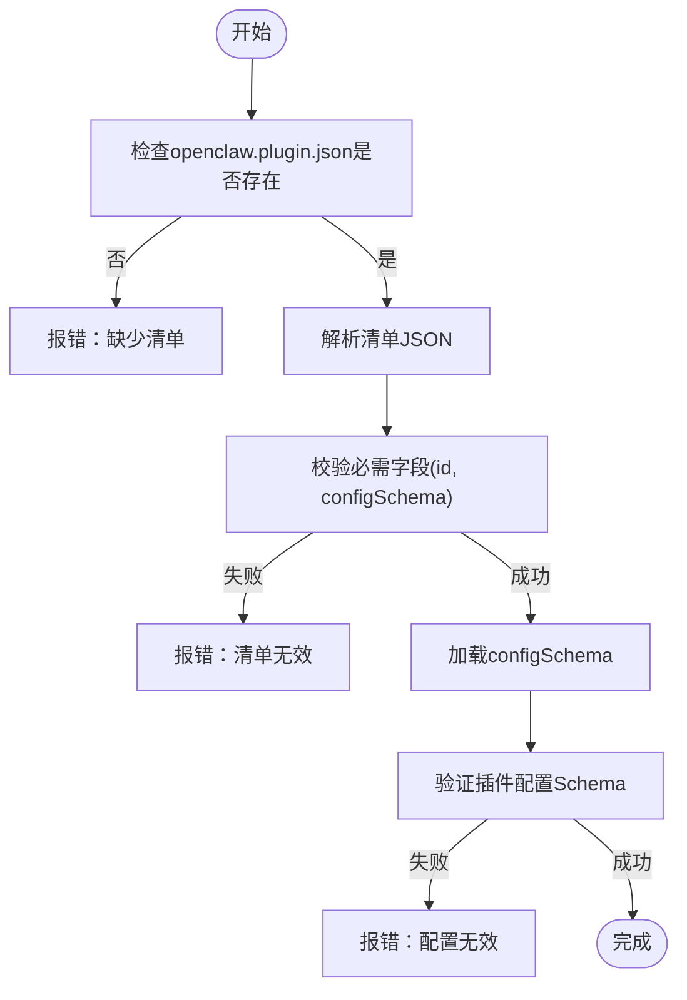
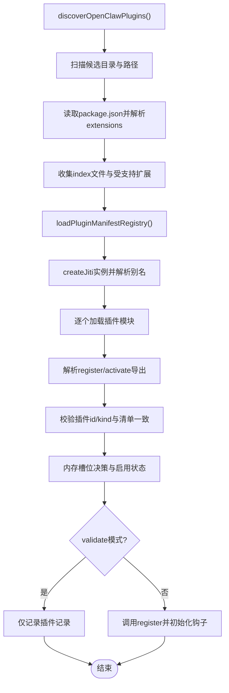
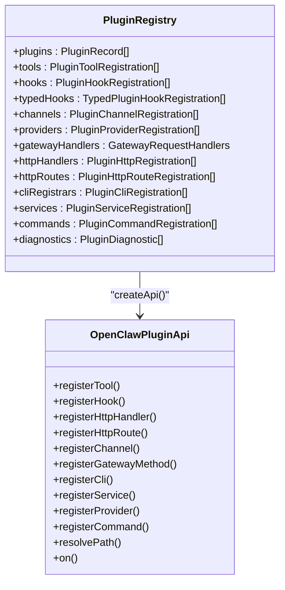
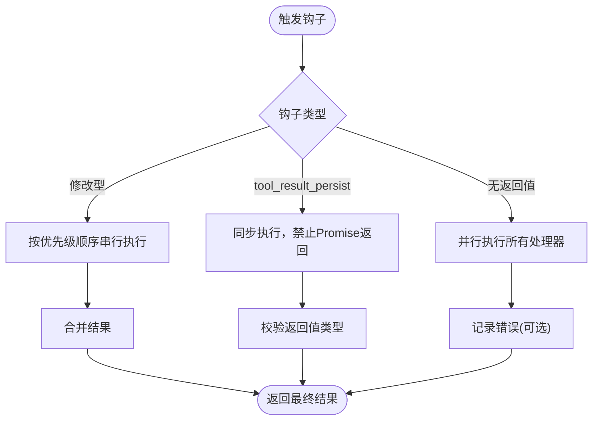
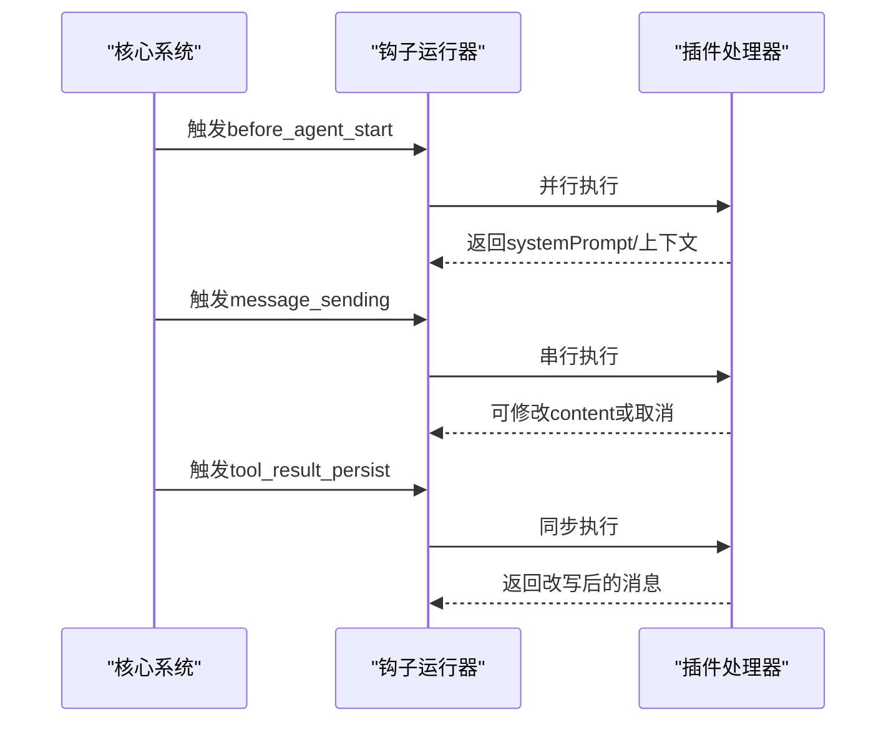
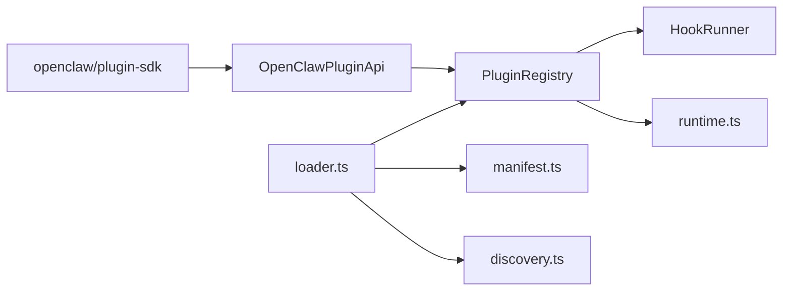

# 插件系统模块

<cite>
**本文档引用的文件**
- [src/plugin-sdk/index.ts](file://src/plugin-sdk/index.ts)
- [docs/refactor/plugin-sdk.md](file://docs/refactor/plugin-sdk.md)
- [docs/plugins/manifest.md](file://docs/plugins/manifest.md)
- [src/plugins/runtime.ts](file://src/plugins/runtime.ts)
- [src/plugins/loader.ts](file://src/plugins/loader.ts)
- [src/plugins/hooks.ts](file://src/plugins/hooks.ts)
- [src/plugins/manifest.ts](file://src/plugins/manifest.ts)
- [src/plugins/types.ts](file://src/plugins/types.ts)
- [src/plugins/discovery.ts](file://src/plugins/discovery.ts)
- [src/plugins/registry.ts](file://src/plugins/registry.ts)
- [src/plugins/config-state.ts](file://src/plugins/config-state.ts)
- [extensions/discord/openclaw.plugin.json](file://extensions/discord/openclaw.plugin.json)
- [extensions/discord/index.ts](file://extensions/discord/index.ts)
</cite>

## 目录

1. [简介](#简介)
2. [项目结构](#项目结构)
3. [核心组件](#核心组件)
4. [架构总览](#架构总览)
5. [详细组件分析](#详细组件分析)
6. [依赖关系分析](#依赖关系分析)
7. [性能考虑](#性能考虑)
8. [故障排除指南](#故障排除指南)
9. [结论](#结论)
10. [附录](#附录)

## 简介

本文件面向OpenClaw插件系统模块，提供从架构设计到实现细节的完整说明。内容涵盖插件架构设计、动态加载机制、API接口定义、生命周期管理、钩子系统与事件处理、配置管理、依赖解析与版本兼容策略，并给出插件开发指南、SDK使用说明与发布流程建议。文档同时包含多处可视化图示，帮助读者快速理解插件系统的数据流与控制流。

## 项目结构

OpenClaw插件系统由“插件SDK”和“插件运行时”两层组成：

- 插件SDK：稳定、可发布、编译期可用的类型与工具集合，不引入运行时状态或副作用。
- 插件运行时：注入到插件中的执行面，通过OpenClawPluginApi.runtime访问核心行为。

插件系统的关键目录与文件：

- 插件SDK导出入口：src/plugin-sdk/index.ts
- 插件SDK重构计划：docs/refactor/plugin-sdk.md
- 插件清单规范：docs/plugins/manifest.md
- 运行时注册表与全局状态：src/plugins/runtime.ts
- 插件加载器：src/plugins/loader.ts
- 钩子运行器：src/plugins/hooks.ts
- 插件清单解析：src/plugins/manifest.ts
- 类型与API定义：src/plugins/types.ts
- 插件发现：src/plugins/discovery.ts
- 注册表与API工厂：src/plugins/registry.ts
- 配置归一化与启用决策：src/plugins/config-state.ts
- 示例插件（Discord）：extensions/discord/\*

**图表来源**

- [src/plugin-sdk/index.ts](file://src/plugin-sdk/index.ts#L1-L392)
- [src/plugins/loader.ts](file://src/plugins/loader.ts#L1-L457)
- [src/plugins/registry.ts](file://src/plugins/registry.ts#L1-L516)
- [src/plugins/runtime.ts](file://src/plugins/runtime.ts#L1-L58)
- [src/plugins/hooks.ts](file://src/plugins/hooks.ts#L1-L471)
- [src/plugins/discovery.ts](file://src/plugins/discovery.ts#L1-L365)
- [src/plugins/manifest.ts](file://src/plugins/manifest.ts#L1-L152)
- [src/plugins/types.ts](file://src/plugins/types.ts#L1-L538)

**章节来源**

- [src/plugin-sdk/index.ts](file://src/plugin-sdk/index.ts#L1-L392)
- [docs/refactor/plugin-sdk.md](file://docs/refactor/plugin-sdk.md#L1-L215)

## 核心组件

- 插件SDK：集中导出通道适配器、配置模式、工具参数辅助函数、日志传输、诊断事件等，确保所有依赖通过SDK或运行时进入，避免直接导入src/\*\*。
- 插件运行时：维护全局注册表与缓存键，提供当前活跃注册表的设置与获取。
- 插件加载器：负责发现候选插件、加载清单、解析别名、校验配置、调用插件注册函数并初始化全局钩子运行器。
- 注册表与API工厂：统一注册工具、钩子、HTTP路由、通道、提供商、CLI命令、服务等；生成OpenClawPluginApi供插件使用。
- 钩子系统：提供按优先级排序的异步钩子运行器，支持修改型与无返回值型钩子，保证错误隔离与可观察性。
- 插件清单：严格JSON Schema验证，要求每个插件提供openclaw.plugin.json及configSchema。
- 配置状态：对plugins配置进行归一化、启用决策、内存槽位选择与测试环境默认值处理。

**章节来源**

- [src/plugins/runtime.ts](file://src/plugins/runtime.ts#L1-L58)
- [src/plugins/loader.ts](file://src/plugins/loader.ts#L1-L457)
- [src/plugins/registry.ts](file://src/plugins/registry.ts#L1-L516)
- [src/plugins/hooks.ts](file://src/plugins/hooks.ts#L1-L471)
- [src/plugins/manifest.ts](file://src/plugins/manifest.ts#L1-L152)
- [src/plugins/config-state.ts](file://src/plugins/config-state.ts#L1-L226)
- [src/plugins/types.ts](file://src/plugins/types.ts#L1-L538)

## 架构总览

下图展示插件系统从发现到运行的端到端流程，包括插件清单验证、配置校验、模块加载与注册、钩子初始化等关键步骤。

**图表来源**

- [src/plugins/loader.ts](file://src/plugins/loader.ts#L170-L456)
- [src/plugins/discovery.ts](file://src/plugins/discovery.ts#L301-L364)
- [src/plugins/manifest.ts](file://src/plugins/manifest.ts#L44-L100)
- [src/plugins/registry.ts](file://src/plugins/registry.ts#L468-L515)
- [src/plugins/runtime.ts](file://src/plugins/runtime.ts#L39-L57)
- [src/plugins/hooks.ts](file://src/plugins/hooks.ts#L450-L467)

## 详细组件分析

### 插件SDK与运行时

- SDK职责：提供稳定的类型、配置模式构建器、通道适配器、工具参数读取器、日志与诊断事件等，确保插件只依赖SDK与运行时。
- 运行时职责：维护全局注册表与缓存键，提供当前活跃注册表的设置与获取，支持缓存命中与失效。
- 版本兼容：通过openclawRuntime语义化版本声明运行时范围，配合SDK版本与运行时版本约束，确保外部插件与核心版本兼容。

**图表来源**

- [docs/refactor/plugin-sdk.md](file://docs/refactor/plugin-sdk.md#L48-L144)
- [src/plugins/types.ts](file://src/plugins/types.ts#L244-L283)

**章节来源**

- [src/plugin-sdk/index.ts](file://src/plugin-sdk/index.ts#L1-L392)
- [docs/refactor/plugin-sdk.md](file://docs/refactor/plugin-sdk.md#L1-L215)
- [src/plugins/runtime.ts](file://src/plugins/runtime.ts#L1-L58)
- [src/plugins/types.ts](file://src/plugins/types.ts#L1-L538)

### 插件清单与配置验证

- 清单要求：每个插件必须在根目录提供openclaw.plugin.json，包含id与configSchema；可选字段包括kind、channels、providers、skills、name、description、uiHints、version等。
- 验证规则：未知channels键、plugins.entries.<id>、plugins.allow、plugins.deny、plugins.slots.\*必须引用可发现的插件id；缺失或损坏清单将导致Doctor报告错误；已禁用插件保留配置并警告。
- JSON Schema：每个插件必须提供JSON Schema，即使为空；Schema在读写配置时验证，而非运行时。

**图表来源**

- [src/plugins/manifest.ts](file://src/plugins/manifest.ts#L44-L100)
- [docs/plugins/manifest.md](file://docs/plugins/manifest.md#L18-L72)

**章节来源**

- [src/plugins/manifest.ts](file://src/plugins/manifest.ts#L1-L152)
- [docs/plugins/manifest.md](file://docs/plugins/manifest.md#L1-L72)

### 插件发现与加载

- 发现范围：支持从配置路径、工作空间目录、全局目录与内建目录扫描插件；支持package.json中extensions字段声明的扩展路径。
- 加载策略：使用jiti动态加载插件模块，支持多种扩展名；根据插件导出形式（默认导出或具名导出）解析注册函数；支持openclaw/plugin-sdk别名解析。
- 启用决策：依据plugins配置的allow/deny、entries、slots.memory与bundled默认策略决定是否启用；内存插件槽位冲突时仅允许一个被选中。
- 配置校验：在validate模式下仅校验，不执行注册；非validate模式下执行注册并捕获异常，记录诊断信息。

**图表来源**

- [src/plugins/discovery.ts](file://src/plugins/discovery.ts#L301-L364)
- [src/plugins/loader.ts](file://src/plugins/loader.ts#L170-L456)

**章节来源**

- [src/plugins/discovery.ts](file://src/plugins/discovery.ts#L1-L365)
- [src/plugins/loader.ts](file://src/plugins/loader.ts#L1-L457)
- [src/plugins/config-state.ts](file://src/plugins/config-state.ts#L164-L225)

### 注册表与API工厂

- 统一注册：注册工具、HTTP处理器/路由、通道、提供商、CLI命令、服务、命令式插件命令等；记录插件元信息（工具名、钩子名、通道id、提供商id、网关方法、CLI命令、服务、命令、HTTP处理器数量、钩子总数、配置Schema存在性等）。
- API工厂：为插件生成OpenClawPluginApi，封装runtime、logger、resolvePath与各类注册方法；支持typed hooks注册并记录优先级。
- 冲突检测：HTTP路由重复、网关方法重复、提供商重复、命令重名等均会记录诊断信息。

**图表来源**

- [src/plugins/registry.ts](file://src/plugins/registry.ts#L124-L138)
- [src/plugins/registry.ts](file://src/plugins/registry.ts#L468-L515)

**章节来源**

- [src/plugins/registry.ts](file://src/plugins/registry.ts#L1-L516)
- [src/plugins/types.ts](file://src/plugins/types.ts#L244-L283)

### 钩子系统与事件处理

- 钩子类型：包括before_agent_start、agent_end、before_compaction、after_compaction、message_received、message_sending、message_sent、before_tool_call、after_tool_call、tool_result_persist、session_start、session_end、gateway_start、gateway_stop。
- 运行策略：
  - 无返回值钩子：并行执行（fire-and-forget），提升性能。
  - 修改型钩子：按优先级顺序串行执行，合并结果（如systemPrompt、prependContext、content、cancel等）。
  - tool_result_persist：同步钩子，禁止异步返回，防止热路径阻塞。
- 错误处理：可配置catchErrors，未catch时抛出聚合错误；记录失败原因与插件id。

**图表来源**

- [src/plugins/hooks.ts](file://src/plugins/hooks.ts#L93-L467)

**章节来源**

- [src/plugins/hooks.ts](file://src/plugins/hooks.ts#L1-L471)
- [src/plugins/types.ts](file://src/plugins/types.ts#L298-L538)

### 插件生命周期管理

- 生命周期阶段：发现→清单加载→模块加载→注册→钩子初始化→运行。
- 启停钩子：gateway_start/gateway_stop用于网关启停事件；session_start/session_end用于会话启停事件；agent生命周期钩子用于系统提示词与上下文注入。
- 工具钩子：before_tool_call用于拦截与修改工具调用参数或阻止调用；after_tool_call用于后置通知；tool_result_persist用于持久化前的消息改写。
- 消息钩子：message_received用于入站消息监听；message_sending用于出站消息修改或取消；message_sent用于发送完成通知。

**图表来源**

- [src/plugins/hooks.ts](file://src/plugins/hooks.ts#L183-L372)

**章节来源**

- [src/plugins/hooks.ts](file://src/plugins/hooks.ts#L1-L471)
- [src/plugins/types.ts](file://src/plugins/types.ts#L298-L538)

### 插件开发指南

- 创建清单：在插件根目录提供openclaw.plugin.json，至少包含id与configSchema；如需通道/提供商/技能，请在清单中声明。
- 编写注册函数：导出register或activate函数，接收OpenClawPluginApi并注册工具、钩子、HTTP路由、通道、提供商、CLI命令、服务等。
- 使用SDK：通过openclaw/plugin-sdk访问类型、配置模式构建器、工具参数读取器、日志与诊断事件等。
- 测试与调试：利用validate模式仅校验配置；在测试环境中默认禁用插件，避免加载重型依赖；使用Doctor报告插件错误与警告。
- 发布与兼容：声明openclawRuntime版本范围，确保SDK与运行时版本兼容；遵循清单字段与Schema要求。

**章节来源**

- [docs/plugins/manifest.md](file://docs/plugins/manifest.md#L1-L72)
- [src/plugins/loader.ts](file://src/plugins/loader.ts#L170-L456)
- [src/plugin-sdk/index.ts](file://src/plugin-sdk/index.ts#L1-L392)

### SDK使用说明

- 导出内容：通道适配器类型、配置模式、配对与引导助手、工具参数读取器、文档链接助手、日志传输、诊断事件等。
- 使用方式：在插件中import "openclaw/plugin-sdk"，通过导出类型与工具函数构建通道适配器、配置Schema与命令行工具。
- 最佳实践：尽量使用SDK提供的配置模式构建器与工具参数读取器，减少样板代码；通过uiHints完善配置界面提示。

**章节来源**

- [src/plugin-sdk/index.ts](file://src/plugin-sdk/index.ts#L1-L392)

### 插件发布流程

- 准备清单：确保openclaw.plugin.json完整且configSchema有效；声明channels/providers/skills等元信息。
- 版本与兼容：在清单中声明version；在插件中声明openclawRuntime版本范围；确保SDK与运行时版本匹配。
- 包装与分发：遵循包管理器要求（如pnpm rebuild等）；提供清晰的README与示例；在CI中执行安装+运行+冒烟测试。
- 文档与支持：提供插件文档链接与常见问题解答；在Doctor中提供清晰的错误与警告信息。

**章节来源**

- [docs/plugins/manifest.md](file://docs/plugins/manifest.md#L64-L72)
- [docs/refactor/plugin-sdk.md](file://docs/refactor/plugin-sdk.md#L188-L212)

## 依赖关系分析

- 插件SDK与运行时：插件只能通过SDK与运行时访问核心能力，避免直接导入src/\*\*，确保升级稳定性与外部插件独立性。
- 插件与注册表：插件通过OpenClawPluginApi注册各类资源，注册表统一管理并记录诊断信息。
- 插件与钩子：插件通过on()注册typed hooks，钩子运行器按优先级与类型策略执行。
- 插件与清单：插件必须提供有效的openclaw.plugin.json与configSchema，否则在加载阶段即报错。

**图表来源**

- [src/plugins/loader.ts](file://src/plugins/loader.ts#L1-L457)
- [src/plugins/registry.ts](file://src/plugins/registry.ts#L1-L516)
- [src/plugins/runtime.ts](file://src/plugins/runtime.ts#L1-L58)
- [src/plugins/hooks.ts](file://src/plugins/hooks.ts#L1-L471)
- [src/plugins/manifest.ts](file://src/plugins/manifest.ts#L1-L152)
- [src/plugins/discovery.ts](file://src/plugins/discovery.ts#L1-L365)

**章节来源**

- [src/plugins/loader.ts](file://src/plugins/loader.ts#L1-L457)
- [src/plugins/registry.ts](file://src/plugins/registry.ts#L1-L516)
- [src/plugins/types.ts](file://src/plugins/types.ts#L1-L538)

## 性能考虑

- 钩子执行策略：无返回值钩子采用并行执行，降低延迟；修改型钩子串行执行以保证一致性；tool_result_persist同步执行，避免热路径阻塞。
- 缓存与复用：插件加载器支持基于缓存键的注册表缓存，避免重复加载；运行时维护全局注册表与缓存键。
- 异步与错误隔离：钩子运行器可选择catchErrors，避免单个处理器异常影响整体流程；错误信息包含插件id与源文件，便于定位。

**章节来源**

- [src/plugins/hooks.ts](file://src/plugins/hooks.ts#L93-L467)
- [src/plugins/loader.ts](file://src/plugins/loader.ts#L42-L83)
- [src/plugins/runtime.ts](file://src/plugins/runtime.ts#L26-L57)

## 故障排除指南

- 清单缺失或无效：检查openclaw.plugin.json是否存在与格式正确；确认id与configSchema字段齐全；参考清单规范。
- 配置Schema无效：根据validate模式输出的错误列表修正配置；确保Schema在读写时通过验证。
- 插件加载失败：查看加载器日志中的错误信息，确认模块导出形式与注册函数存在；检查openclaw/plugin-sdk别名解析。
- 钩子异常：启用catchErrors或在未catch时查看聚合错误堆栈；核对处理器返回值类型（尤其是tool_result_persist）。
- 冲突与覆盖：HTTP路由重复、网关方法重复、提供商重复、命令重名等会在注册阶段记录诊断信息；根据提示修复。

**章节来源**

- [src/plugins/manifest.ts](file://src/plugins/manifest.ts#L44-L100)
- [src/plugins/loader.ts](file://src/plugins/loader.ts#L283-L440)
- [src/plugins/registry.ts](file://src/plugins/registry.ts#L274-L325)

## 结论

OpenClaw插件系统通过“插件SDK + 运行时”的双层架构实现了稳定、可扩展与可维护的插件生态。严格的清单与配置Schema验证、灵活的钩子系统、完善的注册表与API工厂、以及清晰的生命周期管理，共同构成了强大的插件基础设施。遵循本文档的开发与发布流程，可确保插件在功能、性能与兼容性方面达到最佳实践。

## 附录

- 示例插件（Discord）：展示了如何在插件中使用SDK、注册通道与运行时注入，以及如何提供最小化的配置Schema。
- 版本兼容：通过openclawRuntime声明运行时版本范围，结合SDK与运行时版本约束，保障外部插件与核心版本兼容。

**章节来源**

- [extensions/discord/openclaw.plugin.json](file://extensions/discord/openclaw.plugin.json#L1-L10)
- [extensions/discord/index.ts](file://extensions/discord/index.ts#L1-L18)
- [docs/refactor/plugin-sdk.md](file://docs/refactor/plugin-sdk.md#L188-L192)
