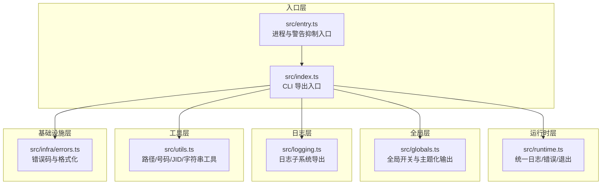
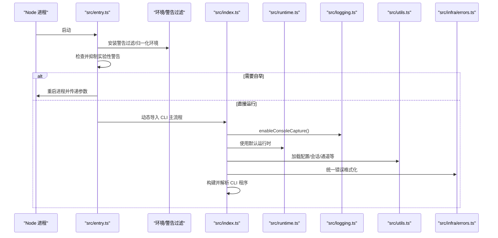
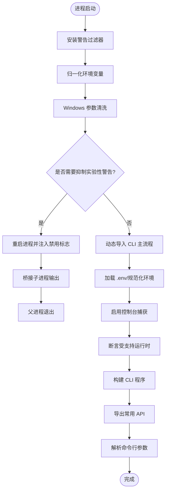
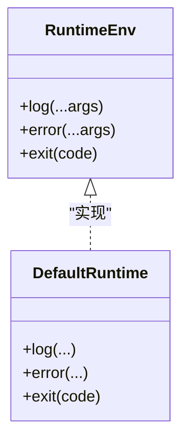
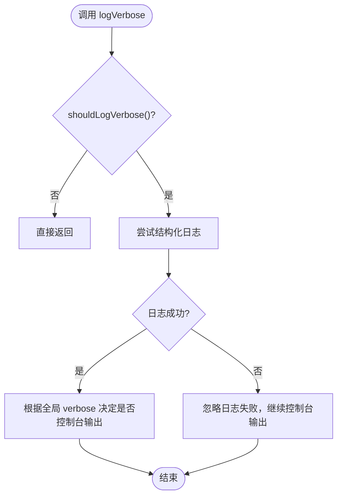
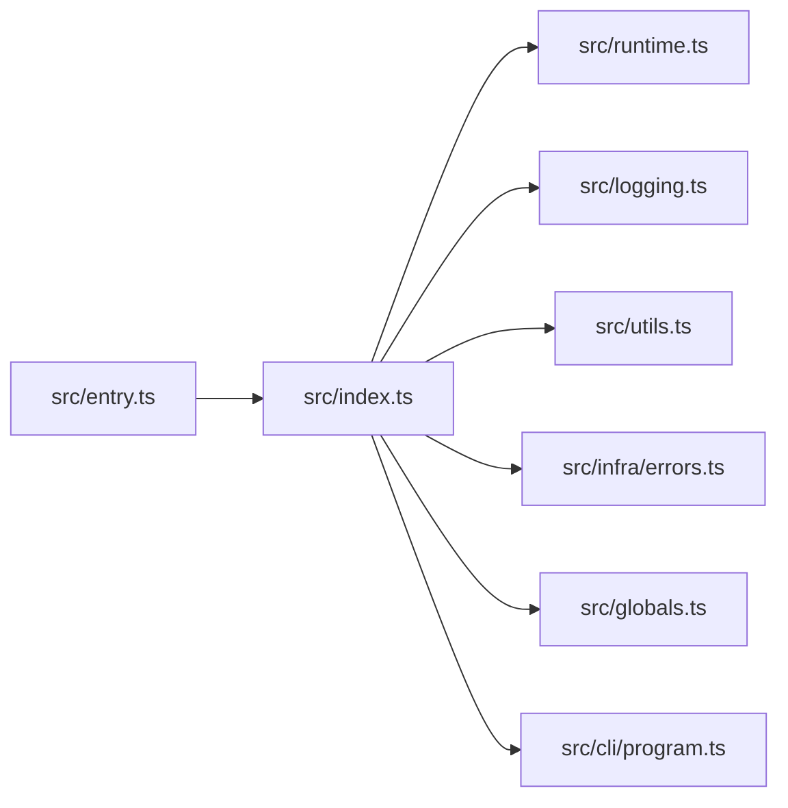

# 核心模块结构

<cite>
**本文引用的文件**
- [src/index.ts](file://src/index.ts)
- [src/entry.ts](file://src/entry.ts)
- [src/runtime.ts](file://src/runtime.ts)
- [src/globals.ts](file://src/globals.ts)
- [src/logging.ts](file://src/logging.ts)
- [src/utils.ts](file://src/utils.ts)
- [src/cli/program.ts](file://src/cli/program.ts)
- [src/infra/errors.ts](file://src/infra/errors.ts)
</cite>

## 目录

1. [简介](#简介)
2. [项目结构](#项目结构)
3. [核心组件](#核心组件)
4. [架构总览](#架构总览)
5. [详细组件分析](#详细组件分析)
6. [依赖分析](#依赖分析)
7. [性能考虑](#性能考虑)
8. [故障排查指南](#故障排查指南)
9. [结论](#结论)
10. [附录](#附录)

## 简介

本文件面向 OpenClaw 的核心模块，系统性梳理 src/ 目录下的关键入口与运行时基础设施，重点覆盖以下方面：

- 入口点与启动流程：src/index.ts（CLI 导出入口）、src/entry.ts（进程与警告抑制入口）
- 运行时环境抽象：src/runtime.ts（统一日志/错误/退出行为）
- 全局状态与日志开关：src/globals.ts（全局 verbose/yes 控制与主题化输出）
- 日志与可观测性：src/logging.ts（日志子系统导出）
- 工具与通用能力：src/utils.ts（路径解析、号码标准化、JID 转换等）
- 基础设施与错误格式化：src/infra/errors.ts（错误码提取与统一格式化）

目标是帮助开发者快速理解模块职责、依赖关系、初始化顺序与生命周期管理，并提供可复用的开发模式、调试技巧与性能优化建议。

## 项目结构

OpenClaw 的核心模块以“入口—运行时—全局—日志—工具—基础设施”为主线组织，形成清晰的分层与职责边界：

- 入口层：负责进程启动、参数归一化、实验性警告抑制、动态导入 CLI 主流程
- 运行时层：封装统一的日志、错误与退出行为，保证终端交互一致性
- 全局层：提供全局开关与主题化输出，支持细粒度的 verbose 输出控制
- 日志层：集中导出日志子系统 API，屏蔽底层实现细节
- 工具层：提供路径解析、号码标准化、JID 转换、字符串截断等通用能力
- 基础设施层：提供错误类型判断、错误信息格式化等基础能力

图表来源

- [src/entry.ts](file://src/entry.ts#L1-L172)
- [src/index.ts](file://src/index.ts#L1-L94)
- [src/runtime.ts](file://src/runtime.ts#L1-L25)
- [src/globals.ts](file://src/globals.ts#L1-L53)
- [src/logging.ts](file://src/logging.ts#L1-L68)
- [src/utils.ts](file://src/utils.ts#L1-L402)
- [src/infra/errors.ts](file://src/infra/errors.ts#L1-L55)

章节来源

- [src/entry.ts](file://src/entry.ts#L1-L172)
- [src/index.ts](file://src/index.ts#L1-L94)

## 核心组件

- 入口与启动流程
  - src/entry.ts：负责安装进程警告过滤器、归一化环境变量、处理 Windows 参数、确保实验性警告被抑制；在不满足条件时进行自举并动态导入 CLI 主流程
  - src/index.ts：加载 .env、规范化环境、确保 CLI 在 PATH 中、捕获控制台输出、断言运行时版本、构建 CLI 程序并导出常用 API；作为主入口模块，集中导出大量工具函数供上层使用
- 运行时环境
  - src/runtime.ts：定义 RuntimeEnv 接口与 defaultRuntime 实现，统一日志输出、错误输出与进程退出行为，确保进度线清理与终端状态恢复
- 全局状态与日志开关
  - src/globals.ts：提供全局 verbose/yes 开关、verbose 日志打印策略、主题化输出（success/warn/info/danger），并在日志失败时避免影响 verbose 打印
- 日志子系统
  - src/logging.ts：集中导出日志相关 API（获取/重置 Logger、子系统日志、控制台路由、级别转换等），屏蔽底层实现细节
- 工具与通用能力
  - src/utils.ts：提供路径解析（含 HOME 展开）、配置目录解析、字符串安全截断、号码标准化（E.164）、JID 转换、LID 映射查询、终端链接格式化等
- 错误处理与格式化
  - src/infra/errors.ts：提供错误码提取、errno 类型守卫、错误消息格式化、未捕获错误统一格式化等

章节来源

- [src/entry.ts](file://src/entry.ts#L1-L172)
- [src/index.ts](file://src/index.ts#L1-L94)
- [src/runtime.ts](file://src/runtime.ts#L1-L25)
- [src/globals.ts](file://src/globals.ts#L1-L53)
- [src/logging.ts](file://src/logging.ts#L1-L68)
- [src/utils.ts](file://src/utils.ts#L1-L402)
- [src/infra/errors.ts](file://src/infra/errors.ts#L1-L55)

## 架构总览

下图展示从进程启动到 CLI 解析的关键调用序列，体现模块间的依赖与控制流：

图表来源

- [src/entry.ts](file://src/entry.ts#L1-L172)
- [src/index.ts](file://src/index.ts#L1-L94)
- [src/runtime.ts](file://src/runtime.ts#L1-L25)
- [src/logging.ts](file://src/logging.ts#L1-L68)
- [src/utils.ts](file://src/utils.ts#L1-L402)
- [src/infra/errors.ts](file://src/infra/errors.ts#L1-L55)

## 详细组件分析

### 入口与启动流程（src/entry.ts 与 src/index.ts）

- src/entry.ts 的职责
  - 安装进程警告过滤器，减少噪音
  - 归一化环境变量与 NO_COLOR/FORCE_COLOR
  - Windows 参数清洗，避免多余 execPath 参数
  - 实验性警告抑制：通过重新启动进程注入 --disable-warning=ExperimentalWarning
  - 自举后动态导入 CLI 主流程，桥接子进程输出
- src/index.ts 的职责
  - 加载 .env 并规范化环境
  - 确保 CLI 可执行文件在 PATH 中
  - 捕获控制台输出，统一进入结构化日志
  - 断言受支持的运行时版本
  - 构建 CLI 程序并导出常用 API（模板、会话、通道监控、命令执行、端口检查等）
  - 注册未处理拒绝与未捕获异常处理器，优雅退出

图表来源

- [src/entry.ts](file://src/entry.ts#L1-L172)
- [src/index.ts](file://src/index.ts#L1-L94)

章节来源

- [src/entry.ts](file://src/entry.ts#L1-L172)
- [src/index.ts](file://src/index.ts#L1-L94)

### 运行时环境（src/runtime.ts）

- RuntimeEnv 抽象
  - 提供 log/error/exit 三类统一接口，便于替换与测试
- defaultRuntime 行为
  - 日志前清理活动进度线，避免进度与日志交错
  - 退出前恢复终端状态，保证用户体验一致
  - 通过抛出不可达错误满足测试场景

图表来源

- [src/runtime.ts](file://src/runtime.ts#L1-L25)

章节来源

- [src/runtime.ts](file://src/runtime.ts#L1-L25)

### 全局状态与日志开关（src/globals.ts）

- 全局开关
  - setVerbose/isVerbose：控制 verbose 模式
  - setYes/isYes：控制非交互确认
- 日志策略
  - shouldLogVerbose：结合文件日志级别与全局开关决定是否输出
  - logVerbose/logVerboseConsole：在 verbose 模式下输出主题化日志
  - 主题化输出：success/warn/info/danger 用于不同语义的提示

图表来源

- [src/globals.ts](file://src/globals.ts#L1-L53)

章节来源

- [src/globals.ts](file://src/globals.ts#L1-L53)

### 日志子系统（src/logging.ts）

- 导出内容
  - 控制台设置与路由、子系统日志、级别转换、Logger 获取与重置、Pino 兼容接口等
- 设计要点
  - 将日志子系统 API 集中导出，隐藏具体实现，便于替换与扩展

章节来源

- [src/logging.ts](file://src/logging.ts#L1-L68)

### 工具与通用能力（src/utils.ts）

- 路径与配置
  - ensureDir/pathExists：目录与存在性检查
  - resolveUserPath/resolveConfigDir/CONFIG_DIR：用户路径展开与配置目录解析
  - expandHomePrefix/resolveEffectiveHomeDir/resolveRequiredHomeDir：HOME 相关解析
- 数值与字符串
  - clamp/clampNumber/clampInt：数值裁剪
  - escapeRegExp/safeParseJson：正则转义与安全 JSON 解析
  - isPlainObject/isRecord：对象类型守卫
  - sliceUtf16Safe/truncateUtf16Safe：UTF-16 安全截断
- 电话号码与 JID
  - assertWebChannel/normalizeE164/normalizePath：通道断言与 E.164 规范化
  - withWhatsAppPrefix/toWhatsappJid：前缀与 JID 转换
  - isSelfChatMode：自对话模式判断
  - jidToE164/resolveJidToE164：JID 到 E.164 的映射与 LID 支持
- 终端与显示
  - formatTerminalLink/displayPath/displayString：终端链接与路径美化

章节来源

- [src/utils.ts](file://src/utils.ts#L1-L402)

### 错误处理与格式化（src/infra/errors.ts）

- 能力概览
  - extractErrorCode：从任意错误中提取 code 字段（字符串或数字）
  - isErrno：NodeJS.ErrnoException 类型守卫
  - hasErrnoCode：检查特定 errno
  - formatErrorMessage/formatUncaughtError：统一错误消息与未捕获错误格式化
- 使用场景
  - 在 CLI 启动阶段对未捕获异常进行统一格式化输出，避免堆栈污染与误导

章节来源

- [src/infra/errors.ts](file://src/infra/errors.ts#L1-L55)

## 依赖分析

- 模块耦合与内聚
  - src/index.ts 作为导出入口，聚合大量工具与基础设施模块，承担高内聚的“门面”角色
  - src/entry.ts 专注于进程级初始化与自举，与 src/index.ts 协作完成启动流程
  - src/runtime.ts 低耦合地被各模块复用，提供统一的运行时行为
  - src/globals.ts 与 src/logging.ts 存在间接依赖（verbose 与结构化日志），但通过函数调用解耦
  - src/utils.ts 为纯工具模块，被多处使用，保持高内聚低耦合
- 外部依赖与集成点
  - Node.js 核心模块（process、fs、path、os、child_process）贯穿多个模块
  - CLI 程序由 src/cli/program.ts 导出的 buildProgram 构建，index.ts 在运行时动态导入

图表来源

- [src/entry.ts](file://src/entry.ts#L1-L172)
- [src/index.ts](file://src/index.ts#L1-L94)
- [src/runtime.ts](file://src/runtime.ts#L1-L25)
- [src/globals.ts](file://src/globals.ts#L1-L53)
- [src/logging.ts](file://src/logging.ts#L1-L68)
- [src/utils.ts](file://src/utils.ts#L1-L402)
- [src/infra/errors.ts](file://src/infra/errors.ts#L1-L55)
- [src/cli/program.ts](file://src/cli/program.ts#L1-L3)

章节来源

- [src/index.ts](file://src/index.ts#L1-L94)
- [src/cli/program.ts](file://src/cli/program.ts#L1-L3)

## 性能考虑

- 启动阶段
  - 优先进行环境归一化与实验性警告抑制，避免后续运行时抖动
  - 控制台捕获与日志初始化尽量轻量，避免阻塞 CLI 解析
- 日志与输出
  - verbose 输出在日志失败时仍可回退到控制台，减少性能损耗
  - 进度线清理与终端状态恢复在日志/错误输出前后执行，避免额外渲染成本
- 工具函数
  - 路径解析与字符串处理采用同步/异步分离策略，避免不必要的 IO
  - UTF-16 安全截断仅在必要时执行，降低大文本处理开销

## 故障排查指南

- 启动失败
  - 若出现未捕获异常，检查 src/infra/errors.ts 的 formatUncaughtError 输出，定位具体错误来源
  - 关注 src/index.ts 中的 installUnhandledRejectionHandler 与 process.on("uncaughtException") 注册
- 端口占用
  - 使用 src/index.ts 导出的 ensurePortAvailable/describePortOwner/handlePortError 进行诊断
- 环境问题
  - 确认 src/entry.ts 的警告抑制逻辑是否生效，必要时检查 NODE_OPTIONS 与 --no-warnings 设置
- 日志与 verbose
  - 通过 src/globals.ts 的 setVerbose/isVerbose 与 shouldLogVerbose 控制 verbose 输出
  - 若结构化日志异常，观察 logVerbose 是否回退到控制台输出

章节来源

- [src/index.ts](file://src/index.ts#L1-L94)
- [src/infra/errors.ts](file://src/infra/errors.ts#L1-L55)
- [src/globals.ts](file://src/globals.ts#L1-L53)

## 结论

OpenClaw 的核心模块以清晰的分层与职责划分，构建了稳定、可维护且易于扩展的运行时基础。入口层负责启动与自举，运行时层提供统一行为抽象，全局层与日志层支撑可观测性，工具层提供通用能力，基础设施层保障错误处理的一致性。遵循本文的模块组织原则与开发模式，可有效提升开发效率与系统稳定性。

## 附录

- 模块导入导出规范
  - 入口模块（如 src/index.ts）应集中导出常用 API，便于上层按需引入
  - 工具模块（如 src/utils.ts）保持纯函数与无副作用，避免跨模块耦合
  - 运行时与全局模块（如 src/runtime.ts、src/globals.ts）应尽量低耦合，通过接口抽象替代直接依赖
- 命名约定
  - 文件名采用小写与连字符风格（如 runtime.ts、globals.ts）
  - 类型与接口使用 PascalCase（如 RuntimeEnv），常量使用 UPPER_SNAKE_CASE（如 CONFIG_DIR）
- 代码组织原则
  - 高内聚：每个模块聚焦单一职责
  - 低耦合：通过接口与导出抽象依赖关系
  - 可测试：提供可替换的运行时与全局状态，便于单元测试
- 常见开发模式
  - 在启动阶段尽早注册错误处理器与日志捕获
  - 使用工具模块提供的路径与字符串处理函数，避免重复实现
  - 通过全局开关控制 verbose 输出，平衡调试信息与性能
- 调试技巧
  - 使用 formatUncaughtError 输出统一错误信息，结合日志级别定位问题
  - 在 Windows 环境下关注参数清洗逻辑，避免多余的 execPath 参数导致解析异常
- 性能优化建议
  - 减少启动阶段的同步 IO 操作，优先异步化
  - 对高频字符串处理采用 UTF-16 安全截断，避免字符损坏
  - 合理使用缓存与延迟初始化，降低冷启动成本
