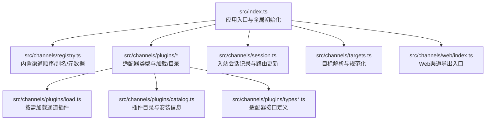
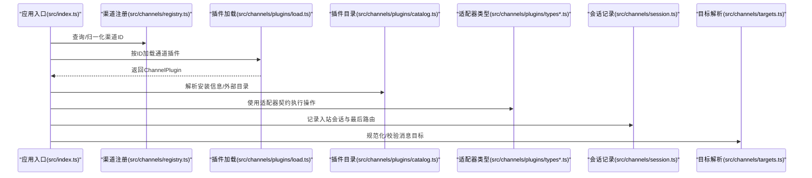
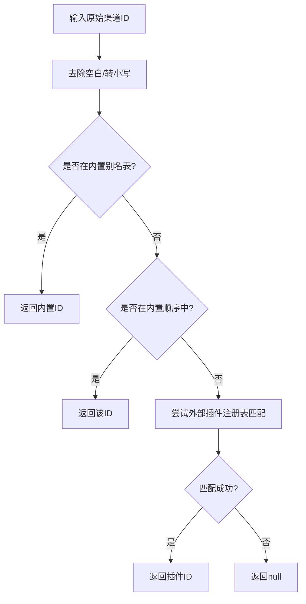
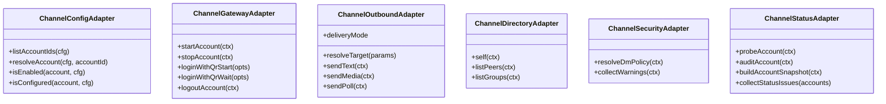
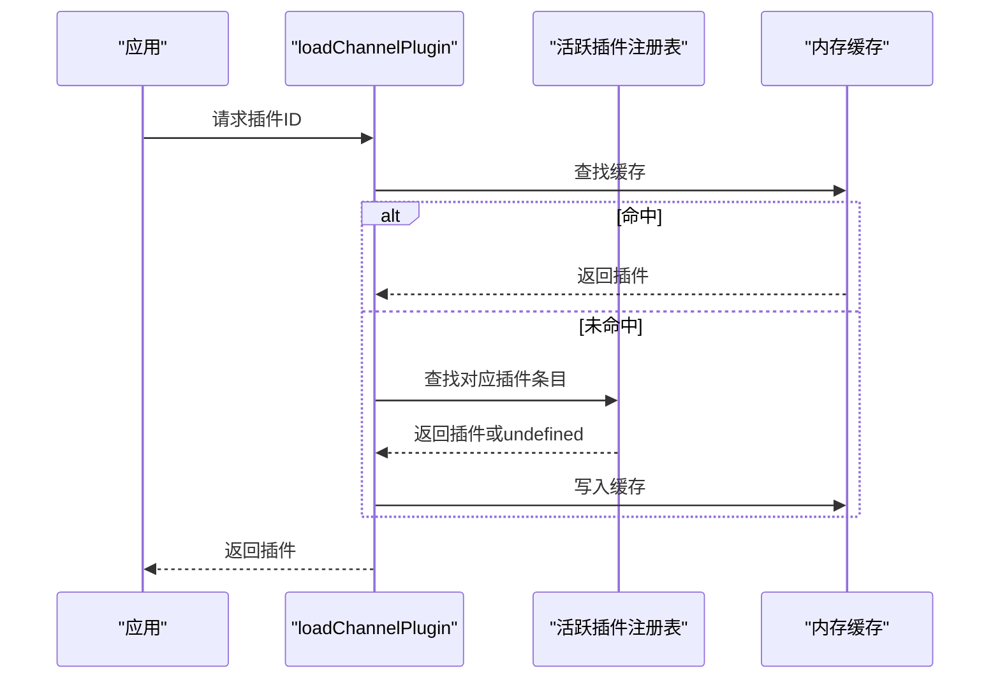
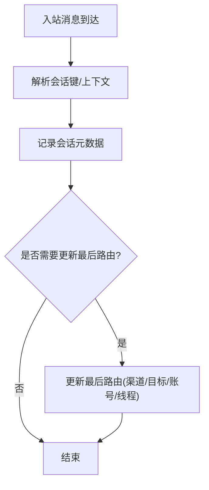
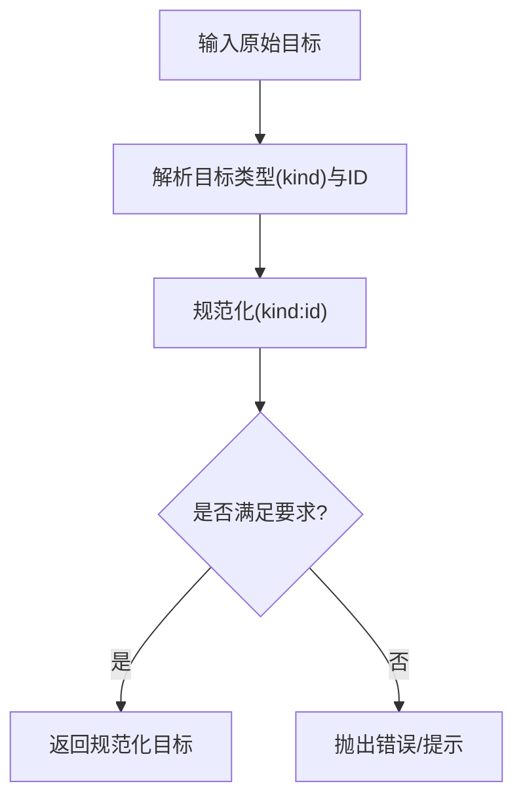
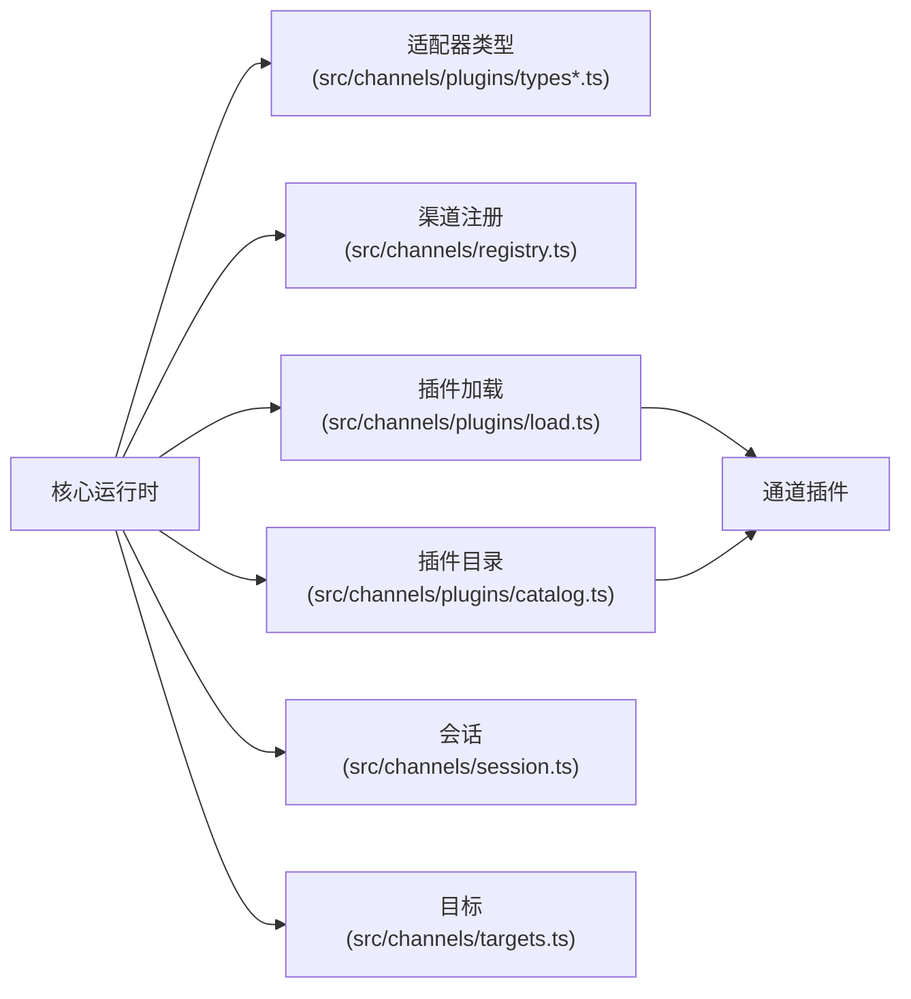

# 消息渠道集成模块

<cite>
**本文引用的文件**
- [src/index.ts](file://src/index.ts)
- [src/channels/registry.ts](file://src/channels/registry.ts)
- [src/channels/plugins/types.ts](file://src/channels/plugins/types.ts)
- [src/channels/plugins/types.adapters.ts](file://src/channels/plugins/types.adapters.ts)
- [src/channels/plugins/load.ts](file://src/channels/plugins/load.ts)
- [src/channels/plugins/catalog.ts](file://src/channels/plugins/catalog.ts)
- [src/channels/plugins/helpers.ts](file://src/channels/plugins/helpers.ts)
- [src/channels/session.ts](file://src/channels/session.ts)
- [src/channels/targets.ts](file://src/channels/targets.ts)
- [src/channels/web/index.ts](file://src/channels/web/index.ts)
</cite>

## 目录

1. [简介](#简介)
2. [项目结构](#项目结构)
3. [核心组件](#核心组件)
4. [架构总览](#架构总览)
5. [详细组件分析](#详细组件分析)
6. [依赖关系分析](#依赖关系分析)
7. [性能考量](#性能考量)
8. [故障排查指南](#故障排查指南)
9. [结论](#结论)
10. [附录：新渠道开发指南与最佳实践](#附录新渠道开发指南与最佳实践)

## 简介

本文件面向OpenClaw的消息渠道集成模块，系统化阐述渠道适配器架构、统一API抽象、消息路由机制与扩展开发方法。文档聚焦于：

- 渠道注册与元数据管理
- 适配器接口定义与职责边界
- 插件加载与目录发现
- 会话与目标解析
- 认证流程（含二维码登录）、消息格式转换与媒体处理
- 配置管理、连接状态监控与错误处理策略
- 新渠道接入指南与扩展开发最佳实践

## 项目结构

OpenClaw采用“核心运行时 + 通道插件生态”的分层设计。核心入口负责环境初始化与CLI解析；通道子系统通过插件机制对接多平台渠道，提供统一的适配器接口与会话/路由能力。

图示来源

- [src/index.ts](file://src/index.ts#L1-L94)
- [src/channels/registry.ts](file://src/channels/registry.ts#L1-L192)
- [src/channels/plugins/load.ts](file://src/channels/plugins/load.ts#L1-L30)
- [src/channels/plugins/catalog.ts](file://src/channels/plugins/catalog.ts#L1-L308)
- [src/channels/plugins/types.ts](file://src/channels/plugins/types.ts#L1-L64)
- [src/channels/session.ts](file://src/channels/session.ts#L1-L52)
- [src/channels/targets.ts](file://src/channels/targets.ts#L1-L60)
- [src/channels/web/index.ts](file://src/channels/web/index.ts#L1-L14)

章节来源

- [src/index.ts](file://src/index.ts#L1-L94)
- [src/channels/registry.ts](file://src/channels/registry.ts#L1-L192)

## 核心组件

- 渠道注册中心：维护内置渠道顺序、别名映射与渠道元数据，提供标准化查询与归一化能力。
- 适配器接口体系：定义配置、认证、网关、消息发送、目录、安全等适配器契约，确保跨渠道一致性。
- 插件加载与目录：按需加载已激活插件，支持外部目录与安装信息解析。
- 会话与路由：记录入站消息会话元数据，更新最后路由上下文，支撑多轮对话与回溯。
- 目标解析：对用户/群组目标进行规范化与校验，统一不同渠道的ID格式。

章节来源

- [src/channels/registry.ts](file://src/channels/registry.ts#L1-L192)
- [src/channels/plugins/types.adapters.ts](file://src/channels/plugins/types.adapters.ts#L1-L313)
- [src/channels/plugins/load.ts](file://src/channels/plugins/load.ts#L1-L30)
- [src/channels/plugins/catalog.ts](file://src/channels/plugins/catalog.ts#L1-L308)
- [src/channels/session.ts](file://src/channels/session.ts#L1-L52)
- [src/channels/targets.ts](file://src/channels/targets.ts#L1-L60)

## 架构总览

下图展示从应用入口到通道插件的调用链路与关键适配器交互：

图示来源

- [src/index.ts](file://src/index.ts#L1-L94)
- [src/channels/registry.ts](file://src/channels/registry.ts#L1-L192)
- [src/channels/plugins/load.ts](file://src/channels/plugins/load.ts#L1-L30)
- [src/channels/plugins/catalog.ts](file://src/channels/plugins/catalog.ts#L1-L308)
- [src/channels/plugins/types.ts](file://src/channels/plugins/types.ts#L1-L64)
- [src/channels/session.ts](file://src/channels/session.ts#L1-L52)
- [src/channels/targets.ts](file://src/channels/targets.ts#L1-L60)

## 详细组件分析

### 组件A：渠道注册与元数据管理

- 职责
  - 定义内置渠道顺序与默认渠道
  - 提供渠道别名映射与元数据（文档路径、图标、描述等）
  - 归一化渠道ID（含别名与外部插件ID匹配）
- 关键点
  - 内置渠道顺序决定UI优先级与默认选择
  - 别名映射提升用户输入容错性
  - 外部插件可通过元数据扩展渠道能力并参与排序

图示来源

- [src/channels/registry.ts](file://src/channels/registry.ts#L114-L174)

章节来源

- [src/channels/registry.ts](file://src/channels/registry.ts#L1-L192)

### 组件B：适配器接口体系（统一API抽象）

- 设计要点
  - 将不同渠道的差异封装在适配器中，对外暴露一致的契约
  - 适配器按职责划分：配置、认证、网关、消息发送、目录、安全、命令等
  - 支持直连/网关/混合投递模式，便于扩展与降级
- 典型适配器
  - 配置适配器：账户列表、启用状态、配置检查、允许来源解析
  - 网关适配器：启动/停止账户、二维码登录、登出
  - 发送适配器：文本/媒体/投票发送、目标解析、分片策略
  - 目录适配器：自身份辨、联系人/群组查询
  - 安全适配器：私聊策略、告警收集
  - 状态适配器：探测/审计/快照构建、状态问题汇总

图示来源

- [src/channels/plugins/types.adapters.ts](file://src/channels/plugins/types.adapters.ts#L22-L313)

章节来源

- [src/channels/plugins/types.adapters.ts](file://src/channels/plugins/types.adapters.ts#L1-L313)
- [src/channels/plugins/types.ts](file://src/channels/plugins/types.ts#L1-L64)

### 组件C：插件加载与目录发现

- 加载策略
  - 基于活跃插件注册表按ID查找并缓存插件实例
  - 首次加载后复用缓存，避免重复开销
- 目录与安装
  - 支持工作区/全局/配置目录下的外部目录文件
  - 解析NPM规范与本地路径，生成安装信息
  - 合并来源优先级，去重并排序

图示来源

- [src/channels/plugins/load.ts](file://src/channels/plugins/load.ts#L1-L30)

章节来源

- [src/channels/plugins/load.ts](file://src/channels/plugins/load.ts#L1-L30)
- [src/channels/plugins/catalog.ts](file://src/channels/plugins/catalog.ts#L1-L308)

### 组件D：会话与消息路由

- 功能
  - 记录入站消息的会话元数据（如来源、时间、上下文）
  - 更新最后路由上下文（渠道、目标、账号、线程），用于后续回溯与应答
- 错误处理
  - 记录异常通过回调传递，避免阻断主流程

图示来源

- [src/channels/session.ts](file://src/channels/session.ts#L17-L51)

章节来源

- [src/channels/session.ts](file://src/channels/session.ts#L1-L52)

### 组件E：目标解析与规范化

- 能力
  - 将用户/群组目标规范化为统一格式
  - 校验目标ID合法性，必要时抛出错误
  - 提供默认目标类型与歧义提示
- 用途
  - 在发送前统一不同渠道的目标表达，降低上层复杂度

图示来源

- [src/channels/targets.ts](file://src/channels/targets.ts#L22-L60)

章节来源

- [src/channels/targets.ts](file://src/channels/targets.ts#L1-L60)

### 组件F：Web渠道导出入口

- 作用
  - 对外暴露Web渠道相关能力（如WhatsApp Web），便于在不同运行环境中使用
- 价值
  - 保持核心适配器与平台无关，仅通过导出层暴露平台细节

章节来源

- [src/channels/web/index.ts](file://src/channels/web/index.ts#L1-L14)

## 依赖关系分析

- 松耦合
  - 核心通过适配器契约与具体渠道解耦
  - 渠道插件通过注册表与目录发现机制动态接入
- 可观测性
  - 状态适配器提供探测/审计/快照能力，便于健康检查与问题定位
- 可扩展性
  - 新渠道只需实现所需适配器，并在插件清单中声明元数据

图示来源

- [src/channels/plugins/types.ts](file://src/channels/plugins/types.ts#L1-L64)
- [src/channels/registry.ts](file://src/channels/registry.ts#L1-L192)
- [src/channels/plugins/load.ts](file://src/channels/plugins/load.ts#L1-L30)
- [src/channels/plugins/catalog.ts](file://src/channels/plugins/catalog.ts#L1-L308)
- [src/channels/session.ts](file://src/channels/session.ts#L1-L52)
- [src/channels/targets.ts](file://src/channels/targets.ts#L1-L60)

章节来源

- [src/channels/plugins/types.ts](file://src/channels/plugins/types.ts#L1-L64)
- [src/channels/plugins/types.adapters.ts](file://src/channels/plugins/types.adapters.ts#L1-L313)
- [src/channels/registry.ts](file://src/channels/registry.ts#L1-L192)
- [src/channels/plugins/load.ts](file://src/channels/plugins/load.ts#L1-L30)
- [src/channels/plugins/catalog.ts](file://src/channels/plugins/catalog.ts#L1-L308)
- [src/channels/session.ts](file://src/channels/session.ts#L1-L52)
- [src/channels/targets.ts](file://src/channels/targets.ts#L1-L60)

## 性能考量

- 插件缓存
  - 通过内存缓存减少重复加载开销，建议在长生命周期进程中保持缓存有效
- 分片与限流
  - 发送适配器支持文本/Markdown分片与分片限制，结合渠道速率限制策略使用
- 探测与审计
  - 状态适配器的探测/审计可作为健康检查前置，避免无效请求
- 目标解析
  - 在批量发送前集中解析目标，减少重复计算

## 故障排查指南

- 渠道ID无法识别
  - 检查是否使用了内置别名或外部插件ID；确认注册表中的别名映射与顺序
- 插件未加载
  - 确认插件已在活跃注册表中；检查缓存是否被重建
- 发送失败
  - 查看发送适配器的错误码与响应；核对目标解析结果与分片策略
- 连接问题
  - 使用网关适配器的二维码登录流程；若超时，适当延长等待时间
- 会话记录异常
  - 确认会话存储路径与权限；关注回调中的错误信息

章节来源

- [src/channels/registry.ts](file://src/channels/registry.ts#L114-L174)
- [src/channels/plugins/load.ts](file://src/channels/plugins/load.ts#L1-L30)
- [src/channels/plugins/types.adapters.ts](file://src/channels/plugins/types.adapters.ts#L89-L106)
- [src/channels/session.ts](file://src/channels/session.ts#L17-L51)

## 结论

OpenClaw的消息渠道集成模块通过“注册中心 + 适配器契约 + 插件生态 + 会话路由”的架构，实现了跨渠道的一致体验与高扩展性。借助清晰的接口边界与目录发现机制，开发者可以快速接入新渠道并在不破坏现有功能的前提下演进系统能力。

## 附录：新渠道开发指南与最佳实践

- 开发步骤
  - 在插件清单中声明渠道ID与元数据（标签、文档路径、图标、别名等）
  - 实现必要的适配器（至少包含配置、网关、发送、目录）
  - 在注册表中登记渠道ID与别名，确保顺序与UI展示符合预期
  - 编写安装信息（NPM规范或本地路径），支持外部目录发现
- 最佳实践
  - 适配器最小可用原则：先实现最简路径，再逐步完善
  - 明确错误语义：为每类错误提供明确的错误码与提示
  - 分片与限流：根据渠道API限制设置合理的分片与节流策略
  - 安全与合规：实现安全适配器，支持私聊策略与告警收集
  - 可观测性：完善状态适配器，提供探测/审计/快照能力
  - 测试与文档：补充单元测试与渠道文档链接，便于用户理解与排障

章节来源

- [src/channels/plugins/catalog.ts](file://src/channels/plugins/catalog.ts#L171-L221)
- [src/channels/registry.ts](file://src/channels/registry.ts#L28-L120)
- [src/channels/plugins/types.adapters.ts](file://src/channels/plugins/types.adapters.ts#L22-L313)
- [src/channels/plugins/helpers.ts](file://src/channels/plugins/helpers.ts#L6-L20)
