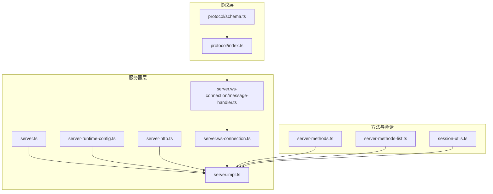
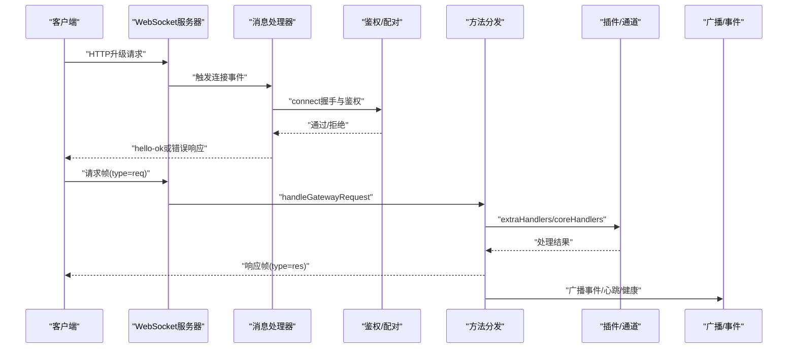
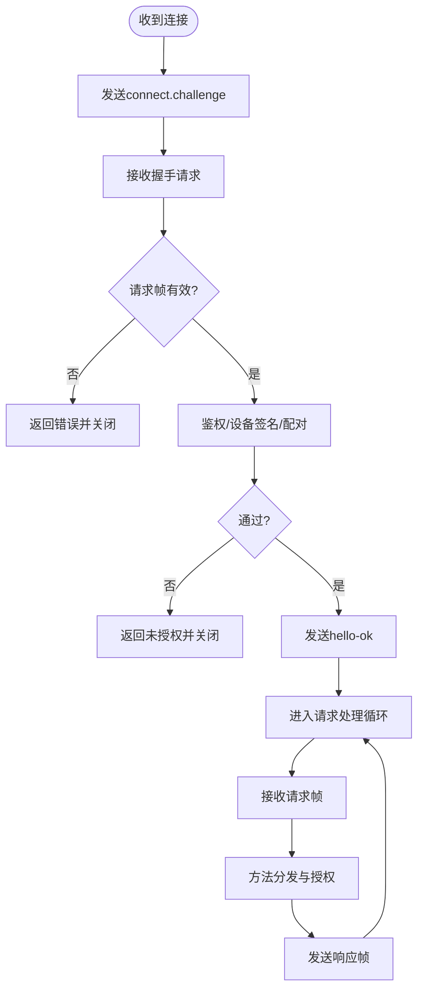
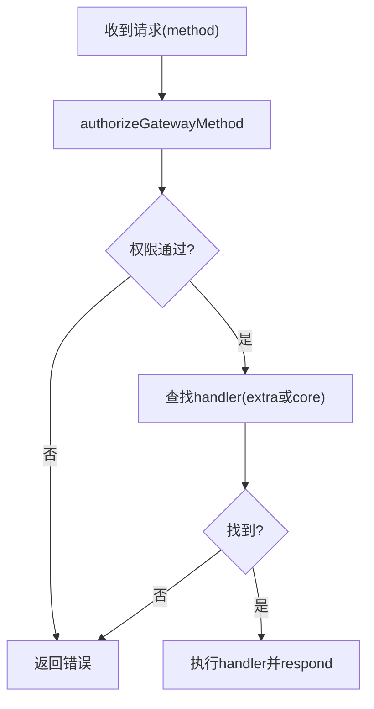
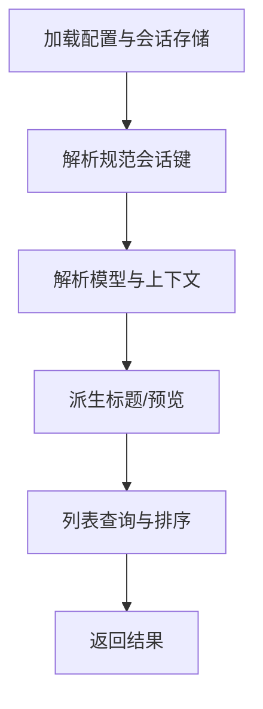
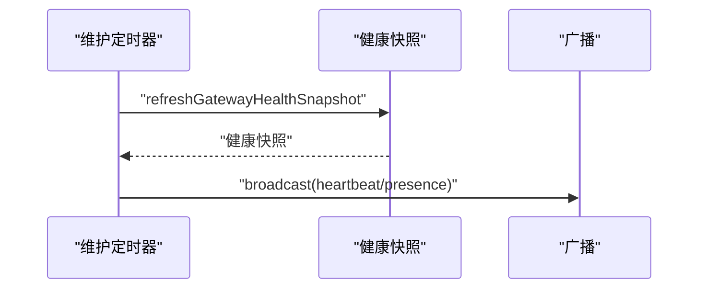
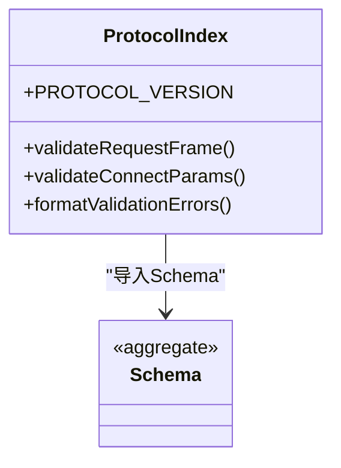
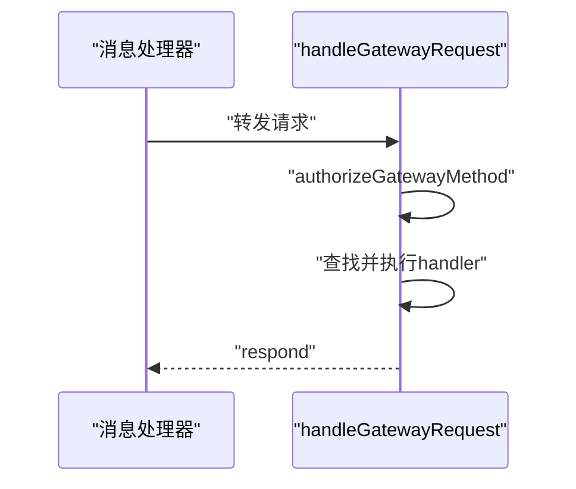
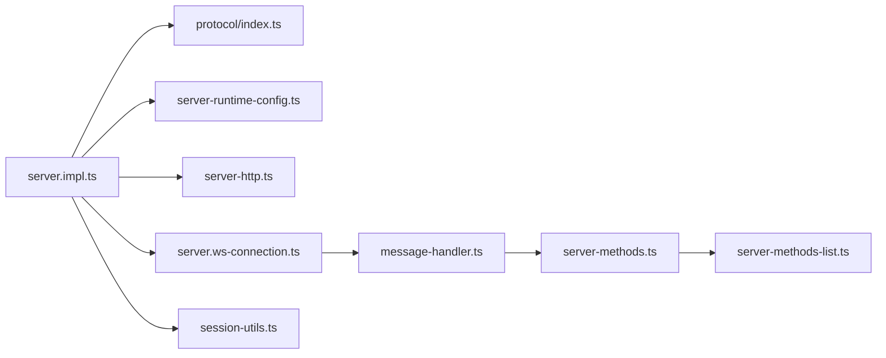

# 网关服务模块

<cite>
**本文档引用的文件**
- [src/gateway/server.impl.ts](file://src/gateway/server.impl.ts)
- [src/gateway/server.ts](file://src/gateway/server.ts)
- [src/gateway/protocol/index.ts](file://src/gateway/protocol/index.ts)
- [src/gateway/protocol/schema.ts](file://src/gateway/protocol/schema.ts)
- [src/gateway/server/ws-connection.ts](file://src/gateway/server/ws-connection.ts)
- [src/gateway/server/ws-connection/message-handler.ts](file://src/gateway/server/ws-connection/message-handler.ts)
- [src/gateway/server-methods.ts](file://src/gateway/server-methods.ts)
- [src/gateway/server-methods-list.ts](file://src/gateway/server-methods-list.ts)
- [src/gateway/server-runtime-config.ts](file://src/gateway/server-runtime-config.ts)
- [src/gateway/server-http.ts](file://src/gateway/server-http.ts)
- [src/gateway/session-utils.ts](file://src/gateway/session-utils.ts)
</cite>

## 目录

1. [简介](#简介)
2. [项目结构](#项目结构)
3. [核心组件](#核心组件)
4. [架构总览](#架构总览)
5. [详细组件分析](#详细组件分析)
6. [依赖关系分析](#依赖关系分析)
7. [性能考量](#性能考量)
8. [故障排查指南](#故障排查指南)
9. [结论](#结论)
10. [附录](#附录)

## 简介

本文件面向OpenClaw网关服务模块，系统化阐述其核心架构与实现细节，覆盖以下主题：

- WebSocket连接管理：握手、鉴权、设备配对、保活与关闭流程
- 消息路由机制：方法授权、请求分发、事件广播
- 会话生命周期管理：会话存储、模型选择、标题派生与预览
- 事件处理系统：心跳、健康状态、节点订阅与广播
- 协议定义与版本兼容：帧格式、参数校验、协议协商
- 配置与运行时：绑定策略、认证模式、TLS与Tailscale暴露
- 性能监控与故障恢复：维护定时器、重载与重启、诊断心跳
- 扩展开发指南：插件注册、自定义方法与中间件集成

## 项目结构

网关服务模块位于src/gateway目录，采用按功能域划分的组织方式：

- protocol：协议定义与参数校验（基于JSON Schema）
- server：服务器启动、运行时配置、HTTP与WebSocket集成
- server-methods：核心RPC方法实现与授权
- server-methods-list：方法清单与事件清单
- session-utils：会话存储、模型与标题派生等工具

**图表来源**

- [src/gateway/server.impl.ts](file://src/gateway/server.impl.ts#L1-L667)
- [src/gateway/server.ts](file://src/gateway/server.ts#L1-L4)
- [src/gateway/protocol/index.ts](file://src/gateway/protocol/index.ts#L1-L603)
- [src/gateway/protocol/schema.ts](file://src/gateway/protocol/schema.ts#L1-L17)
- [src/gateway/server-runtime-config.ts](file://src/gateway/server-runtime-config.ts#L1-L121)
- [src/gateway/server-http.ts](file://src/gateway/server-http.ts#L1-L556)
- [src/gateway/server/ws-connection.ts](file://src/gateway/server/ws-connection.ts#L1-L267)
- [src/gateway/server/ws-connection/message-handler.ts](file://src/gateway/server/ws-connection/message-handler.ts#L1-L1004)
- [src/gateway/server-methods.ts](file://src/gateway/server-methods.ts#L1-L220)
- [src/gateway/server-methods-list.ts](file://src/gateway/server-methods-list.ts#L1-L118)
- [src/gateway/session-utils.ts](file://src/gateway/session-utils.ts#L1-L731)

**章节来源**

- [src/gateway/server.ts](file://src/gateway/server.ts#L1-L4)
- [src/gateway/server.impl.ts](file://src/gateway/server.impl.ts#L1-L667)

## 核心组件

- 启动与运行时
  - startGatewayServer：主入口，负责配置加载、插件与通道初始化、运行时状态构建、服务绑定与事件广播
  - resolveGatewayRuntimeConfig：解析绑定地址、认证模式、控制面板与HTTP端点开关、Tailscale模式
- 协议与参数校验
  - protocol/index.ts：导出所有协议帧与参数Schema，并生成AJV校验器
  - protocol/schema.ts：聚合各子模块Schema
- WebSocket连接与消息处理
  - ws-connection.ts：连接事件接入、握手超时、关闭清理、广播与健康状态更新
  - message-handler.ts：握手阶段鉴权与设备签名验证、配对流程、角色与作用域授权、请求分发
- 方法与授权
  - server-methods.ts：核心方法集合与权限矩阵，按角色与作用域进行授权判定
  - server-methods-list.ts：方法与事件清单，包含通道插件注入的方法
- HTTP集成
  - server-http.ts：HTTP服务器、升级处理、OpenAI/OpenResponses适配、Canvas与控制面板路由
- 会话管理
  - session-utils.ts：会话存储、模型选择、标题派生、预览与列表查询

**章节来源**

- [src/gateway/server.impl.ts](file://src/gateway/server.impl.ts#L157-L667)
- [src/gateway/server-runtime-config.ts](file://src/gateway/server-runtime-config.ts#L32-L121)
- [src/gateway/protocol/index.ts](file://src/gateway/protocol/index.ts#L1-L603)
- [src/gateway/protocol/schema.ts](file://src/gateway/protocol/schema.ts#L1-L17)
- [src/gateway/server/ws-connection.ts](file://src/gateway/server/ws-connection.ts#L19-L267)
- [src/gateway/server/ws-connection/message-handler.ts](file://src/gateway/server/ws-connection/message-handler.ts#L133-L1004)
- [src/gateway/server-methods.ts](file://src/gateway/server-methods.ts#L1-L220)
- [src/gateway/server-methods-list.ts](file://src/gateway/server-methods-list.ts#L1-L118)
- [src/gateway/server-http.ts](file://src/gateway/server-http.ts#L363-L556)
- [src/gateway/session-utils.ts](file://src/gateway/session-utils.ts#L1-L731)

## 架构总览

下图展示从客户端到服务器的端到端交互路径，包括握手、鉴权、方法调用与事件广播。

**图表来源**

- [src/gateway/server/ws-connection.ts](file://src/gateway/server/ws-connection.ts#L61-L267)
- [src/gateway/server/ws-connection/message-handler.ts](file://src/gateway/server/ws-connection/message-handler.ts#L234-L1004)
- [src/gateway/server-methods.ts](file://src/gateway/server-methods.ts#L193-L220)
- [src/gateway/server-http.ts](file://src/gateway/server-http.ts#L398-L515)

## 详细组件分析

### WebSocket连接管理

- 连接接入与握手
  - 在“connection”事件中初始化客户端上下文、握手超时计时器、发送connect.challenge挑战帧
  - 握手阶段严格校验请求帧类型与方法名，不满足则立即关闭并返回错误
- 设备身份与鉴权
  - 支持设备公钥签名验证、时间戳偏差检查、nonce匹配与版本协商
  - 控制台与WebChat在特定条件下允许宽松鉴权策略
- 角色与作用域
  - 节点角色仅允许特定方法；操作员角色按作用域细分读写权限
- 关闭与清理
  - 记录关闭原因、时长与最后帧元数据；清理节点注册与订阅；更新系统存在状态并广播

**图表来源**

- [src/gateway/server/ws-connection.ts](file://src/gateway/server/ws-connection.ts#L61-L216)
- [src/gateway/server/ws-connection/message-handler.ts](file://src/gateway/server/ws-connection/message-handler.ts#L234-L994)

**章节来源**

- [src/gateway/server/ws-connection.ts](file://src/gateway/server/ws-connection.ts#L19-L267)
- [src/gateway/server/ws-connection/message-handler.ts](file://src/gateway/server/ws-connection/message-handler.ts#L133-L1004)

### 消息路由机制与授权

- 授权矩阵
  - 基于角色（node/operator）与作用域（admin/read/write/approvals/pairing）进行细粒度授权
  - 特定方法前缀与方法集有明确的权限要求
- 请求分发
  - 先尝试extraHandlers（插件/通道），再回退到coreHandlers
  - 未知方法返回INVALID_REQUEST错误
- 方法清单
  - 包含基础方法与通道插件注入的方法，统一对外暴露

**图表来源**

- [src/gateway/server-methods.ts](file://src/gateway/server-methods.ts#L93-L163)
- [src/gateway/server-methods.ts](file://src/gateway/server-methods.ts#L193-L220)
- [src/gateway/server-methods-list.ts](file://src/gateway/server-methods-list.ts#L93-L118)

**章节来源**

- [src/gateway/server-methods.ts](file://src/gateway/server-methods.ts#L1-L220)
- [src/gateway/server-methods-list.ts](file://src/gateway/server-methods-list.ts#L1-L118)

### 会话生命周期管理

- 存储与键解析
  - 支持全局、未知、代理主会话与按代理区分的会话键
  - 自动规范化会话键、合并多代理存储条目
- 模型与上下文
  - 解析默认模型与上下文tokens，支持会话级覆盖
- 标题派生与预览
  - 从首条用户消息或会话标识派生标题，支持最后一条消息预览
- 列表查询
  - 支持按标签、代理、活跃分钟数、搜索关键字与限制数量过滤

**图表来源**

- [src/gateway/session-utils.ts](file://src/gateway/session-utils.ts#L350-L525)
- [src/gateway/session-utils.ts](file://src/gateway/session-utils.ts#L549-L731)

**章节来源**

- [src/gateway/session-utils.ts](file://src/gateway/session-utils.ts#L1-L731)

### 事件处理系统

- 心跳与健康
  - 维护定时器周期刷新健康快照与版本，广播心跳事件
- 广播与存在状态
  - 客户端断开时更新系统存在状态并广播presence
- 节点订阅
  - 通过节点注册表与订阅管理器实现按会话事件推送

**图表来源**

- [src/gateway/server.impl.ts](file://src/gateway/server.impl.ts#L428-L444)

**章节来源**

- [src/gateway/server.impl.ts](file://src/gateway/server.impl.ts#L428-L444)

### 协议定义与版本兼容

- 帧与参数
  - RequestFrame/ResponseFrame/EventFrame/HelloOk等协议帧定义
  - 参数Schema通过AJV编译为校验器，统一格式化错误信息
- 协商与兼容
  - 客户端声明min/max协议版本，服务端与客户端版本必须兼容才允许握手
- 错误码与错误形状
  - 统一的错误形状与错误码，便于客户端识别与处理

**图表来源**

- [src/gateway/protocol/index.ts](file://src/gateway/protocol/index.ts#L227-L408)
- [src/gateway/protocol/schema.ts](file://src/gateway/protocol/schema.ts#L1-L17)

**章节来源**

- [src/gateway/protocol/index.ts](file://src/gateway/protocol/index.ts#L1-L603)
- [src/gateway/protocol/schema.ts](file://src/gateway/protocol/schema.ts#L1-L17)

### 客户端连接处理与服务器端方法实现

- 连接处理
  - 握手后进入请求处理循环，记录请求日志并调用handleGatewayRequest
- 服务器端方法
  - 以模块化方式实现各类方法（聊天、会话、节点、技能、配置等）
  - 通过coreGatewayHandlers统一挂载

**图表来源**

- [src/gateway/server/ws-connection/message-handler.ts](file://src/gateway/server/ws-connection/message-handler.ts#L982-L994)
- [src/gateway/server-methods.ts](file://src/gateway/server-methods.ts#L193-L220)

**章节来源**

- [src/gateway/server/ws-connection/message-handler.ts](file://src/gateway/server/ws-connection/message-handler.ts#L934-L1004)
- [src/gateway/server-methods.ts](file://src/gateway/server-methods.ts#L1-L220)

### 协议版本兼容性

- 协商流程
  - 客户端在connect中声明min/max协议版本，服务端检查是否与PROTOCOL_VERSION兼容
- 不兼容处理
  - 返回INVALID_REQUEST并以协议不匹配关闭连接

**章节来源**

- [src/gateway/server/ws-connection/message-handler.ts](file://src/gateway/server/ws-connection/message-handler.ts#L311-L337)
- [src/gateway/protocol/index.ts](file://src/gateway/protocol/index.ts#L153-L153)

### 网关配置选项

- 绑定与监听
  - 支持loopback/lan/tailnet/auto绑定模式，可覆盖主机地址
- 控制面板与HTTP端点
  - 控制面板启用/禁用、基础路径、根目录覆盖
  - OpenAI Chat Completions与OpenResponses端点开关与配置
- 认证与Tailscale
  - 认证模式（token/password）、共享密钥要求、Tailscale模式与暴露策略
- Canvas Host
  - Canvas宿主启用开关与环境变量控制

**章节来源**

- [src/gateway/server-runtime-config.ts](file://src/gateway/server-runtime-config.ts#L32-L121)
- [src/gateway/server.impl.ts](file://src/gateway/server.impl.ts#L248-L270)

### 性能监控指标与故障恢复

- 性能监控
  - 健康快照与版本、心跳事件、存在状态版本
  - 维护定时器清理过期资源（去重、聊天运行时、代理序列）
- 故障恢复
  - 热重载与重启：配置重载、插件热启、Tailscale暴露切换
  - 诊断心跳：可选的诊断事件心跳
  - 优雅关闭：清理节点定时器、订阅、广播、HTTP/WS服务器

**章节来源**

- [src/gateway/server.impl.ts](file://src/gateway/server.impl.ts#L428-L444)
- [src/gateway/server.impl.ts](file://src/gateway/server.impl.ts#L575-L612)
- [src/gateway/server.impl.ts](file://src/gateway/server.impl.ts#L614-L667)

### 扩展开发指南

- 注册自定义方法
  - 将新方法加入server-methods-list.ts的基础方法集，或通过通道插件注入
  - 在server-methods.ts中挂载对应处理器
- 中间件与钩子
  - 插件可通过extraHandlers扩展请求处理链
  - 全局钩子（gateway_start/gateway_stop）在启动/停止时触发
- HTTP适配
  - 通过server-http.ts的插件请求处理函数扩展HTTP端点

**章节来源**

- [src/gateway/server-methods-list.ts](file://src/gateway/server-methods-list.ts#L93-L96)
- [src/gateway/server-methods.ts](file://src/gateway/server-methods.ts#L165-L191)
- [src/gateway/server-http.ts](file://src/gateway/server-http.ts#L141-L361)
- [src/gateway/server.impl.ts](file://src/gateway/server.impl.ts#L565-L573)

## 依赖关系分析

- 组件耦合
  - server.impl.ts作为装配中心，依赖协议、运行时配置、HTTP/WS、方法与插件
  - 消息处理器依赖协议校验、鉴权、设备配对与系统存在状态
  - 方法分发依赖授权矩阵与上下文（节点注册、订阅、会话键解析）
- 外部依赖
  - ws库用于WebSocket通信
  - AJV用于参数Schema校验
  - Node TLS/HTTP用于HTTPS与HTTP升级

**图表来源**

- [src/gateway/server.impl.ts](file://src/gateway/server.impl.ts#L1-L100)
- [src/gateway/protocol/index.ts](file://src/gateway/protocol/index.ts#L1-L603)
- [src/gateway/server-runtime-config.ts](file://src/gateway/server-runtime-config.ts#L1-L121)
- [src/gateway/server-http.ts](file://src/gateway/server-http.ts#L1-L556)
- [src/gateway/server/ws-connection.ts](file://src/gateway/server/ws-connection.ts#L1-L267)
- [src/gateway/server/ws-connection/message-handler.ts](file://src/gateway/server/ws-connection/message-handler.ts#L1-L1004)
- [src/gateway/server-methods.ts](file://src/gateway/server-methods.ts#L1-L220)
- [src/gateway/server-methods-list.ts](file://src/gateway/server-methods-list.ts#L1-L118)
- [src/gateway/session-utils.ts](file://src/gateway/session-utils.ts#L1-L731)

**章节来源**

- [src/gateway/server.impl.ts](file://src/gateway/server.impl.ts#L1-L100)

## 性能考量

- 连接与消息处理
  - 握手超时与严格的帧校验降低无效连接占用
  - 最大负载与缓冲字节限制防止内存膨胀
- 广播与事件
  - dropIfSlow策略避免慢消费者拖垮系统
- 维护与清理
  - 定时清理聊天运行时、去重缓存与代理序列，降低长期运行内存压力

[本节为通用指导，无需具体文件引用]

## 故障排查指南

- 握手失败
  - 检查协议版本兼容、设备签名与nonce、代理头部与可信代理配置
- 未授权
  - 核对认证模式与共享密钥、设备配对状态、角色与作用域
- 连接被拒绝
  - 确认绑定模式与认证要求、Tailscale模式约束
- 会话异常
  - 检查会话键解析、存储路径与合并逻辑、模型覆盖与上下文tokens

**章节来源**

- [src/gateway/server/ws-connection/message-handler.ts](file://src/gateway/server/ws-connection/message-handler.ts#L311-L337)
- [src/gateway/server/ws-connection/message-handler.ts](file://src/gateway/server/ws-connection/message-handler.ts#L428-L461)
- [src/gateway/server-runtime-config.ts](file://src/gateway/server-runtime-config.ts#L89-L101)

## 结论

OpenClaw网关服务模块以清晰的分层设计实现了高可用的WebSocket与HTTP双栈服务。通过严格的协议校验、细粒度的授权矩阵、完善的会话与事件管理，以及灵活的插件扩展机制，为上层应用提供了稳定可靠的通信与控制能力。建议在生产环境中结合Tailscale与TLS增强安全性，并利用热重载与诊断心跳提升运维效率。

[本节为总结性内容，无需具体文件引用]

## 附录

- 关键配置项
  - 绑定模式、主机覆盖、控制面板启用与根目录、HTTP端点开关
  - 认证模式与共享密钥、Tailscale模式与暴露策略
- 常用方法
  - 健康状态、会话列表与预览、节点配对与调用、技能安装与更新、聊天发送与历史

[本节为概览性内容，无需具体文件引用]
