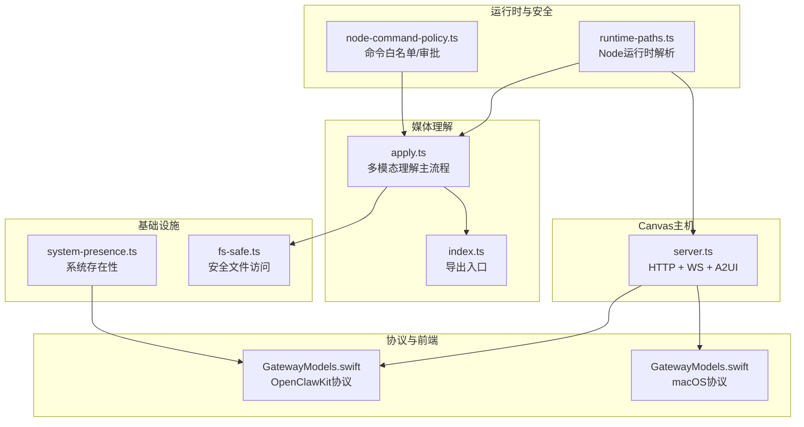
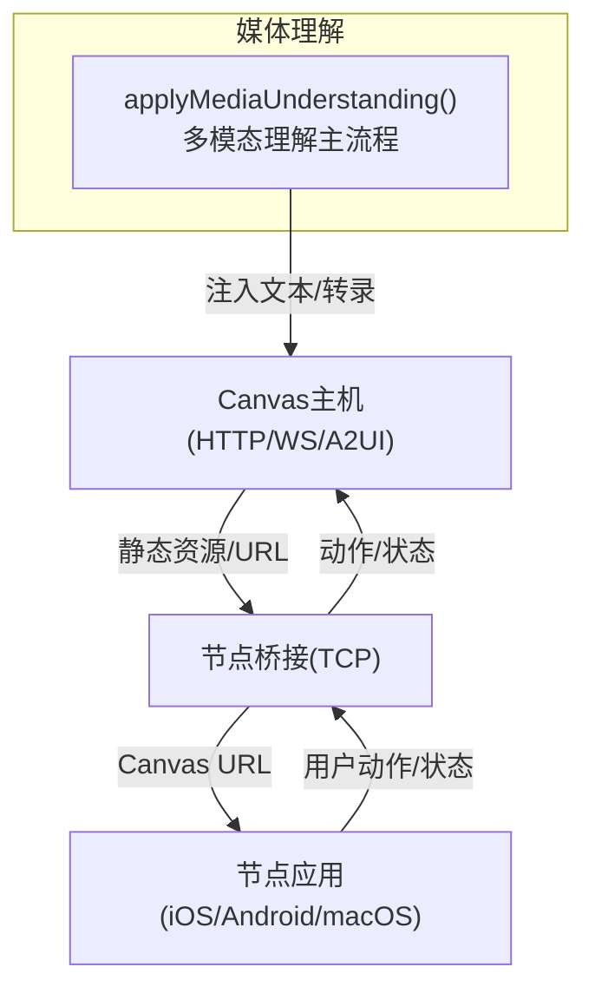
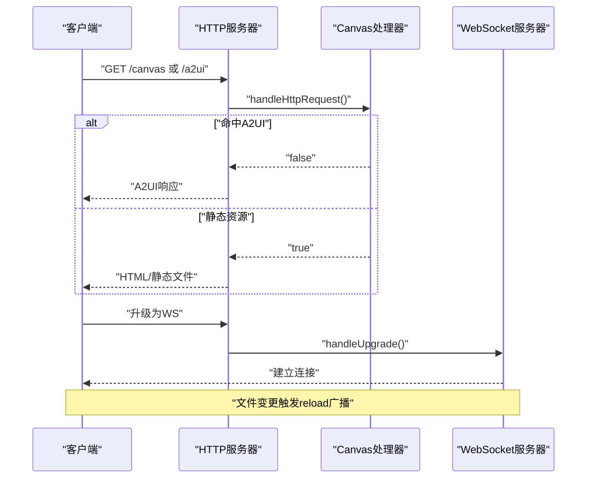
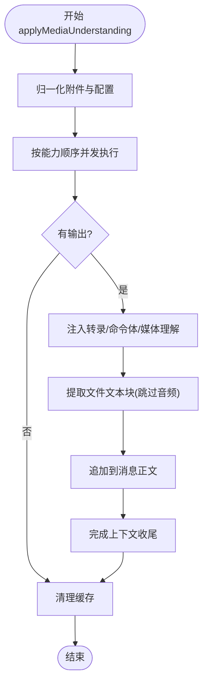
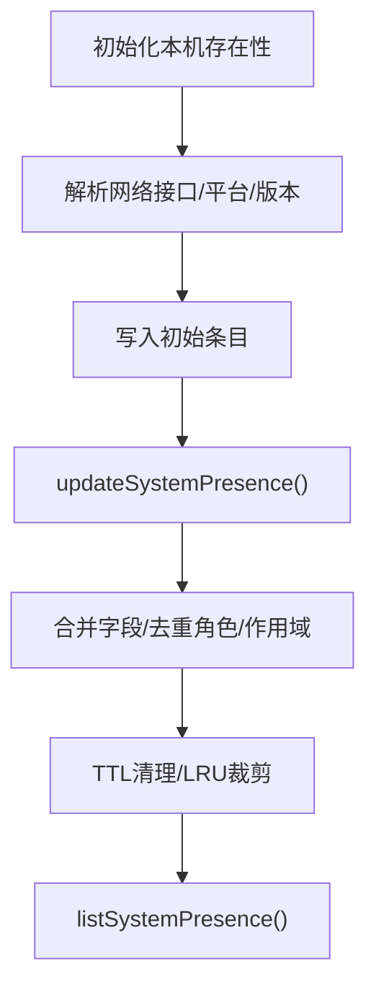
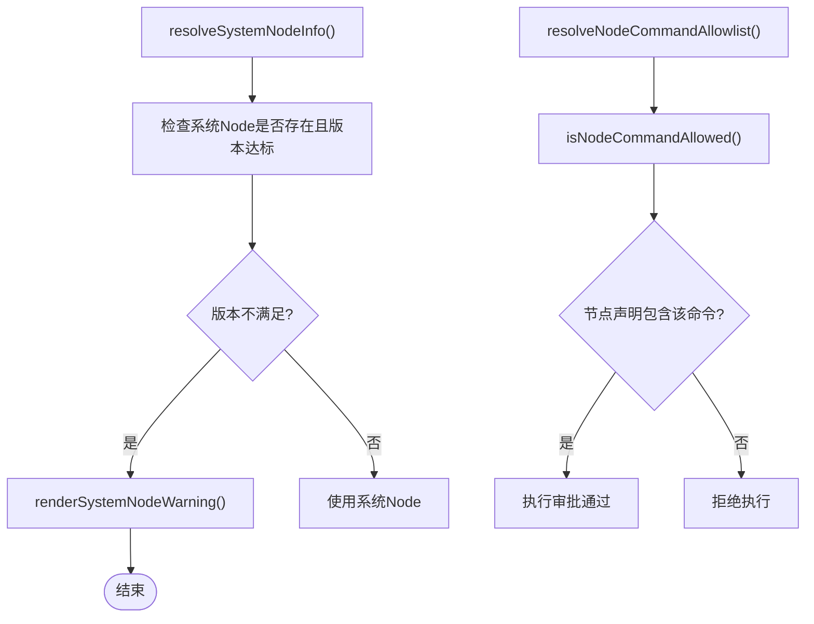
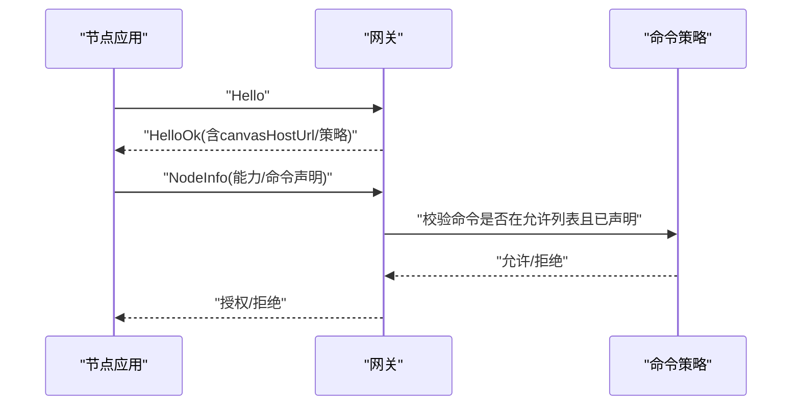
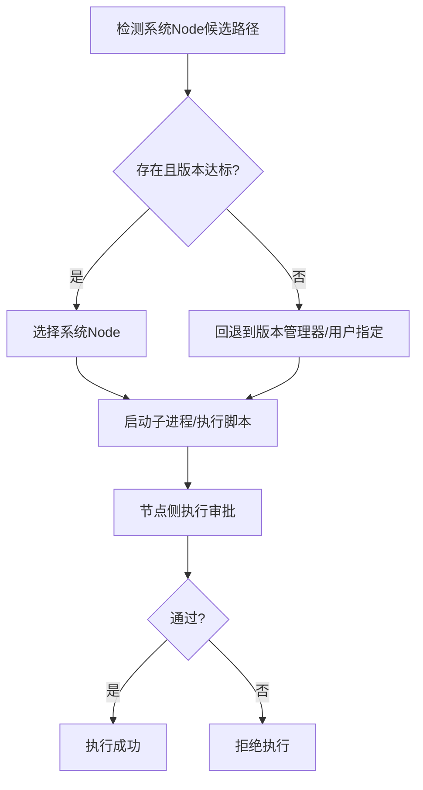
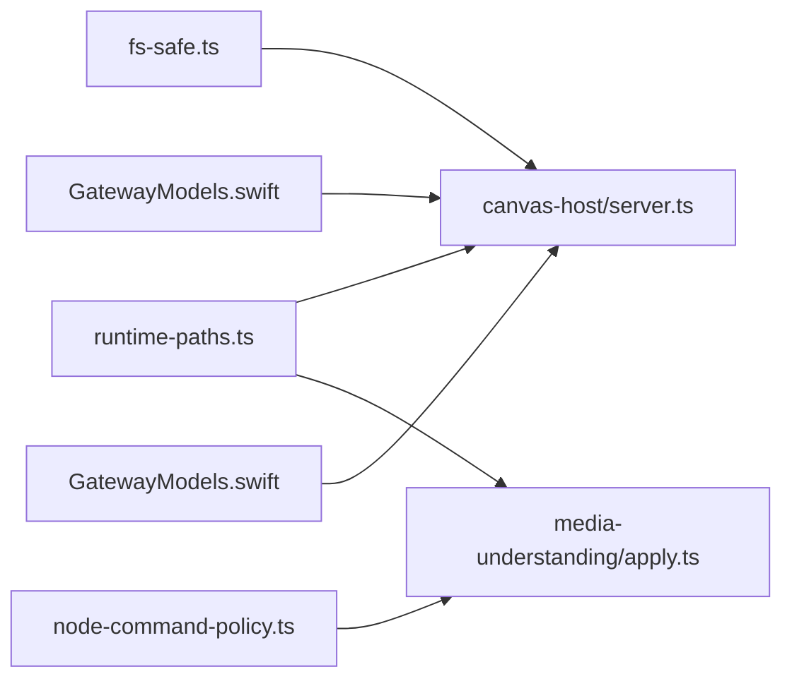

# 节点主机系统模块

<cite>
**本文档引用的文件**
- [src/canvas-host/server.ts](file://src/canvas-host/server.ts)
- [skills/canvas/SKILL.md](file://skills/canvas/SKILL.md)
- [src/daemon/runtime-paths.ts](file://src/daemon/runtime-paths.ts)
- [src/infra/system-presence.ts](file://src/infra/system-presence.ts)
- [src/infra/fs-safe.ts](file://src/infra/fs-safe.ts)
- [src/media-understanding/apply.ts](file://src/media-understanding/apply.ts)
- [src/media-understanding/index.ts](file://src/media-understanding/index.ts)
- [src/gateway/node-command-policy.ts](file://src/gateway/node-command-policy.ts)
- [apps/shared/OpenClawKit/Sources/OpenClawProtocol/GatewayModels.swift](file://apps/shared/OpenClawKit/Sources/OpenClawProtocol/GatewayModels.swift)
- [apps/macos/Sources/OpenClawProtocol/GatewayModels.swift](file://apps/macos/Sources/OpenClawProtocol/GatewayModels.swift)
- [src/agents/bash-tools.exec.ts](file://src/agents/bash-tools.exec.ts)
- [docs/gateway/security/index.md](file://docs/gateway/security/index.md)
- [docs/zh-CN/gateway/pairing.md](file://docs/zh-CN/gateway/pairing.md)
</cite>

## 目录

1. [简介](#简介)
2. [项目结构](#项目结构)
3. [核心组件](#核心组件)
4. [架构总览](#架构总览)
5. [详细组件分析](#详细组件分析)
6. [依赖关系分析](#依赖关系分析)
7. [性能考虑](#性能考虑)
8. [故障排查指南](#故障排查指南)
9. [结论](#结论)
10. [附录](#附录)

## 简介

本文件面向OpenClaw“节点主机系统模块”，系统化梳理其在以下方面的设计与实现：

- 节点连接管理：节点发现、配对、握手与能力声明
- 设备权限控制：命令白名单、执行审批与安全策略
- 本地执行机制：系统运行时选择、沙箱与路径安全
- Canvas主机服务：静态资源托管、A2UI桥接与热重载
- 媒体处理系统：多模态理解、文件提取与内容格式化
- 基础设施组件：系统存在性上报、网络接口解析与TTL清理
- 安全认证与数据传输协议：信任代理、会话日志与远程执行边界
- 节点开发指南：跨平台兼容、运行时选择与调试建议

## 项目结构

节点主机系统模块横跨后端服务、前端桥接与跨平台协议定义，主要目录与职责如下：

- 后端服务
  - Canvas主机：HTTP静态资源服务、WebSocket热重载、A2UI桥接
  - 媒体理解：多模态输入归一、并发执行、文本块注入
  - 基础设施：系统存在性、网络接口解析、路径安全
- 前端桥接
  - OpenClawKit协议模型：节点握手、能力与命令声明
- 运行时与安全
  - 系统Node运行时解析、版本校验与警告
  - 节点命令白名单与执行审批
  - 配对与安全策略文档

**图表来源**

- [src/canvas-host/server.ts](file://src/canvas-host/server.ts#L1-L516)
- [src/media-understanding/apply.ts](file://src/media-understanding/apply.ts#L1-L557)
- [src/media-understanding/index.ts](file://src/media-understanding/index.ts#L1-L10)
- [src/infra/system-presence.ts](file://src/infra/system-presence.ts#L1-L306)
- [src/infra/fs-safe.ts](file://src/infra/fs-safe.ts#L1-L106)
- [src/daemon/runtime-paths.ts](file://src/daemon/runtime-paths.ts#L1-L165)
- [src/gateway/node-command-policy.ts](file://src/gateway/node-command-policy.ts#L142-L180)
- [apps/shared/OpenClawKit/Sources/OpenClawProtocol/GatewayModels.swift](file://apps/shared/OpenClawKit/Sources/OpenClawProtocol/GatewayModels.swift#L76-L121)
- [apps/macos/Sources/OpenClawProtocol/GatewayModels.swift](file://apps/macos/Sources/OpenClawProtocol/GatewayModels.swift#L76-L121)

**章节来源**

- [src/canvas-host/server.ts](file://src/canvas-host/server.ts#L1-L516)
- [src/media-understanding/apply.ts](file://src/media-understanding/apply.ts#L1-L557)
- [src/infra/system-presence.ts](file://src/infra/system-presence.ts#L1-L306)
- [src/daemon/runtime-paths.ts](file://src/daemon/runtime-paths.ts#L1-L165)

## 核心组件

- Canvas主机服务
  - 提供静态资源HTTP服务与WebSocket热重载，支持A2UI桥接与Canvas URL分发
  - 默认根目录与基础路径可配置，支持环境变量禁用
- 媒体处理系统
  - 多模态理解主流程，按图像/音频/视频顺序并发执行，抽取文本并注入到消息上下文
  - 文件块提取与MIME类型规范化，支持超时与大小限制
- 基础设施组件
  - 系统存在性上报与合并，自动维护TTL与最大条目数
  - 安全文件访问，防止路径逃逸与符号链接
- 运行时与安全
  - 系统Node运行时解析与版本校验，生成兼容性警告
  - 节点命令白名单与执行审批，结合配对与策略控制远程执行

**章节来源**

- [src/canvas-host/server.ts](file://src/canvas-host/server.ts#L221-L434)
- [src/media-understanding/apply.ts](file://src/media-understanding/apply.ts#L454-L556)
- [src/infra/system-presence.ts](file://src/infra/system-presence.ts#L209-L262)
- [src/infra/fs-safe.ts](file://src/infra/fs-safe.ts#L38-L105)
- [src/daemon/runtime-paths.ts](file://src/daemon/runtime-paths.ts#L102-L165)
- [src/gateway/node-command-policy.ts](file://src/gateway/node-command-policy.ts#L142-L180)

## 架构总览

下图展示Canvas主机、节点桥接与节点应用之间的交互，以及媒体理解在消息处理中的位置。

**图表来源**

- [skills/canvas/SKILL.md](file://skills/canvas/SKILL.md#L15-L38)
- [src/canvas-host/server.ts](file://src/canvas-host/server.ts#L1-L516)
- [src/media-understanding/apply.ts](file://src/media-understanding/apply.ts#L454-L556)

## 详细组件分析

### Canvas主机服务

- 功能要点
  - HTTP服务器：解析基础路径、安全打开文件、MIME推断、404/405处理
  - WebSocket热重载：监听文件变更，向已连接客户端广播reload
  - A2UI桥接：在Canvas中注入用户动作发送与状态回传
  - 环境开关：通过环境变量禁用Canvas主机（测试场景）
- 关键流程
  - 请求进入HTTP服务器，优先尝试A2UI桥接处理，再交由Canvas处理器
  - WebSocket升级仅允许特定路径，启用热重载时建立连接池并广播
  - 文件解析严格限制在root目录内，拒绝路径逃逸与符号链接

**图表来源**

- [src/canvas-host/server.ts](file://src/canvas-host/server.ts#L436-L515)
- [src/canvas-host/server.ts](file://src/canvas-host/server.ts#L324-L336)
- [src/canvas-host/server.ts](file://src/canvas-host/server.ts#L338-L416)

**章节来源**

- [src/canvas-host/server.ts](file://src/canvas-host/server.ts#L221-L434)
- [src/canvas-host/server.ts](file://src/canvas-host/server.ts#L436-L515)
- [skills/canvas/SKILL.md](file://skills/canvas/SKILL.md#L15-L38)

### 媒体处理系统

- 功能要点
  - 多模态理解：按图像/音频/视频顺序执行，输出统一格式
  - 文件块提取：根据MIME与扩展名判断文本化，注入XML风格文件块
  - 文本统计与字符集推断：UTF-8/UTF-16/CP1252等，提升解码鲁棒性
  - 并发控制：基于配置的并发策略，避免资源争用
- 关键流程
  - 归一化附件列表，构建缓存，按能力顺序执行任务
  - 将输出注入消息上下文，更新转录与命令体
  - 提取非音频附件的文本块，追加到消息正文

**图表来源**

- [src/media-understanding/apply.ts](file://src/media-understanding/apply.ts#L454-L556)
- [src/media-understanding/apply.ts](file://src/media-understanding/apply.ts#L327-L452)

**章节来源**

- [src/media-understanding/apply.ts](file://src/media-understanding/apply.ts#L1-L557)
- [src/media-understanding/index.ts](file://src/media-understanding/index.ts#L1-L10)

### 基础设施组件

- 系统存在性
  - 解析本机网络接口，生成平台/版本/型号标识
  - 支持从文本解析节点存在性，合并角色与作用域，维护TTL与上限
- 路径安全
  - 严格限制文件打开范围，防止路径逃逸与符号链接
  - 统一错误码与异常类型，便于上层捕获与告警

**图表来源**

- [src/infra/system-presence.ts](file://src/infra/system-presence.ts#L67-L150)
- [src/infra/system-presence.ts](file://src/infra/system-presence.ts#L209-L262)
- [src/infra/system-presence.ts](file://src/infra/system-presence.ts#L286-L305)

**章节来源**

- [src/infra/system-presence.ts](file://src/infra/system-presence.ts#L1-L306)
- [src/infra/fs-safe.ts](file://src/infra/fs-safe.ts#L1-L106)

### 运行时与安全

- 系统Node运行时解析
  - 按平台候选路径探测系统Node，读取版本并判定是否满足最低要求
  - 生成兼容性警告，指导用户安装或切换Node版本
- 节点命令白名单与执行审批
  - 基于平台默认值与配置生成允许列表，支持显式拒绝
  - 执行前校验命令是否在声明列表中，结合配对与策略决定是否放行

**图表来源**

- [src/daemon/runtime-paths.ts](file://src/daemon/runtime-paths.ts#L102-L165)
- [src/gateway/node-command-policy.ts](file://src/gateway/node-command-policy.ts#L142-L180)

**章节来源**

- [src/daemon/runtime-paths.ts](file://src/daemon/runtime-paths.ts#L1-L165)
- [src/gateway/node-command-policy.ts](file://src/gateway/node-command-policy.ts#L142-L180)

### 协议与节点发现/配对

- 协议模型
  - HelloOk：握手成功返回，包含协议号、特性、快照、Canvas主机URL、鉴权与策略
  - RequestFrame：请求帧，携带方法与参数
  - NodeInfo：节点信息，含平台、版本、能力与命令声明
- 节点发现与配对
  - 配对需经审批与令牌，传输层无状态但依赖网关存储
  - 安全注意事项：代理头需可信，避免本地伪装

**图表来源**

- [apps/shared/OpenClawKit/Sources/OpenClawProtocol/GatewayModels.swift](file://apps/shared/OpenClawKit/Sources/OpenClawProtocol/GatewayModels.swift#L76-L121)
- [apps/macos/Sources/OpenClawProtocol/GatewayModels.swift](file://apps/macos/Sources/OpenClawProtocol/GatewayModels.swift#L76-L121)
- [apps/macos/Sources/OpenClawProtocol/GatewayModels.swift](file://apps/macos/Sources/OpenClawProtocol/GatewayModels.swift#L666-L713)

**章节来源**

- [apps/shared/OpenClawKit/Sources/OpenClawProtocol/GatewayModels.swift](file://apps/shared/OpenClawKit/Sources/OpenClawProtocol/GatewayModels.swift#L76-L121)
- [apps/macos/Sources/OpenClawProtocol/GatewayModels.swift](file://apps/macos/Sources/OpenClawProtocol/GatewayModels.swift#L666-L713)
- [docs/zh-CN/gateway/pairing.md](file://docs/zh-CN/gateway/pairing.md#L90-L100)

### 本地执行机制与跨平台兼容

- 本地执行
  - 当存在配对节点时，网关可调用system.run进行远程执行
  - 执行受节点侧“执行审批”控制（安全级别、询问阈值、允许列表）
- 跨平台兼容
  - 系统Node候选路径按平台区分，Windows使用Program Files路径
  - 版本管理器标记用于识别与兼容性判断
  - macOS通过系统工具获取硬件型号，Windows/Linux输出平台与发行版信息

**图表来源**

- [src/daemon/runtime-paths.ts](file://src/daemon/runtime-paths.ts#L31-L51)
- [src/daemon/runtime-paths.ts](file://src/daemon/runtime-paths.ts#L102-L165)
- [src/agents/bash-tools.exec.ts](file://src/agents/bash-tools.exec.ts#L1024-L1055)

**章节来源**

- [src/daemon/runtime-paths.ts](file://src/daemon/runtime-paths.ts#L1-L165)
- [src/agents/bash-tools.exec.ts](file://src/agents/bash-tools.exec.ts#L1024-L1055)

## 依赖关系分析

- 组件耦合
  - Canvas主机依赖安全文件访问模块，确保静态资源读取安全
  - 媒体理解依赖文件缓存与输入文件处理，保证并发与稳定性
  - 命令策略与节点信息共同决定执行许可
- 外部依赖
  - Node运行时、WebSocket库、文件系统与网络接口API
  - 平台差异（Windows/Unix）影响路径与系统命令

**图表来源**

- [src/infra/fs-safe.ts](file://src/infra/fs-safe.ts#L1-L106)
- [src/canvas-host/server.ts](file://src/canvas-host/server.ts#L1-L516)
- [src/daemon/runtime-paths.ts](file://src/daemon/runtime-paths.ts#L1-L165)
- [src/media-understanding/apply.ts](file://src/media-understanding/apply.ts#L1-L557)
- [src/gateway/node-command-policy.ts](file://src/gateway/node-command-policy.ts#L142-L180)
- [apps/shared/OpenClawKit/Sources/OpenClawProtocol/GatewayModels.swift](file://apps/shared/OpenClawKit/Sources/OpenClawProtocol/GatewayModels.swift#L76-L121)
- [apps/macos/Sources/OpenClawProtocol/GatewayModels.swift](file://apps/macos/Sources/OpenClawProtocol/GatewayModels.swift#L76-L121)

**章节来源**

- [src/canvas-host/server.ts](file://src/canvas-host/server.ts#L1-L516)
- [src/media-understanding/apply.ts](file://src/media-understanding/apply.ts#L1-L557)
- [src/daemon/runtime-paths.ts](file://src/daemon/runtime-paths.ts#L1-L165)

## 性能考虑

- Canvas主机
  - 热重载使用防抖与写入完成等待，降低频繁刷新开销
  - 监视器忽略隐藏文件与node_modules，减少无效事件
- 媒体理解
  - 并发策略按配置动态调整，避免CPU/IO瓶颈
  - 文件缓冲区采样与字符集推断减少误判与解码成本
- 基础设施
  - 系统存在性列表按时间戳排序与LRU裁剪，控制内存占用

[本节为通用性能讨论，无需具体文件分析]

## 故障排查指南

- Canvas主机
  - 禁用条件：环境变量或测试模式导致服务未启动
  - 文件访问：路径逃逸、符号链接或不存在会触发安全错误
  - 热重载：监视器错误会降级为禁用热重载并记录告警
- 媒体理解
  - MIME类型不匹配或未知会导致附件跳过，注意日志审计
  - PDF与文本块提取失败时，检查大小限制与超时设置
- 运行时与安全
  - Node版本过低会显示警告，建议升级至Node 22+
  - 命令未在节点声明列表中会被拒绝，检查节点能力与策略
- 配对与信任
  - 代理头未配置可信地址时，本地客户端可能被拒
  - 会话日志存储在磁盘，注意文件系统权限与隔离

**章节来源**

- [src/canvas-host/server.ts](file://src/canvas-host/server.ts#L196-L210)
- [src/canvas-host/server.ts](file://src/canvas-host/server.ts#L301-L322)
- [src/infra/fs-safe.ts](file://src/infra/fs-safe.ts#L38-L105)
- [src/media-understanding/apply.ts](file://src/media-understanding/apply.ts#L327-L452)
- [src/daemon/runtime-paths.ts](file://src/daemon/runtime-paths.ts#L138-L148)
- [src/gateway/node-command-policy.ts](file://src/gateway/node-command-policy.ts#L160-L180)
- [docs/gateway/security/index.md](file://docs/gateway/security/index.md#L92-L119)
- [docs/zh-CN/gateway/pairing.md](file://docs/zh-CN/gateway/pairing.md#L90-L100)

## 结论

节点主机系统模块通过“Canvas主机服务 + 媒体处理系统 + 基础设施 + 运行时与安全”的协同，实现了：

- 安全可控的节点连接与配对
- 可审计的命令执行与权限控制
- 跨平台兼容的本地执行与运行时选择
- 鲁棒的媒体理解与静态资源分发
  建议在生产环境中：
- 明确可信代理与会话日志权限
- 配置命令白名单与执行审批策略
- 使用系统Node并保持版本更新
- 启用Canvas热重载与A2UI桥接以提升开发体验

[本节为总结性内容，无需具体文件分析]

## 附录

- 开发者提示
  - Canvas主机默认根目录与基础路径可通过配置覆盖
  - 媒体理解支持多种文本格式与MIME类型，注意超时与大小限制
  - 节点命令策略可按平台差异化配置，避免过度放权
- 跨平台兼容
  - Windows路径使用Program Files候选，Unix使用Homebrew/usr/local/usr
  - macOS通过系统命令获取硬件型号，Linux输出内核版本

[本节为补充说明，无需具体文件分析]
