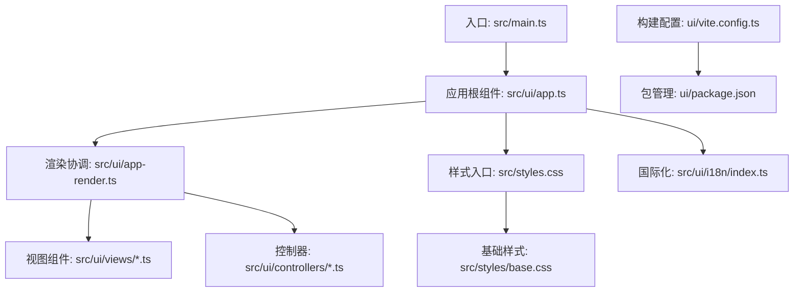
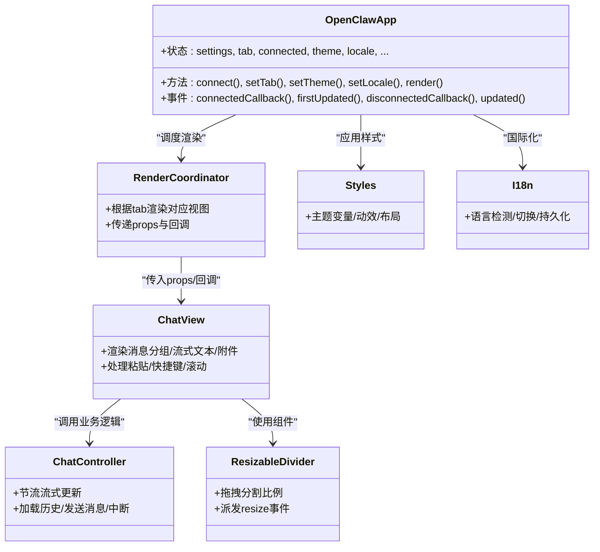
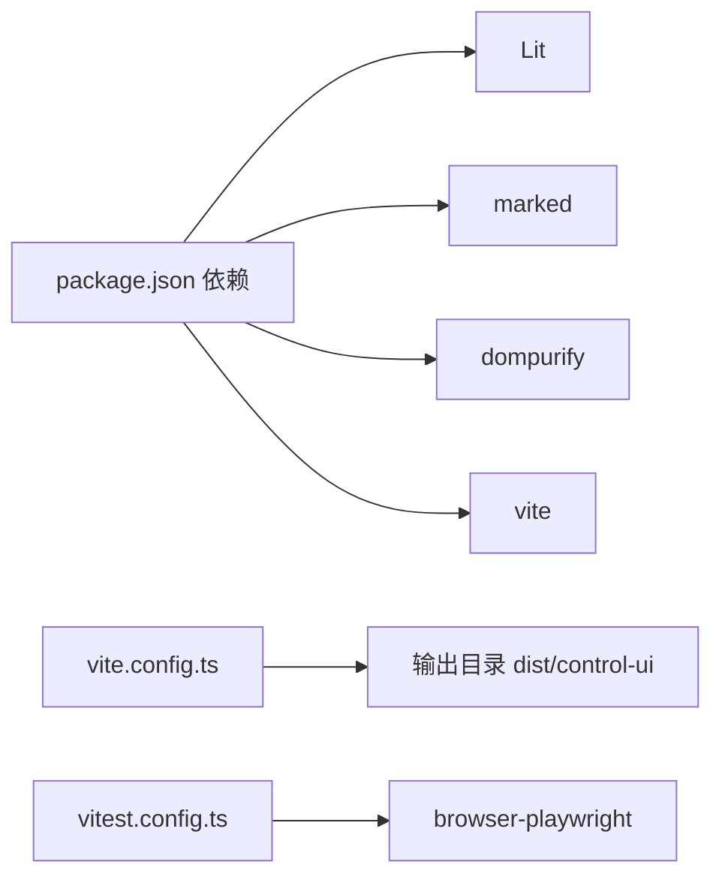

# 用户界面模块

<cite>
**本文档引用的文件**
- [ui/package.json](file://ui/package.json)
- [ui/vite.config.ts](file://ui/vite.config.ts)
- [ui/src/main.ts](file://ui/src/main.ts)
- [ui/src/ui/app.ts](file://ui/src/ui/app.ts)
- [ui/src/ui/app-render.ts](file://ui/src/ui/app-render.ts)
- [ui/src/ui/views/chat.ts](file://ui/src/ui/views/chat.ts)
- [ui/src/ui/controllers/chat.ts](file://ui/src/ui/controllers/chat.ts)
- [ui/src/ui/components/resizable-divider.ts](file://ui/src/ui/components/resizable-divider.ts)
- [ui/src/ui/i18n/index.ts](file://ui/src/ui/i18n/index.ts)
- [ui/src/styles.css](file://ui/src/styles.css)
- [ui/src/styles/base.css](file://ui/src/styles/base.css)
- [ui/src/ui/types.ts](file://ui/src/ui/types.ts)
- [ui/src/ui/ui-types.ts](file://ui/src/ui/ui-types.ts)
</cite>

## 目录

1. [简介](#简介)
2. [项目结构](#项目结构)
3. [核心组件](#核心组件)
4. [架构总览](#架构总览)
5. [详细组件分析](#详细组件分析)
6. [依赖关系分析](#依赖关系分析)
7. [性能考虑](#性能考虑)
8. [故障排除指南](#故障排除指南)
9. [结论](#结论)
10. [附录](#附录)

## 简介

本文件面向OpenClaw用户界面模块，聚焦ui/目录下的Web界面架构，系统性阐述基于Lit的组件体系、样式系统与构建配置；深入解析UI组件的层次结构、状态管理与事件处理机制；记录UI与后端服务的通信协议、数据绑定模式与响应式更新策略；提供UI开发规范、组件设计原则与用户体验优化建议；涵盖界面本地化、主题定制与无障碍访问支持。

## 项目结构

ui/目录采用“按功能域划分”的组织方式，核心入口为src/main.ts，应用根组件为src/ui/app.ts，视图层位于src/ui/views，控制器位于src/ui/controllers，通用样式位于src/styles，国际化位于src/ui/i18n，构建配置位于vite.config.ts。

图表来源

- [ui/src/main.ts](file://ui/src/main.ts#L1-L3)
- [ui/src/ui/app.ts](file://ui/src/ui/app.ts#L1-L707)
- [ui/src/ui/app-render.ts](file://ui/src/ui/app-render.ts#L1-L1461)
- [ui/src/ui/views/chat.ts](file://ui/src/ui/views/chat.ts#L1-L596)
- [ui/src/ui/controllers/chat.ts](file://ui/src/ui/controllers/chat.ts#L1-L376)
- [ui/src/styles.css](file://ui/src/styles.css#L1-L7)
- [ui/src/styles/base.css](file://ui/src/styles/base.css#L1-L389)
- [ui/src/ui/i18n/index.ts](file://ui/src/ui/i18n/index.ts#L1-L119)
- [ui/vite.config.ts](file://ui/vite.config.ts#L1-L42)
- [ui/package.json](file://ui/package.json#L1-L24)

章节来源

- [ui/src/main.ts](file://ui/src/main.ts#L1-L3)
- [ui/src/ui/app.ts](file://ui/src/ui/app.ts#L1-L707)
- [ui/src/ui/app-render.ts](file://ui/src/ui/app-render.ts#L1-L1461)
- [ui/src/ui/views/chat.ts](file://ui/src/ui/views/chat.ts#L1-L596)
- [ui/src/ui/controllers/chat.ts](file://ui/src/ui/controllers/chat.ts#L1-L376)
- [ui/src/styles.css](file://ui/src/styles.css#L1-L7)
- [ui/src/styles/base.css](file://ui/src/styles/base.css#L1-L389)
- [ui/src/ui/i18n/index.ts](file://ui/src/ui/i18n/index.ts#L1-L119)
- [ui/vite.config.ts](file://ui/vite.config.ts#L1-L42)
- [ui/package.json](file://ui/package.json#L1-L24)

## 核心组件

- 应用根组件：OpenClawApp（LitElement）集中管理全局状态、生命周期钩子、路由与渲染调度，负责与后端网关通信、维护主题/语言/布局等设置。
- 视图组件：如chat.ts渲染聊天界面，包含消息分组、流式输出、附件预览、侧栏工具输出等。
- 控制器：如chat.ts封装聊天状态节流、流式同步、历史加载、消息发送与中断等逻辑。
- 组件：如resizable-divider.ts提供拖拽分割视图能力。
- 样式：styles.css聚合基础样式与布局，base.css定义深/浅主题变量与动效。
- 国际化：i18n模块提供多语言翻译、语言检测与持久化。

章节来源

- [ui/src/ui/app.ts](file://ui/src/ui/app.ts#L111-L707)
- [ui/src/ui/views/chat.ts](file://ui/src/ui/views/chat.ts#L1-L596)
- [ui/src/ui/controllers/chat.ts](file://ui/src/ui/controllers/chat.ts#L1-L376)
- [ui/src/ui/components/resizable-divider.ts](file://ui/src/ui/components/resizable-divider.ts#L1-L111)
- [ui/src/styles.css](file://ui/src/styles.css#L1-L7)
- [ui/src/styles/base.css](file://ui/src/styles/base.css#L1-L389)
- [ui/src/ui/i18n/index.ts](file://ui/src/ui/i18n/index.ts#L1-L119)

## 架构总览

UI采用“根组件统一状态 + 视图/控制器解耦 + 渲染协调器”的架构。根组件负责生命周期与事件分发，渲染协调器根据tab动态选择视图，控制器封装业务状态与异步交互，视图组件专注展示与用户交互。

图表来源

- [ui/src/ui/app.ts](file://ui/src/ui/app.ts#L111-L707)
- [ui/src/ui/app-render.ts](file://ui/src/ui/app-render.ts#L113-L92)
- [ui/src/ui/views/chat.ts](file://ui/src/ui/views/chat.ts#L194-L438)
- [ui/src/ui/controllers/chat.ts](file://ui/src/ui/controllers/chat.ts#L18-L376)
- [ui/src/ui/components/resizable-divider.ts](file://ui/src/ui/components/resizable-divider.ts#L8-L111)
- [ui/src/styles.css](file://ui/src/styles.css#L1-L7)
- [ui/src/styles/base.css](file://ui/src/styles/base.css#L1-L389)
- [ui/src/ui/i18n/index.ts](file://ui/src/ui/i18n/index.ts#L1-L119)

## 详细组件分析

### 应用根组件 OpenClawApp

- 角色定位：全局状态中心、生命周期管理、渲染入口、与后端网关交互的桥接者。
- 关键职责：
  - 状态管理：包含UI设置、主题、语言、聊天状态、会话、节点、设备、配置、通道、技能、使用统计、日志、调试等。
  - 生命周期：connectedCallback/firstUpdated/disconnectedCallback/updated分发到app-lifecycle.ts。
  - 渲染：render()委托给app-render.ts生成页面结构。
  - 事件处理：封装聊天发送/中断、会话删除、网关URL确认/取消、侧栏开关等交互。
  - 网关通信：connect()通过app-gateway.ts建立连接，后续各控制器通过client调用request()。
- 设计要点：
  - 使用Lit装饰器声明响应式状态，确保最小化重渲染。
  - 将复杂逻辑拆分至多个控制器与视图，保持组件职责单一。
  - 通过应用设置持久化用户偏好（主题、语言、分割比等）。

章节来源

- [ui/src/ui/app.ts](file://ui/src/ui/app.ts#L111-L707)

### 渲染协调器 app-render.ts

- 角色定位：根据当前tab选择渲染对应视图，组装props与回调，实现“按需渲染”。
- 关键职责：
  - 顶层布局：顶栏、侧边导航、主内容区。
  - 标签页渲染：overview、channels、instances、sessions、usage、cron、agents、logs、debug等。
  - 事件与状态桥接：将OpenClawApp状态映射为各视图的props，注入回调函数。
  - 性能优化：对部分高频状态（如usage日期变更）使用防抖。
- 设计要点：
  - 通过模块导入各视图渲染函数，保持视图独立性。
  - 在渲染前进行状态归一化（如路径标准化、头像URL解析）。

章节来源

- [ui/src/ui/app-render.ts](file://ui/src/ui/app-render.ts#L113-L92)

### 聊天视图组件 chat.ts

- 角色定位：聊天界面的展示与交互核心。
- 关键职责：
  - 消息分组与渲染：将消息按角色与时间分组，支持“正在思考”指示、流式文本、工具卡片。
  - 输入与附件：文本域自适应高度、粘贴图片转附件、快捷键发送、队列管理。
  - 侧栏与分割：支持右侧侧栏查看工具输出，拖拽分割器调整左右区域比例。
  - 可访问性：提供aria-live、role与键盘交互。
- 设计要点：
  - 使用repeat指令高效渲染消息列表。
  - 通过工具函数对消息进行归一化与分组，提升渲染一致性。

章节来源

- [ui/src/ui/views/chat.ts](file://ui/src/ui/views/chat.ts#L194-L438)

### 聊天控制器 chat.ts

- 角色定位：聊天业务状态与异步交互的封装。
- 关键职责：
  - 流式节流：使用缓冲与requestAnimationFrame/timeout实现约20fps的平滑更新。
  - 历史加载：调用后端接口获取最近消息与运行状态。
  - 发送消息：构造内容块（文本/图片），发起请求并维护runId与流状态。
  - 中断与错误：支持中止运行、错误回退与最终flush。
  - 超时检测：若长时间无更新则触发自动刷新。
- 设计要点：
  - 以sessionKey为维度缓存节流状态，支持多会话场景。
  - 对agent事件与delta事件分别处理，保证流式文本连续性。

章节来源

- [ui/src/ui/controllers/chat.ts](file://ui/src/ui/controllers/chat.ts#L18-L376)

### 可调整分割组件 resizable-divider.ts

- 角色定位：提供拖拽分割左右区域的能力。
- 关键职责：
  - 计算拖拽增量并转换为分割比例，派发自定义resize事件。
  - 限制最小/最大比例，提供悬停与拖拽态样式。
- 设计要点：
  - 通过document级事件监听实现跨窗口拖拽，释放时清理事件。

章节来源

- [ui/src/ui/components/resizable-divider.ts](file://ui/src/ui/components/resizable-divider.ts#L8-L111)

### 样式系统 styles.css 与 base.css

- 角色定位：提供主题变量、动效与布局基线。
- 关键职责：
  - 主题变量：深/浅主题颜色、阴影、圆角、过渡曲线等。
  - 动画：入场、淡入、缩放、脉冲、发光等动效。
  - 布局：卡片、面板、滚动条、响应式适配。
- 设计要点：
  - 使用CSS自定义属性实现主题切换与过渡动画。
  - 通过view-transition实现主题切换的视觉过渡。

章节来源

- [ui/src/styles.css](file://ui/src/styles.css#L1-L7)
- [ui/src/styles/base.css](file://ui/src/styles/base.css#L1-L389)

### 国际化 i18n/index.ts

- 角色定位：提供多语言支持与语言检测。
- 关键职责：
  - 语言检测：基于浏览器语言或localStorage持久化。
  - 翻译：提供t()函数与插值参数，支持hasTranslation()校验。
  - 语言切换：setLocale()更新当前语言并持久化。
- 设计要点：
  - 以模块内常量维护可用语言列表，便于扩展。

章节来源

- [ui/src/ui/i18n/index.ts](file://ui/src/ui/i18n/index.ts#L1-L119)

### 类型系统

- 全局类型：ui-types.ts定义聊天附件、队列项、定时任务表单等前端专用类型。
- 后端契约：types.ts定义与后端通信的数据结构（会话、通道、使用统计、日志等）。
- 设计要点：
  - 将前端类型与后端契约分离，避免UI直接耦合后端细节。

章节来源

- [ui/src/ui/ui-types.ts](file://ui/src/ui/ui-types.ts#L1-L37)
- [ui/src/ui/types.ts](file://ui/src/ui/types.ts#L1-L788)

## 依赖关系分析

- 构建与运行：Vite作为打包与开发服务器，支持依赖预优化与源码映射。
- 运行时依赖：Lit用于组件化与响应式渲染，marked/dompurify用于Markdown与安全处理。
- 测试：Vitest结合Playwright进行浏览器测试。

图表来源

- [ui/package.json](file://ui/package.json#L11-L22)
- [ui/vite.config.ts](file://ui/vite.config.ts#L21-L41)

章节来源

- [ui/package.json](file://ui/package.json#L1-L24)
- [ui/vite.config.ts](file://ui/vite.config.ts#L1-L42)

## 性能考虑

- 流式渲染节流：聊天控制器对流式文本进行节流（约20fps），减少重绘压力。
- 按需渲染：app-render.ts仅渲染当前tab，降低DOM复杂度。
- 状态最小化：OpenClawApp使用Lit响应式状态，避免不必要的重渲染。
- 依赖预优化：Vite配置对lit重复指令进行预优化，缩短冷启动时间。
- 源码映射：构建开启sourcemap，便于调试与性能分析。

## 故障排除指南

- 连接问题：检查connected状态与lastError，确认网关URL与网络连通性。
- 聊天无响应：确认chatSending与chatRunId状态，检查流式节流与超时检测逻辑。
- 侧栏不显示：确认sidebarOpen与splitRatio，检查resizable-divider事件是否正确派发。
- 主题切换异常：检查data-theme属性与CSS变量覆盖，确认主题切换动画是否被系统高对比度模式影响。
- 国际化失效：检查getLocale与setLocale调用，确认localStorage键值是否存在。

## 结论

OpenClaw用户界面模块以Lit为核心，采用“根组件统一状态 + 视图/控制器解耦 + 渲染协调器”的架构，实现了高性能、可维护且可扩展的Web控制台。通过完善的样式系统、国际化与无障碍支持，以及清晰的类型定义与构建配置，为用户提供了稳定一致的交互体验。

## 附录

### UI开发规范与最佳实践

- 组件设计原则
  - 单一职责：每个视图/控制器聚焦一个业务域。
  - 可组合性：通过props与回调传递行为，避免紧耦合。
  - 可测试性：将副作用隔离在控制器中，视图保持纯渲染。
- 状态管理
  - 使用Lit响应式状态，避免手动DOM操作。
  - 将跨组件共享的状态收敛到OpenClawApp，通过方法与事件分发。
- 数据绑定与响应式更新
  - 使用repeat与key确保列表高效更新。
  - 对高频状态使用节流/防抖，如聊天流与usage日期变更。
- 事件处理机制
  - 通过自定义事件在组件间传递状态变化（如resizable-divider的resize）。
  - 在根组件生命周期中注册/注销事件监听，避免内存泄漏。
- 与后端通信协议
  - 通过client.request()调用后端RPC，遵循约定的请求/响应格式。
  - 对长连接/流式事件进行节流与超时检测，确保UI稳定性。
- 用户体验优化
  - 提供加载占位、错误提示与可访问性标签（aria-live/role）。
  - 支持键盘快捷键与粘贴上传，提升输入效率。
- 本地化与主题
  - 使用i18n模块统一管理翻译，支持语言切换与持久化。
  - 通过CSS变量与主题切换动画提供一致的主题体验。
- 无障碍访问
  - 为交互元素提供aria-label/title，确保键盘可达。
  - 使用语义化HTML与role标注，保障屏幕阅读器友好。
