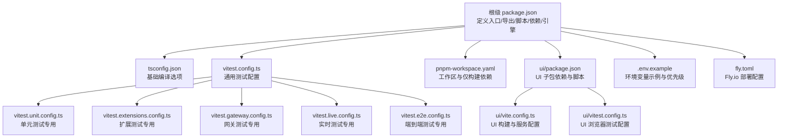
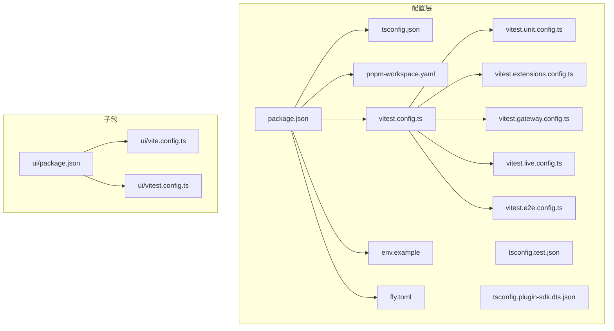
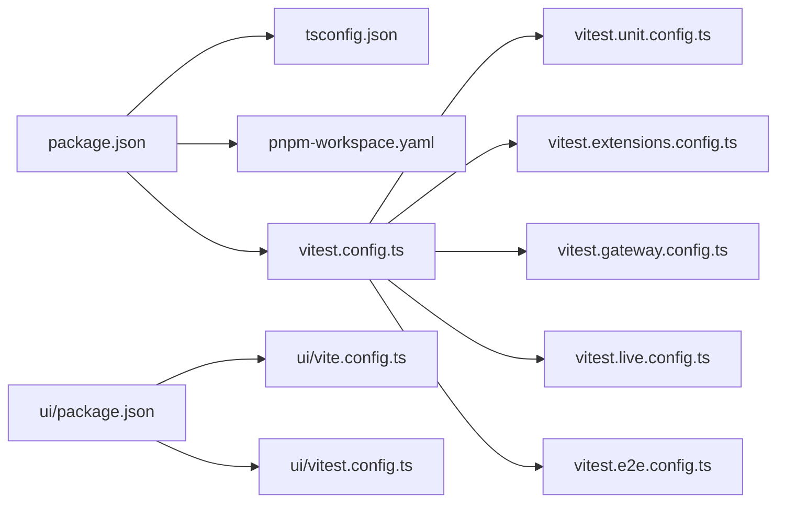

# 配置模块结构

<cite>
**本文引用的文件**
- [package.json](file://package.json)
- [tsconfig.json](file://tsconfig.json)
- [tsconfig.test.json](file://tsconfig.test.json)
- [tsconfig.plugin-sdk.dts.json](file://tsconfig.plugin-sdk.dts.json)
- [pnpm-workspace.yaml](file://pnpm-workspace.yaml)
- [vitest.config.ts](file://vitest.config.ts)
- [vitest.unit.config.ts](file://vitest.unit.config.ts)
- [vitest.extensions.config.ts](file://vitest.extensions.config.ts)
- [vitest.gateway.config.ts](file://vitest.gateway.config.ts)
- [vitest.live.config.ts](file://vitest.live.config.ts)
- [vitest.e2e.config.ts](file://vitest.e2e.config.ts)
- [ui/package.json](file://ui/package.json)
- [ui/vite.config.ts](file://ui/vite.config.ts)
- [ui/vitest.config.ts](file://ui/vitest.config.ts)
- [.env.example](file://.env.example)
- [fly.toml](file://fly.toml)
</cite>

## 目录

1. [简介](#简介)
2. [项目结构](#项目结构)
3. [核心组件](#核心组件)
4. [架构总览](#架构总览)
5. [详细组件分析](#详细组件分析)
6. [依赖关系分析](#依赖关系分析)
7. [性能考虑](#性能考虑)
8. [故障排查指南](#故障排查指南)
9. [结论](#结论)
10. [附录](#附录)

## 简介

本文件面向 OpenClaw 的“配置模块”，系统性梳理并解释仓库中与配置相关的文件与约定，包括但不限于：

- 根级 package.json 的依赖管理、脚本配置与导出规范
- TypeScript 编译配置（tsconfig.json、tsconfig.test.json、tsconfig.plugin-sdk.dts.json）
- 包管理器工作区配置（pnpm-workspace.yaml）
- 测试框架配置（Vitest 多份配置文件）
- 构建系统与开发环境设置
- 最佳实践、版本兼容性与迁移建议
- CI/CD 与部署配置、环境变量管理

## 项目结构

OpenClaw 采用 monorepo 结构，根目录通过 pnpm 工作区统一管理多个子包与扩展。配置模块围绕以下关键文件展开：

- 根级 package.json：定义入口、导出、脚本、依赖与引擎要求
- TypeScript 配置：tsconfig.json 及其派生配置
- Vitest 配置：基础配置与按场景拆分的多份配置
- UI 子包：独立的 Vite/Vitest 配置
- 部署与环境：fly.toml 与 .env.example

图表来源

- [package.json](file://package.json#L1-L219)
- [tsconfig.json](file://tsconfig.json#L1-L28)
- [vitest.config.ts](file://vitest.config.ts#L1-L105)
- [vitest.unit.config.ts](file://vitest.unit.config.ts#L1-L20)
- [vitest.extensions.config.ts](file://vitest.extensions.config.ts#L1-L15)
- [vitest.gateway.config.ts](file://vitest.gateway.config.ts#L1-L15)
- [vitest.live.config.ts](file://vitest.live.config.ts#L1-L16)
- [vitest.e2e.config.ts](file://vitest.e2e.config.ts#L1-L21)
- [pnpm-workspace.yaml](file://pnpm-workspace.yaml#L1-L17)
- [ui/package.json](file://ui/package.json#L1-L24)
- [ui/vite.config.ts](file://ui/vite.config.ts#L1-L42)
- [ui/vitest.config.ts](file://ui/vitest.config.ts#L1-L16)
- [.env.example](file://.env.example#L1-L71)
- [fly.toml](file://fly.toml#L1-L35)

章节来源

- [package.json](file://package.json#L1-L219)
- [pnpm-workspace.yaml](file://pnpm-workspace.yaml#L1-L17)

## 核心组件

本节聚焦配置模块的关键文件与其职责。

- 根级 package.json
  - 入口与导出：定义 CLI 入口、插件 SDK 导出与默认导出，确保外部消费方能正确解析路径与类型声明
  - 脚本：涵盖 Android/iOS 构建、文档检查、格式化、Linter、测试、协议生成、打包等
  - 依赖与引擎：声明运行时与包管理器版本要求，以及 overrides 与 onlyBuiltDependencies
- TypeScript 配置
  - 基础 tsconfig.json：严格模式、NodeNext 模块系统、路径映射、包含/排除规则
  - 测试配置 tsconfig.test.json：针对测试文件集的编译选项
  - 插件 SDK 类型输出 tsconfig.plugin-sdk.dts.json：仅生成 d.ts 并输出到 dist/plugin-sdk
- Vitest 配置族
  - vitest.config.ts：通用别名、超时、并发、覆盖率阈值与排除范围
  - vitest.unit.config.ts：聚焦源码单元测试
  - vitest.extensions.config.ts：聚焦扩展测试
  - vitest.gateway.config.ts：聚焦网关相关测试
  - vitest.live.config.ts：聚焦实时测试（单 worker）
  - vitest.e2e.config.ts：聚焦端到端测试（按 CPU 自适应 worker 数）
- UI 子包
  - ui/package.json：UI 依赖与脚本
  - ui/vite.config.ts：控制 UI 构建目录、base 路径、开发服务器端口与 sourcemap
  - ui/vitest.config.ts：浏览器测试（Playwright）配置
- 工作区与包管理
  - pnpm-workspace.yaml：声明工作区包与仅构建依赖列表
- 部署与环境
  - fly.toml：Fly.io 部署参数、进程与挂载
  - .env.example：环境变量示例与加载优先级说明

章节来源

- [package.json](file://package.json#L1-L219)
- [tsconfig.json](file://tsconfig.json#L1-L28)
- [tsconfig.test.json](file://tsconfig.test.json#L1-L9)
- [tsconfig.plugin-sdk.dts.json](file://tsconfig.plugin-sdk.dts.json#L1-L16)
- [vitest.config.ts](file://vitest.config.ts#L1-L105)
- [vitest.unit.config.ts](file://vitest.unit.config.ts#L1-L20)
- [vitest.extensions.config.ts](file://vitest.extensions.config.ts#L1-L15)
- [vitest.gateway.config.ts](file://vitest.gateway.config.ts#L1-L15)
- [vitest.live.config.ts](file://vitest.live.config.ts#L1-L16)
- [vitest.e2e.config.ts](file://vitest.e2e.config.ts#L1-L21)
- [ui/package.json](file://ui/package.json#L1-L24)
- [ui/vite.config.ts](file://ui/vite.config.ts#L1-L42)
- [ui/vitest.config.ts](file://ui/vitest.config.ts#L1-L16)
- [pnpm-workspace.yaml](file://pnpm-workspace.yaml#L1-L17)
- [.env.example](file://.env.example#L1-L71)
- [fly.toml](file://fly.toml#L1-L35)

## 架构总览

下图展示配置模块在整体工程中的位置与交互关系。

图表来源

- [package.json](file://package.json#L1-L219)
- [tsconfig.json](file://tsconfig.json#L1-L28)
- [tsconfig.test.json](file://tsconfig.test.json#L1-L9)
- [tsconfig.plugin-sdk.dts.json](file://tsconfig.plugin-sdk.dts.json#L1-L16)
- [pnpm-workspace.yaml](file://pnpm-workspace.yaml#L1-L17)
- [vitest.config.ts](file://vitest.config.ts#L1-L105)
- [vitest.unit.config.ts](file://vitest.unit.config.ts#L1-L20)
- [vitest.extensions.config.ts](file://vitest.extensions.config.ts#L1-L15)
- [vitest.gateway.config.ts](file://vitest.gateway.config.ts#L1-L15)
- [vitest.live.config.ts](file://vitest.live.config.ts#L1-L16)
- [vitest.e2e.config.ts](file://vitest.e2e.config.ts#L1-L21)
- [ui/package.json](file://ui/package.json#L1-L24)
- [ui/vite.config.ts](file://ui/vite.config.ts#L1-L42)
- [ui/vitest.config.ts](file://ui/vitest.config.ts#L1-L16)
- [.env.example](file://.env.example#L1-L71)
- [fly.toml](file://fly.toml#L1-L35)

## 详细组件分析

### 根级 package.json：依赖、脚本与导出

- 入口与导出
  - CLI 入口与主入口指向 dist 输出
  - 插件 SDK 导出包含 types 与 default 字段，便于外部消费
- 脚本
  - 跨平台移动应用与桌面应用构建/安装/运行
  - 文档检查、格式化、Linter、协议生成、UI 打包、测试与覆盖率
  - Docker 相关的端到端测试流水线
- 依赖与引擎
  - 运行时与包管理器版本要求
  - overrides 与 onlyBuiltDependencies 控制二进制依赖与版本锁定策略
- 代码片段路径
  - [入口与导出定义](file://package.json#L25-L32)
  - [常用脚本集合](file://package.json#L33-L109)
  - [依赖与引擎声明](file://package.json#L111-L195)
  - [pnpm overrides 与仅构建依赖](file://package.json#L196-L217)

章节来源

- [package.json](file://package.json#L1-L219)

### TypeScript 配置：tsconfig.json、tsconfig.test.json、tsconfig.plugin-sdk.dts.json

- 基础 tsconfig.json
  - 严格模式、NodeNext 模块系统、DOM/ES2023 库、路径映射
  - 包含 src/ui/extensions，排除测试与 dist
- 测试配置 tsconfig.test.json
  - 继承基础配置，仅针对测试文件集
- 插件 SDK 类型输出 tsconfig.plugin-sdk.dts.json
  - 仅生成 d.ts，输出到 dist/plugin-sdk，包含类型与根目录约束
- 代码片段路径
  - [基础编译选项与路径映射](file://tsconfig.json#L2-L24)
  - [包含/排除规则](file://tsconfig.json#L25-L27)
  - [测试配置继承与包含](file://tsconfig.test.json#L1-L9)
  - [插件 SDK 类型输出配置](file://tsconfig.plugin-sdk.dts.json#L1-L16)

章节来源

- [tsconfig.json](file://tsconfig.json#L1-L28)
- [tsconfig.test.json](file://tsconfig.test.json#L1-L9)
- [tsconfig.plugin-sdk.dts.json](file://tsconfig.plugin-sdk.dts.json#L1-L16)

### 包管理配置：pnpm-workspace.yaml

- 工作区包声明：根、UI、packages、extensions
- 仅构建依赖：集中声明二进制原生依赖，减少安装与构建开销
- 代码片段路径
  - [工作区与仅构建依赖](file://pnpm-workspace.yaml#L1-L17)

章节来源

- [pnpm-workspace.yaml](file://pnpm-workspace.yaml#L1-L17)

### 测试配置：vitest.config.ts 与多场景配置

- 通用配置 vitest.config.ts
  - 别名：openclaw/plugin-sdk 指向源码入口
  - 超时、并发（根据 CI/本地与 CPU 数动态调整）、包含/排除规则
  - 覆盖率提供者、报告器与阈值；大量排除项覆盖难以单元测试或偏向集成测试的模块
- 场景化配置
  - 单元测试：排除网关与扩展相关测试
  - 扩展测试：仅匹配 extensions/\*_/_ 测试
  - 网关测试：仅匹配 src/gateway/\*_/_ 测试
  - 实时测试：单 worker，仅匹配 \*.live.test.ts
  - 端到端测试：按 CPU 计算 worker 数，匹配 test/**/\* 与 src/**/\* e2e 测试
- 代码片段路径
  - [通用配置与覆盖率阈值](file://vitest.config.ts#L12-L104)
  - [单元测试配置](file://vitest.unit.config.ts#L1-L20)
  - [扩展测试配置](file://vitest.extensions.config.ts#L1-L15)
  - [网关测试配置](file://vitest.gateway.config.ts#L1-L15)
  - [实时测试配置](file://vitest.live.config.ts#L1-L16)
  - [端到端测试配置](file://vitest.e2e.config.ts#L1-L21)

章节来源

- [vitest.config.ts](file://vitest.config.ts#L1-L105)
- [vitest.unit.config.ts](file://vitest.unit.config.ts#L1-L20)
- [vitest.extensions.config.ts](file://vitest.extensions.config.ts#L1-L15)
- [vitest.gateway.config.ts](file://vitest.gateway.config.ts#L1-L15)
- [vitest.live.config.ts](file://vitest.live.config.ts#L1-L16)
- [vitest.e2e.config.ts](file://vitest.e2e.config.ts#L1-L21)

### UI 子包配置：ui/package.json、ui/vite.config.ts、ui/vitest.config.ts

- ui/package.json
  - 依赖与脚本：Vite、Lit、Marked、Playwright 与 Vitest
- ui/vite.config.ts
  - base 路径支持环境变量覆盖，开发服务器主机与端口可配置
  - 构建输出到 dist/control-ui，启用 sourcemap
- ui/vitest.config.ts
  - 启用浏览器测试，使用 Playwright 提供商，headless 运行
- 代码片段路径
  - [UI 依赖与脚本](file://ui/package.json#L1-L24)
  - [UI 构建与开发服务器配置](file://ui/vite.config.ts#L21-L41)
  - [UI 浏览器测试配置](file://ui/vitest.config.ts#L1-L16)

章节来源

- [ui/package.json](file://ui/package.json#L1-L24)
- [ui/vite.config.ts](file://ui/vite.config.ts#L1-L42)
- [ui/vitest.config.ts](file://ui/vitest.config.ts#L1-L16)

### 环境变量与部署：.env.example、fly.toml

- .env.example
  - 环境变量优先级：进程环境 > 仓库 .env > 用户目录 .env > 配置文件 env 块
  - 分类示例：网关认证与路径、模型提供商密钥、通道令牌、工具与语音媒体密钥
- fly.toml
  - Fly.io 部署：Dockerfile、生产环境变量、进程与端口、VM 规格、数据挂载
- 代码片段路径
  - [环境变量优先级与分类示例](file://.env.example#L8-L71)
  - [Fly.io 部署配置](file://fly.toml#L1-L35)

章节来源

- [.env.example](file://.env.example#L1-L71)
- [fly.toml](file://fly.toml#L1-L35)

## 依赖关系分析

配置模块内部各文件之间的依赖关系如下：

图表来源

- [package.json](file://package.json#L1-L219)
- [tsconfig.json](file://tsconfig.json#L1-L28)
- [pnpm-workspace.yaml](file://pnpm-workspace.yaml#L1-L17)
- [vitest.config.ts](file://vitest.config.ts#L1-L105)
- [vitest.unit.config.ts](file://vitest.unit.config.ts#L1-L20)
- [vitest.extensions.config.ts](file://vitest.extensions.config.ts#L1-L15)
- [vitest.gateway.config.ts](file://vitest.gateway.config.ts#L1-L15)
- [vitest.live.config.ts](file://vitest.live.config.ts#L1-L16)
- [vitest.e2e.config.ts](file://vitest.e2e.config.ts#L1-L21)
- [ui/package.json](file://ui/package.json#L1-L24)
- [ui/vite.config.ts](file://ui/vite.config.ts#L1-L42)
- [ui/vitest.config.ts](file://ui/vitest.config.ts#L1-L16)

章节来源

- [package.json](file://package.json#L1-L219)
- [vitest.config.ts](file://vitest.config.ts#L1-L105)

## 性能考虑

- 并发与资源分配
  - Vitest 在 CI 与本地环境下根据平台与 CPU 数动态设置最大 worker 数，避免过度占用资源
- 排除策略
  - 通过广泛的排除列表减少不必要的单元测试执行，将更重的验证留给端到端与实时测试
- 仅构建依赖
  - pnpm-workspace.yaml 中的仅构建依赖清单有助于减少安装体积与构建时间
- UI 构建
  - UI 构建输出独立目录，启用 sourcemap 便于调试但需注意发布体积

章节来源

- [vitest.config.ts](file://vitest.config.ts#L7-L11)
- [vitest.e2e.config.ts](file://vitest.e2e.config.ts#L5-L7)
- [pnpm-workspace.yaml](file://pnpm-workspace.yaml#L7-L17)
- [ui/vite.config.ts](file://ui/vite.config.ts#L30-L34)

## 故障排查指南

- 测试覆盖率不达标
  - 检查覆盖率阈值与排除列表是否过于宽泛；必要时缩小排除范围或补充单元测试
  - 参考路径：[覆盖率阈值与排除](file://vitest.config.ts#L35-L101)
- 并发导致的不稳定
  - 在本地调试时降低 worker 数；在 CI 中确认平台差异（Windows vs 其他平台）
  - 参考路径：[并发与平台差异](file://vitest.config.ts#L9-L11)
- 路径别名解析失败
  - 确认 Vitest 别名与 TypeScript 路径映射一致
  - 参考路径：[别名与路径映射](file://vitest.config.ts#L14-L16)、[路径映射](file://tsconfig.json#L20-L23)
- UI 构建路径异常
  - 检查 OPENCLAW_CONTROL_UI_BASE_PATH 是否被错误设置
  - 参考路径：[UI base 路径处理](file://ui/vite.config.ts#L22-L24)
- 环境变量未生效
  - 确认加载顺序与优先级；避免覆盖已存在的进程环境变量
  - 参考路径：[环境变量优先级](file://.env.example#L8-L12)

章节来源

- [vitest.config.ts](file://vitest.config.ts#L12-L104)
- [tsconfig.json](file://tsconfig.json#L20-L23)
- [ui/vite.config.ts](file://ui/vite.config.ts#L21-L24)
- [.env.example](file://.env.example#L8-L12)

## 结论

OpenClaw 的配置模块以清晰的分层设计支撑了多语言、多平台与多场景的开发与运维需求。根级 package.json 统一了入口、导出与脚本；TypeScript 配置保证了严格的类型安全与可维护性；Vitest 配置族覆盖从单元到端到端的全链路测试；UI 子包独立配置确保前端开发体验；pnpm 工作区与仅构建依赖优化了包管理效率；fly.toml 与 .env.example 明确了部署与环境变量管理策略。遵循本文最佳实践与迁移建议，可有效提升团队协作效率与系统稳定性。

## 附录

- 最佳实践
  - 使用 Vitest 场景化配置隔离不同测试类型，避免相互干扰
  - 保持 TypeScript 严格模式与路径映射一致性
  - 将二进制依赖纳入仅构建依赖清单，减少安装与构建成本
  - 在 CI 中固定或限制 worker 数，确保稳定性
- 版本兼容性与迁移
  - Node 引擎版本要求较高，升级前先验证依赖与脚本
  - pnpm 版本与 overrides 策略需同步更新
  - 迁移时优先对比 Vitest 排除列表，确保测试覆盖面不退化
- CI/CD 与部署
  - 使用 fly.toml 部署时，确保状态目录与挂载卷正确配置
  - 在 CI 中通过环境变量控制测试并发与覆盖率阈值
