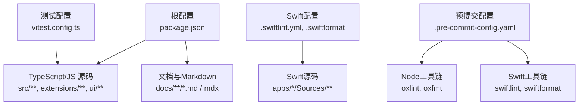
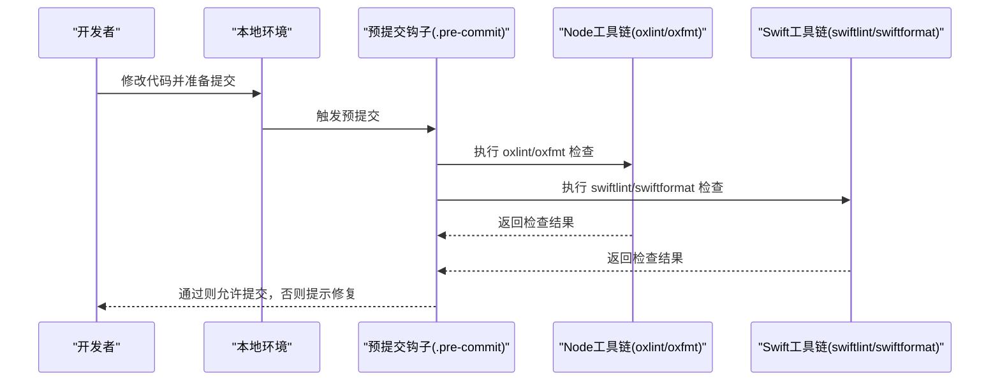
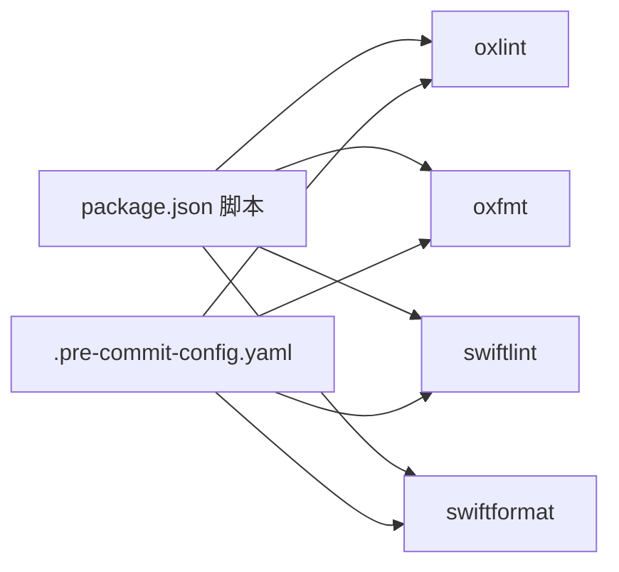

# 代码规范

<cite>
**本文引用的文件**
- [package.json](file://package.json)
- [tsconfig.json](file://tsconfig.json)
- [.swiftlint.yml](file://.swiftlint.yml)
- [.swiftformat](file://.swiftformat)
- [.oxlintrc.json](file://.oxlintrc.json)
- [.oxfmtrc.jsonc](file://.oxfmtrc.jsonc)
- [.markdownlint-cli2.jsonc](file://.markdownlint-cli2.jsonc)
- [.pre-commit-config.yaml](file://.pre-commit-config.yaml)
- [scripts/pre-commit/run-node-tool.sh](file://scripts/pre-commit/run-node-tool.sh)
- [vitest.config.ts](file://vitest.config.ts)
- [CONTRIBUTING.md](file://CONTRIBUTING.md)
- [src/index.ts](file://src/index.ts)
- [Swabble/Sources/swabble/main.swift](file://Swabble/Sources/swabble/main.swift)
</cite>

## 目录

1. [引言](#引言)
2. [项目结构](#项目结构)
3. [核心组件](#核心组件)
4. [架构总览](#架构总览)
5. [详细组件分析](#详细组件分析)
6. [依赖关系分析](#依赖关系分析)
7. [性能考虑](#性能考虑)
8. [故障排查指南](#故障排查指南)
9. [结论](#结论)
10. [附录](#附录)

## 引言

本文件为 OpenClaw 的统一代码规范文档，覆盖 TypeScript/JavaScript 与 Swift 的编码标准、命名约定、注释与文档规范；同时明确代码格式化工具、静态分析规则与代码质量检查流程；并给出错误处理模式、异步编程规范、类型安全要求、Git 提交与分支管理最佳实践，以及性能优化、内存管理与安全编码实践建议。目标是帮助贡献者在多语言（Node.js/TypeScript、Swift）与多平台（macOS/iOS/Android/Web）环境中保持一致的工程质量与可维护性。

## 项目结构

OpenClaw 采用多包/多模块混合结构：

- 根目录通过包管理器统一管理 Node.js 生态的构建、测试与发布脚本
- Swift 代码位于 apps/macos、apps/ios、apps/shared 等目录，并使用 SwiftLint/SwiftFormat 进行静态检查与格式化
- 文档与 Markdown 质量由 markdownlint-cli2 统一校验
- 预提交钩子集中于 .pre-commit-config.yaml，统一执行 Node 工具链与 Swift 工具链的检查

图表来源

- [package.json](file://package.json#L33-L109)
- [.pre-commit-config.yaml](file://.pre-commit-config.yaml#L72-L105)
- [.swiftlint.yml](file://.swiftlint.yml#L3-L21)

章节来源

- [package.json](file://package.json#L1-L219)
- [.pre-commit-config.yaml](file://.pre-commit-config.yaml#L1-L106)

## 核心组件

- TypeScript/JavaScript 编码与类型安全
  - 使用严格模式与现代 ES 目标，启用实验性装饰器与 NodeNext 模块解析
  - 通过 Vitest 进行单元测试与覆盖率控制，设置合理的阈值与排除范围
- Swift 编码与风格
  - 使用 SwiftLint 与 SwiftFormat，统一导入分组、缩进、换行、空格与组织结构
  - 针对生成文件与第三方目录进行排除，避免误报
- 文档与 Markdown 质量
  - 使用 markdownlint-cli2，针对允许的 HTML 元素与规则进行定制
- 预提交与质量门禁
  - 通过本地预提交钩子统一执行 Node 与 Swift 工具链检查，确保 CI 一致性

章节来源

- [tsconfig.json](file://tsconfig.json#L2-L27)
- [vitest.config.ts](file://vitest.config.ts#L18-L102)
- [.swiftlint.yml](file://.swiftlint.yml#L1-L149)
- [.swiftformat](file://.swiftformat#L1-L52)
- [.markdownlint-cli2.jsonc](file://.markdownlint-cli2.jsonc#L1-L53)
- [.pre-commit-config.yaml](file://.pre-commit-config.yaml#L72-L105)

## 架构总览

下图展示从开发者提交到质量门禁的整体流程：本地运行格式化与静态检查，预提交钩子统一调用工具链，最终由 CI 执行更全面的验证。

图表来源

- [.pre-commit-config.yaml](file://.pre-commit-config.yaml#L72-L105)
- [scripts/pre-commit/run-node-tool.sh](file://scripts/pre-commit/run-node-tool.sh#L14-L28)

## 详细组件分析

### TypeScript/JavaScript 编码规范

- 类型系统与编译选项
  - 启用严格模式，目标 ES 版本与模块解析策略明确，路径映射用于插件 SDK 导出
  - 关闭 emit 并在出错时停止，确保构建阶段即发现类型问题
- 命名约定
  - 使用语义化命名，避免魔法数与不必要类型断言
  - 对外导出的 API 应具备清晰职责与稳定接口
- 注释与文档
  - 优先使用 JSDoc 风格注释描述公共 API 的用途、参数与返回值
  - 复杂逻辑应添加简要说明，便于后续维护
- 错误处理与异步编程
  - 全局安装未捕获异常与未处理拒绝的处理器，保证崩溃前有日志输出
  - 异步函数使用 async/await，避免回调地狱；对超时与资源释放进行显式管理
- 测试与覆盖率
  - 单测为主，覆盖率阈值合理；排除入口、桥接层与难以单元测试的集成面
  - 使用 Vitest 并配置池、并发与超时，适配不同平台

章节来源

- [tsconfig.json](file://tsconfig.json#L2-L27)
- [src/index.ts](file://src/index.ts#L79-L93)
- [vitest.config.ts](file://vitest.config.ts#L18-L102)
- [CONTRIBUTING.md](file://CONTRIBUTING.md#L48-L61)

### Swift 编码规范

- 静态检查（SwiftLint）
  - 分析器规则检测未使用声明与导入
  - 开启多项“优化”规则（如 first_where、sorted_first_last 等），提升代码质量
  - 禁用部分与格式化工具冲突或风格偏好相关的规则，避免重复检查
  - 对复杂度、函数长度、行宽等设置警告/错误阈值
- 格式化（SwiftFormat）
  - 固定缩进宽度与换行策略，统一空格与括号风格
  - 组织类型顺序与 MARK 注释风格，便于阅读与导航
  - 排除第三方与生成文件夹，避免误格式化
- 命名与结构
  - 遵循 Apple 命名约定，类型名长度与复杂度控制
  - 使用扩展分组与访问控制修饰符，保持模块边界清晰
- 错误处理与并发
  - 使用 do/catch 捕获错误，避免 force try/cast 警告
  - 在主线程 Actor 中处理 CLI 分发，保证 UI/服务状态一致性

章节来源

- [.swiftlint.yml](file://.swiftlint.yml#L23-L148)
- [.swiftformat](file://.swiftformat#L5-L51)
- [Swabble/Sources/swabble/main.swift](file://Swabble/Sources/swabble/main.swift#L6-L17)

### 文档与 Markdown 规范

- 规则定制
  - 关闭若干行宽、标题重复等规则，以适配技术文档写作风格
  - 允许特定 HTML 元素，满足文档布局与交互需求
- 质量门禁
  - 通过 markdownlint-cli2 统一检查，支持自动修复与批量检查

章节来源

- [.markdownlint-cli2.jsonc](file://.markdownlint-cli2.jsonc#L4-L51)

### 预提交与质量门禁

- 工具链选择
  - 优先使用 pnpm，其次 bun/npm/npx，确保跨环境一致性
- 检查范围
  - Node 工具链：oxlint（类型感知）、oxfmt（格式化）
  - Swift 工具链：swiftlint、swiftformat
- 忽略模式
  - 配置文件中明确忽略第三方、构建产物与生成文件

章节来源

- [.pre-commit-config.yaml](file://.pre-commit-config.yaml#L72-L105)
- [scripts/pre-commit/run-node-tool.sh](file://scripts/pre-commit/run-node-tool.sh#L14-L28)

### Git 提交与分支管理

- 提交前检查
  - 本地执行格式化与静态检查，确保通过预提交钩子
- 分支命名
  - 建议采用功能/修复/文档前缀加主题的命名方式，例如 feature/xxx、fix/xxx、docs/xxx
- 提交信息
  - 采用动词开头的小短语，简述变更内容与影响范围
- 变更范围
  - 保持每次 PR 聚焦单一主题，便于审查与回滚

章节来源

- [CONTRIBUTING.md](file://CONTRIBUTING.md#L40-L46)

## 依赖关系分析

- Node 工具链
  - oxlint 与 oxfmt 作为主要静态分析与格式化工具，配合 tsconfig 与 vitest 形成端到端质量保障
- Swift 工具链
  - swiftlint 与 swiftformat 保障 Swift 代码风格一致，排除生成与第三方目录
- 预提交钩子
  - 将 Node 与 Swift 工具链统一纳入本地质量门禁，减少 CI 失败率

图表来源

- [package.json](file://package.json#L49-L109)
- [.pre-commit-config.yaml](file://.pre-commit-config.yaml#L72-L105)

章节来源

- [package.json](file://package.json#L33-L109)
- [.pre-commit-config.yaml](file://.pre-commit-config.yaml#L72-L105)

## 性能考虑

- 类型安全优先
  - 严格 tsconfig 与 no-any 策略，降低运行时错误与隐式性能损耗
- 异步与并发
  - 合理使用并发池与超时控制，避免阻塞事件循环
- 覆盖率与回归
  - 通过 Vitest 阈值与排除策略，平衡覆盖率与可维护性
- Swift 性能
  - 控制函数体长度与嵌套层级，避免过度复杂度；使用集合与算法优化替代深层循环

章节来源

- [tsconfig.json](file://tsconfig.json#L17-L17)
- [vitest.config.ts](file://vitest.config.ts#L35-L101)
- [.swiftlint.yml](file://.swiftlint.yml#L126-L140)

## 故障排查指南

- 预提交失败
  - 检查本地是否安装 pnpm/bun/npm，确认 run-node-tool.sh 能正确解析工具链
  - 查看具体工具输出，优先修复格式化与静态检查问题
- Swift 编译/格式化问题
  - 确认 .swiftlint.yml 与 .swiftformat 配置未误排除目标文件
  - 使用命令行直接运行 swiftlint/swiftformat 定位问题
- Node 工具链问题
  - 使用 scripts/pre-commit/run-node-tool.sh 显式调用工具，避免环境差异
- 测试失败
  - 根据 vitest 配置定位被排除的模块，必要时临时调整排除列表进行验证

章节来源

- [scripts/pre-commit/run-node-tool.sh](file://scripts/pre-commit/run-node-tool.sh#L14-L28)
- [.pre-commit-config.yaml](file://.pre-commit-config.yaml#L72-L105)
- [vitest.config.ts](file://vitest.config.ts#L25-L101)

## 结论

本规范以工具链为中心，结合严格类型、统一格式与预提交门禁，形成从开发到提交的一致质量基线。建议所有贡献者在本地先行执行格式化与静态检查，遵循分支与提交规范，确保 PR 高质量与可追溯性。

## 附录

- 常用命令速查
  - 格式化：pnpm format / pnpm format:swift
  - 静态检查：pnpm lint / pnpm lint:swift
  - 测试：pnpm test / pnpm test:fast
  - 预提交：pre-commit run --all-files

章节来源

- [package.json](file://package.json#L49-L109)
- [.pre-commit-config.yaml](file://.pre-commit-config.yaml#L72-L105)
