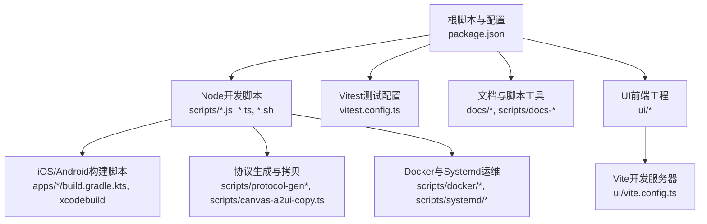
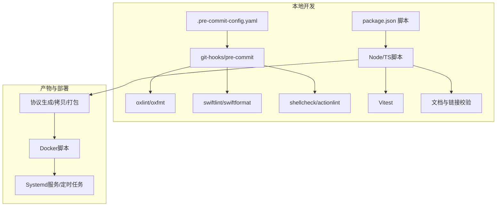
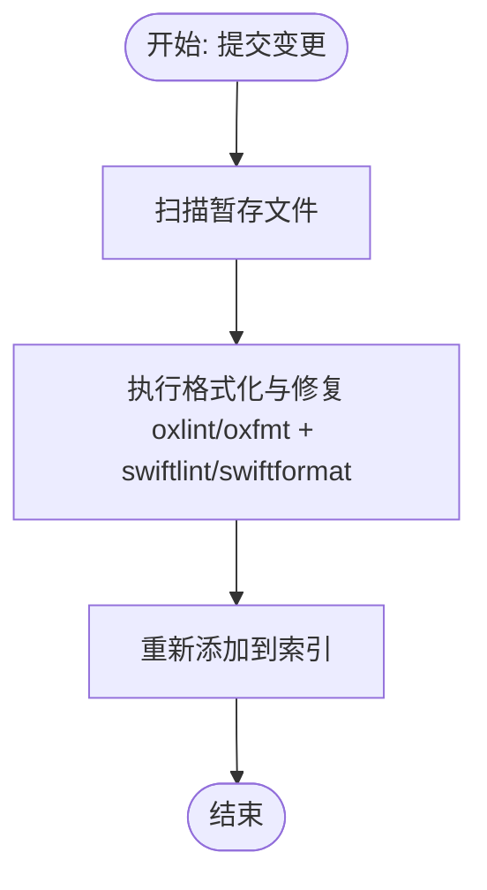
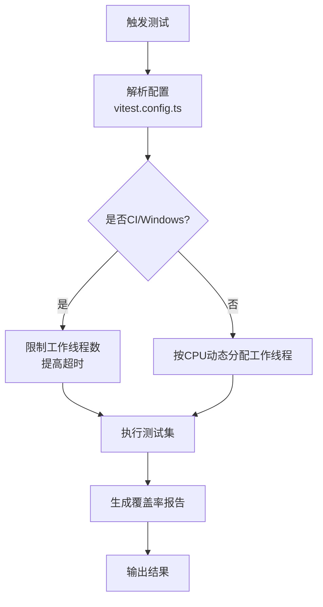
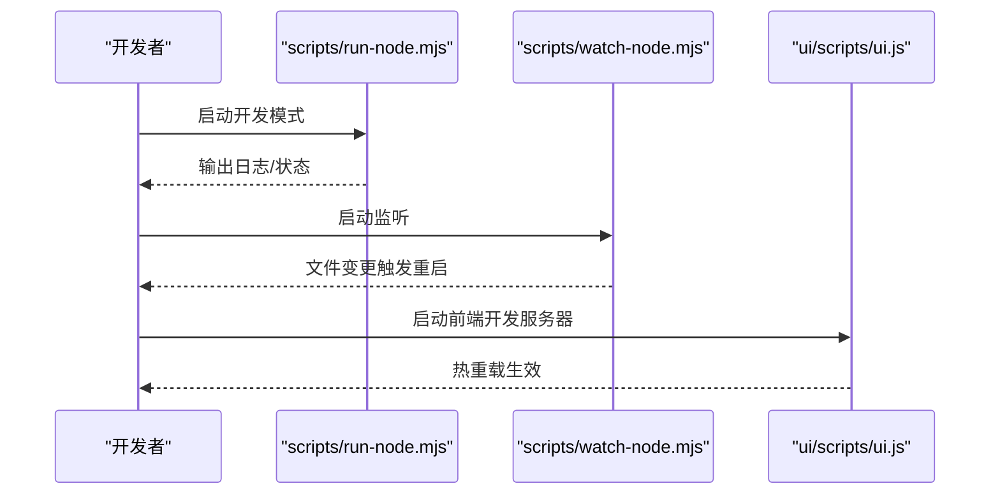
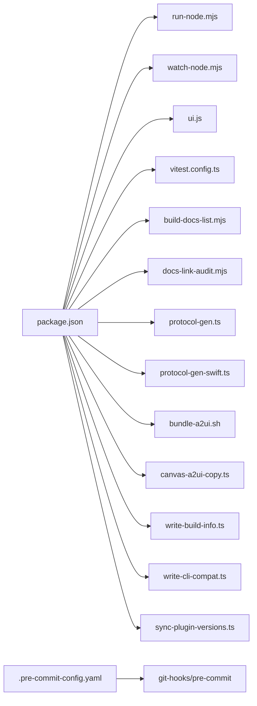

# 开发工具

<cite>
**本文引用的文件**
- [package.json](file://package.json)
- [.markdownlint-cli2.jsonc](file://.markdownlint-cli2.jsonc)
- [.shellcheckrc](file://.shellcheckrc)
- [.swiftformat](file://.swiftformat)
- [.swiftlint.yml](file://.swiftlint.yml)
- [.pre-commit-config.yaml](file://.pre-commit-config.yaml)
- [git-hooks/pre-commit](file://git-hooks/pre-commit)
- [vitest.config.ts](file://vitest.config.ts)
- [scripts/run-node.mjs](file://scripts/run-node.mjs)
- [scripts/watch-node.mjs](file://scripts/watch-node.mjs)
- [scripts/ui.js](file://scripts/ui.js)
- [scripts/bundle-a2ui.sh](file://scripts/bundle-a2ui.sh)
- [scripts/build-docs-list.mjs](file://scripts/build-docs-list.mjs)
- [scripts/docs-link-audit.mjs](file://scripts/docs-link-audit.mjs)
- [scripts/docker/install-sh-smoke/run.sh](file://scripts/docker/install-sh-smoke/run.sh)
- [scripts/docker/install-sh-e2e/run.sh](file://scripts/docker/install-sh-e2e/run.sh)
- [scripts/docker/install-sh-nonroot/run.sh](file://scripts/docker/install-sh-nonroot/run.sh)
- [scripts/docker/cleanup-smoke/run.sh](file://scripts/docker/cleanup-smoke/run.sh)
- [scripts/systemd/openclaw-auth-monitor.service](file://scripts/systemd/openclaw-auth-monitor.service)
- [scripts/systemd/openclaw-auth-monitor.timer](file://scripts/systemd/openclaw-auth-monitor.timer)
- [scripts/auth-monitor.sh](file://scripts/auth-monitor.sh)
- [scripts/sandbox-setup.sh](file://scripts/sandbox-setup.sh)
- [scripts/sandbox-browser-setup.sh](file://scripts/sandbox-browser-setup.sh)
- [scripts/sandbox-browser-entrypoint.sh](file://scripts/sandbox-browser-entrypoint.sh)
- [scripts/sandbox-common-setup.sh](file://scripts/sandbox-common-setup.sh)
- [scripts/protocol-gen.ts](file://scripts/protocol-gen.ts)
- [scripts/protocol-gen-swift.ts](file://scripts/protocol-gen-swift.ts)
- [scripts/write-build-info.ts](file://scripts/write-build-info.ts)
- [scripts/write-cli-compat.ts](file://scripts/write-cli-compat.ts)
- [scripts/canvas-a2ui-copy.ts](file://scripts/canvas-a2ui-copy.ts)
- [scripts/sync-plugin-versions.ts](file://scripts/sync-plugin-versions.ts)
- [scripts/pre-commit/run-node-tool.sh](file://scripts/pre-commit/run-node-tool.sh)
- [ui/vite.config.ts](file://ui/vite.config.ts)
- [ui/package.json](file://ui/package.json)
</cite>

## 目录

1. [简介](#简介)
2. [项目结构](#项目结构)
3. [核心组件](#核心组件)
4. [架构总览](#架构总览)
5. [详细组件分析](#详细组件分析)
6. [依赖关系分析](#依赖关系分析)
7. [性能与效率建议](#性能与效率建议)
8. [故障排查指南](#故障排查指南)
9. [结论](#结论)
10. [附录](#附录)

## 简介

本指南面向OpenClaw开发者，系统性介绍仓库内提供的开发脚本、构建工具与辅助工具，覆盖代码格式化（oxfmt、SwiftFormat）、静态分析（oxlint、SwiftLint、markdownlint、ShellCheck）、测试与覆盖率（Vitest）、文档生成与校验、Docker与Systemd运维脚本、以及本地开发服务器与热重载配置。同时给出IDE与编辑器配置建议、预提交钩子与CI联动方式，帮助团队建立一致、高效且可复现的开发体验。

## 项目结构

OpenClaw采用多语言混合工程：TypeScript/JavaScript为主，配合Swift（macOS/iOS）、Shell脚本、Vite前端工程与大量Node工具脚本。根目录通过包管理脚本统一编排，各模块（apps、extensions、skills、ui等）按功能域组织，测试框架采用Vitest，文档与脚本位于docs与scripts目录。

图表来源

- [package.json](file://package.json#L33-L109)
- [vitest.config.ts](file://vitest.config.ts#L12-L104)
- [ui/vite.config.ts](file://ui/vite.config.ts)

章节来源

- [package.json](file://package.json#L1-L219)

## 核心组件

- 包管理与脚本入口：通过根package.json集中声明构建、格式化、检查、测试、文档与平台相关脚本，统一调用Node/TS脚本与Shell脚本。
- 预提交与本地钩子：.pre-commit-config.yaml定义多类检查（Node、Swift、YAML、Shell、GitHub Actions），git-hooks/pre-commit实现一键格式化与修复。
- 测试与覆盖率：Vitest配置支持并行工作线程、阈值控制与排除规则，覆盖单元、扩展与部分集成场景。
- 文档与链接校验：Markdownlint CLI2配置与文档列表生成脚本，确保文档一致性与可维护性。
- 运维与容器：Docker安装与清理脚本、Systemd服务与定时任务、沙箱环境初始化脚本。
- 协议与资源：协议生成与拷贝脚本、Canvas A2UI打包脚本、构建信息写入脚本。

章节来源

- [package.json](file://package.json#L33-L109)
- [.pre-commit-config.yaml](file://.pre-commit-config.yaml#L7-L105)
- [git-hooks/pre-commit](file://git-hooks/pre-commit#L1-L10)
- [vitest.config.ts](file://vitest.config.ts#L12-L104)
- [.markdownlint-cli2.jsonc](file://.markdownlint-cli2.jsonc#L1-L53)
- [scripts/build-docs-list.mjs](file://scripts/build-docs-list.mjs)
- [scripts/docs-link-audit.mjs](file://scripts/docs-link-audit.mjs)

## 架构总览

下图展示开发工具链在本地与CI中的协作关系：编辑器触发pre-commit钩子，执行格式化与静态检查；构建脚本负责打包与产物生成；测试框架进行单元/集成验证；文档工具保障文档质量；运维脚本支撑容器化与系统服务。

图表来源

- [.pre-commit-config.yaml](file://.pre-commit-config.yaml#L72-L105)
- [git-hooks/pre-commit](file://git-hooks/pre-commit#L5-L7)
- [package.json](file://package.json#L33-L109)
- [vitest.config.ts](file://vitest.config.ts#L12-L104)

## 详细组件分析

### 1) 代码格式化与静态分析工具

- JavaScript/TypeScript
  - 格式化：oxfmt（命令行工具），支持检查与就地修复；在package.json中提供format、format:check、format:all等脚本。
  - 静态分析：oxlint（类型感知），提供lint、lint:fix、lint:all等脚本；与SwiftLint形成跨语言检查闭环。
- Markdown
  - 使用markdownlint-cli2，配置文件限定检查范围与忽略项，支持fix模式。
- Swift
  - 格式化：SwiftFormat，配置文件指定缩进、换行、导入分组、排除路径等；提供format:swift脚本。
  - 静态分析：SwiftLint，配置文件启用分析规则、禁用与阈值，提供lint:swift脚本。
- Shell
  - ShellCheck，配置文件抑制常见误报；在pre-commit中作为钩子运行，仅报告错误级别。
- 预提交钩子
  - .pre-commit-config.yaml定义本地钩子：YAML/大文件/冲突检测、Secret扫描、Shell脚本、GitHub Actions、Node工具（oxlint/oxfmt）、SwiftLint、SwiftFormat。
  - git-hooks/pre-commit脚本在commit阶段自动对暂存文件执行修复与格式化，并重新添加到索引。

图表来源

- [git-hooks/pre-commit](file://git-hooks/pre-commit#L5-L7)
- [.pre-commit-config.yaml](file://.pre-commit-config.yaml#L72-L105)

章节来源

- [package.json](file://package.json#L49-L67)
- [.markdownlint-cli2.jsonc](file://.markdownlint-cli2.jsonc#L1-L53)
- [.swiftformat](file://.swiftformat#L1-L52)
- [.swiftlint.yml](file://.swiftlint.yml#L1-L149)
- [.shellcheckrc](file://.shellcheckrc#L1-L26)
- [.pre-commit-config.yaml](file://.pre-commit-config.yaml#L7-L105)
- [git-hooks/pre-commit](file://git-hooks/pre-commit#L1-L10)

### 2) 测试与覆盖率（Vitest）

- 并行与资源：根据CI/本地平台动态选择工作线程数，Windows上提高hook超时。
- 排除策略：排除平台特定目录、示例与集成面、交互式界面、部分网关与通道实现，聚焦核心业务逻辑。
- 覆盖率阈值：设定行/函数/分支/语句阈值，仅统计src/\*_/_.ts。
- 命令入口：提供test、test:fast、test:watch、test:coverage、test:docker:\*系列脚本，覆盖本地与容器化测试流程。

图表来源

- [vitest.config.ts](file://vitest.config.ts#L12-L104)

章节来源

- [vitest.config.ts](file://vitest.config.ts#L12-L104)
- [package.json](file://package.json#L82-L109)

### 3) 文档与链接校验

- 文档列表：通过build-docs-list.mjs生成文档清单，供站点或导航使用。
- 链接审计：通过docs-link-audit.mjs扫描文档链接有效性，避免死链。
- Markdown规范：markdownlint-cli2配置允许特定HTML元素，忽略国际化与模板目录。

章节来源

- [scripts/build-docs-list.mjs](file://scripts/build-docs-list.mjs)
- [scripts/docs-link-audit.mjs](file://scripts/docs-link-audit.mjs)
- [.markdownlint-cli2.jsonc](file://.markdownlint-cli2.jsonc#L1-L53)

### 4) 开发服务器与热重载

- Node开发入口：run-node.mjs作为统一入口，支持dev模式与多种子命令（如gateway、tui）。
- 监听与重启：watch-node.mjs用于监听文件变化并触发重启，适合快速迭代。
- UI开发：ui/scripts/ui.js封装Vite开发与构建，ui/vite.config.ts提供前端开发服务器配置。

图表来源

- [scripts/run-node.mjs](file://scripts/run-node.mjs)
- [scripts/watch-node.mjs](file://scripts/watch-node.mjs)
- [scripts/ui.js](file://scripts/ui.js)
- [ui/vite.config.ts](file://ui/vite.config.ts)

章节来源

- [package.json](file://package.json#L44-L108)
- [scripts/run-node.mjs](file://scripts/run-node.mjs)
- [scripts/watch-node.mjs](file://scripts/watch-node.mjs)
- [scripts/ui.js](file://scripts/ui.js)
- [ui/vite.config.ts](file://ui/vite.config.ts)

### 5) 协议生成与资源打包

- 协议生成：protocol-gen.ts与protocol-gen-swift.ts分别生成JSON Schema与Swift模型，配套protocol:gen与protocol:gen:swift脚本。
- 构建信息：write-build-info.ts与write-cli-compat.ts在构建前注入版本与兼容信息。
- Canvas A2UI：bundle-a2ui.sh与canvas-a2ui-copy.ts负责打包与复制相关资源。
- 插件版本同步：sync-plugin-versions.ts用于保持插件版本一致性。

章节来源

- [package.json](file://package.json#L77-L79)
- [scripts/protocol-gen.ts](file://scripts/protocol-gen.ts)
- [scripts/protocol-gen-swift.ts](file://scripts/protocol-gen-swift.ts)
- [scripts/write-build-info.ts](file://scripts/write-build-info.ts)
- [scripts/write-cli-compat.ts](file://scripts/write-cli-compat.ts)
- [scripts/bundle-a2ui.sh](file://scripts/bundle-a2ui.sh)
- [scripts/canvas-a2ui-copy.ts](file://scripts/canvas-a2ui-copy.ts)
- [scripts/sync-plugin-versions.ts](file://scripts/sync-plugin-versions.ts)

### 6) 运维与容器化

- Docker安装与Smoke测试：install-sh-smoke、install-sh-e2e、install-sh-nonroot等脚本提供不同场景的端到端安装与冒烟测试。
- 清理脚本：cleanup-smoke用于清理测试残留。
- Systemd服务与定时任务：openclaw-auth-monitor.service与timer用于后台认证监控任务的周期性执行。
- 认证监控：auth-monitor.sh提供认证状态监控脚本。
- 沙箱环境：sandbox-setup.sh、sandbox-browser-setup.sh、sandbox-browser-entrypoint.sh、sandbox-common-setup.sh用于隔离与安全执行环境准备。

章节来源

- [package.json](file://package.json#L86-L93)
- [scripts/docker/install-sh-smoke/run.sh](file://scripts/docker/install-sh-smoke/run.sh)
- [scripts/docker/install-sh-e2e/run.sh](file://scripts/docker/install-sh-e2e/run.sh)
- [scripts/docker/install-sh-nonroot/run.sh](file://scripts/docker/install-sh-nonroot/run.sh)
- [scripts/docker/cleanup-smoke/run.sh](file://scripts/docker/cleanup-smoke/run.sh)
- [scripts/systemd/openclaw-auth-monitor.service](file://scripts/systemd/openclaw-auth-monitor.service)
- [scripts/systemd/openclaw-auth-monitor.timer](file://scripts/systemd/openclaw-auth-monitor.timer)
- [scripts/auth-monitor.sh](file://scripts/auth-monitor.sh)
- [scripts/sandbox-setup.sh](file://scripts/sandbox-setup.sh)
- [scripts/sandbox-browser-setup.sh](file://scripts/sandbox-browser-setup.sh)
- [scripts/sandbox-browser-entrypoint.sh](file://scripts/sandbox-browser-entrypoint.sh)
- [scripts/sandbox-common-setup.sh](file://scripts/sandbox-common-setup.sh)

### 7) 预提交与CI联动

- 本地钩子：.pre-commit-config.yaml定义本地钩子，覆盖Node、Swift、Shell、YAML、GitHub Actions与Secret扫描。
- Git钩子：git-hooks/pre-commit在commit阶段自动执行修复与格式化，确保提交质量。
- CI一致性：本地钩子与CI检查命令保持一致，减少“本地通过、CI失败”的差异。

章节来源

- [.pre-commit-config.yaml](file://.pre-commit-config.yaml#L7-L105)
- [git-hooks/pre-commit](file://git-hooks/pre-commit#L5-L7)

## 依赖关系分析

- 脚本耦合
  - package.json脚本依赖于各类Node/TS/Shell工具与脚本，形成统一入口。
  - Vitest配置影响测试范围与覆盖率统计，间接约束开发关注点。
- 工具链依赖
  - SwiftLint/SwiftFormat与Node侧工具（oxlint/oxfmt）共同构成跨语言质量门禁。
  - Docker与Systemd脚本依赖于系统环境与权限，需在CI与本地一致配置。
- 外部依赖
  - Node版本要求与包管理器版本在package.json中明确，确保可复现构建。

图表来源

- [package.json](file://package.json#L33-L109)
- [vitest.config.ts](file://vitest.config.ts#L12-L104)
- [.pre-commit-config.yaml](file://.pre-commit-config.yaml#L72-L105)
- [git-hooks/pre-commit](file://git-hooks/pre-commit#L5-L7)

章节来源

- [package.json](file://package.json#L33-L109)
- [vitest.config.ts](file://vitest.config.ts#L12-L104)
- [.pre-commit-config.yaml](file://.pre-commit-config.yaml#L7-L105)
- [git-hooks/pre-commit](file://git-hooks/pre-commit#L1-L10)

## 性能与效率建议

- 并行测试：在本地使用test:watch与test:fast加速迭代；CI中按平台调整工作线程数，避免过度竞争。
- 排除无关目录：Vitest配置已排除平台特定与集成面，减少不必要的测试开销。
- 预提交优化：将大型检查（如SwiftLint/SwiftFormat）限制在变更范围内，结合缓存提升速度。
- 构建流水线：优先使用缓存与增量构建，避免重复下载依赖与重复格式化。

## 故障排查指南

- 提交被拒绝
  - 检查预提交钩子是否通过：确认oxlint/oxfmt、swiftlint/swiftformat、shellcheck、actionlint均无错误。
  - 若本地通过而CI失败，核对工具版本与配置是否一致。
- 测试失败
  - 查看Vitest输出与覆盖率报告，定位未覆盖区域；必要时临时放宽排除规则以定位问题。
  - 在Windows平台注意更高的hook超时设置。
- 文档链接问题
  - 使用docs:check-links与docs:check-links:fix脚本修复链接；检查.markdownlint-cli2.jsonc中的忽略规则。
- Docker/系统服务
  - 安装与冒烟测试脚本失败时，检查容器网络、镜像拉取与权限；Systemd服务需确认unit与timer状态。
- 协议不一致
  - 执行protocol:check确保生成的Schema与Swift模型与Git状态一致。

章节来源

- [.pre-commit-config.yaml](file://.pre-commit-config.yaml#L7-L105)
- [git-hooks/pre-commit](file://git-hooks/pre-commit#L5-L7)
- [vitest.config.ts](file://vitest.config.ts#L12-L104)
- [package.json](file://package.json#L46-L47)
- [package.json](file://package.json#L77-L79)

## 结论

OpenClaw的开发工具链以package.json为中心，串联起格式化、静态分析、测试、文档、容器与系统服务等环节。通过预提交钩子与CI一致性设计，确保代码质量与交付稳定性；通过脚本化与配置化，降低环境差异带来的摩擦。建议团队在本地与CI中保持相同的工具链版本与配置，持续完善覆盖率与文档质量门禁。

## 附录

### A. 常用脚本速查

- 格式化与检查
  - npm run format / format:check / format:all
  - npm run lint / lint:fix / lint:all
  - npm run format:swift / lint:swift
  - npm run lint:docs / lint:docs:fix
- 测试
  - npm run test / test:fast / test:watch / test:coverage
  - npm run test:docker:all / test:docker:\*
- 文档
  - npm run docs:bin / docs:list / docs:check-links
- 构建与协议
  - npm run build / build:plugin-sdk:dts
  - npm run protocol:gen / protocol:gen:swift / protocol:check
- UI
  - npm run ui:dev / ui:build / ui:install
- 开发入口
  - npm run dev / start / openclaw / openclaw:rpc
  - npm run gateway:dev / gateway:watch
  - npm run tui / tui:dev

章节来源

- [package.json](file://package.json#L33-L109)

### B. IDE与编辑器配置建议

- VS Code
  - 安装ESLint、Prettier、ShellCheck、SwiftLint、MarkdownLint等扩展。
  - 设置默认格式化器为oxfmt（若可用）或Prettier；为TypeScript启用类型感知lint。
  - 为Swift文件启用SwiftFormat与SwiftLint；为Shell脚本启用ShellCheck。
- 快捷键建议
  - 格式化：Ctrl+Shift+P -> “Format Document”（或自定义快捷键）
  - 静态检查：保存时触发pre-commit（通过Git钩子）
  - 测试：Ctrl+Shift+P -> “Vitest: Run Test”
- 插件推荐
  - ESLint、Prettier、ShellCheck、SwiftLint、MarkdownLint、EditorConfig、DotENV、YAML

### C. 远程调试方法

- Node进程
  - 使用run-node.mjs启动时附加调试参数，结合VS Code的Node调试器连接。
- 浏览器前端
  - UI开发服务器由Vite提供，直接在浏览器中打开并使用DevTools进行调试。
- 移动端/沙箱
  - 通过sandbox-\*脚本准备隔离环境，结合日志与断点进行调试。

### D. 持续集成与自定义配置

- 本地钩子与CI一致性
  - 本地使用pre-commit与.zizmor配置；CI中复用相同命令，确保行为一致。
- 自定义检查
  - 可在.pre-commit-config.yaml中新增或调整钩子，例如增加更多语言的静态分析或安全扫描。
- Docker与Systemd
  - 在CI中复用scripts/docker/_与scripts/systemd/_，确保部署与运维流程一致。
