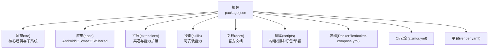
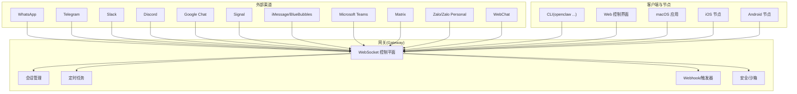
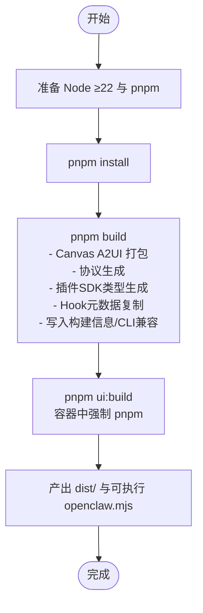
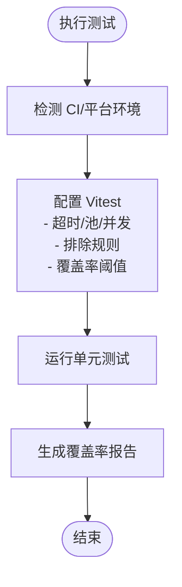
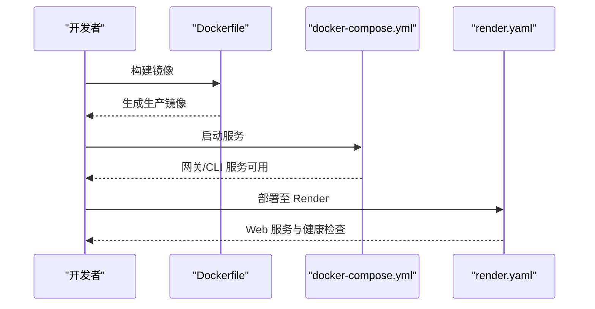
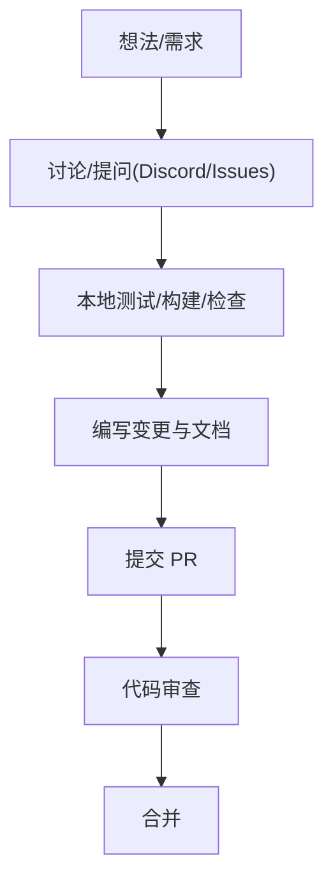
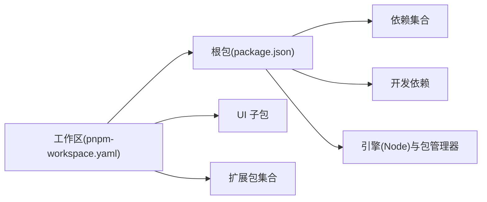

# 开发指南

<cite>
**本文引用的文件**
- [README.md](file://README.md)
- [CONTRIBUTING.md](file://CONTRIBUTING.md)
- [package.json](file://package.json)
- [tsconfig.json](file://tsconfig.json)
- [vitest.config.ts](file://vitest.config.ts)
- [.gitignore](file://.gitignore)
- [Dockerfile](file://Dockerfile)
- [docker-compose.yml](file://docker-compose.yml)
- [pnpm-workspace.yaml](file://pnpm-workspace.yaml)
- [zizmor.yml](file://zizmor.yml)
- [render.yaml](file://render.yaml)
</cite>

## 目录

1. [简介](#简介)
2. [项目结构](#项目结构)
3. [核心组件](#核心组件)
4. [架构总览](#架构总览)
5. [详细组件分析](#详细组件分析)
6. [依赖关系分析](#依赖关系分析)
7. [性能考量](#性能考量)
8. [故障排查指南](#故障排查指南)
9. [结论](#结论)
10. [附录](#附录)

## 简介

本开发指南面向希望参与 OpenClaw 项目的开发者，覆盖从环境搭建、代码结构、调试技巧到贡献流程与持续集成的完整开发工作流。OpenClaw 是一个在用户自有设备上运行的个人 AI 助手，支持多通道消息（如 WhatsApp、Telegram、Slack、Discord、Google Chat、Signal、iMessage、BlueBubbles、Microsoft Teams、Matrix、Zalo、Zalo Personal、WebChat）以及 macOS/iOS/Android 的语音唤醒与 Canvas 能力。其核心是“网关”（Gateway），作为会话、通道、工具与事件的控制平面。

## 项目结构

仓库采用多包工作区组织，核心目录与职责概览如下：

- 根包与 CLI：通过根级 package.json 提供统一脚本与构建入口，导出 openclaw 可执行命令与插件 SDK。
- 源码与子系统：src 下按功能域划分（agents、gateway、channels、cli、web、memory、plugins 等），形成清晰的分层与模块化。
- 应用与节点：apps 下包含 Android、iOS、macOS 应用与共享库，以及跨平台的 OpenClawKit。
- 扩展与技能：extensions 与 skills 提供可插拔的渠道与能力扩展。
- 文档与自动化：docs 存放官方文档；scripts 提供构建、测试、打包、部署等自动化脚本。
- 平台与容器：Dockerfile 与 docker-compose.yml 支持容器化部署；render.yaml 面向 Render 平台。

图示来源

- [package.json](file://package.json#L1-L219)
- [pnpm-workspace.yaml](file://pnpm-workspace.yaml#L1-L17)

章节来源

- [README.md](file://README.md#L1-L550)
- [package.json](file://package.json#L1-L219)
- [pnpm-workspace.yaml](file://pnpm-workspace.yaml#L1-L17)

## 核心组件

- 网关（Gateway）：WebSocket 控制平面，承载会话、通道、工具与事件，同时提供 Web 控制界面与远程访问能力。
- CLI：openclaw 命令行工具，提供 onboarding、gateway 启动、agent 对话、wizard、doctor 等能力。
- 渠道（Channels）：对多平台消息服务的适配器（Baileys、grammY、Bolt、discord.js、Chat API、signal-cli、BlueBubbles、iMessage、Matrix、Zalo、Zalo Personal、WebChat 等）。
- 工具与自动化：浏览器控制、Canvas/A2UI、节点（相机、屏幕录制、位置获取、通知）、定时任务与 Webhook 触发。
- 安全与沙箱：默认主会话工具在主机执行；群组/频道会话可通过 per-session Docker 沙箱隔离，限制允许/禁止列表。
- 运维与暴露：支持 Tailscale Serve/Funnel 或 SSH 隧道进行安全外联；提供 Doctor、日志与健康检查。

章节来源

- [README.md](file://README.md#L180-L473)

## 架构总览

下图展示从消息渠道到网关、再到客户端与节点的整体交互路径，以及远程访问与本地权限的边界。

图示来源

- [README.md](file://README.md#L180-L233)

章节来源

- [README.md](file://README.md#L180-L233)

## 详细组件分析

### 组件一：开发环境与构建系统

- 运行时与包管理：推荐 Node ≥22；优先使用 pnpm 构建；支持 Bun 直接运行 TypeScript（tsx）。
- 工作区：pnpm-workspace.yaml 定义多包布局，仅构建特定原生依赖，减少安装复杂度。
- 构建流程：根脚本负责 Canvas A2UI 打包、协议生成、插件 SDK 类型生成、Hook 元数据复制、构建信息写入与 CLI 兼容层生成。
- UI 构建：UI 子包独立构建，容器中强制使用 pnpm 以规避 ARM/Synology 架构兼容问题。
- 类型与装饰器：tsconfig.json 启用实验性装饰器与 legacy 行为，确保 Control UI 构建兼容。

图示来源

- [package.json](file://package.json#L33-L109)
- [Dockerfile](file://Dockerfile#L24-L30)
- [tsconfig.json](file://tsconfig.json#L7-L19)

章节来源

- [README.md](file://README.md#L87-L106)
- [package.json](file://package.json#L33-L109)
- [Dockerfile](file://Dockerfile#L1-L49)
- [tsconfig.json](file://tsconfig.json#L1-L28)

### 组件二：测试与覆盖率策略

- 测试框架：Vitest，支持 fork 池、超时与并发控制，CI 下自动调整 worker 数量。
- 覆盖率阈值：lines/functions/branches/statements ≥70%，排除入口与部分难以单元测试的集成面。
- 测试范围：包含 src 与 extensions 的测试文件，排除 macOS 应用、Live/E2E、进程桥接与交互式 UI。
- 并行执行：提供并行测试脚本与强制重试脚本，便于快速迭代。

图示来源

- [vitest.config.ts](file://vitest.config.ts#L12-L104)

章节来源

- [vitest.config.ts](file://vitest.config.ts#L1-L105)

### 组件三：容器化与部署

- 基础镜像：基于 node:22-bookworm，安装 Bun 与启用 Corepack。
- 构建步骤：复制依赖与脚本，pnpm 安装，pnpm build，UI 构建，设置非 root 用户运行。
- Compose 编排：提供 openclaw-gateway 与 openclaw-cli 两个服务，挂载配置与工作空间目录，端口映射与重启策略。
- 平台部署：render.yaml 定义 Web 服务、健康检查、环境变量与持久化磁盘。

图示来源

- [Dockerfile](file://Dockerfile#L1-L49)
- [docker-compose.yml](file://docker-compose.yml#L1-L47)
- [render.yaml](file://render.yaml#L1-L22)

章节来源

- [Dockerfile](file://Dockerfile#L1-L49)
- [docker-compose.yml](file://docker-compose.yml#L1-L47)
- [render.yaml](file://render.yaml#L1-L22)

### 组件四：贡献流程与代码规范

- 贡献入口：Issues 讨论、PR 提交；Discord 获取帮助；维护者列表与联系方式。
- PR 前准备：本地测试、构建、检查与 CI 通过；保持 PR 聚焦单一主题；描述变更动机。
- Control UI 装饰器：使用 legacy 装饰器风格，避免改动 tsconfig 导致 UI 构建工具链不兼容。
- AI/Vibe-coded PR：欢迎但需标注、说明测试程度、提供提示或会话日志，并确认理解代码。
- 安全披露：按组件归属仓库或邮件渠道提交漏洞报告，要求包含标题、严重性、影响、组件、复现、影响演示、环境与修复建议。

图示来源

- [CONTRIBUTING.md](file://CONTRIBUTING.md#L34-L112)

章节来源

- [CONTRIBUTING.md](file://CONTRIBUTING.md#L1-L112)

## 依赖关系分析

- 包管理与工作区：pnpm-workspace.yaml 定义根包、UI 子包与扩展包集合；onlyBuiltDependencies 列表限定需要原生编译的依赖。
- 根包依赖：包含 @mariozechner/pi-\*（Pi agent 核心/推理/TUI）、@whiskeysockets/baileys（WhatsApp Baileys）、grammy/discord.js 等渠道 SDK，以及 sqlite-vec、sharp、ws、yaml、zod 等通用库。
- 开发依赖：oxlint、tsdown、vitest、tsx 等工具链，配合 tsconfig 的装饰器与目标版本。
- 引擎与包管理器：Node ≥22.12.0，pnpm@10.23.0。

图示来源

- [package.json](file://package.json#L111-L186)
- [pnpm-workspace.yaml](file://pnpm-workspace.yaml#L1-L17)

章节来源

- [package.json](file://package.json#L111-L186)
- [pnpm-workspace.yaml](file://pnpm-workspace.yaml#L1-L17)

## 性能考量

- 令牌使用与上下文压缩：通过会话压缩与模型降级策略降低开销。
- 并发与资源：Vitest 在 CI 下按平台调整 worker 数量，提升测试吞吐。
- 构建与打包：仅构建必要原生依赖，减少安装时间与体积。
- 容器运行：非 root 用户、最小化安装与健康检查，提升安全性与稳定性。

[本节为通用指导，无需具体文件分析]

## 故障排查指南

- 安全与信任输入：默认将私信视为不受信任输入，建议使用配对策略或显式允许名单。
- 渠道连接：参考渠道文档与故障排查页面，定位连接与鉴权问题。
- 网关暴露：Tailscale Serve/Funnel 与 SSH 隧道的安全配置与密码认证。
- 日志与健康：使用 doctor、日志与健康检查接口定位问题。
- 本地权限：macOS 节点权限与 TCC 状态，以及会话内提升权限的开关。

章节来源

- [README.md](file://README.md#L107-L179)

## 结论

本开发指南围绕 OpenClaw 的开发环境、代码结构、测试与部署流程提供了系统化的指引。建议新贡献者先从 README 的“从源码开发”与“快速开始”入手，再结合 CONTRIBUTING 的流程与规范开展工作。通过 pnpm 工作区与 Docker 编排，团队可以高效地进行本地开发、测试与部署。

[本节为总结性内容，无需具体文件分析]

## 附录

### A. 开发工作流程（从零到运行）

- 克隆仓库与安装依赖
- 构建与 UI 构建
- 安装守护进程并启动网关
- 使用 CLI 发送消息或进入 agent 对话
- 修改代码后热更新（watch）

章节来源

- [README.md](file://README.md#L87-L106)
- [package.json](file://package.json#L33-L109)

### B. 代码规范与格式化

- 代码格式：oxfmt（TypeScript/JS/TSX），Swift 格式：swiftformat。
- 文档格式：oxfmt（Markdown）。
- Lint：oxlint（TypeScript/JS/TSX），Swift Lint：swiftlint。
- Git 钩子：pre-commit 自动运行 Node 工具脚本。

章节来源

- [package.json](file://package.json#L49-L67)
- [.gitignore](file://.gitignore#L1-L86)
- [zizmor.yml](file://zizmor.yml#L1-L18)

### C. 持续集成与安全

- CI：GitHub Actions（状态徽章可见于 README）。
- 代码扫描：zizmor 配置禁用若干规则，聚焦高置信度发现。
- 依赖锁定：pnpm-lock.yaml 与 overrides 确保依赖一致性。

章节来源

- [README.md](file://README.md#L15-L18)
- [zizmor.yml](file://zizmor.yml#L1-L18)
- [package.json](file://package.json#L196-L217)

### D. 新贡献者入门清单

- 阅读贡献指南与维护者信息
- 准备 Node ≥22 与 pnpm
- 运行 pnpm install、build、ui:build
- 启动网关与 CLI，体验 onboarding
- 提交 PR 前确保测试与格式化通过

章节来源

- [CONTRIBUTING.md](file://CONTRIBUTING.md#L34-L75)
- [README.md](file://README.md#L87-L106)
- [package.json](file://package.json#L41-L53)
