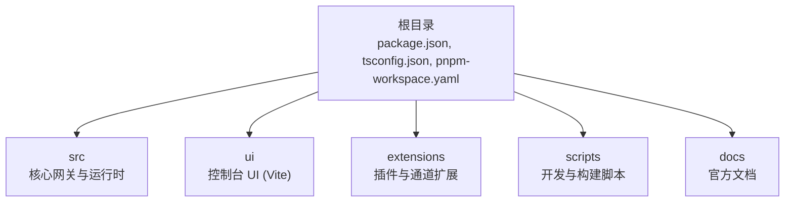
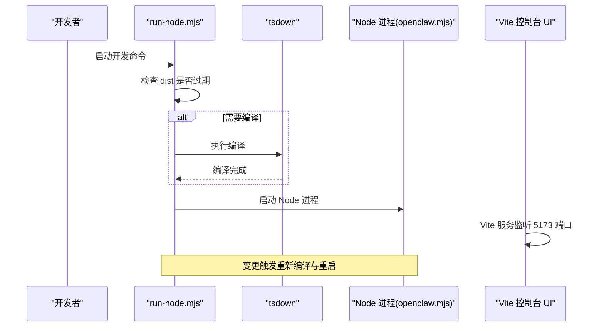
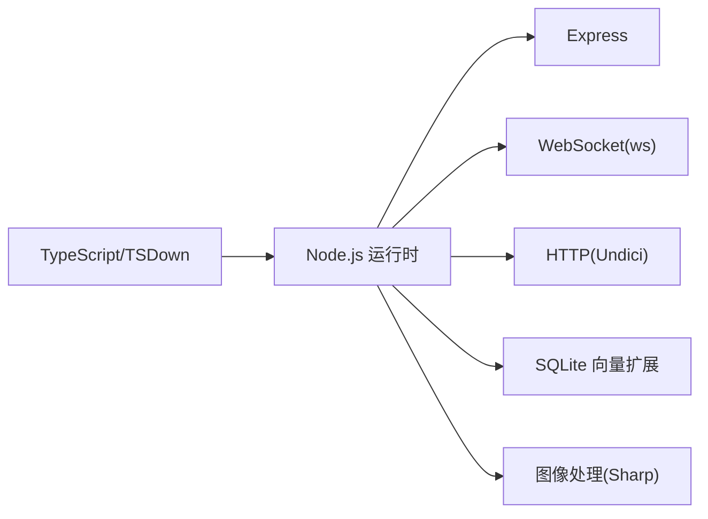

# 开发环境搭建

<cite>
**本文档引用的文件**
- [package.json](file://package.json)
- [.env.example](file://.env.example)
- [tsconfig.json](file://tsconfig.json)
- [pnpm-workspace.yaml](file://pnpm-workspace.yaml)
- [ui/package.json](file://ui/package.json)
- [ui/vite.config.ts](file://ui/vite.config.ts)
- [scripts/run-node.mjs](file://scripts/run-node.mjs)
- [scripts/watch-node.mjs](file://scripts/watch-node.mjs)
- [docker-compose.yml](file://docker-compose.yml)
- [Dockerfile](file://Dockerfile)
- [docs/help/environment.md](file://docs/help/environment.md)
- [docs/install/node.md](file://docs/install/node.md)
- [docs/platforms/windows.md](file://docs/platforms/windows.md)
- [docs/platforms/macos.md](file://docs/platforms/macos.md)
- [docs/platforms/linux.md](file://docs/platforms/linux.md)
- [README.md](file://README.md)
</cite>

## 目录

1. [简介](#简介)
2. [项目结构](#项目结构)
3. [核心组件](#核心组件)
4. [架构总览](#架构总览)
5. [详细组件分析](#详细组件分析)
6. [依赖关系分析](#依赖关系分析)
7. [性能考虑](#性能考虑)
8. [故障排除指南](#故障排除指南)
9. [结论](#结论)
10. [附录](#附录)

## 简介

本指南面向在本地开发 OpenClaw 的工程师与贡献者，目标是帮助你在 Windows、macOS、Linux 上快速完成开发环境搭建，涵盖 Node.js 版本要求、包管理器选择（pnpm vs npm）、TypeScript 配置与 IDE 设置、开发工具链安装（VS Code 扩展、调试配置、热重载）、本地开发服务器与数据库准备、环境变量与证书配置、网络与端口规划，以及常见问题解决方案。

## 项目结构

OpenClaw 采用多包工作区结构，核心由 Node.js 运行时驱动，配合 Vite 控制台 UI、插件生态与扩展模块组成。关键目录与职责概览：

- 根目录：项目根配置、脚本与文档
- src：核心网关与运行时逻辑（TypeScript）
- ui：控制台 UI（Vite + Lit）
- extensions：可插拔通道与技能扩展
- scripts：开发与构建辅助脚本
- docs：官方文档（环境变量、平台支持等）

图表来源

- [package.json](file://package.json#L1-L219)
- [pnpm-workspace.yaml](file://pnpm-workspace.yaml#L1-L17)

章节来源

- [package.json](file://package.json#L1-L219)
- [pnpm-workspace.yaml](file://pnpm-workspace.yaml#L1-L17)

## 核心组件

- Node.js 运行时与引擎要求：Node >= 22.12.0
- 包管理器：推荐使用 pnpm（工作区与锁定文件支持更佳）
- TypeScript 编译与类型检查：tsconfig.json 定义严格模式与路径映射
- 控制台 UI：Vite 构建，端口 5173，默认对外暴露
- 开发脚本：run-node.mjs 与 watch-node.mjs 提供自动编译与热重载
- 环境变量：.env.example 提供示例键值；docs/help/environment.md 描述加载顺序与优先级
- 容器化：Dockerfile 与 docker-compose.yml 支持容器内开发与部署

章节来源

- [package.json](file://package.json#L192-L196)
- [tsconfig.json](file://tsconfig.json#L1-L28)
- [ui/vite.config.ts](file://ui/vite.config.ts#L1-L42)
- [scripts/run-node.mjs](file://scripts/run-node.mjs#L1-L159)
- [scripts/watch-node.mjs](file://scripts/watch-node.mjs#L1-L60)
- [.env.example](file://.env.example#L1-L71)
- [docs/help/environment.md](file://docs/help/environment.md#L1-L108)
- [Dockerfile](file://Dockerfile#L1-L49)
- [docker-compose.yml](file://docker-compose.yml#L1-L47)

## 架构总览

下图展示开发时的典型交互：开发者通过 VS Code 或终端启动 run-node.mjs，它负责检测源码变更并调用 tsdown 编译到 dist，随后以 Node 进程运行 openclaw.mjs；同时 Vite 控制台 UI 在 5173 端口提供前端界面。

图表来源

- [scripts/run-node.mjs](file://scripts/run-node.mjs#L77-L101)
- [scripts/run-node.mjs](file://scripts/run-node.mjs#L135-L159)
- [ui/vite.config.ts](file://ui/vite.config.ts#L35-L40)

## 详细组件分析

### Node.js 与包管理器

- Node.js 版本要求：引擎字段明确要求 Node >= 22.12.0
- 推荐包管理器：pnpm（工作区、锁定文件、仅构建依赖优化）
- npm 也可用，但建议与 pnpm 保持一致的依赖解析策略

章节来源

- [package.json](file://package.json#L192-L196)
- [package.json](file://package.json#L195-L196)

### TypeScript 配置与 IDE 设置

- 严格模式与目标：ES2023，NodeNext 模块与解析
- 路径映射：支持 openclaw/plugin-sdk 别名
- 类型声明：启用声明输出，便于插件 SDK 开发
- 建议的 VS Code 设置：
  - 启用“在工作区打开”以应用 tsconfig.json
  - 使用“TypeScript 和 JavaScript 开发人员”扩展
  - 关闭“JavaScript 诊断”或切换为“类型检查”，避免重复告警
  - 在设置中启用“自动导入”和“快速修复”

章节来源

- [tsconfig.json](file://tsconfig.json#L1-L28)

### 开发工具链与 VS Code 推荐

- 必装扩展：
  - ESLint（oxlint 规则已集成）
  - Prettier（oxfmt 已配置格式化规则）
  - TypeScript Importer（自动导入）
  - EditorConfig（统一缩进与换行）
- 调试配置：
  - 使用 VS Code 的“运行与调试”面板添加 Node 配置，指向 openclaw.mjs
  - 可选：为 UI 添加浏览器调试配置（Vite）
- 热重载：
  - 使用 scripts/watch-node.mjs 同时监听编译与 Node 进程，实现热重载
  - UI 层面：Vite 默认热更新，端口 5173

章节来源

- [scripts/watch-node.mjs](file://scripts/watch-node.mjs#L26-L30)
- [ui/vite.config.ts](file://ui/vite.config.ts#L35-L40)

### 本地开发服务器与 UI

- UI 服务：Vite 默认监听 5173 端口，host:true 允许局域网访问
- UI 构建：输出至 dist/control-ui，开启 SourceMap
- 基础路径：可通过环境变量 OPENCLAW_CONTROL_UI_BASE_PATH 自定义（末尾带斜杠）

章节来源

- [ui/vite.config.ts](file://ui/vite.config.ts#L22-L41)
- [ui/package.json](file://ui/package.json#L1-L24)

### 环境变量与证书配置

- 环境变量加载顺序（高到低）：进程环境、当前目录 .env、全局 ~/.openclaw/.env、配置文件中的 env 块、可选的 shell 导入
- 关键变量示例：网关令牌、模型提供商密钥、通道令牌、工具与语音相关 API Key
- 证书与安全：
  - 网关默认绑定回环地址，如需外网访问，建议使用 Tailscale 或 SSH 隧道
  - 文档中提供了 Tailscale Serve/Funnel 的配置要点与注意事项

章节来源

- [.env.example](file://.env.example#L1-L71)
- [docs/help/environment.md](file://docs/help/environment.md#L14-L22)
- [README.md](file://README.md#L208-L224)

### 网络与端口规划

- 网关默认端口：18789（WebSocket 控制面）
- UI 端口：5173（Vite）
- 容器端口映射：docker-compose 将宿主端口映射到容器端口，便于外部访问
- 远程访问：支持 Tailscale Serve/Funnel 或 SSH 隧道

章节来源

- [docker-compose.yml](file://docker-compose.yml#L14-L28)
- [ui/vite.config.ts](file://ui/vite.config.ts#L35-L40)
- [README.md](file://README.md#L208-L224)

### 数据库与系统依赖

- SQLite 向量扩展：sqlite-vec 用于向量检索（随依赖安装）
- Sharp 图像处理：用于图片处理能力
- Node-pty：用于终端仿真（跨平台）
- 本地开发无需额外数据库实例，sqlite 文件位于状态目录

章节来源

- [package.json](file://package.json#L157-L158)
- [package.json](file://package.json#L155-L156)
- [package.json](file://package.json#L121-L121)

### 不同操作系统安装步骤

#### Windows（WSL2）

- 推荐通过 WSL2（Ubuntu）安装，获得完整的 Linux 开发体验
- 步骤概览：
  - 安装 WSL2 并设置 Ubuntu
  - 在 WSL 内启用 systemd（用于服务安装）
  - 安装 Node 22+、pnpm
  - 克隆仓库、安装依赖、构建 UI 与核心
  - 运行 openclaw onboard 完成初始化
- 高级：将 WSL 服务暴露到局域网（端口转发），并配置防火墙

章节来源

- [docs/platforms/windows.md](file://docs/platforms/windows.md#L19-L102)
- [docs/platforms/windows.md](file://docs/platforms/windows.md#L103-L154)

#### macOS

- 支持 macOS 应用作为菜单栏伴侣，负责权限与节点桥接
- 开发流程：
  - 安装 Node 22+、pnpm
  - 安装依赖、构建 UI 与核心
  - 使用 openclaw onboard 完成初始化
  - 如需远程模式，可借助 SSH 隧道连接远程网关
- 注意：macOS 应用涉及 TCC 权限，首次运行会弹出授权提示

章节来源

- [docs/platforms/macos.md](file://docs/platforms/macos.md#L9-L66)
- [docs/platforms/macos.md](file://docs/platforms/macos.md#L142-L176)

#### Linux

- Linux 原生支持，推荐使用 Node 22
- 安装方式：包管理器或版本管理器（nvm/fnm/mise）
- 服务安装：systemd 用户服务或系统服务（按需选择）
- 快速路径：通过 VPS 一键 SSH 隧道访问网关

章节来源

- [docs/platforms/linux.md](file://docs/platforms/linux.md#L1-L95)

### Node.js 安装与 PATH 问题排查

- 检查版本：确保 node -v 输出 v22.x 或更高
- 若出现 openclaw 命令未找到：
  - 查找 npm prefix -g 并将其加入 PATH
  - 在 zsh/bash 中执行 rehash/hash -r 使新 PATH 生效
- Linux 权限错误：将 npm 全局前缀改为用户可写目录，并导出 PATH

章节来源

- [docs/install/node.md](file://docs/install/node.md#L14-L21)
- [docs/install/node.md](file://docs/install/node.md#L91-L126)

## 依赖关系分析

- 核心运行时依赖：Express、ws、Undici、SQLite 向量扩展、Sharp 等
- 类型与工具：TypeScript、tsdown、tsx、Vitest、Vite
- 插件与通道：Telegram、Discord、Slack、Signal、Matrix、Zalo 等生态 SDK
- 仅构建依赖：@napi-rs/canvas、node-llama-cpp、@whiskeysockets/baileys 等

图表来源

- [package.json](file://package.json#L111-L164)
- [package.json](file://package.json#L175-L187)

章节来源

- [package.json](file://package.json#L111-L187)

## 性能考虑

- 使用 pnpm 以减少磁盘占用与安装时间
- 仅构建依赖（onlyBuiltDependencies）避免不必要的原生模块安装
- UI 构建强制使用 pnpm（OPENCLAW_PREFER_PNPM=1）以提升稳定性
- 开发阶段启用 SourceMap 便于调试，生产关闭以减小体积

章节来源

- [package.json](file://package.json#L196-L217)
- [Dockerfile](file://Dockerfile#L28-L30)
- [ui/vite.config.ts](file://ui/vite.config.ts#L32-L34)

## 故障排除指南

- openclaw 命令未找到
  - 检查 npm prefix -g 输出是否在 PATH 中
  - 在 zsh/bash 中执行 rehash/hash -r
- 权限错误（Linux）
  - 将 npm 全局前缀改为用户可写目录并导出 PATH
- 网关无法从外网访问
  - 使用 Tailscale Serve/Funnel 或 SSH 隧道
  - 确认网关绑定为 loopback，且认证模式正确
- WSL 端口转发
  - 使用 netsh interface portproxy 配置端口转发
  - 重启后刷新规则

章节来源

- [docs/install/node.md](file://docs/install/node.md#L91-L139)
- [README.md](file://README.md#L208-L224)
- [docs/platforms/windows.md](file://docs/platforms/windows.md#L58-L102)

## 结论

通过遵循本指南，你可以在 Windows（WSL2）、macOS、Linux 上完成 OpenClaw 的开发环境搭建。重点在于满足 Node.js 版本要求、使用 pnpm 管理依赖、正确配置 TypeScript 与 IDE、理解环境变量加载顺序、合理规划网络与端口，并利用容器化与隧道技术实现安全的远程访问。遇到问题时，可参考故障排除章节进行定位与修复。

## 附录

### 常用开发命令速查

- 安装依赖：pnpm install
- 构建 UI：pnpm ui:build
- 构建核心：pnpm build
- 启动开发（自动编译）：pnpm dev
- 启动开发（监听模式）：pnpm gateway:watch
- 启动 UI 开发：pnpm ui:dev
- 测试：pnpm test 或 pnpm test:fast
- 文档开发：pnpm docs:dev

章节来源

- [package.json](file://package.json#L33-L109)
