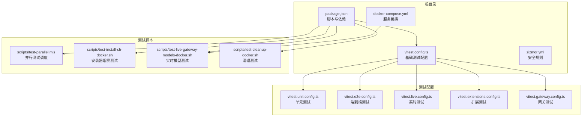
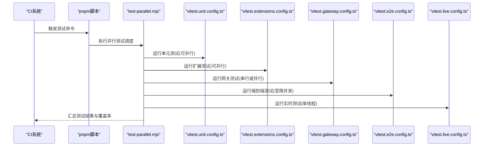
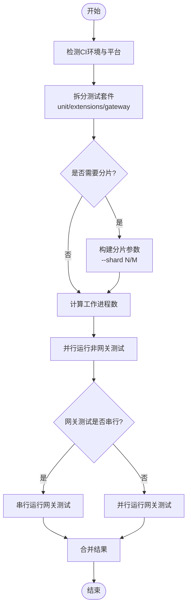
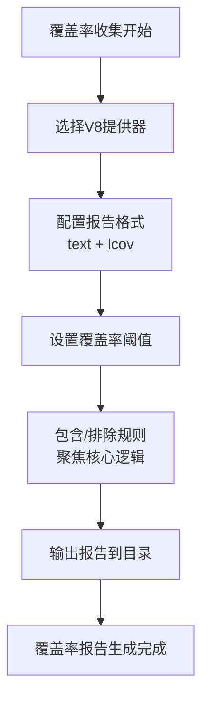
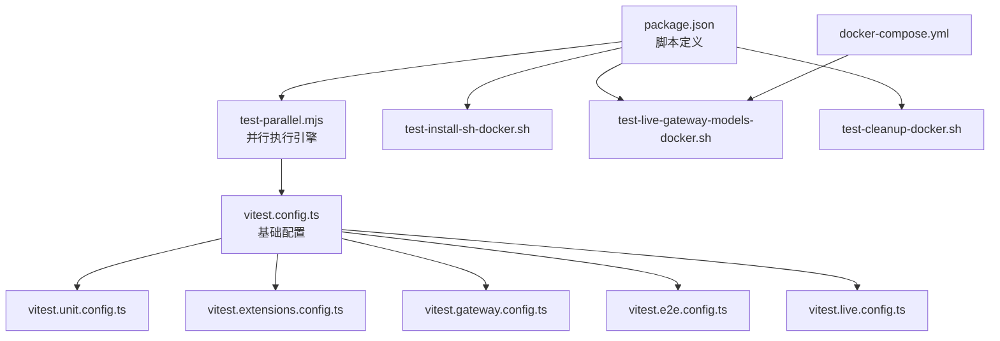

# CI/CD测试流程

<cite>
**本文档引用的文件**
- [vitest.config.ts](file://vitest.config.ts)
- [package.json](file://package.json)
- [scripts/test-parallel.mjs](file://scripts/test-parallel.mjs)
- [vitest.unit.config.ts](file://vitest.unit.config.ts)
- [vitest.e2e.config.ts](file://vitest.e2e.config.ts)
- [vitest.live.config.ts](file://vitest.live.config.ts)
- [vitest.extensions.config.ts](file://vitest.extensions.config.ts)
- [vitest.gateway.config.ts](file://vitest.gateway.config.ts)
- [docker-compose.yml](file://docker-compose.yml)
- [scripts/test-cleanup-docker.sh](file://scripts/test-cleanup-docker.sh)
- [scripts/test-install-sh-docker.sh](file://scripts/test-install-sh-docker.sh)
- [scripts/test-live-gateway-models-docker.sh](file://scripts/test-live-gateway-models-docker.sh)
- [zizmor.yml](file://zizmor.yml)
</cite>

## 目录

1. [简介](#简介)
2. [项目结构](#项目结构)
3. [核心组件](#核心组件)
4. [架构概览](#架构概览)
5. [详细组件分析](#详细组件分析)
6. [依赖关系分析](#依赖关系分析)
7. [性能考虑](#性能考虑)
8. [故障排除指南](#故障排除指南)
9. [结论](#结论)
10. [附录](#附录)

## 简介

本文件详细阐述OpenClaw项目的持续集成与持续部署(CI/CD)测试流程。内容涵盖测试执行策略（并行化、缓存优化、失败重试）、测试覆盖率收集与报告生成、多环境测试配置与部署策略、性能基准测试与回归测试实施方法，以及实际的CI/CD流水线配置与最佳实践。

## 项目结构

OpenClaw采用Monorepo结构，包含多个平台应用（Android、iOS、macOS）与共享库，同时提供丰富的测试配置与脚本以支持CI/CD流水线。

**图表来源**

- [package.json](file://package.json#L33-L109)
- [vitest.config.ts](file://vitest.config.ts#L12-L104)
- [scripts/test-parallel.mjs](file://scripts/test-parallel.mjs#L38-L90)

**章节来源**

- [package.json](file://package.json#L1-L219)
- [vitest.config.ts](file://vitest.config.ts#L1-L105)

## 核心组件

本节深入分析CI/CD测试流程的核心组件，包括测试配置、并行执行策略、覆盖率收集与报告生成。

- 基础测试配置：定义全局超时、工作进程数、覆盖范围与排除规则，支持CI环境自动检测与Windows特殊处理。
- 多配置分层：针对单元测试、端到端测试、实时测试、扩展测试与网关测试分别提供独立配置，确保测试隔离与针对性。
- 并行执行引擎：通过自定义脚本实现跨测试套件的并行执行，支持分片、工作进程数控制与报告输出。
- 覆盖率与报告：启用V8覆盖率提供器，生成文本与LCov报告，设置阈值以保证代码质量。

**章节来源**

- [vitest.config.ts](file://vitest.config.ts#L12-L104)
- [vitest.unit.config.ts](file://vitest.unit.config.ts#L1-L20)
- [vitest.e2e.config.ts](file://vitest.e2e.config.ts#L1-L21)
- [vitest.live.config.ts](file://vitest.live.config.ts#L1-L16)
- [vitest.extensions.config.ts](file://vitest.extensions.config.ts#L1-L15)
- [vitest.gateway.config.ts](file://vitest.gateway.config.ts#L1-L15)

## 架构概览

下图展示了CI/CD测试流程的整体架构，从脚本入口到各测试套件的执行路径，以及容器化测试环境的集成。

**图表来源**

- [package.json](file://package.json#L82-L109)
- [scripts/test-parallel.mjs](file://scripts/test-parallel.mjs#L38-L90)
- [vitest.unit.config.ts](file://vitest.unit.config.ts#L12-L19)
- [vitest.extensions.config.ts](file://vitest.extensions.config.ts#L7-L14)
- [vitest.gateway.config.ts](file://vitest.gateway.config.ts#L7-L14)
- [vitest.e2e.config.ts](file://vitest.e2e.config.ts#L12-L20)
- [vitest.live.config.ts](file://vitest.live.config.ts#L7-L15)

## 详细组件分析

### 测试并行化策略

OpenClaw通过自定义并行执行脚本实现高效的测试调度，支持以下特性：

- 分类执行：将测试分为单元测试、扩展测试与网关测试三类，分别运行以提升吞吐量。
- 工作进程动态调整：根据CI环境与平台自动选择工作进程数，避免资源争用。
- 分片执行：在Windows CI上默认分片为2，可通过环境变量覆盖；支持报告输出到指定目录。
- 串行与并行混合：网关测试默认串行，可在CI中通过环境变量选择并行，平衡稳定性与速度。

**图表来源**

- [scripts/test-parallel.mjs](file://scripts/test-parallel.mjs#L38-L141)
- [scripts/test-parallel.mjs](file://scripts/test-parallel.mjs#L220-L232)

**章节来源**

- [scripts/test-parallel.mjs](file://scripts/test-parallel.mjs#L31-L141)
- [scripts/test-parallel.mjs](file://scripts/test-parallel.mjs#L188-L232)

### 缓存优化机制

项目通过以下方式优化测试缓存与执行效率：

- Vitest内置缓存：利用Vitest的文件变更检测与缓存机制减少重复执行时间。
- 配置别名与解析：通过路径别名减少模块解析开销，提升启动速度。
- 排除策略：排除大型或不必要目录（如dist、vendor、node_modules）以降低扫描成本。
- 容器化缓存：Docker镜像构建与卷挂载支持缓存复用，加速CI执行。

**章节来源**

- [vitest.config.ts](file://vitest.config.ts#L13-L17)
- [vitest.config.ts](file://vitest.config.ts#L25-L34)
- [docker-compose.yml](file://docker-compose.yml#L11-L13)

### 失败重试与容错

当前配置未直接实现自动重试机制，但提供了以下容错能力：

- Windows CI特殊处理：在Windows CI上使用危险忽略未处理错误标志，避免偶发异常导致任务中断。
- 信号处理：捕获SIGINT与SIGTERM信号，优雅终止子进程，便于CI中断场景。
- 分片容错：分片执行中任一分片失败即停止后续分片，保证CI结果一致性。

**章节来源**

- [scripts/test-parallel.mjs](file://scripts/test-parallel.mjs#L97-L100)
- [scripts/test-parallel.mjs](file://scripts/test-parallel.mjs#L234-L242)
- [scripts/test-parallel.mjs](file://scripts/test-parallel.mjs#L224-L231)

### 测试覆盖率收集与报告生成

覆盖率收集通过V8提供器实现，支持多种报告格式：

- 报告格式：文本与LCov，便于本地查看与CI系统集成。
- 阈值控制：设置行、函数、分支与语句的覆盖率阈值，确保关键代码得到充分验证。
- 排除策略：排除入口点、CLI、守护进程、交互式界面与部分集成面，聚焦核心逻辑。
- 输出目录：支持通过环境变量指定报告输出目录，便于CI归档。

**图表来源**

- [vitest.config.ts](file://vitest.config.ts#L35-L102)

**章节来源**

- [vitest.config.ts](file://vitest.config.ts#L35-L102)

### 不同环境下的测试配置与部署策略

- 开发环境：本地开发时最大化并行度，使用默认工作进程数，禁用静默通过日志以便调试。
- CI环境（Linux/macOS）：优先使用Vitest默认工作进程数，避免跨测试干扰；macOS CI限制为1个工作进程以防止内存溢出。
- CI环境（Windows）：默认分片为2，支持通过环境变量覆盖；使用危险忽略未处理错误标志增强稳定性。
- 容器化测试：通过Docker Compose与专用脚本实现安装器烟雾测试、实时模型测试与清理测试，确保部署一致性。

**章节来源**

- [scripts/test-parallel.mjs](file://scripts/test-parallel.mjs#L114-L141)
- [scripts/test-parallel.mjs](file://scripts/test-parallel.mjs#L92-L96)
- [scripts/test-install-sh-docker.sh](file://scripts/test-install-sh-docker.sh#L1-L71)
- [scripts/test-live-gateway-models-docker.sh](file://scripts/test-live-gateway-models-docker.sh#L1-L33)
- [scripts/test-cleanup-docker.sh](file://scripts/test-cleanup-docker.sh#L1-L15)
- [docker-compose.yml](file://docker-compose.yml#L1-L47)

### 性能基准测试与回归测试

- 性能基准：通过实时测试配置（单工作进程）与受限并发的端到端测试，评估关键路径性能。
- 回归测试：利用分片执行与并行策略，在CI中快速发现回归问题；结合覆盖率阈值确保回归检测覆盖面。
- 模型测试：实时网关模型测试脚本支持多提供商与超时配置，验证模型调用稳定性。

**章节来源**

- [vitest.live.config.ts](file://vitest.live.config.ts#L7-L15)
- [vitest.e2e.config.ts](file://vitest.e2e.config.ts#L5-L7)
- [scripts/test-live-gateway-models-docker.sh](file://scripts/test-live-gateway-models-docker.sh#L24-L27)

### 实际CI/CD流水线配置与最佳实践

- 脚本入口：通过package.json中的test脚本统一触发并行测试调度。
- 安全规则：zizmor配置用于GitHub Actions安全检查，禁用过度权限等规则以提升安全性。
- 最佳实践：
  - 在Windows CI上使用分片执行，避免长时间无输出。
  - 使用环境变量控制工作进程数与报告输出目录，提升CI可观察性。
  - 将容器化测试作为部署前验证的重要环节，确保生产环境一致性。

**章节来源**

- [package.json](file://package.json#L82)
- [zizmor.yml](file://zizmor.yml#L1-L18)

## 依赖关系分析

测试配置与脚本之间存在清晰的依赖关系，确保测试执行的正确性与可维护性。

**图表来源**

- [package.json](file://package.json#L33-L109)
- [scripts/test-parallel.mjs](file://scripts/test-parallel.mjs#L1-L5)
- [vitest.config.ts](file://vitest.config.ts#L1-L10)
- [docker-compose.yml](file://docker-compose.yml#L1-L47)

**章节来源**

- [package.json](file://package.json#L33-L109)
- [scripts/test-parallel.mjs](file://scripts/test-parallel.mjs#L1-L5)

## 性能考虑

- 并行度权衡：在CI环境中优先稳定性，本地开发时提升并行度以缩短反馈周期。
- 内存管理：macOS CI限制工作进程数，避免内存溢出；Windows CI使用分片降低峰值内存占用。
- I/O优化：通过排除大型目录与使用容器化缓存，减少磁盘I/O与网络下载时间。
- 报告生成：仅在需要时生成LCov报告，避免不必要的CPU与磁盘消耗。

## 故障排除指南

- Windows CI不稳定：启用危险忽略未处理错误标志，检查NODE_OPTIONS配置。
- macOS内存溢出：限制工作进程数为1，检查系统内存与虚拟内存设置。
- 测试超时：调整基础配置中的测试超时与钩子超时，确保复杂测试有足够时间完成。
- 容器化测试失败：检查Docker镜像构建上下文与卷挂载，确认环境变量正确传递。

**章节来源**

- [scripts/test-parallel.mjs](file://scripts/test-parallel.mjs#L97-L100)
- [scripts/test-parallel.mjs](file://scripts/test-parallel.mjs#L128-L129)
- [vitest.config.ts](file://vitest.config.ts#L19-L21)

## 结论

OpenClaw的CI/CD测试流程通过分层配置、智能并行与容器化验证，实现了高效、稳定且可扩展的测试体系。结合覆盖率阈值与分片执行，能够在保证质量的同时显著缩短CI时间。建议在现有基础上进一步引入自动重试与更细粒度的缓存策略，以进一步提升CI稳定性与效率。

## 附录

- 环境变量参考：
  - OPENCLAW_TEST_VM_FORKS：控制是否使用vmForks池
  - OPENCLAW_TEST_SHARDS：分片数量
  - OPENCLAW_TEST_WORKERS：强制工作进程数
  - OPENCLAW_TEST_SERIAL_GATEWAY：网关测试串行开关
  - OPENCLAW_TEST_PARALLEL_GATEWAY：网关测试并行开关
  - OPENCLAW_VITEST_REPORT_DIR：报告输出目录
  - OPENCLAW_TEST_SHOW_PASSED_LOGS：显示通过日志
  - OPENCLAW_INSTALL_SMOKE_IMAGE：安装器烟雾测试镜像
  - OPENCLAW_LIVE_TEST：实时测试开关
  - OPENCLAW_LIVE_GATEWAY_MODELS：实时网关模型
  - OPENCLAW_LIVE_GATEWAY_PROVIDERS：实时网关提供商
  - OPENCLAW_LIVE_GATEWAY_MODEL_TIMEOUT_MS：实时模型超时

**章节来源**

- [scripts/test-parallel.mjs](file://scripts/test-parallel.mjs#L91-L105)
- [scripts/test-parallel.mjs](file://scripts/test-parallel.mjs#L149-L186)
- [scripts/test-install-sh-docker.sh](file://scripts/test-install-sh-docker.sh#L4-L8)
- [scripts/test-live-gateway-models-docker.sh](file://scripts/test-live-gateway-models-docker.sh#L5-L8)
- [scripts/test-live-gateway-models-docker.sh](file://scripts/test-live-gateway-models-docker.sh#L24-L27)
