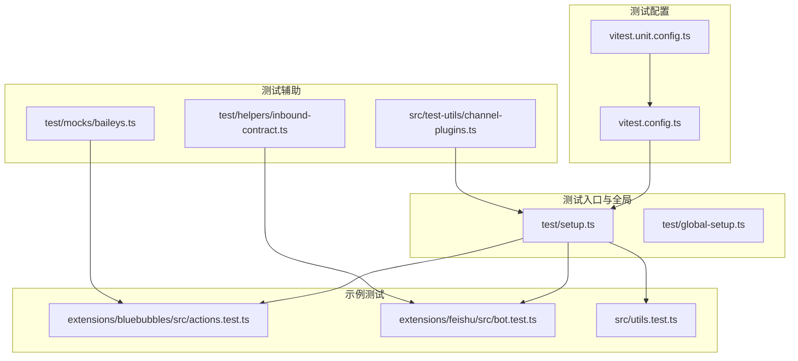
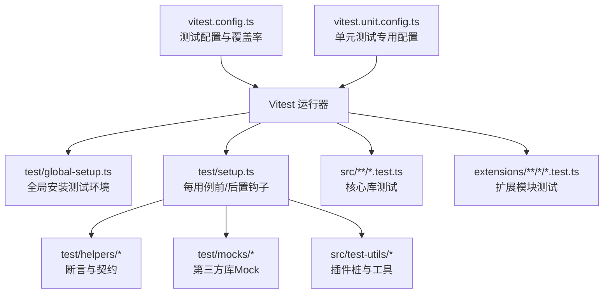
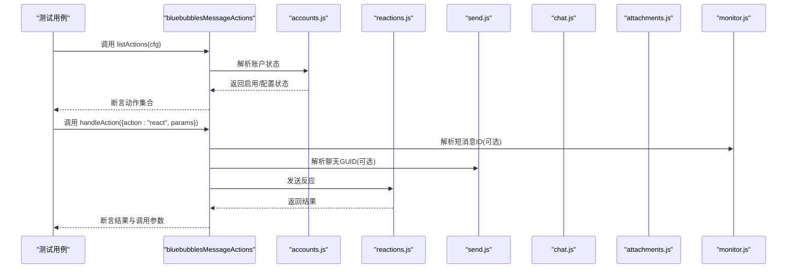
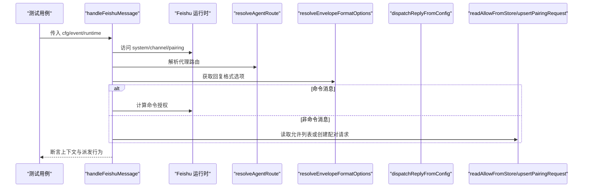
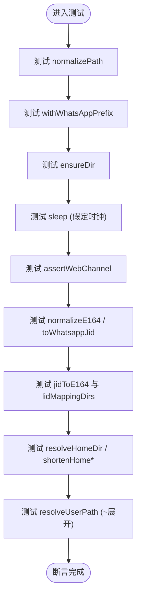
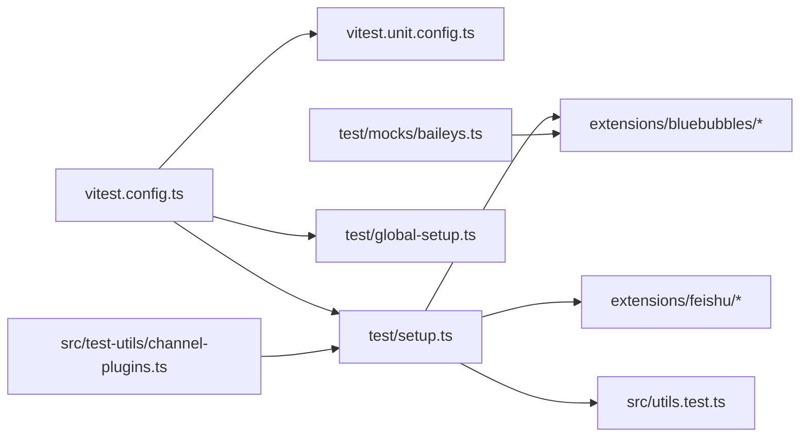

# 单元测试

<cite>
**本文引用的文件**
- [vitest.config.ts](file://vitest.config.ts)
- [vitest.unit.config.ts](file://vitest.unit.config.ts)
- [setup.ts](file://test/setup.ts)
- [global-setup.ts](file://test/global-setup.ts)
- [inbound-contract.ts](file://test/helpers/inbound-contract.ts)
- [baileys.ts](file://test/mocks/baileys.ts)
- [channel-plugins.ts](file://src/test-utils/channel-plugins.ts)
- [actions.test.ts](file://extensions/bluebubbles/src/actions.test.ts)
- [bot.test.ts](file://extensions/feishu/src/bot.test.ts)
- [utils.test.ts](file://src/utils.test.ts)
</cite>

## 目录

1. [引言](#引言)
2. [项目结构](#项目结构)
3. [核心组件](#核心组件)
4. [架构总览](#架构总览)
5. [详细组件分析](#详细组件分析)
6. [依赖分析](#依赖分析)
7. [性能考量](#性能考量)
8. [故障排查指南](#故障排查指南)
9. [结论](#结论)
10. [附录](#附录)

## 引言

本指南面向OpenClaw的开发者与贡献者，系统性阐述单元测试的编写原则、最佳实践与工程化落地方式。内容覆盖测试用例设计、断言方法、测试数据准备、常用测试工具与辅助函数、Mock对象与依赖注入、测试覆盖率与质量标准，以及典型测试模式与示例。目标是帮助团队在保持高质量的同时提升测试效率与可维护性。

## 项目结构

OpenClaw采用Vitest作为测试运行器，并通过配置文件统一管理测试范围、覆盖率阈值与执行环境。测试文件主要分布在以下位置：

- 核心库单元测试：src/\*_/_.test.ts
- 扩展模块单元测试：extensions/\*_/_/\*.test.ts
- 测试辅助与全局设置：test/ 下的 setup.ts、helpers、mocks 等
- 测试工具与插件桩：src/test-utils 下的工具函数

图表来源

- [vitest.config.ts](file://vitest.config.ts#L18-L34)
- [vitest.unit.config.ts](file://vitest.unit.config.ts#L12-L18)
- [setup.ts](file://test/setup.ts#L160-L168)
- [inbound-contract.ts](file://test/helpers/inbound-contract.ts#L7-L19)
- [baileys.ts](file://test/mocks/baileys.ts#L24-L67)
- [channel-plugins.ts](file://src/test-utils/channel-plugins.ts#L11-L25)
- [actions.test.ts](file://extensions/bluebubbles/src/actions.test.ts#L44-L97)
- [bot.test.ts](file://extensions/feishu/src/bot.test.ts#L28-L117)
- [utils.test.ts](file://src/utils.test.ts#L23-L60)

章节来源

- [vitest.config.ts](file://vitest.config.ts#L18-L34)
- [vitest.unit.config.ts](file://vitest.unit.config.ts#L12-L18)
- [setup.ts](file://test/setup.ts#L1-L169)

## 核心组件

- 测试运行与配置
  - 统一测试超时、钩子超时、进程池与并发工作线程数策略，确保跨平台稳定性。
  - 覆盖率提供者为v8，报告器包含文本与lcov；设定行、函数、分支、语句阈值。
  - 排除入口与集成面（如CLI、网关服务、浏览器通道等），聚焦纯逻辑与工具层。
- 全局测试环境
  - 安装进程警告过滤、隔离测试家目录、安装默认插件注册表。
  - 每个测试前后重置插件注册表并恢复真实计时器，避免跨用例污染。
- 测试辅助与工具
  - 插件桩工厂：快速构建通道插件与出站适配器，便于模拟不同渠道行为。
  - 输入契约断言：对入站消息上下文进行一致性校验，保障消息处理前置条件。
  - Mock工具：封装第三方库（如Baileys）的Mock类型与实例，便于事件驱动与异步交互验证。

章节来源

- [vitest.config.ts](file://vitest.config.ts#L18-L102)
- [setup.ts](file://test/setup.ts#L13-L168)
- [channel-plugins.ts](file://src/test-utils/channel-plugins.ts#L11-L105)
- [inbound-contract.ts](file://test/helpers/inbound-contract.ts#L7-L19)
- [baileys.ts](file://test/mocks/baileys.ts#L24-L67)

## 架构总览

下图展示了单元测试在OpenClaw中的整体架构：配置驱动测试发现与执行，全局设置负责环境初始化与清理，测试用例通过Mock与工具函数隔离外部依赖，断言与辅助函数保证测试质量与可读性。

图表来源

- [vitest.config.ts](file://vitest.config.ts#L18-L34)
- [vitest.unit.config.ts](file://vitest.unit.config.ts#L12-L18)
- [global-setup.ts](file://test/global-setup.ts#L1-L7)
- [setup.ts](file://test/setup.ts#L1-L169)
- [inbound-contract.ts](file://test/helpers/inbound-contract.ts#L1-L20)
- [baileys.ts](file://test/mocks/baileys.ts#L1-L68)
- [channel-plugins.ts](file://src/test-utils/channel-plugins.ts#L1-L105)

## 详细组件分析

### 测试配置与覆盖率

- 配置要点
  - 测试超时与钩子超时：根据平台差异调整，Windows下延长钩子超时。
  - 并发策略：按CPU核数动态确定本地工作线程数，CI中固定为Windows 2、其他平台3。
  - 包含/排除规则：仅包含src与extensions下的测试文件，排除e2e/live测试与特定集成面。
  - 覆盖率：v8提供者，输出文本与lcov；阈值行/函数/分支/语句均为70%以上。
  - 排除清单：入口与桥接层、部分网关服务、交互式UI、多通道实现与协议层等。
- 单元测试专用配置
  - 基于基础配置，进一步排除网关与扩展模块，聚焦核心库。

章节来源

- [vitest.config.ts](file://vitest.config.ts#L18-L102)
- [vitest.unit.config.ts](file://vitest.unit.config.ts#L4-L18)

### 全局测试环境与生命周期

- 初始化
  - 安装进程警告过滤，减少噪声日志干扰。
  - 使用隔离的测试家目录，避免影响真实用户环境。
  - 安装默认插件注册表，包含多种通道插件桩，便于复用。
- 生命周期钩子
  - beforeEach：重置插件注册表，确保每个用例从一致状态开始。
  - afterEach：恢复真实计时器，防止假定时钟泄漏到其他用例或文件。

章节来源

- [setup.ts](file://test/setup.ts#L13-L168)
- [global-setup.ts](file://test/global-setup.ts#L1-L7)

### 测试辅助与断言契约

- 入站消息上下文契约
  - 断言发送方身份验证无错误。
  - 断言消息体字段类型为字符串。
  - 对非直聊场景断言会话标签存在或可解析。
- 适用场景
  - 在消息路由与命令授权流程中，先用此契约确保上下文完整性，再进行业务断言。

章节来源

- [inbound-contract.ts](file://test/helpers/inbound-contract.ts#L7-L19)

### Mock对象与依赖注入

- 第三方库Mock（以Baileys为例）
  - 提供Mock模块与Socket接口，支持事件发射、消息发送、媒体下载等。
  - 工厂函数返回模块与“最后Socket”访问器，便于断言调用与事件交互。
- 依赖注入与替换
  - 使用vi.mock对被测模块的依赖进行替换，确保测试可控且可重复。
  - 对于动态导入的模块，使用vi.importActual与vi.importMock组合以保留必要实现。

章节来源

- [baileys.ts](file://test/mocks/baileys.ts#L24-L67)

### 插件桩与出站适配器

- 插件桩工厂
  - 快速创建通道插件，包含元信息、能力、配置解析与出站适配器。
  - 支持自定义交付模式（如direct/gateway）与会话查找偏好。
- iMessage测试插件
  - 提供目标解析、规范化与状态收集等能力，便于端到端测试。
- 出站适配器桩
  - 将发送文本/媒体抽象为统一接口，便于断言参数与返回值。

章节来源

- [channel-plugins.ts](file://src/test-utils/channel-plugins.ts#L11-L105)
- [setup.ts](file://test/setup.ts#L113-L158)

### 示例测试模式与最佳实践

#### BlueBubbles消息动作测试

- 场景概览
  - 验证消息动作列表、支持的动作集合、工具参数提取与动作处理流程。
  - 关注账户启用/配置状态、反应动作的emoji与messageId校验、聊天GUID解析、短消息ID解析与错误传播、附件发送与语音标记、群组头像设置与默认文件名等。
- 测试模式
  - 使用vi.mock对账户解析、反应发送、消息发送、编辑、取消发送、附件发送、监控解析等模块进行替换。
  - 使用describe分组组织用例，覆盖正常路径与异常路径。
  - 使用expect.objectContaining进行部分匹配，避免对无关字段进行严格断言。
  - 使用vi.importActual在需要时保留部分实现细节。

图表来源

- [actions.test.ts](file://extensions/bluebubbles/src/actions.test.ts#L44-L97)
- [actions.test.ts](file://extensions/bluebubbles/src/actions.test.ts#L153-L462)
- [actions.test.ts](file://extensions/bluebubbles/src/actions.test.ts#L464-L649)

章节来源

- [actions.test.ts](file://extensions/bluebubbles/src/actions.test.ts#L44-L651)

#### 飞书消息处理与授权测试

- 场景概览
  - 验证飞书消息处理中的命令授权、配对策略、群组命令授权等。
  - 使用vi.hoisted预创建Mock，确保每次用例前状态一致。
- 测试模式
  - 通过setFeishuRuntime注入运行时依赖，模拟路由、回复格式化、命令授权、配对存储等。
  - 断言finalizeInboundContext与dispatchReplyFromConfig的调用次数与参数。
  - 验证在不同DM策略（开放/配对）下的行为差异。

图表来源

- [bot.test.ts](file://extensions/feishu/src/bot.test.ts#L28-L117)
- [bot.test.ts](file://extensions/feishu/src/bot.test.ts#L119-L213)
- [bot.test.ts](file://extensions/feishu/src/bot.test.ts#L215-L264)

章节来源

- [bot.test.ts](file://extensions/feishu/src/bot.test.ts#L28-L266)

#### 工具函数测试

- 场景概览
  - 路径标准化、WhatsApp号码转换、目录创建、睡眠、Web通道断言、Home目录解析与路径缩短、LID映射与JID解析、用户路径解析等。
- 测试模式
  - 使用vi.useFakeTimers与advanceTimersByTime验证异步延迟。
  - 使用vi.stubEnv设置环境变量，验证路径解析优先级。
  - 使用vi.spyOn与fs.mock实现文件读写行为的可控替换。

图表来源

- [utils.test.ts](file://src/utils.test.ts#L23-L60)
- [utils.test.ts](file://src/utils.test.ts#L68-L124)
- [utils.test.ts](file://src/utils.test.ts#L126-L138)
- [utils.test.ts](file://src/utils.test.ts#L140-L175)
- [utils.test.ts](file://src/utils.test.ts#L177-L193)
- [utils.test.ts](file://src/utils.test.ts#L195-L221)

章节来源

- [utils.test.ts](file://src/utils.test.ts#L23-L222)

## 依赖分析

- 配置耦合
  - vitest.config.ts集中定义了测试范围、排除规则与覆盖率阈值，vitest.unit.config.ts在此基础上进一步裁剪，确保单元测试聚焦核心库。
- 环境耦合
  - setup.ts与global-setup.ts共同承担测试环境初始化与清理职责，降低用例间耦合。
- 外部依赖解耦
  - 通过vi.mock与vi.importActual对第三方模块进行可控替换，结合Mock工具（如baileys.ts）实现事件驱动与异步交互的稳定断言。

图表来源

- [vitest.config.ts](file://vitest.config.ts#L18-L34)
- [vitest.unit.config.ts](file://vitest.unit.config.ts#L12-L18)
- [setup.ts](file://test/setup.ts#L1-L169)
- [baileys.ts](file://test/mocks/baileys.ts#L1-L68)
- [channel-plugins.ts](file://src/test-utils/channel-plugins.ts#L1-L105)

章节来源

- [vitest.config.ts](file://vitest.config.ts#L18-L102)
- [vitest.unit.config.ts](file://vitest.unit.config.ts#L12-L18)
- [setup.ts](file://test/setup.ts#L1-L169)

## 性能考量

- 并发与资源
  - 本地按CPU核数动态分配工作线程，CI中固定为Windows 2、其他平台3，平衡吞吐与稳定性。
  - 测试超时与钩子超时针对平台差异优化，避免长耗时任务导致失败。
- 覆盖率与范围
  - 排除入口与桥接层、网关服务、交互式UI与多通道实现，聚焦纯逻辑与工具层，提高覆盖率计算的代表性与可达成性。
- 假定时钟与异步
  - 在工具函数测试中使用假定时钟验证异步延迟，减少等待时间，提升测试执行速度。

章节来源

- [vitest.config.ts](file://vitest.config.ts#L7-L23)
- [utils.test.ts](file://src/utils.test.ts#L52-L60)

## 故障排查指南

- 跨用例污染
  - 症状：假定时钟泄漏、插件注册表状态不一致。
  - 处理：确保afterEach中调用vi.useRealTimers与重置插件注册表。
- Mock未生效
  - 症状：被测模块仍调用真实实现。
  - 处理：确认vi.mock的导入路径与模块名称正确；对于动态导入，使用vi.importActual与vi.importMock组合。
- 覆盖率不达标
  - 症状：行/函数/分支/语句覆盖率低于阈值。
  - 处理：补充关键路径与边界条件用例；对被排除的集成面保持手工或e2e验证。
- 平台差异
  - 症状：Windows下钩子超时失败。
  - 处理：确认配置中Windows平台的钩子超时已延长。

章节来源

- [setup.ts](file://test/setup.ts#L160-L168)
- [vitest.config.ts](file://vitest.config.ts#L7-L23)

## 结论

OpenClaw的单元测试体系以Vitest为核心，配合严格的配置与全局环境管理、完善的Mock与工具函数、清晰的断言契约与示例测试，形成了高可维护、高覆盖率、跨平台稳定的测试工程化实践。遵循本文档的编写原则与最佳实践，可在保证质量的同时显著提升开发效率。

## 附录

- 测试覆盖率与质量标准
  - 覆盖率提供者：v8
  - 报告器：text、lcov
  - 阈值：行≥70%、函数≥70%、分支≥55%、语句≥70%
  - 排除范围：入口与桥接层、网关服务、交互式UI、多通道实现与协议层等
- 常用断言与辅助
  - expect.objectContaining：部分匹配，避免过度约束
  - expect.toBeTypeOf：类型断言
  - expect.toThrow：异常断言
  - expect.anything/expect.any：通配断言
- 依赖注入与Mock
  - vi.mock：替换模块实现
  - vi.importActual/vi.importMock：保留部分实现
  - vi.hoisted：预创建Mock，确保用例前状态一致
  - vi.useFakeTimers/vi.useRealTimers：控制计时器行为

章节来源

- [vitest.config.ts](file://vitest.config.ts#L35-L102)
- [inbound-contract.ts](file://test/helpers/inbound-contract.ts#L7-L19)
- [baileys.ts](file://test/mocks/baileys.ts#L24-L67)
- [utils.test.ts](file://src/utils.test.ts#L52-L60)
