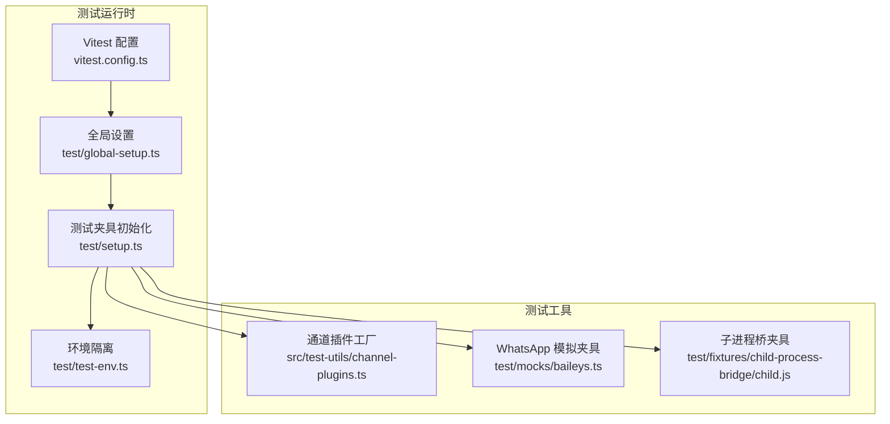
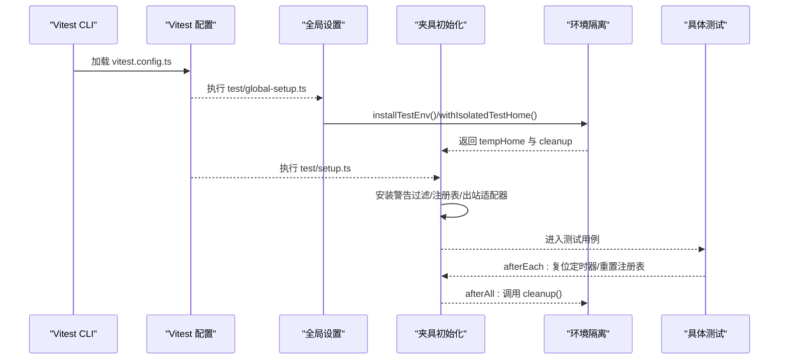
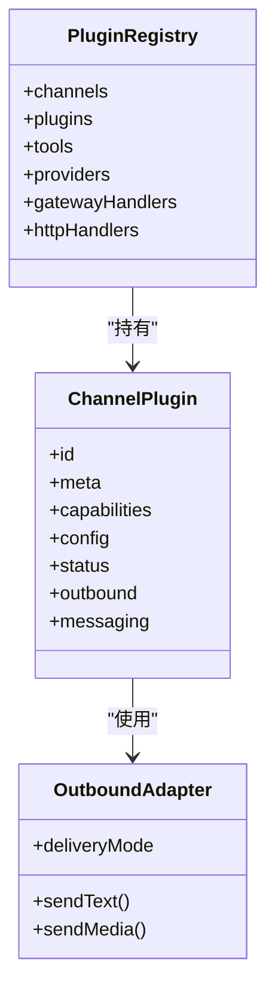
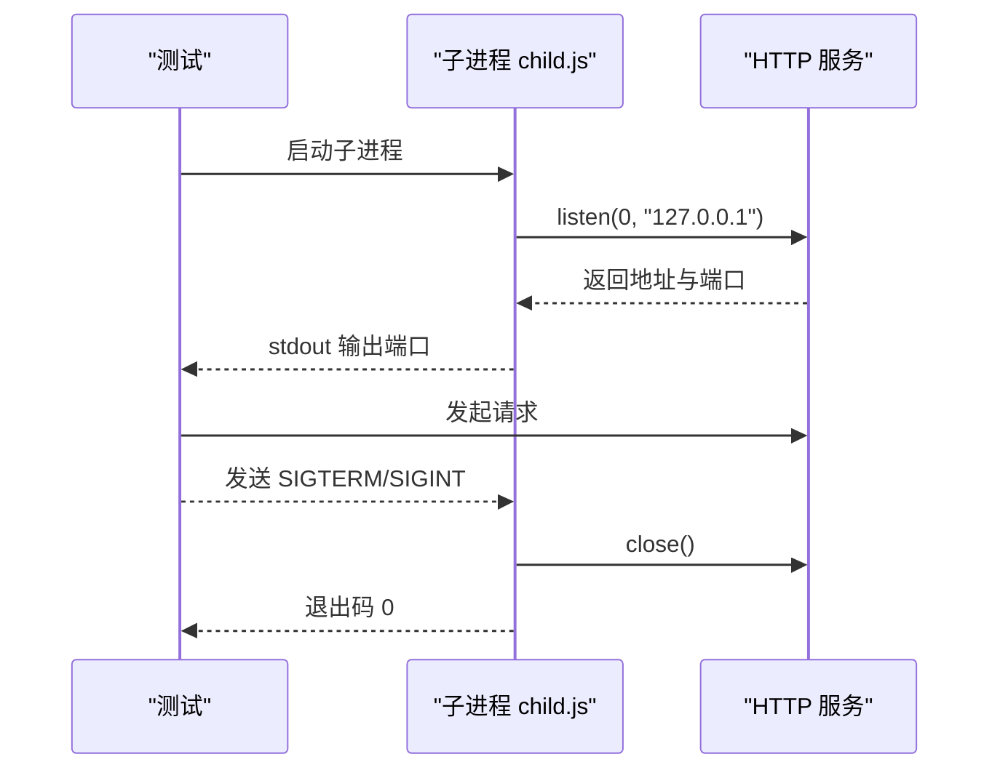
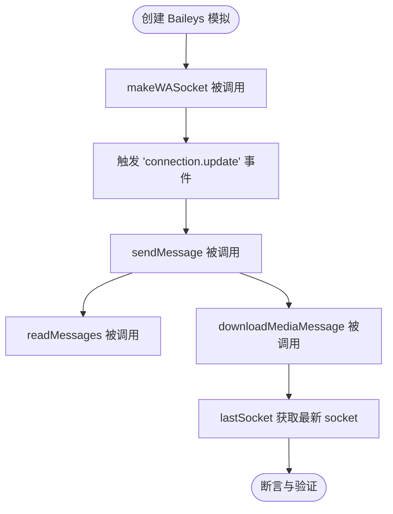
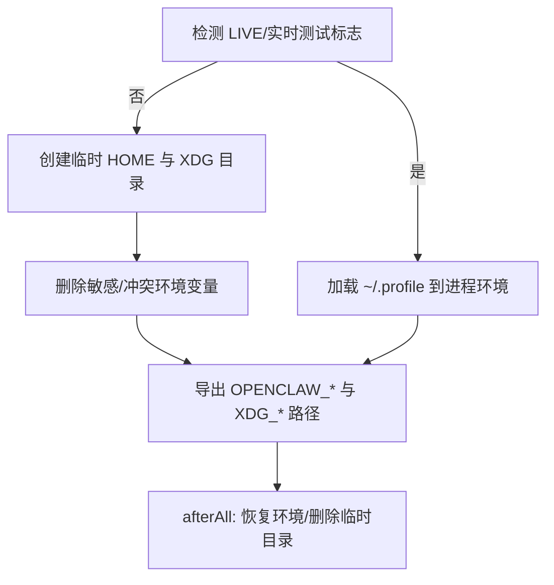
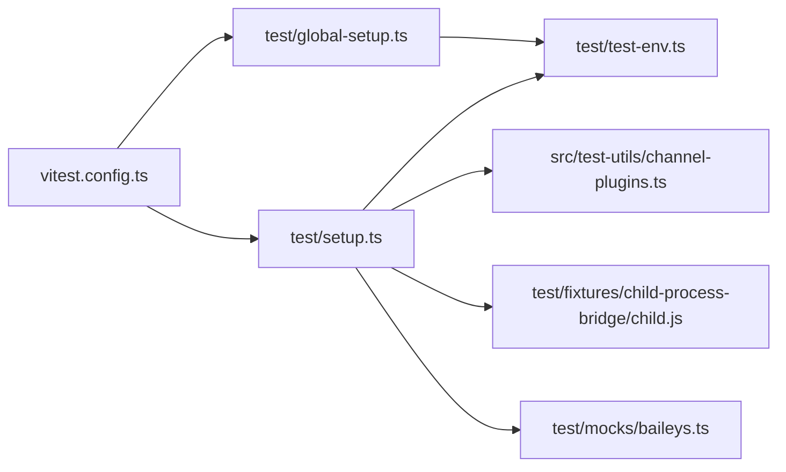

# 测试数据与夹具

<cite>
**本文引用的文件**
- [test/setup.ts](file://test/setup.ts)
- [test/global-setup.ts](file://test/global-setup.ts)
- [test/test-env.ts](file://test/test-env.ts)
- [src/test-utils/channel-plugins.ts](file://src/test-utils/channel-plugins.ts)
- [test/fixtures/child-process-bridge/child.js](file://test/fixtures/child-process-bridge/child.js)
- [vitest.config.ts](file://vitest.config.ts)
- [vitest.e2e.config.ts](file://vitest.e2e.config.ts)
- [src/infra/env.ts](file://src/infra/env.ts)
- [src/config/env-substitution.test.ts](file://src/config/env-substitution.test.ts)
- [test/mocks/baileys.ts](file://test/mocks/baileys.ts)
</cite>

## 目录

1. [简介](#简介)
2. [项目结构](#项目结构)
3. [核心组件](#核心组件)
4. [架构总览](#架构总览)
5. [详细组件分析](#详细组件分析)
6. [依赖关系分析](#依赖关系分析)
7. [性能考量](#性能考量)
8. [故障排查指南](#故障排查指南)
9. [结论](#结论)
10. [附录](#附录)

## 简介

本文件系统化梳理 OpenClaw 的测试数据与夹具（fixtures）管理实践，覆盖以下主题：

- 测试夹具的创建与使用：包括通道插件夹具、进程桥夹具、第三方库模拟夹具等
- 模拟数据生成：通过测试注册表、通道出站适配器与状态模拟实现
- 测试环境配置：隔离 HOME、XDG 目录、端口与令牌，以及“实时测试”模式
- 数据清理策略：按会话与进程维度进行资源回收
- 测试辅助函数：通道插件工厂、IMessage 规范化、测试注册表构建
- 测试环境变量：统一的环境变量规范化与日志输出
- 版本管理与共享策略：通过固定版本与临时目录避免跨版本污染
- 测试隔离与并发：基于工作进程池、独立 HOME 与定时器复位

## 项目结构

围绕测试数据与夹具的关键目录与文件如下：

- test/：全局设置、环境隔离、夹具与辅助工具
- src/test-utils/：通用测试工具（通道插件工厂）
- test/fixtures/：外部子进程桥接夹具
- vitest.\*.config.ts：Vitest 配置（含并发与排除规则）

**图表来源**

- [vitest.config.ts](file://vitest.config.ts#L12-L34)
- [test/global-setup.ts](file://test/global-setup.ts#L1-L6)
- [test/setup.ts](file://test/setup.ts#L1-L21)
- [test/test-env.ts](file://test/test-env.ts#L54-L143)
- [src/test-utils/channel-plugins.ts](file://src/test-utils/channel-plugins.ts#L11-L25)
- [test/mocks/baileys.ts](file://test/mocks/baileys.ts#L24-L66)
- [test/fixtures/child-process-bridge/child.js](file://test/fixtures/child-process-bridge/child.js#L1-L22)

**章节来源**

- [vitest.config.ts](file://vitest.config.ts#L12-L34)
- [test/global-setup.ts](file://test/global-setup.ts#L1-L6)
- [test/setup.ts](file://test/setup.ts#L1-L21)
- [test/test-env.ts](file://test/test-env.ts#L54-L143)
- [src/test-utils/channel-plugins.ts](file://src/test-utils/channel-plugins.ts#L11-L25)
- [test/mocks/baileys.ts](file://test/mocks/baileys.ts#L24-L66)
- [test/fixtures/child-process-bridge/child.js](file://test/fixtures/child-process-bridge/child.js#L1-L22)

## 核心组件

- 全局测试设置与夹具初始化
  - 安装进程告警过滤、激活插件注册表、创建默认通道插件集合、重置虚拟定时器
  - 参考路径：[test/setup.ts](file://test/setup.ts#L1-L21), [test/setup.ts](file://test/setup.ts#L160-L168)
- 测试环境隔离
  - 创建临时 HOME 与 XDG 目录，删除敏感环境变量，支持“实时测试”加载用户配置
  - 参考路径：[test/test-env.ts](file://test/test-env.ts#L54-L143)
- 通道插件工厂
  - 构建测试用通道插件注册表、IMessage 插件、通用出站插件
  - 参考路径：[src/test-utils/channel-plugins.ts](file://src/test-utils/channel-plugins.ts#L11-L25), [src/test-utils/channel-plugins.ts](file://src/test-utils/channel-plugins.ts#L27-L81), [src/test-utils/channel-plugins.ts](file://src/test-utils/channel-plugins.ts#L83-L104)
- 子进程桥接夹具
  - 启动本地 HTTP 服务并输出可用端口，支持 SIGINT/SIGTERM 清理
  - 参考路径：[test/fixtures/child-process-bridge/child.js](file://test/fixtures/child-process-bridge/child.js#L1-L22)
- 第三方库模拟夹具
  - 以 ViMock 形式模拟 Baileys（WhatsApp）客户端行为
  - 参考路径：[test/mocks/baileys.ts](file://test/mocks/baileys.ts#L24-L66)
- Vitest 并发与排除
  - 设置工作进程数、超时、包含/排除规则、覆盖率阈值
  - 参考路径：[vitest.config.ts](file://vitest.config.ts#L18-L34), [vitest.e2e.config.ts](file://vitest.e2e.config.ts#L12-L20)

**章节来源**

- [test/setup.ts](file://test/setup.ts#L1-L21)
- [test/test-env.ts](file://test/test-env.ts#L54-L143)
- [src/test-utils/channel-plugins.ts](file://src/test-utils/channel-plugins.ts#L11-L25)
- [test/fixtures/child-process-bridge/child.js](file://test/fixtures/child-process-bridge/child.js#L1-L22)
- [test/mocks/baileys.ts](file://test/mocks/baileys.ts#L24-L66)
- [vitest.config.ts](file://vitest.config.ts#L18-L34)
- [vitest.e2e.config.ts](file://vitest.e2e.config.ts#L12-L20)

## 架构总览

下图展示测试运行时从启动到执行的总体流程，包括环境隔离、夹具注入与清理。

**图表来源**

- [vitest.config.ts](file://vitest.config.ts#L24-L24)
- [test/global-setup.ts](file://test/global-setup.ts#L1-L6)
- [test/test-env.ts](file://test/test-env.ts#L54-L143)
- [test/setup.ts](file://test/setup.ts#L1-L21)
- [test/setup.ts](file://test/setup.ts#L160-L168)

## 详细组件分析

### 组件A：通道插件夹具与出站适配器

- 设计要点
  - 通过工厂函数创建测试用通道插件，统一注入元数据、能力与配置解析逻辑
  - 出站适配器封装发送文本与媒体消息，按通道选择真实发送函数或回退为测试占位
- 关键流程
  - 注册默认通道插件集合（Discord、Slack、Telegram、WhatsApp、Signal、iMessage）
  - 在 beforeEach 中激活默认注册表，在 afterEach 中恢复并确保定时器复位
- 数据结构与复杂度
  - 插件注册表为 O(n) 构建（n 为通道数量），查找与调用为 O(1)
  - 出站适配器为异步包装，时间复杂度取决于底层通道实现

**图表来源**

- [src/test-utils/channel-plugins.ts](file://src/test-utils/channel-plugins.ts#L11-L25)
- [src/test-utils/channel-plugins.ts](file://src/test-utils/channel-plugins.ts#L61-L81)
- [test/setup.ts](file://test/setup.ts#L41-L64)

**章节来源**

- [src/test-utils/channel-plugins.ts](file://src/test-utils/channel-plugins.ts#L11-L25)
- [src/test-utils/channel-plugins.ts](file://src/test-utils/channel-plugins.ts#L27-L81)
- [src/test-utils/channel-plugins.ts](file://src/test-utils/channel-plugins.ts#L83-L104)
- [test/setup.ts](file://test/setup.ts#L41-L64)
- [test/setup.ts](file://test/setup.ts#L113-L162)

### 组件B：子进程桥接夹具

- 用途
  - 为需要本地 HTTP 服务的测试提供可发现端口的子进程桥接夹具
- 行为
  - 启动 HTTP 服务器并输出端口；监听 SIGINT/SIGTERM 停止并退出
- 使用建议
  - 在测试前启动子进程，读取端口后发起请求；测试结束后发送信号清理

**图表来源**

- [test/fixtures/child-process-bridge/child.js](file://test/fixtures/child-process-bridge/child.js#L1-L22)

**章节来源**

- [test/fixtures/child-process-bridge/child.js](file://test/fixtures/child-process-bridge/child.js#L1-L22)

### 组件C：第三方库模拟夹具（Baileys）

- 用途
  - 模拟 WhatsApp 客户端连接、消息发送与媒体下载行为，便于单元测试
- 关键点
  - 通过 ViMock 包装 makeWASocket、useMultiFileAuthState 等 API
  - 提供事件发射器与最后创建的 socket 访问器
- 使用建议
  - 在测试前创建模拟模块，断言 sendMessage/readMessages 等调用

**图表来源**

- [test/mocks/baileys.ts](file://test/mocks/baileys.ts#L24-L66)

**章节来源**

- [test/mocks/baileys.ts](file://test/mocks/baileys.ts#L24-L66)

### 组件D：测试环境隔离与清理

- 隔离策略
  - 临时 HOME 与 XDG 目录，避免污染真实用户状态
  - 删除敏感令牌与开发工具参数，防止泄露
  - 支持“实时测试”模式加载用户配置（~/.profile）
- 清理策略
  - afterAll 回调中恢复原始环境变量并递归删除临时目录
- 并发与端口
  - 通过删除开发者自定义端口变量，强制使用随机端口，避免冲突

**图表来源**

- [test/test-env.ts](file://test/test-env.ts#L54-L143)

**章节来源**

- [test/test-env.ts](file://test/test-env.ts#L54-L143)

### 组件E：测试辅助函数与配置

- 通道插件工厂
  - createTestRegistry：构建空注册表并注入通道列表
  - createIMessageTestPlugin：构建 iMessage 插件，包含目标解析与错误收集
  - createOutboundTestPlugin：通用出站插件包装器
- 环境变量规范化与日志
  - normalizeEnv：标准化环境变量别名（如 ZAI_API_KEY）
  - logAcceptedEnvOption：在非测试环境下记录已接受的环境变量（可选脱敏）
- 配置中的环境变量替换
  - 单元测试覆盖了嵌套结构、大小写与非法标识符等边界情况

**章节来源**

- [src/test-utils/channel-plugins.ts](file://src/test-utils/channel-plugins.ts#L11-L25)
- [src/test-utils/channel-plugins.ts](file://src/test-utils/channel-plugins.ts#L27-L81)
- [src/test-utils/channel-plugins.ts](file://src/test-utils/channel-plugins.ts#L83-L104)
- [src/infra/env.ts](file://src/infra/env.ts#L40-L52)
- [src/config/env-substitution.test.ts](file://src/config/env-substitution.test.ts#L1-L200)

## 依赖关系分析

- 组件耦合
  - test/setup.ts 依赖 test/test-env.ts 与 src/test-utils/channel-plugins.ts
  - 测试用例通过 Vitest 配置自动加载 setup 文件
- 外部依赖
  - 子进程桥接依赖 Node 内置 http 模块
  - 第三方库模拟依赖 ViMock（由 Vitest 提供）

**图表来源**

- [vitest.config.ts](file://vitest.config.ts#L24-L24)
- [test/global-setup.ts](file://test/global-setup.ts#L1-L6)
- [test/test-env.ts](file://test/test-env.ts#L54-L143)
- [test/setup.ts](file://test/setup.ts#L1-L21)
- [src/test-utils/channel-plugins.ts](file://src/test-utils/channel-plugins.ts#L11-L25)
- [test/fixtures/child-process-bridge/child.js](file://test/fixtures/child-process-bridge/child.js#L1-L22)
- [test/mocks/baileys.ts](file://test/mocks/baileys.ts#L24-L66)

**章节来源**

- [vitest.config.ts](file://vitest.config.ts#L24-L24)
- [test/global-setup.ts](file://test/global-setup.ts#L1-L6)
- [test/test-env.ts](file://test/test-env.ts#L54-L143)
- [test/setup.ts](file://test/setup.ts#L1-L21)
- [src/test-utils/channel-plugins.ts](file://src/test-utils/channel-plugins.ts#L11-L25)
- [test/fixtures/child-process-bridge/child.js](file://test/fixtures/child-process-bridge/child.js#L1-L22)
- [test/mocks/baileys.ts](file://test/mocks/baileys.ts#L24-L66)

## 性能考量

- 并发与工作进程
  - 根据 CPU 数量动态设置 maxWorkers，CI 下 Windows 限制为 2，其他平台为 3
  - fork 池减少内存占用，适合大量小测试
- 超时与稳定性
  - 测试与钩子超时根据平台调整，Windows 更宽松
- 排除策略
  - 将易受并发影响的集成面（如网关、通道实现）排除在单元测试之外，降低抖动

**章节来源**

- [vitest.config.ts](file://vitest.config.ts#L7-L10)
- [vitest.config.ts](file://vitest.config.ts#L18-L23)
- [vitest.config.ts](file://vitest.config.ts#L35-L102)
- [vitest.e2e.config.ts](file://vitest.e2e.config.ts#L6-L11)
- [vitest.e2e.config.ts](file://vitest.e2e.config.ts#L12-L20)

## 故障排查指南

- 端口冲突
  - 症状：测试启动失败或端口被占用
  - 处理：确认未设置 OPENCLAW\_\* 相关端口变量，让系统分配随机端口
  - 参考：[test/test-env.ts](file://test/test-env.ts#L104-L111)
- 令牌泄露风险
  - 症状：测试中出现真实令牌
  - 处理：确保未启用实时测试或显式清理相关环境变量
  - 参考：[test/test-env.ts](file://test/test-env.ts#L111-L119)
- 定时器泄漏导致用例卡死
  - 症状：某些测试长时间不结束
  - 处理：确认 afterEach 是否调用 vi.useRealTimers()
  - 参考：[test/setup.ts](file://test/setup.ts#L164-L168)
- 子进程未退出
  - 症状：测试结束后残留进程
  - 处理：向子进程发送 SIGTERM/SIGINT，确保监听并关闭服务
  - 参考：[test/fixtures/child-process-bridge/child.js](file://test/fixtures/child-process-bridge/child.js#L16-L22)
- 第三方库模拟未生效
  - 症状：调用真实外部 API
  - 处理：确认已在测试前创建模拟模块并正确注入
  - 参考：[test/mocks/baileys.ts](file://test/mocks/baileys.ts#L24-L66)

**章节来源**

- [test/test-env.ts](file://test/test-env.ts#L104-L119)
- [test/setup.ts](file://test/setup.ts#L164-L168)
- [test/fixtures/child-process-bridge/child.js](file://test/fixtures/child-process-bridge/child.js#L16-L22)
- [test/mocks/baileys.ts](file://test/mocks/baileys.ts#L24-L66)

## 结论

OpenClaw 的测试数据与夹具体系通过“隔离环境 + 工厂夹具 + 清理回调”的组合，实现了稳定、可重复且安全的测试运行。通道插件工厂与第三方库模拟为单元测试提供了高保真行为；子进程桥接夹具满足本地网络场景；严格的环境变量清理与并发配置保障了测试隔离与性能。建议在新增测试时优先使用现有工厂与夹具，遵循“先隔离、再夹具、后清理”的流程。

## 附录

- 测试环境变量清单（隔离与保留）
  - 隔离：OPENCLAW*STATE_DIR、OPENCLAW_CONFIG_PATH、OPENCLAW_GATEWAY_PORT、OPENCLAW_BRIDGE*\*、OPENCLAW_CANVAS_HOST_PORT、各平台令牌等
  - 保留：OPENCLAW*TEST_FAST、HOME/USERPROFILE、XDG*\*、OPENCLAW_TEST_HOME
  - 参考：[test/test-env.ts](file://test/test-env.ts#L67-L121)
- 实时测试模式
  - 当 LIVE/OPENCLAW*LIVE*\* 任一为 1 时，加载用户配置并使用真实 HOME
  - 参考：[test/test-env.ts](file://test/test-env.ts#L55-L65)
- 配置中的环境变量替换
  - 支持嵌套对象、大小写与非法标识符边界，单元测试覆盖全面
  - 参考：[src/config/env-substitution.test.ts](file://src/config/env-substitution.test.ts#L1-L200)

**章节来源**

- [test/test-env.ts](file://test/test-env.ts#L67-L121)
- [test/test-env.ts](file://test/test-env.ts#L55-L65)
- [src/config/env-substitution.test.ts](file://src/config/env-substitution.test.ts#L1-L200)
