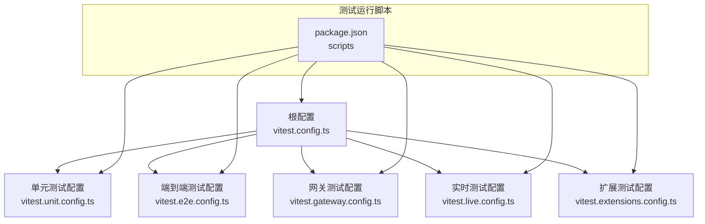
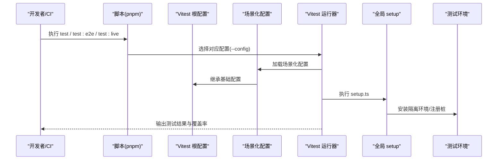
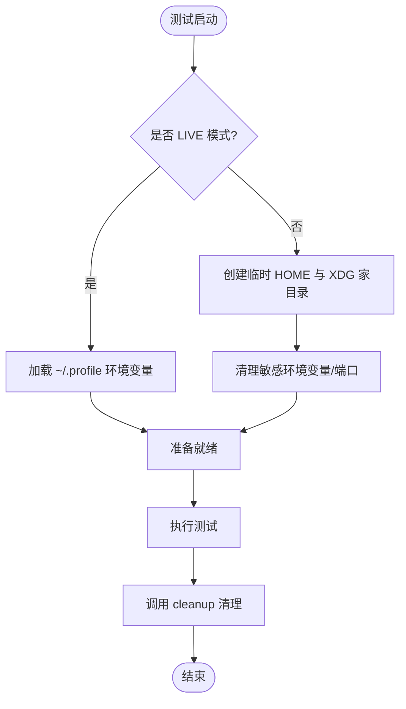
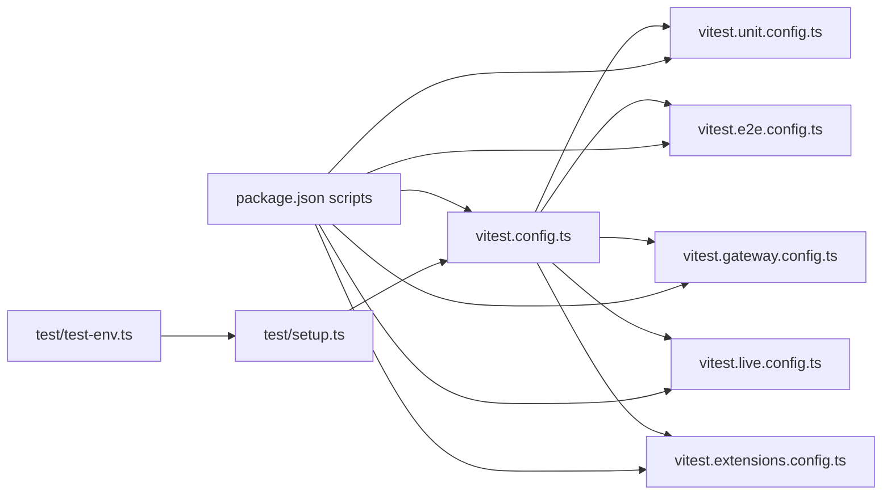

# 测试框架与配置

<cite>
**本文引用的文件**
- [vitest.config.ts](file://vitest.config.ts)
- [vitest.unit.config.ts](file://vitest.unit.config.ts)
- [vitest.e2e.config.ts](file://vitest.e2e.config.ts)
- [vitest.gateway.config.ts](file://vitest.gateway.config.ts)
- [vitest.live.config.ts](file://vitest.live.config.ts)
- [vitest.extensions.config.ts](file://vitest.extensions.config.ts)
- [setup.ts](file://test/setup.ts)
- [global-setup.ts](file://test/global-setup.ts)
- [test-env.ts](file://test/test-env.ts)
- [package.json](file://package.json)
- [gateway.multi.e2e.test.ts](file://test/gateway.multi.e2e.test.ts)
- [globals.test.ts](file://src/globals.test.ts)
- [index.test.ts](file://src/index.test.ts)
</cite>

## 目录

1. [简介](#简介)
2. [项目结构](#项目结构)
3. [核心组件](#核心组件)
4. [架构总览](#架构总览)
5. [详细组件分析](#详细组件分析)
6. [依赖关系分析](#依赖关系分析)
7. [性能考量](#性能考量)
8. [故障排查指南](#故障排查指南)
9. [结论](#结论)
10. [附录](#附录)

## 简介

本文件系统性梳理 OpenClaw 的测试框架与配置，重点覆盖以下方面：

- Vitest 配置文件的作用与配置项说明（超时、钩子、进程池、并发、包含/排除规则）
- 单元测试、端到端测试、网关测试、实时测试四类场景的配置差异与适用范围
- 测试环境变量设置与隔离策略（含 LIVE 模式）
- 覆盖率配置与阈值
- 并行测试策略与工作线程数计算
- 测试文件命名约定与组织结构最佳实践
- 测试运行命令与 CI/CD 集成方法

## 项目结构

OpenClaw 的测试体系围绕 Vitest 配置文件展开，并通过统一的入口配置与多套专用配置实现不同测试场景的隔离与优化。测试运行脚本集中在根目录的包管理器脚本中，便于在本地与 CI 中一致执行。

图表来源

- [vitest.config.ts](file://vitest.config.ts#L1-L105)
- [vitest.unit.config.ts](file://vitest.unit.config.ts#L1-L20)
- [vitest.e2e.config.ts](file://vitest.e2e.config.ts#L1-L21)
- [vitest.gateway.config.ts](file://vitest.gateway.config.ts#L1-L15)
- [vitest.live.config.ts](file://vitest.live.config.ts#L1-L16)
- [vitest.extensions.config.ts](file://vitest.extensions.config.ts#L1-L15)
- [package.json](file://package.json#L33-L109)

章节来源

- [vitest.config.ts](file://vitest.config.ts#L1-L105)
- [package.json](file://package.json#L33-L109)

## 核心组件

- 根级 Vitest 配置：定义通用别名、超时、进程池、包含/排除规则、覆盖率策略与阈值，以及全局 setup 文件。
- 场景化配置：
  - 单元测试：排除网关与扩展模块，聚焦纯逻辑单元测试
  - 端到端测试：启用更少的工作线程，仅包含 e2e 测试文件
  - 网关测试：仅匹配网关相关测试
  - 实时测试：单线程运行，仅匹配 live 测试文件
  - 扩展测试：仅匹配扩展模块测试
- 测试环境与隔离：
  - 全局 setup 注入插件注册表、通道适配器桩、警告过滤
  - 测试环境安装函数隔离 HOME、XDG 家目录与关键端口，支持 LIVE 模式加载真实用户环境
- 运行脚本与 CI 集成：提供统一的 test、test:e2e、test:live、test:docker:\* 等命令，便于本地与流水线复用

章节来源

- [vitest.config.ts](file://vitest.config.ts#L12-L104)
- [vitest.unit.config.ts](file://vitest.unit.config.ts#L12-L19)
- [vitest.e2e.config.ts](file://vitest.e2e.config.ts#L12-L20)
- [vitest.gateway.config.ts](file://vitest.gateway.config.ts#L7-L14)
- [vitest.live.config.ts](file://vitest.live.config.ts#L7-L15)
- [vitest.extensions.config.ts](file://vitest.extensions.config.ts#L7-L14)
- [setup.ts](file://test/setup.ts#L1-L169)
- [test-env.ts](file://test/test-env.ts#L54-L147)
- [package.json](file://package.json#L82-L109)

## 架构总览

下图展示测试配置与运行流程的关键交互：

图表来源

- [package.json](file://package.json#L82-L109)
- [vitest.config.ts](file://vitest.config.ts#L12-L104)
- [vitest.unit.config.ts](file://vitest.unit.config.ts#L1-L20)
- [vitest.e2e.config.ts](file://vitest.e2e.config.ts#L1-L21)
- [vitest.live.config.ts](file://vitest.live.config.ts#L1-L16)
- [setup.ts](file://test/setup.ts#L1-L169)

## 详细组件分析

### 根级 Vitest 配置（通用基线）

- 别名与解析：将特定模块别名映射到源码入口，确保测试中导入路径稳定
- 超时与钩子：根据平台调整 hook 超时；统一测试超时
- 进程池与并发：默认 fork 池，按是否 CI 与 CPU 数动态决定最大工作线程数
- 包含/排除：默认扫描 src 与 extensions 下的测试文件，排除 macOS 应用构建产物与 live/e2e 文件
- 覆盖率：使用 v8 提供者，输出文本与 LCOV 报告；对入口、CLI、网关服务端、浏览器 UI、频道表面等进行排除，聚焦业务逻辑层
- 全局 setup：加载 test/setup.ts，确保测试环境初始化与清理

章节来源

- [vitest.config.ts](file://vitest.config.ts#L12-L104)

### 单元测试配置（vitest.unit.config.ts）

- 继承根配置，保留 include/exclude 基线
- 排除网关与扩展模块，适合快速验证纯逻辑单元测试
- 适用于高频迭代、低资源占用的本地开发

章节来源

- [vitest.unit.config.ts](file://vitest.unit.config.ts#L1-L20)

### 端到端测试配置（vitest.e2e.config.ts）

- 继承根配置，移除 e2e 排除项，使 e2e 文件可被包含
- 工作线程按 CI/本地与 CPU 数动态计算，避免过度并发导致资源争用
- 仅包含 test 与 src 下的 e2e 测试文件，适合跨进程/网络/外部服务的集成验证

章节来源

- [vitest.e2e.config.ts](file://vitest.e2e.config.ts#L1-L21)

### 网关测试配置（vitest.gateway.config.ts）

- 仅包含 src/gateway 下的测试文件，聚焦网关协议、桥接与服务端逻辑
- 适合验证网关控制面与数据面行为

章节来源

- [vitest.gateway.config.ts](file://vitest.gateway.config.ts#L1-L15)

### 实时测试配置（vitest.live.config.ts）

- 仅包含 src 下的 \*.live.test.ts 文件，单线程运行
- 适合需要真实密钥、外部服务或真实用户环境的测试（如 LIVE 模式）

章节来源

- [vitest.live.config.ts](file://vitest.live.config.ts#L1-L16)

### 扩展测试配置（vitest.extensions.config.ts）

- 仅包含 extensions 下的测试文件，便于独立验证扩展功能
- 适合扩展开发与回归

章节来源

- [vitest.extensions.config.ts](file://vitest.extensions.config.ts#L1-L15)

### 测试环境与隔离（setup.ts、test-env.ts、global-setup.ts）

- 全局 setup：
  - 设置 Vitest 环境标记
  - 安装进程警告过滤
  - 初始化隔离测试 HOME，确保不污染真实状态
  - 创建通道插件桩与默认注册表，注入 outbound 发送适配器
  - 在每个测试前后重置插件注册表与时间模拟
- 测试环境安装：
  - 支持 LIVE 模式：加载用户 profile，使用真实 HOME 与密钥
  - 非 LIVE 模式：创建临时 HOME 与 XDG 家目录，清理敏感环境变量，避免端口冲突
- 全局清理：返回 cleanup 函数，供 Vitest globalSetup 使用

图表来源

- [setup.ts](file://test/setup.ts#L1-L169)
- [test-env.ts](file://test/test-env.ts#L54-L147)
- [global-setup.ts](file://test/global-setup.ts#L1-L7)

章节来源

- [setup.ts](file://test/setup.ts#L1-L169)
- [test-env.ts](file://test/test-env.ts#L54-L147)
- [global-setup.ts](file://test/global-setup.ts#L1-L7)

### 测试文件命名约定与组织结构

- 命名约定：
  - 单元测试：\*.test.ts
  - 端到端测试：\*.e2e.test.ts
  - 实时测试：\*.live.test.ts
  - 网关测试：位于 src/gateway 下的 \*.test.ts
  - 扩展测试：位于 extensions/<plugin>/ 下的 \*.test.ts
- 组织结构：
  - src 下按功能域划分测试文件，例如工具函数、类型转换、协议处理等
  - test 下存放跨进程/外部服务的 e2e 测试，如多实例网关连通性、HTTP/WebSocket 交互
  - 示例：端到端多实例网关测试文件展示了如何启动多个网关实例、建立节点连接、校验健康状态与钩子接口

章节来源

- [gateway.multi.e2e.test.ts](file://test/gateway.multi.e2e.test.ts#L1-L422)
- [globals.test.ts](file://src/globals.test.ts#L1-L30)
- [index.test.ts](file://src/index.test.ts#L1-L33)

### 测试运行命令与 CI/CD 集成

- 常用命令：
  - 单元测试：pnpm test 或 pnpm test:fast
  - 端到端测试：pnpm test:e2e
  - 实时测试：pnpm test:live（需设置 LIVE 相关环境变量）
  - 覆盖率：pnpm test:coverage
  - 全量检查：pnpm test:all（包含 lint、build、test、e2e、live、docker）
  - Docker 场景：pnpm test:docker:\* 系列脚本
- CI 集成要点：
  - 通过环境变量 CI=true 或 GITHUB_ACTIONS=true 触发 CI 并行策略
  - Windows 平台使用固定工作线程数，避免资源不足
  - 使用 LIVE 模式时，确保 CI 提供必要的令牌与配置（如 TELEGRAM_BOT_TOKEN、DISCORD_BOT_TOKEN 等）

章节来源

- [package.json](file://package.json#L82-L109)
- [vitest.config.ts](file://vitest.config.ts#L7-L10)

## 依赖关系分析

- 配置继承：各场景化配置通过导入根配置并覆盖 test 字段，形成清晰的继承链
- 运行脚本耦合：package.json 的 scripts 将场景化配置与命令绑定，保证一致性
- 环境隔离：setup.ts 与 test-env.ts 形成测试环境生命周期，避免跨测试污染

图表来源

- [vitest.config.ts](file://vitest.config.ts#L1-L105)
- [vitest.unit.config.ts](file://vitest.unit.config.ts#L1-L20)
- [vitest.e2e.config.ts](file://vitest.e2e.config.ts#L1-L21)
- [vitest.gateway.config.ts](file://vitest.gateway.config.ts#L1-L15)
- [vitest.live.config.ts](file://vitest.live.config.ts#L1-L16)
- [vitest.extensions.config.ts](file://vitest.extensions.config.ts#L1-L15)
- [setup.ts](file://test/setup.ts#L1-L169)
- [test-env.ts](file://test/test-env.ts#L54-L147)
- [package.json](file://package.json#L82-L109)

章节来源

- [vitest.config.ts](file://vitest.config.ts#L1-L105)
- [package.json](file://package.json#L82-L109)

## 性能考量

- 并发策略：
  - 本地：基于 CPU 数动态计算工作线程，范围限制在 4–16
  - CI：Windows 固定 2，其他平台固定 3，降低资源竞争
- 进程池：默认 fork 池，适合隔离性强且需要独立 Node 进程的测试
- 排除策略：通过 exclude 大幅减少扫描与编译负担，提升启动速度
- e2e 并发：按 CPU 的 25% 计算工作线程，上限 4，避免外部依赖抖动影响稳定性

章节来源

- [vitest.config.ts](file://vitest.config.ts#L7-L10)
- [vitest.e2e.config.ts](file://vitest.e2e.config.ts#L5-L7)

## 故障排查指南

- 端口冲突：
  - 非 LIVE 模式下会清理 OPENCLAW\_\* 相关端口变量，确保测试间无干扰
  - 若出现端口占用，确认未手动设置相关环境变量
- 真实环境泄漏：
  - LIVE 模式会加载用户 profile，若测试失败，优先检查令牌与配置是否正确
- 超时问题：
  - Windows 平台 hook 超时更高；e2e 测试建议增加自定义 timeout
- 并发问题：
  - e2e 与 live 测试建议降低并发或单线程运行，避免外部依赖竞争
- 覆盖率异常：
  - 确认被测代码是否被排除（如 CLI、入口、网关服务端等），必要时调整 include/exclude

章节来源

- [test-env.ts](file://test/test-env.ts#L94-L126)
- [vitest.config.ts](file://vitest.config.ts#L18-L24)
- [vitest.e2e.config.ts](file://vitest.e2e.config.ts#L14-L18)
- [vitest.live.config.ts](file://vitest.live.config.ts#L10-L12)

## 结论

OpenClaw 的测试框架通过根级 Vitest 配置与多套场景化配置实现了高内聚、低耦合的测试体系。结合严格的环境隔离、覆盖率阈值与并行策略，既能满足日常单元测试的快速反馈，也能支撑端到端与实时测试对真实环境的需求。建议在 CI 中统一使用脚本命令，配合覆盖率报告与 Docker 场景，确保质量与稳定性。

## 附录

### 测试文件命名与组织最佳实践

- 单元测试：src/<feature>/\*.test.ts
- 端到端测试：src/<feature>/_.e2e.test.ts 或 test/_.e2e.test.ts
- 实时测试：src/<feature>/\*.live.test.ts
- 网关测试：src/gateway/\*.test.ts
- 扩展测试：extensions/<plugin>/\*.test.ts

章节来源

- [gateway.multi.e2e.test.ts](file://test/gateway.multi.e2e.test.ts#L1-L422)
- [globals.test.ts](file://src/globals.test.ts#L1-L30)
- [index.test.ts](file://src/index.test.ts#L1-L33)
