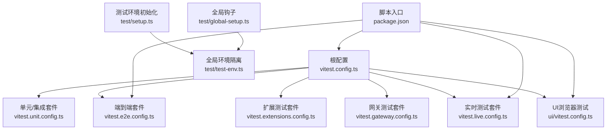
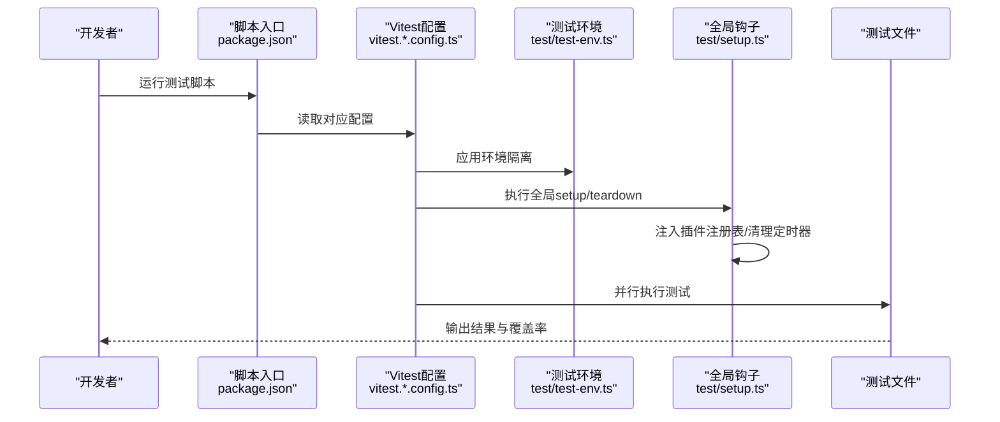
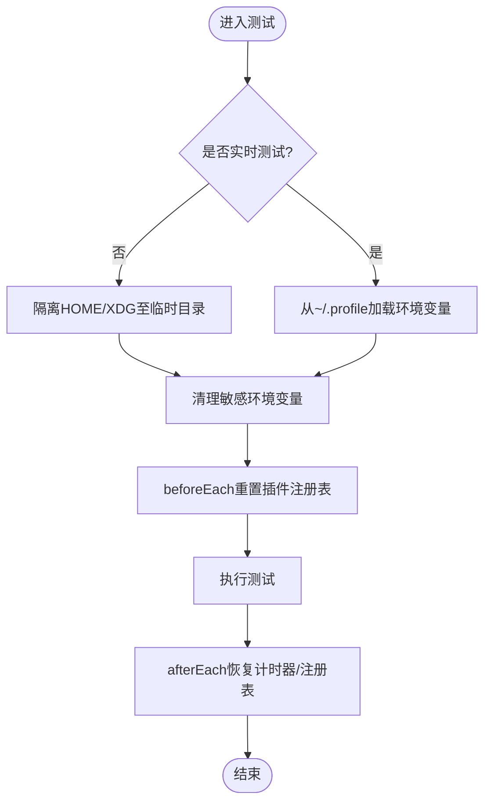
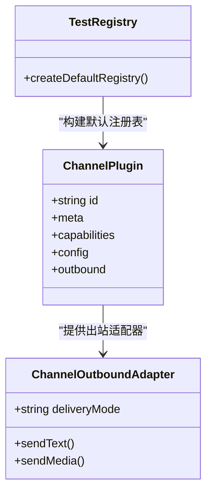
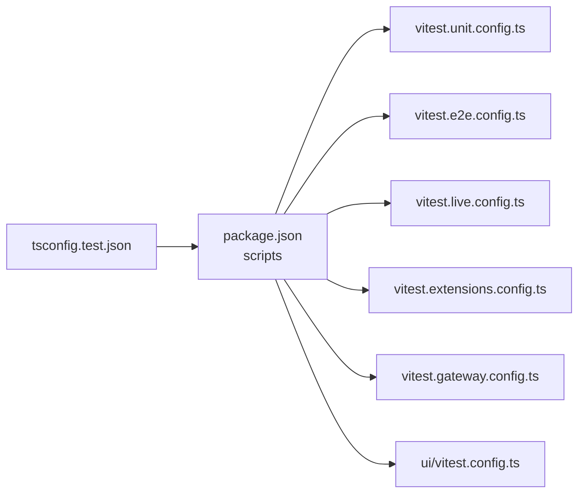

# 调试与测试

<cite>
**本文引用的文件**
- [vitest.config.ts](file://vitest.config.ts)
- [vitest.unit.config.ts](file://vitest.unit.config.ts)
- [vitest.e2e.config.ts](file://vitest.e2e.config.ts)
- [vitest.extensions.config.ts](file://vitest.extensions.config.ts)
- [vitest.gateway.config.ts](file://vitest.gateway.config.ts)
- [vitest.live.config.ts](file://vitest.live.config.ts)
- [package.json](file://package.json)
- [test/setup.ts](file://test/setup.ts)
- [test/global-setup.ts](file://test/global-setup.ts)
- [test/test-env.ts](file://test/test-env.ts)
- [docs/help/testing.md](file://docs/help/testing.md)
- [tsconfig.test.json](file://tsconfig.test.json)
- [ui/vitest.config.ts](file://ui/vitest.config.ts)
</cite>

## 目录

1. [简介](#简介)
2. [项目结构](#项目结构)
3. [核心组件](#核心组件)
4. [架构总览](#架构总览)
5. [详细组件分析](#详细组件分析)
6. [依赖分析](#依赖分析)
7. [性能考虑](#性能考虑)
8. [故障排查指南](#故障排查指南)
9. [结论](#结论)
10. [附录](#附录)

## 简介

本指南面向OpenClaw项目的开发者与贡献者，系统性介绍仓库内的测试体系与调试方法。内容覆盖：

- 测试框架（Vitest）配置与使用
- 单元测试、集成测试、端到端测试与实时（Live）测试策略
- 调试工具、断点设置与日志分析技巧
- 模拟对象、测试数据准备与端到端测试实践
- 性能测试、内存泄漏检测与并发测试方法
- CI/CD流水线中的测试执行与覆盖率报告
- 常见测试问题的排查与解决方案

## 项目结构

OpenClaw采用多包与多平台混合架构，测试配置以Vitest为核心，通过多个专用配置文件分别覆盖不同测试场景；同时提供统一的全局测试环境隔离与插件注册机制。

图表来源

- [vitest.config.ts](file://vitest.config.ts#L1-L105)
- [vitest.unit.config.ts](file://vitest.unit.config.ts#L1-L20)
- [vitest.e2e.config.ts](file://vitest.e2e.config.ts#L1-L21)
- [vitest.extensions.config.ts](file://vitest.extensions.config.ts#L1-L15)
- [vitest.gateway.config.ts](file://vitest.gateway.config.ts#L1-L15)
- [vitest.live.config.ts](file://vitest.live.config.ts#L1-L16)
- [ui/vitest.config.ts](file://ui/vitest.config.ts#L1-L15)
- [package.json](file://package.json#L82-L109)
- [test/setup.ts](file://test/setup.ts#L1-L169)
- [test/global-setup.ts](file://test/global-setup.ts#L1-L7)
- [test/test-env.ts](file://test/test-env.ts#L1-L148)

章节来源

- [vitest.config.ts](file://vitest.config.ts#L1-L105)
- [package.json](file://package.json#L82-L109)

## 核心组件

- 统一测试配置：根配置定义别名、超时、工作进程数、包含/排除规则、覆盖率阈值与排除范围等。
- 多套件分层：单元/集成、端到端、扩展、网关、实时测试分别由独立配置驱动，便于按需运行与并行加速。
- 全局测试环境：隔离HOME与XDG目录、清理临时状态、加载用户profile用于实时测试。
- 插件注册与通道桩：在测试前激活隔离的插件注册表，提供通道发送桩，确保测试可重复且不触达真实外部服务。

章节来源

- [vitest.config.ts](file://vitest.config.ts#L12-L105)
- [test/setup.ts](file://test/setup.ts#L1-L169)
- [test/test-env.ts](file://test/test-env.ts#L54-L148)

## 架构总览

下图展示测试执行的关键路径：命令入口调用Vitest配置，配置决定包含/排除与工作进程，全局钩子负责环境隔离与插件注册，最终执行各测试文件。

图表来源

- [package.json](file://package.json#L82-L109)
- [vitest.config.ts](file://vitest.config.ts#L18-L34)
- [test/test-env.ts](file://test/test-env.ts#L54-L148)
- [test/setup.ts](file://test/setup.ts#L160-L169)

## 详细组件分析

### 测试套件与配置

- 默认套件（单元/集成）
  - 配置来源：根配置与单元套件配置组合，包含src与extensions下的测试文件，排除网关与扩展目录（单元套件不包含它们）。
  - 关键点：超时、工作进程数根据CI/本地自动调整，覆盖率仅统计src代码。
- 端到端套件
  - 配置来源：基于根配置，启用e2e测试文件，限制最大工作进程数，排除非e2e文件。
  - 适用场景：多实例网关、WebSocket/HTTP接口、节点配对等。
- 实时套件
  - 配置来源：基于根配置，启用live测试文件，单工作进程串行执行，排除非live文件。
  - 适用场景：真实提供商与模型验证、工具调用、图像探针等。
- 扩展与网关套件
  - 分别限定扩展或网关目录下的测试文件，便于聚焦开发与回归。

章节来源

- [vitest.config.ts](file://vitest.config.ts#L18-L105)
- [vitest.unit.config.ts](file://vitest.unit.config.ts#L12-L19)
- [vitest.e2e.config.ts](file://vitest.e2e.config.ts#L12-L20)
- [vitest.live.config.ts](file://vitest.live.config.ts#L7-L15)
- [vitest.extensions.config.ts](file://vitest.extensions.config.ts#L7-L14)
- [vitest.gateway.config.ts](file://vitest.gateway.config.ts#L7-L14)

### 测试环境与隔离

- 环境隔离策略
  - 将HOME与XDG系列目录重定向至临时目录，避免污染真实配置与状态。
  - 在Windows上强制使用默认状态目录，保证认证/配置路径与真实一致。
  - 清理过程恢复原始环境变量，确保测试间无泄漏。
- 实时测试与用户配置
  - 当开启实时测试时，从用户profile加载环境变量，优先使用profile存储的密钥。
- 全局钩子
  - beforeEach/afterEach中重置插件注册表，确保每个测试文件的插件状态一致。
  - 使用真实计时器，避免伪造时钟跨文件泄漏。

图表来源

- [test/test-env.ts](file://test/test-env.ts#L54-L148)
- [test/setup.ts](file://test/setup.ts#L160-L169)

章节来源

- [test/test-env.ts](file://test/test-env.ts#L54-L148)
- [test/setup.ts](file://test/setup.ts#L1-L169)

### 插件注册与通道桩

- 插件桩
  - 为多种通道（如Discord、Slack、Telegram、WhatsApp、Signal、iMessage）生成最小化插件桩，包含元信息、能力声明与配置解析。
  - 支持选择投递模式与会话查找偏好，便于测试不同路由行为。
- 出站适配器桩
  - 提供sendText与sendMedia的桩实现，若存在真实发送函数则调用，否则返回占位消息ID，确保测试稳定。
- 默认注册表
  - 在测试开始时注入一组默认插件，保证通道相关逻辑可被覆盖与断言。

图表来源

- [test/setup.ts](file://test/setup.ts#L66-L111)
- [test/setup.ts](file://test/setup.ts#L113-L158)

章节来源

- [test/setup.ts](file://test/setup.ts#L41-L111)
- [test/setup.ts](file://test/setup.ts#L113-L158)

### 覆盖率与报告

- 覆盖率提供者与格式
  - 使用v8提供者，输出文本与LCOV报告，便于CI可视化。
- 阈值与排除
  - 行/函数/分支/语句阈值分别为70%/70%/55%/70%，排除入口与UI/网关桥接等难以单元测试的模块。
- 运行方式
  - 通过脚本触发覆盖率收集，结合CI进行门禁。

章节来源

- [vitest.config.ts](file://vitest.config.ts#L35-L102)
- [package.json](file://package.json#L84-L84)

### UI浏览器测试（Playwright）

- 配置要点
  - 启用浏览器测试，使用Playwright提供者，headless执行，支持多实例配置。
- 适用场景
  - UI交互、组件渲染与跨浏览器兼容性验证。

章节来源

- [ui/vitest.config.ts](file://ui/vitest.config.ts#L1-L15)

## 依赖分析

- 脚本与套件映射
  - package.json中定义了测试脚本，分别调用不同配置文件或组合命令，形成“快速检查—覆盖率—端到端—实时—UI”的完整测试链路。
- TypeScript测试编译
  - tsconfig.test.json限定测试文件集合，确保类型检查与编译目标正确。

图表来源

- [package.json](file://package.json#L82-L109)
- [tsconfig.test.json](file://tsconfig.test.json#L1-L8)

章节来源

- [package.json](file://package.json#L82-L109)
- [tsconfig.test.json](file://tsconfig.test.json#L1-L8)

## 性能考虑

- 并发与工作进程
  - 根配置根据CPU核数与CI标志动态设置最大工作进程数，提升吞吐同时避免资源争用。
- 超时与稳定性
  - 测试与钩子超时按平台差异化配置，降低长耗时任务在Windows上的误判概率。
- 排除高开销模块
  - 覆盖率排除UI、网关桥接与交互式流程，减少不必要的统计成本。

章节来源

- [vitest.config.ts](file://vitest.config.ts#L7-L23)

## 故障排查指南

- 环境变量与密钥
  - 实时测试依赖profile存储的密钥或环境变量，若提示“无凭据”，请先确认CLI可用性与密钥来源。
- 端口与状态目录冲突
  - 测试会清理并重写端口与状态目录相关变量，避免与本地开发冲突；若仍冲突，请检查临时目录权限。
- 计时器泄漏
  - 若出现异步任务未结束或定时器异常，确保afterEach已恢复真实计时器。
- 覆盖率不达标
  - 检查被排除模块是否应纳入统计，或调整阈值以匹配当前质量门禁。
- UI浏览器测试失败
  - 确认Playwright提供者可用、headless模式与浏览器实例配置正确。

章节来源

- [docs/help/testing.md](file://docs/help/testing.md#L295-L306)
- [test/test-env.ts](file://test/test-env.ts#L94-L142)
- [test/setup.ts](file://test/setup.ts#L164-L168)
- [vitest.config.ts](file://vitest.config.ts#L35-L102)
- [ui/vitest.config.ts](file://ui/vitest.config.ts#L7-L13)

## 结论

OpenClaw的测试体系以Vitest为核心，通过多套件分层与严格的环境隔离，实现了从单元/集成到端到端与实时验证的全链路覆盖。配合清晰的脚本入口与覆盖率门禁，能够在CI与本地高效定位问题并保障质量。建议在日常开发中优先运行单元/集成与覆盖率检查，必要时再补充端到端与实时测试，并针对UI与浏览器场景单独验证。

## 附录

- 快速参考
  - 全量检查：构建 + 代码检查 + 单元测试
  - 覆盖率门禁：覆盖率收集与报告
  - 端到端：多实例网关与网络协议验证
  - 实时：真实提供商与模型验证（含工具调用与图像探针）
  - UI：Playwright浏览器测试
- 建议实践
  - 新增功能时先写单元/集成测试，再补端到端与实时回归
  - 使用模拟对象与桩函数隔离外部依赖
  - 对高开销场景（实时/端到端）在CI中按需触发
  - 定期审查覆盖率阈值与排除列表，保持质量门禁有效
