# 调试工具与技巧

<cite>
**本文引用的文件**
- [docs/help/debugging.md](file://docs/help/debugging.md)
- [docs/cli/logs.md](file://docs/cli/logs.md)
- [docs/gateway/logging.md](file://docs/gateway/logging.md)
- [docs/diagnostics/flags.md](file://docs/diagnostics/flags.md)
- [scripts/clawlog.sh](file://scripts/clawlog.sh)
- [docs/debug/node-issue.md](file://docs/debug/node-issue.md)
- [docs/help/troubleshooting.md](file://docs/help/troubleshooting.md)
- [src/auto-reply/reply/debug-commands.ts](file://src/auto-reply/reply/debug-commands.ts)
- [src/auto-reply/reply/commands-config.ts](file://src/auto-reply/reply/commands-config.ts)
- [src/logging.ts](file://src/logging.ts)
- [src/logger.ts](file://src/logger.ts)
- [extensions/diagnostics-otel/src/service.ts](file://extensions/diagnostics-otel/src/service.ts)
- [apps/macos/Tests/OpenClawIPCTests/CoverageDumpTests.swift](file://apps/macos/Tests/OpenClawIPCTests/CoverageDumpTests.swift)
- [docs/logging.md](file://docs/logging.md)
</cite>

## 目录

1. [简介](#简介)
2. [项目结构](#项目结构)
3. [核心组件](#核心组件)
4. [架构总览](#架构总览)
5. [详细组件分析](#详细组件分析)
6. [依赖关系分析](#依赖关系分析)
7. [性能考虑](#性能考虑)
8. [故障排查指南](#故障排查指南)
9. [结论](#结论)
10. [附录](#附录)

## 简介

本指南面向使用 OpenClaw 的开发者与运维人员，系统讲解如何高效进行调试：包括日志采集与分析、运行时配置覆盖、断点与变量监控、性能分析、并发问题诊断、以及常见问题的排查流程。文档同时提供 macOS 平台专用的日志工具与环境变量配置建议，并给出可复现的调试步骤与最佳实践。

## 项目结构

围绕调试能力，仓库中与“调试工具与技巧”相关的关键位置如下：

- 文档层：帮助页、CLI 参考、网关日志说明、诊断标志、macOS 日志脚本等
- 代码层：自动回复中的调试命令解析与应用、日志子系统导出、OTel 导出服务、覆盖率写入测试等

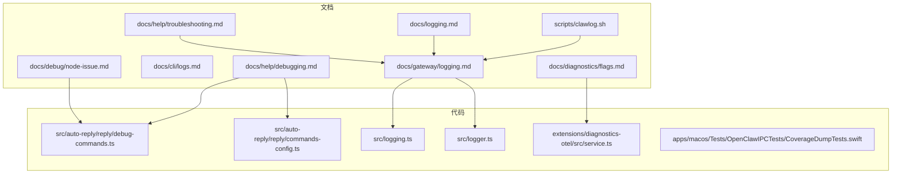

**图表来源**

- [docs/help/debugging.md](file://docs/help/debugging.md#L1-L163)
- [docs/cli/logs.md](file://docs/cli/logs.md#L1-L29)
- [docs/gateway/logging.md](file://docs/gateway/logging.md#L1-L114)
- [docs/diagnostics/flags.md](file://docs/diagnostics/flags.md#L1-L92)
- [scripts/clawlog.sh](file://scripts/clawlog.sh#L1-L310)
- [docs/debug/node-issue.md](file://docs/debug/node-issue.md#L1-L86)
- [docs/help/troubleshooting.md](file://docs/help/troubleshooting.md#L1-L266)
- [docs/logging.md](file://docs/logging.md#L1-L351)
- [src/auto-reply/reply/debug-commands.ts](file://src/auto-reply/reply/debug-commands.ts#L1-L72)
- [src/auto-reply/reply/commands-config.ts](file://src/auto-reply/reply/commands-config.ts#L221-L273)
- [src/logging.ts](file://src/logging.ts#L1-L68)
- [src/logger.ts](file://src/logger.ts#L1-L62)
- [extensions/diagnostics-otel/src/service.ts](file://extensions/diagnostics-otel/src/service.ts#L509-L536)
- [apps/macos/Tests/OpenClawIPCTests/CoverageDumpTests.swift](file://apps/macos/Tests/OpenClawIPCTests/CoverageDumpTests.swift#L1-L24)

**章节来源**

- [docs/help/debugging.md](file://docs/help/debugging.md#L1-L163)
- [docs/cli/logs.md](file://docs/cli/logs.md#L1-L29)
- [docs/gateway/logging.md](file://docs/gateway/logging.md#L1-L114)
- [docs/diagnostics/flags.md](file://docs/diagnostics/flags.md#L1-L92)
- [scripts/clawlog.sh](file://scripts/clawlog.sh#L1-L310)
- [docs/debug/node-issue.md](file://docs/debug/node-issue.md#L1-L86)
- [docs/help/troubleshooting.md](file://docs/help/troubleshooting.md#L1-L266)
- [docs/logging.md](file://docs/logging.md#L1-L351)

## 核心组件

- 运行时调试覆盖（/debug 命令）
  - 支持 show、set、unset、reset 四类操作，作用于内存态配置，不修改磁盘配置
  - 适用于快速切换参数、临时禁用某些行为，便于迭代定位问题
- 守护进程日志与 CLI 尾随
  - 文件日志（JSONL）与控制界面日志同步
  - CLI 提供 --follow、--json、--local-time 等选项，支持远程网关
- 诊断标志与目标化日志
  - 通过 diagnostics.flags 或 OPENCLAW_DIAGNOSTICS 精准开启特定子系统日志
  - 输出仍受 logging.level 与敏感信息脱敏策略影响
- 原始流日志（OpenClaw 与 pi-mono）
  - 开启后记录原始模型输出或原始 OpenAI 兼容块，便于识别推理文本与思考块混杂问题
- macOS 日志工具（clawlog）
  - 使用统一日志子系统，支持按类别、时间范围、错误过滤、搜索、导出等
- 性能与并发观测
  - 通过 diagnostics-otel 插件导出指标与追踪，结合队列深度、等待时间、会话状态等事件观测并发瓶颈
  - 覆盖率写入测试用于验证编译器/运行时覆盖率导出路径

**章节来源**

- [src/auto-reply/reply/debug-commands.ts](file://src/auto-reply/reply/debug-commands.ts#L1-L72)
- [src/auto-reply/reply/commands-config.ts](file://src/auto-reply/reply/commands-config.ts#L221-L273)
- [docs/help/debugging.md](file://docs/help/debugging.md#L15-L163)
- [docs/cli/logs.md](file://docs/cli/logs.md#L1-L29)
- [docs/gateway/logging.md](file://docs/gateway/logging.md#L1-L114)
- [docs/diagnostics/flags.md](file://docs/diagnostics/flags.md#L1-L92)
- [scripts/clawlog.sh](file://scripts/clawlog.sh#L1-L310)
- [extensions/diagnostics-otel/src/service.ts](file://extensions/diagnostics-otel/src/service.ts#L509-L536)
- [apps/macos/Tests/OpenClawIPCTests/CoverageDumpTests.swift](file://apps/macos/Tests/OpenClawIPCTests/CoverageDumpTests.swift#L1-L24)

## 架构总览

下图展示了调试相关的关键交互：CLI 与网关、日志子系统、诊断插件、macOS 统一日志工具之间的关系。

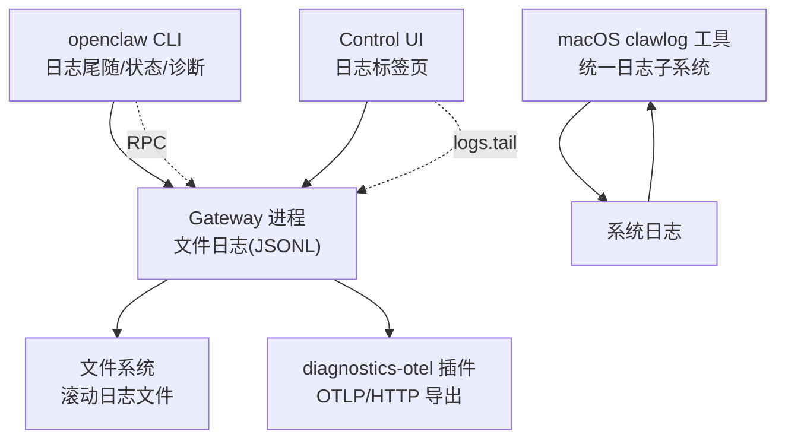

**图表来源**

- [docs/cli/logs.md](file://docs/cli/logs.md#L1-L29)
- [docs/gateway/logging.md](file://docs/gateway/logging.md#L1-L114)
- [docs/logging.md](file://docs/logging.md#L1-L351)
- [extensions/diagnostics-otel/src/service.ts](file://extensions/diagnostics-otel/src/service.ts#L509-L536)
- [scripts/clawlog.sh](file://scripts/clawlog.sh#L1-L310)

## 详细组件分析

### 组件A：运行时调试覆盖（/debug 命令）

- 功能要点
  - 解析 /debug show/set/unset/reset，返回结构化结果
  - set/unset 通过配置覆盖实现，reset 清空覆盖回到磁盘配置
  - 仅内存生效，适合快速试验与迭代
- 使用场景
  - 临时调整消息前缀、开关某些行为、快速回滚
- 注意事项
  - 需先在配置中启用命令开关；否则 /debug 不可用

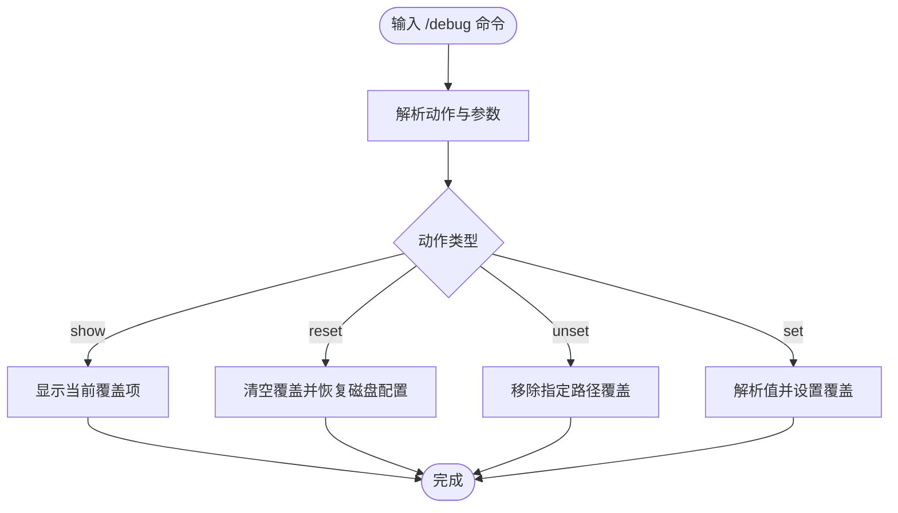

**图表来源**

- [src/auto-reply/reply/debug-commands.ts](file://src/auto-reply/reply/debug-commands.ts#L1-L72)
- [src/auto-reply/reply/commands-config.ts](file://src/auto-reply/reply/commands-config.ts#L221-L273)

**章节来源**

- [src/auto-reply/reply/debug-commands.ts](file://src/auto-reply/reply/debug-commands.ts#L1-L72)
- [src/auto-reply/reply/commands-config.ts](file://src/auto-reply/reply/commands-config.ts#L221-L273)
- [docs/help/debugging.md](file://docs/help/debugging.md#L15-L31)

### 组件B：日志系统与 CLI 尾随

- 文件日志与控制界面
  - 默认滚动文件位于 /tmp/openclaw/openclaw-YYYY-MM-DD.log
  - 控制界面 Logs 标签页通过 logs.tail 实时查看
- CLI 尾随
  - openclaw logs 支持 --follow、--json、--limit、--local-time 等
  - 适合远程模式与自动化工具集成
- 控制台格式与级别
  - consoleLevel 与 consoleStyle 独立于文件日志级别
  - 支持 pretty/compact/json，TTY 自适应颜色
- 敏感信息脱敏
  - tools-only 脱敏，不影响文件日志

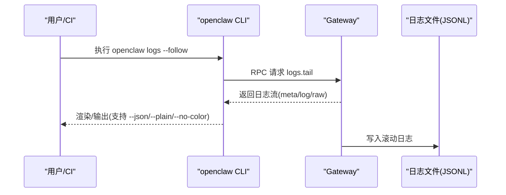

**图表来源**

- [docs/cli/logs.md](file://docs/cli/logs.md#L1-L29)
- [docs/gateway/logging.md](file://docs/gateway/logging.md#L1-L114)
- [docs/logging.md](file://docs/logging.md#L1-L351)

**章节来源**

- [docs/cli/logs.md](file://docs/cli/logs.md#L1-L29)
- [docs/gateway/logging.md](file://docs/gateway/logging.md#L1-L114)
- [docs/logging.md](file://docs/logging.md#L1-L351)

### 组件C：诊断标志与目标化日志

- 作用
  - 在不提升全局日志级别的前提下，精准开启特定子系统日志
  - 支持通配符与一次性环境变量覆盖
- 输出与提取
  - 写入标准日志文件，支持筛选与远程 tail
  - 仍受 redactSensitive 与 logging.level 影响

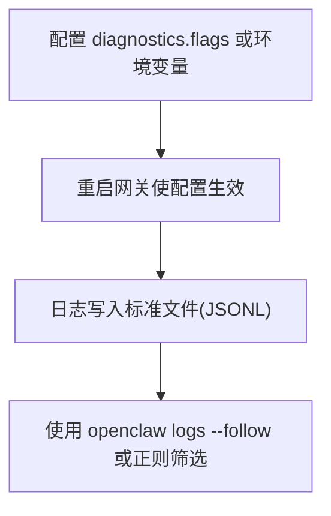

**图表来源**

- [docs/diagnostics/flags.md](file://docs/diagnostics/flags.md#L1-L92)
- [docs/logging.md](file://docs/logging.md#L1-L351)

**章节来源**

- [docs/diagnostics/flags.md](file://docs/diagnostics/flags.md#L1-L92)
- [docs/logging.md](file://docs/logging.md#L1-L351)

### 组件D：原始流日志（OpenClaw 与 pi-mono）

- OpenClaw 原始助手流
  - 记录未过滤/格式化的原始 delta，便于判断推理文本与思考块混杂
  - 支持 CLI 与环境变量开启，可自定义输出路径
- pi-mono 原始块
  - 记录 OpenAI 兼容响应块，便于上游解析问题定位

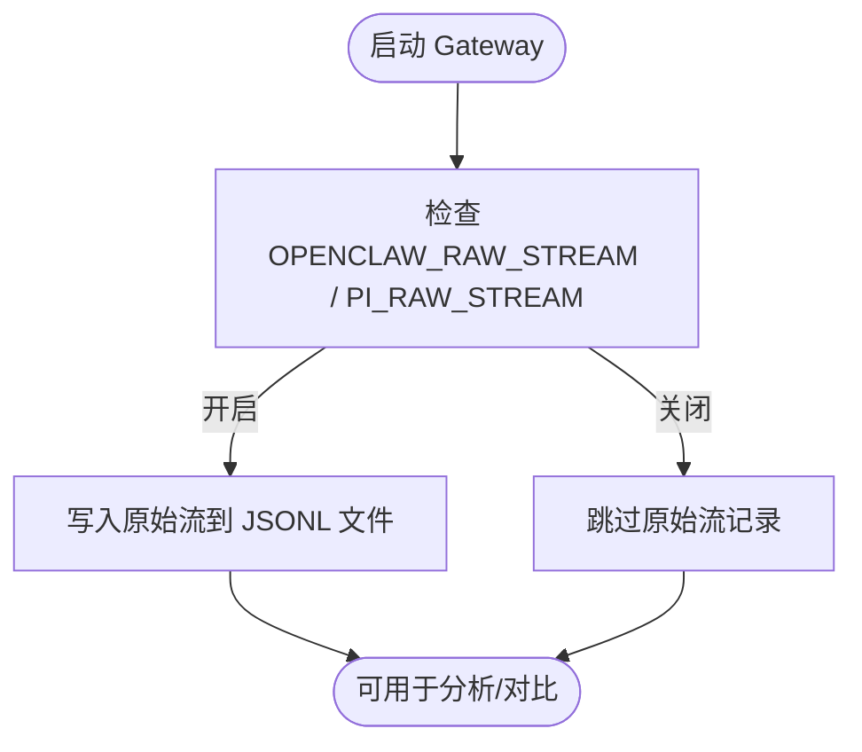

**图表来源**

- [docs/help/debugging.md](file://docs/help/debugging.md#L107-L156)

**章节来源**

- [docs/help/debugging.md](file://docs/help/debugging.md#L107-L156)

### 组件E：macOS 日志工具（clawlog）

- 特性
  - 使用统一日志子系统，支持分类过滤、时间范围、错误过滤、文本搜索、导出、JSON 输出等
  - 需要对 /usr/bin/log 具备 sudo 权限（默认隐藏敏感内容）
- 适用场景
  - 快速定位子系统日志、批量导出、配合 CI/CD 分析

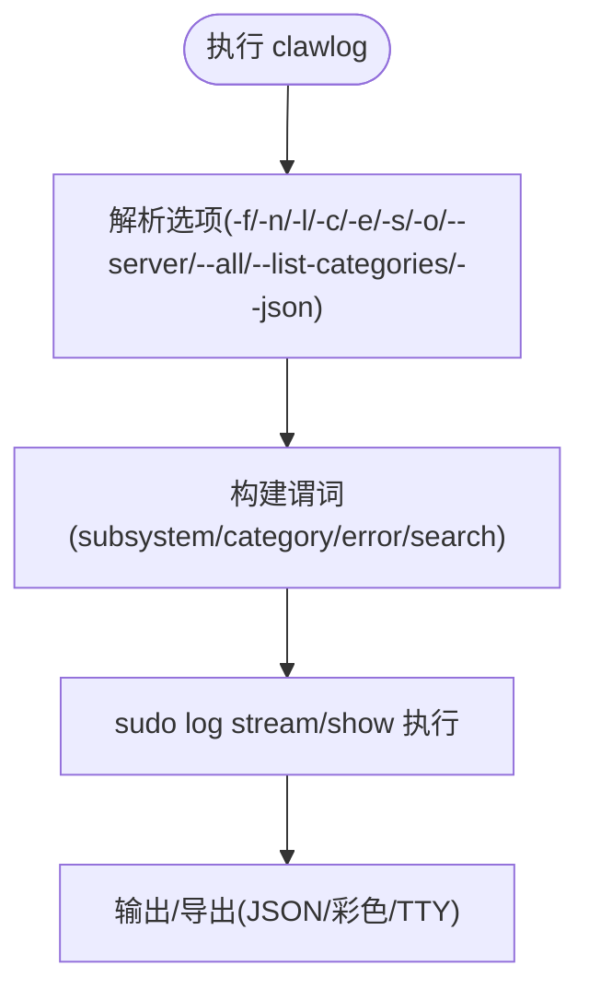

**图表来源**

- [scripts/clawlog.sh](file://scripts/clawlog.sh#L1-L310)

**章节来源**

- [scripts/clawlog.sh](file://scripts/clawlog.sh#L1-L310)

### 组件F：性能与并发观测（OTel 指标与事件）

- 指标与追踪
  - 令牌用量、成本、上下文大小、运行时长、Webhook/消息处理计数与直方图
  - 队列深度、等待时间、会话状态转换、卡住告警、重试尝试等
- 事件观测
  - queue.lane.enqueue/dequeue、session.state、run.attempt 等
- 使用建议
  - 结合 --verbose 与诊断标志，定位慢调用与阻塞点
  - 在高吞吐场景优先在收集端做采样/过滤

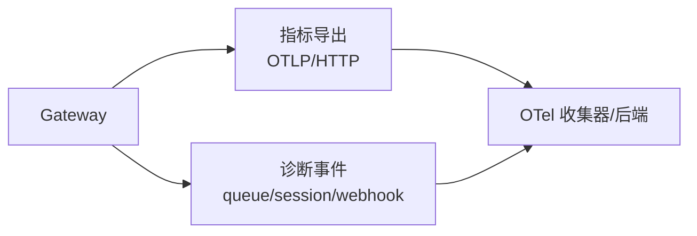

**图表来源**

- [extensions/diagnostics-otel/src/service.ts](file://extensions/diagnostics-otel/src/service.ts#L509-L536)
- [docs/logging.md](file://docs/logging.md#L140-L351)

**章节来源**

- [extensions/diagnostics-otel/src/service.ts](file://extensions/diagnostics-otel/src/service.ts#L509-L536)
- [docs/logging.md](file://docs/logging.md#L140-L351)

### 组件G：Node + tsx 启动崩溃（兼容性问题）

- 症状
  - Node 25.x + tsx 下出现 \_\_name is not a function 错误
- 影响
  - 与 esbuild keepNames 生成的 \_\_name 辅助函数相关
- 临时方案
  - 使用 Bun 或 Node + tsc watch + 编译产物运行
  - 测试 Node LTS（22/24），确认是否为 Node 25 特有问题

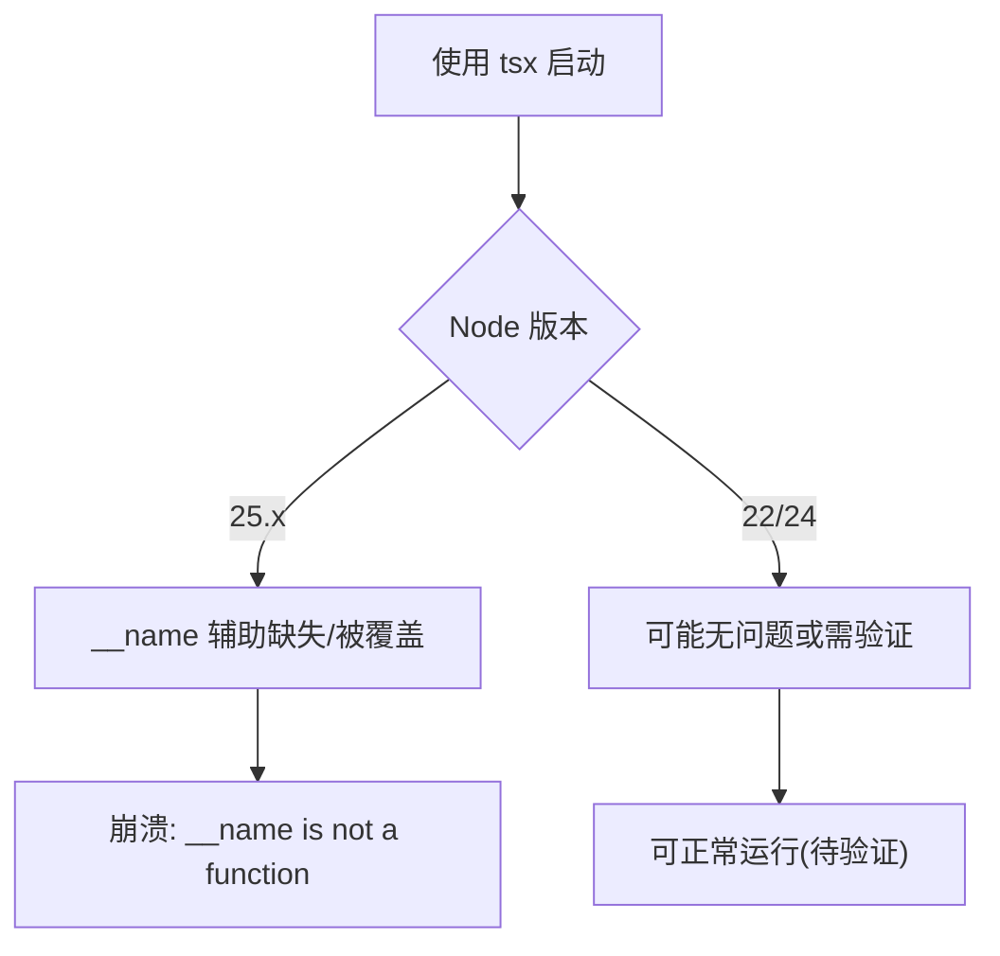

**图表来源**

- [docs/debug/node-issue.md](file://docs/debug/node-issue.md#L1-L86)

**章节来源**

- [docs/debug/node-issue.md](file://docs/debug/node-issue.md#L1-L86)

## 依赖关系分析

- 日志子系统
  - src/logging.ts 与 src/logger.ts 提供日志 API、子系统日志器、级别与文件落盘接口
  - 与 CLI/控制界面通过 RPC/文件读取协同
- 调试命令
  - debug-commands.ts 负责解析 /debug，commands-config.ts 负责应用覆盖
- 诊断与导出
  - diagnostics-otel 插件将事件与指标导出至 OTLP 收集器
- 平台工具
  - macOS clawlog 依赖系统统一日志子系统

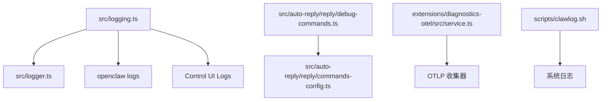

**图表来源**

- [src/logging.ts](file://src/logging.ts#L1-L68)
- [src/logger.ts](file://src/logger.ts#L1-L62)
- [src/auto-reply/reply/debug-commands.ts](file://src/auto-reply/reply/debug-commands.ts#L1-L72)
- [src/auto-reply/reply/commands-config.ts](file://src/auto-reply/reply/commands-config.ts#L221-L273)
- [extensions/diagnostics-otel/src/service.ts](file://extensions/diagnostics-otel/src/service.ts#L509-L536)
- [scripts/clawlog.sh](file://scripts/clawlog.sh#L1-L310)

**章节来源**

- [src/logging.ts](file://src/logging.ts#L1-L68)
- [src/logger.ts](file://src/logger.ts#L1-L62)
- [src/auto-reply/reply/debug-commands.ts](file://src/auto-reply/reply/debug-commands.ts#L1-L72)
- [src/auto-reply/reply/commands-config.ts](file://src/auto-reply/reply/commands-config.ts#L221-L273)
- [extensions/diagnostics-otel/src/service.ts](file://extensions/diagnostics-otel/src/service.ts#L509-L536)
- [scripts/clawlog.sh](file://scripts/clawlog.sh#L1-L310)

## 性能考虑

- 使用诊断标志与 --verbose 精准定位慢调用与阻塞点，避免全局提升日志级别带来的开销
- 对高吞吐场景，优先在 OTel 收集端做采样/过滤，减少带宽与存储压力
- 关注队列深度与等待时间直方图，识别并发瓶颈与资源争用
- 利用原始流日志比对不同模型/参数下的输出差异，辅助推理泄漏与性能回归分析

[本节为通用指导，无需列出具体文件来源]

## 故障排查指南

- 快速三分钟检查清单
  - openclaw status / --all / gateway probe / status / doctor / channels status --probe / logs --follow
  - 关注：Runtime: running、RPC probe: ok、通道连接状态、日志是否有重复致命错误
- 决策树（症状导向）
  - 无回复、控制 UI 无法连接、网关未启动、通道已连但消息不流动、定时任务未触发、节点工具失败、浏览器工具失败
  - 每个分支提供对应命令与常见日志特征，便于快速收敛问题范围

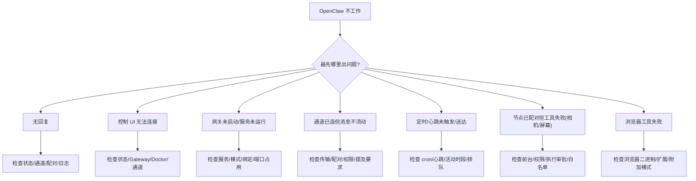

**图表来源**

- [docs/help/troubleshooting.md](file://docs/help/troubleshooting.md#L39-L266)

**章节来源**

- [docs/help/troubleshooting.md](file://docs/help/troubleshooting.md#L1-L266)

## 结论

通过“运行时调试覆盖 + 目标化日志 + 原始流日志 + OTel 指标/事件 + macOS 统一日志工具”的组合，可以形成从现象到根因的闭环调试流程。建议在开发与生产环境中分别采用“轻量级诊断标志 + OTel 采样”与“严格脱敏 + 低冗余输出”的策略，确保可观测性与安全性平衡。

[本节为总结性内容，无需列出具体文件来源]

## 附录

### 环境变量与配置要点

- 运行时调试覆盖
  - 命令：/debug show|set|unset|reset
  - 配置开关：commands.debug
- 原始流日志
  - OPENCLAW_RAW_STREAM=1 / OPENCLAW_RAW_STREAM_PATH
  - PI_RAW_STREAM=1 / PI_RAW_STREAM_PATH
- 诊断标志
  - diagnostics.flags 或 OPENCLAW_DIAGNOSTICS
- 日志级别与样式
  - logging.level、logging.consoleLevel、logging.consoleStyle、logging.redactSensitive
- CLI 尾随
  - openclaw logs --follow / --json / --limit N / --local-time

**章节来源**

- [docs/help/debugging.md](file://docs/help/debugging.md#L15-L163)
- [docs/diagnostics/flags.md](file://docs/diagnostics/flags.md#L1-L92)
- [docs/gateway/logging.md](file://docs/gateway/logging.md#L1-L114)
- [docs/cli/logs.md](file://docs/cli/logs.md#L1-L29)
- [docs/logging.md](file://docs/logging.md#L1-L351)
