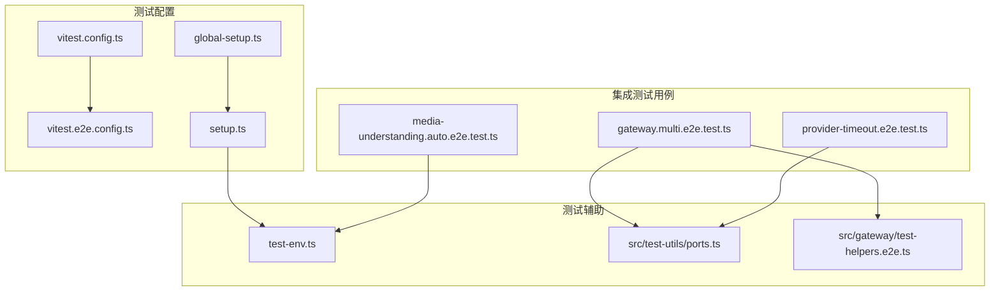
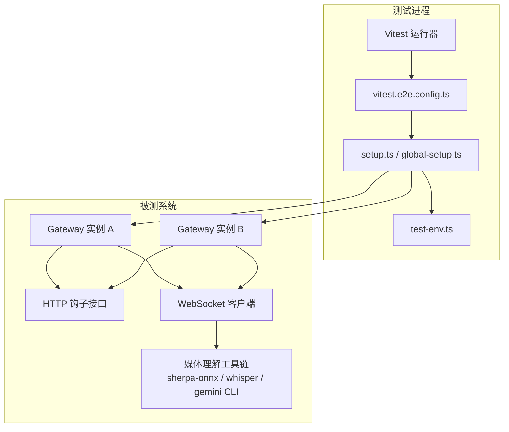
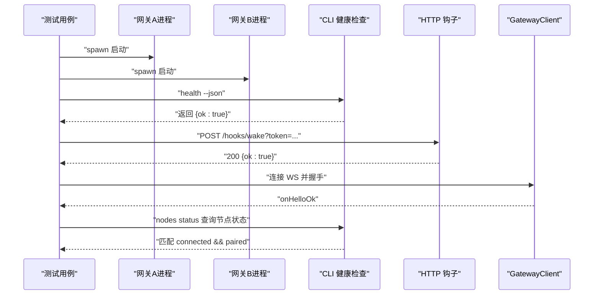
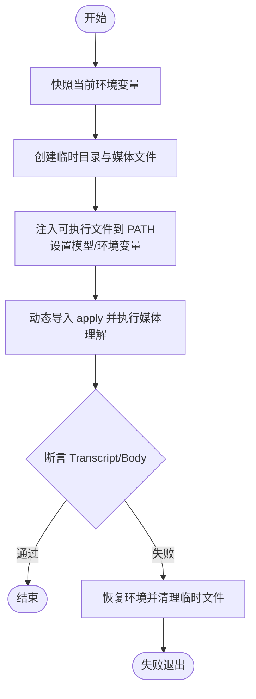
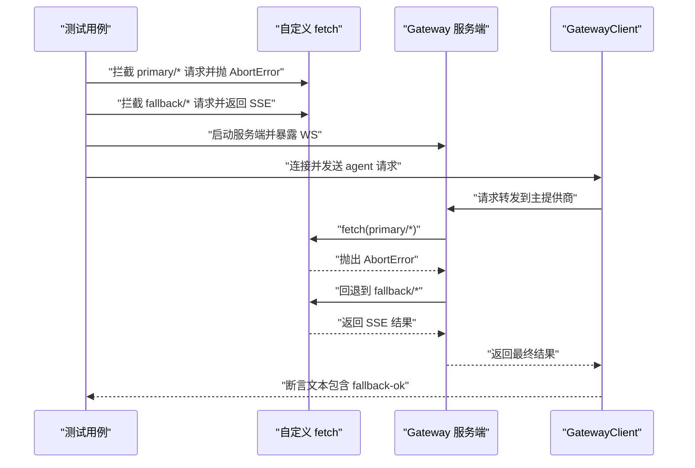
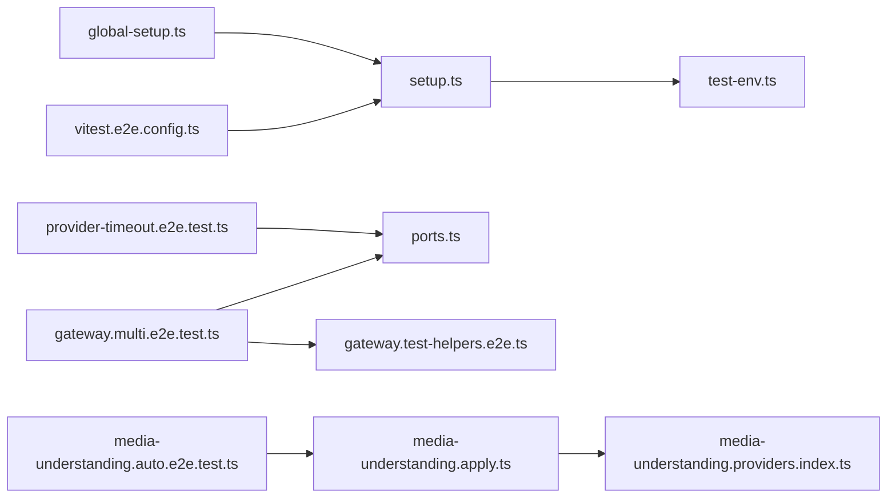

# 集成测试

<cite>
**本文引用的文件**   
- [gateway.multi.e2e.test.ts](file://test/gateway.multi.e2e.test.ts)
- [media-understanding.auto.e2e.test.ts](file://test/media-understanding.auto.e2e.test.ts)
- [provider-timeout.e2e.test.ts](file://test/provider-timeout.e2e.test.ts)
- [vitest.e2e.config.ts](file://vitest.e2e.config.ts)
- [vitest.config.ts](file://vitest.config.ts)
- [setup.ts](file://test/setup.ts)
- [global-setup.ts](file://test/global-setup.ts)
- [test-env.ts](file://test/test-env.ts)
- [ports.ts](file://src/test-utils/ports.ts)
- [gateway.ts（客户端）](file://src/gateway/client.ts)
- [gateway.ts（服务端）](file://src/gateway/server.ts)
- [gateway.test-helpers.e2e.ts](file://src/gateway/test-helpers.e2e.ts)
- [gateway.test-helpers.server.ts](file://src/gateway/test-helpers.server.ts)
- [gateway.probe.ts](file://src/gateway/probe.ts)
- [gateway.call.ts](file://src/gateway/call.ts)
- [media-understanding.apply.ts](file://src/media-understanding/apply.ts)
- [media-understanding.providers.index.ts](file://src/media-understanding/providers/index.ts)
- [gateway-network-docker.sh](file://scripts/e2e/gateway-network-docker.sh)
</cite>

## 目录

1. [引言](#引言)
2. [项目结构](#项目结构)
3. [核心组件](#核心组件)
4. [架构总览](#架构总览)
5. [详细组件分析](#详细组件分析)
6. [依赖关系分析](#依赖关系分析)
7. [性能考量](#性能考量)
8. [故障排除指南](#故障排除指南)
9. [结论](#结论)
10. [附录](#附录)

## 引言

本文件面向OpenClaw的集成测试体系，系统化阐述端到端测试的设计与实现，覆盖以下主题：

- 网关多实例测试：验证多个网关进程并行运行、互不干扰，并通过WebSocket与HTTP进行连通性与配对流程。
- 媒体理解测试：验证音频/图像等媒体在不同外部工具（如sherpa-onnx、whisper、gemini CLI）下的自动检测与转录/理解能力。
- 提供商超时测试：模拟主模型提供商请求超时（AbortError），验证降级回退机制是否按预期触发。

同时，文档记录了测试环境搭建、测试数据准备与清理策略，提供调试技巧与故障排除方法，并给出测试隔离、并发与性能测试的实现方案。

## 项目结构

OpenClaw采用Vitest作为测试框架，集成测试位于test目录下，分别对应上述三大场景。核心配置集中在根目录的vitest配置文件中，测试环境隔离由test-env.ts与setup.ts负责。

图表来源

- [vitest.config.ts](file://vitest.config.ts#L1-L105)
- [vitest.e2e.config.ts](file://vitest.e2e.config.ts#L1-L21)
- [global-setup.ts](file://test/global-setup.ts#L1-L7)
- [setup.ts](file://test/setup.ts#L1-L169)
- [test-env.ts](file://test/test-env.ts#L1-L148)
- [ports.ts](file://src/test-utils/ports.ts#L1-L93)
- [gateway.test-helpers.e2e.ts](file://src/gateway/test-helpers.e2e.ts#L19-L61)

章节来源

- [vitest.config.ts](file://vitest.config.ts#L1-L105)
- [vitest.e2e.config.ts](file://vitest.e2e.config.ts#L1-L21)
- [global-setup.ts](file://test/global-setup.ts#L1-L7)
- [setup.ts](file://test/setup.ts#L1-L169)
- [test-env.ts](file://test/test-env.ts#L1-L148)

## 核心组件

- 测试运行器与并发控制：通过vitest.e2e.config.ts限制最大工作线程数，确保E2E测试在CI与本地环境的稳定性。
- 测试环境隔离：test-env.ts将HOME与XDG系列路径重定向至临时目录，避免污染真实用户状态；global-setup.ts与setup.ts在全局与每个测试文件前执行环境安装与插件注册。
- 端口分配：ports.ts提供确定性的端口块分配算法，避免并行测试导致的端口冲突。
- 网关客户端与服务端：gateway.ts（客户端）与gateway.ts（服务端）为E2E测试提供连接、请求与关闭的基础设施；test-helpers.e2e.ts与test-helpers.server.ts提供便捷的连接与认证封装；probe.ts与call.ts用于探测与调用。

章节来源

- [vitest.e2e.config.ts](file://vitest.e2e.config.ts#L1-L21)
- [test-env.ts](file://test/test-env.ts#L54-L148)
- [ports.ts](file://src/test-utils/ports.ts#L34-L93)
- [gateway.ts（客户端）](file://src/gateway/client.ts)
- [gateway.ts（服务端）](file://src/gateway/server.ts)
- [gateway.test-helpers.e2e.ts](file://src/gateway/test-helpers.e2e.ts#L19-L61)
- [gateway.test-helpers.server.ts](file://src/gateway/test-helpers.server.ts#L370-L419)
- [gateway.probe.ts](file://src/gateway/probe.ts#L53-L119)
- [gateway.call.ts](file://src/gateway/call.ts#L260-L312)

## 架构总览

下图展示OpenClaw集成测试的整体架构：测试驱动多个子进程（网关实例）、HTTP钩子、WebSocket客户端，以及外部媒体工具，形成完整的端到端闭环。

图表来源

- [vitest.e2e.config.ts](file://vitest.e2e.config.ts#L12-L20)
- [setup.ts](file://test/setup.ts#L1-L169)
- [test-env.ts](file://test/test-env.ts#L54-L148)
- [gateway.multi.e2e.test.ts](file://test/gateway.multi.e2e.test.ts#L372-L421)

## 详细组件分析

### 网关多实例测试（gateway.multi.e2e.test.ts）

该测试用例验证：

- 同时启动两个网关实例，各自绑定独立端口与令牌；
- 通过CLI健康检查与HTTP钩子接口确认连通性；
- 使用GatewayClient建立WebSocket连接并完成节点配对，最终在CLI查询节点状态以确认双方握手成功。

关键实现要点：

- 端口与配置生成：使用临时目录存放配置与状态，避免污染宿主环境。
- 进程生命周期管理：启动、等待监听、超时检测、优雅关闭与强制终止回退。
- 并发与断言：使用Promise.all并发发起HTTP钩子与节点连接，最后统一等待节点状态满足“已连接且已配对”。

图表来源

- [gateway.multi.e2e.test.ts](file://test/gateway.multi.e2e.test.ts#L372-L421)
- [gateway.ts（客户端）](file://src/gateway/client.ts)
- [gateway.ts（服务端）](file://src/gateway/server.ts)

章节来源

- [gateway.multi.e2e.test.ts](file://test/gateway.multi.e2e.test.ts#L1-L422)

### 媒体理解测试（media-understanding.auto.e2e.test.ts）

该测试用例验证媒体理解的自动选择逻辑：

- 当sherpa-onnx可用时优先使用其离线转录；
- 当缺失sherpa时回退到whisper-cli；
- 对于图像，当gemini CLI可用时使用其视觉理解输出。

实现策略：

- 临时目录与可执行文件注入PATH，设置模型目录或模型文件路径；
- 通过动态导入src/media-understanding/apply.ts执行媒体理解应用逻辑；
- 断言上下文中的Transcript或Body内容符合预期。

图表来源

- [media-understanding.auto.e2e.test.ts](file://test/media-understanding.auto.e2e.test.ts#L23-L167)
- [media-understanding.apply.ts](file://src/media-understanding/apply.ts)
- [media-understanding.providers.index.ts](file://src/media-understanding/providers/index.ts#L29-L58)

章节来源

- [media-understanding.auto.e2e.test.ts](file://test/media-understanding.auto.e2e.test.ts#L1-L168)

### 提供商超时测试（provider-timeout.e2e.test.ts）

该测试用例验证主提供商超时回退机制：

- 模拟主提供商在响应流中抛出AbortError；
- 断言回退提供商能正确返回结果；
- 统计主/备提供商调用次数，确保回退生效。

实现策略：

- 使用自定义fetch拦截主提供商URL，抛出AbortError；
- 为回退提供商构造OpenAI风格的SSE响应；
- 在隔离的HOME与配置路径下启动网关服务端，使用GatewayClient发起会话请求并断言结果。

图表来源

- [provider-timeout.e2e.test.ts](file://test/provider-timeout.e2e.test.ts#L117-L309)
- [gateway.ts（客户端）](file://src/gateway/client.ts)
- [gateway.ts（服务端）](file://src/gateway/server.ts)

章节来源

- [provider-timeout.e2e.test.ts](file://test/provider-timeout.e2e.test.ts#L1-L310)

## 依赖关系分析

- 测试配置与隔离
  - vitest.e2e.config.ts控制E2E测试的include/exclude与最大并发工作线程数，避免CI资源竞争。
  - setup.ts与global-setup.ts在测试前安装警告过滤、隔离HOME与XDG路径，并注册测试插件。
  - test-env.ts提供withIsolatedTestHome函数，确保每次测试都在隔离的临时目录中运行。

- 端口与网络
  - ports.ts提供确定性端口块分配，避免并行测试因衍生端口冲突而失败。
  - gateway.test-helpers.e2e.ts提供连接封装与设备认证请求，简化测试代码。

- 媒体理解
  - media-understanding.providers.index.ts构建媒体理解提供者注册表，支持覆盖与合并，保证测试可注入自定义提供者。

图表来源

- [vitest.e2e.config.ts](file://vitest.e2e.config.ts#L12-L20)
- [setup.ts](file://test/setup.ts#L1-L169)
- [global-setup.ts](file://test/global-setup.ts#L1-L7)
- [test-env.ts](file://test/test-env.ts#L54-L148)
- [ports.ts](file://src/test-utils/ports.ts#L34-L93)
- [gateway.test-helpers.e2e.ts](file://src/gateway/test-helpers.e2e.ts#L19-L61)
- [media-understanding.apply.ts](file://src/media-understanding/apply.ts)
- [media-understanding.providers.index.ts](file://src/media-understanding/providers/index.ts#L29-L58)

章节来源

- [vitest.e2e.config.ts](file://vitest.e2e.config.ts#L1-L21)
- [setup.ts](file://test/setup.ts#L1-L169)
- [global-setup.ts](file://test/global-setup.ts#L1-L7)
- [test-env.ts](file://test/test-env.ts#L1-L148)
- [ports.ts](file://src/test-utils/ports.ts#L1-L93)
- [gateway.test-helpers.e2e.ts](file://src/gateway/test-helpers.e2e.ts#L1-L61)
- [media-understanding.apply.ts](file://src/media-understanding/apply.ts)
- [media-understanding.providers.index.ts](file://src/media-understanding/providers/index.ts#L1-L58)

## 性能考量

- 并发与资源
  - E2E测试工作线程数根据CPU核数与CI平台动态调整，避免过度并发导致资源争用。
  - 确保每个测试使用独立端口块，减少网络层抖动与冲突。
- 超时与重试
  - 网关连接与健康探测设置合理超时，避免单点阻塞影响整体吞吐。
  - 媒体工具链的外部可执行文件应具备快速返回能力，必要时在测试中注入轻量实现以降低端到端耗时。
- 日志与可观测性
  - 在容器化E2E脚本中保留尾部日志以便定位启动失败原因，便于快速收敛问题。

章节来源

- [vitest.e2e.config.ts](file://vitest.e2e.config.ts#L5-L7)
- [gateway-network-docker.sh](file://scripts/e2e/gateway-network-docker.sh#L36-L86)

## 故障排除指南

- 网关无法启动或监听
  - 检查端口占用与防火墙策略；使用ports.ts提供的确定性端口分配避免冲突。
  - 查看容器内日志尾部输出，定位启动错误信息。
- WebSocket连接失败
  - 使用gateway.probe.ts或gateway.call.ts进行连通性探测，确认握手阶段错误码与消息。
  - 核对客户端版本范围与服务端协议版本一致性。
- 媒体工具不可用
  - 确认PATH中注入的可执行文件存在且具备可执行权限；模型文件路径正确。
  - 在测试结束后恢复原始环境变量，避免影响后续测试。
- 回退未触发
  - 确认主提供商URL拦截逻辑正确抛出AbortError；回退提供商SSE响应格式符合预期。
  - 检查配置文件中主/备提供商的baseUrl与模型映射。

章节来源

- [gateway.probe.ts](file://src/gateway/probe.ts#L53-L119)
- [gateway.call.ts](file://src/gateway/call.ts#L260-L312)
- [gateway-network-docker.sh](file://scripts/e2e/gateway-network-docker.sh#L36-L86)
- [media-understanding.auto.e2e.test.ts](file://test/media-understanding.auto.e2e.test.ts#L23-L167)
- [provider-timeout.e2e.test.ts](file://test/provider-timeout.e2e.test.ts#L117-L309)

## 结论

OpenClaw的集成测试通过明确的测试职责划分、严格的环境隔离与确定性端口分配，有效保障了网关多实例、媒体理解与提供商回退等关键路径的稳定性。配合合理的并发与超时策略，能够在CI与本地环境中高效运行并快速定位问题。

## 附录

### 测试环境搭建与清理策略

- 环境隔离
  - 使用withIsolatedTestHome创建临时HOME与XDG目录，避免污染真实用户配置。
  - 在global-setup.ts与setup.ts中安装警告过滤与插件注册，确保测试前后状态一致。
- 清理策略
  - 每个测试文件结束后清理临时目录与环境变量快照，防止跨文件泄漏。
  - 网关进程退出后强制清理临时目录，避免残留文件影响下次测试。

章节来源

- [test-env.ts](file://test/test-env.ts#L54-L148)
- [global-setup.ts](file://test/global-setup.ts#L1-L7)
- [setup.ts](file://test/setup.ts#L160-L169)

### 并发测试与性能测试实现方案

- 并发测试
  - 使用vitest.e2e.config.ts限制最大工作线程数，结合ports.ts的确定性端口块分配，避免端口冲突。
  - 将长耗时任务拆分为独立测试文件，减少相互依赖。
- 性能测试
  - 在测试中注入轻量外部工具实现（如SSE响应生成器），评估端到端延迟与吞吐。
  - 使用容器化脚本gateway-network-docker.sh在隔离网络中运行，模拟真实部署环境。

章节来源

- [vitest.e2e.config.ts](file://vitest.e2e.config.ts#L5-L7)
- [ports.ts](file://src/test-utils/ports.ts#L34-L93)
- [gateway-network-docker.sh](file://scripts/e2e/gateway-network-docker.sh#L36-L86)
