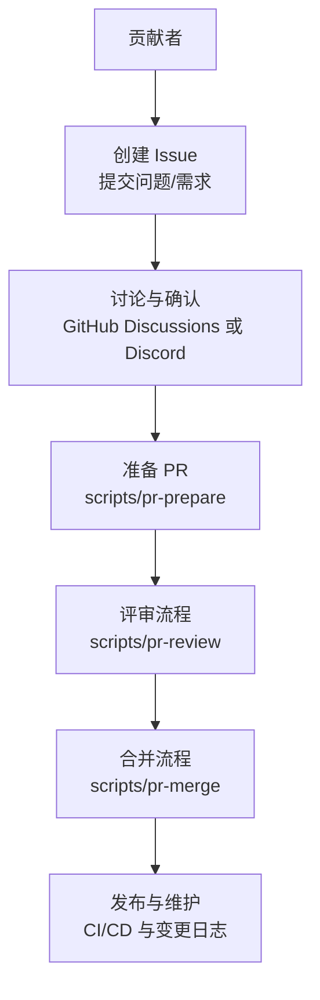
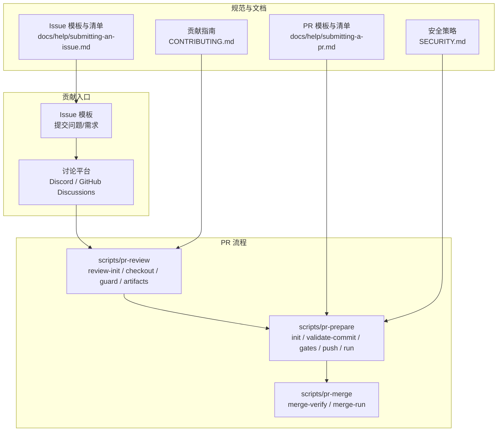
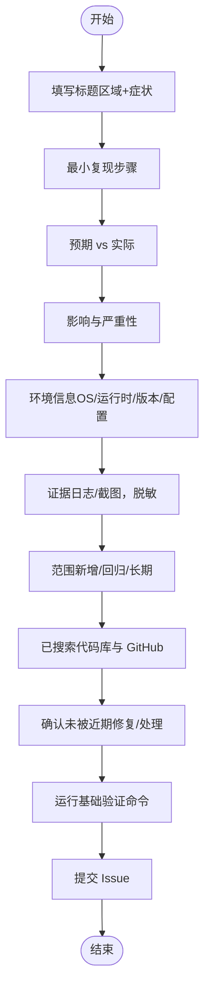
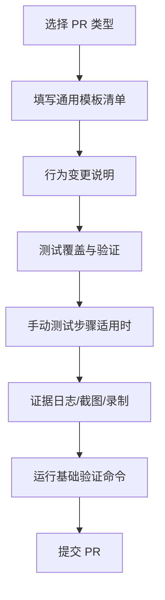
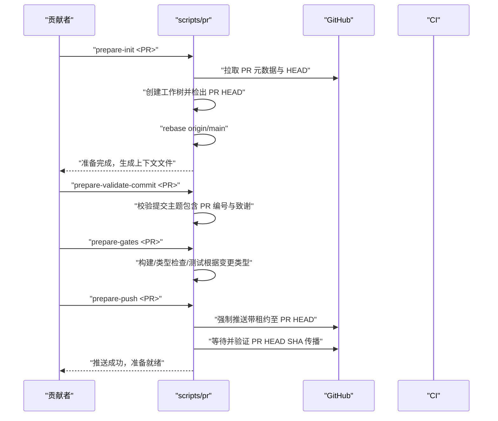
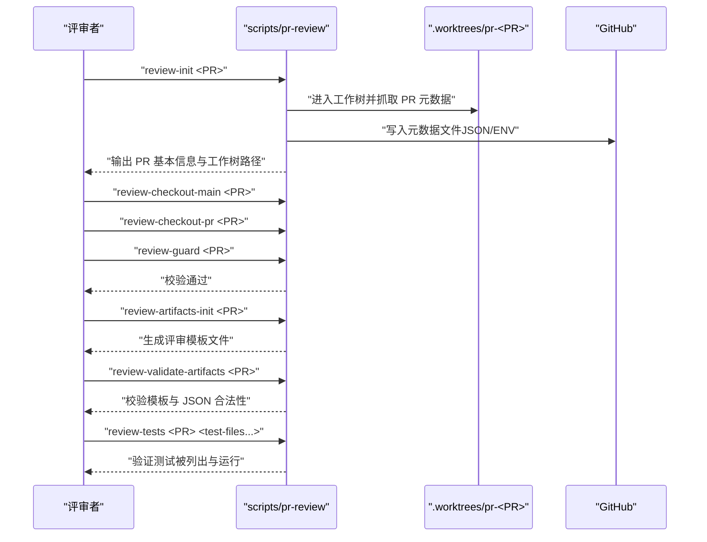
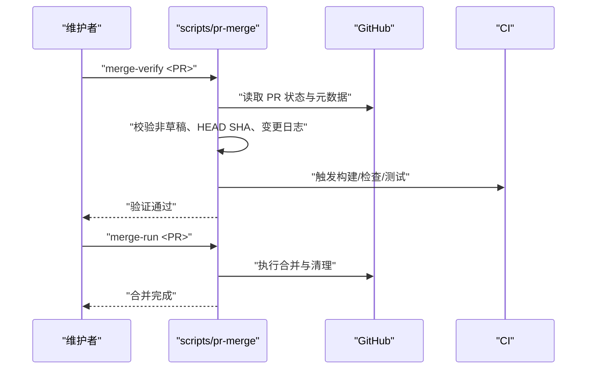
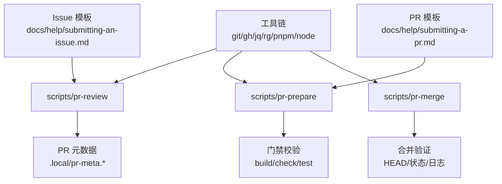

# 贡献流程

<cite>
**本文引用的文件**
- [CONTRIBUTING.md](file://CONTRIBUTING.md)
- [README.md](file://README.md)
- [SECURITY.md](file://SECURITY.md)
- [docs/help/submitting-a-pr.md](file://docs/help/submitting-a-pr.md)
- [docs/help/submitting-an-issue.md](file://docs/help/submitting-an-issue.md)
- [scripts/pr](file://scripts/pr)
- [scripts/pr-prepare](file://scripts/pr-prepare)
- [scripts/pr-review](file://scripts/pr-review)
- [scripts/pr-merge](file://scripts/pr-merge)
</cite>

## 目录

1. [简介](#简介)
2. [项目结构](#项目结构)
3. [核心组件](#核心组件)
4. [架构总览](#架构总览)
5. [详细组件分析](#详细组件分析)
6. [依赖关系分析](#依赖关系分析)
7. [性能考虑](#性能考虑)
8. [故障排查指南](#故障排查指南)
9. [结论](#结论)
10. [附录](#附录)

## 简介

本指南面向所有希望参与 OpenClaw 开源项目的贡献者，覆盖从 Issue 创建、PR 准备与评审、到合并与维护的全流程规范。内容基于仓库中的贡献说明、帮助文档与自动化脚本，确保新老贡献者都能高效协作。

## 项目结构

OpenClaw 采用多模块与多语言混合的工程组织方式，涵盖后端服务、前端 UI、移动应用、扩展插件、技能系统以及大量自动化脚本与文档。贡献流程围绕以下关键要素展开：

- Issue 规范：问题描述、最小复现、影响评估、证据与环境信息
- PR 规范：类型分类、行为变更说明、测试覆盖、手动验证步骤、证据与签名
- 自动化脚本：评审初始化、准备流程（校验、门禁、推送）、合并验证与执行
- 安全策略：漏洞披露渠道、最低运行版本要求、容器安全建议
- 社区与治理：维护者列表、讨论平台、角色职责与沟通方式

[本图为概念性流程图，不直接映射具体源码文件，故无“图表来源”标注]

**章节来源**

- [CONTRIBUTING.md](file://CONTRIBUTING.md#L34-L86)
- [README.md](file://README.md#L78-L86)

## 核心组件

- 贡献入口与沟通渠道
  - GitHub Issues 与 Discussions、Discord 频道、Twitter/X
  - 维护者列表与联系方式
- Issue 模板与规范
  - 明确标题、最小复现、预期/实际、影响与严重性、环境、证据、范围、已搜索与近期修复确认
- PR 模板与规范
  - 类型分类（修复、特性、重构、维护、文档、测试、性能、UX/UI、基础设施/构建、安全）
  - 结构化清单：摘要、行为变更、代码库与 GitHub 搜索、测试、手动测试步骤、前提条件、步骤、证据、签名
- 自动化脚本
  - review-init / review-checkout-main / review-checkout-pr / review-guard / review-artifacts-init / review-validate-artifacts / review-tests
  - prepare-init / prepare-validate-commit / prepare-gates / prepare-push / prepare-run
  - merge-verify / merge-run
- 安全策略
  - 漏洞报告渠道、必需的 Node.js 版本、Docker 安全建议、detect-secrets 扫描

**章节来源**

- [CONTRIBUTING.md](file://CONTRIBUTING.md#L5-L112)
- [docs/help/submitting-an-issue.md](file://docs/help/submitting-an-issue.md#L1-L153)
- [docs/help/submitting-a-pr.md](file://docs/help/submitting-a-pr.md#L1-L399)
- [scripts/pr](file://scripts/pr#L1-L800)
- [SECURITY.md](file://SECURITY.md#L1-L100)

## 架构总览

下图展示贡献流程在仓库中的落地：从 Issue 到 PR 的准备、评审与合并，贯穿自动化脚本与文档模板。

**图表来源**

- [scripts/pr](file://scripts/pr#L490-L520)
- [scripts/pr-prepare](file://scripts/pr-prepare#L1-L34)
- [scripts/pr-review](file://scripts/pr-review#L1-L4)
- [scripts/pr-merge](file://scripts/pr-merge#L1-L38)
- [docs/help/submitting-a-pr.md](file://docs/help/submitting-a-pr.md#L61-L91)
- [docs/help/submitting-an-issue.md](file://docs/help/submitting-an-issue.md#L34-L62)
- [CONTRIBUTING.md](file://CONTRIBUTING.md#L34-L86)
- [SECURITY.md](file://SECURITY.md#L1-L100)

## 详细组件分析

### Issue 创建与模板使用

- 必备字段
  - 标题：区域与症状
  - 最小复现步骤
  - 预期 vs 实际
  - 影响与严重性
  - 环境：操作系统、运行时、版本、配置
  - 证据：脱敏日志、截图（非 PII）
  - 范围：新增、回归或长期存在
  - 已搜索代码库与 GitHub
  - 确认未被近期修复/处理（尤其安全类）
  - 声明基于证据或可复现
- 模板类型
  - 缺陷报告、安全问题、回归报告、功能请求、增强、调查
- 提交前验证
  - 运行基础命令：lint、check、build、test、协议检查（如涉及）

**图表来源**

- [docs/help/submitting-an-issue.md](file://docs/help/submitting-an-issue.md#L10-L33)

**章节来源**

- [docs/help/submitting-an-issue.md](file://docs/help/submitting-an-issue.md#L1-L153)

### PR 规范与模板

- PR 类型与要点
  - 修复：提供复现、根因、验证
  - 特性：用例、行为演示/截图（UI）
  - 重构：声明“无行为变更”，列出移动/简化内容
  - 维护：说明原因（构建时间、CI、依赖）
  - 文档：前后对比、更新页面链接、运行格式化
  - 测试：覆盖缺口、如何防止回归
  - 性能：前后指标与测量方法
  - UX/UI：截图/视频、无障碍影响
  - 基础设施/构建：环境与验证
  - 安全：风险摘要、复现、缓解/修复、验证
- 结构化清单（通用模板）
  - 摘要、行为变更、代码库与 GitHub 搜索、测试、手动测试步骤、前提条件、步骤、证据、签名
- 提交前验证命令
  - lint、check、build、test、协议检查（如涉及）

**图表来源**

- [docs/help/submitting-a-pr.md](file://docs/help/submitting-a-pr.md#L38-L91)

**章节来源**

- [docs/help/submitting-a-pr.md](file://docs/help/submitting-a-pr.md#L1-L399)

### 分支管理策略与提交信息格式

- 分支策略
  - 使用 Git worktree 在本地隔离 PR 工作树，便于评审与准备阶段并行操作
  - 评审基线：main 基线与 PR HEAD 双视角切换
  - 准备阶段：在临时分支上 rebase origin/main，确保基线一致
- 提交信息格式
  - 必须包含 PR 编号与致谢作者标识，以保证自动化校验通过
- 推送策略
  - 使用带租约的强制推送，确保远程分支与本地 prep HEAD 一致，并验证 PR HEAD SHA 传播

**图表来源**

- [scripts/pr](file://scripts/pr#L522-L781)

**章节来源**

- [scripts/pr](file://scripts/pr#L490-L520)
- [scripts/pr](file://scripts/pr#L575-L605)
- [scripts/pr](file://scripts/pr#L607-L647)
- [scripts/pr](file://scripts/pr#L649-L772)

### 变更日志维护

- 工作流要求
  - 每个准备好的 PR 必须包含对变更日志的更新
  - 该策略由脚本在 gate 阶段强制校验
- 建议实践
  - 在 PR 准备阶段同步更新变更日志，避免遗漏
  - 保持条目简洁、聚焦、可追溯

**章节来源**

- [scripts/pr](file://scripts/pr#L624-L628)

### 代码审查标准与评审流程

- 评审初始化
  - 初始化工作树、抓取元数据、设置评审模式（main 或 pr）
- 评审基线与对比
  - 支持切换到 main 基线与 PR HEAD 进行对比
  - 强制守卫：确保当前 HEAD 与期望值一致
- 评审产物
  - 结构化评审意见模板（推荐、变更点、安全发现、测试、文档、变更日志等）
  - JSON 校验：推荐结论、严重性、文档状态、变更日志状态等字段合法性
- 测试验证
  - 通过 vitest 列表与运行输出校验目标测试是否被选中与执行

**图表来源**

- [scripts/pr](file://scripts/pr#L237-L305)
- [scripts/pr](file://scripts/pr#L307-L354)
- [scripts/pr](file://scripts/pr#L356-L423)
- [scripts/pr](file://scripts/pr#L425-L488)

**章节来源**

- [scripts/pr](file://scripts/pr#L237-L305)
- [scripts/pr](file://scripts/pr#L307-L354)
- [scripts/pr](file://scripts/pr#L356-L423)
- [scripts/pr](file://scripts/pr#L425-L488)

### 合并流程与门禁

- 合并验证
  - 校验 PR 非草稿、HEAD SHA、是否包含所需变更（如变更日志）
  - 运行构建、类型检查与测试（按变更类型）
- 合并执行
  - 在满足门禁条件下执行合并与后续清理
- 回退与重试
  - 若推送失败，脚本会自动刷新租约 SHA 并重试一次

**图表来源**

- [scripts/pr-merge](file://scripts/pr-merge#L1-L38)
- [scripts/pr](file://scripts/pr#L783-L800)
- [scripts/pr](file://scripts/pr#L783-L800)

**章节来源**

- [scripts/pr-merge](file://scripts/pr-merge#L1-L38)
- [scripts/pr](file://scripts/pr#L783-L800)

### 社区参与方式与治理

- 讨论平台
  - GitHub Discussions 与 Discord 频道用于新特性与架构讨论
- 维护者
  - 列出各子系统的维护者及其 GitHub/X 账号
- 报告漏洞
  - 指定仓库与邮箱，明确所需信息与优先级要求

**章节来源**

- [CONTRIBUTING.md](file://CONTRIBUTING.md#L5-L33)
- [CONTRIBUTING.md](file://CONTRIBUTING.md#L87-L112)

### 安全与合规

- 漏洞披露
  - 指定仓库与邮箱，要求标题、严重性评估、影响、受影响组件、技术复现、演示影响、环境、修复建议
- 运行时要求
  - Node.js 最低版本与相关安全补丁
- 容器安全
  - 官方镜像以非 root 用户运行、只读文件系统、丢弃多余能力
- 机密扫描
  - detect-secrets 配置与基线，提供本地扫描命令

**章节来源**

- [SECURITY.md](file://SECURITY.md#L1-L100)

## 依赖关系分析

- 脚本依赖
  - 必需工具：git、gh、jq、rg、pnpm、node
  - 评审与准备脚本通过工作树隔离 PR 环境，减少相互干扰
- 文档与脚本耦合
  - PR/Issue 模板与脚本的字段校验（如变更日志、提交主题格式）形成强约束
- CI 与门禁
  - 构建、类型检查与测试作为门禁，确保质量门槛

**图表来源**

- [scripts/pr](file://scripts/pr#L25-L38)
- [scripts/pr-prepare](file://scripts/pr-prepare#L1-L34)
- [scripts/pr-review](file://scripts/pr-review#L1-L4)
- [scripts/pr-merge](file://scripts/pr-merge#L1-L38)
- [docs/help/submitting-a-pr.md](file://docs/help/submitting-a-pr.md#L61-L91)
- [docs/help/submitting-an-issue.md](file://docs/help/submitting-an-issue.md#L34-L62)

**章节来源**

- [scripts/pr](file://scripts/pr#L25-L38)
- [scripts/pr-prepare](file://scripts/pr-prepare#L1-L34)
- [scripts/pr-review](file://scripts/pr-review#L1-L4)
- [scripts/pr-merge](file://scripts/pr-merge#L1-L38)
- [docs/help/submitting-a-pr.md](file://docs/help/submitting-a-pr.md#L61-L91)
- [docs/help/submitting-an-issue.md](file://docs/help/submitting-an-issue.md#L34-L62)

## 性能考虑

- 评审与准备阶段尽量使用工作树隔离，避免全局污染
- 门禁阶段按变更类型智能跳过测试（如仅文档变更），提升效率
- 日志过滤与截断：仅关注错误/异常关键词，缩短定位时间

[本节为通用指导，无需特定文件来源]

## 故障排查指南

- 常见问题
  - 缺少必要命令：确保安装并可用 git、gh、jq、rg、pnpm、node
  - 提交主题不符合规范：必须包含 PR 编号与致谢作者标识
  - 变更日志缺失：准备阶段会强制要求更新变更日志
  - 租约推送失败：脚本会自动刷新租约 SHA 并重试一次
- 定位手段
  - 使用日志过滤工具快速定位错误行
  - 对比 main 基线与 PR HEAD，缩小变更范围
  - 校验评审产物模板完整性与 JSON 字段合法性

**章节来源**

- [scripts/pr](file://scripts/pr#L25-L38)
- [scripts/pr](file://scripts/pr#L575-L605)
- [scripts/pr](file://scripts/pr#L624-L628)
- [scripts/pr](file://scripts/pr#L698-L722)
- [scripts/pr](file://scripts/pr#L110-L127)

## 结论

通过 Issue 模板与 PR 模板的结构化输入、自动化脚本的评审与准备门禁、以及安全与合规策略，OpenClaw 的贡献流程实现了高信号、可审计与可扩展的协作模式。遵循本文档与脚本指引，贡献者可以高效地从问题发现到代码合并闭环推进。

[本节为总结性内容，无需特定文件来源]

## 附录

- 新贡献者入门建议
  - 先阅读贡献指南与安全策略
  - 在 Discord 或 GitHub Discussions 中进行初步讨论
  - 使用 Issue/PR 模板，确保信息完整
  - 本地运行基础验证命令后再提交
- 角色职责
  - 贡献者：提出问题、编写修复或特性、完善测试与文档
  - 评审者：结构化评审、测试验证、安全与变更日志把关
  - 维护者：合并决策、发布与后续维护

**章节来源**

- [CONTRIBUTING.md](file://CONTRIBUTING.md#L34-L86)
- [SECURITY.md](file://SECURITY.md#L1-L100)
