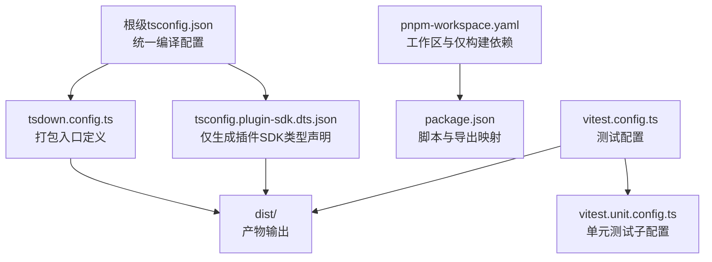
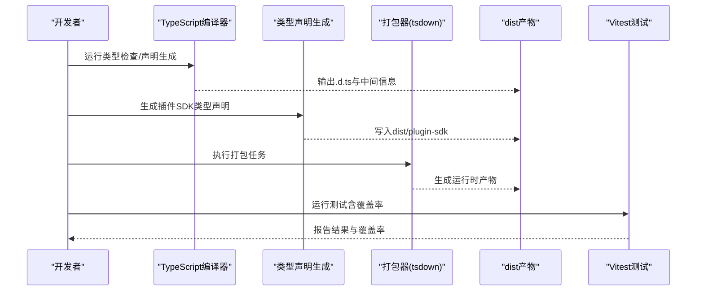
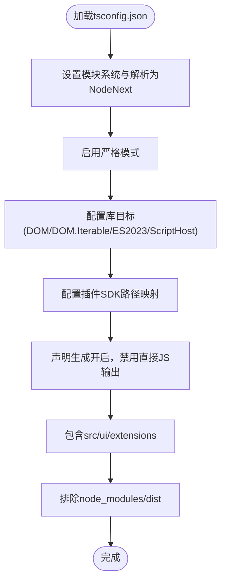
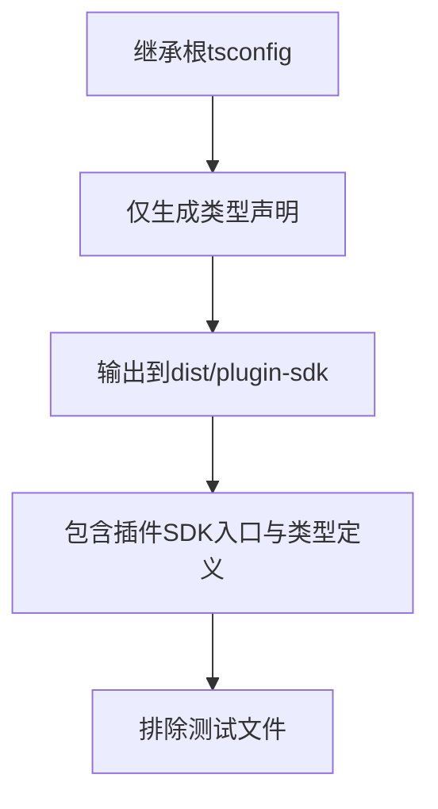
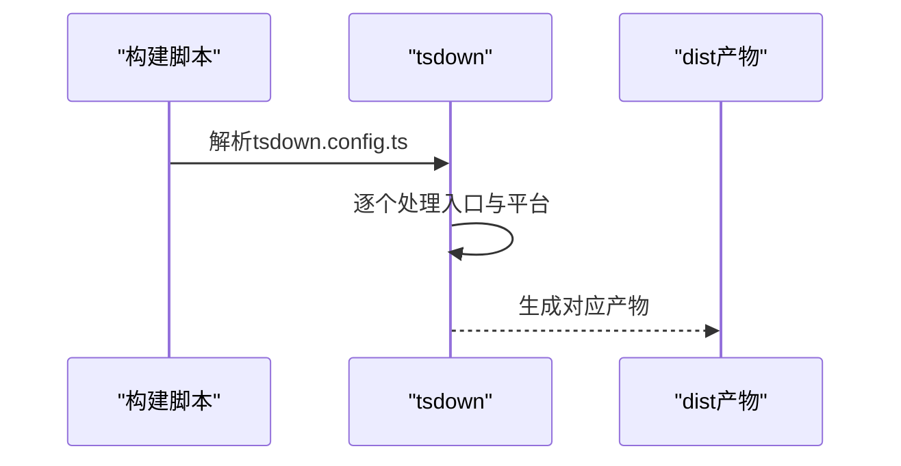
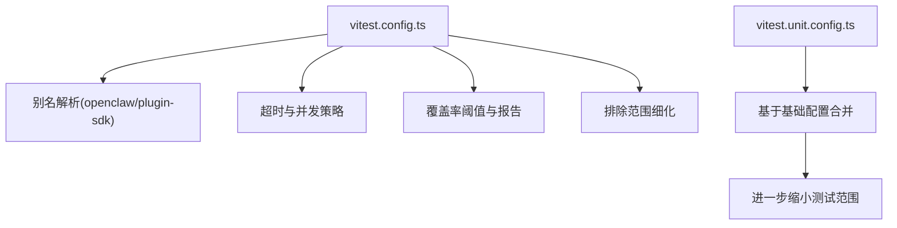
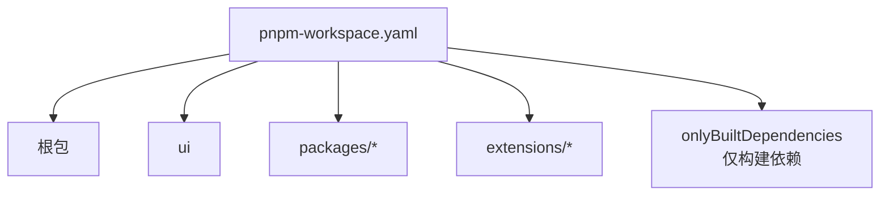
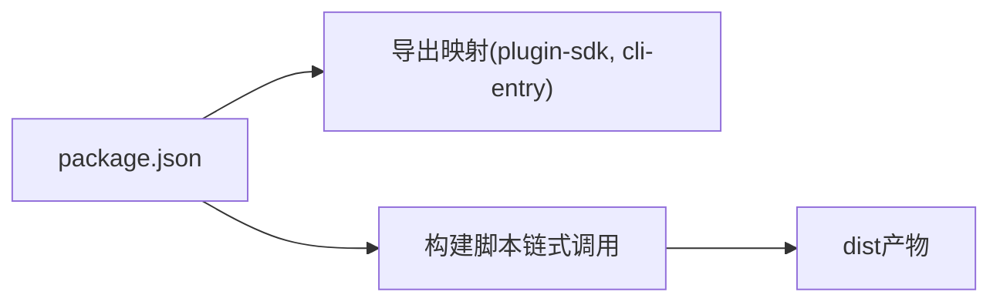
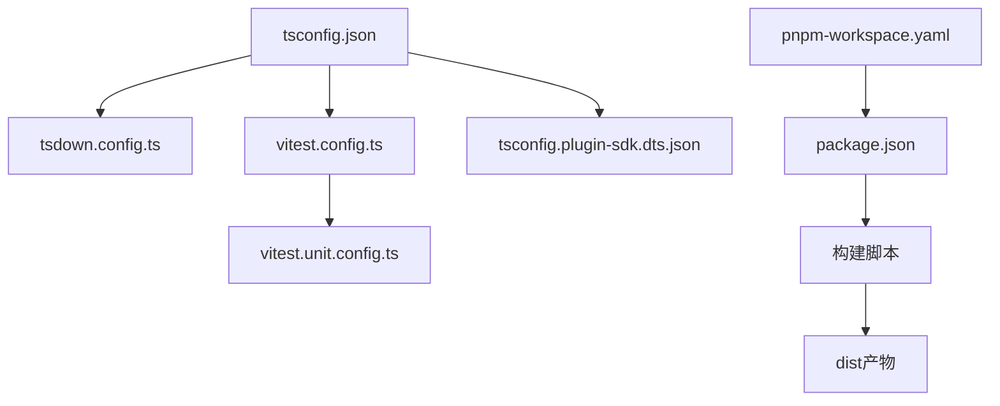

# TypeScript配置与编译

<cite>
**本文档引用的文件**
- [tsconfig.json](file://tsconfig.json)
- [pnpm-workspace.yaml](file://pnpm-workspace.yaml)
- [package.json](file://package.json)
- [vitest.config.ts](file://vitest.config.ts)
- [vitest.unit.config.ts](file://vitest.unit.config.ts)
- [tsconfig.plugin-sdk.dts.json](file://tsconfig.plugin-sdk.dts.json)
- [tsdown.config.ts](file://tsdown.config.ts)
- [scripts/write-plugin-sdk-entry-dts.ts](file://scripts/write-plugin-sdk-entry-dts.ts)
- [scripts/canvas-a2ui-copy.ts](file://scripts/canvas-a2ui-copy.ts)
- [scripts/write-build-info.ts](file://scripts/write-build-info.ts)
</cite>

## 目录

1. [简介](#简介)
2. [项目结构](#项目结构)
3. [核心组件](#核心组件)
4. [架构总览](#架构总览)
5. [详细组件分析](#详细组件分析)
6. [依赖关系分析](#依赖关系分析)
7. [性能考虑](#性能考虑)
8. [故障排除指南](#故障排除指南)
9. [结论](#结论)
10. [附录](#附录)

## 简介

本文件面向OpenClaw项目的TypeScript配置与编译系统，系统性阐述以下内容：

- tsconfig.json中的关键配置项：模块解析、路径映射、严格模式、库目标等
- 工作区配置（pnpm-workspace.yaml）的作用与包管理策略
- 不同环境的配置差异（开发、测试、生产）
- 编译流程说明、类型声明生成与测试配置详解
- 常见配置问题的解决方案与最佳实践建议

## 项目结构

OpenClaw采用Monorepo结构，使用pnpm进行包管理，并通过多份TypeScript配置文件分别服务于不同场景：

- 根级tsconfig.json：统一的TypeScript编译基础配置
- tsconfig.plugin-sdk.dts.json：仅生成插件SDK类型声明的专用配置
- tsdown.config.ts：定义打包入口与输出目录
- vitest.config.ts及其变体：测试运行时的别名与覆盖范围控制
- pnpm-workspace.yaml：工作区包扫描与仅构建依赖声明
- package.json：脚本命令、导出映射与pnpm覆盖规则

图表来源

- [tsconfig.json](file://tsconfig.json#L1-L29)
- [tsdown.config.ts](file://tsdown.config.ts#L1-L60)
- [tsconfig.plugin-sdk.dts.json](file://tsconfig.plugin-sdk.dts.json#L1-L16)
- [pnpm-workspace.yaml](file://pnpm-workspace.yaml#L1-L17)
- [package.json](file://package.json#L1-L268)
- [vitest.config.ts](file://vitest.config.ts#L1-L158)
- [vitest.unit.config.ts](file://vitest.unit.config.ts#L1-L19)

章节来源

- [tsconfig.json](file://tsconfig.json#L1-L29)
- [pnpm-workspace.yaml](file://pnpm-workspace.yaml#L1-L17)
- [package.json](file://package.json#L1-L268)

## 核心组件

本节聚焦于TypeScript配置的核心要素与职责分工：

- 根级tsconfig.json
  - 模块系统与解析：使用NodeNext模块与解析策略，确保与现代Node生态兼容
  - 严格模式：启用严格模式以提升类型安全
  - 库目标：包含DOM、DOM.Iterable、ES2023、ScriptHost，满足浏览器与Node环境需求
  - 路径映射：为插件SDK提供稳定别名，便于跨包引用
  - 输出策略：声明生成开启，但不直接输出JS（noEmit），由打包工具负责产物生成
  - 包含/排除：覆盖src、ui、extensions等源码目录，排除node_modules与dist

- 插件SDK类型声明专用配置
  - 继承根配置，仅生成类型声明并指定输出目录
  - 针对插件SDK入口与类型定义进行精确包含/排除

- 打包配置
  - 定义多个入口点（主程序、CLI、扩展API、钩子等），统一平台为Node
  - 指定环境变量（如NODE_ENV=production）

- 测试配置
  - Vitest基础配置：统一别名、超时、并发策略、覆盖率阈值与排除范围
  - 单元测试子配置：在基础配置上进一步缩小测试范围，排除扩展与网关集成测试

章节来源

- [tsconfig.json](file://tsconfig.json#L1-L29)
- [tsconfig.plugin-sdk.dts.json](file://tsconfig.plugin-sdk.dts.json#L1-L16)
- [tsdown.config.ts](file://tsdown.config.ts#L1-L60)
- [vitest.config.ts](file://vitest.config.ts#L1-L158)
- [vitest.unit.config.ts](file://vitest.unit.config.ts#L1-L19)

## 架构总览

下图展示了从TypeScript配置到最终产物的整体流程，包括类型声明生成、打包与测试验证。

图表来源

- [tsconfig.json](file://tsconfig.json#L1-L29)
- [tsdown.config.ts](file://tsdown.config.ts#L1-L60)
- [tsconfig.plugin-sdk.dts.json](file://tsconfig.plugin-sdk.dts.json#L1-L16)
- [vitest.config.ts](file://vitest.config.ts#L1-L158)

## 详细组件分析

### TypeScript编译配置分析（tsconfig.json）

- 模块与解析
  - 模块系统与解析策略均采用NodeNext，保证与现代Node生态一致
- 严格性与库目标
  - 启用严格模式，提升类型安全
  - 目标库包含DOM、DOM.Iterable、ES2023、ScriptHost，兼顾浏览器与Node环境
- 路径映射
  - 为插件SDK提供稳定别名，避免相对路径导致的脆弱引用
- 输出策略
  - 开启声明生成，但noEmit/noEmitOnError，实际产物由打包阶段生成
- 包含/排除
  - 覆盖src、ui、extensions，排除node_modules与dist

图表来源

- [tsconfig.json](file://tsconfig.json#L1-L29)

章节来源

- [tsconfig.json](file://tsconfig.json#L1-L29)

### 插件SDK类型声明生成配置（tsconfig.plugin-sdk.dts.json）

- 继承根配置，仅生成类型声明
- 指定输出目录为dist/plugin-sdk，rootDir为src
- 仅包含插件SDK入口与类型定义，排除测试文件

图表来源

- [tsconfig.plugin-sdk.dts.json](file://tsconfig.plugin-sdk.dts.json#L1-L16)

章节来源

- [tsconfig.plugin-sdk.dts.json](file://tsconfig.plugin-sdk.dts.json#L1-L16)

### 打包配置与构建流程（tsdown.config.ts）

- 多入口定义：主程序、CLI、扩展API、钩子等
- 平台统一为Node，环境变量固定为生产模式
- 插件SDK入口单独指定输出目录

图表来源

- [tsdown.config.ts](file://tsdown.config.ts#L1-L60)

章节来源

- [tsdown.config.ts](file://tsdown.config.ts#L1-L60)

### 测试配置与覆盖率（vitest.config.ts 及 vitest.unit.config.ts）

- 别名解析：与根配置保持一致，确保测试中可正确解析插件SDK别名
- 超时与并发：根据平台与CI环境调整超时与最大并发数
- 覆盖率：v8提供者，文本与LCOV报告，设定阈值；仅统计核心src代码
- 排除范围：排除扩展、应用、UI、测试自身以及大量集成/交互模块
- 单元测试子配置：在基础配置上进一步缩小范围，排除扩展与网关集成测试

图表来源

- [vitest.config.ts](file://vitest.config.ts#L1-L158)
- [vitest.unit.config.ts](file://vitest.unit.config.ts#L1-L19)

章节来源

- [vitest.config.ts](file://vitest.config.ts#L1-L158)
- [vitest.unit.config.ts](file://vitest.unit.config.ts#L1-L19)

### 工作区与包管理策略（pnpm-workspace.yaml）

- 工作区扫描：包含根包、ui、packages/_、extensions/_
- 仅构建依赖：声明某些原生或二进制依赖仅在构建时需要，减少运行时安装负担

图表来源

- [pnpm-workspace.yaml](file://pnpm-workspace.yaml#L1-L17)

章节来源

- [pnpm-workspace.yaml](file://pnpm-workspace.yaml#L1-L17)

### 导出映射与构建产物（package.json）

- 导出映射：为插件SDK与CLI入口提供types/default导出
- 构建脚本：串联Canvas A2UI打包、tsdown、类型声明生成、构建信息写入、CLI兼容性处理等步骤

图表来源

- [package.json](file://package.json#L1-L268)

章节来源

- [package.json](file://package.json#L1-L268)

## 依赖关系分析

- 配置耦合
  - 根tsconfig.json与tsdown.config.ts共同决定模块解析与打包入口
  - vitest配置依赖根tsconfig的路径映射与包含/排除规则
  - 插件SDK类型声明配置独立于运行时产物，但共享根配置的严格性与库目标
- 外部依赖
  - pnpm工作区与onlyBuiltDependencies影响安装与构建行为
  - Node版本要求与pnpm版本在package.json中明确

图表来源

- [tsconfig.json](file://tsconfig.json#L1-L29)
- [tsdown.config.ts](file://tsdown.config.ts#L1-L60)
- [vitest.config.ts](file://vitest.config.ts#L1-L158)
- [vitest.unit.config.ts](file://vitest.unit.config.ts#L1-L19)
- [tsconfig.plugin-sdk.dts.json](file://tsconfig.plugin-sdk.dts.json#L1-L16)
- [pnpm-workspace.yaml](file://pnpm-workspace.yaml#L1-L17)
- [package.json](file://package.json#L1-L268)

章节来源

- [tsconfig.json](file://tsconfig.json#L1-L29)
- [tsdown.config.ts](file://tsdown.config.ts#L1-L60)
- [vitest.config.ts](file://vitest.config.ts#L1-L158)
- [vitest.unit.config.ts](file://vitest.unit.config.ts#L1-L19)
- [tsconfig.plugin-sdk.dts.json](file://tsconfig.plugin-sdk.dts.json#L1-L16)
- [pnpm-workspace.yaml](file://pnpm-workspace.yaml#L1-L17)
- [package.json](file://package.json#L1-L268)

## 性能考虑

- 并发与超时
  - Vitest根据平台与CI环境动态调整并发与超时，平衡执行速度与稳定性
- 覆盖率范围
  - 仅统计核心src代码，避免扩展、应用、UI等非核心模块影响阈值
- 仅构建依赖
  - 将原生/二进制依赖标记为仅构建期使用，降低运行时安装成本
- 类型声明生成
  - 使用专用配置仅生成类型声明，避免重复编译与冗余输出

## 故障排除指南

- 插件SDK类型声明缺失或别名解析失败
  - 确认根tsconfig的路径映射与tsdown配置中的插件SDK入口一致
  - 运行类型声明生成脚本，确保dist/plugin-sdk存在稳定入口.d.ts
- Canvas A2UI资源缺失
  - 先执行Canvas A2UI打包，再执行构建脚本；若跳过缺失校验，请设置相应环境变量
- 构建信息未生成
  - 确保package.json版本可读且Git仓库可用；构建脚本会读取版本与提交信息并写入build-info.json
- 测试超时或并发问题
  - 在CI或Windows环境下，Vitest已自动调整并发与超时；可在本地通过环境变量或平台检测逻辑排查

章节来源

- [scripts/write-plugin-sdk-entry-dts.ts](file://scripts/write-plugin-sdk-entry-dts.ts#L1-L16)
- [scripts/canvas-a2ui-copy.ts](file://scripts/canvas-a2ui-copy.ts#L1-L41)
- [scripts/write-build-info.ts](file://scripts/write-build-info.ts#L1-L48)
- [vitest.config.ts](file://vitest.config.ts#L1-L158)

## 结论

OpenClaw的TypeScript配置与编译体系通过“根配置+专用声明配置+打包配置+测试配置”的分层设计，实现了：

- 统一的类型安全与模块解析策略
- 清晰的产物边界（运行时产物与类型声明分离）
- 可控的测试范围与覆盖率策略
- Monorepo下的工作区与依赖管理优化

该体系既满足开发效率，又保障了构建质量与测试稳定性。

## 附录

- 环境变量与脚本
  - 构建脚本串联多个步骤，包括Canvas A2UI打包、tsdown、类型声明生成、构建信息写入、CLI兼容性处理
  - 测试脚本支持多种模式（单元、端到端、实时测试等），并具备覆盖率统计

章节来源

- [package.json](file://package.json#L1-L268)
- [tsdown.config.ts](file://tsdown.config.ts#L1-L60)
- [tsconfig.plugin-sdk.dts.json](file://tsconfig.plugin-sdk.dts.json#L1-L16)
- [scripts/write-plugin-sdk-entry-dts.ts](file://scripts/write-plugin-sdk-entry-dts.ts#L1-L16)
- [scripts/canvas-a2ui-copy.ts](file://scripts/canvas-a2ui-copy.ts#L1-L41)
- [scripts/write-build-info.ts](file://scripts/write-build-info.ts#L1-L48)
