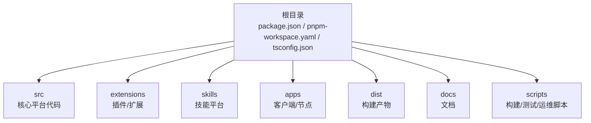
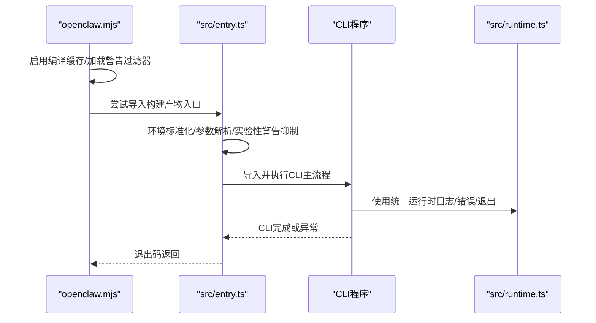
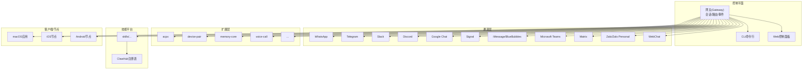
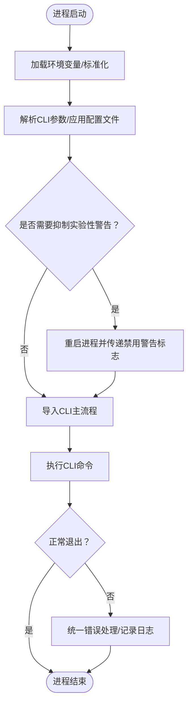
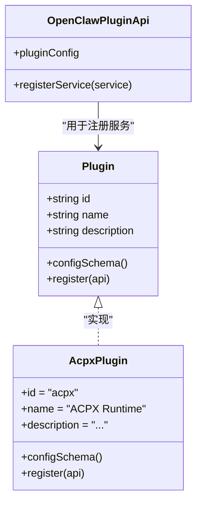
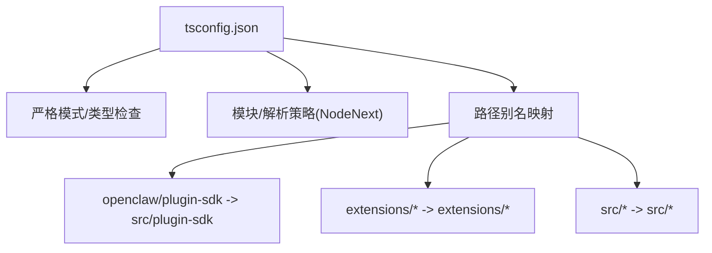
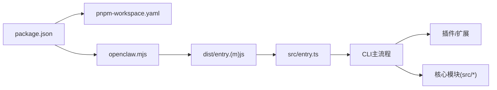

# 代码结构与架构

<cite>
**本文档引用的文件**
- [package.json](file://package.json)
- [pnpm-workspace.yaml](file://pnpm-workspace.yaml)
- [tsconfig.json](file://tsconfig.json)
- [README.md](file://README.md)
- [openclaw.mjs](file://openclaw.mjs)
- [src/index.ts](file://src/index.ts)
- [src/entry.ts](file://src/entry.ts)
- [src/runtime.ts](file://src/runtime.ts)
- [src/cli/program.ts](file://src/cli/program.ts)
- [extensions/acpx/index.ts](file://extensions/acpx/index.ts)
</cite>

## 目录

1. [简介](#简介)
2. [项目结构](#项目结构)
3. [核心组件](#核心组件)
4. [架构总览](#架构总览)
5. [详细组件分析](#详细组件分析)
6. [依赖关系分析](#依赖关系分析)
7. [性能考虑](#性能考虑)
8. [故障排除指南](#故障排除指南)
9. [结论](#结论)

## 简介

本文件面向OpenClaw项目的开发者与维护者，系统性梳理项目的代码结构、模块划分、工作区管理、TypeScript配置以及插件体系，帮助读者快速理解整体架构与技术决策，并为后续开发与扩展提供清晰的参考。

## 项目结构

OpenClaw采用多包工作区（monorepo）组织方式，核心源码位于src目录，同时通过extensions、skills、apps等子目录扩展渠道、技能与应用层能力。项目使用pnpm进行包管理与工作区解析，TypeScript作为主要开发语言，构建产物输出到dist目录，供CLI与运行时使用。

- 核心目录职责概览
  - src：核心平台代码，包含CLI、网关、通道、工具、会话、安全、日志等子系统
  - extensions：可插拔的通道与服务扩展（如acpx、bluebubbles、discord等）
  - skills：可安装的技能（skills platform），支持工作区/托管/内置技能
  - apps：跨平台客户端与节点（macOS、iOS、Android）
  - dist：构建产物，包含打包后的CLI入口与各子模块
  - docs：官方文档与指南
  - scripts：构建、测试、发布与运维脚本

**章节来源**

- [README.md](file://README.md#L1-L556)
- [package.json](file://package.json#L1-L268)
- [pnpm-workspace.yaml](file://pnpm-workspace.yaml#L1-L17)

## 核心组件

本节聚焦于项目的关键入口与运行时组件，包括CLI入口、运行时环境、错误处理与进程桥接机制。

- CLI入口与启动流程
  - openclaw.mjs：二进制入口，负责启用编译缓存、加载警告过滤器并尝试导入构建产物入口
  - src/entry.ts：实际运行入口，负责环境标准化、实验性警告抑制、参数解析、CLI执行与子进程桥接
  - src/index.ts：导出公共API与工具函数，供CLI与其他模块复用
- 运行时与错误处理
  - src/runtime.ts：定义运行时环境接口与默认实现，统一日志输出、错误处理与进程退出行为
- CLI程序构建
  - src/cli/program.ts：暴露构建CLI程序的入口，供运行时调用

**图表来源**

- [openclaw.mjs](file://openclaw.mjs#L1-L57)
- [src/entry.ts](file://src/entry.ts#L1-L144)
- [src/runtime.ts](file://src/runtime.ts#L1-L54)

**章节来源**

- [openclaw.mjs](file://openclaw.mjs#L1-L57)
- [src/entry.ts](file://src/entry.ts#L1-L144)
- [src/index.ts](file://src/index.ts#L1-L94)
- [src/runtime.ts](file://src/runtime.ts#L1-L54)
- [src/cli/program.ts](file://src/cli/program.ts#L1-L3)

## 架构总览

OpenClaw采用“控制平面 + 多通道 + 可插拔扩展 + 技能平台”的分层架构。控制平面通过WebSocket提供统一的网关能力；通道层对接多种即时通讯平台；扩展层以插件形式提供额外能力；技能平台提供可安装的工具与自动化逻辑；客户端/节点提供跨平台交互界面。

**图表来源**

- [README.md](file://README.md#L185-L254)
- [extensions/acpx/index.ts](file://extensions/acpx/index.ts#L1-L20)

**章节来源**

- [README.md](file://README.md#L185-L254)

## 详细组件分析

### 组件A：CLI与运行时（入口与错误处理）

- 入口文件openclaw.mjs负责二进制入口的初始化与构建产物探测
- src/entry.ts承担运行时入口职责，包括环境标准化、参数解析、实验性警告抑制与子进程桥接
- src/runtime.ts提供统一的日志、错误与退出接口，确保在不同测试/运行环境下行为一致

**图表来源**

- [openclaw.mjs](file://openclaw.mjs#L1-L57)
- [src/entry.ts](file://src/entry.ts#L1-L144)
- [src/runtime.ts](file://src/runtime.ts#L1-L54)

**章节来源**

- [openclaw.mjs](file://openclaw.mjs#L1-L57)
- [src/entry.ts](file://src/entry.ts#L1-L144)
- [src/runtime.ts](file://src/runtime.ts#L1-L54)

### 组件B：插件体系（以acpx为例）

- 插件通过标准接口注册服务，声明配置模式与运行时能力
- extensions/acpx/index.ts展示了插件的标准结构：定义id/name/description、配置Schema、register回调中注册服务

**图表来源**

- [extensions/acpx/index.ts](file://extensions/acpx/index.ts#L1-L20)

**章节来源**

- [extensions/acpx/index.ts](file://extensions/acpx/index.ts#L1-L20)

### 组件C：类型系统与路径别名（TypeScript配置）

- tsconfig.json定义了严格模式、NodeNext模块与解析策略、库目标与路径别名
- 路径别名将openclaw/plugin-sdk映射到src/plugin-sdk，便于插件开发与引用

**图表来源**

- [tsconfig.json](file://tsconfig.json#L1-L29)

**章节来源**

- [tsconfig.json](file://tsconfig.json#L1-L29)

## 依赖关系分析

- 包管理与工作区
  - package.json声明了主入口、导出规范、脚本与依赖
  - pnpm-workspace.yaml定义了工作区包范围与仅构建依赖列表
- 构建与运行
  - openclaw.mjs作为二进制入口，优先加载构建产物入口
  - src/entry.ts负责运行时参数与环境处理，随后导入CLI主流程
- 插件与扩展
  - 扩展通过标准插件接口注册服务，遵循统一的配置Schema与API

**图表来源**

- [package.json](file://package.json#L1-L268)
- [pnpm-workspace.yaml](file://pnpm-workspace.yaml#L1-L17)
- [openclaw.mjs](file://openclaw.mjs#L1-L57)
- [src/entry.ts](file://src/entry.ts#L1-L144)

**章节来源**

- [package.json](file://package.json#L1-L268)
- [pnpm-workspace.yaml](file://pnpm-workspace.yaml#L1-L17)
- [openclaw.mjs](file://openclaw.mjs#L1-L57)
- [src/entry.ts](file://src/entry.ts#L1-L144)

## 性能考虑

- 编译缓存：openclaw.mjs在可用时启用Node编译缓存，减少重复编译开销
- 实验性警告抑制：src/entry.ts在必要时通过重启进程抑制实验性警告，避免对CLI体验造成干扰
- 日志与终端状态：src/runtime.ts统一日志输出并在退出前恢复终端状态，保证交互一致性
- 仅构建依赖：pnpm-workspace.yaml中的onlyBuiltDependencies列表有助于减少不必要的依赖安装与构建时间

**章节来源**

- [openclaw.mjs](file://openclaw.mjs#L1-L57)
- [src/entry.ts](file://src/entry.ts#L1-L144)
- [src/runtime.ts](file://src/runtime.ts#L1-L54)
- [pnpm-workspace.yaml](file://pnpm-workspace.yaml#L7-L16)

## 故障排除指南

- CLI启动失败
  - 检查openclaw.mjs是否能找到构建产物入口（dist/entry.(m)js）
  - 查看src/entry.ts中的参数解析与环境标准化步骤
- 端口占用问题
  - 使用src/infra/ports.js提供的端口检测与错误描述工具
- 未捕获异常
  - src/index.ts安装了未处理拒绝与未捕获异常处理器，确保错误被记录并优雅退出
- 插件注册失败
  - 确认插件配置Schema与register回调正确实现，参考extensions/acpx/index.ts示例

**章节来源**

- [openclaw.mjs](file://openclaw.mjs#L1-L57)
- [src/entry.ts](file://src/entry.ts#L1-L144)
- [src/index.ts](file://src/index.ts#L1-L94)
- [src/infra/ports.ts](file://src/infra/ports.ts#L1-L200)
- [extensions/acpx/index.ts](file://extensions/acpx/index.ts#L1-L20)

## 结论

OpenClaw通过清晰的目录结构、严格的TypeScript配置与工作区管理，实现了从CLI入口到核心平台再到插件扩展的完整技术栈。其分层架构既保证了控制平面的统一性，又为多通道接入与可插拔扩展提供了灵活基础。建议在新增功能时遵循现有模块划分与命名约定，充分利用插件体系与技能平台，确保代码可维护性与可扩展性。
