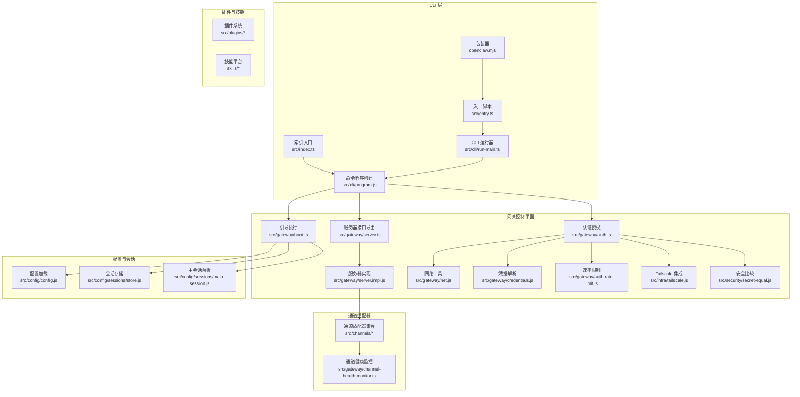
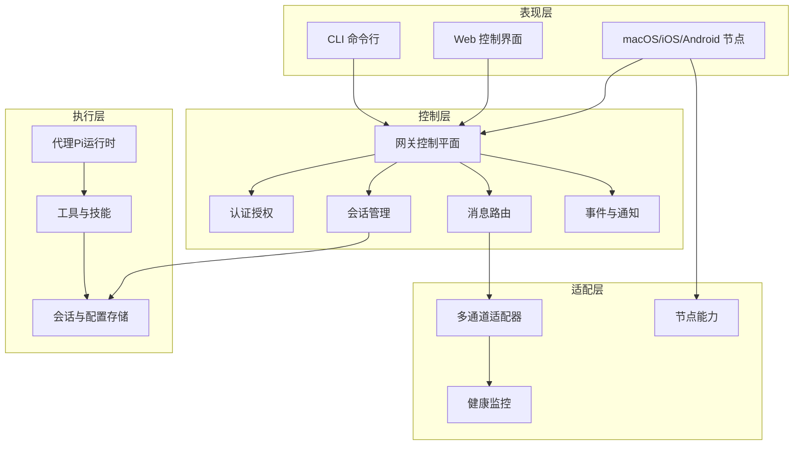
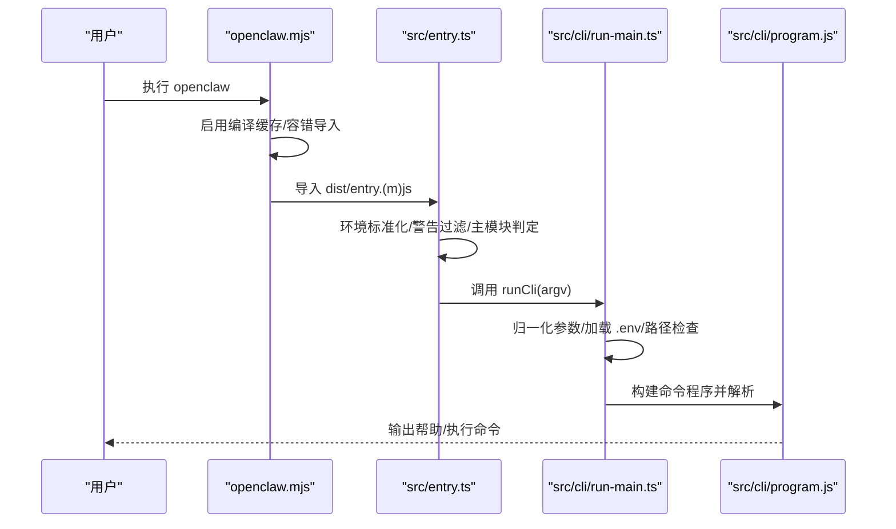
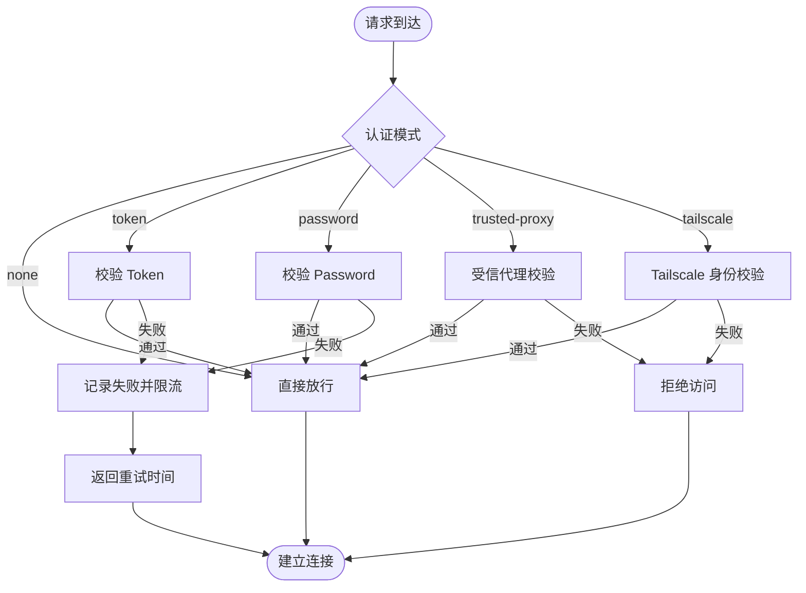
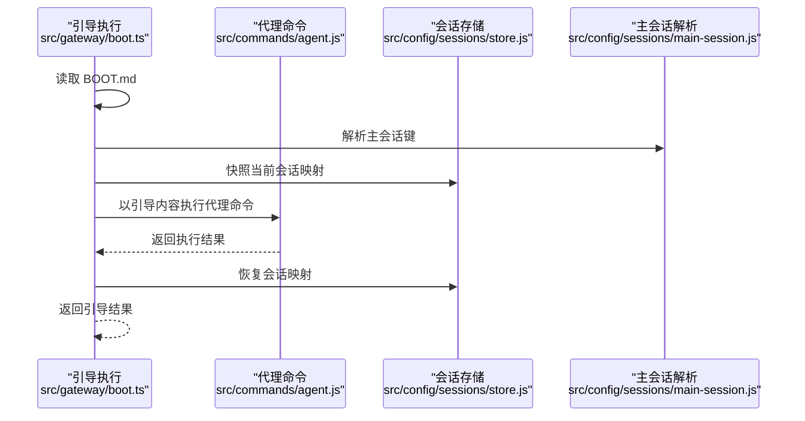
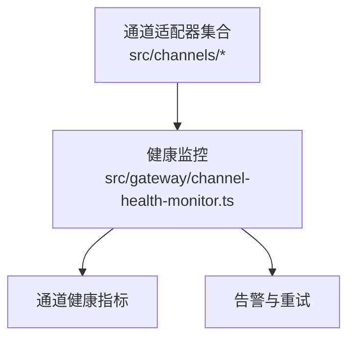
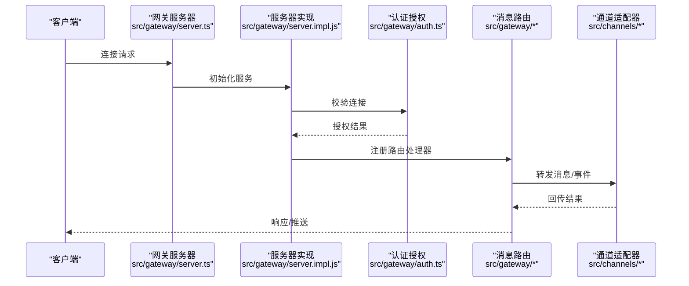
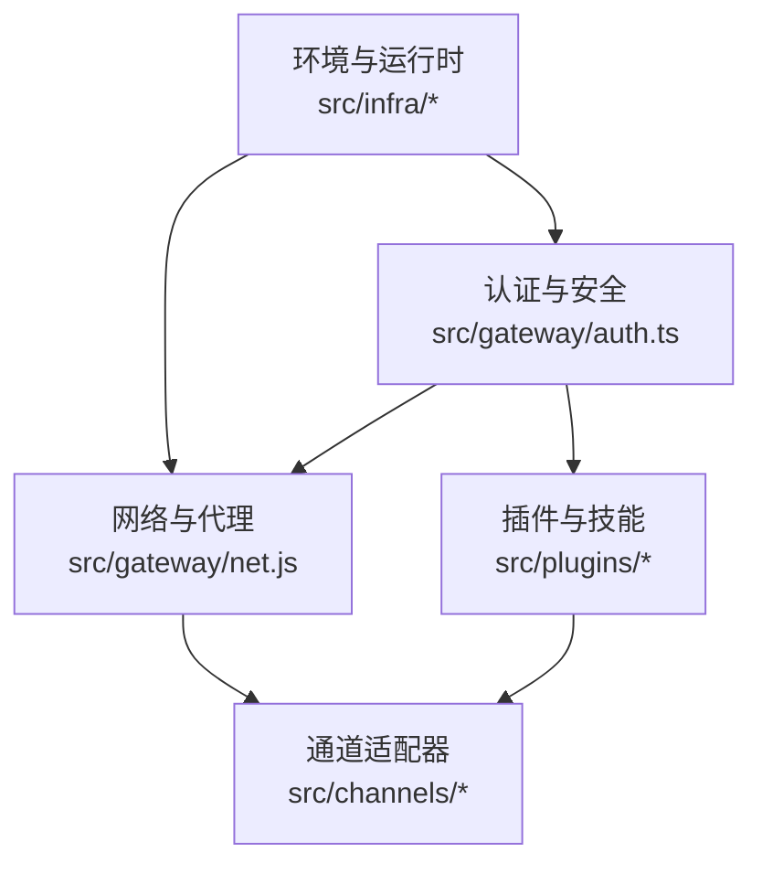

# 整体架构设计

<cite>
**本文档引用的文件**
- [README.md](file://README.md)
- [package.json](file://package.json)
- [src/entry.ts](file://src/entry.ts)
- [src/index.ts](file://src/index.ts)
- [openclaw.mjs](file://openclaw.mjs)
- [src/cli/run-main.ts](file://src/cli/run-main.ts)
- [src/gateway/boot.ts](file://src/gateway/boot.ts)
- [src/gateway/auth.ts](file://src/gateway/auth.ts)
- [src/gateway/server.ts](file://src/gateway/server.ts)
- [src/gateway/server.impl.js](file://src/gateway/server.impl.js)
- [src/cli/program.js](file://src/cli/program.js)
- [src/cli/deps.js](file://src/cli/deps.js)
- [src/config/config.js](file://src/config/config.js)
- [src/config/sessions/store.js](file://src/config/sessions/store.js)
- [src/config/sessions/main-session.js](file://src/config/sessions/main-session.js)
- [src/infra/env.js](file://src/infra/env.js)
- [src/infra/dotenv.js](file://src/infra/dotenv.js)
- [src/infra/runtime-guard.js](file://src/infra/runtime-guard.js)
- [src/infra/path-env.js](file://src/infra/path-env.js)
- [src/infra/ports.js](file://src/infra/ports.js)
- [src/infra/warning-filter.js](file://src/infra/warning-filter.js)
- [src/infra/is-main.js](file://src/infra/is-main.js)
- [src/infra/unhandled-rejections.js](file://src/infra/unhandled-rejections.js)
- [src/infra/errors.js](file://src/infra/errors.js)
- [src/infra/tailscale.js](file://src/infra/tailscale.js)
- [src/security/secret-equal.js](file://src/security/secret-equal.js)
- [src/gateway/net.js](file://src/gateway/net.js)
- [src/gateway/auth-rate-limit.js](file://src/gateway/auth-rate-limit.js)
- [src/gateway/credentials.js](file://src/gateway/credentials.js)
- [src/gateway/call.ts](file://src/gateway/call.ts)
- [src/gateway/chat-attachments.ts](file://src/gateway/chat-attachments.ts)
- [src/gateway/channel-health-monitor.ts](file://src/gateway/channel-health-monitor.ts)
- [src/gateway/canvas-capability.ts](file://src/gateway/canvas-capability.ts)
- [src/gateway/assistant-identity.ts](file://src/gateway/assistant-identity.ts)
- [src/gateway/agent-prompt.ts](file://src/gateway/agent-prompt.ts)
- [src/gateway/agent-event-assistant-text.ts](file://src/gateway/agent-event-assistant-text.ts)
- [src/gateway/chat-abort.ts](file://src/gateway/chat-abort.ts)
- [src/gateway/call.test.ts](file://src/gateway/call.test.ts)
- [src/gateway/chat-attachments.test.ts](file://src/gateway/chat-attachments.test.ts)
- [src/gateway/channel-health-monitor.test.ts](file://src/gateway/channel-health-monitor.test.ts)
- [src/gateway/canvas-capability.test.ts](file://src/gateway/canvas-capability.test.ts)
- [src/gateway/assistant-identity.test.ts](file://src/gateway/assistant-identity.test.ts)
- [src/gateway/agent-prompt.test.ts](file://src/gateway/agent-prompt.test.ts)
- [src/gateway/agent-event-assistant-text.test.ts](file://src/gateway/agent-event-assistant-text.test.ts)
- [src/gateway/chat-abort.test.ts](file://src/gateway/chat-abort.test.ts)
</cite>

## 目录

1. [简介](#简介)
2. [项目结构](#项目结构)
3. [核心组件](#核心组件)
4. [架构总览](#架构总览)
5. [详细组件分析](#详细组件分析)
6. [依赖分析](#依赖分析)
7. [性能考虑](#性能考虑)
8. [故障排查指南](#故障排查指南)
9. [结论](#结论)
10. [附录](#附录)

## 简介

OpenClaw 是一个在用户自有设备上运行的个人 AI 助手平台，采用“网关控制平面 + 多通道适配器”的分层架构。系统通过 CLI 入口启动，经由网关控制平面统一调度会话、路由消息、管理工具与事件，并通过插件化机制扩展能力。多通道适配器（如 WhatsApp、Telegram、Discord、Signal、iMessage 等）负责与外部消息平台对接，形成统一的本地优先、安全可控的智能助手体系。

## 项目结构

OpenClaw 采用模块化与功能域划分相结合的组织方式：

- 核心运行时与入口：CLI 入口、环境初始化、运行时守卫、错误处理等
- 网关控制平面：认证授权、会话管理、消息路由、健康监控、Canvas 能力等
- 通道适配器：各消息平台的连接与协议适配
- 插件与技能：扩展工具与工作流
- 平台与节点：macOS/iOS/Android 节点与浏览器控制

**图表来源**

- [src/entry.ts](file://src/entry.ts#L1-L144)
- [src/index.ts](file://src/index.ts#L1-L94)
- [openclaw.mjs](file://openclaw.mjs#L1-L57)
- [src/cli/run-main.ts](file://src/cli/run-main.ts#L1-L129)
- [src/cli/program.js](file://src/cli/program.js)
- [src/gateway/boot.ts](file://src/gateway/boot.ts#L1-L203)
- [src/gateway/auth.ts](file://src/gateway/auth.ts#L1-L488)
- [src/gateway/server.ts](file://src/gateway/server.ts#L1-L4)
- [src/gateway/server.impl.js](file://src/gateway/server.impl.js)
- [src/gateway/net.js](file://src/gateway/net.js)
- [src/gateway/credentials.js](file://src/gateway/credentials.js)
- [src/gateway/auth-rate-limit.js](file://src/gateway/auth-rate-limit.js)
- [src/infra/tailscale.js](file://src/infra/tailscale.js)
- [src/security/secret-equal.js](file://src/security/secret-equal.js)
- [src/config/config.js](file://src/config/config.js)
- [src/config/sessions/store.js](file://src/config/sessions/store.js)
- [src/config/sessions/main-session.js](file://src/config/sessions/main-session.js)
- [src/gateway/channel-health-monitor.ts](file://src/gateway/channel-health-monitor.ts)

**章节来源**

- [README.md](file://README.md#L185-L238)
- [package.json](file://package.json#L1-L268)

## 核心组件

- CLI 入口与运行时
  - 入口脚本与包装器负责环境标准化、实验性警告抑制、进程桥接与主模块判定
  - CLI 运行器负责参数归一化、路径检查、运行时守卫、命令注册与解析
- 网关控制平面
  - 引导执行：读取工作区引导文件并以代理命令执行，确保系统自检与修复
  - 认证授权：支持 token/password/trusted-proxy/tailscale 等多种模式，内置速率限制与 Tailscale 身份校验
  - 服务器：统一的 WebSocket/HTTP 控制面，承载会话、工具、事件与远程访问
- 通道适配器
  - 多平台适配器（WhatsApp、Telegram、Discord、Signal、iMessage 等），负责消息收发与状态同步
  - 健康监控：对通道连接进行持续健康检查与告警
- 插件与技能
  - 插件系统提供扩展点；技能平台提供可安装的工作流与工具集

**章节来源**

- [src/entry.ts](file://src/entry.ts#L1-L144)
- [src/index.ts](file://src/index.ts#L1-L94)
- [openclaw.mjs](file://openclaw.mjs#L1-L57)
- [src/cli/run-main.ts](file://src/cli/run-main.ts#L1-L129)
- [src/gateway/boot.ts](file://src/gateway/boot.ts#L1-L203)
- [src/gateway/auth.ts](file://src/gateway/auth.ts#L1-L488)
- [src/gateway/server.ts](file://src/gateway/server.ts#L1-L4)
- [src/gateway/server.impl.js](file://src/gateway/server.impl.js)
- [src/gateway/channel-health-monitor.ts](file://src/gateway/channel-health-monitor.ts)

## 架构总览

OpenClaw 的整体架构遵循分层与插件化设计：

- 分层架构
  - 表现层：CLI、Web 控制界面、移动端应用
  - 控制层：网关控制平面（认证、会话、路由、事件）
  - 适配层：多通道适配器与节点能力
  - 执行层：代理（Pi）运行时、工具与技能
- 模块化设计
  - 按功能域拆分目录（gateway、cli、channels、plugins、config 等），职责清晰
  - 通过依赖注入与配置驱动，降低耦合
- 插件化架构
  - 插件与技能作为独立模块，按需加载与注册
  - 提供 SDK 与类型定义，便于第三方扩展

**图表来源**

- [README.md](file://README.md#L185-L238)
- [src/gateway/auth.ts](file://src/gateway/auth.ts#L1-L488)
- [src/gateway/server.impl.js](file://src/gateway/server.impl.js)
- [src/gateway/channel-health-monitor.ts](file://src/gateway/channel-health-monitor.ts)

## 详细组件分析

### CLI 入口与运行流程

- 入口脚本与包装器
  - 包装器负责编译缓存启用与缺失模块容错
  - 入口脚本负责环境标准化、实验性警告抑制、进程桥接与主模块判定
- CLI 运行器
  - 参数归一化、.env 加载、环境变量标准化、路径检查
  - 运行时守卫、命令注册（内置与子 CLI）、解析与执行

**图表来源**

- [openclaw.mjs](file://openclaw.mjs#L1-L57)
- [src/entry.ts](file://src/entry.ts#L1-L144)
- [src/cli/run-main.ts](file://src/cli/run-main.ts#L1-L129)
- [src/cli/program.js](file://src/cli/program.js)

**章节来源**

- [openclaw.mjs](file://openclaw.mjs#L1-L57)
- [src/entry.ts](file://src/entry.ts#L1-L144)
- [src/cli/run-main.ts](file://src/cli/run-main.ts#L1-L129)

### 网关认证与授权

- 支持模式
  - none：无认证
  - token：共享密钥认证
  - password：密码认证
  - trusted-proxy：受信代理透传用户
  - tailscale：基于 Tailscale 身份的免密登录
- 关键特性
  - 客户端 IP 解析与代理信任链
  - 速率限制与重试策略
  - Tailscale Whois 校验与用户身份映射
  - 安全字符串比较，避免时序攻击

**图表来源**

- [src/gateway/auth.ts](file://src/gateway/auth.ts#L1-L488)
- [src/gateway/auth-rate-limit.js](file://src/gateway/auth-rate-limit.js)
- [src/infra/tailscale.js](file://src/infra/tailscale.js)
- [src/security/secret-equal.js](file://src/security/secret-equal.js)
- [src/gateway/net.js](file://src/gateway/net.js)

**章节来源**

- [src/gateway/auth.ts](file://src/gateway/auth.ts#L1-L488)

### 引导执行与会话恢复

- 引导执行
  - 读取工作区引导文件，生成一次性会话 ID，调用代理执行引导指令
  - 成功后清理临时会话映射，失败则记录原因
- 会话管理
  - 主会话键解析、会话存储读写、映射快照与恢复

**图表来源**

- [src/gateway/boot.ts](file://src/gateway/boot.ts#L1-L203)
- [src/config/sessions/store.js](file://src/config/sessions/store.js)
- [src/config/sessions/main-session.js](file://src/config/sessions/main-session.js)

**章节来源**

- [src/gateway/boot.ts](file://src/gateway/boot.ts#L1-L203)

### 通道适配器与健康监控

- 通道适配器
  - 面向多平台的消息适配器，负责连接、鉴权、消息收发与状态上报
- 健康监控
  - 对通道连接进行周期性健康检查，异常时触发告警与自动重连

**图表来源**

- [src/gateway/channel-health-monitor.ts](file://src/gateway/channel-health-monitor.ts)

**章节来源**

- [src/gateway/channel-health-monitor.ts](file://src/gateway/channel-health-monitor.ts)

### 网关服务器与数据流

- 服务器接口导出与实现
  - 接口导出统一的服务器类型与启动函数
  - 实现负责 WebSocket/HTTP 控制面、会话与事件处理

**图表来源**

- [src/gateway/server.ts](file://src/gateway/server.ts#L1-L4)
- [src/gateway/server.impl.js](file://src/gateway/server.impl.js)
- [src/gateway/auth.ts](file://src/gateway/auth.ts#L1-L488)

**章节来源**

- [src/gateway/server.ts](file://src/gateway/server.ts#L1-L4)
- [src/gateway/server.impl.js](file://src/gateway/server.impl.js)

## 依赖分析

- 运行时与环境
  - Node ≥22，编译缓存启用，.env 加载，路径检查，运行时守卫
- 认证与安全
  - Tailscale 集成、速率限制、安全字符串比较、受信代理头校验
- 通道与网络
  - 代理信任链、IP 解析、健康监控、速率限制
- 插件与技能
  - 插件 CLI 注册、技能平台集成

**图表来源**

- [src/infra/env.js](file://src/infra/env.js)
- [src/infra/dotenv.js](file://src/infra/dotenv.js)
- [src/infra/runtime-guard.js](file://src/infra/runtime-guard.js)
- [src/infra/path-env.js](file://src/infra/path-env.js)
- [src/gateway/auth.ts](file://src/gateway/auth.ts#L1-L488)
- [src/gateway/net.js](file://src/gateway/net.js)
- [src/gateway/auth-rate-limit.js](file://src/gateway/auth-rate-limit.js)
- [src/infra/tailscale.js](file://src/infra/tailscale.js)
- [src/security/secret-equal.js](file://src/security/secret-equal.js)
- [src/plugins/cli.js](file://src/plugins/cli.js)

**章节来源**

- [package.json](file://package.json#L151-L266)

## 性能考虑

- 启动与运行时
  - 编译缓存启用，减少冷启动开销
  - 实验性警告抑制与进程桥接，避免重复启动与警告噪声
- 认证与网络
  - 速率限制与重试策略，防止滥用与抖动
  - 受信代理与 Tailscale 身份校验，减少无效请求
- 通道与消息
  - 健康监控与自动重连，提升稳定性
  - 会话映射快照与恢复，降低引导执行对业务的影响

[本节为通用指导，无需特定文件引用]

## 故障排查指南

- CLI 启动问题
  - 确认 Node 版本满足要求，检查 .env 与环境变量
  - 查看未捕获异常与未处理拒绝日志
- 网关连接问题
  - 检查认证模式与凭据配置，确认速率限制与重试策略
  - 若使用 Tailscale，验证 Whois 与身份头
- 通道连接问题
  - 使用健康监控检查通道状态，必要时重连或切换代理
- 引导执行失败
  - 检查引导文件内容与代理命令执行结果，核对会话映射恢复情况

**章节来源**

- [src/infra/unhandled-rejections.js](file://src/infra/unhandled-rejections.js)
- [src/infra/errors.js](file://src/infra/errors.js)
- [src/gateway/auth.ts](file://src/gateway/auth.ts#L1-L488)
- [src/gateway/auth-rate-limit.js](file://src/gateway/auth-rate-limit.js)
- [src/infra/tailscale.js](file://src/infra/tailscale.js)
- [src/gateway/channel-health-monitor.ts](file://src/gateway/channel-health-monitor.ts)
- [src/gateway/boot.ts](file://src/gateway/boot.ts#L1-L203)

## 结论

OpenClaw 通过分层架构与插件化设计，实现了从 CLI 入口到网关控制平面再到通道适配器的完整数据流。其认证授权、会话管理与健康监控构成了稳定可靠的安全基座，配合多通道适配器与技能平台，提供了可扩展、可移植且本地优先的个人 AI 助手解决方案。

[本节为总结，无需特定文件引用]

## 附录

- 关键文件路径与职责
  - CLI 入口：src/entry.ts、openclaw.mjs、src/cli/run-main.ts
  - 网关控制：src/gateway/auth.ts、src/gateway/server.ts、src/gateway/server.impl.js
  - 引导执行：src/gateway/boot.ts
  - 通道适配：src/channels/\*、src/gateway/channel-health-monitor.ts
  - 配置与会话：src/config/config.js、src/config/sessions/\*

**章节来源**

- [README.md](file://README.md#L185-L238)
- [src/entry.ts](file://src/entry.ts#L1-L144)
- [openclaw.mjs](file://openclaw.mjs#L1-L57)
- [src/cli/run-main.ts](file://src/cli/run-main.ts#L1-L129)
- [src/gateway/auth.ts](file://src/gateway/auth.ts#L1-L488)
- [src/gateway/server.ts](file://src/gateway/server.ts#L1-L4)
- [src/gateway/server.impl.js](file://src/gateway/server.impl.js)
- [src/gateway/boot.ts](file://src/gateway/boot.ts#L1-L203)
- [src/gateway/channel-health-monitor.ts](file://src/gateway/channel-health-monitor.ts)
- [src/config/config.js](file://src/config/config.js)
- [src/config/sessions/store.js](file://src/config/sessions/store.js)
- [src/config/sessions/main-session.js](file://src/config/sessions/main-session.js)
