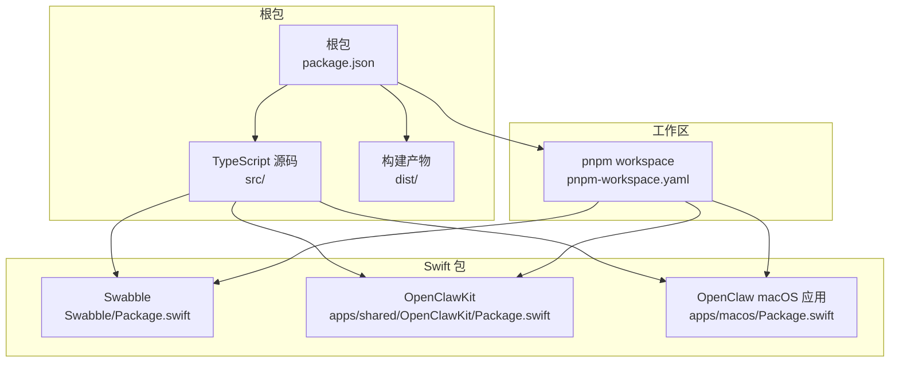
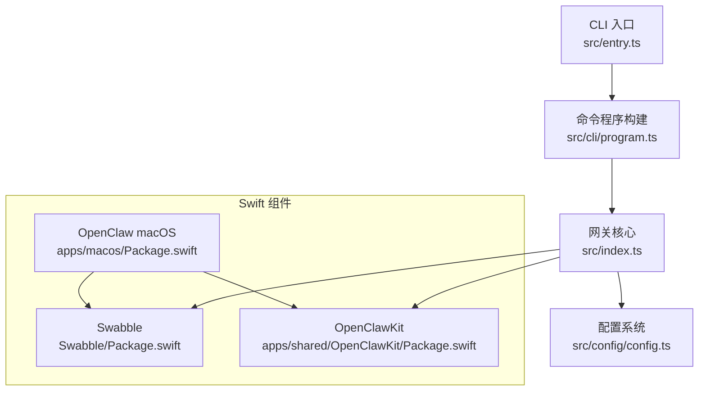
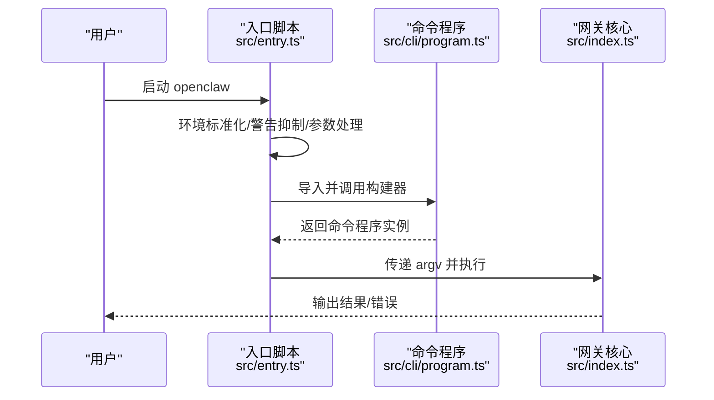
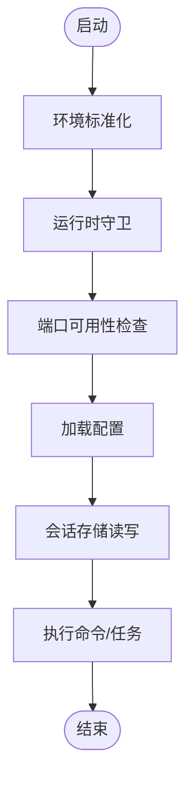
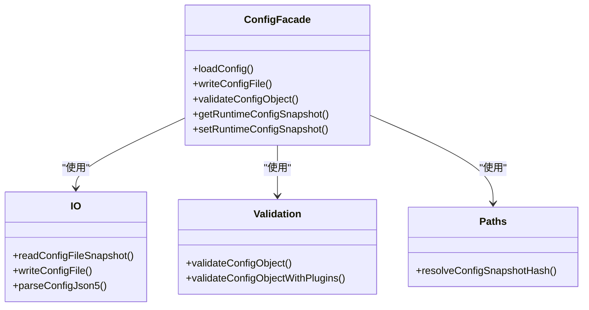
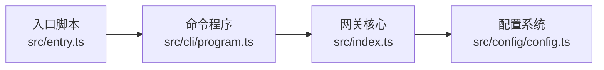
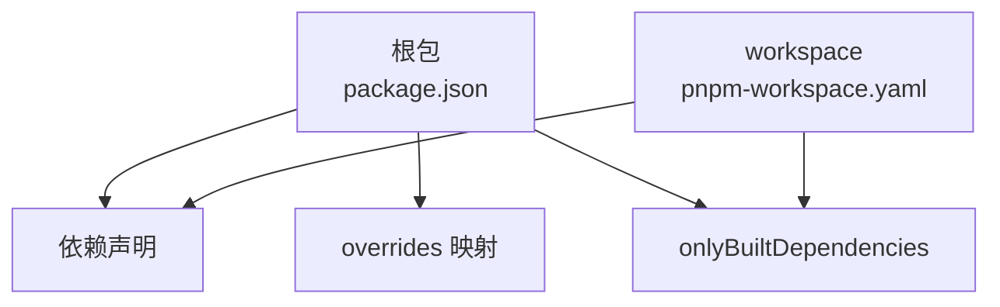
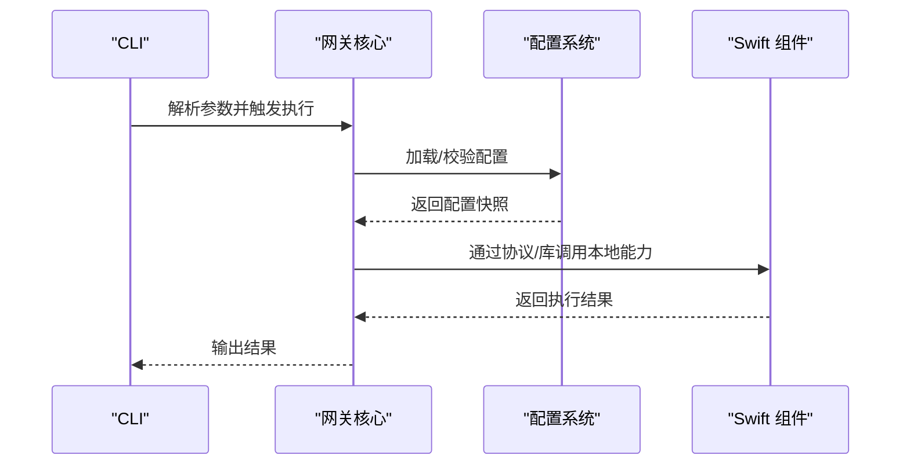

# 模块依赖关系

<cite>
**本文档引用的文件**
- [package.json](file://package.json)
- [pnpm-workspace.yaml](file://pnpm-workspace.yaml)
- [tsconfig.json](file://tsconfig.json)
- [src/index.ts](file://src/index.ts)
- [src/entry.ts](file://src/entry.ts)
- [src/cli/program.ts](file://src/cli/program.ts)
- [src/config/config.ts](file://src/config/config.ts)
- [Swabble/Package.swift](file://Swabble/Package.swift)
- [apps/macos/Package.swift](file://apps/macos/Package.swift)
- [apps/shared/OpenClawKit/Package.swift](file://apps/shared/OpenClawKit/Package.swift)
</cite>

## 目录

1. [简介](#简介)
2. [项目结构](#项目结构)
3. [核心组件](#核心组件)
4. [架构总览](#架构总览)
5. [详细组件分析](#详细组件分析)
6. [依赖分析](#依赖分析)
7. [性能考量](#性能考量)
8. [故障排查指南](#故障排查指南)
9. [结论](#结论)
10. [附录](#附录)

## 简介

本文件聚焦于 OpenClaw 的模块依赖关系，系统梳理 CLI 系统、网关核心、配置系统与插件系统的依赖层次，解释内部包之间的引用关系与循环依赖规避策略，说明外部依赖的选择标准与版本管理方式，并给出依赖图谱与模块间通信机制说明，最后提供依赖更新策略、版本兼容性考虑与性能影响分析。

## 项目结构

OpenClaw 采用多语言混合工程：核心以 TypeScript 实现，提供 CLI、网关与配置能力；同时包含 Swift 工程（Swabble、OpenClawKit、macOS 应用）用于本地语音与协议支持。包管理采用 pnpm workspace，统一管理根包与扩展、UI 子包。

图表来源

- [package.json](file://package.json#L1-L268)
- [pnpm-workspace.yaml](file://pnpm-workspace.yaml#L1-L17)
- [Swabble/Package.swift](file://Swabble/Package.swift#L1-L56)
- [apps/shared/OpenClawKit/Package.swift](file://apps/shared/OpenClawKit/Package.swift#L1-L62)
- [apps/macos/Package.swift](file://apps/macos/Package.swift#L1-L93)

章节来源

- [package.json](file://package.json#L1-L268)
- [pnpm-workspace.yaml](file://pnpm-workspace.yaml#L1-L17)

## 核心组件

- CLI 系统：负责命令解析、运行时环境准备与入口桥接，通过程序化构建器组织子命令与选项。
- 网关核心：承载消息通道、会话、配置加载与运行时守卫等能力，是系统运行中枢。
- 配置系统：提供配置读写、校验、迁移与运行时快照管理。
- 插件系统：通过注册表与 SDK 提供扩展能力，与网关核心解耦协作。

章节来源

- [src/index.ts](file://src/index.ts#L1-L94)
- [src/entry.ts](file://src/entry.ts#L1-L144)
- [src/cli/program.ts](file://src/cli/program.ts#L1-L3)
- [src/config/config.ts](file://src/config/config.ts#L1-L25)

## 架构总览

下图展示 CLI、网关核心、配置系统与 Swift 组件之间的依赖关系与交互路径。

图表来源

- [src/entry.ts](file://src/entry.ts#L1-L144)
- [src/cli/program.ts](file://src/cli/program.ts#L1-L3)
- [src/index.ts](file://src/index.ts#L1-L94)
- [src/config/config.ts](file://src/config/config.ts#L1-L25)
- [Swabble/Package.swift](file://Swabble/Package.swift#L1-L56)
- [apps/shared/OpenClawKit/Package.swift](file://apps/shared/OpenClawKit/Package.swift#L1-L62)
- [apps/macos/Package.swift](file://apps/macos/Package.swift#L1-L93)

## 详细组件分析

### CLI 系统

- 入口与运行时准备：入口脚本负责环境标准化、颜色控制、实验性警告抑制与进程桥接，确保 CLI 在受控环境下启动。
- 命令程序构建：通过构建器集中定义命令树，避免分散导入导致的循环依赖。
- 与网关核心的衔接：CLI 解析完成后交由网关核心执行业务逻辑。

图表来源

- [src/entry.ts](file://src/entry.ts#L1-L144)
- [src/cli/program.ts](file://src/cli/program.ts#L1-L3)
- [src/index.ts](file://src/index.ts#L1-L94)

章节来源

- [src/entry.ts](file://src/entry.ts#L1-L144)
- [src/cli/program.ts](file://src/cli/program.ts#L1-L3)

### 网关核心

- 职责边界：集中处理配置加载、会话管理、端口占用检测、二进制与运行时守卫、错误格式化与未捕获异常处理。
- 依赖注入：通过默认依赖工厂与导出接口，降低模块耦合度，便于测试与替换实现。
- 与 CLI 的解耦：CLI 只负责输入与调度，核心负责执行，避免 CLI 层承担过多职责。

图表来源

- [src/index.ts](file://src/index.ts#L1-L94)

章节来源

- [src/index.ts](file://src/index.ts#L1-L94)

### 配置系统

- 功能范围：提供配置 IO、快照、校验、迁移与类型导出，保证配置在运行期与持久态之间的一致性。
- 与网关核心协作：网关在启动阶段调用配置加载与校验，确保后续流程基于有效配置。

图表来源

- [src/config/config.ts](file://src/config/config.ts#L1-L25)

章节来源

- [src/config/config.ts](file://src/config/config.ts#L1-L25)

### 插件系统与扩展生态

- 插件注册与 SDK：通过注册表与 SDK 提供扩展能力，与网关核心解耦协作。
- 扩展包管理：扩展位于独立目录，遵循 workspace 管理，避免与核心循环依赖。
- 版本同步：提供脚本同步插件版本，减少兼容性漂移。

章节来源

- [package.json](file://package.json#L112-L112)

## 依赖分析

### 内部包依赖与循环依赖规避

- 分层清晰：CLI -> 程序构建 -> 网关核心 -> 配置系统，自顶向下单向依赖，避免环路。
- 导出聚合：核心模块通过统一导出聚合接口，隐藏内部实现细节，降低耦合。
- 入口隔离：入口脚本仅做环境准备与桥接，不直接参与业务逻辑，减少跨模块耦合风险。

图表来源

- [src/entry.ts](file://src/entry.ts#L1-L144)
- [src/cli/program.ts](file://src/cli/program.ts#L1-L3)
- [src/index.ts](file://src/index.ts#L1-L94)
- [src/config/config.ts](file://src/config/config.ts#L1-L25)

### 外部依赖选择标准与版本管理

- 选择标准
  - 生态成熟度与社区活跃度：优先选择广泛使用且维护良好的库。
  - 类型安全与严格模式支持：倾向提供良好 TypeScript 类型定义的包。
  - 性能与体积：在满足功能前提下，优先选择体积小、性能稳定的依赖。
  - 安全与合规：关注 CVE 与许可证兼容性。
- 版本管理
  - 主版本固定：对关键库采用主版本固定策略，避免破坏性升级。
  - 语义化版本：对非关键库采用兼容范围，保持自动更新。
  - 仅构建依赖：通过 onlyBuiltDependencies 明确需要原生编译的包，减少安装与打包负担。
  - workspace 协同：pnpm workspace 统一管理版本与锁定文件，避免重复与冲突。

图表来源

- [package.json](file://package.json#L151-L266)
- [pnpm-workspace.yaml](file://pnpm-workspace.yaml#L7-L16)

章节来源

- [package.json](file://package.json#L151-L266)
- [pnpm-workspace.yaml](file://pnpm-workspace.yaml#L1-L17)

### 模块间通信机制

- CLI 到核心：通过命令行参数与异步解析，将用户意图传递给网关核心。
- 核心到配置：启动阶段集中加载与校验配置，形成运行时快照。
- Swift 组件集成：通过 OpenClawKit 提供协议与 UI 能力，macOS 应用与 Swabble 通过 SwiftPM 依赖集成，实现本地语音与协议支持。

图表来源

- [src/entry.ts](file://src/entry.ts#L1-L144)
- [src/index.ts](file://src/index.ts#L1-L94)
- [src/config/config.ts](file://src/config/config.ts#L1-L25)
- [apps/shared/OpenClawKit/Package.swift](file://apps/shared/OpenClawKit/Package.swift#L1-L62)
- [Swabble/Package.swift](file://Swabble/Package.swift#L1-L56)

## 性能考量

- 启动路径优化：入口脚本提前进行环境标准化与警告抑制，减少后续运行时开销。
- 运行时守卫：在执行前进行运行时与端口检查，避免无效尝试带来的资源浪费。
- 仅构建依赖：明确原生编译依赖，减少不必要的二进制安装与打包时间。
- 并行测试与构建：通过脚本并行化测试与打包流程，缩短开发反馈周期。

## 故障排查指南

- CLI 启动失败：检查入口脚本中的环境准备与参数处理逻辑，确认 NODE_OPTIONS 与颜色控制设置是否正确。
- 端口占用：使用端口检查工具定位占用者，或调整端口配置。
- 配置校验失败：核对配置快照与校验规则，确保字段完整与类型正确。
- Swift 集成问题：检查 SwiftPM 依赖版本与平台要求，确保 OpenClawKit 与 Swabble 的版本匹配。

章节来源

- [src/entry.ts](file://src/entry.ts#L1-L144)
- [src/index.ts](file://src/index.ts#L1-L94)
- [src/config/config.ts](file://src/config/config.ts#L1-L25)

## 结论

OpenClaw 的依赖设计遵循“分层清晰、职责单一、解耦协作”的原则。CLI 作为入口与调度层，网关核心承载业务执行，配置系统提供数据保障，Swift 组件提供本地能力补充。通过 pnpm workspace 与 overrides 映射实现统一版本管理与构建优化，配合严格的运行时守卫与错误处理，整体具备良好的可维护性与可扩展性。

## 附录

- TypeScript 路径映射：通过 tsconfig.json 的 paths 将 openclaw/plugin-sdk 映射到 src/plugin-sdk，简化插件 SDK 引用。
- 构建与导出：根包 exports 明确对外暴露的入口与类型定义，便于上层应用消费。

章节来源

- [tsconfig.json](file://tsconfig.json#L20-L24)
- [package.json](file://package.json#L37-L48)
