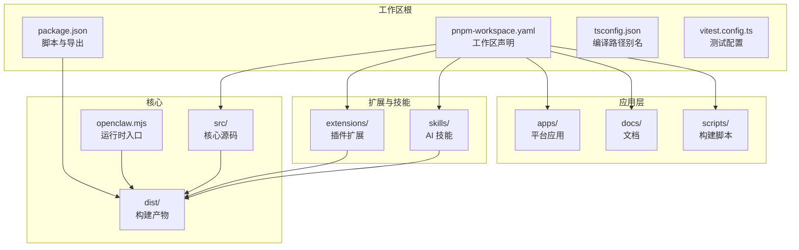
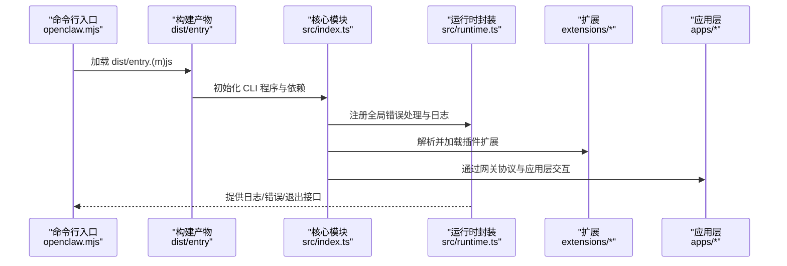
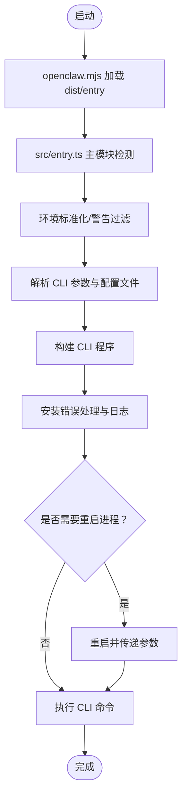
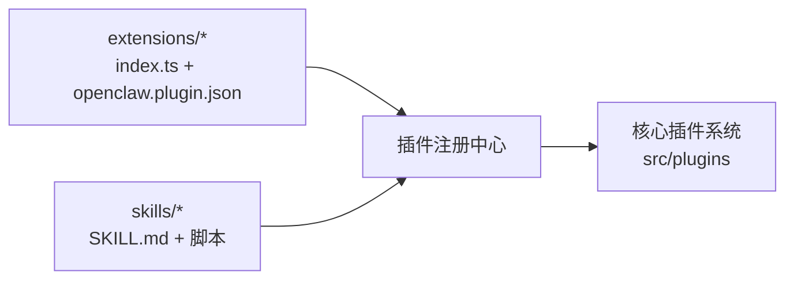
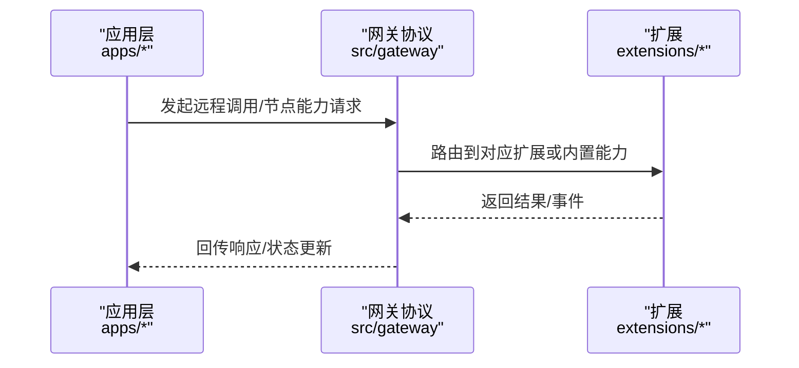
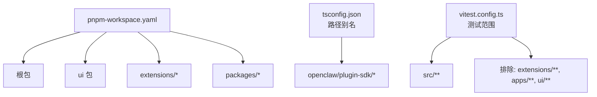

# 目录结构组织

<cite>
**本文档引用的文件**
- [README.md](file://README.md)
- [CONTRIBUTING.md](file://CONTRIBUTING.md)
- [package.json](file://package.json)
- [pnpm-workspace.yaml](file://pnpm-workspace.yaml)
- [tsconfig.json](file://tsconfig.json)
- [vitest.config.ts](file://vitest.config.ts)
- [src/entry.ts](file://src/entry.ts)
- [src/index.ts](file://src/index.ts)
- [src/runtime.ts](file://src/runtime.ts)
- [openclaw.mjs](file://openclaw.mjs)
- [src/](file://src/)
- [extensions/](file://extensions/)
- [skills/](file://skills/)
- [apps/](file://apps/)
- [docs/](file://docs/)
- [scripts/](file://scripts/)
- [dist/](file://dist/)
</cite>

## 目录

1. [简介](#简介)
2. [项目结构概览](#项目结构概览)
3. [顶级目录详解](#顶级目录详解)
4. [架构总览](#架构总览)
5. [详细组件分析](#详细组件分析)
6. [依赖关系分析](#依赖关系分析)
7. [性能考量](#性能考量)
8. [故障排除指南](#故障排除指南)
9. [结论](#结论)

## 简介

本文件系统性梳理 OpenClaw 的目录结构与组织原则，聚焦于 src（核心源码）、extensions（插件扩展）、skills（AI 技能）、apps（应用程序）、docs（文档）、scripts（构建脚本）、dist（构建产物）等顶级目录的职责边界、命名约定、文件组织方式与模块化边界。通过可视化图表与分层说明，帮助开发者快速定位相关代码并理解模块间的协作关系。

## 项目结构概览

OpenClaw 采用多包工作区（monorepo）组织，根级通过 pnpm workspace 管理主包、UI、扩展与子包；TypeScript 编译输出至 dist，运行时通过 openclaw.mjs 入口加载打包后的运行时模块。核心逻辑集中在 src，扩展与技能分别位于 extensions 与 skills，应用层在 apps，文档与脚本分别在 docs 与 scripts。

**图表来源**

- [package.json](file://package.json#L1-L268)
- [pnpm-workspace.yaml](file://pnpm-workspace.yaml#L1-L17)
- [tsconfig.json](file://tsconfig.json#L1-L29)
- [vitest.config.ts](file://vitest.config.ts#L1-L158)
- [openclaw.mjs](file://openclaw.mjs#L1-L57)

**章节来源**

- [README.md](file://README.md#L1-L556)
- [package.json](file://package.json#L1-L268)
- [pnpm-workspace.yaml](file://pnpm-workspace.yaml#L1-L17)
- [tsconfig.json](file://tsconfig.json#L1-L29)
- [vitest.config.ts](file://vitest.config.ts#L1-L158)

## 顶级目录详解

### src（核心源码）

- 职责：承载 OpenClaw 的核心运行时、命令行接口、网关控制平面、通道适配器、工具与会话管理、安全与日志等。
- 组织原则：
  - 按功能域分层：如 agents、channels、gateway、cli、commands、infra、memory、plugins、web 等。
  - 入口统一：通过 src/index.ts 导出公共 API，并在 src/entry.ts 处理 CLI 启动流程与环境初始化。
  - 运行时抽象：src/runtime.ts 提供可注入的运行时环境，便于测试与非退出场景。
- 关键文件与职责映射：
  - 入口与启动：src/entry.ts（进程级启动、警告过滤、重入保护）、src/index.ts（CLI 构建与全局错误处理）、openclaw.mjs（运行时入口，加载 dist/entry）。
  - 核心运行时：src/runtime.ts（日志、错误、退出封装）。
  - 配置与会话：src/config、src/sessions。
  - 网关与协议：src/gateway、src/protocol（由脚本生成）。
  - 插件 SDK：src/plugin-sdk。
  - 安全与基础设施：src/security、src/infra。
- 模块边界：
  - CLI 子系统与网关控制平面解耦，通过命令路由与方法调用交互。
  - 通道适配器（如 discord、telegram、slack 等）以独立模块存在，遵循统一的适配接口。
  - 扩展与技能通过插件机制接入，避免与核心紧耦合。

**章节来源**

- [src/entry.ts](file://src/entry.ts#L1-L144)
- [src/index.ts](file://src/index.ts#L1-L94)
- [src/runtime.ts](file://src/runtime.ts#L1-L54)
- [openclaw.mjs](file://openclaw.mjs#L1-L57)

### extensions（插件扩展）

- 职责：提供可插拔的通道与能力扩展，如 Discord、Telegram、Matrix、Voice Call、Memory 等。
- 组织原则：
  - 每个扩展独立目录，包含 index.ts、openclaw.plugin.json、package.json 以及 src/ 实现。
  - 使用统一的插件清单与入口，便于注册与版本同步。
- 文件类型示例：
  - 插件清单：openclaw.plugin.json、package.json。
  - 插件入口：index.ts。
  - 扩展实现：src/ 下按功能拆分的模块。
- 模块边界：
  - 扩展仅暴露必要的 API 与配置项，不直接修改核心逻辑。
  - 通过插件 SDK 与核心进行通信，确保兼容性与隔离性。

**章节来源**

- [extensions/](file://extensions/)

### skills（AI 技能）

- 职责：提供可安装与管理的 AI 技能，覆盖笔记、图像生成、转录、天气查询、视频帧提取等。
- 组织原则：
  - 每个技能一个目录，包含 SKILL.md 文档与可选的脚本或资源。
  - 技能通过 ClawHub 注册与分发，支持安装、验证与更新。
- 文件类型示例：
  - 技能描述：SKILL.md。
  - 参考资料与脚本：references/ 与 scripts/。
- 模块边界：
  - 技能以“工具”形式被代理调用，不侵入核心状态机。
  - 通过统一的技能注册与执行接口对接到代理循环。

**章节来源**

- [skills/](file://skills/)

### apps（应用程序）

- 职责：平台应用与共享库，包括 macOS、iOS、Android 以及跨平台共享组件 OpenClawKit。
- 组织原则：
  - 平台应用独立工程，通过各自构建系统产出。
  - 共享库 OpenClawKit 提供跨端通用能力（如 Canvas A2UI 工具）。
- 文件类型示例：
  - iOS：Sources、Tests、WatchExtension 等。
  - macOS：Sources、Tests、Package.swift。
  - Android：app、benchmark、scripts。
  - OpenClawKit：Sources、Tests、Tools/CanvasA2UI。
- 模块边界：
  - 应用层通过网关协议与核心交互，不直接耦合核心业务逻辑。

**章节来源**

- [apps/](file://apps/)

### docs（文档）

- 职责：项目文档与站点内容，涵盖概念、安装、操作、参考与多语言翻译。
- 组织原则：
  - 分主题目录（如 concepts、install、gateway、channels 等），便于导航与维护。
  - 支持国际化与静态站点生成。
- 文件类型示例：
  - Markdown 文档、图片资源、样式与脚本。
- 模块边界：
  - 文档与代码解耦，通过脚本生成与校验工具维护质量。

**章节来源**

- [docs/](file://docs/)

### scripts（构建脚本）

- 职责：开发与发布流水线脚本，包括构建、打包、测试、文档与平台打包。
- 组织原则：
  - 按用途分组：dev、docker、e2e、podman、pre-commit、systemd 等。
  - 通过 package.json 中的 scripts 统一调度。
- 文件类型示例：
  - 构建与打包：bundle-a2ui.sh、protocol-gen.ts、write-build-info.ts。
  - 测试与校验：test-parallel.mjs、check-\*、docs-link-audit.mjs。
  - 平台打包：package-mac-app.sh、create-dmg.sh。
- 模块边界：
  - 脚本仅负责编排与工具链集成，不包含业务逻辑。

**章节来源**

- [scripts/](file://scripts/)
- [package.json](file://package.json#L49-L149)

### dist（构建产物）

- 职责：TypeScript 编译输出与打包产物，供运行时加载。
- 组织原则：
  - 输出目录由 tsconfig.json 的 outDir 指定，包含入口、插件 SDK、UI 资源等。
  - 运行时通过 openclaw.mjs 加载 dist/entry.(m)js。
- 文件类型示例：
  - 动态导入的模块：dist/entry.js、dist/entry.mjs。
  - 插件 SDK 类型与默认导出：dist/plugin-sdk/。
  - UI 资源与模板：dist/\*。
- 模块边界：
  - 构建产物对上层透明，仅通过入口与导出契约暴露能力。

**章节来源**

- [tsconfig.json](file://tsconfig.json#L14-L16)
- [openclaw.mjs](file://openclaw.mjs#L50-L56)
- [dist/](file://dist/)

## 架构总览

下图展示从运行时入口到核心模块、扩展与应用层的交互关系，体现模块边界与数据流向。

**图表来源**

- [openclaw.mjs](file://openclaw.mjs#L1-L57)
- [src/index.ts](file://src/index.ts#L1-L94)
- [src/runtime.ts](file://src/runtime.ts#L1-L54)
- [extensions/](file://extensions/)
- [apps/](file://apps/)

## 详细组件分析

### 运行时入口与启动流程

- 入口文件 openclaw.mjs 负责启用编译缓存、安装警告过滤器，并尝试加载 dist/entry.(m)js。
- src/entry.ts 在作为主模块时执行环境标准化、实验性警告抑制、参数解析与 CLI 启动。
- src/index.ts 作为库入口，构建 CLI 程序并导出公共 API；同时设置未捕获异常处理。

**图表来源**

- [openclaw.mjs](file://openclaw.mjs#L1-L57)
- [src/entry.ts](file://src/entry.ts#L1-L144)
- [src/index.ts](file://src/index.ts#L1-L94)

**章节来源**

- [openclaw.mjs](file://openclaw.mjs#L1-L57)
- [src/entry.ts](file://src/entry.ts#L1-L144)
- [src/index.ts](file://src/index.ts#L1-L94)

### 插件扩展与技能注册

- 扩展通过 openclaw.plugin.json 与 index.ts 暴露能力，统一注册到核心插件系统。
- 技能通过 SKILL.md 与脚本定义能力，经由技能平台进行安装与管理。

**图表来源**

- [extensions/](file://extensions/)
- [skills/](file://skills/)
- [src/plugins/](file://src/plugins/)

**章节来源**

- [extensions/](file://extensions/)
- [skills/](file://skills/)

### 应用层与网关协议

- 应用层（apps/\*）通过网关协议与核心交互，实现远程控制、节点能力调用与设备本地动作。
- 协议由脚本生成并校验，确保 TypeScript 与 Swift 侧一致性。

**图表来源**

- [apps/](file://apps/)
- [src/gateway/](file://src/gateway/)
- [extensions/](file://extensions/)

**章节来源**

- [apps/](file://apps/)
- [src/gateway/](file://src/gateway/)

## 依赖关系分析

- 工作区与包管理：pnpm-workspace.yaml 声明根包、UI、扩展与子包，仅构建特定原生依赖以减少体积。
- 编译与别名：tsconfig.json 定义 openclaw/plugin-sdk 路径别名，便于插件开发与测试。
- 测试范围：vitest.config.ts 限定测试包含范围与覆盖率阈值，排除扩展、应用与 UI，锚定核心 src。

**图表来源**

- [pnpm-workspace.yaml](file://pnpm-workspace.yaml#L1-L17)
- [tsconfig.json](file://tsconfig.json#L20-L24)
- [vitest.config.ts](file://vitest.config.ts#L36-L154)

**章节来源**

- [pnpm-workspace.yaml](file://pnpm-workspace.yaml#L1-L17)
- [tsconfig.json](file://tsconfig.json#L1-L29)
- [vitest.config.ts](file://vitest.config.ts#L1-L158)

## 性能考量

- 构建缓存：openclaw.mjs 启用 Node.js 编译缓存以提升启动速度。
- 并行测试：vitest 配置根据平台与 CPU 数量动态调整 worker 数量，CI 下 Windows 与非 Windows 采用不同并发策略。
- 仅构建必要原生依赖：onlyBuiltDependencies 限制原生扩展构建范围，降低安装与打包成本。
- 日志与进度：src/runtime.ts 在运行时清理进度行并输出结构化日志，避免阻塞与冗余输出。

**章节来源**

- [openclaw.mjs](file://openclaw.mjs#L6-L12)
- [vitest.config.ts](file://vitest.config.ts#L8-L10)
- [pnpm-workspace.yaml](file://pnpm-workspace.yaml#L7-L16)
- [src/runtime.ts](file://src/runtime.ts#L21-L35)

## 故障排除指南

- 启动失败：检查 openclaw.mjs 是否成功加载 dist/entry.(m)js；确认 dist 目录存在且已构建。
- 环境问题：src/entry.ts 与 src/index.ts 均进行环境标准化与错误处理，关注未捕获异常与端口占用。
- 插件加载：确认 extensions/\* 的 openclaw.plugin.json 与 index.ts 正确导出；使用插件同步脚本保持版本一致。
- 测试失败：根据 vitest.config.ts 的 include/exclude 规则定位测试范围；在 CI 环境下注意 Windows 平台差异。

**章节来源**

- [openclaw.mjs](file://openclaw.mjs#L37-L56)
- [src/entry.ts](file://src/entry.ts#L119-L142)
- [src/index.ts](file://src/index.ts#L84-L92)
- [vitest.config.ts](file://vitest.config.ts#L36-L55)

## 结论

OpenClaw 的目录结构以“核心源码 + 插件扩展 + 技能 + 应用 + 文档 + 脚本 + 构建产物”的清晰边界组织，配合 monorepo 工作区与严格的测试/构建配置，实现了高内聚、低耦合与可扩展的体系。开发者可通过本文档快速定位目标模块，理解其职责与边界，并基于插件 SDK 与技能平台进行二次开发与集成。
