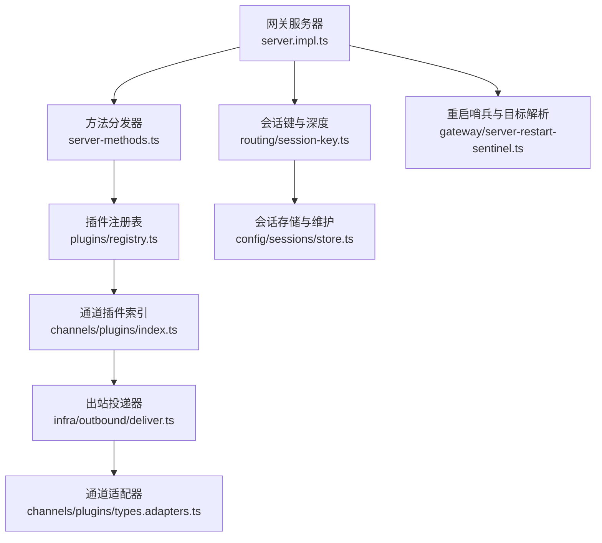
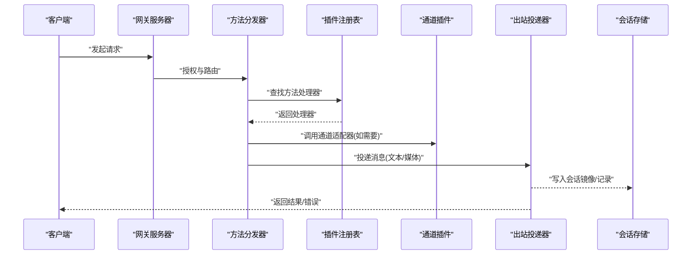
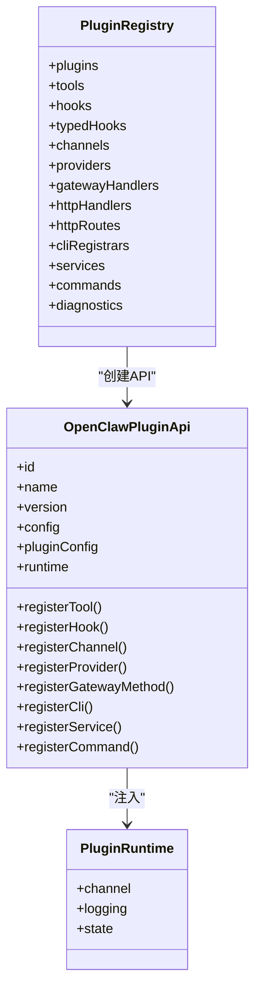
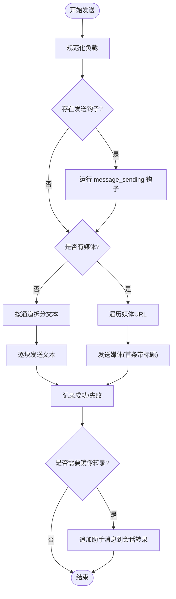
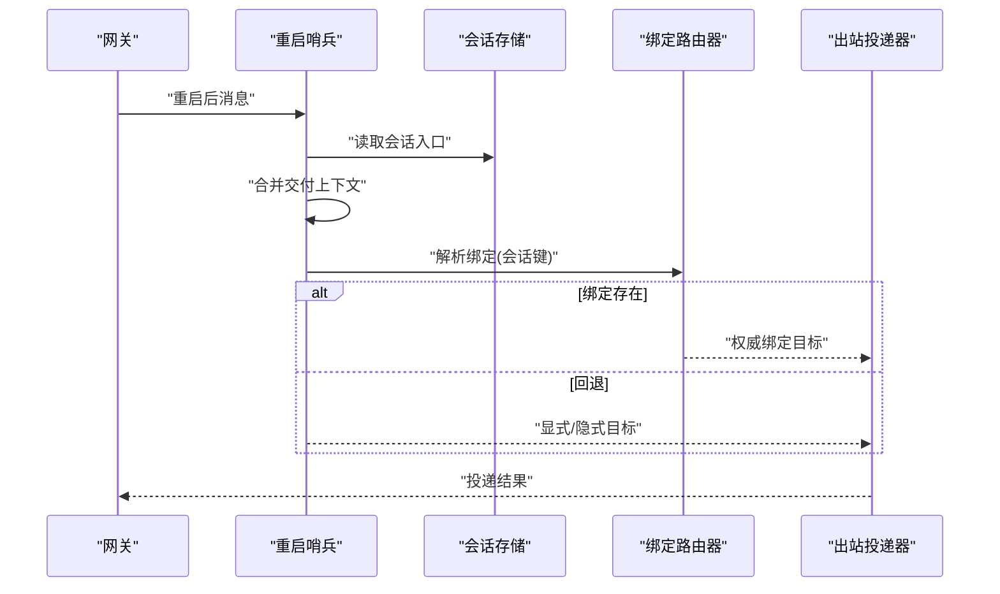
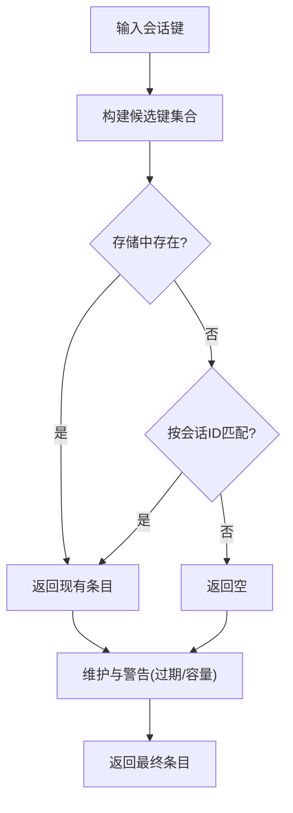
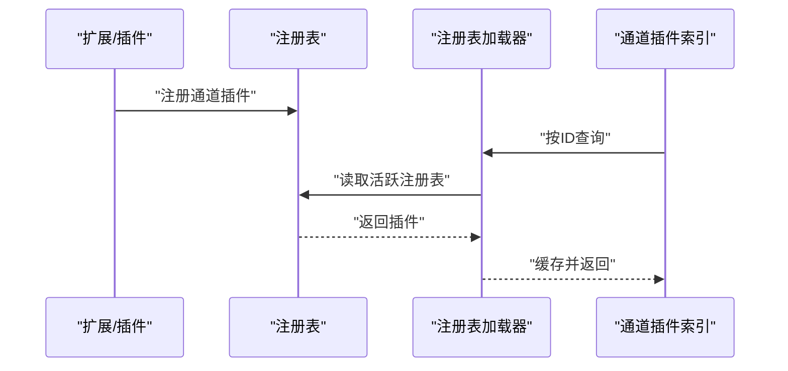
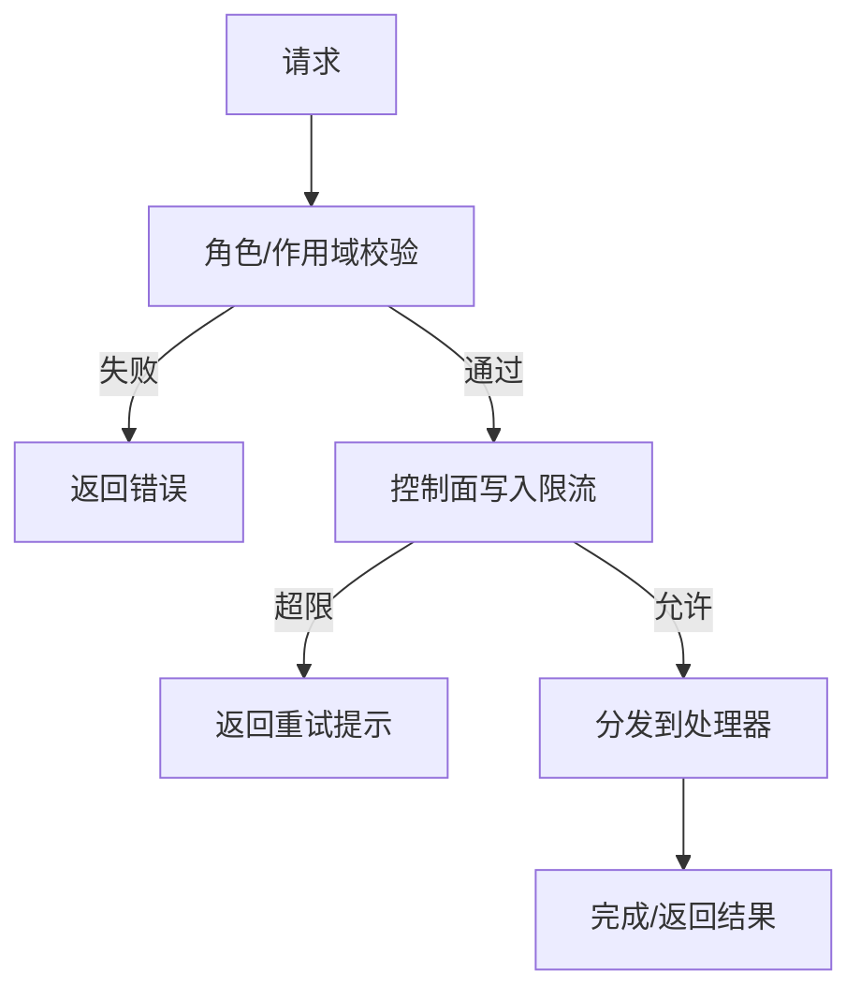

# 组件交互机制

<cite>
**本文引用的文件**
- [src/plugin-sdk/index.ts](file://src/plugin-sdk/index.ts)
- [src/plugins/runtime.ts](file://src/plugins/runtime.ts)
- [src/plugins/registry.ts](file://src/plugins/registry.ts)
- [src/channels/plugins/types.ts](file://src/channels/plugins/types.ts)
- [src/channels/plugins/types.adapters.ts](file://src/channels/plugins/types.adapters.ts)
- [src/channels/plugins/types.core.ts](file://src/channels/plugins/types.core.ts)
- [src/channels/plugins/index.ts](file://src/channels/plugins/index.ts)
- [src/gateway/server.impl.ts](file://src/gateway/server.impl.ts)
- [src/gateway/server-methods.ts](file://src/gateway/server-methods.ts)
- [src/gateway/server-restart-sentinel.ts](file://src/gateway/server-restart-sentinel.ts)
- [src/infra/outbound/deliver.ts](file://src/infra/outbound/deliver.ts)
- [src/infra/outbound/bound-delivery-router.ts](file://src/infra/outbound/bound-delivery-router.ts)
- [src/routing/session-key.ts](file://src/routing/session-key.ts)
- [src/gateway/session-utils.ts](file://src/gateway/session-utils.ts)
- [src/config/sessions/store.ts](file://src/config/sessions/store.ts)
- [src/cron/isolated-agent/session.ts](file://src/cron/isolated-agent/session.ts)
- [docs/zh-CN/refactor/plugin-sdk.md](file://docs/zh-CN/refactor/plugin-sdk.md)
- [extensions/synology-chat/src/runtime.ts](file://extensions/synology-chat/src/runtime.ts)
- [extensions/nostr/src/nostr-bus.ts](file://extensions/nostr/src/nostr-bus.ts)
- [src/channels/plugins/registry-loader.ts](file://src/channels/plugins/registry-loader.ts)
- [src/channels/plugins/load.ts](file://src/channels/plugins/load.ts)
</cite>

## 目录

1. [简介](#简介)
2. [项目结构](#项目结构)
3. [核心组件](#核心组件)
4. [架构总览](#架构总览)
5. [详细组件分析](#详细组件分析)
6. [依赖关系分析](#依赖关系分析)
7. [性能考量](#性能考量)
8. [故障排查指南](#故障排查指南)
9. [结论](#结论)
10. [附录](#附录)

## 简介

本文件系统性阐述 OpenClaw 的组件交互机制，聚焦以下主题：

- 核心组件间的通信方式：消息路由、事件传递、状态同步
- 插件系统与主系统的交互模式：注册、加载、调用链路
- 频道适配器的注册与调用流程：适配器类型、上下文与发送路径
- 代理生命周期管理：会话键生成、会话存储与维护、重启恢复
- 工具调用策略与会话状态维护：钩子、镜像转录、去重与幂等
- 接口定义、数据交换格式与错误传播机制
- 并发处理、异步通信与资源管理最佳实践

## 项目结构

OpenClaw 采用“核心 + 插件 + 频道适配器”的分层架构：

- 核心网关负责请求授权、方法分发、生命周期与系统服务
- 插件系统提供扩展能力，统一注册与运行时访问
- 频道适配器封装不同聊天平台的消息收发与目录解析
- 出站投递模块负责消息拆分、并发发送、队列与镜像转录

图表来源

- [src/gateway/server.impl.ts](file://src/gateway/server.impl.ts#L1-L200)
- [src/gateway/server-methods.ts](file://src/gateway/server-methods.ts#L1-L150)
- [src/plugins/registry.ts](file://src/plugins/registry.ts#L146-L520)
- [src/channels/plugins/index.ts](file://src/channels/plugins/index.ts#L1-L85)
- [src/infra/outbound/deliver.ts](file://src/infra/outbound/deliver.ts#L1-L621)
- [src/channels/plugins/types.adapters.ts](file://src/channels/plugins/types.adapters.ts#L1-L320)
- [src/routing/session-key.ts](file://src/routing/session-key.ts#L1-L242)
- [src/config/sessions/store.ts](file://src/config/sessions/store.ts#L485-L1074)
- [src/gateway/server-restart-sentinel.ts](file://src/gateway/server-restart-sentinel.ts#L34-L71)

章节来源

- [src/gateway/server.impl.ts](file://src/gateway/server.impl.ts#L1-L200)
- [src/gateway/server-methods.ts](file://src/gateway/server-methods.ts#L1-L150)
- [src/plugins/registry.ts](file://src/plugins/registry.ts#L146-L520)
- [src/channels/plugins/index.ts](file://src/channels/plugins/index.ts#L1-L85)
- [src/infra/outbound/deliver.ts](file://src/infra/outbound/deliver.ts#L1-L621)
- [src/channels/plugins/types.adapters.ts](file://src/channels/plugins/types.adapters.ts#L1-L320)
- [src/routing/session-key.ts](file://src/routing/session-key.ts#L1-L242)
- [src/config/sessions/store.ts](file://src/config/sessions/store.ts#L485-L1074)
- [src/gateway/server-restart-sentinel.ts](file://src/gateway/server-restart-sentinel.ts#L34-L71)

## 核心组件

- 网关服务器：启动与生命周期管理、方法分发、健康检查、插件加载、通道监控、更新与诊断
- 插件注册表：集中管理工具、钩子、通道、提供者、HTTP 路由、CLI 命令、服务等
- 通道适配器：抽象不同聊天平台的配置、登录、心跳、目录、消息与媒体发送
- 出站投递器：按通道适配器发送文本/媒体，支持拆分、并发、钩子、镜像转录与队列
- 会话键与存储：标准化会话键、会话深度、线程绑定、重启恢复与维护告警

章节来源

- [src/gateway/server.impl.ts](file://src/gateway/server.impl.ts#L1-L200)
- [src/plugins/registry.ts](file://src/plugins/registry.ts#L146-L520)
- [src/channels/plugins/types.adapters.ts](file://src/channels/plugins/types.adapters.ts#L1-L320)
- [src/infra/outbound/deliver.ts](file://src/infra/outbound/deliver.ts#L1-L621)
- [src/routing/session-key.ts](file://src/routing/session-key.ts#L1-L242)
- [src/config/sessions/store.ts](file://src/config/sessions/store.ts#L485-L1074)

## 架构总览

OpenClaw 的组件交互遵循“请求 → 授权 → 方法分发 → 插件/适配器 → 出站投递 → 存储/镜像”的主路径，并在多个环节引入钩子、队列与会话上下文以实现可观测、可恢复与可扩展。

图表来源

- [src/gateway/server-methods.ts](file://src/gateway/server-methods.ts#L97-L150)
- [src/plugins/registry.ts](file://src/plugins/registry.ts#L269-L289)
- [src/channels/plugins/types.adapters.ts](file://src/channels/plugins/types.adapters.ts#L106-L123)
- [src/infra/outbound/deliver.ts](file://src/infra/outbound/deliver.ts#L230-L288)
- [src/config/sessions/store.ts](file://src/config/sessions/store.ts#L1033-L1074)

## 详细组件分析

### 插件系统与注册/运行时

- 注册表结构：统一记录插件元信息、工具、钩子、通道、提供者、HTTP 路由、CLI、服务、命令与诊断
- 运行时：全局单例持有当前活跃注册表，插件通过 OpenClawPluginApi 注册能力
- 通道插件加载：通过通道注册表加载器缓存与失效，按需从活跃注册表解析

图表来源

- [src/plugins/registry.ts](file://src/plugins/registry.ts#L124-L138)
- [src/plugins/registry.ts](file://src/plugins/registry.ts#L472-L503)
- [src/plugins/runtime.ts](file://src/plugins/runtime.ts#L1-L42)
- [docs/zh-CN/refactor/plugin-sdk.md](file://docs/zh-CN/refactor/plugin-sdk.md#L42-L152)

章节来源

- [src/plugins/registry.ts](file://src/plugins/registry.ts#L146-L520)
- [src/plugins/runtime.ts](file://src/plugins/runtime.ts#L1-L42)
- [docs/zh-CN/refactor/plugin-sdk.md](file://docs/zh-CN/refactor/plugin-sdk.md#L42-L152)

### 频道适配器与消息发送

- 适配器类型：配置、登录/登出、心跳、目录、解析、安全、消息与媒体发送、投票、流式输出等
- 出站上下文：包含目标、文本、媒体、线程/回复ID、身份、依赖注入等
- 发送流程：规范化负载 → 钩子拦截/修改/取消 → 拆分与并发发送 → 队列确认/失败回滚 → 镜像转录

图表来源

- [src/infra/outbound/deliver.ts](file://src/infra/outbound/deliver.ts#L230-L621)
- [src/channels/plugins/types.adapters.ts](file://src/channels/plugins/types.adapters.ts#L106-L123)

章节来源

- [src/infra/outbound/deliver.ts](file://src/infra/outbound/deliver.ts#L1-L621)
- [src/channels/plugins/types.adapters.ts](file://src/channels/plugins/types.adapters.ts#L1-L320)

### 会话键、线程绑定与重启恢复

- 会话键生成：支持 agent:agentId:mainKey 或 direct/group/thread 扩展
- 线程绑定：根据会话键解析线程ID，优先使用绑定记录，否则回退到显式目标
- 重启恢复：从重启哨兵与会话存储合并投递上下文，解析出站目标并容错

图表来源

- [src/gateway/server-restart-sentinel.ts](file://src/gateway/server-restart-sentinel.ts#L34-L71)
- [src/infra/outbound/bound-delivery-router.ts](file://src/infra/outbound/bound-delivery-router.ts#L1-L53)
- [src/gateway/session-utils.ts](file://src/gateway/session-utils.ts#L178-L188)

章节来源

- [src/routing/session-key.ts](file://src/routing/session-key.ts#L106-L162)
- [src/infra/outbound/bound-delivery-router.ts](file://src/infra/outbound/bound-delivery-router.ts#L1-L53)
- [src/gateway/server-restart-sentinel.ts](file://src/gateway/server-restart-sentinel.ts#L34-L71)
- [src/gateway/session-utils.ts](file://src/gateway/session-utils.ts#L178-L188)

### 生命周期管理与会话维护

- 会话键候选与规范化：支持全局/别名/agent 前缀，兼容历史键
- 会话存储维护：过期清理、容量上限、磁盘预算、维护警告
- 任务/定时场景下的新会话滚动：基于过期时间与随机ID生成

图表来源

- [src/routing/session-key.ts](file://src/routing/session-key.ts#L50-L98)
- [src/config/sessions/store.ts](file://src/config/sessions/store.ts#L485-L524)
- [src/cron/isolated-agent/session.ts](file://src/cron/isolated-agent/session.ts#L43-L70)

章节来源

- [src/routing/session-key.ts](file://src/routing/session-key.ts#L1-L242)
- [src/config/sessions/store.ts](file://src/config/sessions/store.ts#L485-L1074)
- [src/cron/isolated-agent/session.ts](file://src/cron/isolated-agent/session.ts#L43-L70)

### 插件与频道适配器的注册与加载

- 通道注册表加载器：按通道ID从活跃注册表解析插件，带缓存与注册表变更失效
- 通道插件加载：对外暴露列表与获取函数，统一归一化通道ID

图表来源

- [src/channels/plugins/registry-loader.ts](file://src/channels/plugins/registry-loader.ts#L1-L35)
- [src/channels/plugins/load.ts](file://src/channels/plugins/load.ts#L1-L8)
- [src/channels/plugins/index.ts](file://src/channels/plugins/index.ts#L45-L57)

章节来源

- [src/channels/plugins/registry-loader.ts](file://src/channels/plugins/registry-loader.ts#L1-L35)
- [src/channels/plugins/load.ts](file://src/channels/plugins/load.ts#L1-L8)
- [src/channels/plugins/index.ts](file://src/channels/plugins/index.ts#L1-L85)

### 网关方法分发与授权

- 方法分发：核心方法集由网关聚合，支持额外处理器覆盖
- 授权：角色与作用域校验、控制面写入限流、未知方法拒绝
- 安全：对特定方法进行速率限制与审计

图表来源

- [src/gateway/server-methods.ts](file://src/gateway/server-methods.ts#L37-L149)

章节来源

- [src/gateway/server-methods.ts](file://src/gateway/server-methods.ts#L1-L150)

### 扩展示例：Synology Chat 与 Nostr

- Synology Chat：插件运行时单例保存与获取，供频道适配器使用
- Nostr：事件总线中的签名验证、解密、去重、回复与指标上报

章节来源

- [extensions/synology-chat/src/runtime.ts](file://extensions/synology-chat/src/runtime.ts#L1-L20)
- [extensions/nostr/src/nostr-bus.ts](file://extensions/nostr/src/nostr-bus.ts#L438-L480)

## 依赖关系分析

- 松耦合：通道适配器通过统一接口对接，出站投递器仅依赖适配器契约
- 可观测：钩子系统贯穿发送前后，内部钩子用于会话事件
- 可恢复：重启哨兵合并上下文，绑定路由器在无绑定时回退
- 可扩展：插件注册表集中管理，通道插件按ID注册与加载

图表来源

- [src/plugins/registry.ts](file://src/plugins/registry.ts#L146-L520)
- [src/channels/plugins/index.ts](file://src/channels/plugins/index.ts#L1-L85)
- [src/infra/outbound/deliver.ts](file://src/infra/outbound/deliver.ts#L1-L621)
- [src/gateway/server-methods.ts](file://src/gateway/server-methods.ts#L1-L150)

章节来源

- [src/plugins/registry.ts](file://src/plugins/registry.ts#L146-L520)
- [src/channels/plugins/index.ts](file://src/channels/plugins/index.ts#L1-L85)
- [src/infra/outbound/deliver.ts](file://src/infra/outbound/deliver.ts#L1-L621)
- [src/gateway/server-methods.ts](file://src/gateway/server-methods.ts#L1-L150)

## 性能考量

- 并发与限流：出站投递按通道拆分与并发发送；控制面写入限流避免抖动
- 队列与幂等：写前队列、成功确认/失败回滚，支持 best-effort 与中断检测
- 缓存与去重：通道注册表加载器缓存，Nostr 事件去重跟踪
- 存储维护：定期清理过期会话、容量上限与磁盘预算，避免膨胀

## 故障排查指南

- 插件未注册或重复注册：检查注册表诊断与重复路径
- 通道适配器缺失：确认通道ID与适配器可用性
- 发送失败：查看钩子拦截结果、通道错误、队列回滚日志
- 会话异常：核对会话键候选、线程绑定、重启上下文合并
- 速率限制：关注控制面写入限流与重试头

章节来源

- [src/plugins/registry.ts](file://src/plugins/registry.ts#L168-L170)
- [src/infra/outbound/deliver.ts](file://src/infra/outbound/deliver.ts#L230-L288)
- [src/gateway/server-restart-sentinel.ts](file://src/gateway/server-restart-sentinel.ts#L34-L71)

## 结论

OpenClaw 通过“插件注册表 + 通道适配器 + 出站投递器 + 会话上下文”的组合，实现了跨平台、可观测、可恢复且可扩展的组件交互机制。其设计强调接口契约、钩子扩展、队列与镜像、以及重启恢复与会话维护，适合在复杂多通道环境中稳定运行。

## 附录

- 数据交换格式：请求/响应遵循网关协议，负载包含文本、媒体URL、线程/回复ID、通道数据等
- 错误传播：方法分发器统一错误形状，通道适配器抛出的异常经队列回滚与钩子记录
- 最佳实践：使用钩子进行内容拦截与修改；启用队列保障一致性；合理设置会话维护参数；利用绑定路由器提升投递可靠性
