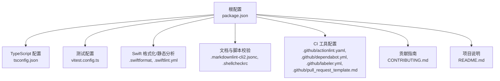
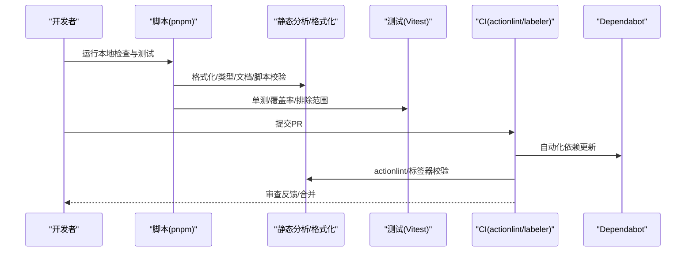
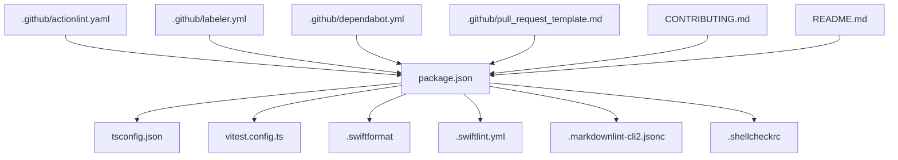

# 编码规范与约定

<cite>
**本文引用的文件**
- [package.json](file://package.json)
- [tsconfig.json](file://tsconfig.json)
- [vitest.config.ts](file://vitest.config.ts)
- [.swiftlint.yml](file://.swiftlint.yml)
- [.swiftformat](file://.swiftformat)
- [.markdownlint-cli2.jsonc](file://.markdownlint-cli2.jsonc)
- [.shellcheckrc](file://.shellcheckrc)
- [.github/actionlint.yaml](file://.github/actionlint.yaml)
- [.github/dependabot.yml](file://.github/dependabot.yml)
- [.github/labeler.yml](file://.github/labeler.yml)
- [.github/pull_request_template.md](file://.github/pull_request_template.md)
- [CONTRIBUTING.md](file://CONTRIBUTING.md)
- [README.md](file://README.md)
</cite>

## 目录

1. [简介](#简介)
2. [项目结构](#项目结构)
3. [核心组件](#核心组件)
4. [架构总览](#架构总览)
5. [详细组件分析](#详细组件分析)
6. [依赖关系分析](#依赖关系分析)
7. [性能考量](#性能考量)
8. [故障排查指南](#故障排查指南)
9. [结论](#结论)
10. [附录](#附录)

## 简介

本文件为 OpenClaw 的编码规范与约定，覆盖以下方面：

- TypeScript/JavaScript 的编码风格、命名约定与文件组织原则
- Swift 代码的格式化规则与静态分析配置
- Markdown 文档的编写规范与代码注释标准
- 代码审查检查清单与质量保证流程
- 错误处理模式、日志记录规范与测试代码编写指南
- 跨平台开发的特殊考虑与兼容性要求

本规范以仓库内现有配置与脚本为依据，确保团队协作一致性与可维护性。

## 项目结构

OpenClaw 采用多语言混合工程：TypeScript/JavaScript 为主，配合 Swift（macOS/iOS 应用与共享库）、Shell 脚本与 Markdown 文档。根目录通过统一的包管理与构建脚本协调各子系统。

图示来源

- [package.json](file://package.json#L1-L268)
- [tsconfig.json](file://tsconfig.json#L1-L29)
- [vitest.config.ts](file://vitest.config.ts#L1-L158)
- [.swiftlint.yml](file://.swiftlint.yml#L1-L149)
- [.swiftformat](file://.swiftformat#L1-L52)
- [.markdownlint-cli2.jsonc](file://.markdownlint-cli2.jsonc#L1-L53)
- [.shellcheckrc](file://.shellcheckrc#L1-L26)
- [.github/actionlint.yaml](file://.github/actionlint.yaml#L1-L23)
- [.github/dependabot.yml](file://.github/dependabot.yml#L1-L127)
- [.github/labeler.yml](file://.github/labeler.yml#L1-L259)
- [.github/pull_request_template.md](file://.github/pull_request_template.md#L1-L109)
- [CONTRIBUTING.md](file://CONTRIBUTING.md#L1-L160)
- [README.md](file://README.md#L1-L556)

章节来源

- [package.json](file://package.json#L1-L268)
- [README.md](file://README.md#L1-L556)

## 核心组件

- 构建与脚本工具链：基于 pnpm 的统一脚本入口，涵盖格式化、类型检查、静态分析、测试、打包与发布等。
- TypeScript 配置：严格模式、NodeNext 模块解析、路径别名与输出目录等。
- 测试框架：Vitest，含覆盖率阈值、排除范围与并行策略。
- Swift 规范：SwiftFormat 与 SwiftLint 统一风格与质量门禁。
- 文档与脚本校验：markdownlint-cli2 与 ShellCheck。
- CI 工具：actionlint、Dependabot、自动标签器与 PR 模板。

章节来源

- [package.json](file://package.json#L49-L149)
- [tsconfig.json](file://tsconfig.json#L1-L29)
- [vitest.config.ts](file://vitest.config.ts#L12-L158)
- [.swiftlint.yml](file://.swiftlint.yml#L1-L149)
- [.swiftformat](file://.swiftformat#L1-L52)
- [.markdownlint-cli2.jsonc](file://.markdownlint-cli2.jsonc#L1-L53)
- [.shellcheckrc](file://.shellcheckrc#L1-L26)
- [.github/actionlint.yaml](file://.github/actionlint.yaml#L1-L23)
- [.github/dependabot.yml](file://.github/dependabot.yml#L1-L127)
- [.github/labeler.yml](file://.github/labeler.yml#L1-L259)
- [.github/pull_request_template.md](file://.github/pull_request_template.md#L1-L109)

## 架构总览

下图展示从开发者提交到 CI 校验与依赖更新的整体流程，体现质量门禁与自动化策略。

图示来源

- [package.json](file://package.json#L58-L101)
- [.github/actionlint.yaml](file://.github/actionlint.yaml#L1-L23)
- [.github/labeler.yml](file://.github/labeler.yml#L1-L259)
- [.github/dependabot.yml](file://.github/dependabot.yml#L1-L127)

## 详细组件分析

### TypeScript/JavaScript 编码规范与命名约定

- 语言与运行时
  - 目标环境：Node ≥22；模块系统：NodeNext；目标 ES 版本：es2023。
  - 严格模式开启，启用装饰器支持（兼容 UI 构建）。
- 命名约定
  - 类型与接口使用帕斯卡命名；常量全大写；变量与函数使用驼峰命名；路径别名遵循 openclaw/plugin-sdk 前缀。
- 文件组织
  - 源码位于 src、ui、extensions；dist 为构建输出目录；避免直接修改 node_modules 与 dist。
- 路径别名
  - 通过 tsconfig 的 paths 映射 openclaw/plugin-sdk 及其子模块，便于插件 SDK 引用。
- 代码风格与静态分析
  - 使用 oxlint（类型感知）进行类型检查与修复；格式化由 oxfmt 执行。
  - 临时性或实验性检查脚本在 package.json 中以 lint:tmp:\* 形式存在，用于边界约束与安全检查。
- 质量门禁
  - 本地执行 pnpm check 聚合格式化、类型检查、静态分析与特定安全检查。
  - CI 中执行相同流程，确保 PR 质量。

章节来源

- [tsconfig.json](file://tsconfig.json#L1-L29)
- [package.json](file://package.json#L49-L101)
- [package.json](file://package.json#L101-L105)
- [CONTRIBUTING.md](file://CONTRIBUTING.md#L68-L75)

### 测试代码编写指南

- 测试框架与配置
  - Vitest 作为默认测试运行器；根据平台设置 hook 超时与工作进程数。
  - include/exclude 精准控制测试集，避免第三方与应用层代码进入覆盖率统计。
  - 覆盖率阈值：行/函数/分支/语句均不低于 70%/55%，并锚定到 src/ 根目录。
- 排除策略
  - 排除 apps、ui、test、入口文件、CLI/命令行、网关服务端等难以单元测试或由集成测试覆盖的模块。
- 并发与隔离
  - 使用 fork 池与 vmForks，避免环境泄漏；unstubEnvs/unstubGlobals 确保测试隔离。
- 本地与 CI 差异
  - Windows 下 hook 超时更长；CI 使用固定工作进程数。

章节来源

- [vitest.config.ts](file://vitest.config.ts#L1-L158)

### Swift 编码规范与格式化规则

- 格式化
  - SwiftFormat：Swift 6.2；缩进 4 空格；最大行长 120；self 插入策略；导入分组与扩展 ACL；MARK 注释格式；排除 node_modules、dist、coverage 等目录。
- 静态分析
  - SwiftLint：启用 unused_declaration、unused_import；禁用与 SwiftFormat 冲突的规则；对函数体长度、参数数量、文件长度、嵌套深度、元组大小、行长等设置警告/错误阈值；忽略注释与 URL。
  - included/excluded 覆盖 macOS 应用与共享库源码，排除生成文件与资源目录。
- 协作注意
  - 与 UI 构建工具链保持一致的 Swift 版本与风格；避免在未同步更新工具链的情况下切换规则。

章节来源

- [.swiftformat](file://.swiftformat#L1-L52)
- [.swiftlint.yml](file://.swiftlint.yml#L1-L149)

### Markdown 文档编写规范与代码注释标准

- 文档校验
  - markdownlint-cli2：仅对 docs/\*_/_.md 与 README.md 生效；忽略 zh-CN、.i18n 与模板目录；允许部分 HTML 元素。
  - MD013/MD025/MD029/MD036/MD040/MD041/MD046 等规则按需关闭。
- 代码注释
  - 优先使用英文注释；简明扼要描述意图与边界条件；复杂逻辑补充设计说明。
  - 与文档保持一致的术语与风格，避免过时内容。

章节来源

- [.markdownlint-cli2.jsonc](file://.markdownlint-cli2.jsonc#L1-L53)

### Shell 脚本校验与最佳实践

- ShellCheck 配置
  - 关闭常见误报（如 SC2034、SC2155、SC2295 等），以减少噪音并聚焦真实问题。
- 脚本风格
  - 保持简洁与可读性；避免不必要的复杂度；在 CI 中单独运行 ShellCheck，避免与 actionlint 冲突。

章节来源

- [.shellcheckrc](file://.shellcheckrc#L1-L26)

### 代码审查检查清单与质量保证流程

- PR 模板要点
  - 问题与影响、变更范围、用户可见行为变化、安全影响、复现步骤、证据、人工验证、兼容性与回滚方案、风险与缓解。
- CI 工具链
  - actionlint：校验 GitHub Actions 工作流；labeler：按变更自动打标签；Dependabot：周期性依赖更新与 PR 限制。
- 本地质量门禁
  - pnpm check：格式化检查、类型检查、静态分析、特定安全检查；pnpm check:docs：文档格式化与链接检查。
- 合并策略
  - 严格遵循 PR 模板与 CI 结果；确保测试通过与覆盖率达标；对安全相关变更进行重点评审。

章节来源

- [.github/pull_request_template.md](file://.github/pull_request_template.md#L1-L109)
- [.github/actionlint.yaml](file://.github/actionlint.yaml#L1-L23)
- [.github/labeler.yml](file://.github/labeler.yml#L1-L259)
- [.github/dependabot.yml](file://.github/dependabot.yml#L1-L127)
- [package.json](file://package.json#L58-L82)

### 错误处理模式与日志记录规范

- 日志
  - 使用 tslog 记录器；建议区分级别与上下文；避免在生产中泄露敏感信息。
- 错误处理
  - 明确错误边界与传播路径；对外暴露结构化错误；在网关与通道层对不可信输入进行严格校验与降级处理。
- 安全默认
  - 默认将私信视为不受信任输入；通过配对与白名单机制降低风险；定期运行 doctor 检查配置风险。

章节来源

- [README.md](file://README.md#L112-L125)

### 跨平台开发的特殊考虑与兼容性要求

- Node 运行时
  - Node ≥22；Windows 下 hook 超时更长；CI 使用固定工作进程数。
- 平台差异
  - macOS/iOS/Android 应用与共享库遵循 Swift 6 与 Xcode 体验；UI 构建保留旧式装饰器以兼容当前打包工具链。
- 资源与权限
  - macOS 应用需签名与权限持久化；远程访问通过 Tailscale 或 SSH 隧道；浏览器控制在 Linux 上需额外排障指引。
- 兼容性
  - 严格遵循 CI 与本地一致的工具链版本；避免在未同步更新工具链的情况下切换规则。

章节来源

- [README.md](file://README.md#L28-L31)
- [README.md](file://README.md#L230-L239)
- [README.md](file://README.md#L471-L477)
- [CONTRIBUTING.md](file://CONTRIBUTING.md#L76-L90)

## 依赖关系分析

下图展示关键配置之间的依赖关系与作用域。

图示来源

- [package.json](file://package.json#L1-L268)
- [tsconfig.json](file://tsconfig.json#L1-L29)
- [vitest.config.ts](file://vitest.config.ts#L1-L158)
- [.swiftlint.yml](file://.swiftlint.yml#L1-L149)
- [.swiftformat](file://.swiftformat#L1-L52)
- [.markdownlint-cli2.jsonc](file://.markdownlint-cli2.jsonc#L1-L53)
- [.shellcheckrc](file://.shellcheckrc#L1-L26)
- [.github/actionlint.yaml](file://.github/actionlint.yaml#L1-L23)
- [.github/dependabot.yml](file://.github/dependabot.yml#L1-L127)
- [.github/labeler.yml](file://.github/labeler.yml#L1-L259)
- [.github/pull_request_template.md](file://.github/pull_request_template.md#L1-L109)
- [CONTRIBUTING.md](file://CONTRIBUTING.md#L1-L160)
- [README.md](file://README.md#L1-L556)

## 性能考量

- 测试并发与稳定性
  - 根据 CPU 数量动态设置工作进程数；Windows 下缩短超时以提升稳定性。
- 覆盖率锚定
  - 仅统计 src/ 目录，避免第三方与应用层干扰，稳定覆盖率阈值。
- 构建与打包
  - 通过脚本聚合构建步骤，减少重复工作；UI 构建在首次运行时自动安装依赖。

章节来源

- [vitest.config.ts](file://vitest.config.ts#L7-L10)
- [vitest.config.ts](file://vitest.config.ts#L56-L70)
- [package.json](file://package.json#L55-L57)

## 故障排查指南

- 本地检查失败
  - 运行 pnpm check 与 pnpm check:docs；核对格式化与文档校验结果。
- 测试失败
  - 查看 Vitest 报告与覆盖率；确认排除列表是否影响了预期模块；在 Windows 下适当延长超时。
- CI 失败
  - 检查 actionlint 与 labeler 报错；确认 Dependabot 是否触发过多 PR；按 PR 模板补齐必要字段。
- 安全与权限
  - 使用 doctor 检查 DM 策略与权限配置；确保 macOS 应用签名与权限持久化。

章节来源

- [package.json](file://package.json#L58-L82)
- [vitest.config.ts](file://vitest.config.ts#L26-L55)
- [.github/actionlint.yaml](file://.github/actionlint.yaml#L1-L23)
- [.github/labeler.yml](file://.github/labeler.yml#L1-L259)
- [.github/dependabot.yml](file://.github/dependabot.yml#L1-L127)
- [.github/pull_request_template.md](file://.github/pull_request_template.md#L1-L109)
- [README.md](file://README.md#L112-L125)

## 结论

本规范以仓库现有配置为基础，明确了 TypeScript/JavaScript、Swift、Markdown 与 Shell 的编码与质量门禁策略，并提供了测试、审查与故障排查的实操指南。建议在团队内持续推广并随工具链演进适时调整规则，确保一致性与可维护性。

## 附录

- 快速参考
  - 本地检查：pnpm check、pnpm check:docs
  - 测试：pnpm test、pnpm test:coverage
  - Swift：pnpm format:swift、pnpm lint:swift
  - 文档：pnpm format:docs、pnpm lint:docs
  - CI：actionlint、labeler、Dependabot

章节来源

- [package.json](file://package.json#L58-L101)
- [.github/actionlint.yaml](file://.github/actionlint.yaml#L1-L23)
- [.github/labeler.yml](file://.github/labeler.yml#L1-L259)
- [.github/dependabot.yml](file://.github/dependabot.yml#L1-L127)
