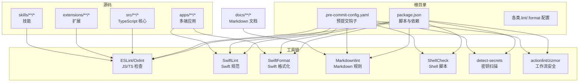
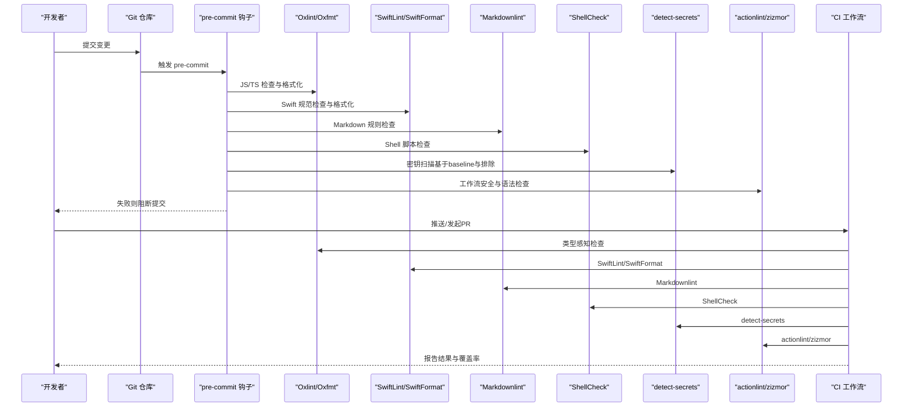
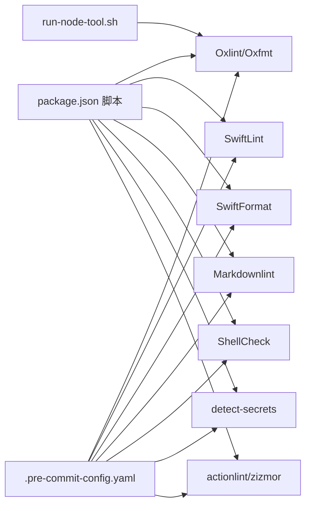

# 代码规范与风格

<cite>
**本文引用的文件**
- [package.json](file://package.json)
- [.pre-commit-config.yaml](file://.pre-commit-config.yaml)
- [scripts/pre-commit/run-node-tool.sh](file://scripts/pre-commit/run-node-tool.sh)
- [.swiftlint.yml](file://.swiftlint.yml)
- [.swiftformat](file://.swiftformat)
- [.markdownlint-cli2.jsonc](file://.markdownlint-cli2.jsonc)
- [.shellcheckrc](file://.shellcheckrc)
- [.detect-secrets.cfg](file://.detect-secrets.cfg)
- [.github/actionlint.yaml](file://.github/actionlint.yaml)
- [tsconfig.json](file://tsconfig.json)
- [vitest.config.ts](file://vitest.config.ts)
- [.gitignore](file://.gitignore)
- [CONTRIBUTING.md](file://CONTRIBUTING.md)
</cite>

## 目录

1. [引言](#引言)
2. [项目结构](#项目结构)
3. [核心组件](#核心组件)
4. [架构总览](#架构总览)
5. [详细组件分析](#详细组件分析)
6. [依赖关系分析](#依赖关系分析)
7. [性能考量](#性能考量)
8. [故障排查指南](#故障排查指南)
9. [结论](#结论)
10. [附录](#附录)

## 引言

本指南面向OpenClaw多平台开发团队，统一TypeScript/JavaScript、Swift（iOS/macOS）、Markdown与Shell脚本的编码与风格规范，并明确代码审查、提交信息、分支命名等协作流程。同时，系统化说明ESLint/Oxlint、SwiftLint、SwiftFormat、Markdownlint、ShellCheck、detect-secrets、actionlint、zizmor等静态分析与安全扫描工具的配置与使用方式，以及预提交钩子（pre-commit）的执行机制与最佳实践。

## 项目结构

OpenClaw采用Monorepo组织，核心目录与职责概览如下：

- 根级配置：包管理、脚本、CI/CD与工具配置
- src：TypeScript核心业务逻辑
- apps：多端应用（Android、iOS、macOS、共享库）
- extensions/skills：可插拔扩展与技能
- docs：文档与国际化资源
- scripts：构建、打包、测试、发布辅助脚本
- git-hooks：本地Git钩子入口
- .github：GitHub工作流与模板

图表来源

- [package.json](file://package.json#L49-L149)
- [.pre-commit-config.yaml](file://.pre-commit-config.yaml#L7-L132)

章节来源

- [package.json](file://package.json#L1-L268)
- [.pre-commit-config.yaml](file://.pre-commit-config.yaml#L1-L132)

## 核心组件

- TypeScript/JavaScript规范与工具链
  - 使用Oxlint进行类型感知的静态检查，配合Oxfmt格式化；通过脚本统一在本地与CI中执行。
  - tsconfig启用严格模式与路径别名，确保模块解析一致性。
  - Vitest用于单元测试与覆盖率统计，排除大量集成/端到端模块以稳定阈值。
- Swift规范与工具链
  - SwiftLint与SwiftFormat分别负责“规范检查”和“格式化”，配置覆盖命名长度、函数复杂度、行宽、导入组织等。
  - 针对macOS/iOS共享库与iOS工程，分别指定包含/排除范围与生成产物。
- Markdown规范
  - Markdownlint-cli2按glob匹配docs与README，忽略特定目录与模板，允许部分HTML元素。
- Shell脚本规范
  - ShellCheck作为预提交钩子，结合.gitignore与排除列表避免误报。
- 安全与合规
  - detect-secrets基于baseline与正则排除敏感模式；actionlint与zizmor用于GitHub Actions工作流的安全审计与语法检查。
- 预提交钩子
  - 统一通过.pre-commit-config.yaml定义，支持本地安装与批量执行；Node工具通过run-node-tool.sh自动选择pnpm/bun/npm/npx。

章节来源

- [package.json](file://package.json#L49-L149)
- [tsconfig.json](file://tsconfig.json#L1-L29)
- [vitest.config.ts](file://vitest.config.ts#L26-L155)
- [.swiftlint.yml](file://.swiftlint.yml#L1-L149)
- [.swiftformat](file://.swiftformat#L1-L52)
- [.markdownlint-cli2.jsonc](file://.markdownlint-cli2.jsonc#L1-L53)
- [.shellcheckrc](file://.shellcheckrc#L1-L26)
- [.detect-secrets.cfg](file://.detect-secrets.cfg#L1-L31)
- [.github/actionlint.yaml](file://.github/actionlint.yaml#L1-L23)
- [.pre-commit-config.yaml](file://.pre-commit-config.yaml#L1-L132)
- [scripts/pre-commit/run-node-tool.sh](file://scripts/pre-commit/run-node-tool.sh#L1-L32)

## 架构总览

下图展示从开发者提交到CI/CD的静态分析与质量检查流水线：

图表来源

- [.pre-commit-config.yaml](file://.pre-commit-config.yaml#L7-L132)
- [scripts/pre-commit/run-node-tool.sh](file://scripts/pre-commit/run-node-tool.sh#L1-L32)
- [.markdownlint-cli2.jsonc](file://.markdownlint-cli2.jsonc#L1-L53)
- [.swiftlint.yml](file://.swiftlint.yml#L1-L149)
- [.swiftformat](file://.swiftformat#L1-L52)
- [.detect-secrets.cfg](file://.detect-secrets.cfg#L1-L31)
- [.github/actionlint.yaml](file://.github/actionlint.yaml#L1-L23)

## 详细组件分析

### TypeScript/JavaScript 编码规范与注释规范

- 语言与编译
  - 严格模式开启，目标ES2023，模块解析NodeNext，启用装饰器与路径别名，保证类型安全与模块一致性。
- 命名约定
  - 优先使用语义化英文命名，避免缩写；类/接口首字母大写，常量全大写，变量与函数驼峰；测试文件以.test.ts结尾。
- 注释规范
  - 公共API与复杂逻辑需提供清晰注释；TODO/NOTE使用明确标签；避免无意义注释。
- 错误处理与日志
  - 明确错误边界与返回值；使用结构化日志记录上下文信息。
- 单元测试与覆盖率
  - 使用Vitest，阈值稳定在行/函数/分支/语句70%/55%；排除集成/端到端与入口文件，确保核心代码被充分验证。

章节来源

- [tsconfig.json](file://tsconfig.json#L1-L29)
- [vitest.config.ts](file://vitest.config.ts#L26-L155)
- [CONTRIBUTING.md](file://CONTRIBUTING.md#L76-L89)

### Swift 代码规范（iOS/macOS）

- 包含/排除范围
  - macOS主工程包含apps/macos/Sources，排除构建产物、DerivedData、Generated、Resources等。
- 规则与阈值
  - 启用unused_declaration/unused_import分析；禁用若干风格规则（由SwiftFormat接管），保留关键规则如force_cast/force_try警告。
  - 函数体长度、参数数量、文件/类型体长度、圈复杂度、元组大小、嵌套层级、行长等均有明确warning/error阈值。
- 格式化策略
  - SwiftFormat统一缩进、换行、空格、导入分组与MARK注释风格；排除Android、iOS工程目录与协议生成文件。

章节来源

- [.swiftlint.yml](file://.swiftlint.yml#L1-L149)
- [.swiftformat](file://.swiftformat#L1-L52)

### Markdown 格式要求

- 文件匹配
  - glob匹配docs/**/\*.md、docs/**/\*.mdx、README.md；忽略zh-CN、.i18n、reference/templates与本地缓存。
- 规则开关
  - 关闭MD013（行宽）、MD025（标题）、MD029（有序列表序号）、MD036（强调标题）、MD040（代码块语言）、MD041（文件首行）等。
- 允许的HTML元素
  - 允许Note、Info、Tip、Warning、Card、Columns、Steps、Tabs、Accordion、CodeGroup、Callout等组件标签与基础HTML元素。

章节来源

- [.markdownlint-cli2.jsonc](file://.markdownlint-cli2.jsonc#L1-L53)

### Shell 脚本规范

- 静态检查
  - ShellCheck作为pre-commit钩子，仅报告error级别；通过.gitignore与排除列表减少误报。
- 配置
  - .shellcheckrc针对常见误报项进行禁用，兼顾可读性与稳定性。

章节来源

- [.shellcheckrc](file://.shellcheckrc#L1-L26)
- [.pre-commit-config.yaml](file://.pre-commit-config.yaml#L50-L58)

### 代码审查标准

- 质量基线
  - 本地执行：pnpm build && pnpm check && pnpm test；CI必须通过所有检查。
- 结构化审查清单
  - 功能正确性、边界条件、错误处理、性能影响、安全性（密钥/权限）、可维护性（命名/注释/复杂度）、兼容性（跨平台/版本）。
- 评审要点
  - 是否引入新依赖或升级版本；是否新增或放宽安全规则；是否影响协议/生成物；是否更新文档与变更日志。

章节来源

- [CONTRIBUTING.md](file://CONTRIBUTING.md#L68-L75)

### 提交信息规范

- 提交信息建议结构
  - 类型(scope): 简要描述
  - 正文（可选）：动机、影响、迁移/回滚说明
  - 关联Issue/PR
- 类型建议
  - feat, fix, docs, style, refactor, perf, test, build, ci, chore, revert
- 冲突解决
  - 避免将未通过pre-commit的变更推送到CI；必要时先修复再推送。

章节来源

- [CONTRIBUTING.md](file://CONTRIBUTING.md#L68-L75)

### 分支命名规则

- 主分支
  - main：稳定发布基线
- 开发分支
  - feature/<功能点>：新功能
  - fix/<问题>：缺陷修复
  - docs/<主题>：文档更新
  - refactor/<模块>：重构
  - chore/<任务>：日常维护
- 发布分支
  - release/<版本号>：预发布
- 热修复
  - hotfix/<问题>：紧急修复

章节来源

- [CONTRIBUTING.md](file://CONTRIBUTING.md#L68-L75)

### 静态分析工具配置与预提交钩子

- 工具与职责
  - Oxlint/Oxfmt：JS/TS类型感知检查与格式化
  - SwiftLint/SwiftFormat：Swift规范与格式化
  - Markdownlint：Markdown规则检查
  - ShellCheck：Shell脚本静态检查
  - detect-secrets：密钥扫描（基于baseline与正则排除）
  - actionlint/zizmor：GitHub Actions工作流安全与语法检查
- 执行顺序与入口
  - 预提交钩子统一在.pre-commit-config.yaml中定义；Node工具通过run-node-tool.sh自动选择pnpm/bun/npm/npx。
- 排除策略
  - .gitignore与各工具配置共同作用，排除构建产物、第三方库、本地缓存、iOS工程产物等。

章节来源

- [.pre-commit-config.yaml](file://.pre-commit-config.yaml#L1-L132)
- [scripts/pre-commit/run-node-tool.sh](file://scripts/pre-commit/run-node-tool.sh#L1-L32)
- [.gitignore](file://.gitignore#L1-L123)
- [.detect-secrets.cfg](file://.detect-secrets.cfg#L1-L31)
- [.github/actionlint.yaml](file://.github/actionlint.yaml#L1-L23)

## 依赖关系分析

- 工具链耦合
  - package.json脚本统一调用各工具；pre-commit配置与脚本保持一致的执行命令与参数。
- 平台差异
  - SwiftLint/SwiftFormat针对macOS/iOS共享库与iOS工程分别配置；Markdownlint仅作用于docs与README。
- 安全与合规
  - detect-secrets与actionlint/zizmor独立运行，但均纳入pre-commit与CI，形成闭环。

图表来源

- [package.json](file://package.json#L49-L149)
- [.pre-commit-config.yaml](file://.pre-commit-config.yaml#L7-L132)
- [scripts/pre-commit/run-node-tool.sh](file://scripts/pre-commit/run-node-tool.sh#L1-L32)

章节来源

- [package.json](file://package.json#L49-L149)
- [.pre-commit-config.yaml](file://.pre-commit-config.yaml#L1-L132)

## 性能考量

- 代码复杂度控制
  - SwiftLint对函数体长度、参数数、圈复杂度、嵌套层级、元组大小设置阈值，降低维护成本与潜在性能风险。
- 测试与覆盖率
  - Vitest阈值稳定，排除大量集成/端到端模块，确保核心逻辑被充分验证且CI时间可控。
- 工具链效率
  - 预提交钩子按类型过滤文件，避免不必要的检查；Node工具自动选择包管理器，减少环境差异带来的性能波动。

章节来源

- [.swiftlint.yml](file://.swiftlint.yml#L109-L140)
- [vitest.config.ts](file://vitest.config.ts#L62-L67)

## 故障排查指南

- 预提交失败
  - JS/TS：执行pnpm lint:fix与pnpm format:fix；确认本地与CI工具版本一致。
  - Swift：执行swiftlint --fix与swiftformat --lint；检查包含/排除配置。
  - Markdown：执行pnpm lint:docs:fix；核对允许的HTML元素与行宽。
  - Shell：修正ShellCheck报告的问题；必要时调整.gitignore或排除列表。
  - 密钥扫描：根据baseline与排除规则修正误报；避免在代码中硬编码敏感信息。
- CI不通过
  - 查看具体工具输出；优先修复Oxlint/SwiftLint/Markdownlint/ShellCheck的错误；确保detect-secrets未检测到新密钥。
- 工作流安全
  - actionlint与zizmor报告的问题需逐条修复；避免在工作流中使用不受信任的输入。

章节来源

- [.pre-commit-config.yaml](file://.pre-commit-config.yaml#L1-L132)
- [.markdownlint-cli2.jsonc](file://.markdownlint-cli2.jsonc#L1-L53)
- [.detect-secrets.cfg](file://.detect-secrets.cfg#L1-L31)
- [.github/actionlint.yaml](file://.github/actionlint.yaml#L1-L23)

## 结论

通过统一的工具链配置与严格的预提交/CI流程，OpenClaw实现了跨平台、跨语言的高质量交付。建议团队在日常开发中遵循本文规范，持续优化工具链与阈值，确保代码一致性、可维护性与安全性。

## 附录

- 常用脚本速查
  - 格式化：pnpm format / pnpm format:swift / pnpm format:docs
  - 检查：pnpm lint / pnpm lint:swift / pnpm lint:docs
  - 质量总检：pnpm check
  - 测试：pnpm test / pnpm test:coverage
  - 预提交：pre-commit run --all-files 或在提交时触发

章节来源

- [package.json](file://package.json#L49-L149)
