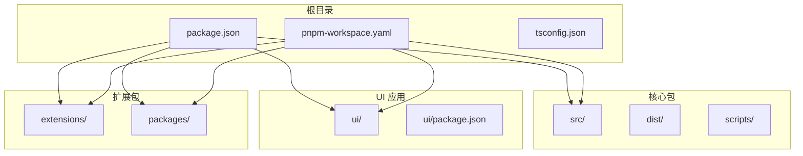
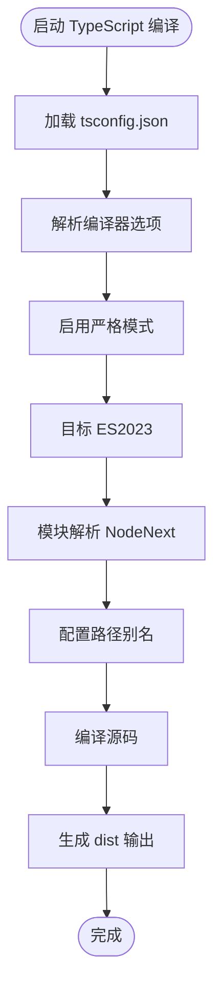
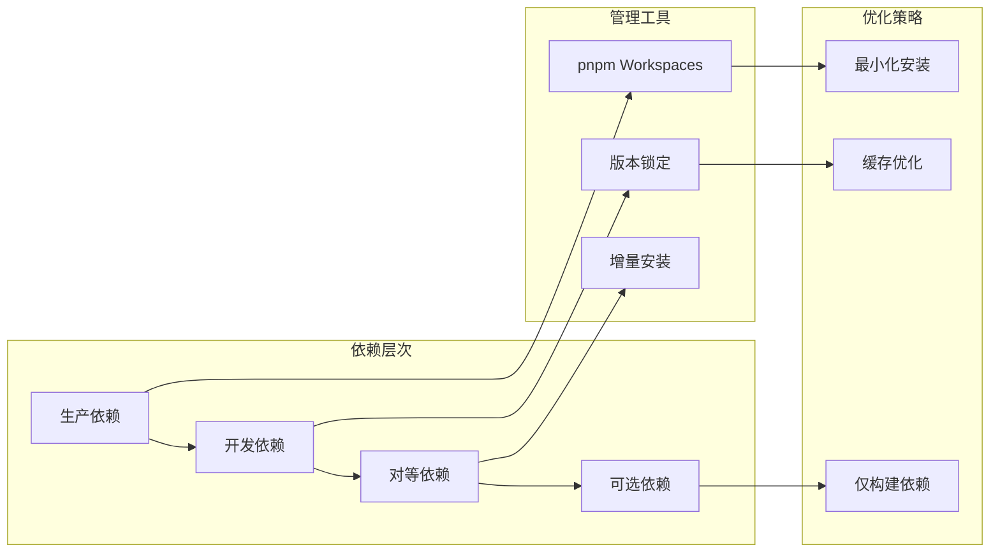
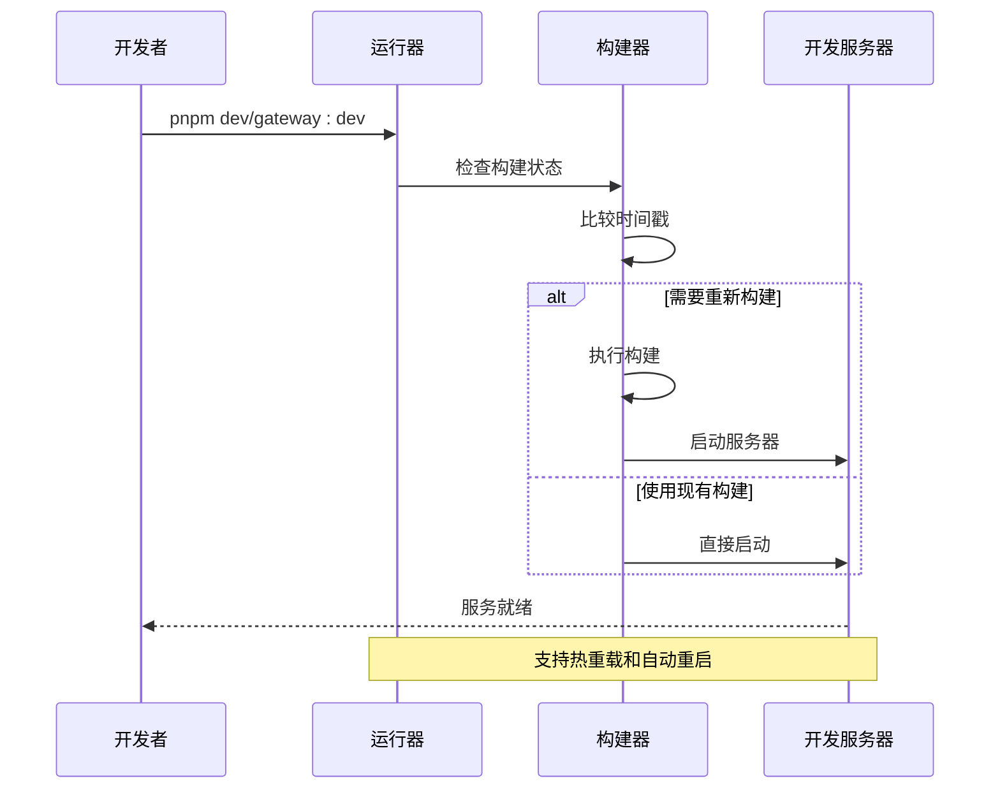
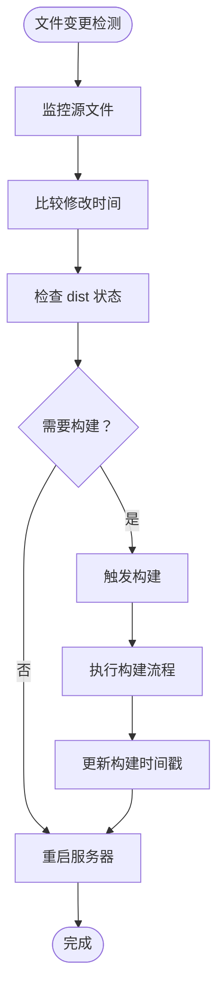

# 开发环境搭建

<cite>
**本文档引用的文件**
- [package.json](file://package.json)
- [pnpm-workspace.yaml](file://pnpm-workspace.yaml)
- [README.md](file://README.md)
- [tsconfig.json](file://tsconfig.json)
- [vitest.config.ts](file://vitest.config.ts)
- [scripts/run-node.mjs](file://scripts/run-node.mjs)
- [scripts/watch-node.mjs](file://scripts/watch-node.mjs)
- [.vscode/settings.json](file://.vscode/settings.json)
- [.vscode/launch.json](file://.vscode/launch.json)
- [.vscode/tasks.json](file://.vscode/tasks.json)
- [.github/workflows/ci.yml](file://.github/workflows/ci.yml)
- [Dockerfile](file://Dockerfile)
</cite>

## 目录

1. [简介](#简介)
2. [系统要求](#系统要求)
3. [安装步骤](#安装步骤)
4. [工作区配置](#工作区配置)
5. [依赖管理](#依赖管理)
6. [环境变量设置](#环境变量设置)
7. [开发工具推荐](#开发工具推荐)
8. [本地开发服务器](#本地开发服务器)
9. [热重载配置](#热重载配置)
10. [开发模式调试技巧](#开发模式调试技巧)
11. [常见问题与故障排除](#常见问题与故障排除)
12. [性能考虑](#性能考虑)
13. [结论](#结论)

## 简介

OpenClaw 是一个个人 AI 助手平台，支持多渠道消息集成和可扩展的消息通道。本指南将帮助您搭建完整的开发环境，包括系统要求、安装步骤、工作区配置、依赖管理、环境变量设置、开发工具推荐以及常见问题的解决方案。

## 系统要求

根据项目配置和文档要求，OpenClaw 的开发环境需要以下最低系统要求：

### 运行时要求

- **Node.js**: 版本 ≥ 22.12.0（项目明确要求）
- **包管理器**: pnpm 版本 10.23.0（在 package.json 中指定）
- **Git**: 版本 ≥ 2.0（用于版本控制）

### 开发环境要求

- **操作系统**: macOS、Linux 或 Windows（WSL2 推荐）
- **内存**: 至少 8GB RAM（建议 16GB+）
- **存储空间**: 至少 20GB 可用空间
- **编译工具链**:
  - macOS: Xcode Command Line Tools
  - Linux: build-essential、python3
  - Windows: Visual Studio Build Tools

### 开发工具要求

- **代码编辑器**: VS Code（推荐）
- **Node.js 调试工具**: Node Inspector
- **Git 客户端**: 命令行或图形界面工具

**章节来源**

- [package.json](file://package.json#L236-L239)
- [README.md](file://README.md#L52-L59)

## 安装步骤

### 第一步：系统准备

1. **安装 Node.js**

   ```bash
   # 检查 Node.js 版本
   node --version

   # 如果版本过低，从官网下载安装
   # https://nodejs.org/
   ```

2. **安装 pnpm**

   ```bash
   # 全局安装 pnpm
   npm install -g pnpm@10.23.0

   # 验证安装
   pnpm --version
   ```

3. **安装 Git**

   ```bash
   # macOS
   brew install git

   # Ubuntu/Debian
   sudo apt update && sudo apt install git

   # Windows
   winget install Git.Git
   ```

### 第二步：获取源码

```bash
# 克隆仓库
git clone https://github.com/openclaw/openclaw.git
cd openclaw

# 验证 Git 版本
git --version
```

### 第三步：安装依赖

```bash
# 使用 pnpm 安装所有依赖
pnpm install

# 首次安装可能需要较长时间
# 确保网络连接稳定
```

### 第四步：构建项目

```bash
# 构建 UI 依赖（首次运行时自动安装）
pnpm ui:build

# 构建主项目
pnpm build

# 验证构建结果
ls -la dist/
```

### 第五步：验证安装

```bash
# 运行基本检查
pnpm check

# 运行单元测试
pnpm test:fast

# 启动开发服务器
pnpm dev
```

**章节来源**

- [README.md](file://README.md#L96-L111)
- [package.json](file://package.json#L49-L150)

## 工作区配置

### Monorepo 结构

OpenClaw 采用 pnpm Workspaces 的 monorepo 结构：



**图表来源**

- [pnpm-workspace.yaml](file://pnpm-workspace.yaml#L1-L6)
- [package.json](file://package.json#L1-L50)

### TypeScript 配置

项目使用严格的 TypeScript 配置：



**图表来源**

- [tsconfig.json](file://tsconfig.json#L1-L29)

**章节来源**

- [pnpm-workspace.yaml](file://pnpm-workspace.yaml#L1-L17)
- [tsconfig.json](file://tsconfig.json#L1-L29)

## 依赖管理

### 依赖类型

OpenClaw 的依赖分为以下几类：

1. **生产依赖** (`dependencies`): 运行时必需的库
2. **开发依赖** (`devDependencies`): 开发和构建工具
3. **对等依赖** (`peerDependencies`): 由宿主环境提供的可选依赖
4. **可选依赖** (`optionalDependencies`): 条件安装的特性组件

### 依赖管理策略



**图表来源**

- [package.json](file://package.json#L151-L236)
- [pnpm-workspace.yaml](file://pnpm-workspace.yaml#L7-L17)

### 依赖安装优化

项目使用了多种依赖管理优化技术：

1. **仅构建依赖** (`onlyBuiltDependencies`): 减少不必要的二进制包安装
2. **覆盖规则** (`overrides`): 解决依赖冲突和安全问题
3. **增量安装**: 利用 pnpm 的硬链接机制提高安装速度

**章节来源**

- [package.json](file://package.json#L240-L266)
- [pnpm-workspace.yaml](file://pnpm-workspace.yaml#L7-L17)

## 环境变量设置

### 核心环境变量

OpenClaw 支持多种环境变量来配置不同的运行模式：

| 环境变量               | 默认值        | 描述       | 用途              |
| ---------------------- | ------------- | ---------- | ----------------- |
| `NODE_ENV`             | `development` | 运行环境   | 开发/生产模式切换 |
| `OPENCLAW_WATCH_MODE`  | `0`           | 观察者模式 | 启用文件监控      |
| `OPENCLAW_FORCE_BUILD` | `0`           | 强制构建   | 跳过构建缓存      |
| `OPENCLAW_RUNNER_LOG`  | `1`           | 运行器日志 | 控制日志输出      |
| `OPENCLAW_PROFILE`     | `dev`         | 性能分析   | 开发性能分析      |

### 开发环境变量

```bash
# 开启详细日志
export OPENCLAW_RUNNER_LOG=1

# 强制重新构建
export OPENCLAW_FORCE_BUILD=1

# 启用观察者模式
export OPENCLAW_WATCH_MODE=1

# 设置开发配置文件
export OPENCLAW_CONFIG_FILE=".openclaw.dev.json"
```

### 测试环境变量

```bash
# 配置测试资源
export OPENCLAW_TEST_WORKERS=2
export OPENCLAW_TEST_MAX_OLD_SPACE_SIZE_MB=6144

# 配置覆盖率报告
export OPENCLAW_VITEST_REPORT_DIR="/tmp/vitest-reports"
```

**章节来源**

- [scripts/run-node.mjs](file://scripts/run-node.mjs#L172-L208)
- [scripts/watch-node.mjs](file://scripts/watch-node.mjs#L26-L33)

## 开发工具推荐

### VS Code 配置

项目提供了完整的 VS Code 开发配置：

#### 设置配置

```json
{
  "editor.formatOnSave": true,
  "editor.tabSize": 2,
  "typescript.validate.enable": false,
  "oxc.lint.enable": true,
  "oxc.format.enable": true
}
```

#### 调试配置

```json
{
  "configurations": [
    {
      "name": "Debug CLI",
      "type": "node",
      "request": "launch",
      "runtimeExecutable": "pnpm",
      "runtimeArgs": ["openclaw"],
      "args": ["${input:cliArgs}"]
    },
    {
      "name": "Debug Gateway",
      "type": "node",
      "request": "launch",
      "runtimeExecutable": "pnpm",
      "runtimeArgs": ["gateway:dev"]
    }
  ]
}
```

#### 任务配置

```json
{
  "tasks": [
    {
      "label": "Dev Server",
      "type": "shell",
      "command": "pnpm dev",
      "isBackground": true
    },
    {
      "label": "Gateway Dev",
      "type": "shell",
      "command": "pnpm gateway:dev",
      "isBackground": true
    }
  ]
}
```

### 推荐 VS Code 扩展

1. **oxc.oxc-vscode**: 高性能的 TypeScript/JavaScript 格式化和代码检查
2. **ms-vscode.vscode-typescript-next**: 最新的 TypeScript 和 JavaScript 支持
3. **ms-vscode.vscode-json**: JSON 文件格式化和验证
4. **ms-vscode.vscode-markdownlint**: Markdown 文件质量检查

**章节来源**

- [.vscode/settings.json](file://.vscode/settings.json#L1-L86)
- [.vscode/launch.json](file://.vscode/launch.json#L1-L61)
- [.vscode/tasks.json](file://.vscode/tasks.json#L1-L103)

## 本地开发服务器

### 开发服务器架构

OpenClaw 提供了多种开发服务器模式：



**图表来源**

- [scripts/run-node.mjs](file://scripts/run-node.mjs#L130-L170)
- [scripts/run-node.mjs](file://scripts/run-node.mjs#L229-L254)

### 启动开发服务器

```bash
# 启动通用开发服务器
pnpm dev

# 启动网关开发模式
pnpm gateway:dev

# 启动网关并重置状态
pnpm gateway:dev:reset

# 启动 TUI 开发模式
pnpm tui:dev

# 启动 UI 开发模式
pnpm ui:dev
```

### 服务器配置选项

| 选项      | 默认值 | 描述           |
| --------- | ------ | -------------- |
| `--dev`   | 无     | 开发模式标志   |
| `--reset` | 无     | 重置服务器状态 |
| `--force` | 无     | 强制重新构建   |
| `--watch` | 无     | 启用文件监控   |

**章节来源**

- [scripts/run-node.mjs](file://scripts/run-node.mjs#L210-L254)
- [package.json](file://package.json#L70-L114)

## 热重载配置

### 热重载机制

OpenClaw 实现了智能的热重载系统：



**图表来源**

- [scripts/run-node.mjs](file://scripts/run-node.mjs#L130-L170)
- [scripts/run-node.mjs](file://scripts/run-node.mjs#L229-L254)

### 监控的文件路径

开发服务器监控以下关键路径：

1. `src/` - 主要源代码目录
2. `tsconfig.json` - TypeScript 配置文件
3. `package.json` - 项目配置文件

### 构建触发条件

当满足以下任一条件时会触发重新构建：

1. **强制构建**: `OPENCLAW_FORCE_BUILD=1`
2. **配置变更**: tsconfig.json 或 package.json 修改
3. **源码变更**: 源文件最后修改时间晚于构建时间戳
4. **Git 头变更**: Git HEAD 指向发生变化
5. **脏工作树**: 存在未提交的更改

**章节来源**

- [scripts/run-node.mjs](file://scripts/run-node.mjs#L11-L31)
- [scripts/run-node.mjs](file://scripts/run-node.mjs#L130-L170)

## 开发模式调试技巧

### 调试配置

OpenClaw 提供了多种调试场景的配置：

#### CLI 调试

```json
{
  "name": "Debug CLI",
  "type": "node",
  "request": "launch",
  "runtimeExecutable": "pnpm",
  "runtimeArgs": ["openclaw"],
  "args": ["--help"],
  "console": "integratedTerminal"
}
```

#### 网关调试

```json
{
  "name": "Debug Gateway",
  "type": "node",
  "request": "launch",
  "runtimeExecutable": "pnpm",
  "runtimeArgs": ["gateway:dev"],
  "console": "integratedTerminal",
  "skipFiles": ["<node_internals>/**"]
}
```

#### 当前测试文件调试

```json
{
  "name": "Debug Current Test File",
  "type": "node",
  "request": "launch",
  "runtimeExecutable": "pnpm",
  "runtimeArgs": ["exec", "vitest", "run", "${relativeFile}"]
}
```

### 调试技巧

1. **断点设置**: 在 TypeScript 文件中直接设置断点
2. **变量监视**: 使用调试控制台监视变量值
3. **调用栈**: 查看函数调用链和参数
4. **条件断点**: 为特定条件设置断点

### 性能分析

```bash
# 启用性能分析
export OPENCLAW_PROFILE=dev

# 分析网关性能
pnpm gateway:dev

# 分析 CLI 性能
pnpm openclaw --profile
```

**章节来源**

- [.vscode/launch.json](file://.vscode/launch.json#L1-L61)
- [scripts/run-node.mjs](file://scripts/run-node.mjs#L172-L178)

## 常见问题与故障排除

### 依赖安装问题

#### 问题：pnpm 安装失败

```bash
# 清理缓存
pnpm store prune

# 重新安装
pnpm install --frozen-lockfile

# 检查网络连接
pnpm config get registry
```

#### 问题：权限错误

```bash
# macOS/Linux
sudo chown -R $(whoami) ~/.pnpm

# Windows
# 以管理员身份运行 PowerShell
```

### 构建问题

#### 问题：TypeScript 编译错误

```bash
# 检查 TypeScript 版本
tsc --version

# 清理构建缓存
rm -rf dist/

# 重新构建
pnpm build
```

#### 问题：内存不足

```bash
# 增加 Node.js 内存限制
export NODE_OPTIONS="--max-old-space-size=8192"

# 在 CI 环境中
export OPENCLAW_TEST_MAX_OLD_SPACE_SIZE_MB=6144
```

### 开发服务器问题

#### 问题：端口被占用

```bash
# 检查端口使用情况
lsof -i :18789

# 杀死占用进程
kill -9 $(lsof -t -i :18789)

# 或者使用其他端口
pnpm gateway:dev --port 18790
```

#### 问题：热重载不工作

```bash
# 清理构建缓存
rm -f dist/.buildstamp

# 重新启动开发服务器
pnpm dev

# 检查文件权限
chmod -R 755 src/
```

### 测试问题

#### 问题：测试超时

```bash
# 增加测试超时时间
export TEST_TIMEOUT=300000

# 配置 Vitest
pnpm test:watch
```

#### 问题：覆盖率报告缺失

```bash
# 重新生成覆盖率报告
pnpm test:coverage

# 检查覆盖率阈值
# 在 vitest.config.ts 中调整阈值
```

### 环境变量问题

#### 问题：环境变量未生效

```bash
# 检查当前环境变量
env | grep OPENCLAW

# 在当前会话中设置
export OPENCLAW_DEBUG=1

# 在新终端中设置
echo 'export OPENCLAW_DEBUG=1' >> ~/.bashrc
source ~/.bashrc
```

**章节来源**

- [scripts/run-node.mjs](file://scripts/run-node.mjs#L172-L208)
- [vitest.config.ts](file://vitest.config.ts#L26-L55)

## 性能考虑

### 构建性能优化

OpenClaw 采用了多种构建性能优化策略：

1. **增量构建**: 只重新构建修改过的文件
2. **并行处理**: 利用多核 CPU 并行编译
3. **缓存机制**: 缓存编译结果和依赖
4. **智能监控**: 只监控必要的文件路径

### 运行时性能优化


### 性能监控

```bash
# 启用性能分析
export OPENCLAW_PROFILE=dev

# 监控内存使用
node --inspect-brk=9229 openclaw.mjs

# 分析构建性能
pnpm build --profile
```

### 资源使用建议

1. **内存**: 建议至少 8GB RAM，16GB 更佳
2. **CPU**: 多核处理器，至少 4 核
3. **存储**: SSD 硬盘，至少 20GB 可用空间
4. **网络**: 稳定的互联网连接

## 结论

通过本指南，您应该已经成功搭建了 OpenClaw 的开发环境。OpenClaw 提供了现代化的开发体验，包括：

1. **完整的 TypeScript 支持**: 严格的类型检查和智能代码补全
2. **高效的构建系统**: 基于 pnpm 的快速依赖管理和增量构建
3. **智能热重载**: 自动检测文件变更并重新启动服务
4. **强大的调试工具**: VS Code 集成的调试配置和性能分析
5. **灵活的配置选项**: 丰富的环境变量和命令行参数

建议您在开发过程中：

- 定期运行 `pnpm check` 进行代码质量检查
- 使用 `pnpm test` 运行单元测试
- 利用 VS Code 的调试功能进行问题排查
- 关注性能指标，及时优化代码

如遇任何问题，请参考故障排除部分或查阅项目的官方文档。祝您开发顺利！
