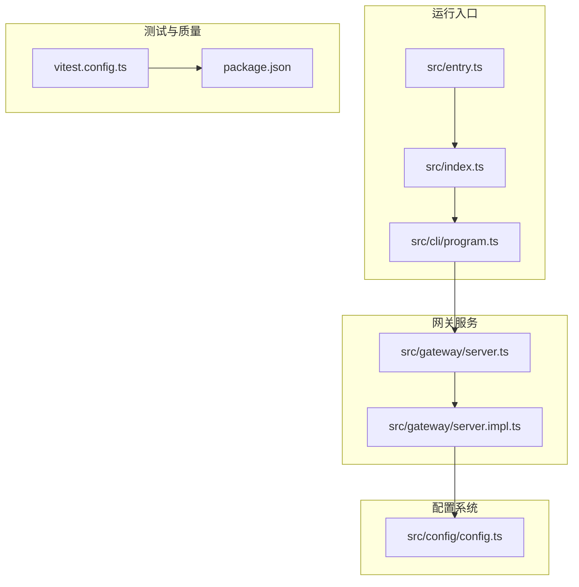
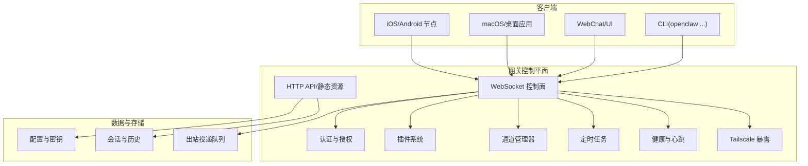
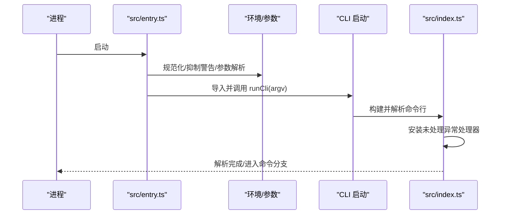
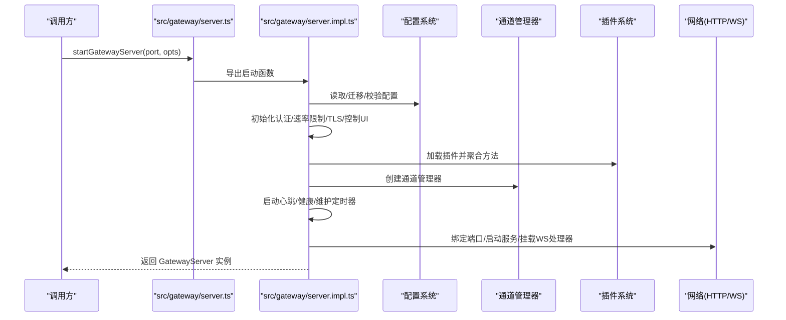
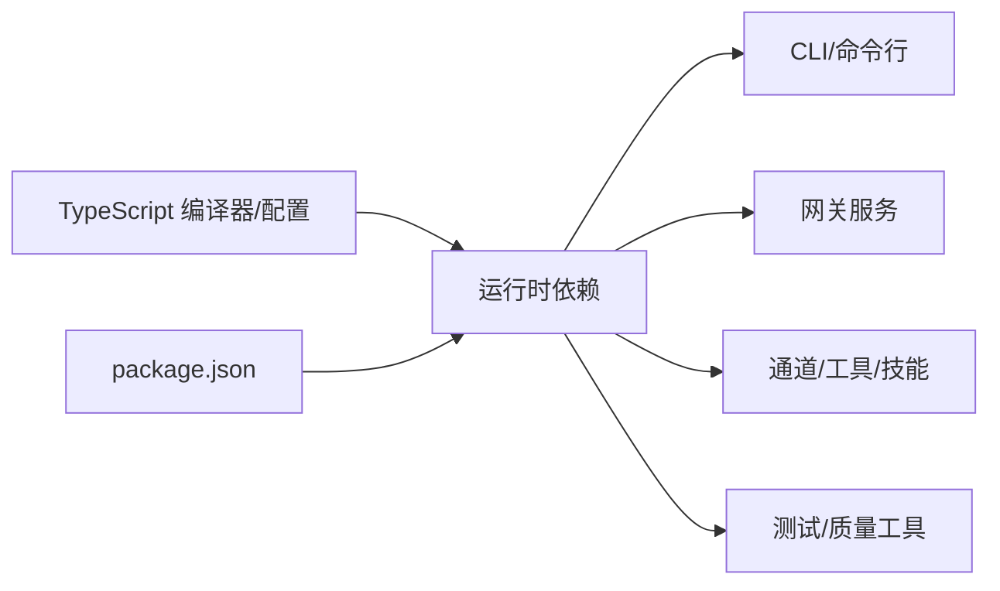

# 开发者指南

<cite>
**本文引用的文件**
- [README.md](file://README.md)
- [CONTRIBUTING.md](file://CONTRIBUTING.md)
- [package.json](file://package.json)
- [tsconfig.json](file://tsconfig.json)
- [vitest.config.ts](file://vitest.config.ts)
- [src/index.ts](file://src/index.ts)
- [src/entry.ts](file://src/entry.ts)
- [src/runtime.ts](file://src/runtime.ts)
- [src/gateway/server.ts](file://src/gateway/server.ts)
- [src/gateway/server.impl.ts](file://src/gateway/server.impl.ts)
- [src/cli/program.ts](file://src/cli/program.ts)
- [src/config/config.ts](file://src/config/config.ts)
</cite>

## 目录

1. [简介](#简介)
2. [项目结构](#项目结构)
3. [核心组件](#核心组件)
4. [架构总览](#架构总览)
5. [详细组件分析](#详细组件分析)
6. [依赖分析](#依赖分析)
7. [性能考虑](#性能考虑)
8. [故障排查指南](#故障排查指南)
9. [结论](#结论)
10. [附录](#附录)

## 简介

本指南面向希望参与 OpenClaw 开发与贡献的工程师，覆盖从开发环境搭建、代码结构理解、开发与贡献流程，到架构设计、模块划分、依赖关系、代码风格、测试策略、质量保障、调试与性能分析、问题定位，以及新功能开发、Bug 修复与文档更新的完整工作流。目标是帮助你快速融入项目并高效产出。

## 项目结构

OpenClaw 是一个以 TypeScript/JavaScript 为主的多平台个人 AI 助手系统，核心由“网关（Gateway）控制平面”“多通道接入层（Channels）”“工具与技能平台（Tools/Skills）”“节点与桌面应用（Nodes/Apps）”等组成。仓库采用 monorepo 结构，根目录通过脚本与配置驱动构建、测试、打包与发布。

- 核心运行入口与 CLI：src/index.ts、src/entry.ts、src/cli/program.ts
- 网关服务：src/gateway/server.ts、src/gateway/server.impl.ts
- 配置系统：src/config/config.ts 及其子模块
- 测试与质量：vitest.config.ts、package.json 中的测试与检查脚本
- 构建与打包：package.json 的 scripts、tsdown、插件 SDK 类型导出
- 文档与贡献：README.md、CONTRIBUTING.md

图表来源

- [src/entry.ts](file://src/entry.ts#L1-L144)
- [src/index.ts](file://src/index.ts#L1-L94)
- [src/cli/program.ts](file://src/cli/program.ts#L1-L3)
- [src/gateway/server.ts](file://src/gateway/server.ts#L1-L4)
- [src/gateway/server.impl.ts](file://src/gateway/server.impl.ts#L1-L800)
- [src/config/config.ts](file://src/config/config.ts#L1-L25)
- [vitest.config.ts](file://vitest.config.ts#L1-L158)
- [package.json](file://package.json#L1-L268)

章节来源

- [README.md](file://README.md#L1-L556)
- [package.json](file://package.json#L1-L268)

## 核心组件

- CLI 入口与运行时
  - 运行入口：src/entry.ts 负责环境规范化、实验性警告抑制、参数解析与 CLI 启动；src/index.ts 提供公共导出与全局错误处理。
  - 运行时封装：src/runtime.ts 定义统一的日志与退出接口，便于在不同上下文（如测试）中替换行为。
- 网关服务
  - 接口导出：src/gateway/server.ts 暴露启动函数与类型定义。
  - 实现细节：src/gateway/server.impl.ts 负责配置加载、认证与速率限制、插件注册、通道管理、心跳与健康监控、Tailscale 暴露、Canvas 主机、HTTP/WS 服务等。
- 配置系统
  - 统一入口：src/config/config.ts 导出读取、写入、校验、迁移与缓存相关能力。
- 测试与质量
  - 测试框架：vitest.config.ts 定义测试范围、覆盖率阈值、排除规则、并发策略与别名映射。
  - 脚本与检查：package.json 提供格式化、静态检查、单元测试、端到端测试、Docker 场景测试、UI 测试、协议生成与校验等脚本。

章节来源

- [src/entry.ts](file://src/entry.ts#L1-L144)
- [src/index.ts](file://src/index.ts#L1-L94)
- [src/runtime.ts](file://src/runtime.ts#L1-L54)
- [src/gateway/server.ts](file://src/gateway/server.ts#L1-L4)
- [src/gateway/server.impl.ts](file://src/gateway/server.impl.ts#L1-L800)
- [src/config/config.ts](file://src/config/config.ts#L1-L25)
- [vitest.config.ts](file://vitest.config.ts#L1-L158)
- [package.json](file://package.json#L1-L268)

## 架构总览

OpenClaw 的核心是“网关控制平面”，它通过 WebSocket 与 HTTP 提供统一的控制面，承载会话、通道、工具、事件与安全策略。客户端（CLI、WebChat、桌面应用、移动节点）通过该控制面进行交互。通道层负责与各 IM 平台对接，工具与技能平台提供可扩展的能力集合。

图表来源

- [src/gateway/server.impl.ts](file://src/gateway/server.impl.ts#L1-L800)
- [README.md](file://README.md#L185-L238)

章节来源

- [README.md](file://README.md#L185-L238)
- [src/gateway/server.impl.ts](file://src/gateway/server.impl.ts#L1-L800)

## 详细组件分析

### CLI 入口与运行时

- src/entry.ts
  - 职责：环境规范化、实验性警告抑制（通过重启进程注入参数）、参数解析与 CLI 启动；避免重复启动与副作用。
  - 关键点：通过 isMainModule 保护入口逻辑；对 --no-color、NODE_OPTIONS 做兼容；必要时重启自身以抑制实验性警告。
- src/index.ts
  - 职责：加载 .env、标准化环境变量、确保 CLI 在 PATH 中、捕获控制台输出、安装未处理异常处理器、构建并解析命令行。
  - 关键点：导出常用工具函数（配置、会话、通道、执行、等待等），作为 CLI 与内部模块的桥接。
- src/runtime.ts
  - 职责：统一日志与退出接口；在测试环境下可禁用或替换日志输出；提供非退出式运行时以支持测试断言。

图表来源

- [src/entry.ts](file://src/entry.ts#L1-L144)
- [src/index.ts](file://src/index.ts#L1-L94)

章节来源

- [src/entry.ts](file://src/entry.ts#L1-L144)
- [src/index.ts](file://src/index.ts#L1-L94)
- [src/runtime.ts](file://src/runtime.ts#L1-L54)

### 网关服务启动流程

- src/gateway/server.ts
  - 职责：对外暴露启动函数与类型，隐藏实现细节。
- src/gateway/server.impl.ts
  - 职责：完整的网关启动流程，包括：
    - 配置快照读取与迁移、合法性校验、自动启用插件
    - 启动认证与速率限制、TLS、控制 UI 资源、Canvas 主机
    - 插件注册与方法聚合、通道管理器初始化
    - 心跳与健康监控、维护定时器、出站投递恢复
    - WebSocket/HTTP 服务绑定、事件广播、Tailscale 暴露
    - 更新检测、远程节点技能缓存预热与刷新

图表来源

- [src/gateway/server.ts](file://src/gateway/server.ts#L1-L4)
- [src/gateway/server.impl.ts](file://src/gateway/server.impl.ts#L1-L800)

章节来源

- [src/gateway/server.ts](file://src/gateway/server.ts#L1-L4)
- [src/gateway/server.impl.ts](file://src/gateway/server.impl.ts#L1-L800)

### 配置系统

- src/config/config.ts
  - 职责：统一导出配置读取、写入、校验、迁移、缓存与路径解析等能力，屏蔽底层实现差异。
- 关键能力
  - 读取与快照：readConfigFileSnapshot、getRuntimeConfigSnapshot
  - 写入与迁移：writeConfigFile、migrateLegacyConfig
  - 校验：validateConfigObject、validateConfigObjectWithPlugins
  - 运行时覆盖：runtime overrides、路径解析

章节来源

- [src/config/config.ts](file://src/config/config.ts#L1-L25)

### 测试与质量

- vitest.config.ts
  - 测试范围：src/**/\*.test.ts、extensions/**/\*.test.ts、部分 UI 测试文件
  - 排除策略：排除 apps、extensions、ui、test、CLI/入口等非核心包
  - 覆盖率：按仓库根 src/ 计算，设置行/函数/分支/语句阈值
  - 并发：根据 CI/本地 CPU 数量动态调整 worker 数
- package.json
  - 脚本：格式化、lint、构建、测试、端到端测试、Docker 场景测试、UI 测试、协议生成与校验、打包等
  - 依赖：Node >= 22，pnpm，各类运行时与测试依赖

章节来源

- [vitest.config.ts](file://vitest.config.ts#L1-L158)
- [package.json](file://package.json#L1-L268)

## 依赖分析

- 运行时与工具链
  - Node 版本要求：>= 22.12.0
  - 包管理：pnpm（版本 10.23.0）
  - TypeScript：严格模式、NodeNext 模块解析、装饰器兼容配置
- 关键运行时依赖
  - WebSocket、HTTP 服务器、CLI 参数解析、模型与工具适配、通道 SDK、浏览器控制、Canvas/A2UI、定时任务、日志与诊断、密钥与安全、Docker 与沙箱等
- 开发与测试依赖
  - Vitest、oxlint、oxfmt、tsdown、tsx、Lit、信号与上下文等

图表来源

- [package.json](file://package.json#L151-L267)
- [tsconfig.json](file://tsconfig.json#L1-L29)

章节来源

- [package.json](file://package.json#L1-L268)
- [tsconfig.json](file://tsconfig.json#L1-L29)

## 性能考虑

- 单元测试覆盖率门槛与排除策略
  - 通过 vitest.config.ts 的覆盖率阈值与排除列表，确保核心逻辑被验证，同时避免过度统计外部集成面。
- 并发与资源
  - 测试并发基于 CPU 核数动态调整；生产环境的心跳、健康与维护定时器按配置运行，避免过载。
- 日志与诊断
  - 结构化日志与诊断事件可辅助定位瓶颈；在测试中可通过环境变量控制日志输出。
- 端口与绑定
  - 网关启动前进行端口可用性检查与归属描述，避免冲突导致的启动失败与重试开销。

章节来源

- [vitest.config.ts](file://vitest.config.ts#L56-L155)
- [src/gateway/server.impl.ts](file://src/gateway/server.impl.ts#L1-L800)

## 故障排查指南

- 常见问题定位步骤
  - 环境与运行时：确认 Node 版本满足要求；检查 .env 与环境变量是否正确；查看 CLI 启动日志与错误栈。
  - 配置与密钥：使用 doctor 命令检查配置合法性；核对密钥与认证令牌；关注密钥重载状态事件。
  - 网络与端口：确认端口占用与归属；检查防火墙与 Tailscale 暴露配置；验证 TLS 证书与指纹。
  - 通道与消息：检查通道健康监控与重连策略；核对允许列表与 DM 策略；查看出站投递队列恢复日志。
  - 插件与方法：确认插件已加载且方法聚合正确；检查插件钩子与事件广播。
- 调试技巧
  - 使用 --no-color 与日志级别控制输出；在测试中启用结构化日志；利用诊断事件与心跳事件定位异常。
  - 对于 UI/前端问题，参考 CONTRIBUTE 中关于装饰器与构建工具的说明，避免标准装饰器与现有构建工具链冲突。

章节来源

- [README.md](file://README.md#L442-L481)
- [src/gateway/server.impl.ts](file://src/gateway/server.impl.ts#L1-L800)
- [CONTRIBUTING.md](file://CONTRIBUTING.md#L76-L89)

## 结论

OpenClaw 以“网关控制平面”为核心，结合多通道接入、工具与技能平台、节点与桌面应用，形成统一的个人 AI 助手体系。开发者应从 CLI 入口与运行时、网关服务启动流程、配置系统与测试质量四个方面入手，理解整体架构与关键模块职责，再深入到具体子系统（通道、插件、工具、安全）进行扩展与优化。遵循本文的开发流程、代码风格与质量保障实践，可显著提升贡献效率与代码质量。

## 附录

### 开发环境搭建

- 运行时与包管理
  - Node 版本：>= 22.12.0
  - 包管理器：pnpm（建议使用推荐版本）
- 克隆与安装
  - git clone 仓库后，执行 pnpm install
  - UI 依赖首次构建时自动安装
- 构建与运行
  - pnpm build 生成 dist
  - pnpm openclaw onboard 安装守护进程
  - pnpm gateway:watch 开启开发监听（TS 变更自动重载）

章节来源

- [README.md](file://README.md#L92-L111)
- [package.json](file://package.json#L49-L149)

### 代码风格与提交规范

- 格式化与静态检查
  - 使用 oxfmt（格式化）与 oxlint（lint）；Swift 使用 swiftformat/swiftlint
  - 文档使用 markdownlint-cli2
- 装饰器与 UI
  - Control UI 使用传统装饰器语法（legacy decorators），避免切换至标准装饰器除非同步更新构建工具链
- 提交与 PR
  - 保持 PR 聚焦单一主题；描述“做了什么/为什么做”
  - 本地先通过 pnpm build && pnpm check && pnpm test
  - AI/ vibe 编码 PR 需标注并说明测试程度与提示/会话记录

章节来源

- [CONTRIBUTING.md](file://CONTRIBUTING.md#L62-L103)
- [CONTRIBUTING.md](file://CONTRIBUTING.md#L76-L89)
- [package.json](file://package.json#L77-L101)

### 测试策略与质量保证

- 单元测试
  - 使用 Vitest，按 src/ 计算覆盖率，设置行/函数/分支/语句阈值
  - 排除 apps、extensions、ui、test、CLI/入口等非核心包
- 端到端与集成测试
  - 提供 e2e、live、Docker 场景测试脚本，覆盖安装、网关网络、插件、医生切换等
- 质量门禁
  - pnpm check 聚合格式化、lint、临时检查、主机环境策略 Swift 生成校验
  - pnpm test:all 覆盖 lint、build、unit、e2e、live、docker 全链路

章节来源

- [vitest.config.ts](file://vitest.config.ts#L1-L158)
- [package.json](file://package.json#L58-L149)

### 新功能开发流程

- 设计与讨论
  - 复杂特性先在 GitHub Discussions 或 Discord 讨论，获得共识后再实现
- 分支与提交
  - 基于 main 分支创建功能分支；提交信息清晰描述变更与动机
- 实现与测试
  - 补充单元测试与集成测试；在本地与 CI 上运行 pnpm test
- 文档与发布
  - 更新相关文档与变更日志；遵循版本与发布流程

章节来源

- [CONTRIBUTING.md](file://CONTRIBUTING.md#L64-L66)

### Bug 修复流程

- 复现与定位
  - 使用最小复现步骤；开启诊断事件与结构化日志
- 修复与回归
  - 编写针对性测试；在 e2e/live/docker 场景验证
- 提交与评审
  - 保持 PR 聚焦；附带测试与说明

章节来源

- [README.md](file://README.md#L442-L481)
- [CONTRIBUTING.md](file://CONTRIBUTING.md#L68-L75)

### 文档更新流程

- 文档检查
  - 使用 pnpm check:docs 执行文档格式化、lint 与链接审计
- 发布与校对
  - 通过 docs CI 检查；修正拼写与链接问题

章节来源

- [package.json](file://package.json#L71-L77)
- [package.json](file://package.json#L76-L77)
