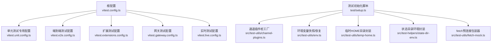
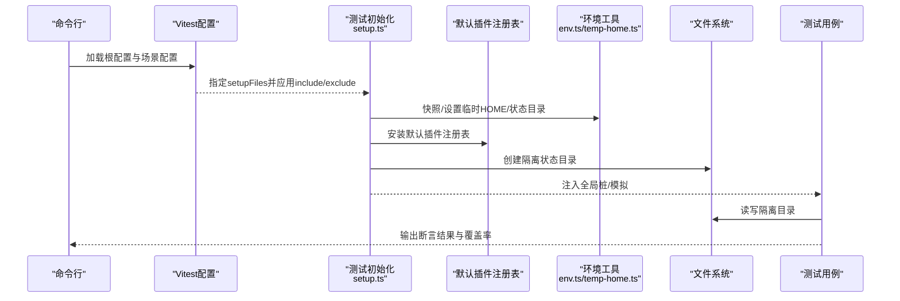
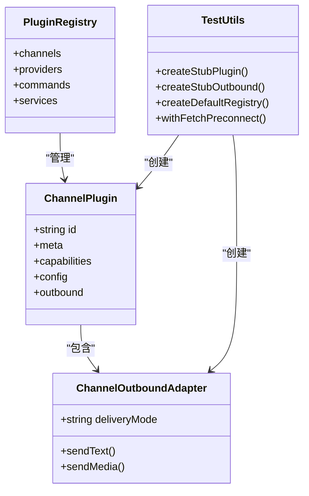
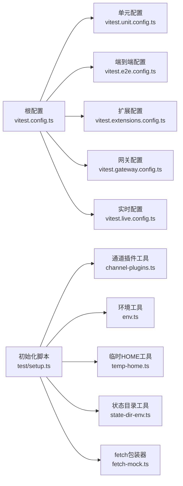

# 单元测试实践

<cite>
**本文引用的文件**
- [vitest.config.ts](file://vitest.config.ts)
- [vitest.unit.config.ts](file://vitest.unit.config.ts)
- [vitest.e2e.config.ts](file://vitest.e2e.config.ts)
- [vitest.extensions.config.ts](file://vitest.extensions.config.ts)
- [vitest.gateway.config.ts](file://vitest.gateway.config.ts)
- [vitest.live.config.ts](file://vitest.live.config.ts)
- [test/setup.ts](file://test/setup.ts)
- [src/test-helpers/state-dir-env.ts](file://src/test-helpers/state-dir-env.ts)
- [src/test-utils/env.ts](file://src/test-utils/env.ts)
- [src/test-utils/temp-home.ts](file://src/test-utils/temp-home.ts)
- [src/test-utils/fetch-mock.ts](file://src/test-utils/fetch-mock.ts)
- [src/test-utils/channel-plugins.ts](file://src/test-utils/channel-plugins.ts)
</cite>

## 目录

1. [引言](#引言)
2. [项目结构](#项目结构)
3. [核心组件](#核心组件)
4. [架构总览](#架构总览)
5. [详细组件分析](#详细组件分析)
6. [依赖分析](#依赖分析)
7. [性能考虑](#性能考虑)
8. [故障排查指南](#故障排查指南)
9. [结论](#结论)
10. [附录](#附录)

## 引言

本指南面向OpenClaw项目的开发者与贡献者，系统化阐述单元测试的实践方法，涵盖Vitest配置参数、测试环境设置、模拟对象（Mock）与桩（Stub）的使用、断言模式、异步测试处理、测试用例组织、测试数据准备、测试工具函数、覆盖率与性能基准、测试隔离策略，以及环境变量模拟、全局对象Stub、文件系统操作Mock等关键主题。目标是帮助团队在保证质量的同时提升测试效率与可维护性。

## 项目结构

OpenClaw采用多包/多模块的Monorepo结构，测试配置通过多个Vitest配置文件分别覆盖不同场景：通用配置、单元测试、端到端测试、扩展测试、网关测试、实时测试。测试初始化脚本统一在setup中完成，确保跨文件/进程的隔离与稳定性。

图表来源

- [vitest.config.ts](file://vitest.config.ts#L1-L158)
- [vitest.unit.config.ts](file://vitest.unit.config.ts#L1-L19)
- [vitest.e2e.config.ts](file://vitest.e2e.config.ts#L1-L31)
- [vitest.extensions.config.ts](file://vitest.extensions.config.ts#L1-L16)
- [vitest.gateway.config.ts](file://vitest.gateway.config.ts#L1-L16)
- [vitest.live.config.ts](file://vitest.live.config.ts#L1-L17)
- [test/setup.ts](file://test/setup.ts#L1-L190)
- [src/test-utils/channel-plugins.ts](file://src/test-utils/channel-plugins.ts#L1-L106)
- [src/test-utils/env.ts](file://src/test-utils/env.ts#L1-L73)
- [src/test-utils/temp-home.ts](file://src/test-utils/temp-home.ts#L1-L44)
- [src/test-helpers/state-dir-env.ts](file://src/test-helpers/state-dir-env.ts#L1-L35)
- [src/test-utils/fetch-mock.ts](file://src/test-utils/fetch-mock.ts#L1-L23)

章节来源

- [vitest.config.ts](file://vitest.config.ts#L1-L158)
- [test/setup.ts](file://test/setup.ts#L1-L190)

## 核心组件

- 通用Vitest配置：定义别名解析、超时、池类型、工作进程数、包含/排除规则、覆盖率阈值与路径、全局设置文件等。
- 场景化配置：
  - 单元测试：过滤掉扩展与网关，聚焦核心库。
  - 端到端测试：启用VM Fork池，控制并发与静默输出，仅匹配.e2e测试。
  - 扩展测试：仅匹配各扩展目录下的测试。
  - 网关测试：仅匹配网关相关测试。
  - 实时测试：单线程运行，匹配.live测试。
- 测试初始化：设置Vitest标志、插件缓存、监听器上限、隔离用户态状态、安装警告过滤、默认插件注册表、清理假定时器等。
- 测试工具：
  - 环境变量快照/恢复与withEnv/withEnvAsync。
  - 临时HOME目录与状态目录封装。
  - 通道插件桩工厂与默认注册表。
  - fetch预连接包装器。

章节来源

- [vitest.config.ts](file://vitest.config.ts#L12-L158)
- [vitest.unit.config.ts](file://vitest.unit.config.ts#L1-L19)
- [vitest.e2e.config.ts](file://vitest.e2e.config.ts#L1-L31)
- [vitest.extensions.config.ts](file://vitest.extensions.config.ts#L1-L16)
- [vitest.gateway.config.ts](file://vitest.gateway.config.ts#L1-L16)
- [vitest.live.config.ts](file://vitest.live.config.ts#L1-L17)
- [test/setup.ts](file://test/setup.ts#L1-L190)
- [src/test-utils/env.ts](file://src/test-utils/env.ts#L1-L73)
- [src/test-utils/temp-home.ts](file://src/test-utils/temp-home.ts#L1-L44)
- [src/test-helpers/state-dir-env.ts](file://src/test-helpers/state-dir-env.ts#L1-L35)
- [src/test-utils/channel-plugins.ts](file://src/test-utils/channel-plugins.ts#L1-L106)
- [src/test-utils/fetch-mock.ts](file://src/test-utils/fetch-mock.ts#L1-L23)

## 架构总览

下图展示测试执行流程与关键组件交互关系，包括配置加载、初始化、测试执行、覆盖率收集与报告生成。

图表来源

- [vitest.config.ts](file://vitest.config.ts#L26-L55)
- [test/setup.ts](file://test/setup.ts#L22-L182)
- [src/test-utils/env.ts](file://src/test-utils/env.ts#L30-L72)
- [src/test-utils/temp-home.ts](file://src/test-utils/temp-home.ts#L19-L43)

## 详细组件分析

### 配置参数与测试环境设置

- 别名解析：为插件SDK提供精确路径映射，避免相对路径歧义。
- 超时与钩子：根据平台调整钩子超时；开启unstubEnvs/unstubGlobals以避免跨文件污染。
- 并发与池：forks池用于隔离环境；CI下按平台限制工作进程；vmForks用于端到端测试。
- 包含/排除：明确扫描范围，排除非核心目录与集成面；单元测试排除扩展与网关。
- 覆盖率：v8提供者，文本与LCOV报告；锚定src/为主路径，排除大量非核心与集成文件；设定阈值。
- 初始化：setupFiles指向统一初始化脚本，集中处理隔离与桩。

章节来源

- [vitest.config.ts](file://vitest.config.ts#L13-L158)
- [vitest.unit.config.ts](file://vitest.unit.config.ts#L6-L18)
- [vitest.e2e.config.ts](file://vitest.e2e.config.ts#L20-L30)

### 测试初始化与隔离策略

- 进程级隔离：设置VITEST标志、插件缓存时间、最大监听器数量，降低噪音与开销。
- 用户态隔离：withIsolatedTestHome在beforeAll阶段创建隔离状态目录，afterAll清理。
- 插件注册表：默认注册表作为不可变对象注入，避免跨用例污染；需要定制时显式替换。
- 假定时器：afterEach确保释放fake timers，防止跨文件泄漏。
- 警告过滤：安装进程级警告过滤，减少无关噪声。

章节来源

- [test/setup.ts](file://test/setup.ts#L1-L190)

### 模拟对象与桩（Mock/Stub）

- 通道插件桩：通过createStubPlugin与createStubOutbound快速构建通道插件桩，支持多种渠道与发送模式。
- 默认注册表：createDefaultRegistry集中注册常用渠道桩，减少重复构造成本。
- fetch预连接包装：withFetchPreconnect为fetch添加预连接能力，便于网络相关测试。
- 通道插件工厂：提供基础通道插件与MS Teams特化版本，便于复用与扩展。

图表来源

- [src/test-utils/channel-plugins.ts](file://src/test-utils/channel-plugins.ts#L1-L106)
- [test/setup.ts](file://test/setup.ts#L56-L126)
- [src/test-utils/fetch-mock.ts](file://src/test-utils/fetch-mock.ts#L14-L22)

章节来源

- [src/test-utils/channel-plugins.ts](file://src/test-utils/channel-plugins.ts#L1-L106)
- [test/setup.ts](file://test/setup.ts#L56-L126)
- [src/test-utils/fetch-mock.ts](file://src/test-utils/fetch-mock.ts#L1-L23)

### 断言模式与异步测试

- 断言风格：推荐使用明确的布尔/相等/异常断言，结合上下文信息（如消息ID、通道ID）进行组合断言。
- 异步测试：优先使用async/await；对定时器、网络请求、文件系统操作使用Stub/Mock；对可能抛错的异步逻辑使用expect().rejects或try/catch包裹。
- 假定时器：若涉及定时任务，务必在afterEach中重置；避免使用真实时间。
- 超时与重试：根据功能复杂度合理设置测试超时；对不稳定外部依赖使用指数退避或重试策略（在测试工具层实现）。

章节来源

- [test/setup.ts](file://test/setup.ts#L180-L189)

### 测试用例组织与数据准备

- 组织结构：按功能域分层（如src/infra、src/utils），每个模块配套同名.test.ts；扩展与UI控制器单独配置。
- 数据准备：使用withEnv/withEnvAsync注入测试所需环境变量；使用withStateDirEnv/createTempHomeEnv准备隔离状态目录；使用captureEnv/snapshotStateDirEnv快照/恢复关键环境。
- 工具函数：统一使用src/test-utils中的辅助函数，避免重复实现；对网络请求使用fetch-mock封装。

章节来源

- [vitest.config.ts](file://vitest.config.ts#L36-L55)
- [src/test-utils/env.ts](file://src/test-utils/env.ts#L1-L73)
- [src/test-helpers/state-dir-env.ts](file://src/test-helpers/state-dir-env.ts#L1-L35)
- [src/test-utils/temp-home.ts](file://src/test-utils/temp-home.ts#L1-L44)

### 覆盖率与性能基准

- 覆盖率阈值：lines/functions/branches/statements均设为70%以上，确保核心逻辑被充分验证。
- 排除策略：排除入口、CLI、Daemon、Hooks、浏览器、UI、扩展、网关等大面集成模块，聚焦可单元测试的核心库。
- 性能基准：建议在独立基准测试文件中记录关键函数耗时，结合CI统计趋势，避免回归。

章节来源

- [vitest.config.ts](file://vitest.config.ts#L56-L155)

### 环境变量模拟、全局对象Stub与文件系统Mock

- 环境变量：使用captureEnv/withEnv/withEnvAsync进行快照与注入；在测试前后自动恢复。
- 全局对象：通过unstubGlobals与vi.stubEnv确保跨文件隔离；必要时使用vi.useRealTimers()清理假定时器。
- 文件系统：使用withStateDirEnv与createTempHomeEnv创建临时目录，测试结束后自动清理；对状态目录与HOME相关路径进行隔离。

章节来源

- [vitest.config.ts](file://vitest.config.ts#L29-L33)
- [src/test-utils/env.ts](file://src/test-utils/env.ts#L1-L73)
- [src/test-helpers/state-dir-env.ts](file://src/test-helpers/state-dir-env.ts#L1-L35)
- [src/test-utils/temp-home.ts](file://src/test-utils/temp-home.ts#L1-L44)
- [test/setup.ts](file://test/setup.ts#L180-L189)

### 常见测试模式与最佳实践

- 通道插件测试：使用createStubPlugin与默认注册表，验证配置解析、账户解析、发送适配器行为。
- 网络请求测试：使用withFetchPreconnect包装fetch，模拟DNS/TCP/HTTP/HTTPS预连接；对失败与超时场景分别断言。
- 状态与配置：使用withStateDirEnv与captureEnv组合，验证状态目录变更对配置的影响。
- 并发与隔离：在forks池中运行，避免共享全局状态；对vmForks场景注意unstubEnvs/unstubGlobals生效。
- 可观测性：安装警告过滤，减少噪音；对长耗时测试设置合理超时，避免CI卡顿。

章节来源

- [src/test-utils/channel-plugins.ts](file://src/test-utils/channel-plugins.ts#L1-L106)
- [src/test-utils/fetch-mock.ts](file://src/test-utils/fetch-mock.ts#L1-L23)
- [src/test-helpers/state-dir-env.ts](file://src/test-helpers/state-dir-env.ts#L1-L35)
- [src/test-utils/env.ts](file://src/test-utils/env.ts#L1-L73)
- [test/setup.ts](file://test/setup.ts#L1-L190)

## 依赖分析

- 配置依赖：场景化配置继承根配置，仅调整include/exclude与部分测试参数。
- 初始化依赖：setup.ts依赖测试工具与默认注册表，负责全局隔离与桩安装。
- 工具依赖：环境与文件系统工具被广泛复用，形成统一的隔离与快照机制。

图表来源

- [vitest.config.ts](file://vitest.config.ts#L1-L158)
- [vitest.unit.config.ts](file://vitest.unit.config.ts#L1-L19)
- [vitest.e2e.config.ts](file://vitest.e2e.config.ts#L1-L31)
- [vitest.extensions.config.ts](file://vitest.extensions.config.ts#L1-L16)
- [vitest.gateway.config.ts](file://vitest.gateway.config.ts#L1-L16)
- [vitest.live.config.ts](file://vitest.live.config.ts#L1-L17)
- [test/setup.ts](file://test/setup.ts#L1-L190)
- [src/test-utils/channel-plugins.ts](file://src/test-utils/channel-plugins.ts#L1-L106)
- [src/test-utils/env.ts](file://src/test-utils/env.ts#L1-L73)
- [src/test-utils/temp-home.ts](file://src/test-utils/temp-home.ts#L1-L44)
- [src/test-helpers/state-dir-env.ts](file://src/test-helpers/state-dir-env.ts#L1-L35)
- [src/test-utils/fetch-mock.ts](file://src/test-utils/fetch-mock.ts#L1-L23)

## 性能考虑

- 并发策略：本地按CPU核数动态分配工作进程，CI按平台限制；端到端测试默认低并发以保证确定性。
- 缓存与监听器：提高进程最大监听器数，减少事件系统警告；设置插件清单缓存，降低发现开销。
- 超时与阈值：合理设置测试超时与覆盖率阈值，避免CI长时间占用与误报。

章节来源

- [vitest.config.ts](file://vitest.config.ts#L7-L10)
- [test/setup.ts](file://test/setup.ts#L7-L13)

## 故障排查指南

- 跨文件污染：确认已启用unstubEnvs/unstubGlobals；检查是否在测试间共享全局状态。
- 假定时器泄漏：确保afterEach中调用vi.useRealTimers()；避免在测试中遗留fake timers。
- 环境变量异常：使用captureEnv/withEnv/withEnvAsync进行快照与恢复；核对键名与作用域。
- 文件系统权限：使用withStateDirEnv/createTempHomeEnv创建临时目录；确保finally块清理。
- 端到端不稳定：降低并发或禁用静默输出以便定位问题；必要时增加超时。

章节来源

- [vitest.config.ts](file://vitest.config.ts#L29-L33)
- [test/setup.ts](file://test/setup.ts#L180-L189)
- [src/test-utils/env.ts](file://src/test-utils/env.ts#L1-L73)
- [src/test-helpers/state-dir-env.ts](file://src/test-helpers/state-dir-env.ts#L1-L35)
- [src/test-utils/temp-home.ts](file://src/test-utils/temp-home.ts#L1-L44)

## 结论

通过统一的Vitest配置、严格的初始化与隔离策略、完善的模拟与桩体系，以及清晰的断言与组织规范，OpenClaw能够在保证覆盖率与质量的前提下高效推进单元测试实践。建议持续优化覆盖率阈值与性能基准，完善常见模式的测试模板，降低新成员上手成本。

## 附录

- 常用命令参考（示例）
  - 运行所有单元测试：vitest --config vitest.unit.config.ts
  - 运行端到端测试：vitest --config vitest.e2e.config.ts
  - 运行扩展测试：vitest --config vitest.extensions.config.ts
  - 运行网关测试：vitest --config vitest.gateway.config.ts
  - 运行实时测试：vitest --config vitest.live.config.ts
- 关键配置要点速查
  - 别名解析：openclaw/plugin-sdk 与 account-id
  - 超时：testTimeout、hookTimeout
  - 池与并发：forks/vmForks、maxWorkers
  - 覆盖率：provider、reporter、thresholds、include/exclude
  - 初始化：setupFiles、unstubEnvs、unstubGlobals
