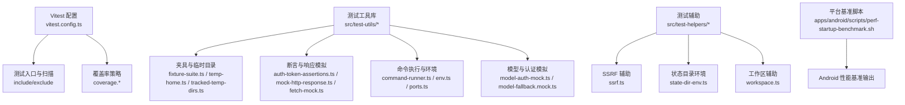
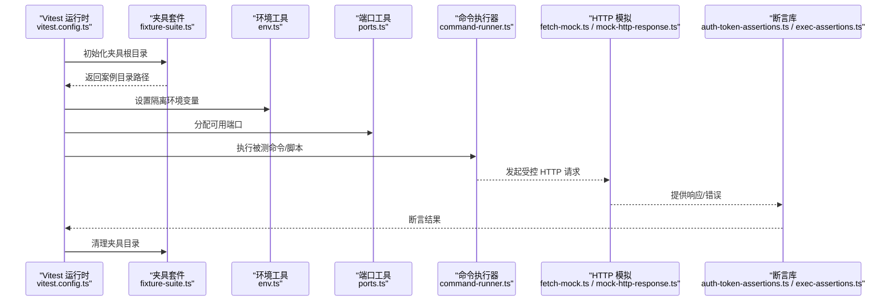
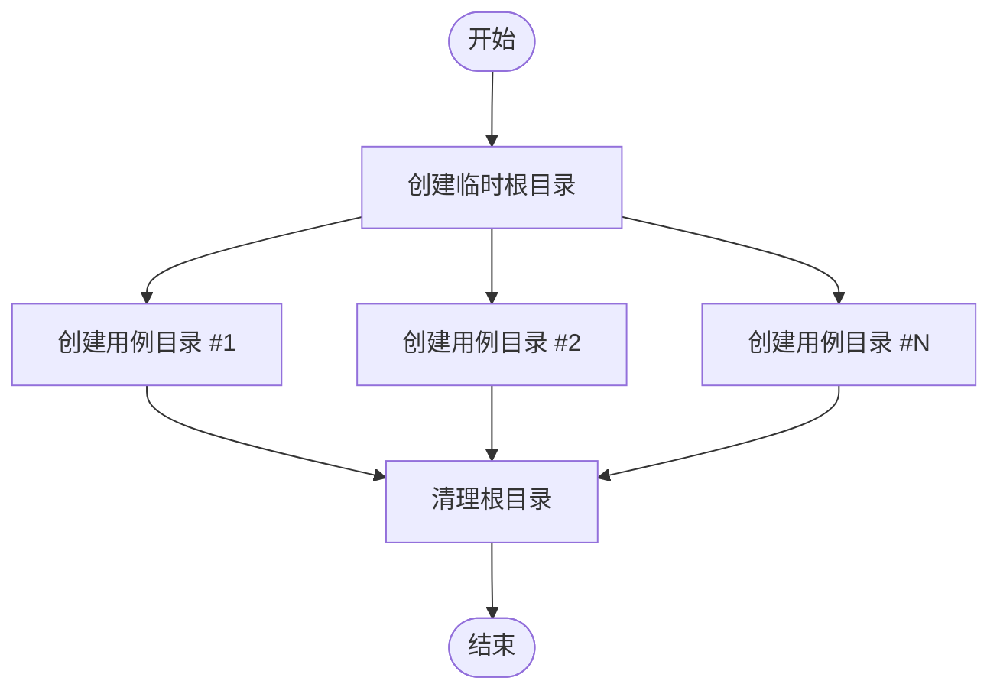
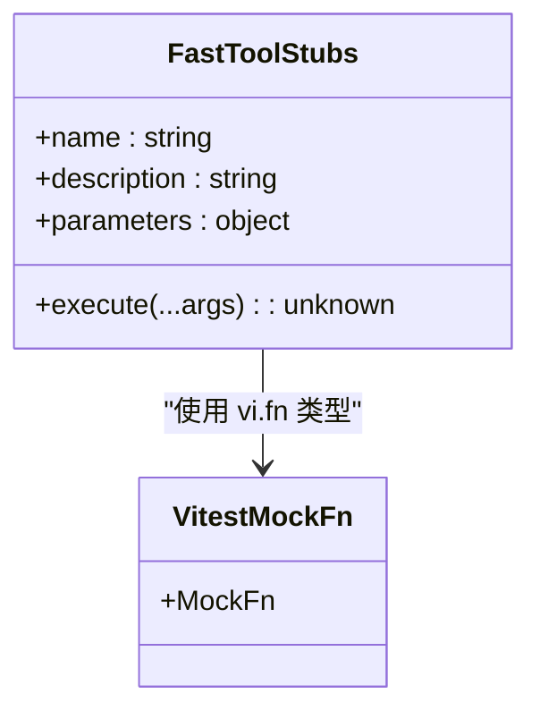
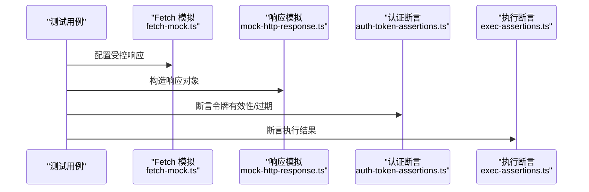
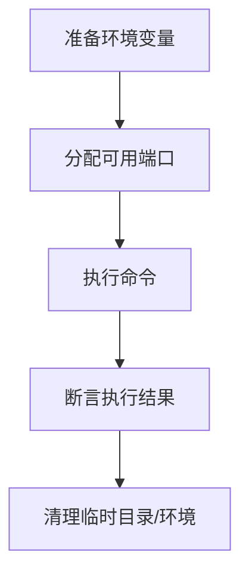
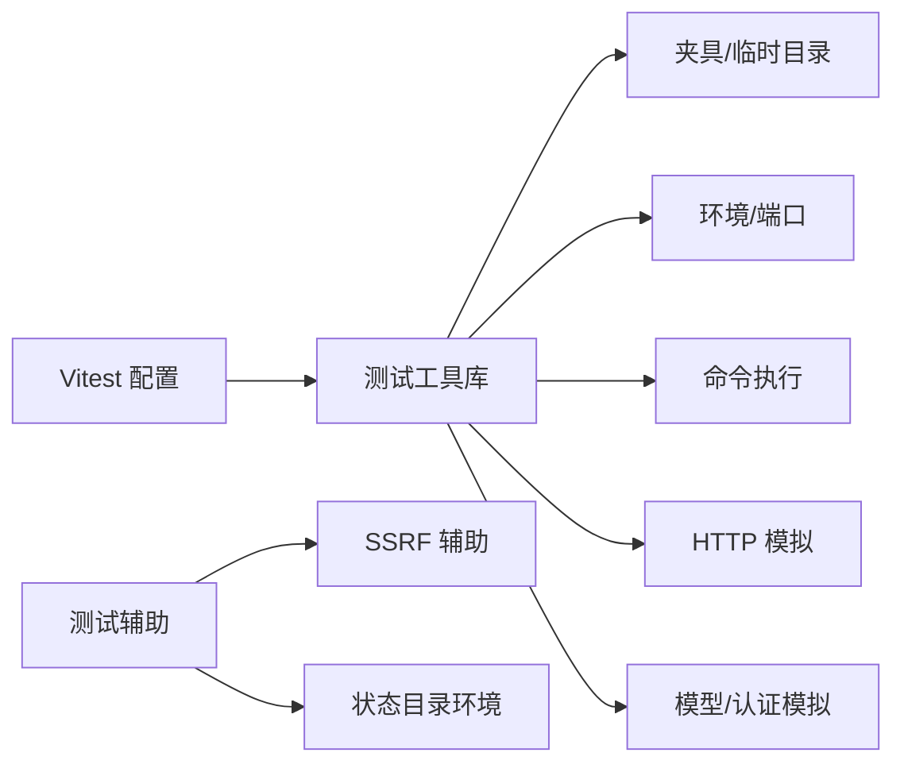

# 测试工具与辅助

<cite>
**本文引用的文件**
- [vitest.config.ts](file://vitest.config.ts)
- [fixture-suite.ts](file://src/test-utils/fixture-suite.ts)
- [fast-tool-stubs.ts](file://src/agents/test-helpers/fast-tool-stubs.ts)
- [vitest-mock-fn.ts](file://src/test-utils/vitest-mock-fn.ts)
- [auth-token-assertions.ts](file://src/test-utils/auth-token-assertions.ts)
- [exec-assertions.ts](file://src/test-utils/exec-assertions.ts)
- [mock-http-response.ts](file://src/test-utils/mock-http-response.ts)
- [fetch-mock.ts](file://src/test-utils/fetch-mock.ts)
- [command-runner.ts](file://src/test-utils/command-runner.ts)
- [env.ts](file://src/test-utils/env.ts)
- [ports.ts](file://src/test-utils/ports.ts)
- [temp-home.ts](file://src/test-utils/temp-home.ts)
- [tracked-temp-dirs.ts](file://src/test-utils/tracked-temp-dirs.ts)
- [repo-scan.ts](file://src/test-utils/repo-scan.ts)
- [runtime-source-guardrail-scan.ts](file://src/test-utils/runtime-source-guardrail-scan.ts)
- [internal-hook-event-payload.ts](file://src/test-utils/internal-hook-event-payload.ts)
- [model-auth-mock.ts](file://src/test-utils/model-auth-mock.ts)
- [model-fallback.mock.ts](file://src/test-utils/model-fallback.mock.ts)
- [ssrf.ts](file://src/test-helpers/ssrf.ts)
- [state-dir-env.ts](file://src/test-helpers/state-dir-env.ts)
- [workspace.ts](file://src/test-helpers/workspace.ts)
- [perf-startup-benchmark.sh](file://apps/android/scripts/perf-startup-benchmark.sh)
</cite>

## 目录

1. [简介](#简介)
2. [项目结构](#项目结构)
3. [核心组件](#核心组件)
4. [架构总览](#架构总览)
5. [详细组件分析](#详细组件分析)
6. [依赖关系分析](#依赖关系分析)
7. [性能考量](#性能考量)
8. [故障排查指南](#故障排查指南)
9. [结论](#结论)
10. [附录](#附录)

## 简介

本指南面向 OpenClaw 的测试与质量保障团队，系统化梳理仓库中的测试工具与辅助资源，覆盖以下主题：

- 测试辅助函数库与工具类
- 测试数据生成与夹具（Fixture）体系
- 测试模拟（Mock）、测试桩（Stub）、测试替身（Spy/Double）
- 测试环境初始化、测试数据清理、测试状态管理
- 并发测试、性能测试、内存泄漏检测等专项工具
- 可复用测试组件、测试包装器、断言库的设计与使用
- 测试工具开发指南与测试代码组织最佳实践

## 项目结构

OpenClaw 的测试相关能力主要分布在如下位置：

- 测试运行时配置：Vitest 配置文件统一定义了超时、并发、覆盖率策略与包含/排除规则
- 核心测试工具库：位于 src/test-utils 与 src/test-helpers
- 扩展模块测试：各扩展目录下存在独立的测试文件与工具
- 平台性能基准脚本：Android 基准脚本用于启动性能测量

图表来源

- [vitest.config.ts](file://vitest.config.ts#L26-L55)
- [fixture-suite.ts](file://src/test-utils/fixture-suite.ts#L1-L30)
- [env.ts](file://src/test-utils/env.ts#L1-L200)
- [ports.ts](file://src/test-utils/ports.ts#L1-L200)
- [temp-home.ts](file://src/test-utils/temp-home.ts#L1-L200)
- [tracked-temp-dirs.ts](file://src/test-utils/tracked-temp-dirs.ts#L1-L200)
- [mock-http-response.ts](file://src/test-utils/mock-http-response.ts#L1-L200)
- [fetch-mock.ts](file://src/test-utils/fetch-mock.ts#L1-L200)
- [auth-token-assertions.ts](file://src/test-utils/auth-token-assertions.ts#L1-L200)
- [command-runner.ts](file://src/test-utils/command-runner.ts#L1-L200)
- [model-auth-mock.ts](file://src/test-utils/model-auth-mock.ts#L1-L200)
- [model-fallback.mock.ts](file://src/test-utils/model-fallback.mock.ts#L1-L200)
- [ssrf.ts](file://src/test-helpers/ssrf.ts#L1-L200)
- [state-dir-env.ts](file://src/test-helpers/state-dir-env.ts#L1-L200)
- [workspace.ts](file://src/test-helpers/workspace.ts#L1-L200)
- [perf-startup-benchmark.sh](file://apps/android/scripts/perf-startup-benchmark.sh#L55-L86)

章节来源

- [vitest.config.ts](file://vitest.config.ts#L1-L158)

## 核心组件

本节聚焦测试工具库的关键模块及其职责与使用方式。

- 夹具与临时目录
  - 通过夹具套件在系统临时目录下创建隔离的测试案例目录，支持统一清理，避免跨用例污染
  - 适合需要真实文件系统交互的场景（如配置文件、缓存、日志）

- 断言与响应模拟
  - 提供针对令牌、HTTP 响应、执行结果等的断言工具
  - 提供对 fetch 或自定义 HTTP 客户端的响应模拟，便于隔离网络依赖

- 命令执行与环境
  - 封装命令执行断言与结果校验
  - 提供环境变量与端口分配工具，确保测试环境稳定与可重复

- 模型与认证模拟
  - 提供模型认证与回退行为的模拟，便于在无外部服务情况下验证调用路径

- SSRF 与状态目录辅助
  - 提供安全请求伪造（SSRF）相关测试辅助
  - 提供状态目录环境变量设置与清理，保证测试状态隔离

章节来源

- [fixture-suite.ts](file://src/test-utils/fixture-suite.ts#L1-L30)
- [auth-token-assertions.ts](file://src/test-utils/auth-token-assertions.ts#L1-L200)
- [exec-assertions.ts](file://src/test-utils/exec-assertions.ts#L1-L200)
- [mock-http-response.ts](file://src/test-utils/mock-http-response.ts#L1-L200)
- [fetch-mock.ts](file://src/test-utils/fetch-mock.ts#L1-L200)
- [command-runner.ts](file://src/test-utils/command-runner.ts#L1-L200)
- [env.ts](file://src/test-utils/env.ts#L1-L200)
- [ports.ts](file://src/test-utils/ports.ts#L1-L200)
- [temp-home.ts](file://src/test-utils/temp-home.ts#L1-L200)
- [tracked-temp-dirs.ts](file://src/test-utils/tracked-temp-dirs.ts#L1-L200)
- [model-auth-mock.ts](file://src/test-utils/model-auth-mock.ts#L1-L200)
- [model-fallback.mock.ts](file://src/test-utils/model-fallback.mock.ts#L1-L200)
- [ssrf.ts](file://src/test-helpers/ssrf.ts#L1-L200)
- [state-dir-env.ts](file://src/test-helpers/state-dir-env.ts#L1-L200)
- [workspace.ts](file://src/test-helpers/workspace.ts#L1-L200)

## 架构总览

下图展示测试运行时配置与核心测试工具之间的关系，以及典型测试流程中的调用链。

图表来源

- [vitest.config.ts](file://vitest.config.ts#L26-L55)
- [fixture-suite.ts](file://src/test-utils/fixture-suite.ts#L1-L30)
- [env.ts](file://src/test-utils/env.ts#L1-L200)
- [ports.ts](file://src/test-utils/ports.ts#L1-L200)
- [command-runner.ts](file://src/test-utils/command-runner.ts#L1-L200)
- [fetch-mock.ts](file://src/test-utils/fetch-mock.ts#L1-L200)
- [mock-http-response.ts](file://src/test-utils/mock-http-response.ts#L1-L200)
- [auth-token-assertions.ts](file://src/test-utils/auth-token-assertions.ts#L1-L200)
- [exec-assertions.ts](file://src/test-utils/exec-assertions.ts#L1-L200)

## 详细组件分析

### 夹具套件与临时目录管理

- 能力概述
  - 创建以时间戳前缀命名的临时根目录，按用例递增编号创建子目录
  - 统一清理逻辑，确保测试结束后回收资源
- 使用建议
  - 在每个测试套件的 setup 中创建根目录，在 teardown 中清理
  - 对需要持久化到磁盘的测试（如配置、缓存、日志）优先使用该套件
- 关键接口路径
  - [夹具套件工厂](file://src/test-utils/fixture-suite.ts#L5-L29)

图表来源

- [fixture-suite.ts](file://src/test-utils/fixture-suite.ts#L1-L30)

章节来源

- [fixture-suite.ts](file://src/test-utils/fixture-suite.ts#L1-L30)

### 测试模拟、桩与替身

- 概念说明
  - Mock：完全替换行为，常用于隔离外部依赖
  - Stub：返回固定值或占位行为，便于快速验证路径
  - Spy/Double：记录调用信息但保持部分真实行为
- 工具与示例
  - 使用 Vitest 的 vi.fn 与 vi.mock 构建工具桩，导出类型化别名避免类型泄漏
  - 快速工具桩示例：为图像工具、网页搜索/抓取工具、插件工具解析器提供桩实现
- 关键接口路径
  - [Vitest Mock 类型别名](file://src/test-utils/vitest-mock-fn.ts#L1-L6)
  - [快速工具桩](file://src/agents/test-helpers/fast-tool-stubs.ts#L1-L30)

图表来源

- [fast-tool-stubs.ts](file://src/agents/test-helpers/fast-tool-stubs.ts#L1-L30)
- [vitest-mock-fn.ts](file://src/test-utils/vitest-mock-fn.ts#L1-L6)

章节来源

- [fast-tool-stubs.ts](file://src/agents/test-helpers/fast-tool-stubs.ts#L1-L30)
- [vitest-mock-fn.ts](file://src/test-utils/vitest-mock-fn.ts#L1-L6)

### 断言库与响应模拟

- 认证令牌断言
  - 针对令牌生成、刷新、过期等场景提供断言封装
- 执行断言
  - 对命令执行结果、退出码、标准输出/错误进行断言
- HTTP 响应模拟
  - 提供对 fetch 或自定义客户端的响应模拟，支持状态码、头、体与错误场景
- 关键接口路径
  - [认证令牌断言](file://src/test-utils/auth-token-assertions.ts#L1-L200)
  - [执行断言](file://src/test-utils/exec-assertions.ts#L1-L200)
  - [HTTP 响应模拟](file://src/test-utils/mock-http-response.ts#L1-L200)
  - [Fetch 模拟](file://src/test-utils/fetch-mock.ts#L1-L200)

图表来源

- [fetch-mock.ts](file://src/test-utils/fetch-mock.ts#L1-L200)
- [mock-http-response.ts](file://src/test-utils/mock-http-response.ts#L1-L200)
- [auth-token-assertions.ts](file://src/test-utils/auth-token-assertions.ts#L1-L200)
- [exec-assertions.ts](file://src/test-utils/exec-assertions.ts#L1-L200)

章节来源

- [auth-token-assertions.ts](file://src/test-utils/auth-token-assertions.ts#L1-L200)
- [exec-assertions.ts](file://src/test-utils/exec-assertions.ts#L1-L200)
- [mock-http-response.ts](file://src/test-utils/mock-http-response.ts#L1-L200)
- [fetch-mock.ts](file://src/test-utils/fetch-mock.ts#L1-L200)

### 命令执行与环境管理

- 命令执行器
  - 封装命令执行、断言与结果解析，便于在测试中驱动被测进程
- 环境变量与端口
  - 提供临时 HOME/状态目录等环境变量设置与恢复
  - 提供端口分配与占用检测，避免测试间冲突
- 关键接口路径
  - [命令执行器](file://src/test-utils/command-runner.ts#L1-L200)
  - [环境工具](file://src/test-utils/env.ts#L1-L200)
  - [端口工具](file://src/test-utils/ports.ts#L1-L200)
  - [临时 HOME](file://src/test-utils/temp-home.ts#L1-L200)
  - [跟踪临时目录](file://src/test-utils/tracked-temp-dirs.ts#L1-L200)

图表来源

- [env.ts](file://src/test-utils/env.ts#L1-L200)
- [ports.ts](file://src/test-utils/ports.ts#L1-L200)
- [command-runner.ts](file://src/test-utils/command-runner.ts#L1-L200)
- [temp-home.ts](file://src/test-utils/temp-home.ts#L1-L200)
- [tracked-temp-dirs.ts](file://src/test-utils/tracked-temp-dirs.ts#L1-L200)

章节来源

- [command-runner.ts](file://src/test-utils/command-runner.ts#L1-L200)
- [env.ts](file://src/test-utils/env.ts#L1-L200)
- [ports.ts](file://src/test-utils/ports.ts#L1-L200)
- [temp-home.ts](file://src/test-utils/temp-home.ts#L1-L200)
- [tracked-temp-dirs.ts](file://src/test-utils/tracked-temp-dirs.ts#L1-L200)

### 模型与认证模拟

- 场景
  - 在无外部模型服务的情况下，模拟认证失败、回退策略与错误传播
- 工具
  - 提供认证模拟与回退行为的桩实现，便于验证调用链与降级逻辑
- 关键接口路径
  - [模型认证模拟](file://src/test-utils/model-auth-mock.ts#L1-L200)
  - [模型回退模拟](file://src/test-utils/model-fallback.mock.ts#L1-L200)

章节来源

- [model-auth-mock.ts](file://src/test-utils/model-auth-mock.ts#L1-L200)
- [model-fallback.mock.ts](file://src/test-utils/model-fallback.mock.ts#L1-L200)

### SSRF 与状态目录辅助

- SSRF 辅助
  - 提供与安全请求伪造相关的测试辅助，便于验证请求限制与防护逻辑
- 状态目录环境
  - 提供状态目录环境变量设置与清理，确保测试状态隔离
- 关键接口路径
  - [SSRF 辅助](file://src/test-helpers/ssrf.ts#L1-L200)
  - [状态目录环境](file://src/test-helpers/state-dir-env.ts#L1-L200)
  - [工作区辅助](file://src/test-helpers/workspace.ts#L1-L200)

章节来源

- [ssrf.ts](file://src/test-helpers/ssrf.ts#L1-L200)
- [state-dir-env.ts](file://src/test-helpers/state-dir-env.ts#L1-L200)
- [workspace.ts](file://src/test-helpers/workspace.ts#L1-L200)

### 并发测试与性能测试

- 并发测试
  - 利用 Vitest 的并发运行能力与池化策略，结合夹具与环境隔离，编写高吞吐测试
- 性能测试
  - Android 启动性能基准脚本可作为平台侧性能测试参考，输出 JSON 结果便于对比与回归
- 关键接口路径
  - [Vitest 并发与池化配置](file://vitest.config.ts#L34-L35)
  - [Android 性能基准脚本](file://apps/android/scripts/perf-startup-benchmark.sh#L55-L86)

章节来源

- [vitest.config.ts](file://vitest.config.ts#L34-L35)
- [perf-startup-benchmark.sh](file://apps/android/scripts/perf-startup-benchmark.sh#L55-L86)

### 内存泄漏检测

- 建议方案
  - 在长时间运行或高频创建销毁的对象场景下，结合夹具与临时目录清理，观察资源残留
  - 使用 Vitest 的钩子在测试前后检查全局对象与定时器，必要时引入专用内存分析工具
- 适用范围
  - 适用于涉及进程、连接、文件句柄等系统资源的测试

[本节为通用指导，不直接分析具体文件]

## 依赖关系分析

- 配置层
  - Vitest 配置决定测试扫描范围、并发策略、覆盖率阈值与排除项
- 工具层
  - 夹具与环境工具为上层断言与模拟提供隔离基础
  - 命令执行器与端口工具为集成测试提供运行时支撑
- 模块层
  - 模型与认证模拟为服务依赖不可用时提供替代路径
  - SSRF 与状态目录辅助为特定安全与状态场景提供支撑

图表来源

- [vitest.config.ts](file://vitest.config.ts#L26-L55)
- [fixture-suite.ts](file://src/test-utils/fixture-suite.ts#L1-L30)
- [env.ts](file://src/test-utils/env.ts#L1-L200)
- [ports.ts](file://src/test-utils/ports.ts#L1-L200)
- [command-runner.ts](file://src/test-utils/command-runner.ts#L1-L200)
- [fetch-mock.ts](file://src/test-utils/fetch-mock.ts#L1-L200)
- [mock-http-response.ts](file://src/test-utils/mock-http-response.ts#L1-L200)
- [model-auth-mock.ts](file://src/test-utils/model-auth-mock.ts#L1-L200)
- [model-fallback.mock.ts](file://src/test-utils/model-fallback.mock.ts#L1-L200)
- [ssrf.ts](file://src/test-helpers/ssrf.ts#L1-L200)
- [state-dir-env.ts](file://src/test-helpers/state-dir-env.ts#L1-L200)

章节来源

- [vitest.config.ts](file://vitest.config.ts#L1-L158)

## 性能考量

- 并发与超时
  - Vitest 配置中设置了测试与钩子超时，以及基于 CPU 数量的并发工作线程数，兼顾本地与 CI 环境
- 覆盖率与稳定性
  - 覆盖率仅统计实际被测试用例执行的源文件，避免过度排除导致阈值漂移
- 平台性能基准
  - Android 基准脚本输出 JSON，便于建立基线与回归对比

章节来源

- [vitest.config.ts](file://vitest.config.ts#L26-L55)
- [perf-startup-benchmark.sh](file://apps/android/scripts/perf-startup-benchmark.sh#L55-L86)

## 故障排查指南

- 测试超时
  - 检查 Vitest 配置中的测试与钩子超时设置；对于 Windows 环境有额外放宽
- 环境泄漏
  - 确保使用环境工具设置与恢复环境变量；在 CI 下启用 unstubEnvs/unstubGlobals
- 端口冲突
  - 使用端口工具获取可用端口；避免硬编码端口
- 夹具未清理
  - 确保在 teardown 中调用夹具清理；检查临时目录是否被外部进程占用
- 平台基准失败
  - 查看基准脚本输出日志，确认生成的 JSON 文件是否存在且可读

章节来源

- [vitest.config.ts](file://vitest.config.ts#L26-L55)
- [ports.ts](file://src/test-utils/ports.ts#L1-L200)
- [env.ts](file://src/test-utils/env.ts#L1-L200)
- [fixture-suite.ts](file://src/test-utils/fixture-suite.ts#L1-L30)
- [perf-startup-benchmark.sh](file://apps/android/scripts/perf-startup-benchmark.sh#L55-L86)

## 结论

OpenClaw 的测试工具与辅助资源围绕“隔离、可控、可重复”三大原则构建：通过夹具与环境工具实现资源隔离，通过断言与模拟降低对外部依赖的耦合，通过并发与覆盖率策略提升测试效率与质量。建议在新功能测试中优先采用上述工具与模式，逐步沉淀可复用的测试组件与断言库，持续优化测试组织与执行体验。

## 附录

- 测试工具开发指南
  - 明确职责边界：单一工具只解决一个维度的问题（如仅处理端口、仅处理环境）
  - 类型安全：导出明确的类型别名，避免泄露底层框架类型
  - 可组合性：尽量提供可组合的初始化/清理钩子，便于在不同测试场景复用
- 测试代码组织最佳实践
  - 将夹具与环境初始化放在测试文件顶部的钩子中
  - 将断言与模拟封装为独立工具函数，减少重复代码
  - 对易变的外部依赖（网络、进程、文件系统）一律使用模拟或桩
  - 为性能敏感场景提供独立的基准脚本与报告格式

[本节为通用指导，不直接分析具体文件]
