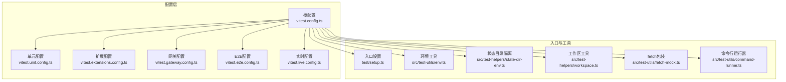
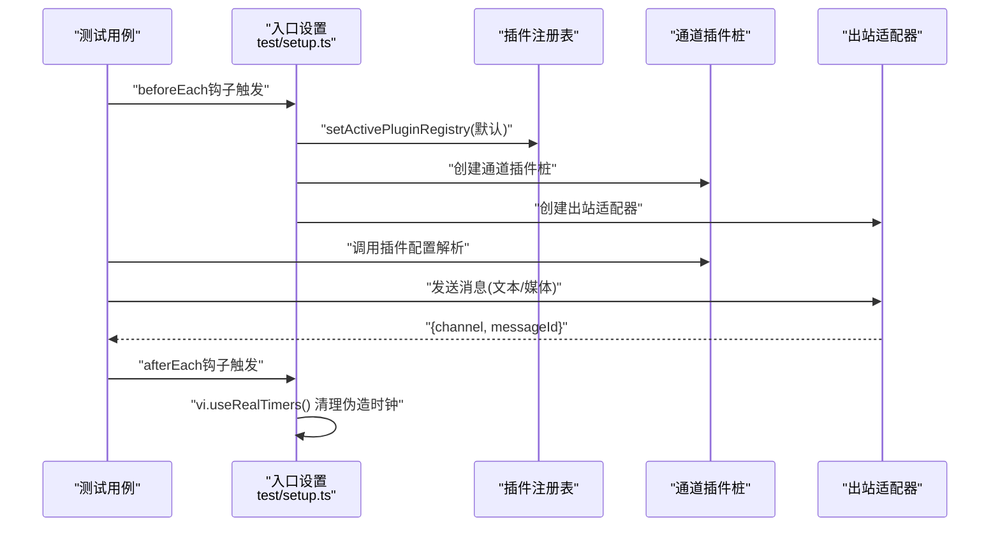
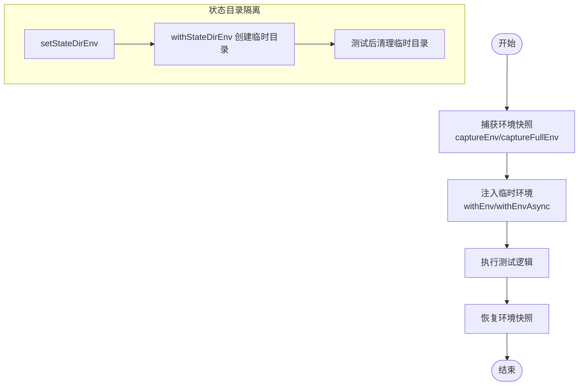
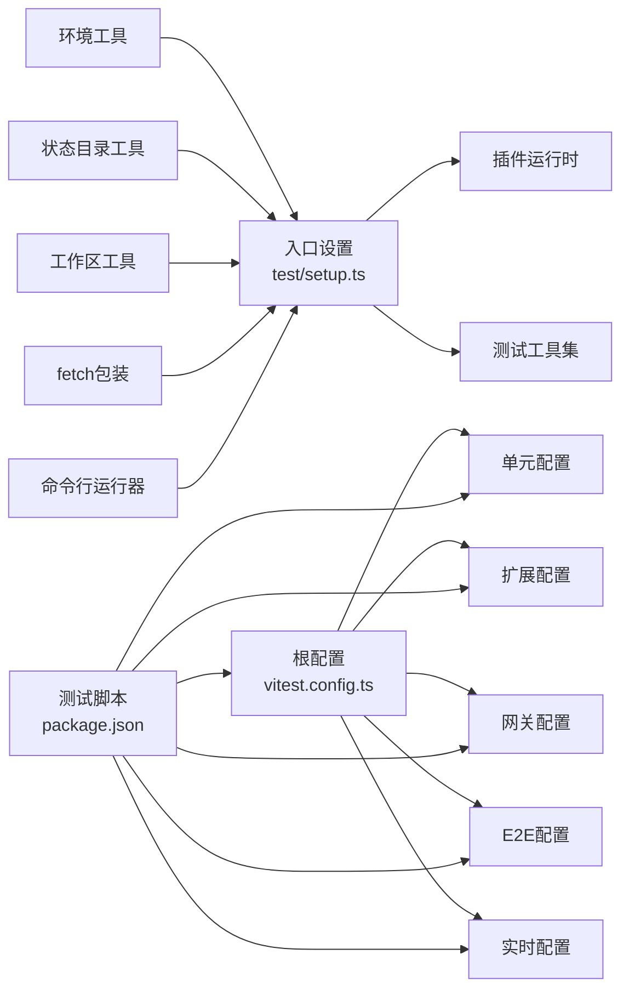

# 测试策略与实践

<cite>
**本文引用的文件**
- [vitest.config.ts](file://vitest.config.ts)
- [vitest.unit.config.ts](file://vitest.unit.config.ts)
- [vitest.e2e.config.ts](file://vitest.e2e.config.ts)
- [vitest.extensions.config.ts](file://vitest.extensions.config.ts)
- [vitest.gateway.config.ts](file://vitest.gateway.config.ts)
- [vitest.live.config.ts](file://vitest.live.config.ts)
- [test/setup.ts](file://test/setup.ts)
- [package.json](file://package.json)
- [src/test-helpers/state-dir-env.ts](file://src/test-helpers/state-dir-env.ts)
- [src/test-helpers/workspace.ts](file://src/test-helpers/workspace.ts)
- [src/test-utils/env.ts](file://src/test-utils/env.ts)
- [src/test-utils/fetch-mock.ts](file://src/test-utils/fetch-mock.ts)
- [src/test-utils/command-runner.ts](file://src/test-utils/command-runner.ts)
</cite>

## 目录

1. [引言](#引言)
2. [项目结构](#项目结构)
3. [核心组件](#核心组件)
4. [架构总览](#架构总览)
5. [详细组件分析](#详细组件分析)
6. [依赖分析](#依赖分析)
7. [性能考虑](#性能考虑)
8. [故障排查指南](#故障排查指南)
9. [结论](#结论)
10. [附录](#附录)

## 引言

本指南面向OpenClaw项目的测试体系，系统化阐述单元测试、集成测试与端到端（E2E）测试的组织方式与实施要点；详解Vitest配置、测试环境设置与模拟对象使用；给出测试用例编写规范、断言模式与异步测试处理建议；明确覆盖率门槛与性能测试、并发测试策略；并覆盖测试数据管理、环境隔离、持续集成中的测试流程，以及调试技巧与常见问题解决方案。

## 项目结构

OpenClaw采用多包/多模块的Monorepo结构，测试分布在以下位置：

- 核心测试配置：根目录下多个Vitest配置文件，分别用于通用、单元、扩展、网关、E2E与实时测试。
- 测试入口与全局设置：test/setup.ts负责进程级隔离、插件注册表初始化、时钟清理等。
- 测试辅助工具：src/test-helpers与src/test-utils提供环境快照、工作区临时目录、fetch预连接包装、命令行解析等能力。
- 脚本与任务：package.json中定义了丰富的测试脚本，涵盖并行执行、覆盖率、Docker化E2E、实时测试等。

```mermaid
graph TB
A["根配置<br/>vitest.config.ts"] --> B["单元测试配置<br/>vitest.unit.config.ts"]
A --> C["扩展测试配置<br/>vitest.extensions.config.ts"]
A --> D["网关测试配置<br/>vitest.gateway.config.ts"]
A --> E["E2E测试配置<br/>vitest.e2e.config.ts"]
A --> F["实时测试配置<br/>vitest.live.config.ts"]
G["测试入口与全局设置<br/>test/setup.ts"] --> H["插件注册表初始化"]
G --> I["进程警告过滤器安装"]
G --> J["通道插件桩与出站适配器"]
G --> K["隔离HOME/状态目录"]
L["测试辅助工具"] --> M["环境快照/恢复<br/>src/test-utils/env.ts"]
L --> N["状态目录隔离<br/>src/test-helpers/state-dir-env.ts"]
L --> O["工作区临时目录<br/>src/test-helpers/workspace.ts"]
L --> P["fetch预连接包装<br/>src/test-utils/fetch-mock.ts"]
L --> Q["命令行运行器<br/>src/test-utils/command-runner.ts"]
R["测试脚本与任务<br/>package.json"] --> S["并行执行"]
R --> T["覆盖率统计"]
R --> U["Docker化E2E"]
R --> V["实时测试"]
```

图表来源

- [vitest.config.ts](file://vitest.config.ts#L1-L158)
- [vitest.unit.config.ts](file://vitest.unit.config.ts#L1-L19)
- [vitest.extensions.config.ts](file://vitest.extensions.config.ts#L1-L16)
- [vitest.gateway.config.ts](file://vitest.gateway.config.ts#L1-L16)
- [vitest.e2e.config.ts](file://vitest.e2e.config.ts#L1-L31)
- [vitest.live.config.ts](file://vitest.live.config.ts#L1-L17)
- [test/setup.ts](file://test/setup.ts#L1-L190)
- [src/test-helpers/state-dir-env.ts](file://src/test-helpers/state-dir-env.ts#L1-L35)
- [src/test-helpers/workspace.ts](file://src/test-helpers/workspace.ts#L1-L18)
- [src/test-utils/env.ts](file://src/test-utils/env.ts#L1-L73)
- [src/test-utils/fetch-mock.ts](file://src/test-utils/fetch-mock.ts#L1-L23)
- [src/test-utils/command-runner.ts](file://src/test-utils/command-runner.ts#L1-L11)
- [package.json](file://package.json#L49-L149)

章节来源

- [vitest.config.ts](file://vitest.config.ts#L1-L158)
- [test/setup.ts](file://test/setup.ts#L1-L190)
- [package.json](file://package.json#L49-L149)

## 核心组件

- 通用Vitest配置（根配置）
  - 别名映射：通过别名将“openclaw/plugin-sdk”等路径指向实际源码，便于在测试中统一导入。
  - 超时与钩子：针对Windows平台延长钩子超时，确保跨平台稳定性。
  - 池与并发：默认使用“forks”池，CI下按CPU核数动态分配工作线程，兼顾稳定与速度。
  - 包含/排除：集中定义include/exclude，避免重复配置；对扩展、应用、UI、CLI等进行排除，聚焦核心src代码覆盖率。
  - 覆盖率：v8提供者，输出文本与LCOV；设定行、函数、分支、语句阈值；锚定仓库根src目录，排除大量集成面与入口文件。
  - 环境解耦：开启unstubEnvs/unstubGlobals，防止vmForks下的环境泄漏。
- 单元测试配置
  - 基于根配置派生，过滤掉扩展测试，聚焦核心库。
- 扩展测试配置
  - 仅匹配extensions目录下的测试文件。
- 网关测试配置
  - 仅匹配src/gateway目录下的测试文件。
- E2E测试配置
  - 使用vmForks池，降低内存占用；默认静默输出，可通过环境变量控制详细日志；根据CPU与环境变量决定工作线程数。
- 实时测试配置
  - 限制最大并发为1，确保与真实设备或外部服务交互的确定性。
- 测试入口与全局设置
  - 进程级隔离：通过withIsolatedTestHome隔离HOME与状态目录，避免跨用例污染。
  - 插件注册表：创建默认通道插件桩集合，注入到运行时，保证出站发送逻辑可被测试。
  - 时钟清理：确保伪造时钟不会泄漏到其他文件/worker。
  - 进程监听器上限提升：避免大量worker加载锁文件助手导致MaxListeners告警。
- 测试辅助工具
  - 环境快照：captureEnv/captureFullEnv与withEnv/withEnvAsync，支持在测试前后恢复环境。
  - 状态目录隔离：通过OPENCLAW_STATE_DIR/CLAWDBOT_STATE_DIR临时目录实现隔离。
  - 工作区临时目录：快速生成临时工作区与写入文件。
  - fetch预连接包装：为fetch添加preconnect能力，便于网络相关测试。
  - 命令行运行器：封装commander命令注册与解析，便于CLI相关测试。

章节来源

- [vitest.config.ts](file://vitest.config.ts#L12-L157)
- [vitest.unit.config.ts](file://vitest.unit.config.ts#L1-L19)
- [vitest.extensions.config.ts](file://vitest.extensions.config.ts#L1-L16)
- [vitest.gateway.config.ts](file://vitest.gateway.config.ts#L1-L16)
- [vitest.e2e.config.ts](file://vitest.e2e.config.ts#L1-L31)
- [vitest.live.config.ts](file://vitest.live.config.ts#L1-L17)
- [test/setup.ts](file://test/setup.ts#L1-L190)
- [src/test-helpers/state-dir-env.ts](file://src/test-helpers/state-dir-env.ts#L1-L35)
- [src/test-helpers/workspace.ts](file://src/test-helpers/workspace.ts#L1-L18)
- [src/test-utils/env.ts](file://src/test-utils/env.ts#L1-L73)
- [src/test-utils/fetch-mock.ts](file://src/test-utils/fetch-mock.ts#L1-L23)
- [src/test-utils/command-runner.ts](file://src/test-utils/command-runner.ts#L1-L11)

## 架构总览

下图展示测试配置、入口与辅助工具之间的关系，以及它们如何共同支撑不同层级的测试：

图表来源

- [vitest.config.ts](file://vitest.config.ts#L1-L158)
- [test/setup.ts](file://test/setup.ts#L1-L190)
- [src/test-utils/env.ts](file://src/test-utils/env.ts#L1-L73)
- [src/test-helpers/state-dir-env.ts](file://src/test-helpers/state-dir-env.ts#L1-L35)
- [src/test-helpers/workspace.ts](file://src/test-helpers/workspace.ts#L1-L18)
- [src/test-utils/fetch-mock.ts](file://src/test-utils/fetch-mock.ts#L1-L23)
- [src/test-utils/command-runner.ts](file://src/test-utils/command-runner.ts#L1-L11)

## 详细组件分析

### 组件A：Vitest配置与分层策略

- 设计原则
  - 分层配置：根配置集中定义通用规则，各子配置仅声明差异，减少重复与维护成本。
  - 平台适配：Windows平台延长超时，CI下按CPU核数动态分配工作线程，兼顾稳定性与吞吐。
  - 隔离与稳定：unstubEnvs/unstubGlobals与forks池降低跨用例污染风险。
- 关键点
  - include/exclude：严格限定src范围，排除扩展、应用、UI、CLI等非核心目录，确保覆盖率门槛有效。
  - 覆盖率阈值：行/函数/分支/语句70%/70%/55%/70%，鼓励高覆盖率同时避免过度严苛。
  - 别名：统一插件SDK导入路径，简化测试导入与替换。
- 推荐实践
  - 新增测试时优先选择对应子配置，避免误入其他域。
  - 在CI中使用默认workers，必要时通过环境变量微调E2E并发度。

章节来源

- [vitest.config.ts](file://vitest.config.ts#L12-L157)
- [vitest.unit.config.ts](file://vitest.unit.config.ts#L1-L19)
- [vitest.extensions.config.ts](file://vitest.extensions.config.ts#L1-L16)
- [vitest.gateway.config.ts](file://vitest.gateway.config.ts#L1-L16)
- [vitest.e2e.config.ts](file://vitest.e2e.config.ts#L1-L31)
- [vitest.live.config.ts](file://vitest.live.config.ts#L1-L17)

### 组件B：测试入口与环境隔离

- 入口职责
  - 设置Vitest标志位与插件缓存参数，提升测试稳定性。
  - 安装进程警告过滤器，减少噪声。
  - 初始化默认插件注册表，注入通道插件桩，提供统一的出站发送接口。
  - 清理伪造时钟，避免跨文件泄漏。
- 环境隔离
  - 通过withIsolatedTestHome隔离状态目录，确保每次测试从干净状态开始。
  - 使用withEnv/withEnvAsync在测试期间注入/恢复环境变量，避免全局污染。
- 断言与桩
  - 通道插件桩返回固定消息ID，便于断言一致性。
  - 出站适配器支持文本与媒体发送，便于验证消息路由与格式。

图表来源

- [test/setup.ts](file://test/setup.ts#L180-L189)
- [test/setup.ts](file://test/setup.ts#L37-L79)
- [test/setup.ts](file://test/setup.ts#L128-L173)

章节来源

- [test/setup.ts](file://test/setup.ts#L1-L190)
- [src/test-utils/env.ts](file://src/test-utils/env.ts#L1-L73)

### 组件C：测试辅助工具与数据管理

- 环境快照与恢复
  - captureEnv/captureFullEnv：捕获指定或全部环境变量，在测试结束后恢复。
  - withEnv/withEnvAsync：在回调内临时注入环境变量，自动恢复。
- 状态目录隔离
  - setStateDirEnv：设置OPENCLAW_STATE_DIR/CLAWDBOT_STATE_DIR。
  - withStateDirEnv：创建临时目录树，测试后清理。
- 工作区临时目录
  - makeTempWorkspace：生成临时工作区目录。
  - writeWorkspaceFile：向工作区写入文件，返回绝对路径。
- fetch预连接包装
  - withFetchPreconnect：为fetch添加preconnect能力，便于网络相关测试。
- 命令行运行器
  - runRegisteredCli：注册并解析commander命令，便于CLI相关测试。

图表来源

- [src/test-utils/env.ts](file://src/test-utils/env.ts#L1-L73)
- [src/test-helpers/state-dir-env.ts](file://src/test-helpers/state-dir-env.ts#L1-L35)

章节来源

- [src/test-utils/env.ts](file://src/test-utils/env.ts#L1-L73)
- [src/test-helpers/state-dir-env.ts](file://src/test-helpers/state-dir-env.ts#L1-L35)
- [src/test-helpers/workspace.ts](file://src/test-helpers/workspace.ts#L1-L18)
- [src/test-utils/fetch-mock.ts](file://src/test-utils/fetch-mock.ts#L1-L23)
- [src/test-utils/command-runner.ts](file://src/test-utils/command-runner.ts#L1-L11)

### 组件D：测试类型与组织策略

- 单元测试（unit）
  - 范围：聚焦src核心库，排除扩展、应用、UI、CLI与入口文件。
  - 覆盖率：以v8提供者统计，行/函数/分支/语句70%/70%/55%/70%。
  - 并发：基于根配置，使用forks池与动态workers。
- 集成测试（integration）
  - 范围：覆盖src/gateway、channels、agents等集成面，但不在单元覆盖率统计中。
  - 并发：可按需调整workers，关注稳定性。
- 端到端测试（E2E）
  - 范围：以test/\*_/_.e2e.test.ts为主，使用vmForks池降低内存占用。
  - 并发：默认静默输出，可通过环境变量控制详细日志；根据CPU与环境变量决定workers。
- 实时测试（live）
  - 范围：以src/\*_/_.live.test.ts为主，强调与真实设备/外部服务交互。
  - 并发：maxWorkers=1，确保确定性。

章节来源

- [vitest.config.ts](file://vitest.config.ts#L56-L155)
- [vitest.e2e.config.ts](file://vitest.e2e.config.ts#L1-L31)
- [vitest.live.config.ts](file://vitest.live.config.ts#L1-L17)

## 依赖分析

- 配置依赖
  - 各子配置均基于根配置派生，确保行为一致与变更最小化。
- 入口依赖
  - test/setup.ts依赖插件运行时与测试工具集，负责初始化与清理。
- 工具依赖
  - 环境工具与状态目录工具被广泛复用，形成稳定的隔离基座。
- 脚本依赖
  - package.json脚本串联并行执行、覆盖率、Docker化E2E与实时测试，形成CI流水线。

图表来源

- [vitest.config.ts](file://vitest.config.ts#L1-L158)
- [test/setup.ts](file://test/setup.ts#L1-L190)
- [src/test-utils/env.ts](file://src/test-utils/env.ts#L1-L73)
- [src/test-helpers/state-dir-env.ts](file://src/test-helpers/state-dir-env.ts#L1-L35)
- [src/test-helpers/workspace.ts](file://src/test-helpers/workspace.ts#L1-L18)
- [src/test-utils/fetch-mock.ts](file://src/test-utils/fetch-mock.ts#L1-L23)
- [src/test-utils/command-runner.ts](file://src/test-utils/command-runner.ts#L1-L11)
- [package.json](file://package.json#L49-L149)

章节来源

- [vitest.config.ts](file://vitest.config.ts#L1-L158)
- [test/setup.ts](file://test/setup.ts#L1-L190)
- [package.json](file://package.json#L49-L149)

## 性能考虑

- 并发与池选择
  - 默认forks池适合大多数单元测试，避免VM共享带来的状态污染。
  - E2E使用vmForks池，降低内存占用，适合长链路与外部依赖场景。
  - 实时测试强制单并发，确保与外部服务交互的确定性。
- 超时与资源
  - Windows平台延长钩子超时，CI下按CPU核数动态分配workers，平衡吞吐与稳定性。
- 覆盖率与开销
  - 通过锚定src目录与排除大量集成面，减少覆盖率计算开销，同时保持核心代码质量门槛。
- 网络与外部依赖
  - 使用fetch预连接包装与环境隔离，减少外部依赖抖动对测试的影响。

章节来源

- [vitest.config.ts](file://vitest.config.ts#L26-L55)
- [vitest.e2e.config.ts](file://vitest.e2e.config.ts#L1-L31)
- [vitest.live.config.ts](file://vitest.live.config.ts#L1-L17)
- [src/test-utils/fetch-mock.ts](file://src/test-utils/fetch-mock.ts#L1-L23)

## 故障排查指南

- 环境泄漏与跨用例污染
  - 确保启用unstubEnvs/unstubGlobals；在afterEach中调用vi.useRealTimers()清理伪造时钟。
  - 使用withEnv/withEnvAsync与captureEnv/captureFullEnv进行环境快照与恢复。
- 插件注册表问题
  - 确认默认注册表已通过setActivePluginRegistry注入；如需定制，显式设置。
- 状态目录冲突
  - 使用withStateDirEnv创建临时状态目录，测试结束后自动清理。
- 并发与超时
  - Windows平台与CI环境下的超时差异；必要时调整workers数量或超时参数。
- E2E稳定性
  - 使用vmForks池与静默输出；通过环境变量控制详细日志；合理设置workers。
- 实时测试
  - 强制单并发；确保外部服务可用性与凭据正确。

章节来源

- [test/setup.ts](file://test/setup.ts#L180-L189)
- [src/test-utils/env.ts](file://src/test-utils/env.ts#L1-L73)
- [src/test-helpers/state-dir-env.ts](file://src/test-helpers/state-dir-env.ts#L1-L35)
- [vitest.config.ts](file://vitest.config.ts#L26-L55)
- [vitest.e2e.config.ts](file://vitest.e2e.config.ts#L1-L31)
- [vitest.live.config.ts](file://vitest.live.config.ts#L1-L17)

## 结论

OpenClaw的测试体系通过分层Vitest配置、严格的环境隔离与完善的辅助工具，实现了从单元到E2E的全栈覆盖。遵循本文的策略与实践，可在保证质量的同时提升测试效率与稳定性，并在CI中获得可靠的反馈。

## 附录

- 测试脚本与任务
  - 并行执行：通过并行脚本提升整体吞吐。
  - 覆盖率：单元测试覆盖率统计与报告生成。
  - Docker化E2E：通过Docker脚本执行端到端场景，隔离宿主环境。
  - 实时测试：通过环境变量启用实时测试，与真实设备/外部服务交互。
- 测试用例编写规范（建议）
  - 命名：以.test.ts结尾，描述性命名，清晰表达意图。
  - 断言：优先使用明确的断言模式，结合mock/stub验证副作用。
  - 异步：使用async/await与合适的超时配置；避免全局定时器泄漏。
  - 数据：使用临时目录与环境快照管理测试数据，避免持久化污染。
  - 并发：在需要并发的场景合理设置workers；实时测试强制单并发。
- 覆盖率要求
  - 行/函数/分支/语句70%/70%/55%/70%，聚焦核心src代码。
- 性能测试与并发策略
  - 使用forks池进行单元测试；E2E使用vmForks池；实时测试单并发。
- 测试数据管理与环境隔离
  - 使用withStateDirEnv与withEnv系列工具；工作区临时目录用于文件型测试。
- 持续集成中的测试流程
  - 通过package.json脚本串联lint、build、单元测试、E2E、实时测试与Docker化E2E；在CI中启用默认workers与超时配置。

章节来源

- [package.json](file://package.json#L49-L149)
- [vitest.config.ts](file://vitest.config.ts#L56-L155)
- [src/test-helpers/state-dir-env.ts](file://src/test-helpers/state-dir-env.ts#L1-L35)
- [src/test-utils/env.ts](file://src/test-utils/env.ts#L1-L73)
- [src/test-helpers/workspace.ts](file://src/test-helpers/workspace.ts#L1-L18)
