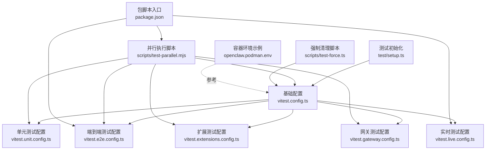
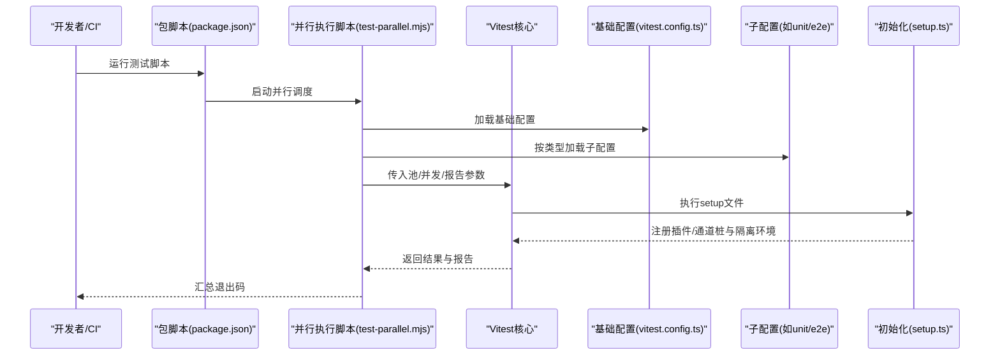
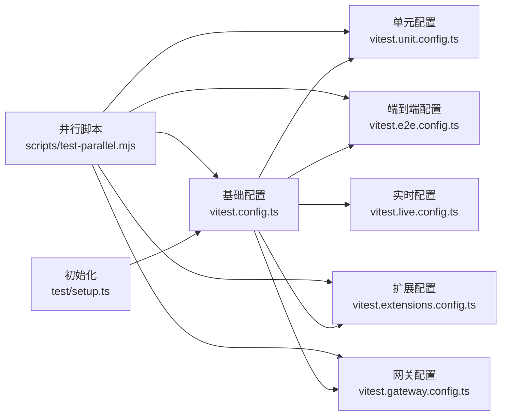

# 测试配置与环境

<cite>
**本文引用的文件**
- [vitest.config.ts](file://vitest.config.ts)
- [vitest.unit.config.ts](file://vitest.unit.config.ts)
- [vitest.e2e.config.ts](file://vitest.e2e.config.ts)
- [vitest.extensions.config.ts](file://vitest.extensions.config.ts)
- [vitest.gateway.config.ts](file://vitest.gateway.config.ts)
- [vitest.live.config.ts](file://vitest.live.config.ts)
- [test/setup.ts](file://test/setup.ts)
- [package.json](file://package.json)
- [scripts/test-parallel.mjs](file://scripts/test-parallel.mjs)
- [scripts/test-force.ts](file://scripts/test-force.ts)
- [openclaw.podman.env](file://openclaw.podman.env)
</cite>

## 目录

1. [简介](#简介)
2. [项目结构](#项目结构)
3. [核心组件](#核心组件)
4. [架构总览](#架构总览)
5. [详细组件分析](#详细组件分析)
6. [依赖关系分析](#依赖关系分析)
7. [性能考量](#性能考量)
8. [故障排查指南](#故障排查指南)
9. [结论](#结论)
10. [附录](#附录)

## 简介

本指南面向OpenClaw项目的测试配置与环境管理，系统性说明Vitest配置文件结构、测试环境变量、测试工具链配置；解释单元测试、端到端测试、扩展测试、网关测试、实时测试等不同测试类型的配置差异；覆盖CI/CD与本地开发环境配置要点；提供测试数据库与模拟服务配置思路、外部API模拟策略；包含测试覆盖率与报告生成、并行测试配置；说明测试密钥与环境隔离、测试数据备份建议；最后给出最佳实践与常见问题解决方案。

## 项目结构

OpenClaw采用多配置Vitest方案，结合统一基础配置与按类型拆分的子配置，配合并行执行脚本与测试初始化钩子，形成完整的测试体系。关键文件包括：

- 基础配置：vitest.config.ts
- 类型化子配置：vitest.unit.config.ts、vitest.e2e.config.ts、vitest.extensions.config.ts、vitest.gateway.config.ts、vitest.live.config.ts
- 测试初始化：test/setup.ts
- 并行执行：scripts/test-parallel.mjs
- 强制清理与端口占用：scripts/test-force.ts
- 容器环境示例：openclaw.podman.env
- 脚本入口：package.json 中的 test 相关脚本

图表来源

- [vitest.config.ts](file://vitest.config.ts#L12-L157)
- [vitest.unit.config.ts](file://vitest.unit.config.ts#L1-L19)
- [vitest.e2e.config.ts](file://vitest.e2e.config.ts#L1-L31)
- [vitest.extensions.config.ts](file://vitest.extensions.config.ts#L1-L16)
- [vitest.gateway.config.ts](file://vitest.gateway.config.ts#L1-L16)
- [vitest.live.config.ts](file://vitest.live.config.ts#L1-L17)
- [test/setup.ts](file://test/setup.ts#L1-L190)
- [scripts/test-parallel.mjs](file://scripts/test-parallel.mjs#L106-L214)
- [scripts/test-force.ts](file://scripts/test-force.ts#L28-L44)
- [openclaw.podman.env](file://openclaw.podman.env#L1-L25)
- [package.json](file://package.json#L120-L149)

章节来源

- [vitest.config.ts](file://vitest.config.ts#L12-L157)
- [package.json](file://package.json#L120-L149)

## 核心组件

- 基础Vitest配置（vitest.config.ts）
  - 解析器别名：为插件SDK提供精确路径映射，确保模块解析稳定。
  - 测试池与并发：默认使用进程池（forks），在CI或Windows上调整工作线程数；支持vmForks以提升导入/转换密集型套件性能。
  - 超时与环境解桩：启用unstubEnvs/unstubGlobals避免跨文件污染；统一测试与钩子超时。
  - 包含/排除规则：覆盖源码与扩展测试，排除应用/UI与入口文件，聚焦核心逻辑。
  - 覆盖率：v8提供者，文本与LCOV报告，阈值与include/exclude策略明确，锚定仓库根src目录。
- 子配置
  - 单元测试：过滤掉extensions目录，聚焦核心库。
  - 端到端测试：vmForks池、可配置工作线程、静默/详细输出控制、仅匹配e2e测试。
  - 扩展测试：仅匹配extensions目录。
  - 网关测试：仅匹配src/gateway目录。
  - 实时测试：串行运行，仅匹配live测试。
- 测试初始化（test/setup.ts）
  - 设置Vitest标记与缓存参数，提升插件清单验证性能。
  - 进程监听器上限提升，避免VM Fork警告噪声。
  - 隔离测试HOME与状态目录，确保测试间无污染。
  - 安装全局警告过滤器，注册默认插件注册表，注入通道发送桩。
  - 统一清理定时器，防止跨文件泄漏。
- 并行执行（scripts/test-parallel.mjs）
  - 自动识别平台与内存特征，动态选择是否启用vmForks与工作线程数。
  - 将测试分为“快速并行”“隔离并行”“扩展并行”“网关串行”等 lanes，平衡吞吐与稳定性。
  - 支持分片（shard）与报告输出目录，便于CI聚合。
  - 提供低/高/最大/串行等测试档位，适配不同硬件与CI负载。
- 强制清理（scripts/test-force.ts）
  - 释放被占用端口，生成临时锁文件，避免网关冲突导致测试失败。
- 容器环境（openclaw.podman.env）
  - 示例令牌与端口映射，便于容器化运行与调试。

章节来源

- [vitest.config.ts](file://vitest.config.ts#L12-L157)
- [vitest.unit.config.ts](file://vitest.unit.config.ts#L1-L19)
- [vitest.e2e.config.ts](file://vitest.e2e.config.ts#L1-L31)
- [vitest.extensions.config.ts](file://vitest.extensions.config.ts#L1-L16)
- [vitest.gateway.config.ts](file://vitest.gateway.config.ts#L1-L16)
- [vitest.live.config.ts](file://vitest.live.config.ts#L1-L17)
- [test/setup.ts](file://test/setup.ts#L1-L190)
- [scripts/test-parallel.mjs](file://scripts/test-parallel.mjs#L106-L214)
- [scripts/test-force.ts](file://scripts/test-force.ts#L28-L44)
- [openclaw.podman.env](file://openclaw.podman.env#L1-L25)

## 架构总览

下图展示从命令行到具体测试执行的关键流程，包括配置加载、初始化、并行调度与报告输出。

图表来源

- [package.json](file://package.json#L120-L149)
- [scripts/test-parallel.mjs](file://scripts/test-parallel.mjs#L106-L214)
- [vitest.config.ts](file://vitest.config.ts#L12-L157)
- [vitest.unit.config.ts](file://vitest.unit.config.ts#L1-L19)
- [vitest.e2e.config.ts](file://vitest.e2e.config.ts#L1-L31)
- [test/setup.ts](file://test/setup.ts#L1-L190)

## 详细组件分析

### 基础Vitest配置（vitest.config.ts）

- 关键点
  - 别名解析：对插件SDK进行精确替换，避免相对路径歧义。
  - 池与并发：默认forks，CI与Windows下调参；vmForks用于导入/转换密集场景。
  - 超时与解桩：统一超时与unstubEnvs/unstubGlobals，降低跨文件污染风险。
  - 包含/排除：覆盖src、extensions、test与UI特定文件；排除应用/UI与入口文件。
  - 覆盖率：v8提供者，text与lcov双报告；阈值与include/exclude锚定核心src。
- 复杂度与性能
  - 配置合并与glob匹配开销受include/exclude影响，通过锚定src与排除大目录降低复杂度。
  - vmForks在导入/转换密集场景收益显著，但需关注Node版本与内存限制。

章节来源

- [vitest.config.ts](file://vitest.config.ts#L12-L157)

### 子配置对比（unit/e2e/extensions/gateway/live）

- 单元测试（vitest.unit.config.ts）
  - 排除extensions与网关目录，聚焦核心库。
- 端到端测试（vitest.e2e.config.ts）
  - 使用vmForks池，可由环境变量控制工作线程数；静默/详细输出可切换；仅匹配e2e测试。
- 扩展测试（vitest.extensions.config.ts）
  - 仅匹配extensions目录。
- 网关测试（vitest.gateway.config.ts）
  - 仅匹配src/gateway目录，避免vmForks带来的全局状态干扰。
- 实时测试（vitest.live.config.ts）
  - 串行运行，仅匹配live测试，适合需要真实外部资源的场景。

章节来源

- [vitest.unit.config.ts](file://vitest.unit.config.ts#L1-L19)
- [vitest.e2e.config.ts](file://vitest.e2e.config.ts#L1-L31)
- [vitest.extensions.config.ts](file://vitest.extensions.config.ts#L1-L16)
- [vitest.gateway.config.ts](file://vitest.gateway.config.ts#L1-L16)
- [vitest.live.config.ts](file://vitest.live.config.ts#L1-L17)

### 测试初始化（test/setup.ts）

- 关键点
  - 设置Vitest标记与插件清单缓存时间，减少重复发现成本。
  - 提升进程监听器上限，避免VM Fork噪音。
  - 隔离测试HOME与状态目录，确保测试间隔离。
  - 安装全局警告过滤器，注册默认插件注册表，注入通道发送桩。
  - 统一清理定时器，防止跨文件泄漏。
- 性能与稳定性
  - 默认注册表复用减少构建开销；通道桩避免真实网络调用，提高稳定性。

章节来源

- [test/setup.ts](file://test/setup.ts#L1-L190)

### 并行执行（scripts/test-parallel.mjs）

- 关键点
  - 动态选择vmForks与工作线程数：依据平台、内存、Node版本与负载自动决策。
  - 分lane策略：unit-fast（vmForks）、unit-isolated（forks）、extensions（可vmForks）、gateway（串行）。
  - 分片与报告：支持shard分片与报告输出目录，便于CI聚合。
  - 测试档位：low/normal/max/serial，适配不同硬件与CI负载。
  - 警告抑制与堆内存：统一NODE_OPTIONS与max-old-space-size，缓解CI内存压力。
- 性能与稳定性
  - 在非Windows与高内存主机优先vmForks，提升吞吐；低内存主机保守策略。
  - 串行网关测试避免全局状态交叉污染。

章节来源

- [scripts/test-parallel.mjs](file://scripts/test-parallel.mjs#L106-L214)

### 强制清理（scripts/test-force.ts）

- 关键点
  - 释放被占用端口，避免网关冲突。
  - 生成临时锁文件，避免多进程竞争。
  - 通过spawnSync触发测试执行，保证清理后立即运行。

章节来源

- [scripts/test-force.ts](file://scripts/test-force.ts#L28-L44)

### 容器环境（openclaw.podman.env）

- 关键点
  - 必填：网关认证令牌。
  - 可选：Web Provider会话与Cookie、Host端口映射、绑定模式、LLM API Key。
- 使用建议
  - 复制为本地覆盖文件，设置令牌与端口映射，便于容器化调试。

章节来源

- [openclaw.podman.env](file://openclaw.podman.env#L1-L25)

## 依赖关系分析

- 配置依赖
  - 子配置均基于基础配置进行扩展，确保一致性与可维护性。
- 执行依赖
  - 并行脚本根据平台与硬件特征动态选择池与并发策略，避免跨文件污染与内存溢出。
- 初始化依赖
  - setup.ts在所有测试前执行，负责环境隔离与桩注入，是测试稳定性的关键。

图表来源

- [vitest.config.ts](file://vitest.config.ts#L12-L157)
- [vitest.unit.config.ts](file://vitest.unit.config.ts#L1-L19)
- [vitest.e2e.config.ts](file://vitest.e2e.config.ts#L1-L31)
- [vitest.extensions.config.ts](file://vitest.extensions.config.ts#L1-L16)
- [vitest.gateway.config.ts](file://vitest.gateway.config.ts#L1-L16)
- [test/setup.ts](file://test/setup.ts#L1-L190)
- [scripts/test-parallel.mjs](file://scripts/test-parallel.mjs#L106-L214)

章节来源

- [vitest.config.ts](file://vitest.config.ts#L12-L157)
- [test/setup.ts](file://test/setup.ts#L1-L190)
- [scripts/test-parallel.mjs](file://scripts/test-parallel.mjs#L106-L214)

## 性能考量

- 并发策略
  - vmForks适用于导入/转换密集型套件；在Node 24与低内存主机谨慎使用。
  - Windows CI与macOS CI默认串行或单工作线程，避免不稳定因素。
- 内存与负载
  - 通过OPENCLAW_TEST_MAX_OLD_SPACE_SIZE_MB提升CI堆上限，缓解大套件内存压力。
  - 基于负载比率动态缩放本地工作线程，避免主机过载。
- 覆盖率与报告
  - v8提供者与LCOV报告兼顾文本输出与CI聚合；阈值与include/exclude减少不必要统计。
- 初始化优化
  - 插件清单缓存与监听器上限提升，降低启动与运行噪音。

章节来源

- [scripts/test-parallel.mjs](file://scripts/test-parallel.mjs#L218-L224)
- [scripts/test-parallel.mjs](file://scripts/test-parallel.mjs#L302-L314)
- [vitest.config.ts](file://vitest.config.ts#L56-L155)

## 故障排查指南

- 端口占用导致测试失败
  - 使用强制清理脚本释放端口并生成临时锁文件，再运行测试。
- Windows CI spawn失败或EINVAL
  - 并行脚本在Windows使用shell: true，确保通过shell解析pnpm；必要时添加危险忽略参数。
- 跨文件污染或环境泄漏
  - 基础配置启用unstubEnvs/unstubGlobals；vmForks场景下注意隔离设置。
- 内存不足或超时
  - 提升max-old-space-size；在CI中适当降低并发；使用串行网关测试。
- 报告与分片问题
  - 设置OPENCLAW_VITEST_REPORT_DIR生成JSON报告；使用--shard参数进行分片。
- 网关冲突
  - 通过OPENCLAW_GATEWAY_LOCK指定锁文件，避免多进程竞争。

章节来源

- [scripts/test-force.ts](file://scripts/test-force.ts#L28-L44)
- [scripts/test-parallel.mjs](file://scripts/test-parallel.mjs#L188-L190)
- [scripts/test-parallel.mjs](file://scripts/test-parallel.mjs#L316-L353)
- [vitest.config.ts](file://vitest.config.ts#L29-L34)

## 结论

OpenClaw的测试体系通过“基础配置+类型化子配置+并行执行+初始化钩子”的组合，实现了高可维护性与高性能的测试运行。在CI与本地开发中，应结合平台特性与硬件条件合理选择并发策略与隔离参数，并利用报告与分片能力完善CI流水线。对于外部依赖与真实资源，建议通过桩与容器化方式实现可控的模拟与隔离。

## 附录

### 不同测试类型的配置差异

- 单元测试：vmForks优先，排除extensions与网关，聚焦核心库。
- 端到端测试：vmForks池，可配置工作线程，静默/详细输出可切换，仅匹配e2e测试。
- 扩展测试：仅匹配extensions目录。
- 网关测试：串行运行，避免vmForks带来的全局状态干扰。
- 实时测试：串行运行，仅匹配live测试。

章节来源

- [vitest.unit.config.ts](file://vitest.unit.config.ts#L1-L19)
- [vitest.e2e.config.ts](file://vitest.e2e.config.ts#L1-L31)
- [vitest.extensions.config.ts](file://vitest.extensions.config.ts#L1-L16)
- [vitest.gateway.config.ts](file://vitest.gateway.config.ts#L1-L16)
- [vitest.live.config.ts](file://vitest.live.config.ts#L1-L17)

### CI/CD与本地开发配置要点

- CI
  - Windows CI：默认串行或单工作线程；必要时开启危险忽略参数。
  - macOS CI：默认单工作线程；避免过多并发导致崩溃。
  - 提升堆上限与分片报告输出，便于聚合。
- 本地
  - 高内存主机优先vmForks；低内存主机保守策略。
  - 使用测试档位（low/normal/max/serial）适配不同任务。

章节来源

- [scripts/test-parallel.mjs](file://scripts/test-parallel.mjs#L188-L190)
- [scripts/test-parallel.mjs](file://scripts/test-parallel.mjs#L273-L293)

### 测试数据库与模拟服务配置

- 数据库
  - 建议在测试初始化中使用隔离目录与临时数据库，避免跨测试污染。
- 模拟服务
  - 通过通道桩与默认注册表模拟外部服务行为，减少真实网络依赖。
- 外部API模拟
  - 使用环境变量与桩函数拦截真实调用，必要时结合容器化服务。

章节来源

- [test/setup.ts](file://test/setup.ts#L24-L26)
- [test/setup.ts](file://test/setup.ts#L128-L179)

### 测试覆盖率与报告生成

- 覆盖率
  - v8提供者，阈值与include/exclude锚定核心src，减少不必要统计。
- 报告
  - 文本与LCOV双报告；支持JSON报告输出目录与分片后缀。

章节来源

- [vitest.config.ts](file://vitest.config.ts#L56-L155)
- [scripts/test-parallel.mjs](file://scripts/test-parallel.mjs#L316-L353)

### 并行测试配置

- 工作线程
  - 自动根据CPU与内存特征动态决定；支持环境变量覆盖。
- 分lane策略
  - unit-fast（vmForks）、unit-isolated（forks）、extensions（可vmForks）、gateway（串行）。
- 分片与报告
  - 支持--shard与报告输出目录，便于CI聚合。

章节来源

- [scripts/test-parallel.mjs](file://scripts/test-parallel.mjs#L106-L214)
- [scripts/test-parallel.mjs](file://scripts/test-parallel.mjs#L316-L353)

### 测试密钥、环境隔离与测试数据备份

- 密钥
  - 使用环境变量注入令牌与API Key；容器环境示例提供参考。
- 隔离
  - 测试HOME与状态目录隔离；通道桩避免真实网络调用。
- 备份
  - 建议在CI中定期备份测试产物与报告，便于回溯。

章节来源

- [openclaw.podman.env](file://openclaw.podman.env#L1-L25)
- [test/setup.ts](file://test/setup.ts#L24-L26)
- [test/setup.ts](file://test/setup.ts#L128-L179)

### 最佳实践

- 优先使用并行脚本统一调度，避免手动分散配置。
- 在vmForks与forks之间按场景选择，避免跨文件污染。
- 严格控制覆盖率范围，锚定核心src，减少统计噪音。
- 在CI中启用分片与报告输出，提升可观测性。
- 使用强制清理脚本处理端口冲突，保障稳定性。

章节来源

- [scripts/test-parallel.mjs](file://scripts/test-parallel.mjs#L106-L214)
- [vitest.config.ts](file://vitest.config.ts#L56-L155)
- [scripts/test-force.ts](file://scripts/test-force.ts#L28-L44)
