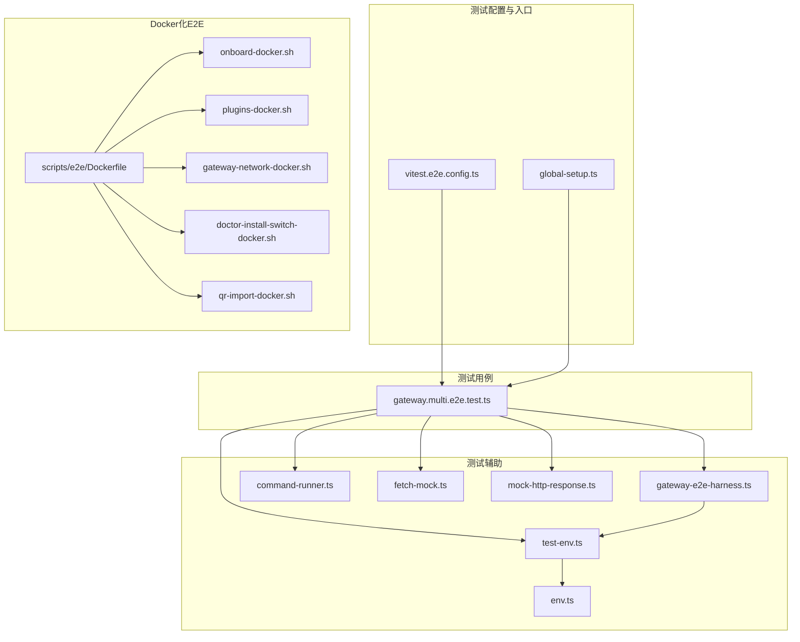
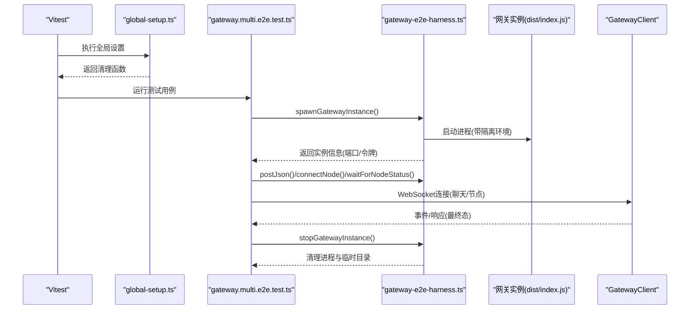
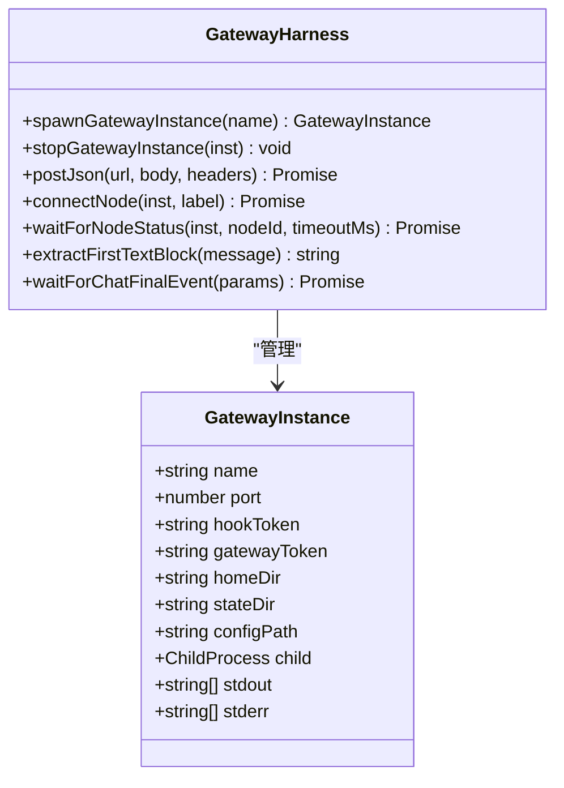
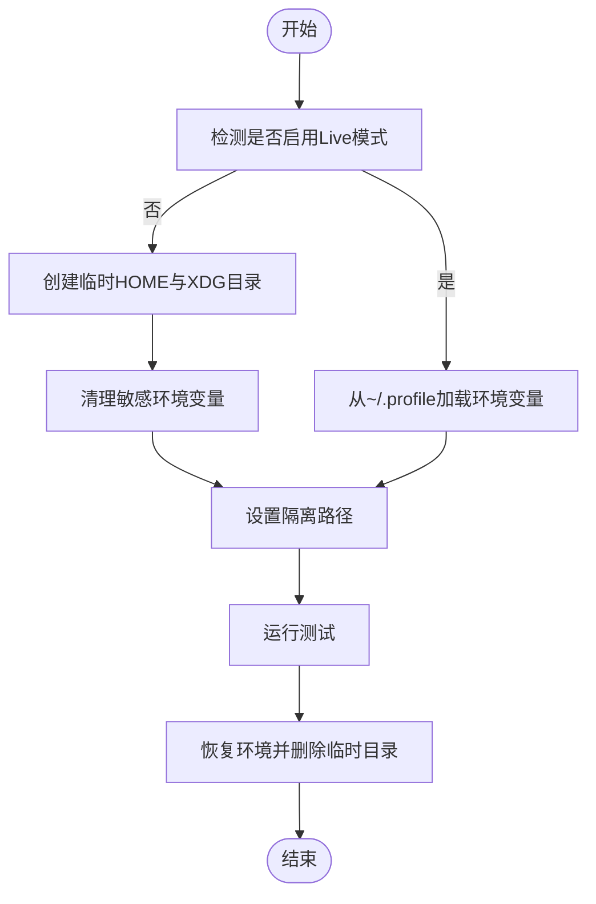
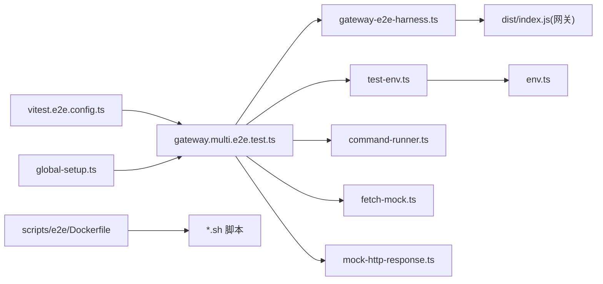

# 端到端测试实践

<cite>
**本文引用的文件**
- [vitest.e2e.config.ts](file://vitest.e2e.config.ts)
- [gateway.multi.e2e.test.ts](file://test/gateway.multi.e2e.test.ts)
- [global-setup.ts](file://test/global-setup.ts)
- [gateway-e2e-harness.ts](file://test/helpers/gateway-e2e-harness.ts)
- [test-env.ts](file://test/test-env.ts)
- [env.ts](file://src/test-utils/env.ts)
- [command-runner.ts](file://src/test-utils/command-runner.ts)
- [fetch-mock.ts](file://src/test-utils/fetch-mock.ts)
- [mock-http-response.ts](file://src/test-utils/mock-http-response.ts)
- [Dockerfile](file://scripts/e2e/Dockerfile)
- [onboard-docker.sh](file://scripts/e2e/onboard-docker.sh)
- [plugins-docker.sh](file://scripts/e2e/plugins-docker.sh)
- [gateway-network-docker.sh](file://scripts/e2e/gateway-network-docker.sh)
- [doctor-install-switch-docker.sh](file://scripts/e2e/doctor-install-switch-docker.sh)
- [qr-import-docker.sh](file://scripts/e2e/qr-import-docker.sh)
</cite>

## 目录

1. [引言](#引言)
2. [项目结构](#项目结构)
3. [核心组件](#核心组件)
4. [架构总览](#架构总览)
5. [详细组件分析](#详细组件分析)
6. [依赖关系分析](#依赖关系分析)
7. [性能考量](#性能考量)
8. [故障排查指南](#故障排查指南)
9. [结论](#结论)
10. [附录](#附录)

## 引言

本指南面向OpenClaw团队与贡献者，系统化阐述端到端（E2E）测试的框架选择、测试环境配置、浏览器自动化测试实施、用户场景与工作流测试方法、系统完整性测试策略，以及测试用例设计、页面对象模式、测试数据管理、跨平台与移动端测试、Web界面测试、真实用户交互模拟、系统边界测试与性能回归测试等实践。文档同时提供调试工具、截图录制与视频回放的使用建议，帮助在CI与本地环境中稳定高效地运行E2E测试。

## 项目结构

OpenClaw的E2E测试以Vitest为主框架，结合自研网关实例编排与测试环境隔离工具，形成“进程级+网络级+环境隔离”的完整测试体系。关键位置如下：

- 测试配置：vitest.e2e.config.ts
- 入口全局设置：test/global-setup.ts
- 网关实例编排与客户端：test/helpers/gateway-e2e-harness.ts
- 测试用例：test/gateway.multi.e2e.test.ts
- 测试环境隔离：test/test-env.ts、src/test-utils/env.ts
- CLI命令行执行器：src/test-utils/command-runner.ts
- HTTP请求模拟工具：src/test-utils/fetch-mock.ts、src/test-utils/mock-http-response.ts
- Docker化E2E脚本：scripts/e2e/\*.sh 与 scripts/e2e/Dockerfile

图表来源

- [vitest.e2e.config.ts](file://vitest.e2e.config.ts#L1-L31)
- [global-setup.ts](file://test/global-setup.ts#L1-L7)
- [gateway.multi.e2e.test.ts](file://test/gateway.multi.e2e.test.ts#L1-L126)
- [gateway-e2e-harness.ts](file://test/helpers/gateway-e2e-harness.ts#L1-L396)
- [test-env.ts](file://test/test-env.ts#L54-L148)
- [env.ts](file://src/test-utils/env.ts#L1-L73)
- [command-runner.ts](file://src/test-utils/command-runner.ts#L1-L11)
- [fetch-mock.ts](file://src/test-utils/fetch-mock.ts#L1-L23)
- [mock-http-response.ts](file://src/test-utils/mock-http-response.ts#L1-L26)
- [Dockerfile](file://scripts/e2e/Dockerfile)
- [onboard-docker.sh](file://scripts/e2e/onboard-docker.sh)
- [plugins-docker.sh](file://scripts/e2e/plugins-docker.sh)
- [gateway-network-docker.sh](file://scripts/e2e/gateway-network-docker.sh)
- [doctor-install-switch-docker.sh](file://scripts/e2e/doctor-install-switch-docker.sh)
- [qr-import-docker.sh](file://scripts/e2e/qr-import-docker.sh)

章节来源

- [vitest.e2e.config.ts](file://vitest.e2e.config.ts#L1-L31)
- [global-setup.ts](file://test/global-setup.ts#L1-L7)
- [gateway.multi.e2e.test.ts](file://test/gateway.multi.e2e.test.ts#L1-L126)
- [gateway-e2e-harness.ts](file://test/helpers/gateway-e2e-harness.ts#L1-L396)
- [test-env.ts](file://test/test-env.ts#L54-L148)
- [env.ts](file://src/test-utils/env.ts#L1-L73)
- [command-runner.ts](file://src/test-utils/command-runner.ts#L1-L11)
- [fetch-mock.ts](file://src/test-utils/fetch-mock.ts#L1-L23)
- [mock-http-response.ts](file://src/test-utils/mock-http-response.ts#L1-L26)
- [Dockerfile](file://scripts/e2e/Dockerfile)
- [onboard-docker.sh](file://scripts/e2e/onboard-docker.sh)
- [plugins-docker.sh](file://scripts/e2e/plugins-docker.sh)
- [gateway-network-docker.sh](file://scripts/e2e/gateway-network-docker.sh)
- [doctor-install-switch-docker.sh](file://scripts/e2e/doctor-install-switch-docker.sh)
- [qr-import-docker.sh](file://scripts/e2e/qr-import-docker.sh)

## 核心组件

- 测试框架与并行度控制：基于Vitest的E2E配置，支持按CPU核数动态计算默认并发工人数量，并允许通过环境变量覆盖；默认静默输出，可通过环境变量开启详细日志。
- 网关实例编排：通过spawn启动独立的网关进程，自动分配端口、生成令牌、写入临时配置、捕获标准输出/错误，提供超时等待监听端口、连接状态轮询、节点配对验证、聊天事件最终态等待等能力。
- 测试环境隔离：安装测试环境时将HOME与XDG系列路径重定向至临时目录，清理敏感环境变量，避免污染真实用户状态；支持可选的“Live”模式加载用户真实环境。
- 命令行执行器：封装CLI注册与解析流程，便于在测试中以真实CLI方式触发子命令。
- HTTP请求模拟：提供fetch预连接包装与HTTP响应模拟器，便于在单元与集成层快速构建可控的网络行为。
- Docker化E2E：提供多类脚本与Dockerfile，用于在容器内完成网关初始化、插件安装、网络连通性检查、QR导入等端到端流程。

章节来源

- [vitest.e2e.config.ts](file://vitest.e2e.config.ts#L1-L31)
- [gateway-e2e-harness.ts](file://test/helpers/gateway-e2e-harness.ts#L101-L188)
- [test-env.ts](file://test/test-env.ts#L54-L148)
- [env.ts](file://src/test-utils/env.ts#L1-L73)
- [command-runner.ts](file://src/test-utils/command-runner.ts#L1-L11)
- [fetch-mock.ts](file://src/test-utils/fetch-mock.ts#L1-L23)
- [mock-http-response.ts](file://src/test-utils/mock-http-response.ts#L1-L26)
- [Dockerfile](file://scripts/e2e/Dockerfile)

## 架构总览

下图展示一次典型E2E测试的调用链：Vitest驱动测试用例，用例通过全局设置安装隔离环境，随后使用网关编排工具启动多个网关实例，再通过HTTP与WebSocket与实例交互，最后在afterAll阶段回收资源。

图表来源

- [global-setup.ts](file://test/global-setup.ts#L1-L7)
- [gateway.multi.e2e.test.ts](file://test/gateway.multi.e2e.test.ts#L1-L126)
- [gateway-e2e-harness.ts](file://test/helpers/gateway-e2e-harness.ts#L101-L188)
- [gateway-e2e-harness.ts](file://test/helpers/gateway-e2e-harness.ts#L217-L260)
- [gateway-e2e-harness.ts](file://test/helpers/gateway-e2e-harness.ts#L262-L285)
- [gateway-e2e-harness.ts](file://test/helpers/gateway-e2e-harness.ts#L336-L359)
- [gateway-e2e-harness.ts](file://test/helpers/gateway-e2e-harness.ts#L190-L215)

## 详细组件分析

### 组件A：网关实例编排与客户端

- 实例生命周期：spawn/stop，自动端口分配、配置写入、输出收集、异常回滚。
- 连接与状态：WebSocket客户端握手、连接错误处理、节点列表轮询、最终聊天事件等待。
- 工具函数：HTTP JSON POST、消息体提取首段文本、超时等待逻辑。

图表来源

- [gateway-e2e-harness.ts](file://test/helpers/gateway-e2e-harness.ts#L25-L36)
- [gateway-e2e-harness.ts](file://test/helpers/gateway-e2e-harness.ts#L101-L188)
- [gateway-e2e-harness.ts](file://test/helpers/gateway-e2e-harness.ts#L190-L215)
- [gateway-e2e-harness.ts](file://test/helpers/gateway-e2e-harness.ts#L217-L260)
- [gateway-e2e-harness.ts](file://test/helpers/gateway-e2e-harness.ts#L262-L285)
- [gateway-e2e-harness.ts](file://test/helpers/gateway-e2e-harness.ts#L336-L359)
- [gateway-e2e-harness.ts](file://test/helpers/gateway-e2e-harness.ts#L377-L395)

章节来源

- [gateway-e2e-harness.ts](file://test/helpers/gateway-e2e-harness.ts#L1-L396)

### 组件B：测试环境隔离与恢复

- 安装测试环境：创建临时HOME与XDG目录，清理敏感变量，避免与真实用户状态冲突。
- 恢复机制：记录原始环境快照，在测试结束后恢复。
- Live模式：当开启实时测试标志时，从用户shell加载profile，保留真实环境。

图表来源

- [test-env.ts](file://test/test-env.ts#L54-L148)
- [env.ts](file://src/test-utils/env.ts#L1-L73)

章节来源

- [test-env.ts](file://test/test-env.ts#L54-L148)
- [env.ts](file://src/test-utils/env.ts#L1-L73)

### 组件C：CLI命令行执行器

- 将已注册的Commander程序以异步方式解析argv，便于在测试中直接调用CLI命令并断言其行为。

章节来源

- [command-runner.ts](file://src/test-utils/command-runner.ts#L1-L11)

### 组件D：HTTP请求模拟与响应构造

- fetch预连接包装：为测试提供可注入的预连接能力接口。
- HTTP响应模拟：构造符合Node内置ServerResponse的模拟对象，便于在不发起真实网络请求的情况下进行断言。

章节来源

- [fetch-mock.ts](file://src/test-utils/fetch-mock.ts#L1-L23)
- [mock-http-response.ts](file://src/test-utils/mock-http-response.ts#L1-L26)

### 组件E：Docker化E2E脚本与镜像

- Dockerfile：定义容器内运行E2E所需的最小基础环境。
- onboard-docker.sh：引导设备/账户初始化流程。
- plugins-docker.sh：安装与启用插件生态。
- gateway-network-docker.sh：检查网关网络连通性。
- doctor-install-switch-docker.sh：诊断与切换安装源。
- qr-import-docker.sh：二维码导入流程。

章节来源

- [Dockerfile](file://scripts/e2e/Dockerfile)
- [onboard-docker.sh](file://scripts/e2e/onboard-docker.sh)
- [plugins-docker.sh](file://scripts/e2e/plugins-docker.sh)
- [gateway-network-docker.sh](file://scripts/e2e/gateway-network-docker.sh)
- [doctor-install-switch-docker.sh](file://scripts/e2e/doctor-install-switch-docker.sh)
- [qr-import-docker.sh](file://scripts/e2e/qr-import-docker.sh)

## 依赖关系分析

- 测试配置依赖Vitest基础配置，扩展include/exclude规则与并发参数。
- 测试用例依赖全局设置与网关编排工具，后者进一步依赖网关二进制与WebSocket客户端。
- 环境隔离工具被全局设置与测试用例共同依赖，确保测试可重复且无副作用。
- Docker脚本与Dockerfile构成容器化执行环境，支撑跨平台与CI稳定性。

图表来源

- [vitest.e2e.config.ts](file://vitest.e2e.config.ts#L1-L31)
- [gateway.multi.e2e.test.ts](file://test/gateway.multi.e2e.test.ts#L1-L126)
- [global-setup.ts](file://test/global-setup.ts#L1-L7)
- [gateway-e2e-harness.ts](file://test/helpers/gateway-e2e-harness.ts#L1-L396)
- [test-env.ts](file://test/test-env.ts#L54-L148)
- [env.ts](file://src/test-utils/env.ts#L1-L73)
- [command-runner.ts](file://src/test-utils/command-runner.ts#L1-L11)
- [fetch-mock.ts](file://src/test-utils/fetch-mock.ts#L1-L23)
- [mock-http-response.ts](file://src/test-utils/mock-http-response.ts#L1-L26)
- [Dockerfile](file://scripts/e2e/Dockerfile)

章节来源

- [vitest.e2e.config.ts](file://vitest.e2e.config.ts#L1-L31)
- [gateway.multi.e2e.test.ts](file://test/gateway.multi.e2e.test.ts#L1-L126)
- [global-setup.ts](file://test/global-setup.ts#L1-L7)
- [gateway-e2e-harness.ts](file://test/helpers/gateway-e2e-harness.ts#L1-L396)
- [test-env.ts](file://test/test-env.ts#L54-L148)
- [env.ts](file://src/test-utils/env.ts#L1-L73)
- [command-runner.ts](file://src/test-utils/command-runner.ts#L1-L11)
- [fetch-mock.ts](file://src/test-utils/fetch-mock.ts#L1-L23)
- [mock-http-response.ts](file://src/test-utils/mock-http-response.ts#L1-L26)
- [Dockerfile](file://scripts/e2e/Dockerfile)

## 性能考量

- 并发与确定性：默认单工人或按CPU核数比例限制并发，CI中进一步限制最大并发，保证测试确定性与资源占用可控。
- 超时与轮询：针对端口监听、节点配对、聊天事件等场景设置合理超时与轮询间隔，避免长耗时阻塞。
- 隔离与清理：通过临时HOME与XDG目录隔离状态，测试后彻底清理，减少跨用例干扰。
- 网络与I/O：在容器内运行E2E，减少宿主机环境差异带来的不稳定因素。

章节来源

- [vitest.e2e.config.ts](file://vitest.e2e.config.ts#L6-L14)
- [gateway-e2e-harness.ts](file://test/helpers/gateway-e2e-harness.ts#L38-L42)
- [gateway-e2e-harness.ts](file://test/helpers/gateway-e2e-harness.ts#L62-L99)
- [gateway-e2e-harness.ts](file://test/helpers/gateway-e2e-harness.ts#L336-L359)
- [test-env.ts](file://test/test-env.ts#L94-L148)

## 故障排查指南

- 网关未监听端口：检查spawn返回的stdout/stderr，定位启动失败原因；确认端口分配与防火墙策略。
- 连接/握手失败：查看WebSocket连接错误回调与关闭原因，确认令牌与绑定地址正确。
- 节点未配对：通过轮询node.list直到connected与paired均为true，必要时增加超时时间。
- 聊天事件未达最终态：检查events数组中runId与sessionKey匹配，逐步打印中间事件以定位卡点。
- 环境污染：若出现真实密钥泄漏或真实状态影响，确认是否误用Live模式或未正确清理临时HOME/XDG。
- Docker环境问题：使用对应脚本逐项验证网络、安装与导入流程，必要时在容器内手动复现问题。

章节来源

- [gateway-e2e-harness.ts](file://test/helpers/gateway-e2e-harness.ts#L62-L99)
- [gateway-e2e-harness.ts](file://test/helpers/gateway-e2e-harness.ts#L336-L359)
- [gateway-e2e-harness.ts](file://test/helpers/gateway-e2e-harness.ts#L377-L395)
- [test-env.ts](file://test/test-env.ts#L54-L148)
- [onboard-docker.sh](file://scripts/e2e/onboard-docker.sh)
- [plugins-docker.sh](file://scripts/e2e/plugins-docker.sh)
- [gateway-network-docker.sh](file://scripts/e2e/gateway-network-docker.sh)
- [doctor-install-switch-docker.sh](file://scripts/e2e/doctor-install-switch-docker.sh)
- [qr-import-docker.sh](file://scripts/e2e/qr-import-docker.sh)

## 结论

OpenClaw的E2E测试体系以Vitest为核心，结合进程级网关实例编排、严格的环境隔离与容器化执行，实现了高可靠性与可维护性的端到端验证。通过明确的生命周期管理、超时与轮询策略、以及丰富的调试手段，团队可以在本地与CI中稳定运行覆盖用户场景、工作流与系统完整性的测试集，并为后续扩展浏览器自动化与移动端测试奠定基础。

## 附录

### 测试用例设计与页面对象模式

- 用户场景测试：围绕真实用户路径（如登录、初始化、插件安装、消息发送）编写场景化用例，拆分前置条件、步骤与断言。
- 工作流测试：将多步骤操作串联为端到端工作流，使用事件收集与最终态等待确保顺序一致性。
- 页面对象模式：抽象页面元素与交互动作，将定位策略与业务操作解耦，提升用例可读性与可维护性。

### 测试数据管理

- 使用临时HOME与XDG目录隔离配置与状态，避免跨用例污染。
- 对于外部服务（如Telegram、Slack等），在非Live模式下清理令牌，仅在Live模式下加载真实凭据。
- 使用随机化标识（如UUID）避免并发测试中的会话键冲突。

### 跨平台与移动端测试

- 在Linux/macOS/Windows上分别验证网关行为与CLI交互。
- 移动端测试可借助容器内浏览器或专用移动测试平台，结合WebSocket与HTTP接口验证消息流转。

### Web界面测试

- 通过HTTP接口与WebSocket事件验证UI背后的数据流与状态变更。
- 如需UI截图或视频回放，可在CI中集成截图与录制工具，并将产物归档以便回溯。

### 真实用户交互与系统边界测试

- 使用GatewayClient模拟真实客户端行为，覆盖不同平台与模式（CLI、Node、系统命令等）。
- 边界测试包括：空输入、超长文本、异常网络、并发请求、资源耗尽等场景。

### 性能回归测试

- 在相同硬件与容器环境下重复运行关键E2E用例，记录启动时间、事件到达延迟、内存占用等指标。
- 将结果纳入CI报告，建立阈值告警，防止回归。
