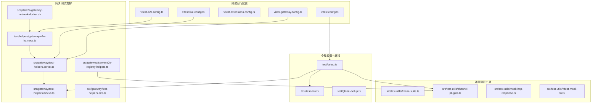
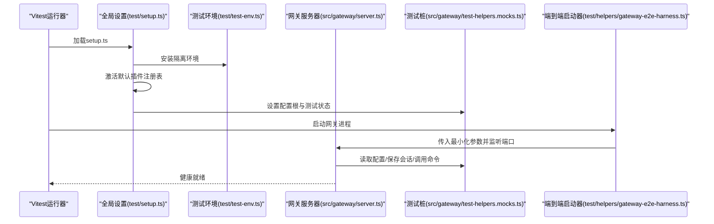
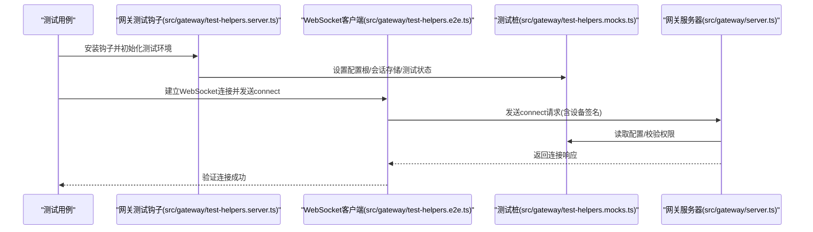
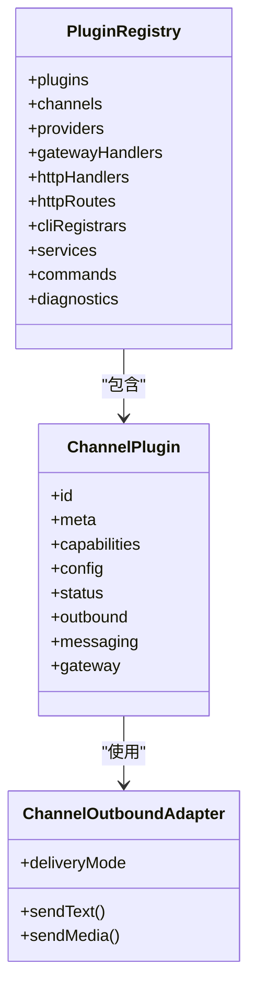
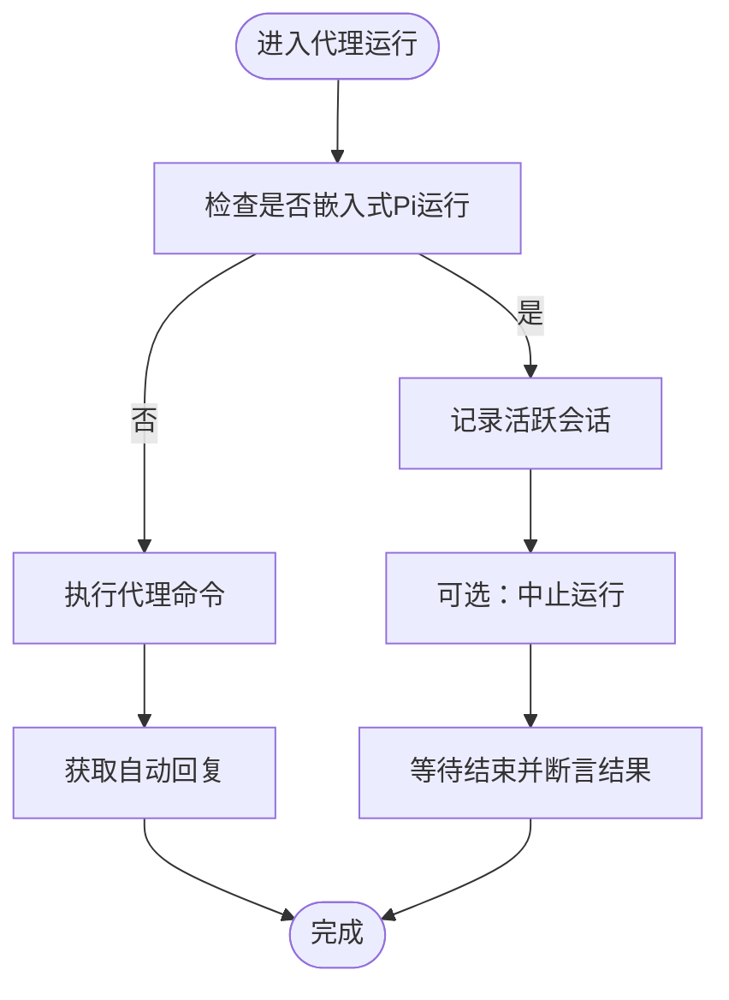
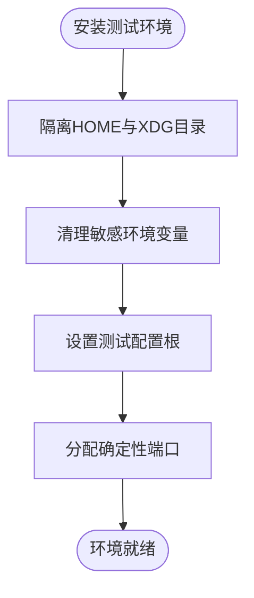
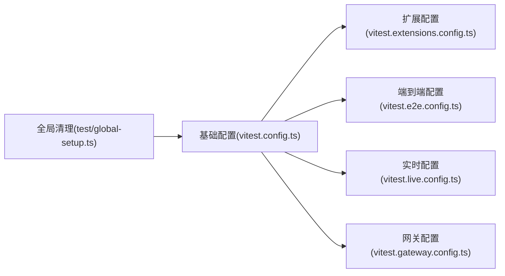
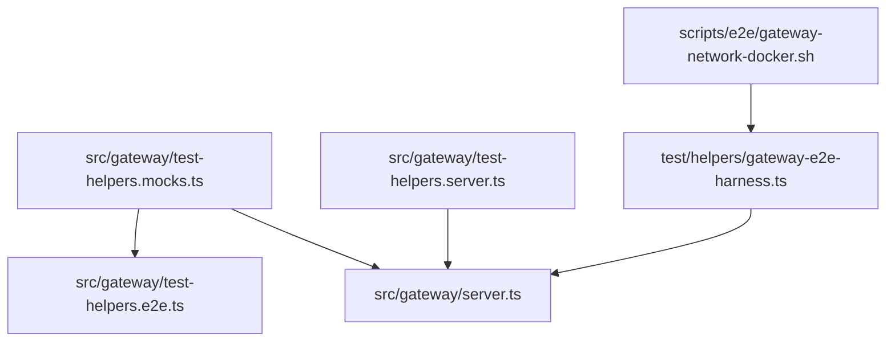

# 集成测试实践

<cite>
**本文引用的文件**
- [vitest.config.ts](file://vitest.config.ts)
- [vitest.e2e.config.ts](file://vitest.e2e.config.ts)
- [vitest.extensions.config.ts](file://vitest.extensions.config.ts)
- [vitest.live.config.ts](file://vitest.live.config.ts)
- [vitest.gateway.config.ts](file://vitest.gateway.config.ts)
- [test/setup.ts](file://test/setup.ts)
- [test/test-env.ts](file://test/test-env.ts)
- [test/global-setup.ts](file://test/global-setup.ts)
- [src/test-utils/fixture-suite.ts](file://src/test-utils/fixture-suite.ts)
- [src/test-utils/channel-plugins.ts](file://src/test-utils/channel-plugins.ts)
- [src/gateway/test-helpers.mocks.ts](file://src/gateway/test-helpers.mocks.ts)
- [src/gateway/test-helpers.server.ts](file://src/gateway/test-helpers.server.ts)
- [src/gateway/server.e2e-registry-helpers.ts](file://src/gateway/server.e2e-registry-helpers.ts)
- [src/gateway/test-helpers.e2e.ts](file://src/gateway/test-helpers.e2e.ts)
- [test/helpers/gateway-e2e-harness.ts](file://test/helpers/gateway-e2e-harness.ts)
- [scripts/e2e/gateway-network-docker.sh](file://scripts/e2e/gateway-network-docker.sh)
- [src/commands/onboard-helpers.ts](file://src/commands/onboard-helpers.ts)
- [src/test-utils/mock-http-response.ts](file://src/test-utils/mock-http-response.ts)
- [src/test-utils/vitest-mock-fn.ts](file://src/test-utils/vitest-mock-fn.ts)
- [extensions/memory-lancedb/index.test.ts](file://extensions/memory-lancedb/index.test.ts)
- [src/memory/embedding.test-mocks.ts](file://src/memory/embedding.test-mocks.ts)
- [src/agents/subagent-registry.mocks.shared.ts](file://src/agents/subagent-registry.mocks.shared.ts)
- [src/commands/zai-endpoint-detect.ts](file://src/commands/zai-endpoint-detect.ts)
- [src/agents/api-key-rotation.ts](file://src/agents/api-key-rotation.ts)
- [docs/help/testing.md](file://docs/help/testing.md)
</cite>

## 目录

1. [引言](#引言)
2. [项目结构](#项目结构)
3. [核心组件](#核心组件)
4. [架构总览](#架构总览)
5. [详细组件分析](#详细组件分析)
6. [依赖分析](#依赖分析)
7. [性能考虑](#性能考虑)
8. [故障排查指南](#故障排查指南)
9. [结论](#结论)
10. [附录](#附录)

## 引言

本指南面向OpenClaw项目的集成测试实践，聚焦以下目标：

- 网关系统集成测试：覆盖WebSocket协议、设备认证、会话存储、插件加载等端到端路径
- 频道适配器集成测试：通过测试注册表与出站适配器桩，验证消息发送与账户解析
- 代理系统集成测试：验证代理事件、子代理运行、嵌入式Pi运行等
- 外部依赖模拟：通过集中式测试桩与环境隔离，避免真实网络与硬件访问
- 测试套件组织与执行：基于多套vitest配置文件的并行与隔离策略
- 数据库与API集成测试：通过会话存储与HTTP响应模拟，验证读写与路由
- 插件集成测试：通过临时目录与插件清单，验证加载与槽位管理
- 调试技巧与性能优化：统一超时、并发与日志级别控制，提升稳定性与速度

## 项目结构

OpenClaw采用多配置的Vitest运行体系，结合测试环境隔离与集中式桩模块，支撑从单元到端到端的全链路测试。

**图表来源**

- [vitest.config.ts](file://vitest.config.ts#L12-L53)
- [vitest.e2e.config.ts](file://vitest.e2e.config.ts#L20-L30)
- [vitest.extensions.config.ts](file://vitest.extensions.config.ts#L8-L15)
- [vitest.live.config.ts](file://vitest.live.config.ts#L8-L16)
- [vitest.gateway.config.ts](file://vitest.gateway.config.ts#L8-L14)
- [test/setup.ts](file://test/setup.ts#L24-L33)
- [test/test-env.ts](file://test/test-env.ts#L54-L142)
- [src/gateway/test-helpers.mocks.ts](file://src/gateway/test-helpers.mocks.ts#L297-L541)
- [src/gateway/test-helpers.server.ts](file://src/gateway/test-helpers.server.ts#L93-L113)
- [src/gateway/server.e2e-registry-helpers.ts](file://src/gateway/server.e2e-registry-helpers.ts#L1-L1)
- [src/gateway/test-helpers.e2e.ts](file://src/gateway/test-helpers.e2e.ts#L141-L189)
- [test/helpers/gateway-e2e-harness.ts](file://test/helpers/gateway-e2e-harness.ts#L120-L163)
- [scripts/e2e/gateway-network-docker.sh](file://scripts/e2e/gateway-network-docker.sh#L36-L79)

**章节来源**

- [vitest.config.ts](file://vitest.config.ts#L12-L53)
- [test/setup.ts](file://test/setup.ts#L24-L33)
- [test/test-env.ts](file://test/test-env.ts#L54-L142)

## 核心组件

- 测试环境隔离：通过临时HOME与XDG目录、删除敏感环境变量，确保测试不污染用户状态
- 默认插件注册表：在每个测试前激活默认通道桩（Discord、Slack、Telegram、WhatsApp、Signal、iMessage），便于频道适配器测试
- 网关测试桩：集中mock配置读取、会话保存、自动回复、命令执行、Pi模型发现等，屏蔽真实外部依赖
- 端到端网关启动器：以最小化参数启动网关进程，等待端口开放并进行健康检查
- 测试夹具：提供临时目录与用例目录生成，支持清理回收

**章节来源**

- [test/test-env.ts](file://test/test-env.ts#L54-L142)
- [test/setup.ts](file://test/setup.ts#L128-L179)
- [src/gateway/test-helpers.mocks.ts](file://src/gateway/test-helpers.mocks.ts#L297-L541)
- [test/helpers/gateway-e2e-harness.ts](file://test/helpers/gateway-e2e-harness.ts#L120-L163)
- [src/test-utils/fixture-suite.ts](file://src/test-utils/fixture-suite.ts#L5-L28)

## 架构总览

下图展示从测试入口到网关服务器、再到外部依赖模拟的整体流程。

**图表来源**

- [test/setup.ts](file://test/setup.ts#L24-L33)
- [test/test-env.ts](file://test/test-env.ts#L54-L142)
- [src/gateway/test-helpers.mocks.ts](file://src/gateway/test-helpers.mocks.ts#L297-L541)
- [test/helpers/gateway-e2e-harness.ts](file://test/helpers/gateway-e2e-harness.ts#L120-L163)

## 详细组件分析

### 网关系统集成测试

- 环境与钩子：安装网关测试钩子，按套件或测试粒度重置配置根、会话存储、计时器与系统事件
- 设备认证与连接：通过测试桩构建设备签名负载，发起WebSocket“connect”请求，校验响应
- 会话存储：提供写入会话存储的辅助函数，支持按主键与代理键组合写入
- 最小化网关：通过环境变量跳过浏览器控制、Gmail watcher、Canvas Host、频道与提供者，降低外部依赖

**图表来源**

- [src/gateway/test-helpers.server.ts](file://src/gateway/test-helpers.server.ts#L187-L200)
- [src/gateway/test-helpers.e2e.ts](file://src/gateway/test-helpers.e2e.ts#L141-L189)
- [src/gateway/test-helpers.mocks.ts](file://src/gateway/test-helpers.mocks.ts#L297-L541)

**章节来源**

- [src/gateway/test-helpers.server.ts](file://src/gateway/test-helpers.server.ts#L93-L113)
- [src/gateway/test-helpers.server.ts](file://src/gateway/test-helpers.server.ts#L115-L166)
- [src/gateway/test-helpers.e2e.ts](file://src/gateway/test-helpers.e2e.ts#L141-L189)
- [src/gateway/test-helpers.mocks.ts](file://src/gateway/test-helpers.mocks.ts#L297-L541)

### 频道适配器集成测试

- 测试注册表：提供可注入的通道插件集合，默认包含多种通道桩，便于断言账户解析与出站发送
- 出站适配器桩：为不同通道提供统一的sendText/sendMedia接口，返回稳定的消息ID，屏蔽真实网络
- 默认注册表：在每个测试前激活，避免跨文件污染；如需自定义，可在测试中显式设置

**图表来源**

- [src/test-utils/channel-plugins.ts](file://src/test-utils/channel-plugins.ts#L15-L29)
- [src/test-utils/channel-plugins.ts](file://src/test-utils/channel-plugins.ts#L31-L52)
- [test/setup.ts](file://test/setup.ts#L128-L179)

**章节来源**

- [src/test-utils/channel-plugins.ts](file://src/test-utils/channel-plugins.ts#L15-L29)
- [test/setup.ts](file://test/setup.ts#L128-L179)

### 代理系统集成测试

- 子代理与事件：通过集中式mock，拦截代理事件与调用，便于断言事件流与执行序列
- 嵌入式Pi运行：提供活跃会话、中止与等待的mock，支持对嵌入式运行生命周期的断言
- 自动回复与命令：通过mock自动回复与命令执行，验证代理在不同上下文下的行为

**图表来源**

- [src/gateway/test-helpers.mocks.ts](file://src/gateway/test-helpers.mocks.ts#L543-L559)
- [src/gateway/test-helpers.mocks.ts](file://src/gateway/test-helpers.mocks.ts#L583-L588)

**章节来源**

- [src/agents/subagent-registry.mocks.shared.ts](file://src/agents/subagent-registry.mocks.shared.ts#L5-L15)
- [src/gateway/test-helpers.mocks.ts](file://src/gateway/test-helpers.mocks.ts#L543-L559)
- [src/gateway/test-helpers.mocks.ts](file://src/gateway/test-helpers.mocks.ts#L583-L588)

### 外部依赖模拟与测试数据准备

- 环境隔离：安装测试环境时，将HOME/XDG目录指向临时位置，并删除可能泄漏真实凭据的环境变量
- 配置与会话：通过测试桩重写配置读取与写入，将配置文件写入测试专属路径，避免污染真实状态
- HTTP响应模拟：提供可复用的ServerResponse模拟对象，用于断言中间件与路由行为
- 固定端口块：提供确定性空闲端口分配，减少端口冲突

**图表来源**

- [test/test-env.ts](file://test/test-env.ts#L54-L142)
- [src/gateway/test-helpers.mocks.ts](file://src/gateway/test-helpers.mocks.ts#L297-L541)
- [src/test-utils/mock-http-response.ts](file://src/test-utils/mock-http-response.ts#L3-L24)

**章节来源**

- [test/test-env.ts](file://test/test-env.ts#L54-L142)
- [src/gateway/test-helpers.mocks.ts](file://src/gateway/test-helpers.mocks.ts#L297-L541)
- [src/test-utils/mock-http-response.ts](file://src/test-utils/mock-http-response.ts#L3-L24)

### 测试套件组织、顺序控制与清理策略

- 多套配置：基础配置、扩展配置、端到端配置、实时配置分别针对不同测试类型与并发需求
- 并发与池：基础测试使用forks池，端到端使用vmForks池，限制最大工作线程数，避免资源争用
- 全局清理：全局setup负责安装测试环境并在退出时清理，确保进程级隔离

**图表来源**

- [vitest.config.ts](file://vitest.config.ts#L12-L53)
- [vitest.e2e.config.ts](file://vitest.e2e.config.ts#L20-L30)
- [vitest.extensions.config.ts](file://vitest.extensions.config.ts#L8-L15)
- [vitest.live.config.ts](file://vitest.live.config.ts#L8-L16)
- [vitest.gateway.config.ts](file://vitest.gateway.config.ts#L8-L14)
- [test/global-setup.ts](file://test/global-setup.ts#L3-L6)

**章节来源**

- [vitest.config.ts](file://vitest.config.ts#L34-L35)
- [vitest.e2e.config.ts](file://vitest.e2e.config.ts#L24-L26)
- [test/global-setup.ts](file://test/global-setup.ts#L3-L6)

### 数据库集成测试（会话存储）

- 写入会话存储：提供便捷函数，支持按请求键与代理键组合写入，便于断言历史与上下文
- 配置根隔离：测试配置写入到临时目录，避免与真实状态冲突

**章节来源**

- [src/gateway/test-helpers.server.ts](file://src/gateway/test-helpers.server.ts#L65-L91)
- [src/gateway/test-helpers.mocks.ts](file://src/gateway/test-helpers.mocks.ts#L369-L374)

### API集成测试（HTTP与WebSocket）

- HTTP响应模拟：通过模拟ServerResponse断言路由与中间件行为
- WebSocket端到端：通过最小化网关启动器与健康检查脚本，验证网络连通性与服务可用性

**章节来源**

- [src/test-utils/mock-http-response.ts](file://src/test-utils/mock-http-response.ts#L3-L24)
- [test/helpers/gateway-e2e-harness.ts](file://test/helpers/gateway-e2e-harness.ts#L120-L163)
- [scripts/e2e/gateway-network-docker.sh](file://scripts/e2e/gateway-network-docker.sh#L36-L79)

### 插件集成测试

- 测试注册表：通过createTestRegistry注入通道插件，验证插件加载与能力声明
- 记忆插件示例：内存插件测试展示了如何在测试中注册工具、CLI与服务
- 应用测试默认：applyTestPluginDefaults在测试环境下自动禁用未显式配置的记忆槽位，避免干扰

**章节来源**

- [src/test-utils/channel-plugins.ts](file://src/test-utils/channel-plugins.ts#L15-L29)
- [extensions/memory-lancedb/index.test.ts](file://extensions/memory-lancedb/index.test.ts#L228-L269)
- [src/plugins/config-state.ts](file://src/plugins/config-state.ts#L113-L149)

### 处理真实环境交互、网络通信与文件系统

- 真实环境开关：通过环境变量启用真实用户环境（仅限实时测试），其余测试均走隔离环境
- 网络探测：提供探针与轮询工具，等待网关健康响应，避免过早断言
- 文件系统：通过临时目录与配置根隔离，确保读写不会影响用户真实状态

**章节来源**

- [test/test-env.ts](file://test/test-env.ts#L55-L65)
- [src/commands/onboard-helpers.ts](file://src/commands/onboard-helpers.ts#L382-L421)
- [src/gateway/test-helpers.server.ts](file://src/gateway/test-helpers.server.ts#L93-L113)

## 依赖分析

- 组件耦合：测试桩集中于src/gateway/test-helpers.mocks.ts，被服务器与端到端测试广泛依赖
- 外部依赖：通过环境变量与mock屏蔽真实网络与硬件，确保测试稳定
- 循环依赖：测试桩通过延迟导入与模块缓存避免循环依赖问题

**图表来源**

- [src/gateway/test-helpers.mocks.ts](file://src/gateway/test-helpers.mocks.ts#L297-L541)
- [src/gateway/test-helpers.server.ts](file://src/gateway/test-helpers.server.ts#L38-L44)
- [test/helpers/gateway-e2e-harness.ts](file://test/helpers/gateway-e2e-harness.ts#L120-L163)
- [scripts/e2e/gateway-network-docker.sh](file://scripts/e2e/gateway-network-docker.sh#L36-L79)

**章节来源**

- [src/gateway/test-helpers.mocks.ts](file://src/gateway/test-helpers.mocks.ts#L297-L541)
- [src/gateway/test-helpers.server.ts](file://src/gateway/test-helpers.server.ts#L38-L44)

## 性能考虑

- 工作线程：根据CI/本地平台动态调整最大工作线程数，避免过度并发导致OOM
- 超时与日志：统一设置测试与钩子超时，必要时降低日志级别以减少输出开销
- 确定性端口：使用确定性端口块，减少端口扫描与冲突
- 并发池选择：基础测试使用forks池，端到端使用vmForks池，平衡隔离与性能

**章节来源**

- [vitest.config.ts](file://vitest.config.ts#L26-L35)
- [vitest.e2e.config.ts](file://vitest.e2e.config.ts#L8-L15)
- [src/gateway/test-helpers.server.ts](file://src/gateway/test-helpers.server.ts#L187-L200)

## 故障排查指南

- 网关启动失败：检查最小化参数与环境变量，确认端口开放与健康日志
- 网络探测失败：确认探针超时与轮询间隔合理，避免过短导致误判
- 真实环境测试：仅在明确需要时开启真实环境模式，注意凭据与状态隔离
- API密钥轮转：在多密钥场景中，验证重试与错误格式化逻辑

**章节来源**

- [test/helpers/gateway-e2e-harness.ts](file://test/helpers/gateway-e2e-harness.ts#L120-L163)
- [src/commands/onboard-helpers.ts](file://src/commands/onboard-helpers.ts#L406-L421)
- [src/commands/zai-endpoint-detect.ts](file://src/commands/zai-endpoint-detect.ts#L94-L99)
- [src/agents/api-key-rotation.ts](file://src/agents/api-key-rotation.ts#L48-L72)

## 结论

通过统一的测试环境隔离、集中式桩模块与多套vitest配置，OpenClaw实现了从网关、频道适配器到代理系统的全链路集成测试。配合确定性端口、最小化网关与HTTP响应模拟，测试具备高稳定性与可维护性。建议在新增集成点时遵循现有模式：优先使用桩与隔离环境，按需引入端到端与实时测试，并在CI中合理配置并发与超时。

## 附录

- 测试文档参考：未来评估应保持确定性优先，先做CI安全回归，再视情况引入可选实时评估

**章节来源**

- [docs/help/testing.md](file://docs/help/testing.md#L387-L408)
